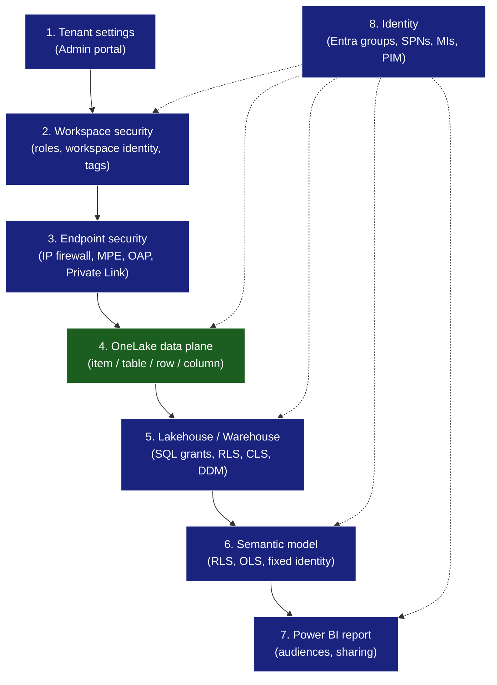

# OneLake Security in Context — A Defense-in-Depth Map

**Last Updated:** `2026-05-28` | **Version:** 1.0.0

> A practical guide to where OneLake security fits among the **eight** Fabric
> security layers. Includes a "what to use when" decision matrix, the
> Direct Lake fallback gotcha, and the canonical configuration vector for
> each layer (UI / REST / T-SQL / Bicep).

---

## The eight layers, at a glance

OneLake security is **one** layer — Layer 4. It is the only layer whose rules
are enforced **uniformly across Spark, the SQL analytics endpoint, Direct Lake
semantic models, and authorized third-party engines**. Every other layer
applies to one engine or one item type.

Source: [Fabric end-to-end security scenario](https://learn.microsoft.com/en-us/fabric/security/security-scenario), [permission model](https://learn.microsoft.com/en-us/fabric/security/permission-model).

---

## Layer-by-layer cheat sheet

### Layer 1 — Tenant settings

| What to tighten | Doc |
|---|---|
| Scope "Service principals can use Fabric APIs" to a group | [tenant settings index](https://learn.microsoft.com/en-us/fabric/admin/tenant-settings-index) |
| Disable Publish-to-Web (or restrict to existing embed codes) | [export sharing](https://learn.microsoft.com/en-us/fabric/admin/service-admin-portal-export-sharing) |
| External data sharing — scope creator + accepter groups | same |
| Block ResourceKey auth for streaming when unused | [developer settings](https://learn.microsoft.com/en-us/fabric/admin/service-admin-portal-developer) |
| Workspace-level outbound network rules | enables OAP |

REST: [`GET /v1/admin/tenantsettings`](https://learn.microsoft.com/en-us/rest/api/fabric/admin/tenants/list-tenant-settings) for inventory; programmatic update is limited — most changes still live in the Admin Portal.

### Layer 2 — Workspace security

- **Roles:** Admin, Member, Contributor, Viewer. Cap: 1,000 principals per workspace; groups count once. [Roles in workspaces](https://learn.microsoft.com/en-us/fabric/fundamentals/roles-workspaces)
- **Workspace identity (GA):** credential-free outbound auth from workspace to Azure resources. Bicep module already in this repo at `infra/modules/security/workspace-identity.bicep`.
- **Workspace tags:** governance/billing classification.
- **Capacity assignment:** `POST /v1/workspaces/{id}/assignToCapacity`.

### Layer 3 — Endpoint security

| Control | When to use |
|---|---|
| Tenant-level Private Link | "All Fabric is private — internet traffic to Fabric blocked." |
| Workspace IP firewall | Allow-list inbound to one workspace from known CIDRs. |
| Managed VNet + managed private endpoints | Outbound from Spark/Data Engineering to firewalled sources. F SKU + trial only. |
| **Outbound Access Protection (OAP)** | Default-deny outbound from the workspace; only allow approved MPEs / Data Connection Rules. |
| **Trusted workspace access** | Tells a firewalled ADLS Gen2 to trust the **workspace identity**; key pattern for Databricks mirror against managed UC storage. |

OAP supports different allow-list mechanisms per workload — they are **not interchangeable**. See the matrix at [OAP overview](https://learn.microsoft.com/en-us/fabric/security/workspace-outbound-access-protection-overview).

### Layer 4 — OneLake security (the unifier)

This is the layer that makes the others optional in many cases. From
[data-access-control-model](https://learn.microsoft.com/en-us/fabric/onelake/security/data-access-control-model):

- Roles = **Type (Grant only)** + **Permission (Read or ReadWrite)** + **Scope (table/folder/schema)** + **Members (Entra)**.
- **Deny-by-default.** A `DefaultReader` role is auto-created with virtual membership for workspace `ReadAll` users.
- **ReadWrite cannot be combined with RLS or CLS** in the same role.
- **RLS is GA. ⚠️ CLS is still Preview** as of April 2026.
- **Cross-engine enforcement** — rules flow to Spark, T-SQL endpoint (in **User identity mode**), Direct Lake semantic models, and authorized third-party engines.

REST: `PUT /v1/workspaces/{ws}/items/{itemId}/dataAccessRoles` ([reference](https://learn.microsoft.com/en-us/rest/api/fabric/core/onelake-data-access-security/create-or-update-data-access-roles)). A complete example with RLS + CLS lives in `tutorials/57-databricks-better-together/notebooks/security/01_apply_defense_in_depth.py`.

### Layer 5 — Lakehouse / Warehouse SQL

- **SQL endpoint security mode** ([sql-analytics-endpoint-onelake-security](https://learn.microsoft.com/en-us/fabric/onelake/security/sql-analytics-endpoint-onelake-security)):
  - **User identity mode** → OneLake rules govern. SQL `GRANT/REVOKE` is **ignored**.
  - **Delegated identity mode** → SQL-native security. Shortcuts to OneLake-secured tables are **blocked**.
- **Warehouse T-SQL controls:**
  - `GRANT / REVOKE / DENY` (object-level)
  - `CREATE SECURITY POLICY` + inline TVF (RLS)
  - `GRANT SELECT ON tbl(col1, col2)` (CLS)
  - `ALTER COLUMN ... ADD MASKED WITH (FUNCTION = '...')` (DDM)
- **DDM mechanics:** admins always see unmasked; non-admins need explicit `GRANT UNMASK`.

### Layer 6 — Semantic model

- **RLS:** DAX filter on role. **Only restricts Viewer**; Admin/Member/Contributor bypass.
- **OLS:** authored via Tabular Editor — table/column permission `None | Read` per role.
- **Multi-role evaluation:** within a role, INTERSECTION of object/row/column rules; across roles, UNION (RLS predicates OR-combined, CLS = set union).
- **SPNs can NOT be members of model roles.** Use **Fixed Identity** for Direct Lake refresh ([service-premium-service-principal](https://learn.microsoft.com/en-us/fabric/enterprise/powerbi/service-premium-service-principal)).
- **TMDL:** Direct Lake partitions use `mode: directLake`; compatibility level `1604` ([direct-lake-develop](https://learn.microsoft.com/en-us/fabric/fundamentals/direct-lake-develop)).

### Layer 7 — Power BI report

- **App audiences** — publish one workspace through multiple lenses.
- **Workspace roles** still govern report ownership/edit. RLS/OLS only restricts **Viewers**.

### Layer 8 — Identity

- Prefer **Entra security groups** at every grant point.
- **SPNs** for unattended automation (REST, fabric-cicd, refresh — paired with Fixed Identity).
- **Managed identities** for Azure-hosted callers writing to OneLake.
- **Workspace identity** for Fabric → Azure outbound (Key Vault, ADLS Gen2, Event Hub).
- Wrap Fabric Admin / Capacity Admin / Tenant Admin roles in **PIM**.

---

## "What do I use when?" — Decision matrix

| Goal | Use the OneLake layer (Layer 4) | Use a higher layer | Reason |
|---|---|---|---|
| Same row filter must apply in Spark, SQL endpoint, **and** Direct Lake | ✅ OneLake RLS | ❌ | Only OneLake security is cross-engine. |
| Hide a single column from Finance users in **all** access paths | ⚠️ OneLake CLS (Preview) | OR Warehouse CLS + semantic model OLS | CLS GA is still pending. |
| Block one team from a whole table without rewriting the table | ✅ OneLake role with table-scoped Deny | Workspace role at most for whole-item | Granularity. |
| Mask only the last 4 of an SSN in *some* queries | ❌ | ✅ Warehouse DDM | DDM is engine-local; OneLake security has no masking primitive. |
| Restrict a Power BI **report** without changing the model | ❌ | ✅ App audience + role assignment | Pure presentation layer. |
| Prevent any data from leaving the workspace's VNet | ❌ | ✅ Layer 3: OAP + MPE + Private Link | Network — not data — control. |
| Block service principals from one workspace | ❌ | ✅ Tenant setting + workspace role posture | Identity, not data. |
| Stop Databricks mirror from exposing PII columns | ✅ OneLake CLS on the mirrored item | OR an **exclusion list** on the mirror itself (Layer 4-adjacent) | UC column masks do NOT carry over the mirror. |

> **Compare and contrast — OneLake vs the other layers:**
>
> - OneLake security is the **only** layer that follows the data. Move a
>   table into a new lakehouse via shortcut? The roles still apply.
> - Warehouse SQL controls are **engine-local** — anything that reads via
>   Spark or Direct Lake doesn't see them.
> - Semantic model security is **viewer-only** in Power BI — anyone with
>   workspace Contributor+ bypasses RLS/OLS at the model level.
> - Network controls (Layer 3) are powerful but coarse — they protect a
>   workspace, not a row.

---

## The Direct Lake fallback gotcha

> **Warehouse RLS / CLS on a table that backs a Direct Lake semantic model
> causes Power BI to silently fall back to DirectQuery for that table.**

Why it matters: Direct Lake's performance promise (no import, no DAX→SQL
translation, sub-second on F64) depends on running fully in VertiPaq. The
moment a Warehouse security policy is involved, the engine has to translate
to T-SQL and round-trip — Direct Lake → DirectQuery.

Mitigation: **lift the same RLS/CLS rules up to OneLake security** (Layer 4)
when you want Direct Lake performance preserved. The unified enforcement
covers Power BI as well as Spark and SQL.

Sources: [data-warehouse/row-level-security](https://learn.microsoft.com/en-us/fabric/data-warehouse/row-level-security), [data-warehouse/dynamic-data-masking](https://learn.microsoft.com/en-us/fabric/data-warehouse/dynamic-data-masking), [direct-lake-develop](https://learn.microsoft.com/en-us/fabric/fundamentals/direct-lake-develop).

---

## Defense-in-depth posture summary

| Layer | Default posture | Hardened posture |
|---|---|---|
| 1 — Tenant | Mixed; SP access broad | Tightened per the table above, SP scoped to groups, PIM on admin roles |
| 2 — Workspace | Members + Viewers; workspace identity off | Workspace identity on; tags applied; capacity assignment via REST |
| 3 — Endpoint | Public + open outbound | Private Link tenant-wide + OAP per workspace + MPE per data source |
| 4 — OneLake | DefaultReader only | RLS roles per persona; CLS (Preview) on sensitive columns; ReadWrite scoped |
| 5 — SQL | Endpoint mode mixed | User identity mode if OneLake rules cover; Delegated mode only when SQL-native rules are required |
| 6 — Semantic | Build-time only | Dynamic RLS via mapping table; Fixed Identity for refresh; OLS for PII |
| 7 — Report | Sharing wide-open | App audiences scoped to Entra groups; sharing disabled |
| 8 — Identity | Direct user grants | Groups only; SPNs scoped; MIs preferred; PIM on admin |

---

## Related

- Tutorial walkthrough: `tutorials/57-databricks-better-together/README.md`
- Companion notebook: `tutorials/57-databricks-better-together/notebooks/security/01_apply_defense_in_depth.py`
- Feature doc — OneLake Security: `docs/features/onelake-security.md`
- Best practice — Identity & RBAC patterns: `docs/best-practices/identity-rbac-patterns.md`
- Best practice — Network security: `docs/best-practices/network-security.md`
