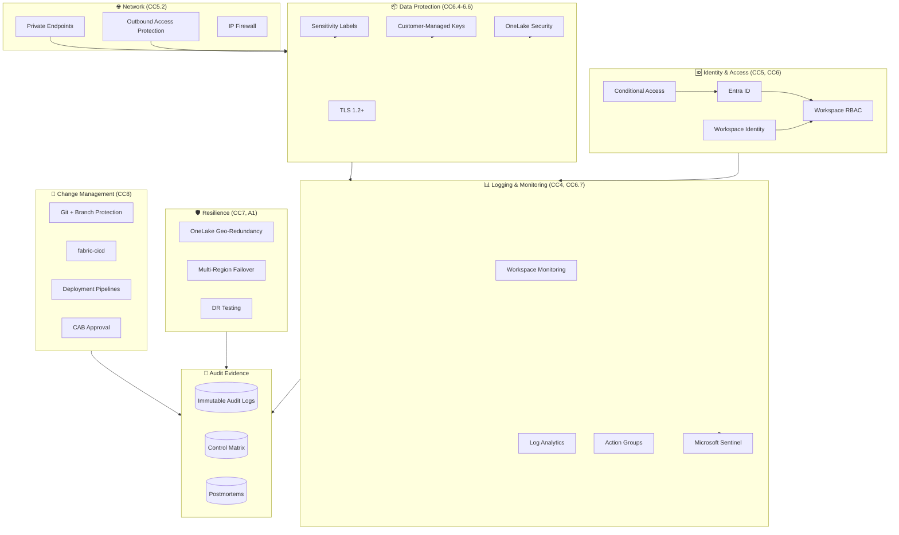

# 🔐 SOC 2 Type II Readiness on Microsoft Fabric

<div align="center" markdown>

**AICPA Trust Services Criteria → Fabric Controls Mapping — Anchor Doc for Wave 5**


</div>

---

**Last Updated:** `2026-04-27` | **Version:** 1.0.0 | **Anchor for:** Wave 5 Security & Compliance doc set

> **Disclaimer:** This document provides architectural and technical guidance for SOC 2 Type II readiness on Microsoft Fabric. It is **not** legal or auditing advice. Engage a qualified CPA firm to perform the actual SOC 2 examination. Verify control mappings with your audit firm before relying on them in an examination.

---

## 🎯 Overview

**SOC 2 Type II** is the gold-standard SaaS security report. It's not a certification — it's an attestation by a CPA firm that, **over a defined examination period** (typically 6-12 months), the service organization's controls operated effectively per the AICPA Trust Services Criteria. Microsoft Fabric customers building SaaS or providing services to enterprise customers face SOC 2 as a routine sales requirement.

### Why SOC 2 Type II Matters for Fabric Workloads

| Pressure | Detail |
|----------|--------|
| Sales gating | Most enterprise procurement teams require a SOC 2 Type II report before onboarding |
| Audit propagation | If you're a sub-processor in your customers' SOC 2 scope, your controls inherit |
| Insurance | Cyber insurance underwriting routinely asks "do you have SOC 2?" |
| Investor due diligence | Series A+ rounds increasingly require it |
| Government contracts | StateRAMP and FedRAMP build on SOC 2 + additional controls |

### What This Document Covers

- Mapping each Trust Services Criterion to a concrete Fabric control or configuration
- Evidence-collection patterns: where audit logs live, what to extract, retention requirements
- Examination-period preparation: 12 months of trailing evidence
- Common gotchas Fabric customers hit during examination
- A control matrix template you can hand to your auditor

> 📝 **Scope:** This is the anchor doc for Phase 14 Wave 5. Sub-topics get their own deep-dive docs: [ISO 27001 mapping](iso27001-mapping.md), [GDPR right to deletion](gdpr-right-to-deletion.md), [CCPA privacy rights](ccpa-privacy-rights.md), [STRIDE threat model](threat-model-stride.md), [zero-trust blueprint](zero-trust-blueprint.md), [data exfiltration prevention](data-exfiltration-prevention.md), [supply chain security](supply-chain-security.md), [audit trail immutability](audit-trail-immutability.md).

---

## 📋 SOC 2 Fundamentals

### Type I vs Type II

| | Type I | Type II |
|---|--------|---------|
| **Question answered** | Are controls *designed* effectively? | Are controls *operating* effectively over time? |
| **Examination period** | Point in time | 6-12 months minimum |
| **Effort** | Lower | Significantly higher (continuous evidence) |
| **Customer value** | Limited (point-in-time) | High (proven sustained operation) |
| **Cadence** | Often a stepping stone | Annual renewal |

> Most enterprise customers reject Type I and will only accept Type II. Plan for Type II from the start.

### The Five Trust Services Criteria (TSC)

| TSC | Focus | Always Required? |
|-----|-------|------------------|
| **Security (Common Criteria)** | Protection against unauthorized access | ✅ Mandatory in every SOC 2 |
| **Availability** | System uptime per agreement | Optional — choose if you have uptime SLAs |
| **Processing Integrity** | Data is complete, valid, accurate, timely | Optional — choose if you process customer data |
| **Confidentiality** | Information designated confidential is protected | Optional — choose if you handle customer-confidential data |
| **Privacy** | Personal information collected/used per privacy notice | Optional — choose if you handle PII directly |

For most Fabric-based SaaS:
- **Security** + **Availability** + **Confidentiality** is the typical baseline
- Add **Processing Integrity** if you do data transformations on behalf of customers
- Add **Privacy** if you collect end-user PII (and align with [GDPR](gdpr-right-to-deletion.md) / [CCPA](ccpa-privacy-rights.md))

---

## 🔍 Trust Services Criteria → Fabric Controls

This is the **canonical mapping** auditors will ask for. Every Common Criterion (CC1-CC9) and category criterion below maps to specific Fabric configurations.

### Control Mapping Table

| TSC | Criterion | Description | Fabric Control |
|-----|-----------|-------------|----------------|
| CC1.1 | Demonstrates commitment to integrity | Code of conduct, board oversight | (Organizational — not Fabric-specific) |
| CC1.2 | Independent oversight | Board, audit committee | (Organizational) |
| CC2.1 | Information & communication | Internal policies | Documented in `docs/best-practices/security/` |
| CC3.1 | Risk assessment | Threat modeling | [STRIDE threat model](threat-model-stride.md) |
| CC4.1 | Monitoring | SOC monitoring, incident response | [Observability stack](../operations/observability-stack.md) + [Incident runbooks](../../runbooks/incident-response-template.md) |
| **CC5.1** | **Logical & physical access** | **Authentication, authorization** | **Workspace Identity + Entra ID + RBAC** |
| **CC5.2** | **Environment hardening** | **Network controls, encryption** | **Private Endpoints + CMK + OAP** |
| CC5.3 | Acquired components | SBOM, dependency scanning | [Supply chain security](supply-chain-security.md) |
| CC6.1 | Logical access — provision/deprovision | User lifecycle | Entra ID + Workspace IAM + automation |
| CC6.2 | Authentication | MFA, conditional access | Entra ID Conditional Access |
| CC6.3 | Authorization | Least privilege, role-based | Fabric workspace roles + OneLake security |
| CC6.4 | Data classification | PII, sensitivity labels | Microsoft Purview sensitivity labels |
| CC6.5 | Encryption — at rest | Customer-managed keys | [CMK Bicep module](https://github.com/fgarofalo56/Supercharge_Microsoft_Fabric/blob/main/infra/modules/security/) |
| CC6.6 | Encryption — in transit | TLS 1.2+ everywhere | Native to Fabric; verify Network Security |
| CC6.7 | Logging & monitoring | Audit logs retained | Log Analytics + Workspace Monitoring |
| CC6.8 | Vulnerability management | Patching, CVE response | Microsoft-managed (Fabric runtime) |
| CC7.1 | System operations | Change management, deployments | [Change management doc](../operations/change-management.md) + fabric-cicd |
| CC7.2 | Backups & recovery | RPO/RTO testing | [Multi-region failover runbook](../../runbooks/multi-region-failover.md) |
| CC7.3 | Capacity planning | Resource forecasting | [Capacity planning doc](../capacity-planning-cost-optimization.md) |
| CC7.4 | Disaster recovery | DR plan + testing | [BCDR doc](../disaster-recovery-bcdr.md) + [failover runbook](../../runbooks/multi-region-failover.md) |
| CC7.5 | Incident response | IR plan + on-call | [Incident response template](../../runbooks/incident-response-template.md) + [On-call handbook](../operations/oncall-rotation-handbook.md) |
| CC8.1 | Change management | Code review, deployment gates | [Change management](../operations/change-management.md) + Branch protection |
| CC9.1 | Risk mitigation | Identified risks have controls | Risk register + this control matrix |
| CC9.2 | Vendor management | Third-party risk | Microsoft sub-processor list + DPAs |
| **A1.1** | **Availability** — capacity | Resource adequacy | Fabric capacity sizing + autoscale |
| **A1.2** | **Availability** — environmental | Power, HVAC | Microsoft-managed (Azure datacenters) |
| **A1.3** | **Availability** — DR | Recovery testing | DR drills, [failover runbook](../../runbooks/multi-region-failover.md) |
| **PI1.1-PI1.5** | **Processing Integrity** — completeness, accuracy, timeliness | Data quality | [Data contracts](../data-management/data-contracts.md) + [DQ runbook](../../runbooks/data-quality-incident.md) |
| **C1.1** | **Confidentiality** — designation | Sensitivity labels | Purview labels + OneLake Security |
| **C1.2** | **Confidentiality** — disposal | Secure deletion | Delta VACUUM + [GDPR doc](gdpr-right-to-deletion.md) |
| **P1-P9** | **Privacy** | Notice, choice, collection, use, retention, access, disclosure, quality, monitoring | [Privacy framework](ccpa-privacy-rights.md) |

> ⚠️ **Caveat:** This mapping is a starting point. Your auditor will interpret criteria slightly differently. Walk through this matrix with your auditor in the planning phase — adjust before the examination period starts.

---

## 🏗️ Reference Architecture



---

## ⚙️ Common Criteria (CC) Implementation

### CC5.1 — Logical Access (Authentication & Authorization)

**Control statement:** "Logical access to data, applications, and infrastructure is restricted to authorized users."

**Fabric Implementation:**

| Requirement | Implementation |
|-------------|----------------|
| Service-to-service auth | Workspace Identity (GA 2026) — managed identity for Fabric workloads |
| User auth | Entra ID with MFA (Conditional Access — see [zero-trust blueprint](zero-trust-blueprint.md)) |
| Service Principal lifecycle | Documented rotation, expiry alerts ([auth failure runbook](../../runbooks/auth-failure-playbook.md)) |
| Privileged access | Just-in-time via Entra PIM; session recording |
| Access review | Quarterly attestation; auto-revocation on departure |

**Evidence to collect:**
- Entra ID Conditional Access policy export (monthly snapshot)
- Workspace IAM membership snapshots (weekly)
- Access review attestation records (quarterly)
- Privileged role activation logs (continuous)

```kql
// Audit-friendly query: list all privileged access activations in last 90 days
AuditLogs
| where TimeGenerated > ago(90d)
| where ActivityDisplayName == "Add member to role completed (PIM activation)"
| project TimeGenerated, InitiatedBy, TargetResources, Result
```

### CC5.2 — Environment Hardening

**Control statement:** "Network and computing environments are protected via firewalls, encryption, and segmentation."

**Fabric Implementation:**

| Requirement | Implementation |
|-------------|----------------|
| Network segmentation | Private Endpoints (link to Bicep module landing in batch 5b) |
| Inbound restriction | Workspace IP firewall + VNet integration |
| Outbound restriction | OAP — Outbound Access Protection (link to feature) |
| Encryption at rest | CMK with customer-controlled rotation |
| Encryption in transit | TLS 1.2+ enforced (verified by Microsoft) |
| Vulnerability management | Microsoft-managed (runtime versions, patching) |

### CC6.7 — Logging & Monitoring

Every Fabric item emits to:
- **Workspace Monitoring** (KQL-native, 30-day default)
- **Log Analytics** (Azure Monitor, 90-day default with tiered archive)
- **Microsoft Purview** (audit, lineage)
- **Microsoft Sentinel** (security analytics, optional)

**Retention requirements** for SOC 2:
- Authentication events: minimum 12 months
- Privileged access: minimum 18 months
- Data access (if Confidentiality TSC): minimum 12 months
- Configuration changes: minimum 12 months
- Security alerts and incident records: minimum 18 months

> ⚠️ **Gotcha:** Default Log Analytics retention is 30 days. Configure at least 12 months for SOC 2 compliance. See `infra/modules/monitoring/log-analytics-workspace.bicep` (Wave 1) — `retentionInDays: 365` minimum.

### CC8.1 — Change Management

**Control statement:** "Changes are evaluated, approved, and tracked."

**Fabric Implementation:**

| Element | Implementation |
|---------|----------------|
| Code review | GitHub branch protection requires 1+ reviewer |
| Approval | CAB process for major changes ([change-management doc](../operations/change-management.md)) |
| Deployment automation | fabric-cicd via GitHub Actions |
| Deployment gates | Deployment Pipelines stage promotion |
| Audit trail | Git commit history + Action runs + Deployment Pipeline logs |
| Rollback | Documented in [tenant-migration runbook](../../runbooks/tenant-migration-dev-staging-prod.md) |
| Emergency change | Hotfix process with post-hoc CAB review |

**Evidence to collect:**
- Quarterly: every production change with PR link, approver, deployment artifact, test evidence
- Annual: rollback drill records

---

## 🔒 Security TSC Implementation

Already covered in CC1-CC9. The Security TSC is essentially the Common Criteria in SOC 2 vocabulary.

---

## ⚡ Availability TSC Implementation

### A1.1 — Capacity Adequacy

| Requirement | Implementation |
|-------------|----------------|
| Capacity planning | [Capacity planning doc](../capacity-planning-cost-optimization.md) |
| Autoscale | F-SKU scale-up via Azure Action Groups + Logic App |
| Headroom monitoring | [SLO/SLI doc](../operations/slo-sli-fabric.md) — capacity saturation SLO |
| Throttling response | [Capacity throttling runbook](../../runbooks/capacity-throttling-response.md) |

**Evidence:** Monthly capacity utilization reports + scaling event logs.

### A1.2 — Environmental Controls

Microsoft-managed via Azure data centers. Auditor will accept Microsoft's SOC 2 (subservice organization).

### A1.3 — DR Testing

| Requirement | Implementation |
|-------------|----------------|
| DR plan documented | [BCDR doc](../disaster-recovery-bcdr.md) |
| DR runbook | [Multi-region failover](../../runbooks/multi-region-failover.md) |
| Annual DR drill | Quarterly recommended; minimum annual |
| RTO/RPO targets | Documented per workload |
| Drill evidence | Drill report + post-drill action items |

---

## 🧩 Processing Integrity TSC Implementation

| Criterion | Implementation |
|-----------|----------------|
| PI1.1 — Inputs are complete | Data contracts at producer boundary ([data-contracts](../data-management/data-contracts.md)) |
| PI1.2 — Inputs are accurate | Schema validation at Bronze ingestion |
| PI1.3 — Processing is timely | SLO on freshness ([slo-sli-fabric](../operations/slo-sli-fabric.md)) |
| PI1.4 — Processing is correct | Great Expectations suites + data quality runbook |
| PI1.5 — Outputs are correct | End-to-end validation in CI; quarterly attestation |

**Evidence:** GE checkpoint pass rates per quarter; failed-check incident records; freshness SLO reports.

---

## 🤐 Confidentiality TSC Implementation

| Criterion | Implementation |
|-----------|----------------|
| C1.1 — Confidential data identified | Sensitivity labels via Purview |
| C1.2 — Confidential data protected | OneLake Security with row/column filters; CMK |
| C1.3 — Confidential data disposed | Delta VACUUM + retention policies; [GDPR deletion](gdpr-right-to-deletion.md) |

**Evidence:** Quarterly sensitivity-label audit; access logs filtered to Confidential-tagged tables; deletion attestation per DSAR.

---

## 👤 Privacy TSC Implementation

If choosing Privacy TSC, also align with [GDPR](gdpr-right-to-deletion.md) and [CCPA](ccpa-privacy-rights.md).

| Criterion | Implementation |
|-----------|----------------|
| P1 — Notice provided | Privacy notice published, version-controlled |
| P2 — Choice & consent | Consent capture (e.g., loyalty program opt-in for casino) |
| P3 — Collection limited | Schema review: only collect what's needed |
| P4 — Use limited | Purpose-binding; access reviews |
| P5 — Retention defined | Retention policies enforced via Delta + lifecycle rules |
| P6 — Subject access | DSAR runbook ([batch 5b template](../../compliance-templates/dsar-runbook.md)) |
| P7 — Disclosure controlled | Sub-processor list maintained |
| P8 — Quality | Data quality framework (link to data contracts) |
| P9 — Monitoring | Privacy incident response (subset of incident response template) |

---

## 📊 Evidence Collection

The most-undercounted SOC 2 work is **continuous evidence collection** across the 12-month examination period.

### Evidence Categories

| Category | Examples | Source | Cadence |
|----------|----------|--------|---------|
| Configuration | Bicep templates, IAM JSON | Git | Continuous (commit) |
| Operations | Runbook executions, postmortems | `docs/postmortems/` | Per incident |
| Access | Privileged role activations | Entra audit logs | Continuous |
| Change | PR approvals, deployments | GitHub + Actions | Continuous |
| Monitoring | Alert firings, SLO compliance | Workspace Monitoring | Continuous |
| Resilience | DR drill records | Internal docs | Quarterly |
| Vulnerability | Pen test reports, vuln scans | Vendor reports | Annual + ad-hoc |
| Training | Security awareness completion | LMS export | Quarterly |

### Continuous Evidence Pattern

Every CC criterion should have an automated query that produces evidence on demand. Store these in a **control library** and run them as a scheduled report.

```python
# Example: CC6.1 — Privileged access monthly report
import datetime
from pathlib import Path

def generate_cc6_1_evidence(month: str, output_dir: Path) -> Path:
    """Generate CC6.1 monthly evidence: privileged role activations."""
    kql = """
    AuditLogs
    | where TimeGenerated >= startofmonth(now())
    | where TimeGenerated <  startofmonth(now()) + 30d
    | where ActivityDisplayName has "PIM activation"
    | project TimeGenerated, InitiatedBy.user.userPrincipalName,
              TargetResources, Result
    | order by TimeGenerated asc
    """
    df = run_log_analytics_query(kql)
    out = output_dir / f"CC6.1-{month}-privileged-access.csv"
    df.to_csv(out, index=False)
    return out
```

### Evidence Storage

- **Immutable storage** — Azure Blob with immutability policy or Storage Account WORM
- **Retention** — minimum 12 months past examination period (so 24 months total for the previous Type II)
- **Access** — auditor read-only access via short-lived SAS or Entra group

> See [audit trail immutability doc](audit-trail-immutability.md) for tamper-evident workflows.

---

## 🗂️ Control Matrix Template

The deliverable to your auditor — a control matrix mapping each TSC criterion to control description, control owner, evidence location, test frequency, and exceptions.

A copy-paste template is provided in [`docs/compliance-templates/soc2-control-matrix.md`](../../compliance-templates/soc2-control-matrix.md) (landing in batch 5b).

---

## 📅 Examination Period Preparation

### 12 Months Before Examination

- [ ] Engage CPA firm; agree on scope (which TSCs)
- [ ] Run readiness assessment (gap analysis)
- [ ] Remediate gaps
- [ ] Begin continuous evidence collection
- [ ] Train team on documentation discipline

### Quarterly During Examination

- [ ] Quarterly evidence review (does each control have evidence?)
- [ ] Quarterly access review (privileged + standard)
- [ ] Quarterly DR drill (or annual minimum)
- [ ] Quarterly capacity review

### 30 Days Before Audit Field Work

- [ ] Compile control matrix
- [ ] Stage all evidence in auditor-accessible location
- [ ] Schedule auditor walkthroughs
- [ ] Brief leadership on likely findings

### During Audit (typically 2-4 weeks)

- [ ] Daily auditor sync
- [ ] Respond to PBC (provided-by-client) requests within SLA
- [ ] Escalate disagreements via management response

### Post-Audit

- [ ] Receive draft report
- [ ] Provide management response to any exceptions
- [ ] Plan remediation for next year's report
- [ ] Distribute report under NDA to customers

---

## 🚫 Anti-Patterns

| Anti-Pattern | Why It Hurts | What to Do Instead |
|--------------|--------------|--------------------|
| **"We'll start collecting evidence next month"** | You can't backfill 12 months of operating effectiveness | Start the day Type II scope is decided |
| **Manual evidence in folders / wiki** | Tampering risk; auditor distrust | Immutable storage with audit trail |
| **Auditor-told-me changes mid-examination** | Voids the period; restart the clock | Lock controls before period start |
| **No exception register** | Auditor finds them anyway, with worse phrasing | Document deviations + root cause + remediation |
| **Treating SOC 2 as one-time project** | Annual renewal; it's a continuous practice | Embed into regular operations |
| **Letting controls drift after report** | Type II next year fails | Continuous monitoring + ownership |
| **Storing PII in dev workspaces** | Auditor will find it; immediate finding | Synthetic data only in dev; tag enforcement |
| **No segregation of duties for production deploy** | CC8 finding | Branch protection + 2-approver rule |
| **Assuming Microsoft handles everything** | Subservice org boundary requires customer controls too | Read Microsoft's SOC 2 carve-out section |
| **Stale runbooks** | Auditor tests for runbook freshness | Quarterly review with named owner |

---

## 📋 Production Readiness Checklist

Before declaring "SOC 2 Type II ready":

- [ ] CPA firm engaged, scope documented (TSCs selected)
- [ ] Control matrix completed and reviewed with auditor
- [ ] Every CC criterion has a named control owner
- [ ] Every control has documented evidence query/path
- [ ] Evidence stored in immutable, audit-accessible storage
- [ ] Retention configured ≥ 12 months for all SOC 2-relevant logs
- [ ] CMK enabled and rotation policy documented
- [ ] Private Endpoints + Workspace IP firewall configured
- [ ] OAP enabled where applicable
- [ ] Workspace Identity used for service-to-service auth
- [ ] Conditional Access requires MFA + device compliance
- [ ] Quarterly access review process running
- [ ] Quarterly DR drill scheduled and run at least once
- [ ] All runbooks current (reviewed in last 90 days)
- [ ] Postmortem template + register active
- [ ] Risk register maintained
- [ ] Sub-processor list and DPAs documented
- [ ] Privacy notice published (if Privacy TSC selected)
- [ ] Vendor management process documented (CC9.2)
- [ ] Penetration test scheduled (annual minimum)
- [ ] Security awareness training tracked
- [ ] Incident response runbook tested via tabletop
- [ ] Hotfix process documented with post-hoc CAB
- [ ] Change-management RFC template adopted
- [ ] All deployments traceable to approved RFC
- [ ] Control matrix walkthrough scheduled with auditor

---

## 📚 References

### AICPA & Industry Standards
- [AICPA SOC 2 Guide](https://www.aicpa-cima.com/topic/audit-assurance/audit-and-assurance-greater-than-soc-2)
- [Trust Services Criteria](https://www.aicpa-cima.com/resources/download/trust-services-criteria)
- [AICPA Service Organization Control Reports](https://us.aicpa.org/interestareas/frc/assuranceadvisoryservices/socforserviceorganizations.html)

### Microsoft Resources
- [Microsoft Trust Center — SOC 2](https://servicetrust.microsoft.com/ViewPage/SOCReports)
- [Microsoft Fabric Security Documentation](https://learn.microsoft.com/fabric/security/)
- [OneLake Security](https://learn.microsoft.com/fabric/onelake/security/onelake-security)
- [Workspace Identity](https://learn.microsoft.com/fabric/security/workspace-identity)

### Related Wave 5 Docs (this Wave)
- [ISO 27001 Mapping](iso27001-mapping.md)
- [GDPR Right to Deletion](gdpr-right-to-deletion.md)
- [CCPA Privacy Rights](ccpa-privacy-rights.md)
- [STRIDE Threat Model](threat-model-stride.md)
- [Zero-Trust Blueprint](zero-trust-blueprint.md)
- [Data Exfiltration Prevention](data-exfiltration-prevention.md)
- [Supply Chain Security](supply-chain-security.md)
- [Audit Trail Immutability](audit-trail-immutability.md)

### Related Operational Docs (Wave 1)
- [Incident Response Template](../../runbooks/incident-response-template.md)
- [Multi-Region Failover Runbook](../../runbooks/multi-region-failover.md)
- [Tenant Migration Runbook](../../runbooks/tenant-migration-dev-staging-prod.md)
- [SLO/SLI for Fabric](../operations/slo-sli-fabric.md)
- [Change Management](../operations/change-management.md)
- [Observability Stack](../operations/observability-stack.md)

### Related Existing Docs
- [Data Governance Deep Dive](../data-governance-deep-dive.md)
- [Identity & RBAC Patterns](../identity-rbac-patterns.md)
- [Network Security](../network-security.md)
- [Customer-Managed Keys](../customer-managed-keys.md)
- [Outbound Access Protection](../outbound-access-protection.md)

### Compliance Templates
- [SOC 2 Control Matrix Template](../../compliance-templates/soc2-control-matrix.md) (Wave 5 batch 5b)
- [DSAR Runbook Template](../../compliance-templates/dsar-runbook.md) (Wave 5 batch 5b)

---

[⬆️ Back to Top](#-soc-2-type-ii-readiness-on-microsoft-fabric) | [📚 Security Index](.) | [🏠 Home](../../index.md)
