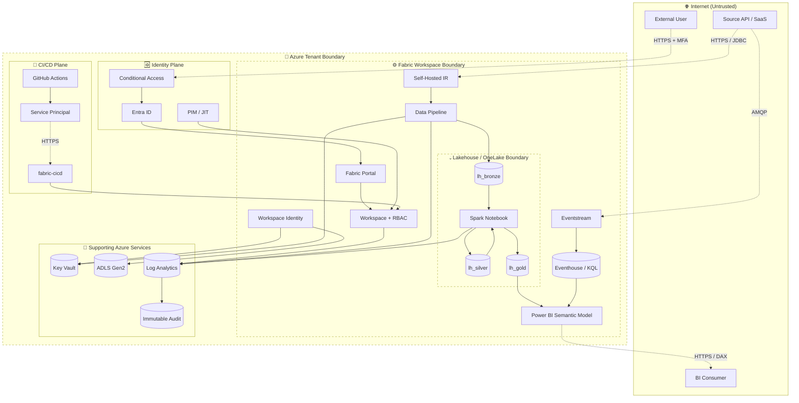

[Home](../../index.md) > [Docs](../..) > [Best Practices](../index.md) > [Security](../index.md) > STRIDE Threat Model

# 🛡️ STRIDE Threat Modeling for Fabric Reference Architecture

<div align="center" markdown>

**Per-Component Threat Model for the Canonical Fabric POC — Auditor Artifact for SOC 2 CC3.1**


</div>

---

**Last Updated:** `2026-04-27` | **Version:** 1.0.0 | **Companion to:** [SOC 2 Type II Readiness](soc2-type2-readiness.md) (CC3.1)

> **Disclaimer:** This document provides a reference STRIDE threat model for the Microsoft Fabric reference architecture in this repository. It is **not** a substitute for a tailored threat model of your production environment. Your data, integrations, regulatory exposure, and threat landscape will differ. Engage a qualified security architect to validate and extend this model for your specific deployment.

---

## 📑 Table of Contents

- [🎯 Overview](#-overview)
- [📋 What is STRIDE](#-what-is-stride)
- [🆚 When to Use STRIDE (vs PASTA, OCTAVE, ATT&CK)](#-when-to-use-stride-vs-pasta-octave-attck)
- [🔄 Threat Modeling Process](#-threat-modeling-process)
- [🏗️ Reference Architecture Data Flow](#️-reference-architecture-data-flow)
- [🧩 Per-Component STRIDE Analysis](#-per-component-stride-analysis)
- [📊 Consolidated Threat Catalog](#-consolidated-threat-catalog)
- [🔗 Mitigation Mapping to Existing Docs](#-mitigation-mapping-to-existing-docs)
- [✍️ Residual Risk Acceptance](#️-residual-risk-acceptance)
- [📅 Threat Model Maintenance](#-threat-model-maintenance)
- [🛠️ Tooling Recommendations](#️-tooling-recommendations)
- [🎰 Casino Implementation](#-casino-implementation)
- [🏛️ Federal Implementation](#️-federal-implementation)
- [🚫 Anti-Patterns](#-anti-patterns)
- [📋 Implementation Checklist](#-implementation-checklist)
- [📚 References](#-references)

---

## 🎯 Overview

A threat model is **not** a vulnerability scan and **not** a pen test report. It's a structured exercise that asks: *"What could go wrong with this system, and what are we doing about it?"* The output is an inventory of threats, mitigations, and accepted residual risks — exactly what a SOC 2 auditor expects to see for **CC3.1 (risk assessment)** and what a security review board needs before a production go-live.

This document provides a **STRIDE-based threat model for the canonical Fabric reference architecture** deployed by `infra/main.bicep`. It is the auditor-grade artifact you hand over when asked: *"Show me your threat model."*

### Why STRIDE for Fabric Workloads

| Pressure | Detail |
|----------|--------|
| SOC 2 CC3.1 | The auditor will ask for a documented threat assessment |
| ISO 27001 A.5.30 / A.8.27 | Information security risks must be identified and treated |
| FedRAMP RA-3 | Risk assessment is a control family, not a checkbox |
| HIPAA Security Rule 164.308(a)(1)(ii)(A) | Required risk analysis for ePHI systems |
| Architecture review boards | Most enterprises gate go-live on a threat model |
| Insurance | Underwriters increasingly request threat-model evidence |

### What This Document Covers

- A reusable per-component STRIDE matrix tailored to Fabric services (Workspace, Lakehouse, Pipelines, Eventstream, Power BI, Workspace Identity, Key Vault)
- Trust boundaries on the canonical data flow diagram
- Mitigations that link back to existing best-practice docs (CMK, OAP, network security, identity)
- A residual-risk register template
- Maintenance cadence and re-modeling triggers

> 📝 **Scope:** This is a **reference** threat model. It assumes the architecture in `infra/main.bicep` and the deployed components (Fabric F64 capacity, ADLS, Key Vault, Eventhouse, Eventstream, Log Analytics). Your environment will introduce additional threats — extend the catalog, do not replace it.

---

## 📋 What is STRIDE

STRIDE is a threat-classification framework developed by Microsoft engineers (Loren Kohnfelder and Praerit Garg, 1999) and now codified in the SDL (Security Development Lifecycle). It enumerates six threat categories — one per letter — that map to the six core security properties:

| Letter | Threat | Property Violated | Plain-English Question |
|--------|--------|--------------------|-----------------------|
| **S** | Spoofing | Authentication | Can someone pretend to be a user / service / system? |
| **T** | Tampering | Integrity | Can someone modify data or code in transit or at rest? |
| **R** | Repudiation | Non-repudiation | Can a user deny an action they performed? |
| **I** | Information Disclosure | Confidentiality | Can someone read data they shouldn't? |
| **D** | Denial of Service | Availability | Can someone make the system unusable? |
| **E** | Elevation of Privilege | Authorization | Can someone gain rights beyond what's granted? |

**Why STRIDE is well-suited to data platforms:**
- Each letter maps directly to a Fabric control surface (auth, encryption, audit, IAM, capacity, RBAC).
- It's per-component, so multi-tenant or multi-domain workloads (casino chain, federal agencies) decompose cleanly.
- It produces a checklist auditors recognize — no need to translate to a different framework for SOC 2 / ISO / FedRAMP.

---

## 🆚 When to Use STRIDE (vs PASTA, OCTAVE, ATT&CK)

| Framework | Best For | Granularity | Effort | When to Pick |
|-----------|----------|-------------|--------|--------------|
| **STRIDE** | Application / system threat modeling | Per-component | Medium | New architecture review; default for SDL |
| **PASTA** (Process for Attack Simulation and Threat Analysis) | Risk-driven, business-aligned | Per-attack-scenario | High | Regulated industries; tying threats to business impact |
| **OCTAVE** | Organizational risk | Enterprise-wide | High | Strategic risk programs; not a per-system tool |
| **MITRE ATT&CK** | Adversary behavior modeling | Per-tactic / per-technique | Medium | Detection engineering; SOC playbooks |
| **CVSS** | Single-vulnerability scoring | Per-CVE | Low | After a vuln is known — not for design-time analysis |
| **DREAD** | Risk scoring | Per-threat | Low | Used *with* STRIDE to prioritize, but largely deprecated |

**Recommendation for this POC:** STRIDE for the design-time model (this document). MITRE ATT&CK for SOC detection rules. CVSS for vuln-scan triage. The three are complementary, not alternatives.

---

## 🔄 Threat Modeling Process

A repeatable process keeps threat models honest. Skipping steps produces a checkbox artifact that fails its first auditor walkthrough.

### Step 1 — Define the System

Produce or update a data flow diagram (DFD) showing:
- **Processes** (rectangles) — services that transform data (e.g., a Spark notebook)
- **Data stores** (cylinders / parallel lines) — Lakehouses, Key Vaults, Log Analytics
- **Data flows** (arrows) — protocol + direction (HTTPS, JDBC, AMQP)
- **External entities** (squares) — users, source systems, BI consumers
- **Trust boundaries** (dashed lines) — places where authentication and authorization decisions occur

Trust boundaries are the most important element. A threat lives at a boundary crossing.

### Step 2 — Decompose

Walk every component on the diagram. For each, list:
- Its inputs (where does data come from?)
- Its outputs (where does data go?)
- Its identity (who runs it: user, SP, Workspace Identity?)
- Its data classification (public, internal, confidential, highly confidential)

### Step 3 — Identify Threats (STRIDE per Component)

For each component, ask the six STRIDE questions. Record every plausible threat — do **not** filter by likelihood at this stage. False positives are cheap; missed threats are not.

### Step 4 — Determine Mitigations

For each threat, document:
- **Mitigation** — the control that reduces likelihood or impact
- **Owner** — who is responsible for operating the control
- **Verification** — how you confirm it's working (audit query, test, runbook)
- **Reference** — link to the doc / Bicep module / runbook implementing it

### Step 5 — Validate (Residual Risk Acceptance)

Threats that cannot be fully mitigated become **residual risks**. They must be:
- Documented with severity
- Reviewed by a risk owner (Security Architect or CISO delegate)
- Formally accepted in writing
- Re-evaluated on the cadence below

### Step 6 — Re-Do Annually + on Major Architecture Change

A threat model is a living artifact. Re-validate:
- **Annually** at minimum
- On any major architecture change (new component, new integration)
- After a security incident (was the threat in the model? if not, why?)
- On a regulatory shift (new data classification, new framework adoption)

---

## 🏗️ Reference Architecture Data Flow

The diagram below is the canonical Fabric reference architecture deployed by `infra/main.bicep`. **Trust boundaries are dashed** — every arrow that crosses a dashed line is a place where STRIDE threats apply.



**Trust boundaries (dashed):**
1. **Internet ↔ Azure Tenant** — every inbound user / API call crosses here.
2. **Azure Tenant ↔ Fabric Workspace** — workspace IAM enforced.
3. **Fabric Workspace ↔ OneLake / Lakehouse** — OneLake Security + RBAC enforced.
4. **CI/CD ↔ Fabric Workspace** — service-principal authorization gate.

Every numbered component below corresponds to a node — or a flow crossing a boundary — in this diagram.

---

## 🧩 Per-Component STRIDE Analysis

Each table below decomposes one component. Threats are denser at trust-boundary crossings (Components 1, 2, 5, 9) and thinner inside trusted zones (Components 4, 8). That asymmetry is expected — and a sign the model is calibrated correctly.

### Component 1 — User Authentication (Entra ID + Conditional Access)

Boundary crossed: **Internet ↔ Azure Tenant**.

| STRIDE | Threat | Mitigation | Reference |
|:------:|--------|------------|-----------|
| **S** | Credential theft via phishing, password spray, AiTM | Phish-resistant MFA (FIDO2 / passkeys), Conditional Access location + device-compliance gates, anomalous-sign-in detection | [Identity & RBAC](../identity-rbac-patterns.md), [Zero-Trust Blueprint](zero-trust-blueprint.md) |
| **T** | Token replay; refresh-token theft from compromised endpoint | Short access-token TTL; CAE (continuous access evaluation); sign-token binding to device | Entra ID Token Lifetime policies |
| **R** | User denies they performed an action (login, API call) | Sign-in audit log retained ≥18 months; immutable storage; correlation ID tracked end-to-end | [SOC 2 CC6.7](soc2-type2-readiness.md), [Audit Trail Immutability](audit-trail-immutability.md) |
| **I** | Identity enumeration via differential error responses on failed login | Entra ID returns identical error for unknown user vs wrong password; smart lockout enabled | Microsoft-managed |
| **D** | DoS against the auth provider blocking workforce access | Microsoft-managed availability SLA; rate limits; tenant-level Conditional Access fallback authority | Microsoft Entra SLA |
| **E** | Privileged role granted permanently; assignee account later compromised | Entra PIM with JIT activation; quarterly access review; max-eligible-duration policy | [Identity & RBAC](../identity-rbac-patterns.md) |

### Component 2 — Workspace Access (Fabric Workspace IAM)

Boundary crossed: **Azure Tenant ↔ Fabric Workspace**.

| STRIDE | Threat | Mitigation | Reference |
|:------:|--------|------------|-----------|
| **S** | Stale group membership grants access after role change | Group-based RBAC sourced from Entra; lifecycle automation removes on departure | [Identity & RBAC](../identity-rbac-patterns.md) |
| **T** | Workspace settings tampered to weaken controls (e.g., domain reassign) | Workspace-admin actions logged to Workspace Monitoring; high-value setting changes alert | [Workspace Monitoring](../../features/workspace-monitoring.md) |
| **R** | Admin denies they granted a role | Role-assignment events captured in Fabric audit log; immutable retention | [SOC 2 CC6.7](soc2-type2-readiness.md) |
| **I** | Viewer role unexpectedly exposes confidential data | OneLake Security + RLS/CLS — workspace role is not a data-access shortcut | [OneLake Security](../../features/onelake-security.md) |
| **D** | Mass role removal (malicious or accidental) locks the workspace | Break-glass admin account stored offline; daily IAM snapshot to immutable storage | [Identity & RBAC](../identity-rbac-patterns.md) |
| **E** | Contributor escalates to Admin via self-grant | Admin role gated by PIM; self-elevation impossible (separate approver) | Entra PIM |

### Component 3 — Lakehouse / Warehouse Data Access

Boundary crossed: **Fabric Workspace ↔ Lakehouse**.

| STRIDE | Threat | Mitigation | Reference |
|:------:|--------|------------|-----------|
| **S** | Service Principal credential leaked into a notebook | Workspace Identity replaces SPs; secrets fetched at runtime from Key Vault; credential scanning on every commit | [CMK](../customer-managed-keys.md), [Supply Chain Security](supply-chain-security.md) |
| **T** | Direct ADLS write bypasses Delta ACID and corrupts a table | OneLake Security restricts ADLS Gen2 path-level write to Workspace Identity only | [OneLake Security](../../features/onelake-security.md) |
| **R** | Analyst denies running a destructive `OPTIMIZE`/`VACUUM` | Notebook execution + Spark history server logs retained ≥12 months | [SOC 2 CC6.7](soc2-type2-readiness.md) |
| **I** | Cross-domain leakage — federal Gold tables visible in casino workspace | Workspace-per-domain isolation; Default Domain sensitivity labels | [Data Governance](../data-governance-deep-dive.md) |
| **D** | Runaway query saturates capacity, starves other workloads | Capacity throttling alerts; per-workspace capacity limits; query-level kill switch | [Capacity Planning](../capacity-planning-cost-optimization.md) |
| **E** | Notebook escapes Spark sandbox to read other workspaces' data | Microsoft-managed isolation; supplemented by OneLake Security path filters | Microsoft-managed |

### Component 4 — Pipeline / Notebook Execution

Boundary crossed: internal (within workspace), but with **external code execution** and **secret access**.

| STRIDE | Threat | Mitigation | Reference |
|:------:|--------|------------|-----------|
| **S** | Pipeline run impersonates user via stored credentials | Workspace Identity replaces stored credentials; pipelines authenticate as the workspace identity | [Workspace Identity Bicep](https://github.com/fgarofalo56/Suppercharge_Microsoft_Fabric/blob/main/infra/modules/security/workspace-identity.bicep) |
| **T** | Malicious dependency injects code at build/import time | Pinned dependency hashes; private feed (Artifact Registry) + signed artifacts | [Supply Chain Security](supply-chain-security.md) |
| **R** | Pipeline run executed but no audit record | Pipeline run history retained; emitted to Workspace Monitoring | [Workspace Monitoring](../../features/workspace-monitoring.md) |
| **I** | Exception stack traces leak data values into logs | Structured logging with PII redaction; log scrubbing rules | [Observability](../monitoring-observability.md) |
| **D** | Misconfigured pipeline schedule storms the source system | Source-side rate limiting; pipeline concurrency caps | [Pipeline Bicep](https://github.com/fgarofalo56/Suppercharge_Microsoft_Fabric/blob/main/infra/modules/fabric/fabric-pipeline.bicep) |
| **E** | Notebook calls `mssparkutils.credentials.getSecret()` for a secret it shouldn't access | Key Vault access policy scoped to Workspace Identity + secret-name pattern | [CMK](../customer-managed-keys.md) |

### Component 5 — External Data Ingestion (SHIR / Mirroring / Eventstream)

Boundary crossed: **Internet ↔ Azure Tenant** and **Azure Tenant ↔ Fabric Workspace**.

| STRIDE | Threat | Mitigation | Reference |
|:------:|--------|------------|-----------|
| **S** | Source-system credential reuse across environments | Per-environment credentials; SHIR uses managed identity where possible | [Network Security](../network-security.md) |
| **T** | MITM on HTTPS / JDBC link tampers payload | TLS 1.2+ enforced; certificate pinning where the source supports it | [Network Security](../network-security.md) |
| **R** | Source claims event was sent; Fabric never received | End-to-end correlation IDs; idempotency keys; reconciliation job daily | [Incremental Refresh / CDC](../incremental-refresh-cdc.md) |
| **I** | Public endpoint exposes ingestion to scanning | Private Endpoint + IP firewall + OAP block public reach | [OAP](../outbound-access-protection.md) |
| **D** | Ingestion flood overwhelms Bronze write capacity | Eventstream backpressure; Bronze partition sizing; capacity alerts | [Capacity Planning](../capacity-planning-cost-optimization.md) |
| **E** | Ingestion identity has write access to Silver/Gold | Least-privilege: ingestion identity writes Bronze only; promotion is a separate identity | [Identity & RBAC](../identity-rbac-patterns.md) |

### Component 6 — BI Consumer (Power BI Direct Lake)

Boundary crossed: **Internet ↔ Azure Tenant** (for the consumer) and **Workspace ↔ Lakehouse** (for the Direct Lake path).

| STRIDE | Threat | Mitigation | Reference |
|:------:|--------|------------|-----------|
| **S** | Embedded report token reuse from another user's session | Token TTL ≤1 hour; embed-token bound to user identity (RLS context) | [Direct Lake](../../features/direct-lake.md) |
| **T** | Modified DAX query attempts to bypass RLS | RLS evaluated server-side; report-level edits gated by Build permission | Microsoft-managed |
| **R** | Analyst denies they exported sensitive report | Power BI activity log captures `ExportReport`; sensitivity-label inheritance | [Data Governance](../data-governance-deep-dive.md) |
| **I** | Sensitive column exposed via auto-summary or AI Q&A | Column-level security (CLS); Q&A excluded for Confidential tables | [OneLake Security](../../features/onelake-security.md) |
| **D** | DAX timeout from poorly-written measure brings down semantic model | Query timeout; capacity-level concurrency limit | [Capacity Planning](../capacity-planning-cost-optimization.md) |
| **E** | Consumer shares "Build" instead of "Read" by accident | Sharing policy default = Read; Build requires admin approval | Workspace governance |

### Component 7 — Service-to-Service (Workspace Identity → ADLS / Key Vault)

Boundary crossed: **Fabric Workspace ↔ Supporting Azure Services**.

| STRIDE | Threat | Mitigation | Reference |
|:------:|--------|------------|-----------|
| **S** | Compromised workspace identity used from outside Fabric | Workspace Identity scoped to specific resource role assignments; conditional access not user-applicable but RBAC scope is tight | [Workspace Identity](https://github.com/fgarofalo56/Suppercharge_Microsoft_Fabric/blob/main/infra/modules/security/workspace-identity.bicep) |
| **T** | Key Vault access policy widened "temporarily" and never reverted | Bicep is source of truth; drift detection against deployed state | [Customer-Managed Keys](../customer-managed-keys.md) |
| **R** | Service-to-service call denied on audit | Key Vault diagnostic logs to Log Analytics; immutable mirror | [SOC 2 CC6.7](soc2-type2-readiness.md) |
| **I** | Storage Account public blob enumeration | Public blob access disabled at account level; OAP enforced | [OAP](../outbound-access-protection.md) |
| **D** | Key Vault throttling under bulk secret retrieval | Cache secrets per-pipeline-run; respect Key Vault transaction limits | Microsoft-managed |
| **E** | Workspace Identity granted `Storage Blob Data Owner` instead of `Contributor` | Bicep role-assignment review; least-privilege validator in CI | [Identity & RBAC](../identity-rbac-patterns.md) |

### Component 8 — Audit Log Subsystem

Boundary crossed: **Fabric Workspace → Log Analytics → Immutable Audit**.

| STRIDE | Threat | Mitigation | Reference |
|:------:|--------|------------|-----------|
| **S** | Spoofed log entries injected into Log Analytics | Log ingestion authenticated via Data Collection Endpoint + DCR identity | Microsoft-managed |
| **T** | Attacker modifies log entries to hide tracks | WORM (Write-Once-Read-Many) immutable container; cryptographic hash chain | [Audit Trail Immutability](audit-trail-immutability.md) |
| **R** | Action occurred but no log produced | Diagnostic settings asserted on every workspace; automated drift check | [Workspace Monitoring](../../features/workspace-monitoring.md) |
| **I** | Logs themselves contain PII and over-share | PII redaction at emission time; log sensitivity label = Confidential | [GDPR](gdpr-right-to-deletion.md) |
| **D** | Log volume exceeds Log Analytics ingestion cap, dropping events | Capacity alerts on log ingestion; tiered retention with archive | [Capacity Planning](../capacity-planning-cost-optimization.md) |
| **E** | Log reader role lets user purge logs | Reader is read-only; purge requires separate `Data Purger` role under PIM | [Identity & RBAC](../identity-rbac-patterns.md) |

### Component 9 — CI/CD Pipeline (GitHub Actions + fabric-cicd)

Boundary crossed: **CI/CD ↔ Fabric Workspace** — historically the highest-risk boundary in modern attacks.

| STRIDE | Threat | Mitigation | Reference |
|:------:|--------|------------|-----------|
| **S** | Compromised PAT or SP secret deploys malicious items | OIDC federation (no long-lived secrets); SP scoped to workspace; environment protection rules | [Supply Chain Security](supply-chain-security.md) |
| **T** | Workflow file modified on a PR to exfiltrate secrets | `pull_request_target` not used; required reviewers on `.github/workflows/**` | [Supply Chain Security](supply-chain-security.md) |
| **R** | Deployment occurred but actor unclear | GitHub Actions run logs retained; `actions/checkout` records SHA; deployment metadata persisted to Fabric | fabric-cicd-deployment.md |
| **I** | Build logs print secret values | Secret scanning + log scrubbing on Actions output | GitHub-managed + custom |
| **D** | Compromised dependency (typosquat) blocks production builds | Pinned versions, dependency-review action, private mirror | [Supply Chain Security](supply-chain-security.md) |
| **E** | Workflow self-modifies to grant write to additional repos | `permissions:` block scoped per-job; `GITHUB_TOKEN` minimal | [Supply Chain Security](supply-chain-security.md) |

### Component 10 — Secrets Management (Key Vault)

Boundary crossed: **Fabric Workspace ↔ Key Vault**.

| STRIDE | Threat | Mitigation | Reference |
|:------:|--------|------------|-----------|
| **S** | Stolen client cert grants full Key Vault access | Workspace Identity instead of cert auth; cert auth disabled | [Customer-Managed Keys](../customer-managed-keys.md) |
| **T** | Key version replaced with attacker-controlled value | RBAC restricts `update` to a separate operator group; key auto-rotation locked to HSM | [Customer-Managed Keys](../customer-managed-keys.md) |
| **R** | Secret accessed but no record of who | KV diagnostic settings → Log Analytics; access alerts on high-value secrets | [Audit Trail Immutability](audit-trail-immutability.md) |
| **I** | Soft-deleted secret recovered after data classification changed | Purge protection enabled; rotation-on-classification-change runbook | [Customer-Managed Keys](../customer-managed-keys.md) |
| **D** | KV firewall blocks legitimate Fabric access during outage | Multi-region KV replication; fallback access policy break-glass | [BCDR](../disaster-recovery-bcdr.md) |
| **E** | Operator with `get` granted `update` via "small change" | Just-in-time access via PIM for any write role | [Identity & RBAC](../identity-rbac-patterns.md) |

---

## 📊 Consolidated Threat Catalog

The catalog below de-duplicates and prioritizes threats across all ten components. Use this as the **single source of truth** when handing the model to an auditor or risk committee. Likelihood and impact are scored 1 (low) – 5 (high). **Residual risk = Likelihood × Impact** *after* mitigation.

| ID | Component | STRIDE | Scenario | Likelihood | Impact | Mitigation | Residual |
|----|-----------|:------:|----------|:----------:|:------:|------------|:--------:|
| T-001 | C1 Auth | S | Phishing harvests credentials | 4 | 4 | FIDO2 + Conditional Access | 1 |
| T-002 | C1 Auth | E | Permanent privileged role abuse | 3 | 5 | Entra PIM JIT + access review | 1 |
| T-003 | C2 Workspace | T | Workspace setting weakened (domain reassign) | 2 | 4 | Workspace Monitoring + alert | 1 |
| T-004 | C2 Workspace | I | Viewer role exposes confidential data | 3 | 4 | OneLake Security + RLS/CLS | 1 |
| T-005 | C3 Lakehouse | S | SP secret leaked in notebook source | 3 | 5 | Workspace Identity + secret scanning | 2 |
| T-006 | C3 Lakehouse | T | Direct ADLS write bypasses Delta | 2 | 5 | OneLake Security path-level write deny | 1 |
| T-007 | C3 Lakehouse | I | Cross-domain leakage federal → casino | 2 | 5 | Workspace-per-domain + sensitivity labels | 1 |
| T-008 | C4 Pipeline | T | Malicious dependency injection | 3 | 5 | Pinned hashes + private feed + signing | 2 |
| T-009 | C4 Pipeline | I | Stack trace leaks data values | 3 | 3 | Structured logging + PII redaction | 1 |
| T-010 | C5 Ingestion | T | MITM tampers JDBC payload | 2 | 4 | TLS 1.2+ + cert pinning | 1 |
| T-011 | C5 Ingestion | I | Public endpoint scanned | 4 | 3 | Private Endpoint + OAP | 1 |
| T-012 | C5 Ingestion | D | Ingestion flood saturates Bronze | 3 | 3 | Backpressure + capacity alerts | 1 |
| T-013 | C6 BI | I | Sensitive column via auto-summary / Q&A | 3 | 4 | CLS + Q&A exclusion on Confidential | 1 |
| T-014 | C6 BI | E | Build sharing instead of Read | 3 | 3 | Default Read; Build needs admin | 1 |
| T-015 | C7 S2S | E | Workspace Identity over-permissioned | 3 | 4 | Bicep review + CI least-priv check | 1 |
| T-016 | C8 Audit | T | Log entries modified to hide tracks | 2 | 5 | WORM immutable + hash chain | 1 |
| T-017 | C8 Audit | E | Reader role purges logs | 2 | 4 | Separate Data Purger under PIM | 1 |
| T-018 | C9 CICD | S | OIDC misconfig allows unauthorized deploy | 3 | 5 | Federated identity + env protection | 2 |
| T-019 | C9 CICD | T | Workflow modified via PR to exfil secrets | 3 | 5 | No `pull_request_target`; required reviewers | 1 |
| T-020 | C9 CICD | E | Workflow grants write to extra repos | 2 | 5 | `permissions:` minimal + token scope | 1 |
| T-021 | C10 KV | T | Key replaced with attacker-controlled value | 2 | 5 | Update gated by operator group + HSM | 1 |
| T-022 | C10 KV | I | Soft-deleted secret recovered post-reclassification | 2 | 4 | Purge protection + rotation runbook | 1 |
| T-023 | C10 KV | D | KV firewall blocks Fabric during outage | 2 | 5 | Multi-region KV + break-glass | 2 |

> ⚠️ **Caveat:** Residual scores assume mitigations are *operating* effectively. The SOC 2 Type II examination period is precisely the test of that assumption. A mitigation present in design but absent in operation provides zero residual reduction.

---

## 🔗 Mitigation Mapping to Existing Docs

Every mitigation in the catalog should resolve to a deployable control documented elsewhere. The mapping below makes that traceability explicit — auditors will follow these links.

| Mitigation Theme | Implementing Doc / Module |
|------------------|---------------------------|
| Conditional Access + MFA | [Zero-Trust Blueprint](zero-trust-blueprint.md), [Identity & RBAC Patterns](../identity-rbac-patterns.md) |
| Workspace Identity (credential-free) | `infra/modules/security/workspace-identity.bicep`, [SOC 2 CC5.1](soc2-type2-readiness.md) |
| OneLake Security (RLS/CLS/OLS) | [OneLake Security feature](../../features/onelake-security.md), [Data Governance](../data-governance-deep-dive.md) |
| Encryption at rest (CMK) | [Customer-Managed Keys](../customer-managed-keys.md) |
| Network controls (PE / IP firewall / OAP) | [Network Security](../network-security.md), [Outbound Access Protection](../outbound-access-protection.md) |
| Audit retention & immutability | [Audit Trail Immutability](audit-trail-immutability.md), [SOC 2 CC6.7](soc2-type2-readiness.md) |
| Workspace observability | [Workspace Monitoring feature](../../features/workspace-monitoring.md), [Monitoring & Observability](../monitoring-observability.md) |
| Capacity protection | [Capacity Planning](../capacity-planning-cost-optimization.md), [Capacity Throttling Runbook](../../runbooks/capacity-throttling-response.md) |
| Supply-chain integrity | [Supply Chain Security](supply-chain-security.md) |
| Data exfiltration prevention | [Data Exfiltration Prevention](data-exfiltration-prevention.md) |
| Disaster recovery | [BCDR](../disaster-recovery-bcdr.md), [Multi-Region Failover Runbook](../../runbooks/multi-region-failover.md) |
| Privacy & deletion | [GDPR Right to Deletion](gdpr-right-to-deletion.md), [CCPA Privacy Rights](ccpa-privacy-rights.md) |

---

## ✍️ Residual Risk Acceptance

Every threat in the catalog with **residual ≥ 2** must be either (a) further mitigated, (b) transferred (insurance / contractual), or (c) formally accepted. The accepted set is what the risk owner signs.

### Risk Acceptance Template

```markdown
# Residual Risk Acceptance — [Threat ID]

**Threat ID:** T-005
**Component:** C3 Lakehouse — SP secret leaked in notebook source
**STRIDE:** Spoofing
**Residual Likelihood × Impact:** 2 × 5 = 10 (residual after Workspace Identity rollout)

## Decision
☑ Accept   ☐ Mitigate further   ☐ Transfer   ☐ Avoid

## Rationale
Workspace Identity covers 100% of new pipelines but ~5% of legacy notebooks
still use stored SP secrets pending migration in Phase 15. Secret scanning
on every commit catches accidental leaks within minutes.

## Compensating Controls
- Pre-commit secret scan (gitleaks)
- Quarterly notebook-source audit for credential patterns
- Targeted migration plan with completion date

## Re-Evaluation Date
2026-10-01 (post Phase 15)

## Owner
Security Architect — fgarofalo@example.com

## Signatures
Risk Owner: ____________________ Date: ____________
CISO Delegate: _________________ Date: ____________
```

Maintain the acceptance register in immutable storage alongside the threat model itself. Auditors will request both as a pair.

---

## 📅 Threat Model Maintenance

A threat model that hasn't been touched in 18 months is worse than no threat model — it gives false assurance.

### Review Cadence

| Cadence | Activity | Owner |
|---------|----------|-------|
| **Continuous** | Track new components/integrations in a "pending review" log | Security Architect |
| **Per major change** | Re-run STRIDE for the affected component before merge | Feature owner + Security |
| **Quarterly** | Walk the catalog with the security review board; check residual scores | Security Architect |
| **Annual** | Full re-validation; refresh data flow diagram; renew acceptances | CISO delegate |
| **Post-incident** | Was the threat in the model? If not, why? Add it. | Incident commander + Security |

### Triggers for Re-Modeling

A trigger means "stop and re-do the relevant component", not "wait for the annual review":

- New component deployed (e.g., adopting Mirroring for a new source)
- New integration crossing a trust boundary (new SaaS, new agency feed)
- New regulatory framework adopted (new agency = new compliance obligations)
- Security incident — even a minor one, even a near miss
- Major Microsoft Fabric platform change with security implications (new RBAC model, new identity primitive)
- Acquisition or divestiture changing the trust topology
- Pen test or red team result not anticipated by the model

### Ownership

The threat model has **one named accountable owner** — the Security Architect — and a delegated co-owner from the platform team. Both names live in the document header, both rotate with the on-call handbook, and both review the catalog together once a quarter. Without a named owner, the model decays.

---

## 🛠️ Tooling Recommendations

You don't need a tool to do STRIDE — paper, a whiteboard, and discipline work — but tools help with version control, diagram regeneration, and team participation.

| Tool | Type | Strengths | Weaknesses |
|------|------|-----------|------------|
| **Microsoft Threat Modeling Tool** | Free, Windows desktop | Native STRIDE; Azure stencil; exports to Word | Windows-only; aging UI; not Git-friendly |
| **OWASP Threat Dragon** | Free, open-source, web | Cross-platform; JSON-backed (Git-friendly); browser-based | Smaller stencil library; needs customization for Fabric |
| **IriusRisk** | Commercial | Automation, integration with Jira/AzDO; rule-based threat libraries | Cost; vendor lock-in |
| **PyTM** | Open-source, code-as-threat-model | Python DSL; CI-runnable; diff-able in Git | Steeper learning curve; smaller community |
| **Threagile** | Open-source, YAML-based | Code-as-threat-model; Git-native; CI runnable | YAML-only; weaker diagram output |
| **CAIRIS** | Open-source, academic | Strong on requirements + risk linkage | Heavier setup; less Fabric-aware |

**Recommendation for this POC:**
- **Diagrams:** Mermaid in this Markdown file (Git-diffable, renders on GitHub)
- **Catalog:** Markdown table in this file
- **Acceptance register:** Markdown files in `docs/security/risk-acceptance/`
- **Optional advanced:** PyTM or Threagile for CI-driven re-evaluation when the architecture changes

The point is **traceability and review-ability** — pick whichever tool your team will actually update.

---

## 🎰 Casino Implementation

The casino domain (NIGC MICS, BSA / FinCEN, multi-property chains) introduces threats not covered by the generic model.

### Compliance Officer Access Controls

Compliance officers need broad read access to BSA-relevant data (CTR, SAR, W-2G) but **must not** have administrative write access. The threat is *insider compromise of compliance data* — exactly what the BSA examiner will probe.

- **Workspace role:** Viewer + custom item-level Build permission on regulatory reports only
- **Data security:** OneLake Security RLS bound to the officer's property assignment; cross-property visibility requires elevated role under PIM
- **Audit:** Every CTR/SAR query logged with the officer's UPN; queries reviewed monthly against case files
- **Separation of duties:** The compliance team cannot also approve their own access requests; that goes through the Security Architect

### Multi-Tenant Casino Chain (Cross-Property Isolation)

A regional casino operator with 8 properties faces a different threat: *cross-property data leakage* via shared infrastructure.

- **Workspace per property** for sensitive cardroom & cage data; shared workspaces for chain-wide reporting only with tagged sensitivity labels
- **OneLake shortcuts** are reviewed quarterly — a misconfigured shortcut is the most common cross-property leakage vector
- **Capacity isolation** (per-property capacity assignment) prevents one property's saturation event from impacting another

### Casino-Specific Threats Added to Catalog

| ID | Component | STRIDE | Scenario | Mitigation |
|----|-----------|:------:|----------|------------|
| T-CAS-01 | C3 Lakehouse | I | Property A staff sees Property B player data | Workspace-per-property + OneLake RLS by property_id |
| T-CAS-02 | C6 BI | R | Player denies a specific transaction shown in dispute | Player activity log immutable retention 7 years |
| T-CAS-03 | C2 Workspace | E | Floor manager elevated to compliance role mid-shift | Compliance role gated by PIM with 24-hour TTL + dual approval |

---

## 🏛️ Federal Implementation

The federal expansions (USDA, SBA, NOAA, EPA, DOI, DOJ, Tribal Health, DOT/FAA) overlay FedRAMP, HIPAA, and CIPSEA controls on the same architecture.

### DOJ Data Sensitivity (Restricted Access)

DOJ datasets include law-enforcement-sensitive information. The threat is *broader workforce visibility into restricted data*.

- **Workspace isolation:** DOJ workloads in a dedicated workspace, separate Entra group, separate Workspace Identity
- **Conditional Access:** Restrict access to managed devices + named locations only
- **Data classification:** Highly Confidential sensitivity label inherited end-to-end (Bronze → Silver → Gold → Power BI)
- **Egress controls:** OAP enforced; no shortcut writes outside workspace

### HIPAA Tribal Health (PHI Handling)

Tribal Health workloads carry PHI under HIPAA Security Rule. The model adds:
- **Encryption:** CMK with HSM-backed keys; 7-year retention floor
- **Audit:** PHI access events retained ≥6 years (HIPAA), with patient-level access reports available on demand
- **BAA enforcement:** Sub-processor list mirrored in Microsoft's BAA + maintained internally
- **Breach response:** 60-day notification per HHS rules; runbook tested annually

### Federal-Specific Threats Added to Catalog

| ID | Component | STRIDE | Scenario | Mitigation |
|----|-----------|:------:|----------|------------|
| T-FED-01 | C1 Auth | S | Non-managed device session authenticates to DOJ workspace | Conditional Access requires Intune-compliant device |
| T-FED-02 | C5 Ingestion | I | NOAA station feed leaks PII via free-text fields | Bronze schema validation strips/redacts unstructured PII |
| T-FED-03 | C3 Lakehouse | I | Tribal Health PHI accessible to non-BAA-covered analyst | OneLake Security + workspace-per-program isolation |
| T-FED-04 | C8 Audit | T | FedRAMP audit log retention violated | Immutable storage policy with 6-year minimum hold |

---

## 🚫 Anti-Patterns

| Anti-Pattern | Why It Hurts | What to Do Instead |
|--------------|--------------|--------------------|
| **"We did STRIDE once at design time"** | Architecture drifts; threats accumulate silently | Re-run on every major change + annual review |
| **One-letter-per-component shortcut** | "We covered S, T, R, I, D, E somewhere" — but not per component | One STRIDE pass *per component*, every time |
| **Threats listed without mitigations** | Auditor sees an unfixed risk register; finding-generator | Every threat has at least one mitigation row OR an accepted-risk record |
| **Mitigations without verification** | "We have CMK" — but who confirms it's still on? | Each mitigation has an audit query, runbook, or test |
| **Residual risk acceptance buried in email** | Auditor cannot find it; not legally defensible | Acceptance in immutable storage with risk owner signature |
| **No trust boundaries on the diagram** | Reviewers can't tell where threats apply | Trust boundaries are the most important diagram element |
| **STRIDE done by security team alone** | Misses how the system actually behaves | Joint exercise: security + platform + product |
| **Treating STRIDE as a compliance checkbox** | Produces a once-a-year theater artifact | Bake into change management — every RFC includes a STRIDE delta |
| **Same threat catalog for dev, staging, prod** | Trust boundaries differ across environments | One model per trust topology; dev usually has fewer boundaries |
| **No named owner** | Model decays; no one updates it | Single accountable owner in the document header |

---

## 📋 Implementation Checklist

Before declaring "threat model ready" for SOC 2 / ISO / FedRAMP review:

- [ ] Data flow diagram drawn with all components and trust boundaries
- [ ] Diagram lives in version control (this Markdown is sufficient)
- [ ] Per-component STRIDE table completed for every component
- [ ] Threats deduped into the consolidated catalog
- [ ] Likelihood × Impact scored for every threat
- [ ] Residual risk computed and recorded post-mitigation
- [ ] Each mitigation links to a doc, Bicep module, or runbook
- [ ] Threats with residual ≥ 2 have a Risk Acceptance record
- [ ] Risk Acceptance records are signed and stored in immutable storage
- [ ] Named owner (Security Architect) and co-owner documented
- [ ] Review cadence captured in calendar / on-call handbook
- [ ] Re-modeling triggers communicated to platform & feature teams
- [ ] Casino-specific threats appended (if Casino domain in scope)
- [ ] Federal-specific threats appended (if federal expansions in scope)
- [ ] Walkthrough scheduled with auditor for SOC 2 CC3.1
- [ ] Quarterly review meeting recurring on team calendar
- [ ] Annual full re-validation scheduled
- [ ] Threat model output linked from [SOC 2 Type II readiness doc](soc2-type2-readiness.md) (CC3.1)
- [ ] Threat model output linked from architecture review board template
- [ ] Postmortem template includes "was this in the threat model?" question
- [ ] CI gate runs Bicep / config drift detection against modeled assumptions
- [ ] Risk register reconciled monthly with this catalog

---

## 📚 References

### Microsoft Resources
- [Microsoft STRIDE Methodology](https://learn.microsoft.com/azure/security/develop/threat-modeling-tool-threats)
- [Microsoft Threat Modeling Tool](https://learn.microsoft.com/azure/security/develop/threat-modeling-tool)
- [Microsoft SDL Practices](https://www.microsoft.com/securityengineering/sdl/practices)
- [Microsoft Fabric Security Documentation](https://learn.microsoft.com/fabric/security/)

### OWASP & Industry
- [OWASP Threat Modeling](https://owasp.org/www-community/Threat_Modeling)
- [OWASP Threat Dragon](https://owasp.org/www-project-threat-dragon/)
- [OWASP Threat Modeling Cheat Sheet](https://cheatsheetseries.owasp.org/cheatsheets/Threat_Modeling_Cheat_Sheet.html)
- [PyTM (Code-as-Threat-Model)](https://github.com/izar/pytm)
- [Threagile](https://threagile.io/)

### Standards & Frameworks
- [NIST SP 800-154 — Data-Centric System Threat Modeling](https://csrc.nist.gov/pubs/sp/800/154/ipd)
- [NIST SP 800-30 — Risk Assessment Guide](https://csrc.nist.gov/pubs/sp/800/30/r1/final)
- [ISO/IEC 27005 — Information Security Risk Management](https://www.iso.org/standard/80585.html)
- [MITRE ATT&CK Framework](https://attack.mitre.org/)
- [SAFECode Tactical Threat Modeling](https://safecode.org/)

### Related Wave 5 Docs (this Wave)
- [SOC 2 Type II Readiness](soc2-type2-readiness.md) — anchor; CC3.1 directly cites this doc
- [ISO 27001 Mapping](iso27001-mapping.md)
- [GDPR Right to Deletion](gdpr-right-to-deletion.md)
- [CCPA Privacy Rights](ccpa-privacy-rights.md)
- [Zero-Trust Blueprint](zero-trust-blueprint.md)
- [Data Exfiltration Prevention](data-exfiltration-prevention.md)
- [Supply Chain Security](supply-chain-security.md)
- [Audit Trail Immutability](audit-trail-immutability.md)

### Related Existing Docs
- [Network Security](../network-security.md)
- [Identity & RBAC Patterns](../identity-rbac-patterns.md)
- [Customer-Managed Keys](../customer-managed-keys.md)
- [Outbound Access Protection](../outbound-access-protection.md)
- [Data Governance Deep Dive](../data-governance-deep-dive.md)
- [Disaster Recovery (BCDR)](../disaster-recovery-bcdr.md)
- [Capacity Planning & Cost Optimization](../capacity-planning-cost-optimization.md)
- [Monitoring & Observability](../monitoring-observability.md)
- [Incremental Refresh / CDC](../incremental-refresh-cdc.md)

### Related Operational Docs (Wave 1)
- [Incident Response Template](../../runbooks/incident-response-template.md)
- [Multi-Region Failover Runbook](../../runbooks/multi-region-failover.md)
- [Capacity Throttling Response](../../runbooks/capacity-throttling-response.md)
- [SLO/SLI for Fabric](../operations/slo-sli-fabric.md)
- [Change Management](../operations/change-management.md)
- [Observability Stack](../operations/observability-stack.md)

### Bicep Modules Referenced
- `infra/main.bicep` — root orchestration
- `infra/modules/security/workspace-identity.bicep` — Workspace Identity (Component 7 control plane)
- `infra/modules/fabric/fabric-pipeline.bicep` — Pipelines (Component 4)
- `infra/modules/fabric/fabric-capacity.bicep` — Capacity (Components 3, 5, 6 DoS controls)

---

[⬆️ Back to Top](#️-stride-threat-modeling-for-fabric-reference-architecture) | [📚 Security Index](.) | [🏠 Home](../../index.md)
