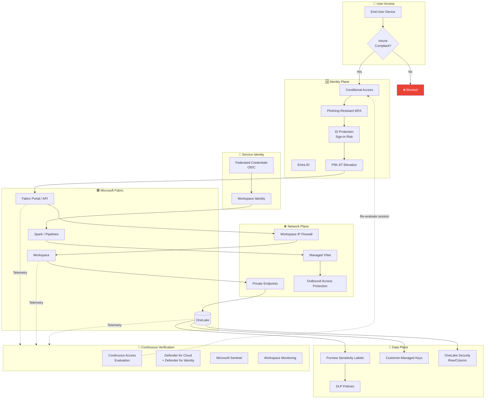

# 🛡️ Zero-Trust Architecture Blueprint for Microsoft Fabric

<div align="center" markdown>

**NIST 800-207 Zero Trust Principles → Fabric Implementation — Wave 5**


</div>

---

**Last Updated:** `2026-04-27` | **Version:** 1.0.0 | **Sibling of:** [SOC 2 Type II Readiness](soc2-type2-readiness.md) (Wave 5 anchor)

> **Disclaimer:** This document provides architectural and technical guidance for designing a zero-trust posture on Microsoft Fabric. It is **not** a turn-key control set — every organization must tune Conditional Access, device compliance, and policy-as-code to its own risk tolerance, regulatory regime, and user population. Validate every policy in audit-only mode before enforcement.

---

## 🎯 Overview

**Zero Trust** is a security model that replaces the traditional "trust the network perimeter" assumption with a posture of *continuous, contextual verification of every access request*. The canonical formulation is **NIST SP 800-207** — the U.S. federal reference architecture — and Microsoft's commercial implementation builds on it via Entra ID, Conditional Access, Defender, Purview, and Workspace Identity.

### The Three NIST 800-207 Tenets

| Tenet | What It Means | Fabric Translation |
|-------|---------------|--------------------|
| **Verify explicitly** | Every access request is authenticated, authorized, and inspected based on all available context (identity, device, location, workload, data classification, behavior) | Conditional Access evaluates user, device, sign-in risk, and resource on every Fabric Portal / API request |
| **Use least-privilege access** | Just-enough-access (JEA) and just-in-time (JIT) only; no standing privileges | PIM-elevated Fabric admin roles, Workspace Identity scoped to a single workspace, OneLake row/column filters |
| **Assume breach** | Minimize blast radius via segmentation, encrypt end-to-end, drive analytics to detect anomalies | Private Endpoints, OAP, CMK, Defender for Cloud + Sentinel telemetry from Workspace Monitoring |

### What This Document Covers

- The six pillars of the Microsoft Zero-Trust model mapped to concrete Fabric configuration
- A reference architecture you can adapt to your tenant
- A crawl/walk/run roadmap so you don't try to land everything at once
- Five+ ready-to-deploy Conditional Access policy JSON bundles
- Validation tests you can run quarterly to prove enforcement
- Casino and Federal applied examples (CTR/SAR data, FedRAMP, HIPAA, DOJ restricted)

> 📝 **Scope:** This is the zero-trust blueprint sibling to the [SOC 2 Type II readiness](soc2-type2-readiness.md) anchor. Other Wave 5 docs cover [STRIDE threat modeling](threat-model-stride.md), [data exfiltration prevention](data-exfiltration-prevention.md), [audit trail immutability](audit-trail-immutability.md), and the privacy-rights pair ([GDPR](gdpr-right-to-deletion.md), [CCPA](ccpa-privacy-rights.md)). This doc relies on the existing [Identity & RBAC](../identity-rbac-patterns.md), [Network Security](../network-security.md), [OAP](../outbound-access-protection.md), and [CMK](../customer-managed-keys.md) deep-dives — read those first if you have not already.

---

## 🌐 Why Zero Trust for Fabric

The traditional perimeter — the corporate VPN, a hardened firewall, "everything inside is trusted" — does not exist for a SaaS analytics platform like Fabric:

| Old Assumption | Why It Fails for Fabric |
|----------------|-------------------------|
| "Users are inside the corporate network" | Fabric Portal is `app.fabric.microsoft.com`, always reached via public DNS — VPN does not gate it |
| "Service-to-service traffic is trusted by default" | Fabric workspaces talk to ADLS Gen2, Key Vault, Purview, Eventhouse across Azure regions and tenants |
| "Devices on the LAN are managed" | BYOD, contractors, and partner auditors all need access from devices you do not own |
| "Once authenticated, the session is trusted" | Token-theft attacks (AitM phishing, device-code abuse, refresh-token replay) bypass MFA at sign-in |
| "Production data stays in production" | Notebook downloads, pipeline copy activities, and Power BI exports leak data sideways |

Zero trust addresses each gap explicitly: **identity is the new perimeter**, **devices are continuously evaluated**, **network paths are private and inspected**, and **every session is re-evaluated against current risk**.

### Threat Classes Mitigated

| Threat | Zero-Trust Mitigation |
|--------|----------------------|
| Credential theft / password spray | Phishing-resistant MFA + risk-based Conditional Access |
| AitM / token replay | Continuous Access Evaluation (CAE), short token lifetimes, device binding |
| Lateral movement | Workspace Identity (per-workspace scope), OneLake Security row/column filters |
| Data exfiltration via copy/export | OAP + tenant-export controls + sensitivity labels + DLP |
| Insider misuse | PIM JIT + access reviews + Defender for Identity anomaly detection |
| Compromised SP / leaked secret | Workspace Identity (no shared secrets) + federated credentials for CI/CD |
| Misconfiguration drift | Bicep policy-as-code + Defender for Cloud assessment |

---

## 🏛️ The Six Zero-Trust Pillars

Microsoft's Zero-Trust model splits the NIST tenets across six implementation pillars. Every pillar must be advanced together — partial coverage leaves obvious gaps an attacker can pivot through.

| Pillar | Question Answered | Primary Fabric Controls |
|--------|-------------------|-------------------------|
| 🆔 **Identity** | Who is making the request? | Entra ID, MFA, Conditional Access, PIM, Workspace Identity |
| 💻 **Devices / Endpoints** | What device is the request coming from? | Intune compliance, device-bound tokens, app protection policies |
| 🌐 **Network** | What network path is being used? | Private Endpoints, Workspace IP firewall, OAP, VNet integration |
| 📦 **Applications** | Which app is being accessed and how? | App-only auth, API throttling, Lakehouse SQL endpoint scopes |
| 🔐 **Data** | What is the classification and is it protected? | Purview labels, CMK, OneLake Security, DLP, tokenization |
| 🏗️ **Infrastructure** | Is the platform itself hardened and observed? | Bicep IaC + policy-as-code, Defender for Cloud, Workspace Monitoring |

> **Maturity rule:** Score each pillar **Crawl / Walk / Run** independently. A "Run" identity story with a "Crawl" data story still leaks.

---

## 🏗️ Reference Architecture



### What This Diagram Says, in Plain English

1. The user device must be Intune-compliant **before** Conditional Access even evaluates the sign-in.
2. Conditional Access stacks MFA, sign-in-risk evaluation, and PIM JIT elevation on top of authentication.
3. Service-to-service traffic uses **Workspace Identity** — no client secrets stored anywhere.
4. The network layer is private by default: Private Endpoints inbound, OAP outbound, IP firewall on the workspace.
5. Data is labelled, encrypted with CMK, filtered by OneLake Security, and DLP-policed.
6. Every action is telemetered to Defender + Sentinel, and **Continuous Access Evaluation** revokes sessions in near-real-time when risk changes.

---

## 🆔 Pillar 1 — Identity

The identity perimeter is the only perimeter that travels with the user. Get this pillar wrong and nothing else matters.

### 1.1 Tenant Foundations

| Requirement | Implementation |
|-------------|----------------|
| Sync source of truth | Entra ID with Password Hash Sync (PHS) or Pass-Through Auth (PTA) — never federation-only without backup |
| Break-glass accounts | Minimum 2 cloud-only Global Admins, exempt from CA, secrets in offline vault, monitored by Sentinel |
| User lifecycle | HR-driven joiner/mover/leaver via Entra ID lifecycle workflows or SCIM |
| Guest access | Cross-tenant Access Settings restrict B2B to allowlisted partner tenants |

### 1.2 Authentication Strength

| Strength Tier | Method | Use For |
|---------------|--------|---------|
| **Phishing-resistant** | FIDO2 security keys, Windows Hello for Business, Platform SSO with hardware-bound key, certificate-based auth (PIV/CAC) | All Fabric admins, federal users, high-risk roles |
| **Passwordless** | Microsoft Authenticator (passwordless), Authenticator Lite | All standard Fabric users |
| **MFA (push or OTP)** | Authenticator push w/ number-match, OATH TOTP, hardware token | Fallback only — disable SMS/voice |
| **Password-only** | ❌ Not acceptable for any Fabric access |

> **MFA is mandatory, not optional.** Microsoft's enforced MFA rollout already covers the Fabric Portal as of 2024-25. Verify your tenant has not granted exclusion exemptions.

### 1.3 Risk-Based Conditional Access

Entra ID Identity Protection scores **user risk** (account compromise indicators) and **sign-in risk** (anomalous session signals). Wire both into Conditional Access:

| Risk Level | Sign-In Action | User Action |
|------------|----------------|-------------|
| Low | Standard MFA | None |
| Medium | Step-up to phishing-resistant MFA | Notify, require password change at next sign-in |
| High | Block sign-in OR require step-up + compliant device | Force secure password change with MFA |

See [Policy 5 below](#policy-5--high-risk-sign-in--require-mfa--compliant-device) for the JSON.

### 1.4 Privileged Identity Management (PIM)

Standing admin rights are zero-trust kryptonite. Enforce JIT for every Fabric-relevant role:

| Role | Activation Window | Approval Required | MFA on Activation |
|------|-------------------|-------------------|-------------------|
| Fabric Administrator | 4 hours max | ✅ (security manager) | Phishing-resistant |
| Capacity Admin | 4 hours max | ✅ | Phishing-resistant |
| Workspace Admin (sensitive workspaces) | 8 hours max | ✅ | Phishing-resistant |
| Power Platform Admin | 4 hours max | ✅ | Phishing-resistant |
| Global Admin (break-glass excluded) | 1 hour max | ✅ (CISO + ticket ID) | Phishing-resistant |

### 1.5 Service Identity — Eliminate Shared Secrets

| Old Pattern (avoid) | New Pattern (zero-trust) |
|---------------------|---------------------------|
| Service Principal client secret in Key Vault | **Workspace Identity** scoped per-workspace |
| Service Principal secret in GitHub Secrets | Federated credentials (OIDC) — no secret at all |
| Long-lived API keys for ADLS shortcuts | Workspace Identity + RBAC on the storage account |
| Per-user PAT for fabric-cicd | Workload Identity Federation from GitHub Actions |

The [`infra/modules/security/workspace-identity.bicep`](https://github.com/fgarofalo56/Supercharge_Microsoft_Fabric/blob/main/infra/modules/security/workspace-identity.bicep) module deploys a user-assigned managed identity wired with Key Vault Secrets User, Storage Blob Data Contributor, and (optionally) Purview Data Curator role assignments — exactly the JIT-scoped service identity the zero-trust model wants.

### 1.6 Identity Governance

| Practice | Cadence | Owner |
|----------|---------|-------|
| Access review for Fabric admin roles | Quarterly | Security |
| Access review for sensitive workspace membership | Quarterly | Workspace Admin |
| Access review for guest accounts touching Fabric | Monthly | Data Steward |
| Service Principal / Workspace Identity inventory | Monthly | Platform team |
| Stale account cleanup (>90 days inactive) | Monthly (automated) | Identity team |

---

## 💻 Pillar 2 — Devices & Endpoints

A trusted user on an untrusted device is still untrusted.

### 2.1 Device Compliance Baseline (Intune)

| Setting | Required Value | Why |
|---------|----------------|-----|
| OS version | Within N-1 of latest | Patched against known CVEs |
| Disk encryption | BitLocker / FileVault on | Protect data at rest if device is stolen |
| Firewall | Enabled | Reduce LAN exposure |
| Antimalware | Defender for Endpoint (or equivalent) signed-in | EDR telemetry |
| Screen lock | ≤ 15 minutes idle | Reduce shoulder-surf and walk-away risk |
| Jailbreak / root detection | Block | Prevent OS-level exploits |
| Threat level | "Low" or below from MDE | Block known-compromised devices |

### 2.2 Conditional Access — Require Compliant Device

The non-negotiable Fabric policy: a non-compliant device cannot sign in to the Fabric Portal. See [Policy 3](#policy-3--require-compliant-device-for-fabric).

### 2.3 Unmanaged & BYOD Devices

| Scenario | Allowed? | Control |
|----------|----------|---------|
| Personal device, no Intune | Read-only via App Protection Policies (Mobile Application Management) for Power BI Mobile / Office | Block download, copy/paste fence to corporate apps only |
| Personal Windows / Mac | Block by default; allow per-exception with VDI (Windows 365 / AVD) | Session policies (Defender for Cloud Apps reverse proxy) |
| Contractor laptop | Must be enrolled in your tenant Intune *or* use vetted partner device | Time-bound CA exemption with quarterly review |

### 2.4 Mobile Application Management (MAM)

Even if the device is unmanaged, the **app** can be protected:

| MAM Control | Effect |
|-------------|--------|
| Require app PIN | Adds an authentication step on the Fabric/Power BI mobile app |
| Block save-to-personal-storage | Prevents copy of dashboard data to personal OneDrive |
| Encrypt org data at rest | App-managed encryption inside the Fabric/PBI mobile app |
| Selective wipe on departure | Removes corporate data without touching personal data |

---

## 🌐 Pillar 3 — Network

### 3.1 Inbound — Private by Default

| Surface | Control | Reference |
|---------|---------|-----------|
| Fabric Portal access | Workspace IP firewall (allow only corp egress + VPN) | [Network Security § IP Firewall](../network-security.md#-ip-firewall) |
| ADLS Gen2 / Key Vault / Event Hubs | **Private Endpoints** + Private DNS | [Network Security § Private Endpoints](../network-security.md#-private-endpoints) |
| Spark / Pipelines / Dataflows | Managed VNet with managed private endpoints | [Network Security § Managed VNet](../network-security.md#-managed-vnet) |
| On-prem data sources | Self-Hosted Integration Runtime (outbound HTTPS only) | [Network Security § On-Premises](../network-security.md#-on-premises-connectivity) |

### 3.2 Outbound — Default Deny, Explicit Allow

This is what stops a compromised notebook from exfiltrating Bronze data to an attacker-controlled storage account.

- **OAP enabled** at every production workspace; default action **Deny**
- Explicit allowlist of approved ADLS Gen2 accounts and containers
- Cross-workspace allowlist restricted to same domain (casino → casino, federal-USDA → shared-gold ReadOnly)
- Connector allowlist limited to Fabric-native + approved Azure services
- **No** generic HTTP / FTP / SFTP connectors in regulated workspaces

See the full pattern in [Outbound Access Protection](../outbound-access-protection.md).

### 3.3 Public Exposure Audit

A zero-trust workspace has zero public-facing data plane. Quarterly checklist:

- [ ] Every storage account: `publicNetworkAccess: Disabled`
- [ ] Every Key Vault: `publicNetworkAccess: Disabled`
- [ ] Every Event Hub namespace: Private Endpoint only
- [ ] Every SQL Database (Fabric SQL DB and Azure SQL): Private Endpoint only
- [ ] OneLake exposure: workspace-scoped only, no anonymous shortcuts
- [ ] Power BI tenant setting "Allow public Internet access": **Disabled** for sensitive workspaces

---

## 📦 Pillar 4 — Applications

### 4.1 App-Only Authentication

Every non-interactive Fabric workload — pipelines that call REST APIs, custom apps that read OneLake, GraphQL endpoints — uses **Workspace Identity** (preferred) or a federated-credential Service Principal (fallback). No client secrets.

```bicep
// Example excerpt — see infra/modules/security/workspace-identity.bicep for the full module
module wsIdentity '../security/workspace-identity.bicep' = {
  name: 'wsIdentity-${workloadName}'
  params: {
    location: location
    projectPrefix: projectPrefix
    environment: environment
    enableKeyVaultAccess: true
    keyVaultId: keyVault.id
    enableStorageAccess: true
    storageAccountId: storage.id
    enablePurviewAccess: true
    purviewAccountId: purview.id
  }
}
```

### 4.2 API Throttling & Rate Limiting

| Surface | Default Throttle | Action on Burst |
|---------|------------------|-----------------|
| Fabric REST API | Microsoft-managed, but tenant capacity may saturate | Use exponential backoff in clients; alert via [capacity throttling runbook](../../runbooks/capacity-throttling-response.md) |
| GraphQL API for Fabric | Rate-limit per app registration | Defender for Cloud Apps custom alert if > N rps from single SP |
| Lakehouse SQL endpoint | Capacity-bound | Workspace Monitoring KQL alert on long-running query count |
| Power BI dataset refresh | Per-workspace concurrency | Schedule staggered refresh; semantic-link API for orchestration |

### 4.3 Application-Layer Authorization

| Endpoint | Authorization Layer |
|----------|---------------------|
| Lakehouse SQL endpoint | OneLake Security row/column filters + GRANT/REVOKE on schemas |
| GraphQL API | Per-field role mapping; signed-in identity propagated to underlying SQL endpoint |
| Power BI report | Workspace role + dataset RLS + report-level item permissions |
| Eventhouse query | Database-level principals; KQL row-level policies |
| Notebook | Workspace role + Lakehouse permissions on tables read/written |

> Cross-reference: [Identity & RBAC Patterns § Data Security](../identity-rbac-patterns.md#-data-security) covers RLS / CLS / OLS implementation in depth.

---

## 🔐 Pillar 5 — Data

### 5.1 Classification — You Cannot Protect What You Have Not Labelled

| Class | Examples (Casino) | Examples (Federal) | Required Controls |
|-------|-------------------|--------------------|-------------------|
| **Public** | Marketing site, published reports | NOAA public datasets | TLS in transit; integrity hash |
| **Internal** | Aggregated KPI dashboards | Aggregated agency stats | TLS, workspace RBAC |
| **Confidential** | Player profile, slot performance | CUI, FOUO | TLS, workspace RBAC, OneLake row filter |
| **Highly Confidential** | CTR, SAR, W-2G filings; unhashed PII | PHI (Tribal Health), DOJ restricted, FedRAMP CUI | TLS, OLS hidden, CMK, DLP, audit |

Apply via Microsoft Purview sensitivity labels at workspace, lakehouse, and item granularity.

### 5.2 Encryption at Rest — Customer-Managed Keys

CMK with key rotation gives you the cryptographic kill switch when something goes wrong. Detailed configuration is in [Customer-Managed Keys](../customer-managed-keys.md). Zero-trust requirements:

- Key Vault behind Private Endpoint only
- Key rotation policy: ≤ 90 days for Highly Confidential, ≤ 365 days for Confidential
- Key access audited to Sentinel
- Soft-delete + purge protection enabled
- Break-glass key recovery procedure tested annually

### 5.3 Encryption in Transit

- TLS 1.2+ enforced on every Fabric endpoint (Microsoft default — verify, don't assume)
- For US Federal workloads in regulated regions: TLS 1.2 with FIPS 140-2 / 140-3 validated cipher suites
- Internal east-west Spark traffic: encrypted within the Managed VNet
- On-premises gateway → Azure: TLS 1.2 on all SHIR connections

### 5.4 Row-Level / Column-Level / Object-Level Security

OneLake Security and DAX/SQL row filters together enforce least-privilege visibility:

| Layer | When To Use | Example |
|-------|-------------|---------|
| **OLS** | Hide entire tables from non-cleared users | Hide `fact_ctr_filings` from non-compliance users |
| **CLS** | Mask columns in shared tables | Hide `ssn_hash` from analysts |
| **RLS** | Restrict rows by user identity | Floor manager sees only their property |

### 5.5 Data Loss Prevention (DLP)

| DLP Surface | Action |
|-------------|--------|
| Power BI export | Block export for "Highly Confidential" labelled datasets |
| Microsoft 365 (Teams, Outlook) | Block sharing of Fabric-exported files matching CTR/SAR/PHI patterns |
| Defender for Cloud Apps | Real-time session policy: block download from unmanaged device |
| Purview DLP | Detect SSN / credit-card / NPI patterns in OneLake files; alert + auto-label |

### 5.6 Tokenization & Pseudonymization

For sensitive identifiers that still need referential integrity:

| Technique | Use Case | Reversibility |
|-----------|----------|---------------|
| Hash with secret salt (HMAC-SHA-256) | Player SSN, patient MRN | Irreversible (one-way) |
| Format-preserving encryption (FPE) | Card number for analytics | Reversible with key |
| Format-preserving tokenization | Cross-system join key | Reversible via vault |
| K-anonymity aggregation | Geographic / demographic reporting | One-way |

> **Reminder:** Phase 11 fixed the SSN-hash salt to require the `FABRIC_POC_HASH_SALT` env var — do not regress that. Hard-coding the salt voids the pseudonymization guarantee.

---

## 🏗️ Pillar 6 — Infrastructure

### 6.1 Policy-as-Code

Every zero-trust control above must be expressible as Bicep + Azure Policy. Drift detection comes for free.

| Control | Bicep Module | Policy Initiative |
|---------|--------------|-------------------|
| Private Endpoints required | `infra/modules/network/private-endpoint.bicep` | "Storage accounts should disable public network access" |
| CMK | `infra/modules/security/key-vault.bicep` (Wave 1) | "Storage accounts should use customer-managed key" |
| Workspace Identity | `infra/modules/security/workspace-identity.bicep` | "Managed identities should be enabled on Fabric workspaces" |
| TLS 1.2+ | Storage / SQL deployment params | "Storage accounts should require TLS 1.2" |
| Diagnostic settings | `infra/modules/monitoring/log-analytics-workspace.bicep` (Wave 1) | "Diagnostic logs should be enabled" |

### 6.2 Defender for Cloud

Enable Defender plans for the resources Fabric depends on:

- **Defender for Storage** — flags malware in Bronze landings, anomalous access patterns
- **Defender for Key Vault** — alerts on suspicious key access (e.g., from new IP, after-hours)
- **Defender for SQL** — covers Fabric SQL Database and Azure SQL mirrored sources
- **Defender for Resource Manager** — flags suspicious resource-management API calls
- **Defender CSPM** — continuous Secure Score, regulatory compliance dashboards

Findings stream to Sentinel for cross-correlation with Fabric audit logs.

### 6.3 Continuous Configuration Assessment

Quarterly drift-detection routine:

```bash
# Bicep what-if against the deployed state — anything different is drift
az deployment sub what-if \
  --location eastus2 \
  --template-file infra/main.bicep \
  --parameters infra/environments/prod/prod.bicepparam

# Azure Policy compliance scan
az policy state summarize --management-group-id <mg-id>

# Defender Secure Score trend
az security secure-scores list
```

---

## 🔁 Continuous Verification

Authentication at the front door is not enough — the session must be re-evaluated as context changes.

### 7.1 Continuous Access Evaluation (CAE)

Entra ID + critical Microsoft services (including Fabric / Power BI) revoke active tokens within ~minutes when:

- User account is disabled or password changed
- User risk rises to High
- IP address moves to a blocked location
- Device falls out of compliance mid-session

**No customer config required** for the CAE protocol itself, but you must:

- Use CAE-aware clients (Power BI Desktop ≥ 2.118, Fabric Portal — yes; older custom REST clients — verify)
- Tune session lifetime via Conditional Access (see [Policy 6](#policy-6--session-controls-for-sensitive-workspaces))

### 7.2 Risk-Based Step-Up

Use sign-in-risk and user-risk signals to dynamically demand stronger auth mid-session:

```
Low risk    → Allow with current MFA
Medium risk → Step up to phishing-resistant MFA
High risk   → Force password reset + block until reset complete
```

### 7.3 Session Controls

| Control | Setting | Where |
|---------|---------|-------|
| Sign-in frequency | 4 hours for sensitive workspaces, 24h standard | Conditional Access session controls |
| Persistent browser | Disabled for shared devices, kiosks | Conditional Access session controls |
| Token lifetime | Defaults are fine *if* CAE-aware client; otherwise tighten via Token Lifetime Policy | Entra ID PowerShell |

### 7.4 Anomaly Detection

| Source | Detects |
|--------|---------|
| **Defender for Identity** | On-prem AD reconnaissance, golden ticket, lateral movement (if Entra Connect deployed) |
| **Defender for Cloud Apps** | Impossible travel, mass download, suspicious OAuth grant, ransomware pattern |
| **Microsoft Sentinel** | Cross-source correlation: Fabric audit + Entra sign-in + Defender alerts |
| **Workspace Monitoring** | Anomalous query volume, unusual capacity bursts, off-hours admin activity |
| **Purview audit** | Sensitivity-label downgrade, mass delete, unusual export |

---

## 🗺️ Implementation Roadmap (Crawl/Walk/Run)

You will fail if you try to land all six pillars at once. Sequence the rollout.

### 🐣 Crawl — Foundations (Weeks 1-4)

- [ ] MFA enforced for all Fabric users (no exceptions other than monitored break-glass)
- [ ] Conditional Access policies in **Report-Only** mode for one full sign-in cycle (~7 days)
- [ ] Block legacy authentication ([Policy 1](#policy-1--block-legacy-authentication))
- [ ] Require MFA for admin roles ([Policy 2](#policy-2--require-mfa-for-fabric-admin-roles))
- [ ] Workspace Identity enabled on **new** Fabric workspaces
- [ ] Break-glass accounts created, secrets in offline vault, monitored
- [ ] Defender for Cloud "Foundational" plan on Fabric subscription

### 🚶 Walk — Hardening (Weeks 5-12)

- [ ] Promote CA policies to **Enforce** after Report-Only triage
- [ ] Intune device compliance baseline rolled out; require compliant device for Fabric ([Policy 3](#policy-3--require-compliant-device-for-fabric))
- [ ] Block sign-in from anonymous IPs / Tor ([Policy 4](#policy-4--block-anonymous-tor-and-high-risk-locations))
- [ ] Private Endpoints + Private DNS for all data-tier resources (ADLS, KV, EH, SQL)
- [ ] Workspace IP firewall enabled per workspace
- [ ] OAP enabled in production workspaces; default-deny outbound
- [ ] Sensitivity labels applied at workspace + Highly Confidential items
- [ ] Migrate existing Service Principals to Workspace Identity / federated credentials
- [ ] PIM JIT for Fabric Administrator + Capacity Admin roles
- [ ] Defender for Storage + Defender for Key Vault enabled

### 🏃 Run — Continuous Verification (Weeks 13-26)

- [ ] CAE-aware everywhere (verify legacy REST clients)
- [ ] High-risk sign-in step-up policy ([Policy 5](#policy-5--high-risk-sign-in--require-mfa--compliant-device))
- [ ] High-risk user → password change ([Policy 7](#policy-7--high-risk-user--password-change))
- [ ] Session controls for sensitive workspaces ([Policy 6](#policy-6--session-controls-for-sensitive-workspaces))
- [ ] Sentinel ingestion of Entra sign-in + Fabric audit + Defender alerts
- [ ] Policy-as-code: Azure Policy initiatives enforce all six pillars
- [ ] Quarterly access reviews running, evidence captured for [SOC 2](soc2-type2-readiness.md)
- [ ] Quarterly validation tests (see [§ Validation Tests](#-validation-tests))
- [ ] Deception: honeypot Lakehouse table + alert on any read
- [ ] DLP policies enforced at Power BI export, Teams share, M365 outbound

---

## 📜 Conditional Access Policy Bundles

Every JSON below is a starting template. Test in **Report-Only** mode before enforcement. Replace GUIDs / group names with your tenant's values. Names follow the pattern `CA-{Scope}-{Action}-{Target}`.

### Policy 1 — Block Legacy Authentication

Legacy auth (POP, IMAP, SMTP, Exchange ActiveSync, basic auth) does not support MFA. Block it everywhere as the first move.

```json
{
  "displayName": "CA-All-Block-LegacyAuth",
  "state": "enabled",
  "conditions": {
    "users": {
      "includeUsers": ["All"],
      "excludeUsers": ["<break-glass-1-objectid>", "<break-glass-2-objectid>"]
    },
    "applications": {
      "includeApplications": ["All"]
    },
    "clientAppTypes": [
      "exchangeActiveSync",
      "other"
    ]
  },
  "grantControls": {
    "operator": "OR",
    "builtInControls": ["block"]
  }
}
```

**Deploy via PowerShell:**

```powershell
Connect-MgGraph -Scopes "Policy.ReadWrite.ConditionalAccess"

$body = Get-Content .\policies\ca-block-legacyauth.json -Raw
Invoke-MgGraphRequest -Method POST `
  -Uri "https://graph.microsoft.com/v1.0/identity/conditionalAccess/policies" `
  -Body $body -ContentType "application/json"
```

---

### Policy 2 — Require MFA for Fabric Admin Roles

Phishing-resistant MFA for any directory role that can change tenant-wide Fabric settings.

```json
{
  "displayName": "CA-FabricAdmins-Require-PhishingResistantMFA",
  "state": "enabled",
  "conditions": {
    "users": {
      "includeRoles": [
        "62e90394-69f5-4237-9190-012177145e10",
        "f28a1f50-f6e7-4571-818b-6a12f2af6b6c",
        "a9ea8996-122f-4c74-9520-8edcd192826c"
      ]
    },
    "applications": {
      "includeApplications": [
        "00000009-0000-0000-c000-000000000000",
        "871c010f-5e61-4fb1-83ac-98610a7e9110"
      ]
    }
  },
  "grantControls": {
    "operator": "AND",
    "authenticationStrength": {
      "id": "00000000-0000-0000-0000-000000000004"
    }
  }
}
```

> Role GUIDs above: Global Admin / Fabric Administrator / Power Platform Admin. App GUIDs: Power BI Service / Microsoft Fabric. Verify in your tenant before deploying.

---

### Policy 3 — Require Compliant Device for Fabric

The hard rule: no compliant device, no Fabric.

```json
{
  "displayName": "CA-AllUsers-Require-CompliantDevice-Fabric",
  "state": "enabled",
  "conditions": {
    "users": {
      "includeUsers": ["All"],
      "excludeGroups": ["<sg-fabric-mam-byod-objectid>"],
      "excludeUsers": ["<break-glass-1-objectid>", "<break-glass-2-objectid>"]
    },
    "applications": {
      "includeApplications": [
        "00000009-0000-0000-c000-000000000000",
        "871c010f-5e61-4fb1-83ac-98610a7e9110"
      ]
    },
    "platforms": {
      "includePlatforms": ["windows", "macOS", "iOS", "android", "linux"]
    }
  },
  "grantControls": {
    "operator": "OR",
    "builtInControls": ["compliantDevice", "domainJoinedDevice"]
  }
}
```

The excluded BYOD group falls through to a separate **App Protection Policy** that enforces MAM controls instead — see [Policy 8](#policy-8--byod-app-protection).

---

### Policy 4 — Block Anonymous, Tor, and High-Risk Locations

Use Entra named locations + threat intel.

```json
{
  "displayName": "CA-AllUsers-Block-AnonymousAndHighRiskLocations",
  "state": "enabled",
  "conditions": {
    "users": {
      "includeUsers": ["All"],
      "excludeUsers": ["<break-glass-1-objectid>", "<break-glass-2-objectid>"]
    },
    "applications": {
      "includeApplications": ["All"]
    },
    "locations": {
      "includeLocations": [
        "<named-location-tor-objectid>",
        "<named-location-anonymous-vpn-objectid>",
        "<named-location-embargoed-countries-objectid>"
      ]
    }
  },
  "grantControls": {
    "operator": "OR",
    "builtInControls": ["block"]
  }
}
```

---

### Policy 5 — High-Risk Sign-In → Require MFA + Compliant Device

Step-up when Identity Protection scores the sign-in risky.

```json
{
  "displayName": "CA-AllUsers-HighRiskSignIn-RequireMFAandCompliantDevice",
  "state": "enabled",
  "conditions": {
    "users": {
      "includeUsers": ["All"],
      "excludeUsers": ["<break-glass-1-objectid>", "<break-glass-2-objectid>"]
    },
    "applications": {
      "includeApplications": ["All"]
    },
    "signInRiskLevels": ["high"]
  },
  "grantControls": {
    "operator": "AND",
    "authenticationStrength": {
      "id": "00000000-0000-0000-0000-000000000004"
    },
    "builtInControls": ["compliantDevice"]
  }
}
```

---

### Policy 6 — Session Controls for Sensitive Workspaces

Tighten reauthentication frequency and disable persistent browser sessions for users in sensitive workspaces (casino-compliance, federal-doj, tribal-healthcare).

```json
{
  "displayName": "CA-SensitiveWorkspaces-SessionControls",
  "state": "enabled",
  "conditions": {
    "users": {
      "includeGroups": [
        "<sg-fabric-casino-compliance-objectid>",
        "<sg-fabric-federal-doj-objectid>",
        "<sg-fabric-tribal-healthcare-objectid>"
      ]
    },
    "applications": {
      "includeApplications": [
        "00000009-0000-0000-c000-000000000000",
        "871c010f-5e61-4fb1-83ac-98610a7e9110"
      ]
    }
  },
  "sessionControls": {
    "signInFrequency": {
      "value": 4,
      "type": "hours",
      "isEnabled": true
    },
    "persistentBrowser": {
      "mode": "never",
      "isEnabled": true
    }
  },
  "grantControls": {
    "operator": "AND",
    "authenticationStrength": {
      "id": "00000000-0000-0000-0000-000000000004"
    }
  }
}
```

---

### Policy 7 — High-Risk User → Password Change

When Identity Protection elevates a user to High risk, force a secure password change before they can do anything else.

```json
{
  "displayName": "CA-AllUsers-HighRiskUser-RequirePasswordChange",
  "state": "enabled",
  "conditions": {
    "users": {
      "includeUsers": ["All"],
      "excludeUsers": ["<break-glass-1-objectid>", "<break-glass-2-objectid>"]
    },
    "applications": {
      "includeApplications": ["All"]
    },
    "userRiskLevels": ["high"]
  },
  "grantControls": {
    "operator": "AND",
    "builtInControls": ["mfa", "passwordChange"]
  }
}
```

---

### Policy 8 — BYOD App Protection

For approved BYOD users, require an Intune App Protection Policy (MAM) instead of full device compliance.

```json
{
  "displayName": "CA-BYOD-Require-AppProtection-Fabric",
  "state": "enabled",
  "conditions": {
    "users": {
      "includeGroups": ["<sg-fabric-mam-byod-objectid>"]
    },
    "applications": {
      "includeApplications": [
        "00000009-0000-0000-c000-000000000000",
        "871c010f-5e61-4fb1-83ac-98610a7e9110"
      ]
    },
    "platforms": {
      "includePlatforms": ["iOS", "android"]
    }
  },
  "grantControls": {
    "operator": "AND",
    "builtInControls": ["compliantApplication"],
    "authenticationStrength": {
      "id": "00000000-0000-0000-0000-000000000004"
    }
  }
}
```

---

### Bicep Wrapper for CA Policy Deployment

Conditional Access policies are managed via Microsoft Graph, not ARM/Bicep directly. Use a deployment script resource to invoke Graph from a Bicep deployment:

```bicep
@description('Deploy Conditional Access policies via Microsoft Graph')
resource caPolicyDeployment 'Microsoft.Resources/deploymentScripts@2023-08-01' = {
  name: 'ds-deploy-ca-policies'
  location: location
  kind: 'AzurePowerShell'
  identity: {
    type: 'UserAssigned'
    userAssignedIdentities: {
      '${graphDeployerIdentityId}': {}
    }
  }
  properties: {
    azPowerShellVersion: '11.0'
    retentionInterval: 'P1D'
    timeout: 'PT30M'
    scriptContent: '''
      $policies = Get-ChildItem -Path ./ca-policies -Filter *.json
      Connect-MgGraph -Identity -Scopes "Policy.ReadWrite.ConditionalAccess"
      foreach ($p in $policies) {
        $body = Get-Content $p.FullName -Raw
        Invoke-MgGraphRequest -Method POST `
          -Uri "https://graph.microsoft.com/v1.0/identity/conditionalAccess/policies" `
          -Body $body -ContentType "application/json"
      }
    '''
  }
}
```

---

## ✅ Validation Tests

Quarterly tests prove the controls actually enforce. Schedule them in your security calendar; capture evidence for SOC 2.

### Quarterly Test 1 — Non-Compliant Device Blocked

**Procedure:**

1. Use a test account in `sg-fabric-test-users`, on a deliberately non-compliant device (Intune compliance status "Non-compliant").
2. Attempt to sign in to `app.fabric.microsoft.com`.

**Expected:** Sign-in blocked. Entra sign-in log shows `Failure reason: Access has been blocked by Conditional Access policies`. Policy listed: `CA-AllUsers-Require-CompliantDevice-Fabric`.

**Evidence:** Sign-in log export (CSV), screenshot of block page, KQL query result.

```kql
SigninLogs
| where TimeGenerated > ago(7d)
| where UserPrincipalName == "test.user@contoso.com"
| where AppDisplayName has "Fabric" or AppDisplayName has "Power BI"
| where ConditionalAccessStatus == "failure"
| project TimeGenerated, UserPrincipalName, ConditionalAccessPolicies, ResultDescription
```

### Quarterly Test 2 — High-Risk Sign-In Triggers Step-Up

**Procedure:**

1. With a test account, sign in from a Tor exit node (or simulate via Entra ID Protection "Confirm sign-in compromised" admin action).
2. Attempt to access Fabric Portal.

**Expected:** Step-up to phishing-resistant MFA required. If user only has push MFA, sign-in blocked.

### Quarterly Test 3 — Privileged Access Without PIM Activation

**Procedure:**

1. Assign a test user the Fabric Administrator role as **Eligible** (not Active).
2. Without activating via PIM, attempt to change a tenant-level Fabric setting.

**Expected:** Action denied. PIM audit log shows no activation. Fabric admin log shows authorization failure.

### Quarterly Test 4 — Legacy Auth Blocked

**Procedure:** Attempt to authenticate to a Microsoft 365 endpoint using IMAP / basic auth from a script.

**Expected:** Block. Sign-in log shows policy `CA-All-Block-LegacyAuth` enforced.

### Quarterly Test 5 — OAP Blocks Unauthorized Storage

**Procedure:** From a notebook in a production workspace, attempt to write to a non-allowlisted ADLS Gen2 account.

**Expected:** `403 Forbidden`. Audit log entry `OutboundAccessProtection / Block`.

### Annual Test — Tabletop Token-Theft Scenario

Walk a red-team scenario: attacker obtains a valid refresh token via AitM phishing. Confirm the kill chain breaks at:

1. Device compliance (token bound to non-compliant device → blocked at next CAE re-evaluation)
2. Sign-in risk (impossible-travel detection from new IP → step-up)
3. CAE revocation (admin-triggered "confirm compromised" cuts session in minutes)

---

## 🎰 Casino Implementation

### Risk-Tiered Access

| Persona | Workspace | Sensitivity | Controls |
|---------|-----------|-------------|----------|
| Floor Manager | `ws_casino_ops` (Viewer) | Confidential | Compliant device, MFA, RLS by property, 8h session |
| Slot Analyst | `ws_casino_ops` (Viewer) | Confidential | Compliant device, MFA, RLS by property + slot only, no PII (CLS) |
| Compliance Officer | `ws_casino_compliance` (Member) | Highly Confidential | Compliant device, **phishing-resistant** MFA, full PII access, 4h session, OLS unlocks CTR/SAR |
| External Auditor (NIGC) | Item-share only on compliance dashboard | Highly Confidential | Per-policy device check, time-bound, item-share (no workspace), watermark, no export |
| BI Developer | `ws_casino_dev` (Contributor) | Internal (synthetic data) | Compliant device, MFA, no production data |
| CI/CD pipeline | Federated SP via OIDC | Confidential | No interactive login; scoped to workspace; deployments audited |

### Casino-Specific Conditional Access Adjustments

```jsonc
// Add to Policy 6 (Session Controls) — apply 2-hour reauth to compliance group
"sessionControls": {
  "signInFrequency": { "value": 2, "type": "hours", "isEnabled": true },
  "persistentBrowser": { "mode": "never", "isEnabled": true }
}
```

CTR/SAR access requires compliance group + phishing-resistant MFA + OneLake Security row policy that names the user. Floor staff and back-office staff get distinctly different policy stacks — never assume "casino = one policy".

---

## 🏛️ Federal Implementation

### FedRAMP-Aligned Stack (DOT/FAA, EPA, DOI)

| FedRAMP Control | Zero-Trust Mapping |
|-----------------|---------------------|
| AC-2 / AC-3 | Workspace RBAC + Workspace Identity |
| AC-6 / AC-6(1) | PIM JIT, no standing privilege |
| AC-17 | Conditional Access + compliant device + VPN/ExpressRoute |
| IA-2(1) / IA-2(11) | Phishing-resistant MFA (PIV/CAC where applicable) |
| IA-2(12) | PIV/CAC acceptance via Entra federation |
| SC-7 / SC-7(5) | Private Endpoints + Workspace IP firewall + OAP default-deny |
| SC-8 / SC-8(1) | TLS 1.2+ FIPS-validated |
| SC-12 / SC-13 | CMK with FIPS-validated HSM-backed Key Vault Premium |
| AU-2 / AU-12 | Workspace Monitoring + Sentinel + immutable audit storage |

For DOT/FAA specifically, reuse [Policy 2](#policy-2--require-mfa-for-fabric-admin-roles) but raise `authenticationStrength` to phishing-resistant for all federal users, not just admins.

### HIPAA-Aligned Stack (Tribal Healthcare)

PHI access in `ws_tribal_healthcare`:

- Phishing-resistant MFA mandatory for **all** users (no MFA-only fallback)
- Compliant device required (no BYOD MAM exception — block instead)
- OAP zero cross-workspace egress (PHI never leaves)
- CMK with HSM-backed Key Vault Premium
- 1-hour session reauth
- Audit log retention 7 years (HIPAA + state law)
- `42 CFR Part 2` requires additional consent gating for substance-abuse data — handle via OneLake Security column policies + DLP

### DOJ Restricted Access

- All access via PIV/CAC only (no other phishing-resistant method allowed)
- Workspace IP firewall scoped to DOJ network egress + designated SOC subnet
- Defender for Identity tuned for legal-hold-relevant anomalies
- Mandatory legal-hold: deletion blocked at workspace policy + Purview retention label

### Cross-Agency Federal Pattern

Cross-agency analytics never operate at individual-record granularity. Approved aggregates land in `ws_federal_shared` via OneLake shortcuts; the agency-of-origin retains the data plane. Conditional Access for cross-agency analysts requires **multi-agency approval** (group `sg-fabric-crossagency-approved`) and time-bound membership via PIM-for-Groups.

---

## 🚫 Anti-Patterns

| Anti-Pattern | Why It Hurts | Do This Instead |
|--------------|--------------|------------------|
| **MFA exempt for "executives"** | Executives are the highest-value targets; the exemption is an attacker's shopping list | No exemptions; provide hardware FIDO2 keys to executives instead |
| **CA policies never leave Report-Only** | Untested policies don't protect anyone | Promote to Enforce within 14 days of Report-Only validation |
| **Single break-glass account** | One outage takes you out of your tenant | Always two break-glass accounts in different vaults, monitored |
| **Workspace Identity used everywhere, RBAC granted broadly** | Defeats least privilege; effectively a god-mode SP | Scope each Workspace Identity to only the resources it needs |
| **Standing Fabric Administrator** | Compromised admin = tenant-wide compromise | PIM JIT every privileged role; max 4-hour windows |
| **Service Principal with client secret in Key Vault** | Secret rotation drift; secret can be exfiltrated by anyone with KV access | Workspace Identity / federated credentials — no secret to leak |
| **Public ADLS + "we trust the firewall"** | The perimeter you trust is the perimeter that doesn't exist | Private Endpoints + `publicNetworkAccess: Disabled` |
| **No OAP because "it's hard to allowlist"** | Easier to allowlist a few approved destinations than to recover from data theft | Start with default-deny + a known-good allowlist; iterate |
| **Sensitivity labels applied but no DLP** | Labels without enforcement are decoration | Wire labels to DLP policies blocking export and forward |
| **Trusting "the device is fine because it's corporate"** | Corporate devices get phished too | Continuous compliance evaluation via Intune + MDE threat scores |

---

## 📋 Implementation Checklist

Before declaring "zero-trust ready":

### Identity
- [ ] Phishing-resistant MFA for admins enforced
- [ ] MFA for all users enforced (no exemptions outside monitored break-glass)
- [ ] Legacy auth blocked tenant-wide
- [ ] PIM JIT enabled for Fabric Administrator, Capacity Admin, Global Admin
- [ ] Quarterly access reviews scheduled and running
- [ ] Workspace Identity used for all new Fabric workloads
- [ ] Federated credentials (OIDC) used for CI/CD; no SP secrets in repo

### Devices
- [ ] Intune compliance baseline rolled out
- [ ] Conditional Access requires compliant device for Fabric
- [ ] App Protection Policy in place for approved BYOD group
- [ ] Defender for Endpoint deployed; threat-level signals feed CA

### Network
- [ ] Private Endpoints on every ADLS, Key Vault, Event Hub, SQL DB
- [ ] Public network access disabled on those resources
- [ ] Workspace IP firewall configured per workspace
- [ ] OAP enabled in production with default-deny + reviewed allowlist
- [ ] Managed VNet enabled for Spark / Pipeline / Dataflow workloads

### Applications
- [ ] App-only auth via Workspace Identity (preferred) or federated SP
- [ ] API throttling alerts in place
- [ ] Lakehouse SQL endpoint, GraphQL, Power BI all enforce app-layer authorization

### Data
- [ ] Purview sensitivity labels applied at workspace + Highly Confidential items
- [ ] CMK enabled with rotation policy ≤ 90 days for HC, ≤ 365 days for Confidential
- [ ] TLS 1.2+ enforced everywhere
- [ ] OneLake Security row/column filters applied for all sensitive tables
- [ ] DLP policies in place for Power BI export, Teams share, M365 outbound
- [ ] Tokenization / hash-with-salt for PII identifiers; salt in env var, not hardcoded

### Infrastructure
- [ ] Bicep IaC covers every above control
- [ ] Azure Policy initiative enforces zero-trust baseline
- [ ] Defender for Cloud plans enabled (Storage, Key Vault, SQL, RM, CSPM)
- [ ] Workspace Monitoring + Sentinel ingesting Fabric audit
- [ ] Quarterly drift scan and remediation

### Continuous Verification
- [ ] CAE-aware clients verified
- [ ] Risk-based step-up policies enforced
- [ ] Session controls applied to sensitive workspaces
- [ ] Anomaly detection wired (Defender for Identity / Defender for Cloud Apps / Sentinel)
- [ ] Quarterly validation tests scheduled with named owners
- [ ] Annual tabletop exercise on token-theft scenario

---

## 📚 References

### NIST & Zero Trust Foundations
- [NIST SP 800-207 — Zero Trust Architecture](https://csrc.nist.gov/publications/detail/sp/800-207/final)
- [NIST SP 1800-35 — Implementing a Zero Trust Architecture](https://www.nccoe.nist.gov/projects/implementing-zero-trust-architecture)
- [CISA Zero Trust Maturity Model 2.0](https://www.cisa.gov/zero-trust-maturity-model)
- [DoD Zero Trust Reference Architecture](https://dodcio.defense.gov/Portals/0/Documents/Library/(U)ZT_RA_v2.0(U)_Sep22.pdf)

### Microsoft Zero Trust
- [Microsoft Zero Trust adoption framework](https://learn.microsoft.com/security/zero-trust/)
- [Conditional Access for Fabric](https://learn.microsoft.com/fabric/admin/service-admin-conditional-access)
- [Continuous Access Evaluation (CAE)](https://learn.microsoft.com/entra/identity/conditional-access/concept-continuous-access-evaluation)
- [Entra ID Protection — risk policies](https://learn.microsoft.com/entra/id-protection/concept-identity-protection-policies)
- [Privileged Identity Management (PIM)](https://learn.microsoft.com/entra/id-governance/privileged-identity-management/pim-configure)
- [Workspace Identity for Fabric](https://learn.microsoft.com/fabric/security/workspace-identity)
- [OneLake Security](https://learn.microsoft.com/fabric/onelake/security/onelake-security)
- [Microsoft Defender for Cloud](https://learn.microsoft.com/azure/defender-for-cloud/)
- [Microsoft Defender for Identity](https://learn.microsoft.com/defender-for-identity/)
- [Microsoft Sentinel for Fabric](https://learn.microsoft.com/azure/sentinel/)

### Wave 5 Sibling Docs
- [SOC 2 Type II Readiness](soc2-type2-readiness.md) (Wave 5 anchor)
- [STRIDE Threat Model](threat-model-stride.md)
- [Data Exfiltration Prevention](data-exfiltration-prevention.md)
- [Audit Trail Immutability](audit-trail-immutability.md)
- [GDPR Right to Deletion](gdpr-right-to-deletion.md)
- [CCPA Privacy Rights](ccpa-privacy-rights.md)
- [ISO 27001 Mapping](iso27001-mapping.md)
- [Supply Chain Security](supply-chain-security.md)

### Foundational Best Practices (Existing)
- [Identity & RBAC Patterns](../identity-rbac-patterns.md)
- [Network Security](../network-security.md)
- [Outbound Access Protection](../outbound-access-protection.md)
- [Customer-Managed Keys](../customer-managed-keys.md)
- [Data Governance Deep Dive](../data-governance-deep-dive.md)
- [SQL Audit Logs Compliance](../sql-audit-logs-compliance.md)

### Bicep Modules
- [Workspace Identity Module](https://github.com/fgarofalo56/Supercharge_Microsoft_Fabric/blob/main/infra/modules/security/workspace-identity.bicep)
- [Storage Account](https://github.com/fgarofalo56/Supercharge_Microsoft_Fabric/blob/main/infra/modules/storage/storage-account.bicep)

---

[⬆️ Back to Top](#️-zero-trust-architecture-blueprint-for-microsoft-fabric) | [📚 Security Index](.) | [🏠 Home](../../index.md)
