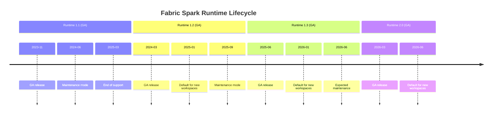

# ⚙️ Spark Runtime Breaking Changes Matrix

<div align="center" markdown>

**Navigate Fabric Spark Runtime Upgrades with Confidence**


</div>

---

**Last Updated:** `2026-04-27` | **Version:** 1.0.0

---

## 🎯 Overview

Microsoft Fabric bundles Apache Spark, Delta Lake, Python, and dozens of pre-installed libraries into a managed runtime. Runtime upgrades can introduce breaking changes at multiple levels: Spark APIs, Python language features, library versions, Delta Lake protocol requirements, and configuration defaults. This guide provides a comprehensive matrix of every breaking change across Fabric Spark Runtime versions 1.1 through 2.0, with migration checklists and rollback procedures.

### Runtime Lifecycle



---

## 📊 Runtime Version Matrix

### Core Component Versions

| Component | Runtime 1.1 | Runtime 1.2 | Runtime 1.3 | Runtime 2.0 |
|-----------|:-----------:|:-----------:|:-----------:|:-----------:|
| **Apache Spark** | 3.4.1 | 3.5.0 | 3.5.1 | 4.0.0 |
| **Delta Lake** | 2.4.0 | 3.1.0 | 3.2.0 | 4.0.0 |
| **Python** | 3.10 | 3.11 | 3.11 | 3.12 |
| **Java** | 11 | 11 | 17 | 17 |
| **Scala** | 2.12.17 | 2.12.18 | 2.12.18 | 2.13.12 |
| **R** | 4.2 | 4.3 | 4.3 | 4.4 |
| **Pandas** | 1.5.3 | 2.1.4 | 2.2.1 | 2.2.2 |
| **NumPy** | 1.24.3 | 1.26.4 | 1.26.4 | 2.0.1 |
| **mssparkutils** | 1.0 | 1.1 | 1.2 | 2.0 |

### Breaking Change Severity Legend

| Symbol | Severity | Action Required |
|:------:|----------|-----------------|
| 🟢 | None | No changes needed |
| 🟡 | Low | Minor code updates, deprecation warnings |
| 🟠 | Medium | Code changes required, may affect behavior |
| 🔴 | High | Significant refactoring, potential data issues |
| ⛔ | Critical | Must fix before upgrade, data corruption risk |

---

## 🐍 Python Version Changes

### Python 3.10 → 3.11 (Runtime 1.1 → 1.2)

| Change | Severity | Impact | Migration |
|--------|:--------:|--------|-----------|
| `match`/`case` syntax available | 🟢 | New feature, no breakage | Optional adoption |
| Exception groups (`ExceptionGroup`) | 🟢 | New feature | Optional adoption |
| `tomllib` in standard library | 🟢 | Can replace `toml` package | Optional |
| f-string parsing improvements | 🟢 | Existing f-strings work | None |
| Faster CPython (10-60%) | 🟢 | Performance improvement | None |

### Python 3.11 → 3.12 (Runtime 1.3 → 2.0)

| Change | Severity | Impact | Migration |
|--------|:--------:|--------|-----------|
| `distutils` removed | 🔴 | `from distutils import ...` fails | Use `setuptools` or `packaging` |
| `imp` module removed | 🟠 | `import imp` fails | Use `importlib` |
| `asynchat`, `asyncore` removed | 🟠 | Legacy async code breaks | Use `asyncio` |
| f-string nesting allowed | 🟢 | New feature | Optional |
| `typing.TypeVar` defaults | 🟢 | New feature | Optional |
| Comprehension inlining | 🟢 | Performance improvement | None |
| `unittest.mock` changes | 🟡 | Some mock behaviors differ | Review test assertions |

```python
# ❌ Runtime 1.3 (Python 3.11): Works
from distutils.version import LooseVersion
if LooseVersion("1.2.3") > LooseVersion("1.2.0"):
    pass

# ✅ Runtime 2.0 (Python 3.12): Required replacement
from packaging.version import Version
if Version("1.2.3") > Version("1.2.0"):
    pass
```

---

## 📦 Library Breaking Changes

### Pandas 1.5 → 2.x

| Change | Severity | 1.5 Behavior | 2.x Behavior | Migration |
|--------|:--------:|-------------|-------------|-----------|
| `append()` removed | 🔴 | `df.append(row)` | Removed | Use `pd.concat([df, row])` |
| Copy-on-Write default | 🟠 | Mutable views | CoW by default | Review in-place modifications |
| `datetime64` resolution | 🟠 | Nanosecond only | Variable (ns, us, ms, s) | Check timestamp arithmetic |
| `inplace` deprecation trend | 🟡 | Widely supported | Some deprecated | Chain operations instead |
| `GroupBy.apply` behavior | 🟠 | Includes group keys | `include_groups=False` default | Add explicit parameter |
| `DataFrame.swaplevel` | 🟡 | Positional args | Keyword-only | Use `axis=` keyword |

```python
# ❌ Pandas 1.5 (Runtime 1.1)
df = df.append({"col": "value"}, ignore_index=True)

# ✅ Pandas 2.x (Runtime 1.2+)
df = pd.concat([df, pd.DataFrame([{"col": "value"}])], ignore_index=True)
```

```python
# ❌ Pandas 1.5: Mutable view behavior
df2 = df[["col_a", "col_b"]]
df2["col_a"] = 0  # Mutates df in some cases (SettingWithCopyWarning)

# ✅ Pandas 2.x: Copy-on-Write — df is never mutated
df2 = df[["col_a", "col_b"]]
df2["col_a"] = 0  # Only df2 changes, never df
```

### NumPy 1.24 → 2.0

| Change | Severity | 1.24 Behavior | 2.0 Behavior | Migration |
|--------|:--------:|-------------|-------------|-----------|
| `np.bool` alias removed | 🔴 | Alias for `bool` | `AttributeError` | Use `np.bool_` or `bool` |
| `np.int` alias removed | 🔴 | Alias for `int` | `AttributeError` | Use `np.int_` or `int` |
| `np.float` alias removed | 🔴 | Alias for `float` | `AttributeError` | Use `np.float64` or `float` |
| `np.complex` alias removed | 🔴 | Alias for `complex` | `AttributeError` | Use `np.complex128` |
| `np.object` alias removed | 🔴 | Alias for `object` | `AttributeError` | Use `np.object_` or `object` |
| `np.str` alias removed | 🔴 | Alias for `str` | `AttributeError` | Use `np.str_` or `str` |
| String representation changes | 🟡 | `np.array([1])` | Different repr | Update test assertions |
| `np.in1d` deprecated | 🟡 | Working | Deprecation warning | Use `np.isin` |

```python
# ❌ NumPy 1.24 (Runtime 1.1/1.2)
arr = np.array([1, 2, 3], dtype=np.int)
mask = np.array([True, False, True], dtype=np.bool)

# ✅ NumPy 2.0 (Runtime 2.0)
arr = np.array([1, 2, 3], dtype=np.int_)
mask = np.array([True, False, True], dtype=np.bool_)
```

### Delta Lake / delta-spark

| Change | Severity | Old Version | New Version | Migration |
|--------|:--------:|------------|------------|-----------|
| `DeltaTable.convertToDelta` API change | 🟠 | Positional args | Named args | Use keyword arguments |
| Protocol version requirements | ⛔ | Reader V1/Writer V2 | Reader V3/Writer V7 | See Delta Protocol section |
| Deletion vectors default ON | 🟠 | Off by default | On by default | May increase read latency initially |
| Liquid clustering GA | 🟢 | Preview | GA | Can replace ZORDER |
| `OPTIMIZE` output schema | 🟡 | Fewer columns | Additional metrics | Update assertions on OPTIMIZE output |
| Default Parquet writer version | 🟡 | V1 | V2 | Forward-compatible |
| Coordinated commits | 🟠 | Not available | Available | New concurrency model |

### mssparkutils Changes

| Change | Severity | Old API | New API | Migration |
|--------|:--------:|---------|---------|-----------|
| `fs.mount` removed | 🔴 | `mssparkutils.fs.mount()` | Not available | Use OneLake paths directly |
| Credential API changes | 🟠 | `credentials.getToken()` | `credentials.getAccessToken()` | Update method name |
| Notebook reference API | 🟡 | `notebook.run("name")` | `notebook.run("name", timeout)` | Add timeout parameter |
| `fs.head` output type | 🟡 | Returns string | Returns bytes in some cases | Handle both types |

```python
# ❌ Runtime 1.1: Mount-based access
mssparkutils.fs.mount("abfss://container@storage.dfs.core.windows.net", "/mnt/data")
df = spark.read.parquet("/mnt/data/file.parquet")

# ✅ Runtime 2.0: Direct OneLake path
df = spark.read.parquet("abfss://workspace@onelake.dfs.fabric.microsoft.com/lakehouse/Files/data/file.parquet")
```

---

## 🔺 Delta Lake Protocol Versions

### Protocol Compatibility Matrix

| Feature | Min Reader | Min Writer | Runtime 1.1 | Runtime 1.2 | Runtime 1.3 | Runtime 2.0 |
|---------|:----------:|:----------:|:-----------:|:-----------:|:-----------:|:-----------:|
| Basic Delta | 1 | 1 | ✅ | ✅ | ✅ | ✅ |
| Column mapping | 2 | 5 | ✅ | ✅ | ✅ | ✅ |
| Deletion vectors | 3 | 7 | ❌ | ✅ | ✅ | ✅ |
| Liquid clustering | 3 | 7 | ❌ | ❌ | ✅ | ✅ |
| Row tracking | 3 | 7 | ❌ | ❌ | ❌ | ✅ |
| V2 checkpoints | 3 | 7 | ❌ | ❌ | ❌ | ✅ |

> **Critical Warning:** Once a table's protocol version is upgraded, older runtimes cannot read or write to it. This is a one-way operation. Never upgrade table protocol without ensuring all consumers run a compatible runtime.

### Checking Table Protocol

```python
from delta.tables import DeltaTable

dt = DeltaTable.forName(spark, "silver.player_transactions")
detail = dt.detail().select("minReaderVersion", "minWriterVersion").collect()[0]
print(f"Reader: V{detail.minReaderVersion}, Writer: V{detail.minWriterVersion}")

# Check all tables for protocol compatibility
tables = spark.sql("SHOW TABLES IN silver").collect()
for t in tables:
    try:
        dt = DeltaTable.forName(spark, f"silver.{t.tableName}")
        detail = dt.detail().select("minReaderVersion", "minWriterVersion", "name").collect()[0]
        print(f"{detail.name}: Reader V{detail.minReaderVersion}, Writer V{detail.minWriterVersion}")
    except Exception as e:
        print(f"silver.{t.tableName}: Error - {e}")
```

---

## ⚡ Spark Configuration Changes

### Default Value Changes

| Configuration | Runtime 1.1 | Runtime 1.2 | Runtime 1.3 | Runtime 2.0 | Impact |
|--------------|:-----------:|:-----------:|:-----------:|:-----------:|--------|
| `spark.sql.adaptive.enabled` | true | true | true | true | 🟢 No change |
| `spark.sql.adaptive.coalescePartitions.enabled` | true | true | true | true | 🟢 No change |
| `spark.sql.shuffle.partitions` | 200 | 200 | auto | auto | 🟡 AQE auto-tuning |
| `spark.sql.sources.partitionOverwriteMode` | static | static | dynamic | dynamic | 🟠 Partition overwrite behavior |
| `spark.sql.parquet.datetimeRebaseModeInRead` | EXCEPTION | CORRECTED | CORRECTED | CORRECTED | 🟡 Historic dates |
| `spark.sql.ansi.enabled` | false | false | true | true | 🔴 Type errors on overflow |
| `spark.sql.legacy.timeParserPolicy` | LEGACY | LEGACY | CORRECTED | EXCEPTION | 🟠 Date parsing strictness |

### ANSI Mode Impact (Runtime 1.3+)

```python
# ❌ Pre-ANSI (Runtime 1.1/1.2): Silent overflow
spark.sql("SELECT CAST(2147483648 AS INT)")  # Returns -2147483648 (overflow wraps)

# ✅ ANSI mode (Runtime 1.3+): Throws ArithmeticException
# spark.sql("SELECT CAST(2147483648 AS INT)")  # ERROR: overflow

# To handle safely:
spark.sql("SELECT TRY_CAST(2147483648 AS INT)")  # Returns NULL
# Or explicitly:
spark.sql("SELECT CAST(2147483648 AS BIGINT)")  # Returns correct value
```

### Partition Overwrite Mode Change

```python
# ❌ Static mode (Runtime 1.1/1.2): Overwrites ALL partitions
df.write.format("delta") \
    .mode("overwrite") \
    .partitionBy("gaming_date") \
    .saveAsTable("bronze.slot_telemetry")
# Deletes data for ALL dates, writes only today's data

# ✅ Dynamic mode (Runtime 1.3+): Overwrites only affected partitions
# Same code now only overwrites partitions present in df
# Explicitly set if you need old behavior:
spark.conf.set("spark.sql.sources.partitionOverwriteMode", "static")
```

---

## 🔧 Migration Checklist

### Pre-Upgrade (1 Week Before)

```markdown
- [ ] Inventory all notebooks and their library imports
- [ ] Run `grep -r "np\.bool\b\|np\.int\b\|np\.float\b\|np\.object\b" notebooks/`
- [ ] Run `grep -r "\.append(" notebooks/` to find pandas append calls
- [ ] Run `grep -r "distutils" notebooks/` to find distutils usage
- [ ] Check Delta table protocol versions (see script above)
- [ ] Document current Spark config overrides
- [ ] Review custom library versions in environment.yml
- [ ] Run full test suite on current runtime (baseline)
- [ ] Back up critical Delta tables: `CREATE TABLE ... DEEP CLONE`
```

### During Upgrade

```markdown
- [ ] Set new runtime version in Fabric workspace settings
- [ ] Run smoke test notebook (core operations)
- [ ] Run schema validation on all Bronze/Silver/Gold tables
- [ ] Verify mssparkutils API calls work
- [ ] Check Spark UI for new warnings or errors
- [ ] Validate Delta table read/write operations
- [ ] Test Direct Lake connectivity
```

### Post-Upgrade (1 Week After)

```markdown
- [ ] Run full test suite on new runtime
- [ ] Compare query performance metrics (before/after)
- [ ] Review Spark event logs for deprecated API warnings
- [ ] Update environment.yml with new compatible library versions
- [ ] Update CLAUDE.md with new runtime version
- [ ] Document any behavioral changes observed
- [ ] Remove deep clone backups after 30-day stabilization
```

---

## 🧪 Testing Strategy

### Automated Compatibility Scanner

```python
import ast
import os
from pathlib import Path

BREAKING_PATTERNS = {
    "runtime_2.0": {
        "np.bool": "Replace with np.bool_ or bool",
        "np.int": "Replace with np.int_ or int",
        "np.float": "Replace with np.float64 or float",
        "np.object": "Replace with np.object_ or object",
        "np.str": "Replace with np.str_ or str",
        ".append(": "pandas append removed — use pd.concat",
        "from distutils": "distutils removed in Python 3.12",
        "import imp": "imp removed in Python 3.12",
        "mssparkutils.fs.mount": "fs.mount removed in Runtime 2.0",
    }
}

def scan_notebook(file_path: str, target_runtime: str = "runtime_2.0") -> list:
    """Scan a notebook for breaking changes."""
    issues = []
    patterns = BREAKING_PATTERNS.get(target_runtime, {})

    with open(file_path, "r", encoding="utf-8") as f:
        for line_num, line in enumerate(f, 1):
            for pattern, fix in patterns.items():
                if pattern in line:
                    issues.append({
                        "file": file_path,
                        "line": line_num,
                        "pattern": pattern,
                        "fix": fix,
                        "code": line.strip()
                    })
    return issues

# Scan all notebooks
notebook_dir = Path("notebooks")
all_issues = []
for nb in notebook_dir.rglob("*.py"):
    all_issues.extend(scan_notebook(str(nb)))

print(f"Found {len(all_issues)} potential breaking changes:")
for issue in all_issues:
    print(f"  {issue['file']}:{issue['line']} — {issue['pattern']} → {issue['fix']}")
```

### Runtime Comparison Test

```python
def runtime_compatibility_test():
    """Smoke test for core operations across runtime versions."""
    results = {}

    # Test 1: Delta read/write
    try:
        df = spark.range(1000).toDF("id")
        df.write.format("delta").mode("overwrite").saveAsTable("test.runtime_check")
        spark.table("test.runtime_check").count()
        results["delta_rw"] = "PASS"
    except Exception as e:
        results["delta_rw"] = f"FAIL: {e}"

    # Test 2: Pandas conversion
    try:
        pdf = spark.range(100).toPandas()
        assert len(pdf) == 100
        results["pandas_convert"] = "PASS"
    except Exception as e:
        results["pandas_convert"] = f"FAIL: {e}"

    # Test 3: mssparkutils
    try:
        files = mssparkutils.fs.ls("Files/")
        results["mssparkutils"] = "PASS"
    except Exception as e:
        results["mssparkutils"] = f"FAIL: {e}"

    # Test 4: ANSI mode behavior
    try:
        result = spark.sql("SELECT TRY_CAST('not_a_number' AS INT)").collect()
        results["ansi_mode"] = "PASS" if result[0][0] is None else "UNEXPECTED"
    except Exception as e:
        results["ansi_mode"] = f"FAIL: {e}"

    # Test 5: NumPy types
    try:
        import numpy as np
        arr = np.array([1, 2, 3], dtype=np.int_)
        mask = np.array([True, False], dtype=np.bool_)
        results["numpy_types"] = "PASS"
    except Exception as e:
        results["numpy_types"] = f"FAIL: {e}"

    return results
```

---

## 🔙 Rollback Procedures

### Workspace-Level Rollback

```markdown
1. Navigate to Fabric Workspace → Settings → Spark Settings
2. Change Runtime Version back to previous version
3. Wait for runtime pool to restart (~5 minutes)
4. Run smoke test notebook to verify rollback
5. Check Delta table accessibility (protocol version may block!)
```

### Table-Level Rollback

```python
# If a Delta table protocol was upgraded and you need to roll back:
# WARNING: Protocol downgrades are NOT supported by Delta Lake

# Option 1: Restore from deep clone backup
spark.sql("DROP TABLE silver.player_transactions")
spark.sql("""
    CREATE TABLE silver.player_transactions
    DEEP CLONE silver.player_transactions_backup_pre_upgrade
""")

# Option 2: Export and re-import
df = spark.read.format("delta").load("path/to/backup/")
df.write.format("delta").saveAsTable("silver.player_transactions")
```

---

## 🎰 Casino Workload Impact

| Notebook | Runtime 2.0 Risk | Key Changes |
|----------|:-----------------:|-------------|
| `01_bronze_slot_telemetry.py` | 🟡 Low | mssparkutils path updates |
| `01_silver_slot_cleansed.py` | 🟡 Low | ANSI mode on type casts |
| `01_gold_slot_performance.py` | 🟡 Low | Pandas 2.x for toPandas() |
| Streaming notebooks | 🟠 Medium | Trigger API changes, checkpoint format |
| ML notebooks | 🔴 High | NumPy 2.0 type aliases removed |

## 🏛️ Federal Workload Impact

| Notebook | Runtime 2.0 Risk | Key Changes |
|----------|:-----------------:|-------------|
| USDA Bronze/Silver/Gold | 🟡 Low | Standard Delta operations |
| SBA loan analysis | 🟡 Low | Pandas concat migration |
| NOAA weather forecasting | 🟠 Medium | NumPy 2.0, scikit-learn compat |
| EPA sensor streaming | 🟠 Medium | Streaming API changes |
| DOI geospatial | 🟠 Medium | GeoPandas + NumPy 2.0 |

---

## 🚫 Anti-Patterns

### Anti-Pattern 1: Upgrading Without Testing

```python
# ❌ WRONG: "Just switch the runtime and see what happens"
# ✅ CORRECT: Run the full compatibility scanner and test suite first
```

### Anti-Pattern 2: Upgrading Table Protocols Blindly

```python
# ❌ WRONG: Enabling all new Delta features on production tables
spark.sql("ALTER TABLE silver.transactions SET TBLPROPERTIES ('delta.enableDeletionVectors' = 'true')")
# Now Runtime 1.1 workspaces can't read this table!

# ✅ CORRECT: Only upgrade after confirming all consumers are on compatible runtime
```

### Anti-Pattern 3: Ignoring Deprecation Warnings

```python
# ❌ WRONG: Suppressing warnings and moving on
import warnings
warnings.filterwarnings("ignore", category=DeprecationWarning)

# ✅ CORRECT: Fix deprecated usage before it becomes an error
```

---

## 📚 References

- [Fabric Spark Runtime Versions](https://learn.microsoft.com/en-us/fabric/data-engineering/runtime)
- [Delta Lake Releases](https://github.com/delta-io/delta/releases)
- [Apache Spark Migration Guides](https://spark.apache.org/docs/latest/migration-guide.html)
- [NumPy 2.0 Migration Guide](https://numpy.org/doc/stable/numpy_2_0_migration_guide.html)
- [Pandas 2.0 What's New](https://pandas.pydata.org/docs/whatsnew/v2.0.0.html)
- [Python 3.12 What's New](https://docs.python.org/3/whatsnew/3.12.html)
- [Spark Runtime Migration Guide](../best-practices/spark-runtime-migration.md)

---

> **Next:** [V-Order Tuning Deep Dive](v-order-tuning-deep-dive.md) | [Partition Strategy Decision Tree](partition-strategy-decision-tree.md)
