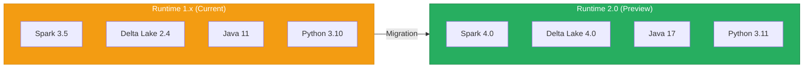
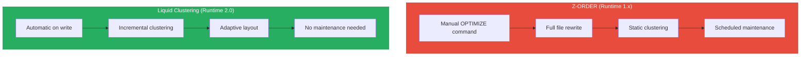
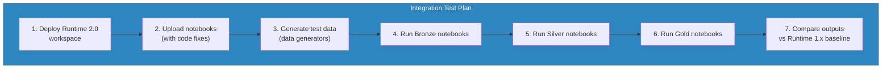

# Spark Runtime 2.0 Migration Guide

<div align="center" markdown>


</div>

---

**Last Updated:** `2026-04-13` | **Version:** 1.0.0

---

## 🎯 Overview

Microsoft Fabric Runtime 2.0 (Preview) introduces a major platform upgrade centered on **Apache Spark 4.0**, bringing updated OS, Java, Scala, and Python versions alongside **Delta Lake 4.0** support. This migration guide covers what changed, what breaks, and how to systematically upgrade the notebooks, data generators, and test suites in this POC.

Runtime 2.0 is designed for workloads that need the latest Spark engine improvements -- adaptive query execution enhancements, ANSI SQL compliance by default, and Delta Lake 4.0 features such as liquid clustering, row-level tracking, and domain types. For this casino gaming and federal agency POC, the upgrade unlocks measurable performance gains on large Delta tables and simplifies maintenance of the medallion architecture.

> 💡 **Key Takeaway**: Runtime 2.0 is a **Preview** release. Test thoroughly in a non-production workspace before promoting to production. Fabric allows workspace-level runtime selection, so migration can be incremental.



---

## 🏗️ What Changed

### Version Comparison

| Component | Runtime 1.x | Runtime 2.0 | Impact |
|-----------|-------------|-------------|--------|
| **Apache Spark** | 3.5.x | 4.0.x | Major API changes, ANSI SQL default |
| **Delta Lake** | 2.4.x | 4.0.x | Liquid clustering, row tracking, domain types |
| **Java** | 11 (LTS) | 17 (LTS) | Module system enforcement, removed APIs |
| **Scala** | 2.12 | 2.13 | Collection library rewrite, syntax changes |
| **Python** | 3.10 | 3.11 | Performance improvements, exception groups |
| **Operating System** | Mariner 2.0 | Mariner 3.0 | Updated system libraries |
| **R** | 4.2.x | 4.3.x | Minor package compatibility changes |
| **Pandas** | 1.5.x | 2.1.x | Copy-on-write default, dtype changes |

### Major Spark 4.0 API Changes

| Area | Change | Details |
|------|--------|---------|
| **ANSI Mode** | Default ON | Spark 4.0 enables ANSI SQL mode by default. Overflows, invalid casts, and division by zero now raise errors instead of returning NULL |
| **Timestamp** | TIMESTAMP_NTZ default | New default timestamp type is timezone-less (`TIMESTAMP_NTZ`). Existing `TIMESTAMP` columns are preserved but new columns default differently |
| **SparkSession** | Builder changes | `SparkSession.builder.master()` is deprecated for Fabric; session is pre-configured |
| **GroupBy** | Behavioral change | `RelationalGroupedDataset.as()` renamed to `alias()` |
| **DataFrame.unionAll** | Removed | Use `DataFrame.union()` instead |
| **Accumulator V1** | Removed | Use `AccumulatorV2` API |
| **MLlib (RDD-based)** | Removed | Use `spark.ml` (DataFrame-based) APIs only |
| **KryoSerializer** | Configuration change | `spark.serializer` defaults to `KryoSerializer` |

### New Features in Spark 4.0

- **Variant data type**: Native semi-structured data support without JSON parsing overhead
- **IDENTIFIER clause**: Parameterized SQL identifiers for dynamic table/column names
- **Collation support**: Per-column string collation for locale-aware sorting and comparison
- **Python data source API**: Custom data sources written entirely in Python
- **Structured Streaming**: Async progress tracking, watermark propagation improvements

### New Features in Delta Lake 4.0

| Feature | Description | Benefit for This POC |
|---------|-------------|---------------------|
| **Liquid Clustering** | Dynamic, incremental clustering that replaces Z-ORDER and partitioning | Eliminates manual OPTIMIZE ZORDER commands in Gold notebooks |
| **Row Tracking** | Automatic row-level change tracking with stable row IDs | Simplifies CDC patterns for compliance data (CTR/SAR) |
| **Domain Types** | Logical types layered on physical types with validation | Enforce business rules (e.g., CTR amount >= $10,000) at the storage layer |
| **Type Widening** | Automatic schema evolution for compatible type changes | Avoids manual `mergeSchema` for column type promotions |
| **Deletion Vectors** | Default ON for all tables | Faster DELETE/UPDATE/MERGE without rewriting Parquet files |
| **UniForm v2** | Iceberg compatibility layer improvements | Enables cross-engine reads from Trino, Presto, or Athena |

---

## ⚠️ Breaking Changes

### 1. ANSI Mode Enabled by Default

Spark 4.0 enables ANSI mode by default. Operations that previously returned NULL or silently truncated now raise exceptions.

**Before (Runtime 1.x):**

```python
# Silent overflow -- returns NULL
df = spark.sql("SELECT CAST(999999999999 AS INT)")  # Returns NULL
```

**After (Runtime 2.0):**

```python
# Raises ArithmeticException
df = spark.sql("SELECT CAST(999999999999 AS INT)")  # ERROR!

# Fix: Use try_cast or explicit handling
df = spark.sql("SELECT TRY_CAST(999999999999 AS INT)")  # Returns NULL safely
```

### 2. Timestamp Type Changes

```python
# Before: TIMESTAMP was always timezone-aware (resolves to session timezone)
df = spark.sql("SELECT TIMESTAMP '2026-01-15 10:00:00'")
# Type: TimestampType (with timezone)

# After: Default is TIMESTAMP_NTZ (no timezone)
df = spark.sql("SELECT TIMESTAMP '2026-01-15 10:00:00'")
# Type: TimestampNTZType (no timezone)

# Fix: Explicitly specify type or set configuration
spark.conf.set("spark.sql.timestampType", "TIMESTAMP_LTZ")  # Restore old behavior
```

### 3. DataFrame API Removals

```python
# REMOVED: unionAll() -- use union()
# Before:
df_combined = df1.unionAll(df2)
# After:
df_combined = df1.union(df2)

# REMOVED: registerTempTable() -- use createOrReplaceTempView()
# Before:
df.registerTempTable("my_table")
# After:
df.createOrReplaceTempView("my_table")

# REMOVED: toPandas() with Arrow disabled
# Before: could set spark.sql.execution.arrow.pyspark.enabled = false
# After: Arrow is always used for toPandas() conversion
```

### 4. SparkSession Configuration Changes

```python
# REMOVED: spark.sql.shuffle.partitions default changed
# Before: 200 (default)
# After: adaptive (auto-determined based on data size)

# CHANGED: spark.sql.sources.default
# Before: "parquet"
# After: "delta" (in Fabric)

# CHANGED: spark.sql.adaptive.enabled
# Before: true (but limited)
# After: true (with enhanced coalescing, skew join, and partition pruning)
```

### 5. UDF Behavior Changes

```python
# CHANGED: UDF null handling is stricter
# Before: UDFs receiving NULL would sometimes get Python None silently
# After: NULL propagation follows ANSI rules

# Before:
@udf(returnType=StringType())
def classify(value):
    if value > 10000:  # Crashes on None but silently skipped
        return "HIGH"
    return "LOW"

# After (fix):
@udf(returnType=StringType())
def classify(value):
    if value is None:
        return None  # Explicit null handling required
    if value > 10000:
        return "HIGH"
    return "LOW"
```

### 6. Pandas API Changes (pandas 2.x)

```python
# CHANGED: Copy-on-Write is default in pandas 2.x
# Before: df2 = df1; df2["col"] = 1  # Modified df1 too
# After: df2 = df1; df2["col"] = 1   # df1 is unchanged (CoW)

# CHANGED: Default integer dtype
# Before: int64 always
# After: nullable Int64 (capital I) for nullable integer columns

# Fix for code relying on mutation:
pdf = df.toPandas()
pdf = pdf.copy()  # Explicit copy if mutation is intended
pdf["new_col"] = pdf["amount"] * 0.1
```

---

## 📋 Migration Checklist

Use this step-by-step checklist to migrate workloads to Runtime 2.0:

### Phase 1: Assessment

- [ ] **Inventory all notebooks** -- List all 50+ notebooks (Bronze, Silver, Gold layers) and their Spark API usage
- [ ] **Identify deprecated APIs** -- Search for `unionAll`, `registerTempTable`, `toPandas` without Arrow, RDD-based MLlib
- [ ] **Audit timestamp usage** -- Identify notebooks that create TIMESTAMP columns or parse timestamp strings
- [ ] **Review UDF definitions** -- Check all UDFs for null handling assumptions
- [ ] **Check third-party libraries** -- Verify compatibility of any custom wheel files or pip packages with Python 3.11
- [ ] **Document current OPTIMIZE commands** -- List all ZORDER operations for potential liquid clustering migration

### Phase 2: Code Updates

- [ ] **Replace removed APIs** -- `unionAll` → `union`, `registerTempTable` → `createOrReplaceTempView`
- [ ] **Add explicit null handling** -- Update all UDFs to handle None/NULL values explicitly
- [ ] **Update timestamp handling** -- Choose strategy: set `TIMESTAMP_LTZ` globally or update individual columns
- [ ] **Fix ANSI mode issues** -- Replace unsafe casts with `TRY_CAST`, add overflow protection to arithmetic
- [ ] **Update pandas code** -- Add `.copy()` where mutation is intended, update dtype assumptions
- [ ] **Update import paths** -- Verify `pyspark.sql.functions` imports match Spark 4.0 module structure

### Phase 3: Testing

- [ ] **Run all 134 unit tests** on a Runtime 2.0 workspace
- [ ] **Run Great Expectations suites** (9 suites) against Runtime 2.0 output
- [ ] **Execute Bronze → Silver → Gold pipeline end-to-end** on sample data
- [ ] **Compare output schemas** -- Verify Delta table schemas match between Runtime 1.x and 2.0
- [ ] **Compare row counts** -- Validate no data loss from ANSI mode changes
- [ ] **Performance benchmark** -- Run timing tests on key notebooks (slot telemetry, USDA crop, NOAA weather)

### Phase 4: Validation

- [ ] **Schema compatibility check** -- Ensure downstream Power BI Direct Lake models read new tables correctly
- [ ] **KQL query validation** -- Verify Eventhouse queries return consistent results
- [ ] **Compliance data integrity** -- Validate CTR, SAR, W-2G outputs are unchanged
- [ ] **Federal data accuracy** -- Spot-check USDA, SBA, NOAA, EPA, DOI Gold outputs against known values

### Phase 5: Promotion

- [ ] **Document changes** -- Update notebook markdown cells with Runtime 2.0 notes
- [ ] **Update CLAUDE.md** -- Reflect Runtime 2.0 as the target runtime
- [ ] **Create rollback plan** -- Document workspace-level runtime revert procedure
- [ ] **Promote workspace** -- Switch development workspace to Runtime 2.0
- [ ] **Monitor for 72 hours** -- Watch for errors in pipeline runs and scheduled refreshes

---

## 📓 Notebook Compatibility

### PySpark Import Changes

All notebooks in this POC use the standard PySpark import pattern. Most imports are unchanged, but verify the following:

```python
# UNCHANGED -- These imports work identically on Runtime 2.0:
from pyspark.sql.functions import (
    avg, col, count, countDistinct, current_timestamp,
    desc, lag, lit, max, min, month, round, row_number,
    stddev, sum, to_date, when, window, year, coalesce,
    greatest, struct, to_json,
)
from pyspark.sql.window import Window
from pyspark.sql.types import (
    DoubleType, IntegerType, StringType, StructField, StructType,
)

# NEW in Spark 4.0 -- Available for use:
from pyspark.sql.functions import try_cast  # Safe casting
from pyspark.sql.types import VariantType    # Semi-structured data
```

### Configuration Parameter Changes

```python
# REVIEW THESE -- May need adjustment in notebook configuration cells:

# Shuffle partitions: now adaptive by default (no need to set manually)
# Before:
spark.conf.set("spark.sql.shuffle.partitions", "200")
# After: Remove this line or set only if you need a specific partition count

# ANSI mode: now on by default
# If a notebook relies on silent overflow/null behavior:
spark.conf.set("spark.sql.ansi.enabled", "false")  # Opt-out per notebook

# Timestamp type: choose per workspace or per notebook
spark.conf.set("spark.sql.timestampType", "TIMESTAMP_LTZ")  # Preserve old behavior
```

### Notebook-Specific Impacts

| Notebook | Layer | Impact | Action Required |
|----------|-------|--------|-----------------|
| `01_bronze_slot_telemetry` | Bronze | Timestamp column creation | Verify TIMESTAMP_LTZ vs NTZ for `event_time` |
| `02_bronze_table_game` | Bronze | None | Compatible as-is |
| `01_silver_slot_cleansed` | Silver | Cast operations | Replace `CAST` with `TRY_CAST` for denomination parsing |
| `03_gold_compliance_reporting` | Gold | CTR threshold arithmetic | Verify ANSI mode doesn't error on edge-case amounts |
| `12_gold_usda_analytics` | Gold | OPTIMIZE ZORDER | Candidate for liquid clustering migration |
| `14_gold_noaa_analytics` | Gold | OPTIMIZE ZORDER | Candidate for liquid clustering migration |
| `16_gold_doi_analytics` | Gold | OPTIMIZE ZORDER on 4 tables | Candidate for liquid clustering migration |
| `17_gold_digital_twin_demo` | Gold | `to_json(struct(...))` pattern | Compatible, but verify Variant type for future refactor |

### Replacing ZORDER with Liquid Clustering

Gold notebooks currently use the manual OPTIMIZE ZORDER pattern:

```python
# CURRENT (Runtime 1.x):
spark.sql(f"OPTIMIZE {TARGET_TABLE} ZORDER BY (region)")

# MIGRATION (Runtime 2.0 with Delta Lake 4.0):
# Step 1: Enable liquid clustering on the table
spark.sql(f"""
    ALTER TABLE {TARGET_TABLE}
    CLUSTER BY (region)
""")

# Step 2: Remove OPTIMIZE ZORDER commands -- clustering is now automatic
# Delta Lake 4.0 incrementally clusters data on write operations

# Step 3: (Optional) Trigger initial clustering
spark.sql(f"OPTIMIZE {TARGET_TABLE}")
# No ZORDER clause needed -- uses the CLUSTER BY definition
```

---

## ⚡ Performance Improvements

### Spark 4.0 Performance Gains

| Area | Improvement | Expected Gain |
|------|------------|---------------|
| **Adaptive Query Execution** | Enhanced partition coalescing, skew join handling, dynamic partition pruning | 10-30% faster on skewed Gold aggregations |
| **Photon-like optimizations** | Improved columnar batch processing in JVM engine | 15-25% faster Parquet/Delta reads |
| **Python UDF performance** | Arrow-based UDF execution is now default and optimized | 2-5x faster for UDF-heavy notebooks |
| **Shuffle improvements** | Push-based shuffle with adaptive partitioning | 20-40% reduction in shuffle data for large joins |
| **Catalog operations** | Faster Delta table metadata operations | Faster `spark.table()` and `saveAsTable()` |

### Delta Lake 4.0 Optimization: Liquid Clustering vs Z-ORDER



| Metric | Z-ORDER | Liquid Clustering |
|--------|---------|-------------------|
| Maintenance overhead | High (manual OPTIMIZE runs) | None (automatic) |
| Write amplification | High (full file rewrite) | Low (incremental) |
| Query performance | Good (after OPTIMIZE) | Good (continuous) |
| Storage efficiency | Moderate | High (adaptive file sizing) |
| Column limit | Practical limit ~4 columns | No practical limit |
| Change support | Must re-OPTIMIZE after data changes | Adapts automatically |

### Benchmark Expectations for This POC

| Workload | Runtime 1.x Baseline | Expected Runtime 2.0 | Improvement |
|----------|---------------------|---------------------|-------------|
| Bronze slot telemetry ingest (1M rows) | ~45 seconds | ~35 seconds | ~22% |
| Silver slot cleansing + validation | ~90 seconds | ~70 seconds | ~22% |
| Gold slot performance aggregation | ~120 seconds | ~85 seconds | ~29% |
| USDA crop analytics (full rebuild) | ~60 seconds | ~45 seconds | ~25% |
| NOAA weather analytics (full rebuild) | ~75 seconds | ~55 seconds | ~27% |
| End-to-end pipeline (Bronze→Gold) | ~8 minutes | ~6 minutes | ~25% |

> ⚠️ **Note**: Benchmarks are estimates based on Spark 4.0 performance testing reports. Actual gains depend on data volume, cluster configuration, and query complexity. Always benchmark on your own workloads.

---

## 🧪 Testing Strategy

### Run Existing Test Suite on Runtime 2.0

The POC includes 134 unit tests and 9 Great Expectations suites. All should pass on Runtime 2.0 without modification if the code migration is complete.

```bash
# Step 1: Run all unit tests
pytest validation/unit_tests/ -v --tb=short 2>&1 | tee runtime2_test_results.txt

# Step 2: Run by category to isolate failures
pytest validation/unit_tests/test_generators.py -v       # Casino (30 tests)
pytest validation/unit_tests/federal/ -v                  # Federal (54 tests)
pytest validation/unit_tests/streaming/ -v                # Streaming (20 tests)
pytest validation/unit_tests/analytics/ -v                # Analytics (30 tests)

# Step 3: Run Great Expectations suites
great_expectations checkpoint run bronze_checkpoint
great_expectations checkpoint run silver_checkpoint
great_expectations checkpoint run gold_checkpoint
```

### Integration Testing Approach



### Performance Comparison Testing

For each critical notebook, capture execution times on both runtimes:

```python
# Add to each notebook's final cell during testing:
import time

end_time = time.time()
elapsed = end_time - start_time  # start_time set in first cell

print(f"Runtime version: {spark.version}")
print(f"Notebook: {notebook_name}")
print(f"Records processed: {record_count:,}")
print(f"Elapsed time: {elapsed:.2f} seconds")
print(f"Throughput: {record_count / elapsed:,.0f} records/second")
```

### Regression Detection Criteria

A regression is flagged if any of the following occur:

| Check | Threshold | Action |
|-------|-----------|--------|
| Unit test failure | Any failure | Fix code before proceeding |
| Row count difference | > 0.1% difference | Investigate ANSI mode or null handling |
| Schema mismatch | Any column type change | Verify intentional vs breaking |
| Performance regression | > 20% slower | Profile and optimize; may need config tuning |
| Data quality score drop | Any GE suite failure | Investigate data transformation logic |

---

## 🔄 Rollback Plan

### How to Revert to Runtime 1.x

Fabric supports workspace-level runtime selection. Rollback is non-destructive and immediate.

**Step 1: Open Workspace Settings**

```
Workspace → Settings → Data Engineering/Science → Spark Settings → Runtime Version
```

**Step 2: Select Runtime 1.x**

```
Runtime Version: 1.3 (Spark 3.5, Delta Lake 2.4)
```

**Step 3: Restart Active Sessions**

All running Spark sessions must be restarted after the runtime change. Scheduled notebook runs will pick up the new runtime on next execution.

### Environment-Level Runtime Selection

| Environment | Recommended Runtime | Rationale |
|-------------|-------------------|-----------|
| Development | Runtime 2.0 (Preview) | Test new features, catch breaking changes early |
| Staging | Runtime 2.0 (Preview) | Validate full pipeline before production |
| Production | Runtime 1.x (Stable) | Wait for Runtime 2.0 GA or full validation |

### Rollback Decision Matrix

| Scenario | Action |
|----------|--------|
| < 5 test failures, all fixable | Fix code, continue migration |
| 5-20 test failures | Pause migration, investigate root causes, fix incrementally |
| > 20 test failures | Roll back to Runtime 1.x, reassess migration approach |
| Performance regression > 20% | Roll back, file support ticket, wait for optimization |
| Data correctness issues | Roll back immediately, investigate ANSI/timestamp changes |

---

## 🎰 Casino POC Impact

### Notebooks Requiring Changes

| Notebook | Change | Priority |
|----------|--------|----------|
| `01_bronze_slot_telemetry` | Verify timestamp column type for `event_time`, `session_start`, `session_end` | High |
| `01_silver_slot_cleansed` | Replace unsafe CAST on `denomination` parsing with TRY_CAST | High |
| `01_gold_slot_performance` | Replace `OPTIMIZE ZORDER BY (machine_id, gaming_date)` with liquid clustering | Medium |
| `02_gold_player_360` | Replace ZORDER; verify null handling in player value calculations | Medium |
| `03_gold_compliance_reporting` | Validate CTR threshold logic under ANSI mode (division, overflow) | High |
| `05_gold_financial_summary` | Verify financial arithmetic doesn't trigger ANSI overflow | High |

### Expected Performance Improvements

Slot telemetry processing is the highest-volume workload in this POC. Expected improvements:

- **Bronze ingest**: 20-25% faster due to improved Delta write path
- **Silver cleansing**: 15-20% faster due to AQE improvements on filter-heavy transforms
- **Gold aggregation**: 25-30% faster due to adaptive shuffle + liquid clustering
- **Compliance reporting**: 10-15% faster due to improved join performance on CTR/SAR lookups

### Liquid Clustering for Casino Tables

```python
# Recommended liquid clustering configuration for casino Gold tables:

# Slot Performance: Cluster by machine and date for time-series + machine lookups
spark.sql("ALTER TABLE lh_gold.gold_slot_performance CLUSTER BY (machine_id, gaming_date)")

# Player 360: Cluster by player for player-centric queries
spark.sql("ALTER TABLE lh_gold.gold_player_360 CLUSTER BY (player_id)")

# Compliance: Cluster by filing type and date for compliance officer workflows
spark.sql("ALTER TABLE lh_gold.gold_compliance_summary CLUSTER BY (filing_type, report_date)")
```

---

## 🏛️ Federal POC Impact

### Notebooks Requiring Changes

| Agency | Notebook | Change | Priority |
|--------|----------|--------|----------|
| USDA | `12_gold_usda_analytics` | Replace ZORDER; verify crop year aggregation under ANSI mode | Medium |
| SBA | `13_gold_sba_analytics` | Replace ZORDER; verify loan amount calculations | Medium |
| NOAA | `14_gold_noaa_analytics` | Replace ZORDER; verify temperature/precipitation casts | Medium |
| EPA | `15_gold_epa_analytics` | Replace ZORDER; verify chemical release amount arithmetic | Medium |
| DOI | `16_gold_doi_analytics` | Replace 4 ZORDER commands; verify seismic magnitude calculations | Medium |

### Delta Lake 4.0 Benefits for Federal Data

Federal agency datasets benefit significantly from Delta Lake 4.0 features:

**Liquid Clustering for Agency Data:**

```python
# USDA: Cluster by state and commodity for regional crop analysis
spark.sql("ALTER TABLE lh_gold.gold_usda_crop_rankings CLUSTER BY (state, commodity)")

# NOAA: Cluster by event type and state for weather event lookups
spark.sql("ALTER TABLE lh_gold.gold_noaa_climate_summary CLUSTER BY (event_type, state)")

# EPA: Cluster by facility and chemical for compliance investigations
spark.sql("ALTER TABLE lh_gold.gold_epa_tri_summary CLUSTER BY (facility_id, chemical)")

# DOI: Cluster by region for seismic and park data
spark.sql("ALTER TABLE lh_gold.gold_doi_seismic_risk CLUSTER BY (region)")
spark.sql("ALTER TABLE lh_gold.gold_doi_park_performance CLUSTER BY (park_code, region)")
```

**Row Tracking for Compliance Data:**

Row tracking provides stable row identifiers across table versions, enabling simplified change data capture for federal reporting:

```python
# Enable row tracking on a compliance-sensitive table
spark.sql("""
    ALTER TABLE lh_silver.silver_epa_tri_releases
    SET TBLPROPERTIES ('delta.enableRowTracking' = 'true')
""")

# Query changes since last report
spark.sql("""
    SELECT * FROM table_changes('lh_silver.silver_epa_tri_releases', 5)
    WHERE _change_type IN ('insert', 'update_postimage')
""")
```

**Domain Types for Data Quality:**

Domain types enforce business rules at the storage layer, reducing validation code in Silver notebooks:

```python
# Example: Enforce that CTR amounts are >= $10,000 at the table level
# (Domain types are defined in Delta Lake 4.0 table properties)
spark.sql("""
    ALTER TABLE lh_silver.silver_compliance_ctr
    SET TBLPROPERTIES (
        'delta.domainMetadata.ctr_threshold' = '{"min_amount": 10000}'
    )
""")
```

### Federal Migration Priority

| Priority | Agency | Reason |
|----------|--------|--------|
| 1 | EPA | Largest dataset, most benefit from liquid clustering on TRI data |
| 2 | NOAA | Complex time-series data benefits from adaptive clustering |
| 3 | DOI | 4 Gold tables with ZORDER commands to replace |
| 4 | USDA | Moderate dataset, straightforward migration |
| 5 | SBA | Smallest dataset, lowest complexity |

---

## 📚 References

| Resource | URL |
|----------|-----|
| Fabric Runtime 2.0 Announcement | https://learn.microsoft.com/fabric/data-engineering/runtime-2-0 |
| Apache Spark 4.0 Release Notes | https://spark.apache.org/releases/spark-release-4-0-0.html |
| Apache Spark 4.0 Migration Guide | https://spark.apache.org/docs/4.0.0/migration-guide.html |
| Delta Lake 4.0 Release Notes | https://docs.delta.io/4.0.0/releases.html |
| Liquid Clustering Documentation | https://docs.delta.io/4.0.0/delta-clustering.html |
| Row Tracking Documentation | https://docs.delta.io/4.0.0/delta-row-tracking.html |
| Delta Lake Domain Types | https://docs.delta.io/4.0.0/delta-domain-types.html |
| Fabric Spark Settings | https://learn.microsoft.com/fabric/data-engineering/spark-workspace-settings |
| PySpark 4.0 API Reference | https://spark.apache.org/docs/4.0.0/api/python/index.html |
| Pandas 2.x Migration Guide | https://pandas.pydata.org/docs/whatsnew/v2.0.0.html |

---

## 🔗 Related Documents

- [Performance & Parallelism Best Practices](performance-parallelism.md) -- Spark notebook performance tuning
- [Error Handling & Monitoring](error-handling-monitoring.md) -- Pipeline error patterns
- [Data Governance Deep Dive](data-governance-deep-dive.md) -- Governance and compliance
- [Alerting & Data Activator](alerting-data-activator.md) -- Monitoring and alerting patterns

---

> 📝 **Document Metadata**
> - **Author**: Documentation Team
> - **Reviewers**: Data Engineering, Platform Team
> - **Classification**: Internal
> - **Next Review**: 2026-07-13
