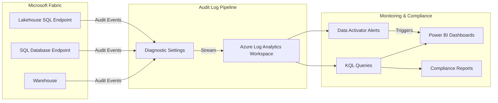
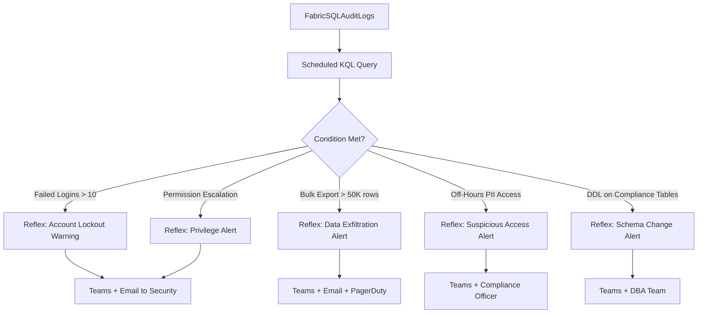

[Home](../index.md) > [Docs](../) > [Best Practices](./) > SQL Audit Logs & Compliance

# 🔒 SQL Audit Logs & Compliance

<div align="center" markdown>

**Immutable Audit Trails for Regulated Workloads**


</div>

---

**Last Updated:** `2026-04-13` | **Version:** 1.0.0

---

## 📑 Table of Contents

- [🎯 Overview](#-overview)
- [🏗️ Architecture](#️-architecture)
- [⚙️ Configuration](#️-configuration)
- [🔍 KQL Audit Queries](#-kql-audit-queries)
- [🎰 Casino Compliance Monitoring](#-casino-compliance-monitoring)
- [🏛️ Federal Agency Audit Requirements](#️-federal-agency-audit-requirements)
- [📊 Retention Policies](#-retention-policies)
- [🔔 Alerting Integration](#-alerting-integration)
- [📈 Audit Dashboards](#-audit-dashboards)
- [⚠️ Limitations](#️-limitations)
- [📚 References](#-references)

---

## 🎯 Overview

SQL Audit Logs, generally available since March 2026, provide an immutable record of all database activities within Microsoft Fabric Warehouses and SQL Database endpoints. Every T-SQL statement executed against these resources is captured with full context, enabling compliance teams to answer the fundamental audit question: **who did what, when, and how**.

### What Gets Captured

| Field | Description |
|-------|-------------|
| **Timestamp** | UTC time the statement was executed |
| **User/Process Identity** | Service principal, user UPN, or managed identity |
| **Executed Statement** | The full T-SQL statement text |
| **Object Name** | Table, view, or stored procedure accessed |
| **Action Type** | SELECT, INSERT, UPDATE, DELETE, DDL, LOGIN |
| **Duration** | Execution time in milliseconds |
| **Rows Affected** | Number of rows returned or modified |
| **Client IP** | Source IP address of the connection |
| **Application Name** | Client application that issued the query |
| **Workspace** | Fabric workspace where the activity occurred |

### Why It Matters

Regulated industries face strict audit requirements. Casino gaming operations must demonstrate who accessed CTR, SAR, and W-2G data and when. Federal agencies operating under FISMA and FedRAMP need continuous audit logging with defined retention periods. Healthcare workloads governed by HIPAA require six-year log retention with PHI access tracking. SQL Audit Logs provide the foundational telemetry to satisfy all of these requirements without custom logging infrastructure.

> **Note:** SQL Audit Logs complement, but do not replace, Microsoft Purview governance and sensitivity labels. Use both together for defense-in-depth compliance.

---

## 🏗️ Architecture

SQL Audit Logs flow from Fabric compute resources into Azure Log Analytics, where they become queryable via KQL. From there, alerts and dashboards consume the log data in near real time.



### Log Flow Detail

1. **Generation** -- Every T-SQL statement executed against a Fabric Warehouse or SQL Database endpoint generates an audit event. Events are created synchronously at query execution time and cannot be suppressed by the user.
2. **Collection** -- Diagnostic settings on the Fabric capacity route audit events to an Azure Log Analytics workspace. Events arrive with a typical latency of 2-5 minutes.
3. **Storage** -- Log Analytics stores events in the `FabricSQLAuditLogs` table. Retention is configurable per-workspace, up to 730 days natively, with long-term export to Storage Account for extended retention.
4. **Analysis** -- KQL queries run against the `FabricSQLAuditLogs` table for ad-hoc investigation, scheduled compliance reports, and real-time alerting via Data Activator.

---

## ⚙️ Configuration

### Step 1: Enable Diagnostic Settings

Navigate to the Fabric capacity in the Azure portal and configure diagnostic settings to route SQL audit logs to your Log Analytics workspace.

```bash
# Azure CLI: Enable diagnostic settings on Fabric capacity
az monitor diagnostic-settings create \
  --name "fabric-sql-audit" \
  --resource "/subscriptions/{sub-id}/resourceGroups/{rg}/providers/Microsoft.Fabric/capacities/{capacity-name}" \
  --workspace "/subscriptions/{sub-id}/resourceGroups/{rg}/providers/Microsoft.OperationalInsights/workspaces/{law-name}" \
  --logs '[{"category": "SQLAuditLogs", "enabled": true, "retentionPolicy": {"enabled": true, "days": 365}}]'
```

### Step 2: Configure Retention Policies

Set retention at two levels to satisfy different regulatory requirements:

| Tier | Retention | Purpose | Configuration |
|------|-----------|---------|---------------|
| **Hot** | 90 days | Active investigation, real-time alerting | Log Analytics interactive retention |
| **Warm** | 365 days | Quarterly compliance reviews, trend analysis | Log Analytics total retention |
| **Cold** | 7-10 years | Regulatory archive (CTR/SAR/HIPAA) | Export to Storage Account (Cool/Archive tier) |

```bash
# Set Log Analytics workspace retention
az monitor log-analytics workspace update \
  --resource-group {rg} \
  --workspace-name {law-name} \
  --retention-time 365

# Configure data export rule for long-term archive
az monitor log-analytics workspace data-export create \
  --resource-group {rg} \
  --workspace-name {law-name} \
  --name "sql-audit-archive" \
  --table-names "FabricSQLAuditLogs" \
  --destination "/subscriptions/{sub-id}/resourceGroups/{rg}/providers/Microsoft.Storage/storageAccounts/{storage-name}"
```

### Step 3: Verify Audit Logging Is Active

Run a test query against your Fabric Warehouse, then verify the event appears in Log Analytics:

```kql
FabricSQLAuditLogs
| where TimeGenerated > ago(1h)
| take 10
| project TimeGenerated, UserName, Statement, ActionType, ObjectName
```

> **Important:** Audit logging is enabled at the capacity level. All warehouses and SQL endpoints within that capacity will generate audit events once diagnostic settings are configured.

---

## 🔍 KQL Audit Queries

### Failed Login Attempts

Detect brute-force attempts or misconfigured service principals by monitoring failed authentication events.

```kql
// Failed logins in the last 24 hours, grouped by user and source IP
FabricSQLAuditLogs
| where TimeGenerated > ago(24h)
| where ActionType == "LOGIN_FAILED"
| summarize
    failure_count = count(),
    first_attempt = min(TimeGenerated),
    last_attempt = max(TimeGenerated),
    distinct_ips = dcount(ClientIp)
    by UserName
| where failure_count > 5
| order by failure_count desc
```

### DDL Changes (Schema Modifications)

Track all structural changes to tables, views, and stored procedures for change management compliance.

```kql
// All DDL statements in the last 7 days
FabricSQLAuditLogs
| where TimeGenerated > ago(7d)
| where ActionType in ("CREATE", "ALTER", "DROP", "RENAME")
| project
    TimeGenerated,
    UserName,
    ActionType,
    ObjectName,
    Statement = substring(Statement, 0, 500),
    ClientIp,
    ApplicationName
| order by TimeGenerated desc
```

### Bulk Data Export Detection

Identify large SELECT queries that may indicate unauthorized data exfiltration.

```kql
// Queries returning more than 10,000 rows in the last 24 hours
FabricSQLAuditLogs
| where TimeGenerated > ago(24h)
| where ActionType == "SELECT"
| where RowsAffected > 10000
| project
    TimeGenerated,
    UserName,
    ObjectName,
    RowsAffected,
    DurationMs,
    Statement = substring(Statement, 0, 300),
    ClientIp,
    ApplicationName
| order by RowsAffected desc
```

### Permission Changes

Monitor GRANT, REVOKE, and DENY statements that alter access control.

```kql
// Permission modifications in the last 30 days
FabricSQLAuditLogs
| where TimeGenerated > ago(30d)
| where ActionType in ("GRANT", "REVOKE", "DENY")
| project
    TimeGenerated,
    UserName,
    ActionType,
    Statement = substring(Statement, 0, 500),
    ObjectName,
    ClientIp
| order by TimeGenerated desc
```

### Off-Hours Access Detection

Flag queries executed outside normal business hours, which may indicate unauthorized access or compromised credentials.

```kql
// Queries executed between 10 PM and 6 AM UTC on weekdays, or anytime on weekends
FabricSQLAuditLogs
| where TimeGenerated > ago(7d)
| extend HourOfDay = datetime_part("hour", TimeGenerated)
| extend DayOfWeek = dayofweek(TimeGenerated) / 1d
| where (HourOfDay < 6 or HourOfDay >= 22)        // Off-hours
    or (DayOfWeek == 0 or DayOfWeek == 6)          // Weekends
| where ActionType in ("SELECT", "INSERT", "UPDATE", "DELETE")
| summarize
    query_count = count(),
    tables_accessed = dcount(ObjectName),
    total_rows = sum(RowsAffected)
    by UserName, ClientIp
| where query_count > 3
| order by query_count desc
```

---

## 🎰 Casino Compliance Monitoring

### CTR/SAR Table Access Auditing

Currency Transaction Reports and Suspicious Activity Reports contain highly sensitive financial data. Every access to these tables must be logged and reviewed.

```kql
// All access to CTR and SAR tables in the last 24 hours
FabricSQLAuditLogs
| where TimeGenerated > ago(24h)
| where ObjectName has_any ("ctr_", "sar_", "currency_transaction", "suspicious_activity")
| project
    TimeGenerated,
    UserName,
    ActionType,
    ObjectName,
    RowsAffected,
    Statement = substring(Statement, 0, 300),
    ClientIp,
    ApplicationName
| order by TimeGenerated desc
```

### W-2G Data Access Tracking

W-2G forms contain player SSN and payout information. Track who accesses this data and flag non-compliance personnel.

```kql
// W-2G table access by non-compliance users
let compliance_users = dynamic(["svc-compliance@", "compliance-analyst@", "bsa-officer@"]);
FabricSQLAuditLogs
| where TimeGenerated > ago(7d)
| where ObjectName has_any ("w2g", "jackpot_report", "tax_form")
| where not(UserName has_any (compliance_users))
| project
    TimeGenerated,
    UserName,
    ActionType,
    ObjectName,
    RowsAffected,
    Statement = substring(Statement, 0, 300),
    ClientIp
| order by TimeGenerated desc
```

### PII Query Detection

Detect queries that SELECT columns containing personally identifiable information such as SSN, date of birth, or full name from player tables.

```kql
// Queries accessing PII columns in the last 7 days
FabricSQLAuditLogs
| where TimeGenerated > ago(7d)
| where ActionType == "SELECT"
| where Statement has_any ("ssn", "social_security", "date_of_birth", "dob", "full_name", "player_name", "card_number")
| where ObjectName has_any ("player", "patron", "customer", "w2g", "ctr")
| project
    TimeGenerated,
    UserName,
    ObjectName,
    Statement = substring(Statement, 0, 400),
    RowsAffected,
    ClientIp,
    ApplicationName
| order by TimeGenerated desc
```

### Compliance Officer Dashboard Summary

Aggregate query for a daily compliance review dashboard.

```kql
// Daily compliance access summary
FabricSQLAuditLogs
| where TimeGenerated > ago(24h)
| where ObjectName has_any ("ctr_", "sar_", "w2g", "player_exclusion", "mics_audit")
| summarize
    total_queries = count(),
    distinct_users = dcount(UserName),
    total_rows_accessed = sum(RowsAffected),
    select_count = countif(ActionType == "SELECT"),
    modify_count = countif(ActionType in ("INSERT", "UPDATE", "DELETE")),
    ddl_count = countif(ActionType in ("CREATE", "ALTER", "DROP"))
    by ObjectName
| order by total_queries desc
```

---

## 🏛️ Federal Agency Audit Requirements

### HIPAA Audit Requirements (Tribal Healthcare)

HIPAA requires covered entities to maintain audit logs for **six years** with complete PHI access tracking.

| HIPAA Control | Requirement | SQL Audit Log Coverage |
|---------------|-------------|----------------------|
| §164.312(b) | Audit controls -- record and examine activity | Full T-SQL statement capture |
| §164.308(a)(1)(ii)(D) | Review audit logs regularly | KQL scheduled queries + dashboards |
| §164.312(c)(1) | Integrity -- protect data from improper alteration | DDL change tracking, DML audit |
| §164.312(d) | Person or entity authentication | User identity captured per event |
| §164.530(j) | Retain documentation for 6 years | Cold-tier export with 6-year retention |

```kql
// PHI access audit for HIPAA compliance
FabricSQLAuditLogs
| where TimeGenerated > ago(24h)
| where ObjectName has_any ("patient", "clinical", "diagnosis", "prescription", "phi_", "healthcare")
| extend AccessCategory = case(
    ActionType == "SELECT", "Read",
    ActionType in ("INSERT", "UPDATE"), "Write",
    ActionType == "DELETE", "Delete",
    ActionType in ("CREATE", "ALTER", "DROP"), "Schema Change",
    "Other"
)
| project
    TimeGenerated,
    UserName,
    AccessCategory,
    ObjectName,
    RowsAffected,
    Statement = substring(Statement, 0, 300),
    ClientIp,
    ApplicationName
| order by TimeGenerated desc
```

### FedRAMP AU Controls

FedRAMP Moderate and High baselines define specific audit logging requirements under the AU (Audit and Accountability) control family.

| FedRAMP Control | Description | Implementation |
|----------------|-------------|----------------|
| **AU-2** | Auditable events defined | All T-SQL actions captured by default |
| **AU-3** | Content of audit records | Timestamp, user, action, object, statement, IP |
| **AU-4** | Audit storage capacity | Log Analytics + cold-tier export for capacity planning |
| **AU-5** | Response to audit processing failures | Data Activator alert on log ingestion gaps |
| **AU-6** | Audit review, analysis, reporting | Scheduled KQL queries + Power BI dashboards |
| **AU-7** | Audit reduction and report generation | KQL summarize/project for focused reports |
| **AU-9** | Protection of audit information | Log Analytics RBAC, immutable storage for archive |
| **AU-11** | Audit record retention | Minimum 90 days hot, 1 year total, 3+ years archive |
| **AU-12** | Audit generation | Automatic, non-suppressible at the capacity level |

### FISMA Audit Logging

FISMA requires federal information systems to generate, protect, and retain audit records sufficient to reconstruct security-relevant events.

```kql
// FISMA-compliant security event summary (weekly report)
FabricSQLAuditLogs
| where TimeGenerated > ago(7d)
| extend EventCategory = case(
    ActionType == "LOGIN_FAILED", "Authentication Failure",
    ActionType in ("GRANT", "REVOKE", "DENY"), "Access Control Change",
    ActionType in ("CREATE", "ALTER", "DROP"), "Configuration Change",
    ActionType == "DELETE", "Data Deletion",
    ActionType in ("SELECT", "INSERT", "UPDATE"), "Data Access",
    "Other"
)
| summarize
    event_count = count(),
    distinct_users = dcount(UserName),
    distinct_objects = dcount(ObjectName)
    by EventCategory
| order by event_count desc
```

---

## 📊 Retention Policies

### Retention Matrix

| Data Type | Hot Retention | Warm Retention | Cold Archive | Regulatory Basis | Storage Tier |
|-----------|--------------|----------------|--------------|-----------------|--------------|
| General query logs | 30 days | 90 days | 1 year | Internal policy | Log Analytics → Cool |
| Casino compliance (CTR/SAR) | 90 days | 1 year | **10 years** | 31 CFR 1010.306 (BSA) | Log Analytics → Archive |
| W-2G tax records | 90 days | 1 year | **7 years** | IRS record retention | Log Analytics → Archive |
| Casino gaming (NIGC MICS) | 90 days | 1 year | **5 years** | NIGC MICS standards | Log Analytics → Cool |
| HIPAA/PHI access | 90 days | 1 year | **6 years** | 45 CFR §164.530(j) | Log Analytics → Archive |
| FedRAMP (Moderate) | 90 days | 1 year | **3 years** | FedRAMP AU-11 | Log Analytics → Cool |
| FedRAMP (High) | 90 days | 1 year | **7 years** | FedRAMP AU-11 (High) | Log Analytics → Archive |
| FISMA (Moderate) | 90 days | 1 year | **3 years** | NIST SP 800-53 AU-11 | Log Analytics → Cool |
| 42 CFR Part 2 (SUD) | 90 days | 1 year | **6 years** | 42 CFR Part 2 | Log Analytics → Archive |

### Lifecycle Management Policy

```json
{
  "rules": [
    {
      "name": "sql-audit-hot-to-cool",
      "type": "Lifecycle",
      "definition": {
        "actions": {
          "baseBlob": {
            "tierToCool": { "daysAfterCreationGreaterThan": 90 }
          }
        },
        "filters": {
          "blobTypes": ["blockBlob"],
          "prefixMatch": ["sql-audit-logs/"]
        }
      }
    },
    {
      "name": "sql-audit-cool-to-archive",
      "type": "Lifecycle",
      "definition": {
        "actions": {
          "baseBlob": {
            "tierToArchive": { "daysAfterCreationGreaterThan": 365 }
          }
        },
        "filters": {
          "blobTypes": ["blockBlob"],
          "prefixMatch": ["sql-audit-logs/"]
        }
      }
    },
    {
      "name": "sql-audit-delete-after-10-years",
      "type": "Lifecycle",
      "definition": {
        "actions": {
          "baseBlob": {
            "delete": { "daysAfterCreationGreaterThan": 3650 }
          }
        },
        "filters": {
          "blobTypes": ["blockBlob"],
          "prefixMatch": ["sql-audit-logs/compliance/"]
        }
      }
    }
  ]
}
```

> **Tip:** Use separate blob prefixes for compliance-regulated logs (`sql-audit-logs/compliance/`) and general logs (`sql-audit-logs/general/`) so lifecycle policies can apply different retention periods.

---

## 🔔 Alerting Integration

### Data Activator Triggers

Configure Data Activator Reflex items to trigger automated responses when audit log patterns indicate suspicious or non-compliant activity.



### Alert Definitions

| Alert Name | KQL Condition | Frequency | Severity | Action |
|-----------|--------------|-----------|----------|--------|
| Failed Login Spike | `LOGIN_FAILED` count > 10 in 1 hour per user | Every 15 min | HIGH | Teams + Email to Security |
| Bulk Data Export | SELECT with `RowsAffected` > 50,000 from compliance tables | Every 15 min | CRITICAL | Teams + Email + PagerDuty |
| Off-Hours PII Access | PII column access outside 6 AM - 10 PM UTC | Every 30 min | HIGH | Teams + Compliance Officer |
| DDL on Compliance Tables | CREATE/ALTER/DROP on CTR, SAR, W-2G, PHI tables | Real-time | CRITICAL | Teams + DBA + Compliance |
| Permission Escalation | GRANT of sysadmin or db_owner roles | Real-time | CRITICAL | Teams + Email + Security |
| Audit Log Gap | No events received for > 30 minutes during business hours | Every 15 min | HIGH | Teams + Platform Team |

### Email Alert Template

```
Subject: [CRITICAL] SQL Audit Alert: {alert_name} - {workspace_name}

Alert Details:
  - Alert: {alert_name}
  - Workspace: {workspace_name}
  - Time: {event_time_utc}
  - User: {user_name}
  - Action: {action_type}
  - Object: {object_name}
  - Rows Affected: {rows_affected}
  - Source IP: {client_ip}

Statement (truncated):
  {statement_preview}

Recommended Action:
  {runbook_link}

Dashboard:
  {audit_dashboard_url}
```

### Teams Notification via Power Automate

For complex multi-step workflows, route audit alerts through Power Automate:

1. **Trigger:** Scheduled KQL query detects condition in Log Analytics
2. **Parse:** Extract alert fields from query results
3. **Route:** Send Teams Adaptive Card to the appropriate channel based on domain (casino, federal, healthcare)
4. **Ticket:** Create incident in ServiceNow or Jira for CRITICAL alerts
5. **Log:** Write alert record back to the `audit_alerts` tracking table

---

## 📈 Audit Dashboards

### Power BI Report Structure

Build a dedicated Power BI report connected to Log Analytics via the Azure Monitor connector for near-real-time audit visibility.

| Page | Visuals | Audience |
|------|---------|----------|
| **Audit Overview** | Total queries (card), queries by action type (bar), unique users (card), trend line by hour | Platform Team |
| **Compliance Access** | CTR/SAR/W-2G access heatmap, PII query count, compliance table access by user | Compliance Officers |
| **Security Events** | Failed logins trend, permission changes timeline, off-hours access scatter plot | Security Team |
| **Federal Audit** | PHI access log, FISMA event categories, FedRAMP control mapping matrix | Federal Liaison |
| **Retention Status** | Data volume by retention tier, upcoming archive transitions, storage cost projection | IT Operations |

### Key DAX Measures

```dax
// Total Audit Events (Last 24 Hours)
Audit Events 24h =
CALCULATE(
    COUNTROWS(FabricSQLAuditLogs),
    FabricSQLAuditLogs[TimeGenerated] >= NOW() - 1
)

// Compliance Table Access Rate
Compliance Access Pct =
DIVIDE(
    CALCULATE(
        COUNTROWS(FabricSQLAuditLogs),
        CONTAINSSTRING(FabricSQLAuditLogs[ObjectName], "ctr_")
            || CONTAINSSTRING(FabricSQLAuditLogs[ObjectName], "sar_")
            || CONTAINSSTRING(FabricSQLAuditLogs[ObjectName], "w2g")
            || CONTAINSSTRING(FabricSQLAuditLogs[ObjectName], "phi_")
    ),
    COUNTROWS(FabricSQLAuditLogs),
    0
)

// Off-Hours Query Percentage
Off Hours Pct =
VAR OffHoursCount =
    CALCULATE(
        COUNTROWS(FabricSQLAuditLogs),
        HOUR(FabricSQLAuditLogs[TimeGenerated]) < 6
            || HOUR(FabricSQLAuditLogs[TimeGenerated]) >= 22
    )
RETURN
    DIVIDE(OffHoursCount, COUNTROWS(FabricSQLAuditLogs), 0)
```

### KQL Dashboard Queries (Real-Time Dashboard)

```kql
// Audit activity heatmap: hour of day vs. day of week
FabricSQLAuditLogs
| where TimeGenerated > ago(30d)
| extend HourOfDay = datetime_part("hour", TimeGenerated)
| extend DayOfWeek = dayofweek(TimeGenerated) / 1d
| summarize query_count = count() by HourOfDay, DayOfWeek
| render heatmap
```

```kql
// Top 10 users by query volume (last 7 days)
FabricSQLAuditLogs
| where TimeGenerated > ago(7d)
| summarize
    query_count = count(),
    tables_accessed = dcount(ObjectName),
    total_rows = sum(RowsAffected)
    by UserName
| top 10 by query_count desc
```

---

## ⚠️ Limitations

| Limitation | Impact | Workaround |
|-----------|--------|------------|
| **Latency** | Audit events arrive in Log Analytics 2-5 minutes after execution | Accept near-real-time; do not rely on sub-second detection |
| **Statement truncation** | Very long T-SQL statements may be truncated in the log | Capture full statements via application-level logging for critical workloads |
| **Capacity-level only** | Cannot enable/disable per individual warehouse | Use Log Analytics query filters to isolate specific workspaces |
| **No real-time stream** | Cannot send audit events directly to Eventstream (yet) | Use scheduled KQL queries at 5-15 minute intervals for near-real-time |
| **Storage costs** | High-volume workloads generate significant log volume | Apply retention policies aggressively; use archive tier for cold data |
| **Cross-capacity gaps** | Each capacity requires its own diagnostic setting | Centralize all capacities into a single Log Analytics workspace |
| **Spark/notebook queries** | Spark SQL queries via notebooks are not captured in SQL audit logs | Use Spark event logs and notebook activity logs separately |
| **No masking in logs** | Sensitive values in WHERE clauses appear in the statement text | Use parameterized queries; avoid literals with PII in predicates |

> **Best Practice:** Parameterize all queries that reference PII values. Instead of `WHERE ssn = '123-45-6789'`, use `WHERE ssn = @ssn` with parameter binding so the literal value does not appear in the audit log statement text.

---

## 📚 References

| Resource | URL |
|----------|-----|
| Microsoft Fabric SQL Audit Logs (GA Announcement) | [Fabric Blog - March 2026](https://blog.fabric.microsoft.com/en-us/blog/) |
| Azure Monitor Diagnostic Settings | [Microsoft Learn](https://learn.microsoft.com/en-us/azure/azure-monitor/essentials/diagnostic-settings) |
| Log Analytics Workspace Retention | [Microsoft Learn](https://learn.microsoft.com/en-us/azure/azure-monitor/logs/data-retention-configure) |
| KQL Query Language Reference | [Microsoft Learn](https://learn.microsoft.com/en-us/kusto/query/) |
| HIPAA Security Rule - §164.312 | [HHS.gov](https://www.hhs.gov/hipaa/for-professionals/security/) |
| BSA/AML Record Retention (31 CFR 1010.306) | [FinCEN](https://www.fincen.gov/) |
| FedRAMP AU Controls | [FedRAMP.gov](https://www.fedramp.gov/) |
| NIST SP 800-53 Rev 5 - AU Family | [NIST CSRC](https://csrc.nist.gov/publications/detail/sp/800-53/rev-5/final) |
| NIGC MICS Standards | [NIGC.gov](https://www.nigc.gov/compliance/minimum-internal-control-standards) |
| Data Activator Documentation | [Microsoft Learn](https://learn.microsoft.com/en-us/fabric/data-activator/) |

---

## Related Documents

- [Error Handling & Monitoring](./error-handling-monitoring.md) -- Pipeline error architecture and classification
- [Alerting & Data Activator](./alerting-data-activator.md) -- Detailed alerting setup and reflex patterns
- [Data Governance Deep Dive](./data-governance-deep-dive.md) -- Purview integration and sensitivity labels
- [Security Guide](../SECURITY.md) -- Compliance frameworks and access controls

---

[Back to Best Practices Index](./index.md) | [Back to Documentation](../index.md)
