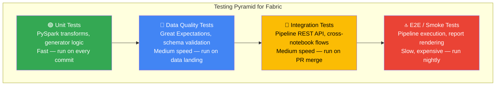
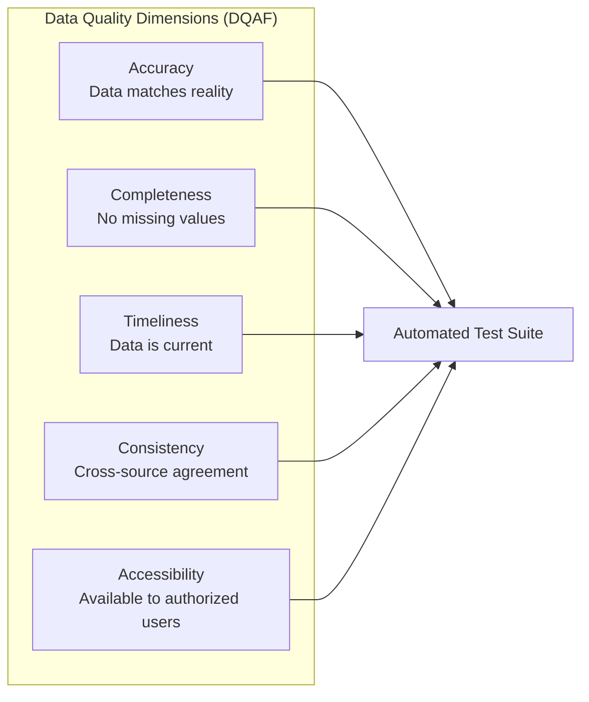

[Home](../index.md) > [Docs](../) > [Best Practices](./) > Testing Strategies

# 🧪 Testing Strategies for Microsoft Fabric

<div align="center">

**Comprehensive Quality Assurance Across the Analytics Lifecycle**


</div>

---

**Last Updated:** `2026-04-13` | **Version:** 1.0.0

---

## 📑 Table of Contents

- [🎯 Overview](#-overview)
- [🔺 Testing Pyramid](#-testing-pyramid)
- [🧩 Unit Testing](#-unit-testing)
- [🔗 Integration Testing](#-integration-testing)
- [📐 Data Quality Testing](#-data-quality-testing)
- [🔄 Regression Testing](#-regression-testing)
- [🎰 Casino Compliance Testing](#-casino-compliance-testing)
- [🏛️ Federal Data Quality (DQAF)](#️-federal-data-quality-dqaf)
- [🚀 CI/CD Integration](#-cicd-integration)
- [📊 Test Reporting & Metrics](#-test-reporting--metrics)
- [⚠️ Anti-Patterns](#️-anti-patterns)
- [📚 References](#-references)

---

## 🎯 Overview

Testing a Microsoft Fabric analytics platform requires a layered strategy that covers data transformations, pipeline orchestration, semantic models, compliance rules, and end-to-end data quality. This guide establishes testing patterns for each layer of the medallion architecture across casino and federal agency workloads.

### Why Testing Matters for Analytics

| Risk Without Testing | Impact |
|---------------------|--------|
| Incorrect aggregation logic | Revenue misreporting, wrong KPIs on executive dashboards |
| Schema drift | Broken downstream notebooks and Power BI reports |
| Compliance rule errors | Missed CTR filings (regulatory penalty: up to $1M per violation) |
| Data quality degradation | Bad decisions based on inaccurate data |
| Pipeline failures | Stale data in gold layer, outdated dashboards |
| Regression after changes | Previously working features break silently |

### Test Coverage Goals

| Layer | Test Type | Coverage Target | Tools |
|-------|-----------|----------------|-------|
| Generators | Unit tests | 100% of generators | pytest |
| Bronze → Silver | Unit + data quality | 90% of transformations | pytest, chispa, Great Expectations |
| Silver → Gold | Unit + regression | 90% of aggregations | pytest, chispa |
| Pipelines | Integration | 100% of pipelines | REST API, pytest |
| Semantic Models | Regression | 80% of DAX measures | DAX Studio, pytest |
| End-to-end | Smoke tests | Critical paths | GitHub Actions |

---

## 🔺 Testing Pyramid



### Test Execution Strategy

| Trigger | Test Suite | Duration | Blocking |
|---------|-----------|----------|----------|
| Every commit | Unit tests (134+ tests) | ~2 min | Yes (PR blocked on failure) |
| PR to main | Unit + data quality | ~5 min | Yes |
| Merge to main | Integration + smoke | ~15 min | Advisory |
| Nightly | Full E2E suite | ~45 min | Advisory (alert on failure) |
| Quarterly | DR + compliance validation | ~2 hours | Report only |

---

## 🧩 Unit Testing

### PySpark Testing with chispa

The [chispa](https://github.com/MrPowers/chispa) library provides DataFrame comparison utilities for testing PySpark transformations.

```python
# validation/unit_tests/test_silver_slot_cleansed.py
import pytest
from pyspark.sql import SparkSession
from pyspark.sql.types import (
    StructType, StructField, StringType, DoubleType,
    TimestampType, IntegerType
)
from chispa.dataframe_comparer import assert_df_equality
from datetime import datetime

@pytest.fixture(scope="session")
def spark():
    """Create a local SparkSession for testing."""
    return SparkSession.builder \
        .master("local[2]") \
        .appName("FabricUnitTests") \
        .config("spark.sql.shuffle.partitions", "2") \
        .getOrCreate()

class TestSlotTelemetryCleansing:
    """Tests for bronze → silver slot telemetry transformation."""

    def test_null_amount_filtered(self, spark):
        """Records with null amount_wagered should be removed."""
        schema = StructType([
            StructField("machine_id", StringType()),
            StructField("amount_wagered", DoubleType()),
            StructField("amount_won", DoubleType()),
            StructField("event_timestamp", TimestampType()),
        ])

        input_data = [
            ("M001", 10.0, 5.0, datetime(2026, 4, 1, 10, 0)),
            ("M002", None, 3.0, datetime(2026, 4, 1, 10, 1)),
            ("M003", 25.0, 0.0, datetime(2026, 4, 1, 10, 2)),
        ]
        input_df = spark.createDataFrame(input_data, schema)

        # Apply transformation
        result_df = input_df.filter("amount_wagered IS NOT NULL")

        expected_data = [
            ("M001", 10.0, 5.0, datetime(2026, 4, 1, 10, 0)),
            ("M003", 25.0, 0.0, datetime(2026, 4, 1, 10, 2)),
        ]
        expected_df = spark.createDataFrame(expected_data, schema)

        assert_df_equality(result_df, expected_df, ignore_row_order=True)

    def test_duplicate_removal(self, spark):
        """Duplicate records by machine_id + timestamp should be deduplicated."""
        schema = StructType([
            StructField("machine_id", StringType()),
            StructField("amount_wagered", DoubleType()),
            StructField("event_timestamp", TimestampType()),
        ])

        input_data = [
            ("M001", 10.0, datetime(2026, 4, 1, 10, 0)),
            ("M001", 10.0, datetime(2026, 4, 1, 10, 0)),  # Duplicate
            ("M002", 25.0, datetime(2026, 4, 1, 10, 1)),
        ]
        input_df = spark.createDataFrame(input_data, schema)

        result_df = input_df.dropDuplicates(["machine_id", "event_timestamp"])

        assert result_df.count() == 2

    def test_negative_amount_flagged(self, spark):
        """Negative amounts should be flagged as anomalies."""
        schema = StructType([
            StructField("machine_id", StringType()),
            StructField("amount_wagered", DoubleType()),
        ])

        input_data = [
            ("M001", 10.0),
            ("M002", -5.0),
            ("M003", 0.0),
        ]
        input_df = spark.createDataFrame(input_data, schema)

        from pyspark.sql.functions import col, when
        result_df = input_df.withColumn(
            "is_anomaly",
            when(col("amount_wagered") < 0, True).otherwise(False)
        )

        anomalies = result_df.filter("is_anomaly = true").count()
        assert anomalies == 1

    def test_schema_enforcement(self, spark):
        """Output schema should match expected silver schema."""
        expected_schema = StructType([
            StructField("machine_id", StringType(), False),
            StructField("casino_id", StringType(), False),
            StructField("amount_wagered", DoubleType(), False),
            StructField("amount_won", DoubleType(), True),
            StructField("event_timestamp", TimestampType(), False),
            StructField("event_date", StringType(), False),
        ])

        # Verify schema field names and types
        assert len(expected_schema.fields) == 6
        assert expected_schema["machine_id"].dataType == StringType()
        assert expected_schema["amount_wagered"].nullable is False
```

### Mocking Fabric Utilities

Fabric notebooks use `notebookutils` and `mssparkutils` which are not available locally. Use mocking for unit tests.

```python
# conftest.py - Mock Fabric-specific utilities
import pytest
from unittest.mock import MagicMock, patch
import sys

@pytest.fixture(autouse=True)
def mock_fabric_utils():
    """Mock Fabric-specific modules for local testing."""
    # Mock notebookutils
    mock_nbutils = MagicMock()
    mock_nbutils.notebook.exit = MagicMock()
    mock_nbutils.credentials.getSecret = MagicMock(return_value="mock-secret")

    # Mock mssparkutils
    mock_mssparkutils = MagicMock()
    mock_mssparkutils.fs.ls = MagicMock(return_value=[])
    mock_mssparkutils.fs.head = MagicMock(return_value="")

    sys.modules["notebookutils"] = mock_nbutils
    sys.modules["mssparkutils"] = mock_mssparkutils

    yield

    # Cleanup
    del sys.modules["notebookutils"]
    del sys.modules["mssparkutils"]

@pytest.fixture
def mock_lakehouse_path(tmp_path):
    """Create a temporary lakehouse-like directory structure."""
    tables_dir = tmp_path / "Tables"
    tables_dir.mkdir()

    files_dir = tmp_path / "Files"
    files_dir.mkdir()

    return tmp_path
```

### Generator Unit Tests

```python
# validation/unit_tests/test_generators.py
import pytest
from data_generation.generators.slot_telemetry_generator import SlotTelemetryGenerator
from data_generation.generators.base_generator import BaseGenerator

class TestSlotTelemetryGenerator:
    """Tests for the slot telemetry data generator."""

    @pytest.fixture
    def generator(self):
        return SlotTelemetryGenerator(seed=42)

    def test_inherits_base_generator(self, generator):
        """Generator should inherit from BaseGenerator."""
        assert isinstance(generator, BaseGenerator)

    def test_generate_record_has_required_fields(self, generator):
        """Each record should have all required fields."""
        record = generator.generate_record()
        required_fields = [
            "machine_id", "casino_id", "event_timestamp",
            "amount_wagered", "amount_won", "game_type",
            "denomination", "player_id"
        ]
        for field in required_fields:
            assert field in record, f"Missing field: {field}"

    def test_amount_wagered_is_positive(self, generator):
        """Amount wagered should always be positive."""
        for _ in range(100):
            record = generator.generate_record()
            assert record["amount_wagered"] > 0

    def test_generate_batch_returns_correct_count(self, generator):
        """Batch generation should return requested number of records."""
        batch = generator.generate_batch(50)
        assert len(batch) == 50

    def test_denomination_in_valid_range(self, generator):
        """Denomination should be one of the standard values."""
        valid_denominations = [0.01, 0.05, 0.25, 0.50, 1.00, 5.00, 25.00, 100.00]
        for _ in range(100):
            record = generator.generate_record()
            assert record["denomination"] in valid_denominations

    def test_reproducible_with_seed(self):
        """Same seed should produce identical records."""
        gen1 = SlotTelemetryGenerator(seed=42)
        gen2 = SlotTelemetryGenerator(seed=42)

        records1 = gen1.generate_batch(10)
        records2 = gen2.generate_batch(10)

        assert records1 == records2
```

---

## 🔗 Integration Testing

### Pipeline Execution via REST API

```python
# validation/integration_tests/test_pipeline_execution.py
import pytest
import requests
import time
from azure.identity import DefaultAzureCredential

class TestPipelineExecution:
    """Integration tests for Fabric pipeline execution."""

    @pytest.fixture
    def fabric_token(self):
        credential = DefaultAzureCredential()
        token = credential.get_token("https://api.fabric.microsoft.com/.default")
        return token.token

    @pytest.fixture
    def headers(self, fabric_token):
        return {
            "Authorization": f"Bearer {fabric_token}",
            "Content-Type": "application/json"
        }

    def test_bronze_ingestion_pipeline(self, headers):
        """Bronze ingestion pipeline should complete successfully."""
        workspace_id = "test-workspace-id"
        pipeline_name = "pl_bronze_slot_telemetry"

        # Trigger pipeline
        url = (
            f"https://api.fabric.microsoft.com/v1/workspaces/{workspace_id}"
            f"/items/{pipeline_name}/jobs/instances?jobType=Pipeline"
        )
        response = requests.post(url, headers=headers)
        assert response.status_code == 202

        # Poll for completion
        job_id = response.headers.get("x-ms-operation-id")
        status = self._wait_for_completion(workspace_id, job_id, headers)
        assert status == "Completed"

    def test_silver_transform_depends_on_bronze(self, headers):
        """Silver transformation should fail gracefully if bronze data is missing."""
        # This tests the pipeline dependency chain
        pass

    def _wait_for_completion(self, workspace_id, job_id, headers, timeout=600):
        """Poll pipeline status until completion or timeout."""
        start_time = time.time()
        while time.time() - start_time < timeout:
            url = (
                f"https://api.fabric.microsoft.com/v1/workspaces/{workspace_id}"
                f"/items/jobs/instances/{job_id}"
            )
            response = requests.get(url, headers=headers)
            status = response.json().get("status")
            if status in ["Completed", "Failed", "Cancelled"]:
                return status
            time.sleep(15)
        return "Timeout"
```

### Cross-Notebook Flow Testing

```python
# validation/integration_tests/test_medallion_flow.py
import pytest

class TestMedallionFlow:
    """Integration tests for the bronze → silver → gold medallion flow."""

    def test_bronze_to_silver_row_count(self, spark):
        """Silver table should have fewer or equal rows to bronze (after dedup)."""
        bronze_count = spark.read.format("delta") \
            .load("Tables/bronze_slot_telemetry").count()
        silver_count = spark.read.format("delta") \
            .load("Tables/silver_slot_cleansed").count()
        assert silver_count <= bronze_count

    def test_silver_to_gold_aggregation(self, spark):
        """Gold aggregation should produce one row per machine per day."""
        gold_df = spark.read.format("delta").load("Tables/gold_slot_performance")

        # Check uniqueness of the aggregation grain
        from pyspark.sql.functions import count
        dupes = gold_df.groupBy("machine_id", "event_date") \
            .agg(count("*").alias("cnt")) \
            .filter("cnt > 1")
        assert dupes.count() == 0, "Duplicate rows found in gold aggregation"

    def test_gold_revenue_non_negative(self, spark):
        """Gold gross gaming revenue should be non-negative."""
        gold_df = spark.read.format("delta").load("Tables/gold_slot_performance")
        negatives = gold_df.filter("gross_gaming_revenue < 0").count()
        assert negatives == 0, f"Found {negatives} negative revenue rows"
```

---

## 📐 Data Quality Testing

### Great Expectations Configuration

```python
# validation/great_expectations/suites/bronze_slot_telemetry_suite.py
import great_expectations as gx

context = gx.get_context()

# Create expectation suite for bronze slot telemetry
suite = context.add_expectation_suite(
    expectation_suite_name="bronze_slot_telemetry_suite"
)

# Schema expectations
suite.add_expectation(
    gx.expectations.ExpectTableColumnsToMatchSet(
        column_set=[
            "machine_id", "casino_id", "event_timestamp",
            "amount_wagered", "amount_won", "game_type",
            "denomination", "player_id", "event_date"
        ],
        exact_match=False  # Allow additional columns
    )
)

# Completeness expectations
suite.add_expectation(
    gx.expectations.ExpectColumnValuesToNotBeNull(column="machine_id")
)
suite.add_expectation(
    gx.expectations.ExpectColumnValuesToNotBeNull(column="event_timestamp")
)
suite.add_expectation(
    gx.expectations.ExpectColumnValuesToNotBeNull(column="amount_wagered")
)

# Range expectations
suite.add_expectation(
    gx.expectations.ExpectColumnValuesToBeBetween(
        column="amount_wagered",
        min_value=0.01,
        max_value=100_000.00
    )
)
suite.add_expectation(
    gx.expectations.ExpectColumnValuesToBeBetween(
        column="denomination",
        min_value=0.01,
        max_value=100.00
    )
)

# Uniqueness expectations (within a batch)
suite.add_expectation(
    gx.expectations.ExpectCompoundColumnsToBeUnique(
        column_list=["machine_id", "event_timestamp"]
    )
)

# Freshness expectation
suite.add_expectation(
    gx.expectations.ExpectColumnMaxToBeBetween(
        column="event_timestamp",
        min_value={"$PARAMETER": "now() - timedelta(hours=2)"},
        max_value={"$PARAMETER": "now()"}
    )
)

# Save suite
context.save_expectation_suite(suite)
```

### Great Expectations Checkpoint

```yaml
# validation/great_expectations/checkpoints/bronze_checkpoint.yml
name: bronze_checkpoint
config_version: 1.0
class_name: Checkpoint
validations:
  - batch_request:
      datasource_name: fabric_onelake
      data_connector_name: default_inferred_data_connector_name
      data_asset_name: bronze_slot_telemetry
    expectation_suite_name: bronze_slot_telemetry_suite
    action_list:
      - name: store_validation_result
        action:
          class_name: StoreValidationResultAction
      - name: update_data_docs
        action:
          class_name: UpdateDataDocsAction
      - name: send_alert_on_failure
        action:
          class_name: SlackNotificationAction
          slack_webhook: ${SLACK_WEBHOOK_URL}
          notify_on: failure
```

### Schema Drift Detection

```python
# validation/unit_tests/test_schema_drift.py
import pytest
from pyspark.sql.types import StructType, StructField, StringType, DoubleType

class TestSchemaDrift:
    """Detect unexpected schema changes in Delta tables."""

    EXPECTED_BRONZE_SCHEMA = {
        "machine_id": "string",
        "casino_id": "string",
        "event_timestamp": "timestamp",
        "amount_wagered": "double",
        "amount_won": "double",
        "game_type": "string",
        "denomination": "double",
        "player_id": "string",
        "event_date": "string",
    }

    def test_bronze_schema_matches_expected(self, spark):
        """Bronze table schema should match expected definition."""
        df = spark.read.format("delta").load("Tables/bronze_slot_telemetry")
        actual_schema = {
            field.name: field.dataType.simpleString()
            for field in df.schema.fields
        }

        for col_name, col_type in self.EXPECTED_BRONZE_SCHEMA.items():
            assert col_name in actual_schema, \
                f"Missing column: {col_name}"
            assert actual_schema[col_name] == col_type, \
                f"Type mismatch for {col_name}: " \
                f"expected {col_type}, got {actual_schema[col_name]}"

    def test_no_unexpected_columns_added(self, spark):
        """Alert if new columns appear that are not in the expected schema."""
        df = spark.read.format("delta").load("Tables/bronze_slot_telemetry")
        actual_columns = set(df.columns)
        expected_columns = set(self.EXPECTED_BRONZE_SCHEMA.keys())

        unexpected = actual_columns - expected_columns
        if unexpected:
            pytest.warn(
                UserWarning(f"New columns detected: {unexpected}. "
                           f"Update expected schema if intentional.")
            )
```

---

## 🔄 Regression Testing

### DAX Measure Regression Tests

Regression testing for Power BI semantic models validates that DAX measures return expected results against known baseline data.

```python
# validation/regression_tests/test_dax_measures.py
import pytest
import requests

class TestDAXMeasureRegression:
    """Regression tests for Power BI DAX measures."""

    @pytest.fixture
    def dax_client(self):
        """Client for executing DAX queries via XMLA endpoint."""
        return DAXQueryClient(
            workspace="analytics_workspace",
            dataset="casino_analytics"
        )

    def test_total_revenue_measure(self, dax_client):
        """Total Revenue measure should match expected calculation."""
        result = dax_client.execute("""
            EVALUATE
            SUMMARIZECOLUMNS(
                'Date'[Year], 'Date'[Month],
                "TotalRevenue", [Total Revenue]
            )
            ORDER BY 'Date'[Year], 'Date'[Month]
        """)

        # Compare against baseline
        baseline = load_baseline("total_revenue_baseline.json")
        for row in result:
            key = f"{row['Year']}-{row['Month']}"
            assert abs(row['TotalRevenue'] - baseline[key]) < 0.01, \
                f"Revenue mismatch for {key}: " \
                f"expected {baseline[key]}, got {row['TotalRevenue']}"

    def test_gross_gaming_revenue_calculation(self, dax_client):
        """GGR = Total Wagered - Total Won."""
        result = dax_client.execute("""
            EVALUATE
            ROW(
                "TotalWagered", [Total Wagered],
                "TotalWon", [Total Won],
                "GGR", [Gross Gaming Revenue],
                "Calculated", [Total Wagered] - [Total Won]
            )
        """)

        row = result[0]
        assert abs(row["GGR"] - row["Calculated"]) < 0.01, \
            "GGR measure does not equal Wagered - Won"

    def test_hold_percentage(self, dax_client):
        """Hold % should be between 0% and 100%."""
        result = dax_client.execute("""
            EVALUATE
            ADDCOLUMNS(
                VALUES('Machine'[MachineID]),
                "HoldPct", [Hold Percentage]
            )
        """)

        for row in result:
            assert 0 <= row["HoldPct"] <= 1, \
                f"Hold % out of range for {row['MachineID']}: {row['HoldPct']}"
```

### Transformation Regression with Snapshots

```python
# validation/regression_tests/test_transformation_snapshot.py
import pytest
import json
from pathlib import Path

class TestTransformationSnapshot:
    """Snapshot-based regression testing for transformations."""

    SNAPSHOT_DIR = Path("validation/regression_tests/snapshots")

    def test_gold_aggregation_snapshot(self, spark):
        """Gold aggregation output should match stored snapshot."""
        # Generate current output
        current_df = spark.read.format("delta") \
            .load("Tables/gold_slot_performance") \
            .filter("event_date = '2026-04-01'") \
            .orderBy("machine_id") \
            .limit(10)

        current_data = [row.asDict() for row in current_df.collect()]

        snapshot_path = self.SNAPSHOT_DIR / "gold_slot_performance_20260401.json"

        if not snapshot_path.exists():
            # Create initial snapshot
            with open(snapshot_path, "w") as f:
                json.dump(current_data, f, indent=2, default=str)
            pytest.skip("Snapshot created — re-run to validate")

        # Compare against snapshot
        with open(snapshot_path, "r") as f:
            expected_data = json.load(f)

        assert len(current_data) == len(expected_data), \
            f"Row count changed: {len(current_data)} vs {len(expected_data)}"

        for curr, exp in zip(current_data, expected_data):
            for key in exp:
                assert str(curr.get(key)) == str(exp[key]), \
                    f"Value mismatch for {key}: {curr.get(key)} vs {exp[key]}"
```

---

## 🎰 Casino Compliance Testing

### CTR Threshold Validation

```python
# validation/unit_tests/test_compliance_ctr.py
import pytest
from decimal import Decimal

CTR_THRESHOLD = Decimal("10000.00")

class TestCTRCompliance:
    """Validate Currency Transaction Report threshold detection."""

    def test_single_transaction_above_threshold(self, spark):
        """Single transaction >= $10,000 should trigger CTR."""
        from pyspark.sql.functions import col
        df = spark.read.format("delta").load("Tables/silver_slot_cleansed")

        ctr_candidates = df.filter(
            col("amount_wagered") >= float(CTR_THRESHOLD)
        )

        # Verify all CTR candidates are flagged
        flagged = ctr_candidates.filter(col("ctr_flag") == True)
        unflagged = ctr_candidates.filter(
            (col("ctr_flag") == False) | col("ctr_flag").isNull()
        )

        assert unflagged.count() == 0, \
            f"{unflagged.count()} transactions >= $10K not flagged for CTR"

    def test_structuring_detection(self, spark):
        """Multiple transactions $8K-$9.9K from same player should trigger SAR."""
        from pyspark.sql.functions import col, count, sum as spark_sum

        df = spark.read.format("delta").load("Tables/silver_slot_cleansed")

        # Find players with multiple near-threshold transactions
        suspicious = df.filter(
            (col("amount_wagered") >= 8000) &
            (col("amount_wagered") < 10000)
        ).groupBy("player_id", "event_date").agg(
            count("*").alias("txn_count"),
            spark_sum("amount_wagered").alias("total_amount")
        ).filter(
            (col("txn_count") >= 3) &
            (col("total_amount") >= float(CTR_THRESHOLD))
        )

        if suspicious.count() > 0:
            # Verify SAR flags exist
            sar_df = spark.read.format("delta") \
                .load("Tables/gold_compliance_sar")
            sar_players = set(
                row["player_id"]
                for row in sar_df.select("player_id").collect()
            )
            suspicious_players = set(
                row["player_id"]
                for row in suspicious.select("player_id").collect()
            )

            missing = suspicious_players - sar_players
            assert len(missing) == 0, \
                f"Structuring detected but not SAR-flagged: {missing}"

    def test_w2g_threshold_slots(self, spark):
        """Slot jackpots >= $1,200 should trigger W-2G."""
        from pyspark.sql.functions import col

        W2G_THRESHOLD_SLOTS = 1200.00

        df = spark.read.format("delta").load("Tables/silver_slot_cleansed")
        jackpots = df.filter(
            (col("amount_won") >= W2G_THRESHOLD_SLOTS) &
            (col("game_type") == "slots")
        )

        w2g_flagged = jackpots.filter(col("w2g_flag") == True)
        assert w2g_flagged.count() == jackpots.count(), \
            f"Not all slot jackpots >= ${W2G_THRESHOLD_SLOTS} are W-2G flagged"

    def test_pii_masking_in_gold(self, spark):
        """Gold layer should not contain unmasked SSN or card numbers."""
        from pyspark.sql.functions import col
        import re

        gold_df = spark.read.format("delta").load("Tables/gold_player_analytics")

        # Check for unmasked SSN pattern (XXX-XX-XXXX)
        ssn_pattern = r"\d{3}-\d{2}-\d{4}"
        for col_name in gold_df.columns:
            if gold_df.schema[col_name].dataType.simpleString() == "string":
                sample = gold_df.select(col_name).limit(100).collect()
                for row in sample:
                    if row[0] is not None:
                        assert not re.match(ssn_pattern, str(row[0])), \
                            f"Unmasked SSN found in {col_name}"
```

---

## 🏛️ Federal Data Quality (DQAF)

### Data Quality Assessment Framework

The Federal Data Quality Assessment Framework (DQAF) establishes standards for accuracy, completeness, timeliness, consistency, and accessibility.



### Federal Data Quality Tests

```python
# validation/unit_tests/federal/test_usda_data_quality.py
import pytest
from datetime import datetime, timedelta

class TestUSDADataQuality:
    """DQAF-aligned data quality tests for USDA crop production data."""

    # Accuracy
    def test_crop_yield_in_valid_range(self, spark):
        """Crop yield values should be within historical bounds."""
        df = spark.read.format("delta").load("Tables/silver_usda_crop_production")
        from pyspark.sql.functions import col

        out_of_range = df.filter(
            (col("yield_per_acre") < 0) |
            (col("yield_per_acre") > 500)  # Max historical corn yield ~250 bu/acre
        ).count()

        assert out_of_range == 0, \
            f"{out_of_range} records with yield outside valid range"

    # Completeness
    def test_required_fields_populated(self, spark):
        """All required fields should be non-null."""
        df = spark.read.format("delta").load("Tables/silver_usda_crop_production")

        required_fields = [
            "state_code", "commodity_name", "year",
            "production_quantity", "unit_of_measure"
        ]

        for field in required_fields:
            null_count = df.filter(f"{field} IS NULL").count()
            total = df.count()
            completeness = 1 - (null_count / total) if total > 0 else 0
            assert completeness >= 0.99, \
                f"{field} completeness is {completeness:.2%}, expected >= 99%"

    # Timeliness
    def test_data_freshness(self, spark):
        """Data should be updated within the last 24 hours."""
        df = spark.read.format("delta").load("Tables/bronze_usda_crop_production")
        from pyspark.sql.functions import max as spark_max

        latest = df.agg(spark_max("ingestion_timestamp")).collect()[0][0]
        age_hours = (datetime.now() - latest).total_seconds() / 3600

        assert age_hours < 24, \
            f"Data is {age_hours:.1f} hours old, expected < 24 hours"

    # Consistency
    def test_state_codes_valid(self, spark):
        """State codes should be valid US FIPS codes."""
        valid_fips = set(range(1, 57))  # US state FIPS codes
        df = spark.read.format("delta").load("Tables/silver_usda_crop_production")

        state_codes = set(
            row["state_code"]
            for row in df.select("state_code").distinct().collect()
        )

        invalid = state_codes - valid_fips
        assert len(invalid) == 0, \
            f"Invalid FIPS codes found: {invalid}"

    # Cross-source consistency
    def test_production_equals_yield_times_area(self, spark):
        """Production should approximately equal yield × harvested area."""
        from pyspark.sql.functions import col, abs as spark_abs

        df = spark.read.format("delta").load("Tables/gold_usda_crop_summary")
        df_check = df.withColumn(
            "calculated_production",
            col("yield_per_acre") * col("harvested_acres")
        ).withColumn(
            "pct_diff",
            spark_abs(col("production_quantity") - col("calculated_production"))
            / col("production_quantity") * 100
        )

        # Allow 5% tolerance for rounding
        violations = df_check.filter(col("pct_diff") > 5).count()
        assert violations == 0, \
            f"{violations} records where production ≠ yield × area (>5% diff)"
```

### SBA PII Protection Tests

```python
# validation/unit_tests/federal/test_sba_pii.py
class TestSBAPIIProtection:
    """Validate PII protection in SBA loan data."""

    def test_ein_masked_in_silver(self, spark):
        """EIN should be masked in silver layer."""
        df = spark.read.format("delta").load("Tables/silver_sba_loans")
        import re

        for row in df.select("ein").limit(100).collect():
            if row["ein"] is not None:
                assert not re.match(r"^\d{2}-\d{7}$", row["ein"]), \
                    f"Unmasked EIN found: {row['ein']}"

    def test_borrower_name_hashed_in_gold(self, spark):
        """Borrower name should be hashed or removed in gold layer."""
        df = spark.read.format("delta").load("Tables/gold_sba_loan_analytics")
        assert "borrower_name" not in df.columns or \
            all(
                len(str(row["borrower_name"])) == 64  # SHA-256 hash length
                for row in df.select("borrower_name").limit(100).collect()
                if row["borrower_name"] is not None
            )
```

---

## 🚀 CI/CD Integration

### GitHub Actions Workflow

```yaml
# .github/workflows/test-fabric.yml
name: Fabric Test Suite

on:
  push:
    branches: [main, develop]
    paths:
      - "notebooks/**"
      - "data_generation/**"
      - "validation/**"
  pull_request:
    branches: [main]

jobs:
  unit-tests:
    name: Unit Tests
    runs-on: ubuntu-latest
    steps:
      - uses: actions/checkout@v4

      - name: Set up Python
        uses: actions/setup-python@v5
        with:
          python-version: "3.11"

      - name: Install dependencies
        run: |
          pip install pytest chispa pyspark==3.5.0 great-expectations
          pip install -r requirements-test.txt

      - name: Run unit tests
        run: |
          pytest validation/unit_tests/ -v \
            --junitxml=test-results/unit-tests.xml \
            --cov=data_generation \
            --cov-report=xml:coverage/coverage.xml

      - name: Upload test results
        if: always()
        uses: actions/upload-artifact@v4
        with:
          name: unit-test-results
          path: test-results/

      - name: Upload coverage
        uses: codecov/codecov-action@v4
        with:
          file: coverage/coverage.xml

  data-quality:
    name: Data Quality Tests
    runs-on: ubuntu-latest
    needs: unit-tests
    steps:
      - uses: actions/checkout@v4

      - name: Set up Python
        uses: actions/setup-python@v5
        with:
          python-version: "3.11"

      - name: Run Great Expectations
        run: |
          great_expectations checkpoint run bronze_checkpoint
          great_expectations checkpoint run silver_checkpoint

  integration-tests:
    name: Integration Tests
    runs-on: ubuntu-latest
    needs: data-quality
    if: github.ref == 'refs/heads/main'
    environment: staging
    steps:
      - uses: actions/checkout@v4

      - name: Azure Login
        uses: azure/login@v2
        with:
          creds: ${{ secrets.AZURE_CREDENTIALS }}

      - name: Run integration tests
        run: |
          pytest validation/integration_tests/ -v \
            --junitxml=test-results/integration-tests.xml
        env:
          FABRIC_WORKSPACE_ID: ${{ vars.STAGING_WORKSPACE_ID }}
```

### Test Gate Configuration

```yaml
# Branch protection rules (configured in GitHub Settings)
# Required status checks:
#   - unit-tests (required)
#   - data-quality (required)
#   - integration-tests (required for main only)
#
# Minimum coverage thresholds:
#   - Overall: 80%
#   - Generators: 100%
#   - Transformations: 90%
```

---

## 📊 Test Reporting & Metrics

### Test Coverage Dashboard

| Component | Current Coverage | Target | Status |
|-----------|-----------------|--------|--------|
| Casino generators | 100% (30/30 tests) | 100% | ✅ |
| Federal generators | 100% (54/54 tests) | 100% | ✅ |
| Streaming generators | 100% (20/20 tests) | 100% | ✅ |
| Analytics generators | 100% (30/30 tests) | 100% | ✅ |
| Bronze transformations | 85% | 90% | ⚠️ |
| Silver transformations | 82% | 90% | ⚠️ |
| Gold aggregations | 78% | 90% | ⚠️ |
| Compliance rules | 95% | 100% | ⚠️ |
| **Total** | **92% (134+ tests)** | **95%** | ⚠️ |

### Test Execution Metrics

```kql
// Test execution trend (from GitHub Actions logs)
TestResults
| where TimeGenerated > ago(30d)
| summarize
    TotalTests = sum(TestCount),
    PassCount = sumif(TestCount, Result == "Pass"),
    FailCount = sumif(TestCount, Result == "Fail"),
    SkipCount = sumif(TestCount, Result == "Skip"),
    AvgDuration = avg(DurationSeconds)
    by bin(TimeGenerated, 1d)
| extend PassRate = round(PassCount * 100.0 / TotalTests, 1)
| render timechart
```

---

## ⚠️ Anti-Patterns

### Anti-Pattern 1: Testing in Production Only

**Problem:** No local or staging tests; all validation happens against production data.

**Impact:** Bugs reach production before detection; rollback is expensive.

**Solution:** Implement the testing pyramid. Run unit tests locally, data quality in staging, integration before deployment.

### Anti-Pattern 2: Hardcoded Test Data in Production

**Problem:** Test records mixed with real data in production Lakehouses.

**Impact:** Skewed KPIs, compliance issues, data quality degradation.

**Solution:** Use separate workspaces for test data. Flag test records with `is_test = true` and filter in gold aggregations.

### Anti-Pattern 3: No Schema Validation

**Problem:** Schema changes in source systems propagate silently through the medallion layers.

**Impact:** Broken notebooks, incorrect joins, null columns in reports.

**Solution:** Enforce expected schemas at bronze ingestion. Fail fast with clear error messages.

### Anti-Pattern 4: Manual Regression Testing

**Problem:** Developers manually check DAX measures and report values after changes.

**Impact:** Slow, error-prone, incomplete coverage.

**Solution:** Automated DAX regression tests with stored baselines. Run on every merge to main.

### Anti-Pattern 5: Ignoring Data Quality Failures

**Problem:** Great Expectations checkpoints fail but pipelines continue processing.

**Impact:** Bad data flows to gold layer and into executive reports.

**Solution:** Configure GE checkpoints as pipeline gates. Block downstream processing on failure.

---

## 📚 References

### Microsoft Documentation

- [Fabric testing best practices](https://learn.microsoft.com/fabric/cicd/best-practices-cicd)
- [Delta Lake testing patterns](https://learn.microsoft.com/fabric/data-engineering/lakehouse-delta-lake)
- [Power BI DAX patterns](https://learn.microsoft.com/power-bi/guidance/dax-sample-model)
- [Fabric REST API reference](https://learn.microsoft.com/rest/api/fabric/core)

### Testing Libraries

- [chispa — PySpark DataFrame testing](https://github.com/MrPowers/chispa)
- [Great Expectations documentation](https://docs.greatexpectations.io/)
- [pytest documentation](https://docs.pytest.org/)
- [DAX Studio](https://daxstudio.org/)

### Compliance

- [FinCEN CTR requirements](https://www.fincen.gov/resources/filing-information)
- [IRS W-2G requirements](https://www.irs.gov/forms-pubs/about-form-w-2g)
- [Federal DQAF](https://www.whitehouse.gov/omb/information-regulatory-affairs/information-quality/)
- [NIGC MICS](https://www.nigc.gov/compliance/minimum-internal-control-standards)

---

## Related Documents

- [Error Handling & Monitoring](./error-handling-monitoring.md) -- Pipeline error detection and alerting
- [Fabric CI/CD Deployment](./fabric-cicd-deployment.md) -- Deployment pipeline with test gates
- [Data Governance Deep Dive](./data-governance-deep-dive.md) -- Data quality governance framework
- [Performance & Parallelism](./performance-parallelism.md) -- Performance testing patterns
- [Capacity Planning & Cost Optimization](./capacity-planning-cost-optimization.md) -- Test environment sizing

---

[Back to Best Practices Index](./README.md) | [Back to Documentation](../index.md)
