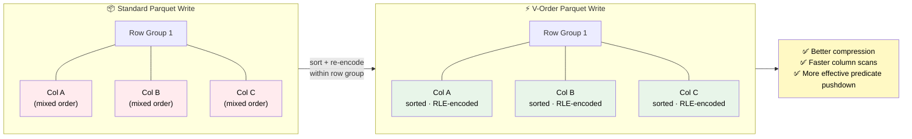
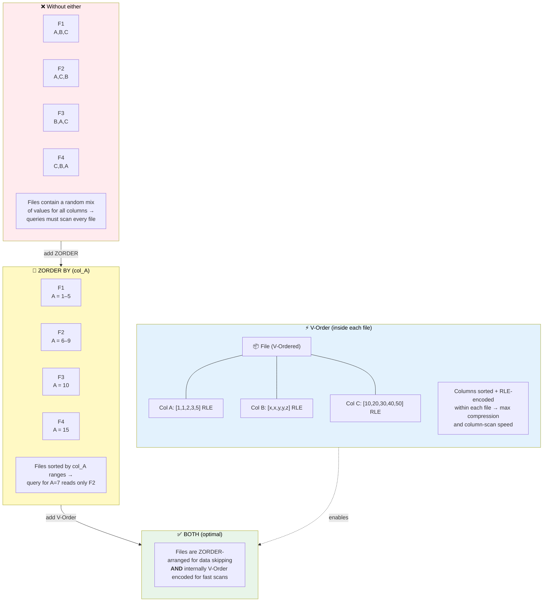

# 🔀 V-Order Tuning Deep Dive

<div align="center" markdown>

**Maximize Read Performance for Direct Lake, SQL Endpoint, and Analytical Queries**


</div>

---

**Last Updated:** `2026-04-27` | **Version:** 1.0.0

---

## 🎯 Overview

V-Order is a Fabric-specific write-time optimization that applies a special column-oriented sorting and encoding to Parquet files within Delta tables. It is **on by default** in Microsoft Fabric and is designed to accelerate read performance for Direct Lake mode in Power BI, SQL endpoint queries, and Spark analytical workloads. Understanding when V-Order helps, when it adds unnecessary overhead, and how to tune it alongside ZORDER and file compaction is critical for production performance.

### V-Order at a Glance

| Aspect | Detail |
|--------|--------|
| **What** | Column-oriented sort + encoding optimization for Parquet files |
| **Where** | Applied to Delta tables in Fabric Lakehouses |
| **When** | At write time (Spark write, OPTIMIZE, MERGE, INSERT) |
| **Default** | ON in Fabric (both `spark.write` and `OPTIMIZE`) |
| **Cost** | ~10-15% write latency increase |
| **Benefit** | 2-5x read performance improvement for analytical queries |
| **Compatible with** | Direct Lake, SQL endpoint, Spark, KQL shortcuts |

---

## 📊 What V-Order Is

### Technical Mechanics

V-Order reorders data within each Parquet row group to maximize compression efficiency and enable faster column scanning. It does **not** change the logical data or schema — it is a physical storage optimization.



### How V-Order Improves Reads

1. **Better compression ratio**: Sorted columns compress 20-40% better with RLE/dictionary encoding
2. **Data skipping**: Column min/max statistics are tighter, enabling more effective file pruning
3. **Reduced I/O**: Fewer bytes read from OneLake for the same query
4. **Cache efficiency**: Smaller column chunks fit better in memory caches
5. **Direct Lake acceleration**: Power BI VertiPaq engine reads V-Ordered data more efficiently

### Spark Configuration

```python
# V-Order is ON by default in Fabric
# To verify or explicitly set:
spark.conf.get("spark.sql.parquet.vorder.enabled")  # "true"

# Explicitly enable (usually not needed)
spark.conf.set("spark.sql.parquet.vorder.enabled", "true")

# Disable for specific write-heavy workloads
spark.conf.set("spark.sql.parquet.vorder.enabled", "false")
```

---

## ⚡ When V-Order Helps

### Decision Matrix

| Workload Pattern | V-Order Benefit | Recommendation |
|-----------------|:--------------:|----------------|
| Direct Lake Power BI reports | **High** | Always ON |
| SQL endpoint analytical queries | **High** | Always ON |
| Spark aggregation/group-by | **Medium-High** | ON (default) |
| Point lookups by key | **Low-Medium** | ON + ZORDER on key |
| Full table scans | **Low** | ON (marginal benefit) |
| Streaming micro-batch writes | **Negative** | OFF during write, OPTIMIZE later |
| ETL write-heavy pipelines | **Low** | OFF during pipeline, OPTIMIZE post |
| Small tables (< 256 MB) | **None** | No impact either way |

### Ideal Scenarios

**1. Gold Layer KPI Tables (Direct Lake)**

```python
# Gold tables powering Power BI dashboards — V-Order is critical
df_gold = spark.sql("""
    SELECT
        gaming_date,
        floor_zone,
        machine_type,
        SUM(coin_in) as total_coin_in,
        SUM(coin_out) as total_coin_out,
        COUNT(DISTINCT machine_id) as active_machines,
        AVG(theoretical_hold_pct) as avg_hold_pct
    FROM silver.slot_telemetry_cleansed
    GROUP BY gaming_date, floor_zone, machine_type
""")

# V-Order applied automatically on write
df_gold.write.format("delta") \
    .mode("overwrite") \
    .saveAsTable("gold.slot_performance_daily")
# Direct Lake reads this table 3-5x faster than non-V-Ordered
```

**2. SQL Endpoint Queries**

```sql
-- SQL endpoint benefits from V-Order data skipping
SELECT floor_zone, SUM(total_coin_in) as revenue
FROM gold.slot_performance_daily
WHERE gaming_date BETWEEN '2026-04-01' AND '2026-04-27'
GROUP BY floor_zone
ORDER BY revenue DESC;
-- V-Order enables tighter min/max stats → fewer files scanned
```

**3. Star Schema Dimension Tables**

```python
# Dimension tables with low cardinality columns benefit most
df_dim_machine = spark.sql("""
    SELECT machine_id, manufacturer, model, denomination,
           floor_zone, section, install_date, status
    FROM silver.machine_master
""")
df_dim_machine.write.format("delta") \
    .mode("overwrite") \
    .saveAsTable("gold.dim_machine")
# V-Order groups similar values → excellent compression
```

---

## ⚠️ When V-Order Hurts

### Write-Heavy Workloads

V-Order adds ~10-15% write latency because it sorts data within each row group before writing. For write-heavy pipelines where data is immediately overwritten or rarely queried, this overhead is waste.

```python
# Streaming micro-batch: Disable V-Order during write
spark.conf.set("spark.sql.parquet.vorder.enabled", "false")

# Write streaming micro-batches without V-Order overhead
df_stream.writeStream \
    .format("delta") \
    .outputMode("append") \
    .option("checkpointLocation", "Files/checkpoints/slot_stream/") \
    .toTable("bronze.slot_telemetry_stream")

# Re-enable V-Order for OPTIMIZE (applied periodically)
spark.conf.set("spark.sql.parquet.vorder.enabled", "true")
```

### High-Frequency Append Pipelines

```python
# Ingest pipeline running every 5 minutes
# Disable V-Order during rapid ingestion
spark.conf.set("spark.sql.parquet.vorder.enabled", "false")

for batch in micro_batches:
    batch.write.format("delta").mode("append").saveAsTable("bronze.cage_transactions")

# Schedule OPTIMIZE with V-Order during off-peak hours
# This applies V-Order retroactively to all files
spark.sql("OPTIMIZE bronze.cage_transactions")
# V-Order is applied during OPTIMIZE by default
```

### Temporary / Staging Tables

```python
# Intermediate staging tables that exist for minutes
spark.conf.set("spark.sql.parquet.vorder.enabled", "false")

df_stage = df_raw.filter(col("is_valid") == True)
df_stage.write.format("delta").mode("overwrite").saveAsTable("staging.temp_validated")

# Process and drop — no need for V-Order optimization
df_final = spark.table("staging.temp_validated").join(...)
spark.sql("DROP TABLE staging.temp_validated")
```

---

## 🔧 OPTIMIZE with V-Order

### Basic OPTIMIZE

```sql
-- OPTIMIZE rewrites small files into larger, V-Ordered files
OPTIMIZE gold.slot_performance_daily;

-- Output shows files compacted and V-Order applied
-- +---+-----+---+---+----+
-- |   |files|   |   |    |
-- +---+-----+---+---+----+
-- |num_files_added|num_files_removed|...
```

### OPTIMIZE with ZORDER

```sql
-- ZORDER co-locates data by specified columns
-- V-Order is applied ON TOP of ZORDER automatically
OPTIMIZE silver.player_transactions
ZORDER BY (player_id, transaction_date);

-- Result: Files are ZORDER-sorted by player_id + transaction_date
-- AND each file has V-Order encoding for fast column scans
```

### OPTIMIZE with WHERE Clause

```python
# Optimize only recent partitions (avoid full-table rewrite)
spark.sql("""
    OPTIMIZE bronze.slot_telemetry
    WHERE gaming_date >= '2026-04-01'
""")

# Targeted optimization for specific high-query partitions
spark.sql("""
    OPTIMIZE gold.compliance_ctr_daily
    WHERE filing_date >= current_date() - INTERVAL 90 DAYS
""")
```

### Scheduled Optimization

```python
# Run OPTIMIZE as a scheduled notebook job (off-peak hours)
tables_to_optimize = [
    ("gold.slot_performance_daily", "gaming_date >= current_date() - INTERVAL 7 DAYS"),
    ("gold.player_loyalty_summary", None),  # Full optimize (small table)
    ("silver.player_transactions", "transaction_date >= current_date() - INTERVAL 30 DAYS"),
    ("bronze.slot_telemetry", "gaming_date >= current_date() - INTERVAL 3 DAYS"),
]

for table, where_clause in tables_to_optimize:
    sql = f"OPTIMIZE {table}"
    if where_clause:
        sql += f" WHERE {where_clause}"
    print(f"Optimizing: {sql}")
    result = spark.sql(sql)
    metrics = result.collect()[0]
    print(f"  Files added: {metrics.numFilesAdded}, removed: {metrics.numFilesRemoved}")
```

---

## 📐 ZORDER vs V-Order

### Complementary, Not Competing

| Feature | V-Order | ZORDER |
|---------|---------|--------|
| **Level** | Within each file (row group) | Across files (data layout) |
| **Purpose** | Optimize column encoding | Co-locate related data |
| **Applied by** | Every Spark write (default) | Explicit `OPTIMIZE ... ZORDER BY` |
| **Benefit** | Faster column scans, better compression | Faster filtered queries, data skipping |
| **Overhead** | ~10-15% write time | Full table rewrite |
| **Columns** | All columns simultaneously | 1-4 specified columns |
| **Works with** | Direct Lake, SQL endpoint | Spark, SQL endpoint |

### How They Work Together



### When to Use Each

| Scenario | V-Order | ZORDER | Both |
|----------|:-------:|:------:|:----:|
| Direct Lake report | **ON** | Optional | Ideal |
| Filtered queries by known column | ON | **Required** | Ideal |
| Full table scans | ON | Not helpful | V-Order only |
| Multi-column filter patterns | ON | ZORDER(cols) | Ideal |
| Streaming tables (write-heavy) | OFF at write | After OPTIMIZE | Yes |

---

## 📏 File Size Tuning

### Target File Sizes

| Table Size | Target File Size | Files per Partition | Rationale |
|:----------:|:----------------:|:-------------------:|-----------|
| < 256 MB | Single file | 1 | Below optimization threshold |
| 256 MB - 10 GB | 128 MB | 2-80 | Balanced parallelism |
| 10 GB - 100 GB | 256 MB - 512 MB | 20-400 | Larger files, less overhead |
| 100 GB - 1 TB | 512 MB - 1 GB | 100-2000 | Minimize file listing cost |
| > 1 TB | 1 GB | 1000+ | Maximum file size for throughput |

### Configuring Target File Size

```python
# Default target file size in Fabric: 128 MB
# Adjust for larger tables:
spark.conf.set("spark.microsoft.delta.optimizeWrite.fileSize", "268435456")  # 256 MB
spark.conf.set("spark.microsoft.delta.optimizeWrite.enabled", "true")

# For OPTIMIZE command:
spark.sql("""
    OPTIMIZE gold.slot_performance_daily
""")
# Target file size is controlled by:
# spark.databricks.delta.optimize.maxFileSize (default: 1GB for OPTIMIZE)
```

### Diagnosing File Size Issues

```python
from delta.tables import DeltaTable

def analyze_file_sizes(table_name: str):
    """Analyze Delta table file sizes and fragmentation."""
    dt = DeltaTable.forName(spark, table_name)

    # Get file-level details
    files_df = spark.sql(f"""
        DESCRIBE DETAIL {table_name}
    """).collect()[0]

    print(f"Table: {table_name}")
    print(f"  Total size: {files_df.sizeInBytes / (1024**3):.2f} GB")
    print(f"  Number of files: {files_df.numFiles}")
    if files_df.numFiles > 0:
        avg_file_size = files_df.sizeInBytes / files_df.numFiles
        print(f"  Avg file size: {avg_file_size / (1024**2):.1f} MB")

        if avg_file_size < 32 * 1024 * 1024:  # < 32 MB
            print("  ⚠️ SMALL FILE PROBLEM — run OPTIMIZE")
        elif avg_file_size > 2 * 1024 * 1024 * 1024:  # > 2 GB
            print("  ⚠️ FILES TOO LARGE — consider repartitioning")
        else:
            print("  ✅ File sizes are healthy")

# Check all gold tables
gold_tables = spark.sql("SHOW TABLES IN gold").collect()
for t in gold_tables:
    analyze_file_sizes(f"gold.{t.tableName}")
```

---

## 🔄 Compaction Strategies

### Strategy 1: Scheduled OPTIMIZE (Recommended)

```python
# Run nightly or weekly depending on ingestion frequency
# Schedule: Every day at 2:00 AM (off-peak)

optimize_config = {
    "hot_tables": {  # Queried frequently, updated daily
        "tables": ["gold.slot_performance_daily", "gold.player_loyalty_summary"],
        "frequency": "daily",
        "where": "gaming_date >= current_date() - INTERVAL 7 DAYS",
        "zorder_cols": {"gold.slot_performance_daily": ["floor_zone", "machine_type"]},
    },
    "warm_tables": {  # Queried weekly, updated daily
        "tables": ["silver.player_transactions", "silver.slot_telemetry_cleansed"],
        "frequency": "weekly",
        "where": "transaction_date >= current_date() - INTERVAL 30 DAYS",
        "zorder_cols": {"silver.player_transactions": ["player_id"]},
    },
    "cold_tables": {  # Queried rarely, append-only
        "tables": ["bronze.slot_telemetry", "bronze.cage_transactions"],
        "frequency": "monthly",
        "where": None,
        "zorder_cols": {},
    },
}
```

### Strategy 2: Post-Load Compaction

```python
# After a large batch load, compact immediately
def post_load_optimize(table_name: str, loaded_partition: str = None):
    """Run OPTIMIZE after a batch load completes."""
    detail_before = spark.sql(f"DESCRIBE DETAIL {table_name}").collect()[0]

    sql = f"OPTIMIZE {table_name}"
    if loaded_partition:
        sql += f" WHERE {loaded_partition}"

    result = spark.sql(sql)
    metrics = result.collect()[0]

    detail_after = spark.sql(f"DESCRIBE DETAIL {table_name}").collect()[0]

    print(f"Compaction results for {table_name}:")
    print(f"  Files: {detail_before.numFiles} → {detail_after.numFiles}")
    print(f"  Size: {detail_before.sizeInBytes/(1024**2):.0f} MB → {detail_after.sizeInBytes/(1024**2):.0f} MB")
    print(f"  Files added: {metrics.numFilesAdded}, removed: {metrics.numFilesRemoved}")

# Usage after loading today's slot telemetry
post_load_optimize("bronze.slot_telemetry", "gaming_date = '2026-04-27'")
```

### Strategy 3: VACUUM After OPTIMIZE

```python
# OPTIMIZE creates new files; old files remain for time travel
# VACUUM removes old files past retention period

# Default retention: 7 days (168 hours)
spark.sql("VACUUM gold.slot_performance_daily RETAIN 168 HOURS")

# For tables where time travel is less critical:
# WARNING: Reduces time travel capability
spark.sql("VACUUM bronze.slot_telemetry RETAIN 72 HOURS")

# Check space reclaimed
detail = spark.sql("DESCRIBE DETAIL gold.slot_performance_daily").collect()[0]
print(f"Current size after VACUUM: {detail.sizeInBytes / (1024**3):.2f} GB")
```

---

## 📈 Measuring Effectiveness

### Before/After Query Performance

```python
import time

def measure_query_performance(query: str, iterations: int = 5) -> dict:
    """Measure query performance with timing statistics."""
    times = []
    for i in range(iterations):
        # Clear cache for fair comparison
        spark.catalog.clearCache()

        start = time.time()
        df = spark.sql(query)
        df.collect()  # Force materialization
        elapsed = time.time() - start
        times.append(elapsed)

    return {
        "avg_seconds": sum(times) / len(times),
        "min_seconds": min(times),
        "max_seconds": max(times),
        "iterations": iterations
    }

# Test query
test_query = """
    SELECT floor_zone, SUM(coin_in) as revenue
    FROM gold.slot_performance_daily
    WHERE gaming_date BETWEEN '2026-04-01' AND '2026-04-27'
    GROUP BY floor_zone
"""

# Measure BEFORE optimize
before = measure_query_performance(test_query)
print(f"Before OPTIMIZE: avg={before['avg_seconds']:.2f}s")

# Run OPTIMIZE
spark.sql("OPTIMIZE gold.slot_performance_daily WHERE gaming_date >= '2026-04-01'")

# Measure AFTER optimize
after = measure_query_performance(test_query)
print(f"After OPTIMIZE: avg={after['avg_seconds']:.2f}s")
print(f"Improvement: {((before['avg_seconds'] - after['avg_seconds']) / before['avg_seconds'] * 100):.0f}%")
```

### Query Plan Analysis

```python
# Check if data skipping is effective
spark.sql("""
    EXPLAIN FORMATTED
    SELECT * FROM gold.slot_performance_daily
    WHERE gaming_date = '2026-04-27' AND floor_zone = 'HIGH_LIMIT'
""").show(truncate=False)

# Look for in the output:
# - "number of files read" (lower = better skipping)
# - "number of files pruned" (higher = better skipping)
# - "predicate pushdown" (should show your WHERE clause)
```

---

## 🎰 Casino Industry Tuning

| Table | V-Order | ZORDER Columns | OPTIMIZE Frequency | Target File Size |
|-------|:-------:|---------------|:-----------------:|:----------------:|
| `gold.slot_performance_daily` | ON | `floor_zone, gaming_date` | Daily | 256 MB |
| `gold.player_loyalty_summary` | ON | `loyalty_tier` | Daily | 128 MB |
| `gold.compliance_ctr_daily` | ON | `filing_date` | Weekly | 128 MB |
| `silver.player_transactions` | ON | `player_id, transaction_date` | Daily | 256 MB |
| `bronze.slot_telemetry` | OFF at write | None | Weekly | 512 MB |
| `bronze.cage_transactions` | OFF at write | None | Monthly | 512 MB |

## 🏛️ Federal Agency Tuning

| Table | V-Order | ZORDER Columns | OPTIMIZE Frequency | Target File Size |
|-------|:-------:|---------------|:-----------------:|:----------------:|
| `gold.usda_crop_kpi` | ON | `state, crop_year` | Weekly | 128 MB |
| `gold.sba_loan_summary` | ON | `approval_date, state` | Weekly | 128 MB |
| `gold.noaa_weather_kpi` | ON | `station_id, observation_date` | Daily | 256 MB |
| `gold.epa_aqi_daily` | ON | `monitor_id, measurement_date` | Daily | 256 MB |
| `silver.doi_land_survey` | ON | `state, survey_date` | Monthly | 256 MB |

---

## 🚫 Anti-Patterns

### Anti-Pattern 1: Running OPTIMIZE on Every Write

```python
# ❌ WRONG: OPTIMIZE after every micro-batch
for batch in batches:
    batch.write.format("delta").mode("append").saveAsTable("bronze.events")
    spark.sql("OPTIMIZE bronze.events")  # Wastes massive compute

# ✅ CORRECT: Batch OPTIMIZE on schedule
for batch in batches:
    batch.write.format("delta").mode("append").saveAsTable("bronze.events")
# Later (scheduled job):
spark.sql("OPTIMIZE bronze.events WHERE event_date >= current_date() - INTERVAL 1 DAY")
```

### Anti-Pattern 2: ZORDER on High-Cardinality Columns

```python
# ❌ WRONG: ZORDER on UUID or timestamp (too many unique values)
spark.sql("OPTIMIZE silver.events ZORDER BY (event_id)")  # event_id is UUID — no clustering benefit

# ✅ CORRECT: ZORDER on query filter columns with reasonable cardinality
spark.sql("OPTIMIZE silver.events ZORDER BY (event_type, event_date)")
```

### Anti-Pattern 3: Disabling V-Order Globally

```python
# ❌ WRONG: Turning off V-Order for the entire workspace
spark.conf.set("spark.sql.parquet.vorder.enabled", "false")  # All tables lose optimization

# ✅ CORRECT: Disable only for specific write-heavy operations
spark.conf.set("spark.sql.parquet.vorder.enabled", "false")
# ... streaming writes ...
spark.conf.set("spark.sql.parquet.vorder.enabled", "true")  # Re-enable immediately
```

---

## 📚 References

- [V-Order Optimization in Fabric](https://learn.microsoft.com/en-us/fabric/data-engineering/delta-optimization-and-v-order)
- [OPTIMIZE Command](https://learn.microsoft.com/en-us/fabric/data-engineering/lakehouse-table-maintenance)
- [Delta Lake Table Utilities](https://docs.delta.io/latest/optimizations-oss.html)
- [Direct Lake Performance](https://learn.microsoft.com/en-us/power-bi/enterprise/directlake-overview)
- [ZORDER Clustering](https://docs.delta.io/latest/optimizations-oss.html#z-ordering-multi-dimensional-clustering)

---

> **Next:** [Partition Strategy Decision Tree](partition-strategy-decision-tree.md) | [Query Optimization Deep Dive](query-optimization-deep-dive.md)
