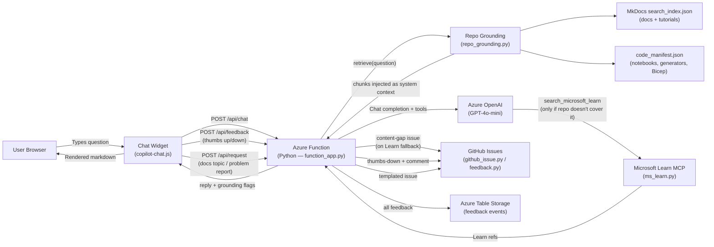

# AI Copilot Chat

<div class="hero" markdown>

**Your AI assistant for everything in this repository**

Ask about architecture, tutorials, compliance rules, PySpark patterns, troubleshooting, and more.

</div>

---

## Architecture

The Copilot Chat widget connects your browser to an Azure OpenAI-powered backend via a serverless Azure Function (Python). Every question is grounded against **actual repository content** — the MkDocs search index (all docs/tutorials) plus a generated code manifest (notebooks, generators, Bicep modules) — before the model is called. If the question is a real Fabric/Azure topic the repo doesn't cover, the backend falls back to Microsoft Learn and auto-files a `content-gap` GitHub issue.



When the backend is unreachable, the widget falls back to client-side search over the same MkDocs `search_index.json`.

## Features

| Feature | Description |
|---------|-------------|
| **Markdown rendering** | Tables, code blocks, task lists, blockquotes, and inline formatting |
| **Syntax highlighting** | Lazy-loaded highlight.js for fenced code blocks with language labels |
| **Copy button** | One-click code copying on every fenced code block |
| **Citations** | `[^n]` superscript references with a source-card footer |
| **Resizable panel** | Drag handle with min 320 px / max 75% viewport constraints |
| **Full-page mode** | Toggle to expand the chat panel to fill the entire viewport |
| **ndjson streaming** | Progressive rendering of assistant responses as tokens arrive |
| **Dark mode** | Matches `[data-md-color-scheme="slate"]` and `prefers-color-scheme: dark` |
| **XSS hardening** | All user-supplied text is HTML-escaped before rendering |
| **SHA-256 tokens** | Client-generated request tokens via SubtleCrypto |
| **Offline fallback** | Falls back to MkDocs search index when the backend is unreachable |
| **Injection guard** | Client-side prompt injection pattern detection |
| **Repo grounding** | Every question retrieves matching chunks from the MkDocs search index **and** a generated code manifest (notebooks, generators, Bicep modules) before the model is called |
| **Learn fallback** | Real Fabric/Azure topics the repo doesn't cover fall back to Microsoft Learn; a `content-gap` issue is auto-filed so the gap gets documented |
| **Thumbs up/down feedback** | Per-message feedback buttons; thumbs-down opens a comment box. All feedback lands in Azure Table Storage, and thumbs-down with a comment files a GitHub issue |
| **Request / report menu** | Header menu to request a documentation topic or report a problem — filed as GitHub issues using the repo's `documentation-request.md` / `bug_report.md` templates |

## Feedback & Requests

The widget closes the loop between readers and the repo backlog:

- **Thumbs up/down** appear under every assistant reply. Ratings are stored in Azure Table Storage (`CopilotFeedback`) with the question, reply excerpt, page path, and a session ID for correlation.
- **Thumbs-down + comment** additionally creates a GitHub issue (labelled `copilot-feedback`) so maintainers see actionable criticism, not just a score.
- **Header menu (⋮)** offers *Request a docs topic* and *Report a problem*. Both POST to `/api/request` and file issues using the repo's own templates (`documentation-request.md`, `bug_report.md`), rate-limited per client.

## Configuration

Set `window.COPILOT_CONFIG` before the script loads to override defaults:

```javascript
window.COPILOT_CONFIG = {
  apiEndpoint: "https://your-function.azurewebsites.net/api/chat",
  feedbackEndpoint: "https://your-function.azurewebsites.net/api/feedback",
  requestEndpoint: "https://your-function.azurewebsites.net/api/request",
  siteUrl: "https://your-site.github.io/your-repo/",
  repoUrl: "https://github.com/your-org/your-repo",
  maxHistory: 20,
  rateLimitMs: 1500
};
```

If `feedbackEndpoint` / `requestEndpoint` are omitted they are derived from `apiEndpoint`. The backend needs `GITHUB_TOKEN` (issue filing) and `AzureWebJobsStorage` (feedback table) configured — see `azure-functions/copilot-chat/README.md`.

---

<div id="copilot-fullpage"></div>

---

!!! info "About this Copilot"
    This AI assistant is powered by **Azure OpenAI** and has full context of the Supercharge Microsoft Fabric repository — including all 37 tutorials, 35 feature docs, 37 best practice guides, 55+ notebooks, and the complete codebase.

    **Example questions:**

    - "How do I set up the Bronze layer for USDA data?"
    - "What are the CTR compliance thresholds?"
    - "Show me the medallion architecture pattern"
    - "How does Direct Lake connect to Power BI?"
    - "Help me troubleshoot notebook errors with mssparkutils"

!!! warning "Backend Required"
    The Copilot requires the Azure Function backend to be deployed. See `azure-functions/copilot-chat/` for setup instructions.
