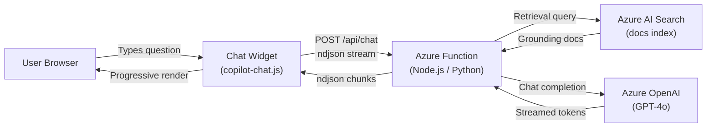

# AI Copilot Chat

<div class="hero" markdown>

**Your AI assistant for everything in this repository**

Ask about architecture, tutorials, compliance rules, PySpark patterns, troubleshooting, and more.

</div>

---

## Architecture

The Copilot Chat widget connects your browser directly to an Azure OpenAI-powered backend via a serverless Azure Function. User questions are grounded against a search index built from the full documentation set.



## Features

| Feature | Description |
|---------|-------------|
| **Markdown rendering** | Tables, code blocks, task lists, blockquotes, and inline formatting |
| **Syntax highlighting** | Lazy-loaded highlight.js for fenced code blocks with language labels |
| **Copy button** | One-click code copying on every fenced code block |
| **Citations** | `[^n]` superscript references with a source-card footer |
| **Resizable panel** | Drag handle with min 320 px / max 75% viewport constraints |
| **Full-page mode** | Toggle to expand the chat panel to fill the entire viewport |
| **ndjson streaming** | Progressive rendering of assistant responses as tokens arrive |
| **Dark mode** | Matches `[data-md-color-scheme="slate"]` and `prefers-color-scheme: dark` |
| **XSS hardening** | All user-supplied text is HTML-escaped before rendering |
| **SHA-256 tokens** | Client-generated request tokens via SubtleCrypto |
| **Offline fallback** | Falls back to MkDocs search index when the backend is unreachable |
| **Injection guard** | Client-side prompt injection pattern detection |

## Configuration

Set `window.COPILOT_CONFIG` before the script loads to override defaults:

```javascript
window.COPILOT_CONFIG = {
  apiEndpoint: "https://your-function.azurewebsites.net/api/chat",
  siteUrl: "https://your-site.github.io/your-repo/",
  repoUrl: "https://github.com/your-org/your-repo",
  maxHistory: 20,
  rateLimitMs: 1500
};
```

---

<div id="copilot-fullpage"></div>

---

!!! info "About this Copilot"
    This AI assistant is powered by **Azure OpenAI** and has full context of the Supercharge Microsoft Fabric repository — including all 37 tutorials, 35 feature docs, 37 best practice guides, 55+ notebooks, and the complete codebase.

    **Example questions:**

    - "How do I set up the Bronze layer for USDA data?"
    - "What are the CTR compliance thresholds?"
    - "Show me the medallion architecture pattern"
    - "How does Direct Lake connect to Power BI?"
    - "Help me troubleshoot notebook errors with mssparkutils"

!!! warning "Backend Required"
    The Copilot requires the Azure Function backend to be deployed. See `azure-functions/copilot-chat/` for setup instructions.
