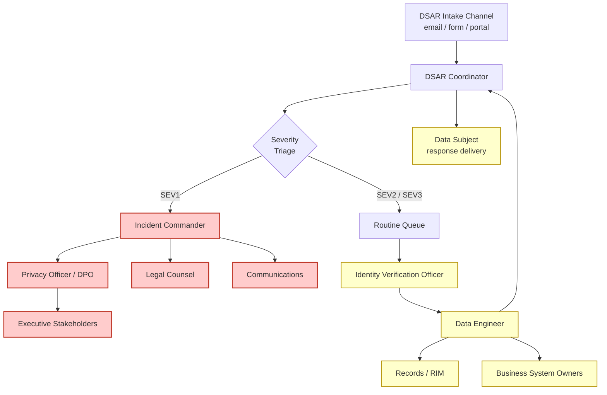
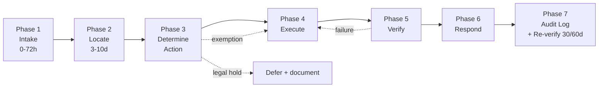
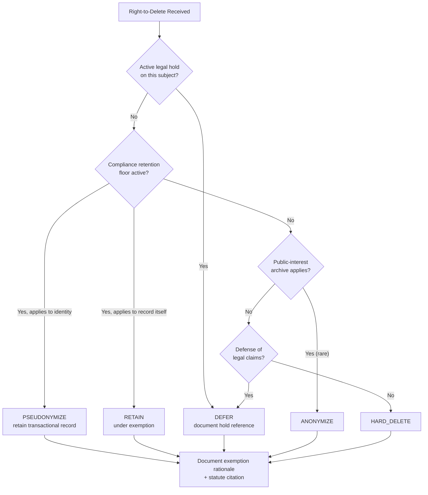

[Home](../../index.md) > [Docs](../..) > [Compliance Templates](.) > DSAR Runbook

# 📨 DSAR (Data Subject Access Request) Runbook

<div align="center" markdown>

**Operational Runbook + Fillable Template — Right to Know · Right to Delete · Right to Correct · Right to Portability**


</div>

---

**Last Updated:** `2026-04-27` | **Version:** 1.0.0 | **Wave 5 Feature:** 5.11
**Style anchors:** [Incident Response Template](../runbooks/incident-response-template.md) (procedure structure) · [SOC 2 Type II Readiness](../best-practices/security/soc2-type2-readiness.md) (Privacy TSC) · [GDPR Right to Deletion](../best-practices/security/gdpr-right-to-deletion.md) (technical cascade) · [CCPA Privacy Rights](../best-practices/security/ccpa-privacy-rights.md) (verification standards)

> 📋 **TEMPLATE — Clone and customize for your organization.** This runbook is delivered as a working template. Fill in `{{PLACEHOLDERS}}`, swap example regulatory references for your jurisdiction, and align timing/escalation paths to your privacy-program SLAs before placing into operation. Track template revisions through your organization's document-control process.

> **Disclaimer:** This document provides operational and technical guidance for fulfilling Data Subject Access Requests (DSARs) on Microsoft Fabric. It is **not** legal advice. The applicability of GDPR, CCPA/CPRA, state privacy laws (Virginia VCDPA, Colorado CPA, Connecticut CTDPA, Utah UCPA, Texas TDPSA, etc.), Privacy Act, HIPAA, and sector-specific obligations is fact-specific. Engage qualified privacy counsel to validate the request-handling decisions, exemption applications, identity-verification thresholds, and cross-border-transfer answers that apply to your organization. Statutes and regulator guidance evolve; verify timing requirements and exemption criteria against current law before relying on them.

---

## 📑 Table of Contents

- [🎯 Overview](#-overview)
- [📋 Regulatory Coverage](#-regulatory-coverage)
- [🚨 Severity Classification](#-severity-classification)
- [👥 Roles & Responsibilities](#-roles--responsibilities)
- [📞 Communications Tree](#-communications-tree)
- [🔄 DSAR Lifecycle Overview](#-dsar-lifecycle-overview)
- [🟢 Phase 1 — Intake (0-72 hours)](#-phase-1--intake-0-72-hours)
- [🔍 Phase 2 — Locate](#-phase-2--locate)
- [⚖️ Phase 3 — Determine Action](#️-phase-3--determine-action)
- [⚙️ Phase 4 — Execute](#️-phase-4--execute)
- [✅ Phase 5 — Verify](#-phase-5--verify)
- [📤 Phase 6 — Respond to Subject](#-phase-6--respond-to-subject)
- [📜 Phase 7 — Audit Log](#-phase-7--audit-log)
- [🛡️ Exemption Decision Framework](#️-exemption-decision-framework)
- [📨 Communication Templates](#-communication-templates)
- [⏱️ Timing & SLA](#️-timing--sla)
- [🔺 Escalation](#-escalation)
- [🌍 Multi-Tenant / Cross-Border Considerations](#-multi-tenant--cross-border-considerations)
- [📚 Record Keeping](#-record-keeping)
- [📝 Forms & Templates Provided](#-forms--templates-provided)
- [🎰 Casino Implementation](#-casino-implementation)
- [🏛️ Federal Implementation](#️-federal-implementation)
- [🚫 Anti-Patterns](#-anti-patterns)
- [📋 Implementation Checklist](#-implementation-checklist)
- [🪞 Post-Request Review](#-post-request-review)
- [📚 References](#-references)

---

## 🎯 Overview

A **Data Subject Access Request (DSAR)** is a formal exercise by a data subject (consumer, customer, employee, patient, borrower, or applicable third party) of one of the privacy rights granted under applicable law. This runbook covers the four operationally significant rights:

| Right | Plain English | Primary Statute Anchors |
|-------|----------------|------------------------|
| **Right to Know / Access** | "Tell me what data you have about me" | GDPR Art. 15 · CCPA §1798.110 · most state laws |
| **Right to Delete / Erasure** | "Delete my data" | GDPR Art. 17 · CCPA §1798.105 · most state laws |
| **Right to Correct / Rectify** | "Correct the inaccurate data you hold" | GDPR Art. 16 · CPRA §1798.106 · most state laws |
| **Right to Portability** | "Give me my data in a portable, machine-readable format" | GDPR Art. 20 · CCPA §1798.130 (limited subset) |

Other rights (objection, restriction of processing, automated-decision review, opt-out of sale/share, opt-out of profiling) are addressed in the parent privacy program; this runbook focuses on the four where Fabric data engineering is the operational execution surface.

### What This Runbook Covers

- A repeatable, auditable lifecycle from intake to attestation
- Severity classification — when to escalate vs. routine processing
- Identity verification standards aligned with CCPA "verifiable consumer request" and GDPR Art. 12(6) reasonable evidence
- Cross-source subject location across Bronze/Silver/Gold lakehouses, Eventhouse, MDM, vector DB, ML feature store
- Exemption decision framework (compliance retention, legal hold, public interest)
- Copy-paste-ready communication templates for every subject-facing touchpoint
- Audit log schema for regulator-defensible attestation
- Casino and federal-domain illustrations

> 📝 **Scope:** Phase 14 Wave 5 feature 5.11. The technical cascade and PySpark notebook references are owned by [GDPR Right to Deletion](../best-practices/security/gdpr-right-to-deletion.md). The CCPA-specific verification rules and "Do Not Sell or Share" mechanics are owned by [CCPA Privacy Rights](../best-practices/security/ccpa-privacy-rights.md). This runbook is the **operational glue** that ties them to a request lifecycle.

---

## 📋 Regulatory Coverage

DSAR handling crosses many privacy regimes. Apply the **strictest applicable rule** when a subject's residency or your processing footprint crosses jurisdictions.

### Regulatory Coverage Matrix

| Right | GDPR (EU/UK) | CCPA / CPRA (CA) | State Variants | Other |
|-------|--------------|-------------------|----------------|-------|
| **Access / Know** | Art. 15 | §1798.110 / §1798.115 / §1798.130 | VCDPA · CPA · CTDPA · UCPA · TDPSA | HIPAA 45 CFR 164.524; Privacy Act §552a(d) |
| **Erasure / Delete** | Art. 17 | §1798.105 | All major state laws | HIPAA: amend, not delete |
| **Correction** | Art. 16 | §1798.106 (CPRA) | All major state laws | HIPAA 45 CFR 164.526 |
| **Portability** | Art. 20 | §1798.130(a)(3)(B)(iii) | All major state laws | None federal |

### Timing Floors by Regime

| Regime | Acknowledge | Substantive Response | Max Extension |
|--------|-------------|----------------------|---------------|
| **GDPR / UK GDPR** | Without undue delay | 30 days | + 60 days |
| **CCPA / CPRA** | 10 business days | 45 days | + 45 days |
| **VCDPA / CPA / CTDPA / UCPA / TDPSA** | — | 45 days | + 45 days |
| **HIPAA right of access** | — | 30 days | + 30 days (one-time) |
| **Privacy Act** (federal agencies) | 10 working days | "promptly" | — |
| **PIPEDA** (Canada) | — | 30 days | + 30 days |

### Special Regimes Encountered in This POC

| Domain | Regime | Notes |
|--------|--------|-------|
| Casino | CCPA + state gaming | California players invoke CCPA; gaming-commission record floors limit deletion |
| Tribal Health | HIPAA + tribal sovereignty | Right of access (45 CFR 164.524) applies; right to amend (45 CFR 164.526), not delete |
| SBA borrowers | Privacy Act + FCRA | Privacy Act SOR records have NARA-approved retention; FCRA may also apply |
| DOT/FAA | Privacy Act + FAA records | Aviation safety records have lengthy retention |
| EU expat customers | GDPR (extraterritorial Art. 3) | If you target EU residents, GDPR applies even from US |

---

## 🚨 Severity Classification

DSAR severity is **not** about the request type — it is about the operational risk of getting the response wrong or late.

### Severity Levels

| Severity | Trigger | Response Time | Pager? | Approver |
|----------|---------|---------------|--------|----------|
| **SEV1 — Critical** | Regulatory deadline ≤ 5 days · Media exposure · Subject represented by counsel · Active regulator complaint · DPA/AG inquiry | Same business day acknowledge; daily standups | ✅ Privacy Officer + Legal | Privacy Officer + General Counsel |
| **SEV2 — Standard** | Standard request, well within deadline, no aggravating factors | Within 10 business days (CCPA floor) | ❌ | DSAR Coordinator |
| **SEV3 — Internal / Low** | Internal verification request (test, employee non-DSAR review, due-diligence simulation) · Manifestly unfounded or excessive (per GDPR Art. 12(5)) — pending counsel review | Best effort | ❌ | DSAR Coordinator |

### Severity Examples

| Scenario | Severity |
|----------|---------|
| EU resident requests deletion, 28 days remain | SEV2 |
| Same request at day 27 still in identity-verification loop | **SEV1** |
| Subject's attorney sends letter referencing pending litigation | **SEV1** |
| State AG / DPA forwards a constituent complaint | **SEV1** |
| Authorized agent submits DSAR for 47 California consumers | SEV2 (volume flag) |
| Repeat request, same subject, 12 months (potentially excessive) | SEV3 (legal review) |
| Tabletop exercise — synthetic subject submits delete | SEV3 |

---

## 👥 Roles & Responsibilities

| Role | Responsibilities | Typical Title |
|------|------------------|---------------|
| **Privacy Officer / DPO** | Strategic ownership; DPIA decisions; regulator-facing comms; final exemption sign-off; escalation gate | DPO, CPO, Privacy Lead |
| **DSAR Coordinator** | Operational owner per request; opens ticket; drives lifecycle; subject communications; SLA tracking | Privacy Analyst, Privacy Engineer |
| **Identity Verification Officer** | Performs identity verification per risk tier; documents verification evidence; rejects insufficient evidence | Trust & Safety, Customer Success, Privacy Analyst |
| **Data Engineer** | Runs subject locator; executes cascade notebooks; produces export packages; runs verifier; signs off on technical completion | Data Engineering, Privacy Engineering |
| **Legal Counsel** | Exemption review (compliance retention, legal hold, public-interest); engagement with subject's counsel; cross-border decisions; litigation hold check | In-house counsel, outside privacy counsel |
| **Communications** | Subject-facing message review; tone alignment with brand; regulator-grade language for SEV1 | Privacy Comms, Marketing Compliance |
| **Information Security** | Identity-verification standards; secure delivery channel for exports; suspected-fraud escalation | InfoSec, Identity Team |
| **Records / RIM** | Retention-schedule lookups; legal-hold register check; NARA / record-schedule cross-reference (federal) | Records Manager |
| **Business System Owners** | Confirm that locator covered all of their stores; sign off on cascade for their domain | App Owner per system |
| **Incident Commander** | Activated on SEV1 only; coordinates same-day-response posture | Senior Privacy Engineer or DPO |

> 🧩 **RACI summary** — fill in for your org during template adoption:
>
> | Activity | Privacy Officer | DSAR Coordinator | Data Engineer | Legal | Comms |
> |----------|-----------------|------------------|----------------|-------|-------|
> | Intake | I | **R/A** | I | I | — |
> | Identity verification | C | **R** | — | C | — |
> | Subject locate | I | A | **R** | — | — |
> | Exemption decision | **A** | C | C | **R** | — |
> | Cascade execution | I | A | **R** | — | — |
> | Subject response | A | R | I | C | **R** |
> | Audit log finalize | A | **R** | C | C | — |

---

## 📞 Communications Tree



### On-Call Routing

| Channel | Routing Target | Purpose |
|---------|----------------|---------|
| `dsar@{{ORG_DOMAIN}}` | DSAR Coordinator distribution list | Primary intake |
| `privacy@{{ORG_DOMAIN}}` | Privacy Officer + Coord | Escalations, regulator-forwarded |
| Power Apps / web form | API → Dataverse + auto-ack | Self-service intake |
| Phone hotline `{{PHONE}}` | Privacy Coordinator (business hours) → ticket | Required by CCPA for businesses doing business in California |
| Postal mail to `{{ADDRESS}}` | Records / RIM team → digitize → ticket | Legacy channel, still required |

---

## 🔄 DSAR Lifecycle Overview



Each phase has explicit entry criteria, exit criteria, and a fillable template artifact. The runbook below is the canonical reference for each.

---

## 🟢 Phase 1 — Intake (0-72 hours)

### Entry

A DSAR has arrived through any channel.

### Activities

#### 1.1 Channel Receipt

| Channel | Auto-Acknowledge? | Initial Assignee |
|---------|-------------------|-------------------|
| Email alias `dsar@` | ✅ Power Automate auto-reply with DSAR_ID | DSAR Coordinator |
| Power Apps web form | ✅ Confirmation page + email | DSAR Coordinator |
| In-app account-settings link | ✅ Authenticated context auto-fills identity | DSAR Coordinator |
| Phone hotline | Manual ack at end of call | DSAR Coordinator |
| Postal mail | Manual ack within 5 business days | DSAR Coordinator |
| Authorized-agent submission | Manual — agent contracts must be reviewed | DSAR Coordinator + Legal |

#### 1.2 Open Ticket and Assign DSAR_ID

DSAR_ID format: `DSAR-{{YYYY-MM-DD}}-{{NNNN}}` (e.g., `DSAR-2026-04-27-0001`).

The coordinator opens a ticket in the privacy ticketing system (e.g., OneTrust, ServiceNow Privacy, or a Dataverse-backed tracker) capturing:

- Channel of receipt and date/time
- Claimed identity (name, email, phone, account ID, residency)
- Request type (one or more of access / delete / correct / portability / objection / restriction)
- Self vs. authorized agent
- Free-text narrative from the subject
- Attachments (ID copies, agent letter, etc.) — stored to a restricted-access location

#### 1.3 Identity Verification

> ⚠️ **Verifying identity before processing is non-negotiable.** Erroneously deleting the wrong person's data — or disclosing one person's data to another — is itself a privacy breach.

Apply the **risk tier** that matches the data sensitivity, not just the request type.

| Risk Tier | Evidence Standard | Examples |
|-----------|-------------------|----------|
| **Low** — public/marketing data only | Email loop confirmation; signed link click | Marketing newsletter unsubscribe-style request |
| **Medium** — account-bound non-financial data | Authenticated session + step-up MFA · OR · two of: email, phone, recent transaction reference | Loyalty profile, app preferences |
| **High** — financial, health, or biometric | Government-issued ID · OR · knowledge-based authentication (KBA) with at least 3 questions · OR · in-person verification | CTR/SAR, W-2G, HIPAA records, SBA loan |
| **CCPA "Specific Pieces" of PI** | At least 3 pieces of personal info matched + signed declaration under penalty of perjury (CCPA reg §7062) | Right-to-know specific values |

**Authorized agents (CCPA):**
- Written authorization from the consumer
- Verification of the agent's identity
- Direct verification of consumer's identity if requesting specific pieces of PI (CCPA reg §7063)
- Power of attorney if the agent claims one

**Authorized representatives (GDPR):**
- Reasonable evidence of representation; not formally regulated but document the basis
- Where the request is for erasure of a deceased person, defer to local member-state law

#### 1.4 Send Acknowledgment

Per regime — see [Communication Templates](#-communication-templates) §A:

- **CCPA:** Within **10 business days** of receipt — must explain how the consumer can verify
- **GDPR:** Initial acknowledgment within reasonable time; substantive response within **30 days**
- **State variants:** Most align with CCPA's 10-business-day standard; check applicable state

#### 1.5 Severity Triage

Apply the [severity matrix](#-severity-classification). Update ticket. If SEV1, page Incident Commander immediately.

### Exit

- DSAR_ID assigned and ticket open
- Identity-verification status recorded (verified · pending · failed)
- Severity assigned
- Acknowledgment sent and logged

### Phase 1 Fillable Template

```yaml
# DSAR Intake Record — fill at intake completion
dsar_id:                    DSAR-2026-04-27-0001
channel_received:           email | webform | inapp | phone | postal | agent
received_at:                2026-04-27T14:33Z
acknowledged_at:            2026-04-27T15:00Z
acknowledgment_method:      email | letter | both
claimed_identity:
  full_name:                "{{NAME}}"
  email:                    "{{EMAIL}}"
  phone:                    "{{PHONE}}"
  account_id:               "{{ACCOUNT_ID}}"
  residency_claimed:        "{{STATE_OR_COUNTRY}}"
request_type:               [access, delete, correct, portability]
self_or_agent:              self | agent
agent_details:              "{{N/A or agent name + auth basis}}"
narrative:                  "{{free text from subject}}"
applicable_regime:          [GDPR, CCPA, VCDPA, HIPAA, ...]
severity:                   SEV1 | SEV2 | SEV3
sla_clock_starts:           2026-04-27T14:33Z
substantive_response_due:   2026-06-11T14:33Z   # +45 days CCPA, +30 days GDPR
identity_risk_tier:         low | medium | high | ccpa_specific_pieces
identity_verification_status: verified | pending | failed
identity_evidence_pointers: ["secure_storage://idv/2026-04-27-0001/*"]
coordinator_assigned:       "{{NAME}}"
```

---

## 🔍 Phase 2 — Locate

### Entry

Identity verified. DSAR_ID has a ticket and severity. Coordinator has scoped the request type.

### Activities

#### 2.1 Run the Subject Locator

Execute the subject-locator notebook documented in [GDPR Right to Deletion §Implementation in Fabric](../best-practices/security/gdpr-right-to-deletion.md#️-implementation-in-fabric):

```
notebooks/privacy/01_dsar_subject_locator.py
```

Inputs: `dsar_id`, `subject_id`, `subject_field` (canonical identifier — see MDM patterns in `docs/best-practices/data-management/master-data-management.md`).

Output: a row in `lh_governance.dsar_subject_inventory` per table that holds the subject's data, with `lawful_basis`, `retention_days`, and `erasure_exemption` carried from the dataset registry.

#### 2.2 Cross-Source Search

The locator must sweep **every** store. Verify checklist:

- [ ] Bronze lakehouses (raw ingestion)
- [ ] Silver lakehouses (cleansed/conformed)
- [ ] Gold lakehouses (aggregates and KPIs)
- [ ] Eventhouse / KQL streaming stores
- [ ] Vector DB / embedding stores (RAG / Copilot)
- [ ] MDM golden records (subject locator must know identifier-graph fan-out)
- [ ] ML feature store (online + offline)
- [ ] Power BI semantic models (Direct Lake auto-resolves once Gold is fixed)
- [ ] OneLake snapshots / backups
- [ ] CRM / Dynamics
- [ ] Loyalty / membership systems
- [ ] Compliance filings (CTR/SAR/W-2G — special handling)
- [ ] Helpdesk / support ticket history
- [ ] Email / marketing-automation system
- [ ] Audit / lineage logs (to be redacted, not deleted)
- [ ] Sub-processors (third parties holding subject data on your behalf)

#### 2.3 Sub-Processor Inventory Check

Maintain a **disclosure register** per dataset (Article 30 records of processing). For each store hit by the locator, check whether the data was disclosed to a sub-processor and whether their DPA includes erasure / access support.

| Sub-Processor | Data Categories Shared | DPA Erasure Clause? | Erasure SLA |
|---------------|-------------------------|---------------------|-------------|
| `{{VENDOR_A}}` | `{{categories}}` | Yes / No | `{{days}}` |
| `{{VENDOR_B}}` | `{{categories}}` | Yes / No | `{{days}}` |

For Microsoft Fabric itself, the [Microsoft Online Services DPA](https://www.microsoft.com/licensing/docs/view/Microsoft-Products-and-Services-Data-Protection-Addendum-DPA) covers DSAR support.

#### 2.4 Document Scope

Produce a **subject inventory summary** for Privacy Office review.

### Exit

- `lh_governance.dsar_subject_inventory` populated for this DSAR_ID
- All non-Fabric stores accounted for (manual additions allowed)
- Sub-processor notification list compiled (for Phase 4)

### Phase 2 Fillable Template

```yaml
# DSAR Locator Summary
dsar_id:                    DSAR-2026-04-27-0001
locator_run_id:             "{{spark_app_id}}"
locator_completed_at:       2026-04-27T16:10Z
total_tables_with_match:    27
total_rows_located:         1842
sources_swept:
  - lh_bronze_casino:       12 tables, 1402 rows
  - lh_silver_casino:        8 tables,  338 rows
  - lh_gold_casino:          3 tables,   71 rows
  - eventhouse_realtime:     1 table,    27 rows
  - vector_db_copilot:       1 collection, 4 rows
  - mdm_player_golden:       1 row
  - ml_feature_store:        1 row
  - crm_external:           manual scan: 0 hits
  - support_helpdesk:       manual scan: 2 hits
sub_processors_holding_data:
  - vendor_id:              "{{VENDOR_A}}"
    categories:             ["loyalty_email", "transaction_summary"]
    dpa_erasure_clause:     yes
    notification_required:  yes
non_fabric_systems:         ["legacy_floor_system_v1"]
ready_for_phase_3:          true
```

---

## ⚖️ Phase 3 — Determine Action

### Entry

Subject inventory exists. Privacy Officer reviews.

### Activities

#### 3.1 Per-Table Action Classification

For each table in the inventory, assign exactly one action:

| Action | When |
|--------|------|
| **EXPORT_ONLY** | Right-to-know request; no deletion required |
| **HARD_DELETE** | Right to delete + no retention floor + no legal hold |
| **PSEUDONYMIZE** | Right to delete + retention floor active (BSA, IRS, HIPAA, Privacy Act, SOX) |
| **ANONYMIZE** | Aggregate that can be made non-identifying via k-anonymity / DP |
| **DEFER** | Active legal hold or pending investigation |
| **CORRECT** | Right-to-correct request — value update + audit log |
| **PORTABILITY_PACKAGE** | Right-to-portability — include in machine-readable export |

Multiple actions may apply per table for a multi-faceted request (access + delete + portability).

#### 3.2 Apply Exemption Decision Framework

See [Exemption Decision Framework](#️-exemption-decision-framework) for the full decision logic.

#### 3.3 Privacy Officer + Legal Sign-Off

Privacy Officer reviews the proposed action plan. For SEV1, Legal must also sign off. Both signatures are recorded against the DSAR_ID.

### Exit

- Approved exemption-and-action plan persisted to `lh_governance.dsar_exemption_plan` with `approved=true`
- All exemption rationale citations recorded

### Phase 3 Fillable Template

```yaml
# DSAR Action Plan — fill per table after Privacy Office review
dsar_id:                    DSAR-2026-04-27-0001
plan_table:                 lh_governance.dsar_exemption_plan
plan:
  - table_name:             lh_bronze.player_signups
    action:                 HARD_DELETE
    pii_columns:            [player_id, email, phone]
    exemption:              none
    rationale:              "Lawful basis = consent; subject withdrew."
  - table_name:             lh_bronze.ctr_filings
    action:                 PSEUDONYMIZE
    pii_columns:            [player_id, ssn_hash, dob]
    exemption:              bsa_31_cfr_1010
    rationale:              "5-year BSA retention floor; replace identity, retain transaction."
  - table_name:             lh_silver.litigation_events
    action:                 DEFER
    exemption:              legal_hold_2026_03_002
    rationale:              "Subject is named in active matter; hold until counsel releases."
  - table_name:             lh_gold.daily_player_kpi
    action:                 RECOMPUTE
    rationale:              "Subject contribution removed once Silver is purged; re-run notebook."
privacy_officer_sign_off:   "{{NAME}} @ {{TIMESTAMP}}"
legal_sign_off:             "{{NAME}} @ {{TIMESTAMP}}"   # required SEV1
approved:                   true
```

---

## ⚙️ Phase 4 — Execute

### Entry

Plan is approved and persisted.

### Activities

#### 4.1 Cascading Deletion (if applicable)

Run the deletion-executor notebook from [GDPR Right to Deletion](../best-practices/security/gdpr-right-to-deletion.md#️-implementation-in-fabric):

```
notebooks/privacy/02_dsar_deletion_executor.py
notebooks/silver/41_gdpr_cascading_delete.py    # Wave 5 cascade artifact
```

The executor reads `dsar_exemption_plan`, applies per-row action with retry, and writes `lh_governance.dsar_audit_log`.

#### 4.2 Right-to-Know Export Assembly

Generate a structured report consolidating all rows in the subject inventory:

```python
# notebooks/privacy/04_dsar_access_export.py — illustrative skeleton
# Reads dsar_subject_inventory, joins back to source rows, redacts other-subjects,
# writes JSON + human-readable PDF to a secure-delivery location.
```

The export must include:

| Section | Content |
|---------|---------|
| Categories of PI collected | Tied to your privacy notice |
| Categories of sources | Direct, third-party, derived |
| Business / commercial purposes | Per dataset metadata |
| Categories of third parties | Sub-processors with DPA references |
| Specific pieces (CCPA verified-pieces only) | Actual values |
| Retention period | Per dataset |
| Right to delete / correct / object instructions | Standard footer |

#### 4.3 Right-to-Correct Execution

```sql
MERGE INTO lh_silver.player_dim AS tgt
USING (SELECT :subject_id AS subject_id,
              :new_email   AS email_new) AS src
ON tgt.player_id = src.subject_id
WHEN MATCHED THEN UPDATE SET email = src.email_new,
                              corrected_at = current_timestamp(),
                              corrected_by_dsar = :dsar_id;
```

Validate the proposed correction before applying:

- Does the new value pass schema constraints?
- Is there evidence supporting the correction (e.g., utility bill for an address change)?
- Is the source-of-record system being updated *upstream* so the next ingestion does not overwrite?

If the source system cannot be updated, **note the discrepancy in the response** and document the reason.

#### 4.4 Right-to-Portability Package

Produce machine-readable output in CSV or JSON:

```
exports/{{DSAR_ID}}/portability_package.zip
├── README.txt                     # Schema description
├── personal_information.json      # Top-level subject record
├── transactions.csv               # Time-series records
├── preferences.json               # Settings and consents
├── messaging_history.csv          # Communications
└── PROVENANCE.txt                 # Generation timestamp + hash + signer
```

Deliver via secure channel (see Phase 6).

#### 4.5 Sub-Processor Notification

Article 17(2) and CCPA service-provider clauses: notify each sub-processor that received the subject's data of the DSAR action. Use the standard [sub-processor notification template](#-communication-templates) §F.

### Exit

- `lh_governance.dsar_audit_log` shows execution rows for every plan entry
- Export / correction / portability artifacts written to secure-delivery location
- Sub-processor notifications sent

### Phase 4 Fillable Template

```yaml
# DSAR Execution Report
dsar_id:                    DSAR-2026-04-27-0001
executor_run_id:            "{{spark_app_id}}"
execution_started_at:       2026-04-27T18:00Z
execution_completed_at:     2026-04-27T19:42Z
deletions:
  hard_deleted_rows:        1402
  pseudonymized_rows:       338
  anonymized_rows:          0
  deferred_rows:            27
exports:
  access_report_path:       "exports/DSAR-2026-04-27-0001/access_report.pdf"
  portability_path:         "exports/DSAR-2026-04-27-0001/portability_package.zip"
  package_sha256:           "{{HASH}}"
corrections:
  fields_corrected:         []
sub_processor_notifications:
  - vendor:                 "{{VENDOR_A}}"
    method:                 email
    sent_at:                2026-04-27T19:50Z
    ack_received:           pending
verification_pipeline_run:  pending   # set after Phase 5
```

---

## ✅ Phase 5 — Verify

### Entry

Execution complete. Verifier notebook ready to run.

### Activities

#### 5.1 Run Verifier Notebook

```
notebooks/privacy/03_dsar_verifier.py
```

The verifier re-queries every table in the plan and asserts the action took effect:

- HARD_DELETE → `count(* where subject = X) == 0`
- PSEUDONYMIZE → raw value gone, pseudonym present, transactional row count unchanged
- ANONYMIZE → no row group has cell size below the k-anonymity threshold
- DEFER → flagged in audit log; no row change expected

#### 5.2 Sample Verification Queries

```sql
-- Bronze
SELECT COUNT(*) AS remaining FROM lh_bronze.player_signups WHERE player_id = :sid;
-- expected: 0

-- Silver
SELECT COUNT(*) AS remaining FROM lh_silver.player_dim WHERE player_id = :sid;
-- expected: 0

-- Gold (after recompute)
SELECT COUNT(*) AS remaining FROM lh_gold.daily_player_kpi WHERE player_id = :sid;
-- expected: 0

-- Eventhouse
StreamingPlayerEvents
| where player_id == ":sid"
| count
// expected: 0

-- Pseudonymized retained record
SELECT COUNT(*) AS raw_remaining
FROM lh_bronze.ctr_filings WHERE player_id = :sid;
-- expected: 0
SELECT COUNT(*) AS pseudonym_present
FROM lh_bronze.ctr_filings WHERE player_id = :pseudonym_token;
-- expected: > 0
```

#### 5.3 Power BI Cache Invalidation

| Component | Action |
|-----------|--------|
| Direct Lake semantic model | Refresh — auto-resolves after Gold reprocess |
| Import semantic model | Trigger on-demand refresh |
| Cached visuals / tiles | XMLA `clearCache` if stale-cache risk |
| Paginated reports | No cache; refreshes on view |

#### 5.4 Backup Propagation Timeline

OneLake snapshots and ADLS backups are typically immutable for the retention window. Document the **roll-forward** propagation:

| Backup Tier | Retention | Re-Verify Date |
|-------------|-----------|----------------|
| Operational snapshot (RPO 7d) | 30 days | Day 30 post-deletion |
| DR copy / GRS | 60-90 days | Day 60-90 post-deletion |

Schedule the verifier to re-run on those dates. If any backup is restored during the window, **immediately re-apply** the deletion.

#### 5.5 Final Verification Pass

The verifier must return `assert no failures`. Any failure → return to Phase 4 with a fix.

### Exit

- `lh_governance.dsar_verification` rows for every plan entry, all `verified = true`
- Re-verification scheduled for backup-rotation dates
- Power BI cache state confirmed

### Phase 5 Fillable Template

```yaml
# DSAR Verification Report
dsar_id:                    DSAR-2026-04-27-0001
verifier_run_id:            "{{spark_app_id}}"
verification_at:            2026-04-27T20:15Z
all_verified:               true
verification_findings:
  - table:                  lh_bronze.player_signups
    expected:               0_rows
    actual:                 0_rows
    pass:                   true
  - table:                  lh_bronze.ctr_filings
    expected:               raw_zero_pseudonym_present
    actual:                 raw=0, pseudonym=14
    pass:                   true
power_bi_cache_state:       refreshed | cleared
re_verify_30d_scheduled:    2026-05-27T20:15Z
re_verify_60d_scheduled:    2026-06-26T20:15Z
re_verify_rpo_policy:       roll_forward
```

---

## 📤 Phase 6 — Respond to Subject

### Entry

Verification passed. Artifacts produced.

### Activities

#### 6.1 Compose Response

Use the appropriate [Communication Template](#-communication-templates):

| Request Type | Template |
|---------------|----------|
| Access / Right to Know | §C.1 |
| Deletion Confirmation | §C.2 |
| Correction Confirmation | §C.3 |
| Portability Transmission | §C.4 |
| Exemption / Partial Refusal | §C.5 |
| Authorized-Agent Denial | §C.6 |

#### 6.2 Quality Review

DSAR Coordinator + Communications review the draft for:

- Tone (regulator-grade for SEV1)
- Accuracy (no claims that go beyond what was actually done)
- Completeness (all rights addressed, escalation path included)
- No leakage of other subjects' data in the response

#### 6.3 Delivery Method

| Method | When |
|--------|------|
| Email (encrypted attachment, password out of band) | Default; CCPA-permissible |
| Secure web portal download (time-limited link) | Large packages or sensitive data |
| Postal mail (registered) | Subject requested; no email available |
| In-person handoff | High-value disputes; SEV1 coordination |

For HIPAA right-of-access, follow `45 CFR 164.524(c)(2)` — provide in the format requested if readily producible.

#### 6.4 Confirmation of Receipt

Where feasible, request confirmation of receipt. For email, a delivery + read receipt; for postal, a signed return-receipt; for portal, a download log.

### Exit

- Response delivered
- Confirmation of receipt obtained or noted as not available
- Subject's right-to-complain-to-supervisory-authority included in response

### Phase 6 Fillable Template

```yaml
# DSAR Response Record
dsar_id:                    DSAR-2026-04-27-0001
response_template_used:     C.2_deletion_confirmation
response_drafted_at:        2026-04-28T09:00Z
quality_review_by:          "{{COORDINATOR}}"
delivery_method:            email_encrypted_attachment
delivery_address:           "{{REDACTED}}"
delivered_at:               2026-04-28T11:30Z
receipt_confirmed:          true
receipt_evidence:           "smtp_dsn_id=..."
supervisory_authority_info_included: true
```

---

## 📜 Phase 7 — Audit Log

### Entry

Response delivered.

### Activities

#### 7.1 Finalize Audit Log Row

Persist the final audit-log row for this DSAR_ID. The schema and immutability requirements are owned by [Audit Trail Immutability](../best-practices/security/audit-trail-immutability.md) and [GDPR Right to Deletion §Audit Logging](../best-practices/security/gdpr-right-to-deletion.md#-audit-logging-the-deletion).

| Column | Value |
|--------|-------|
| `dsar_id` | `DSAR-2026-04-27-0001` |
| `subject_id_hash` | salted SHA-256 (no raw PII in audit) |
| `request_received_at` | start of clock |
| `identity_verified_at` | timestamp |
| `request_completed_at` | post-verifier success |
| `request_type` | comma-list of rights exercised |
| `tables_affected` | array of table names |
| `rows_deleted` | count |
| `rows_pseudonymized` | count |
| `rows_anonymized` | count |
| `rows_deferred` | count |
| `exemptions_applied` | array of exemption codes |
| `attestation_doc_id` | pointer to subject response |
| `executor_run_id` | spark / pipeline run id |
| `notification_sent_at` | when subject was notified |
| `responder` | name of DSAR Coordinator |

#### 7.2 Storage & Immutability

| Property | Setting |
|----------|---------|
| Location | `lh_governance` (separate workspace, restricted access) |
| Format | Delta with CDF enabled (`delta.enableChangeDataFeed = true`) |
| Immutability | Storage-account WORM policy on the underlying ADLS |
| Retention | At least **6 years** post-completion (HIPAA floor); many auditors prefer 7 |
| Access | Privacy Office + DPO read-only; no write except via service principal |

#### 7.3 Update DSAR Register

Update the organization-wide DSAR register (count, type, regime, days-to-complete, exemption rate). Used for:

- GDPR Article 30 records of processing
- CCPA annual transparency disclosure (businesses with > 10M consumers)
- Annual SOC 2 Privacy TSC evidence
- Quarterly Privacy Office metrics review

### Exit

- Audit row written and immutable
- DSAR register updated
- Ticket closed

---

## 🛡️ Exemption Decision Framework

When a subject's right conflicts with another obligation, apply this framework. **Never** apply an exemption without documented rationale.

### Decision Tree



### Exemption Catalog

| Exemption Code | Statute / Citation | Domain | Action | Retention |
|----------------|---------------------|--------|--------|-----------|
| `bsa_31_cfr_1010` | BSA / 31 CFR 1010.430 | Casino | Pseudonymize | 5 years |
| `irs_w2g` | IRC + Form W-2G instructions | Casino | Pseudonymize | 4 years |
| `irs_w9_1099` | IRC §6041 | Most | Pseudonymize | 4 years |
| `sox_802` | SOX §802 | Public companies | Pseudonymize | 7 years |
| `hipaa_530j` | 45 CFR 164.530(j) | Healthcare | Pseudonymize | 6 years |
| `privacy_act_sor` | 5 USC §552a + NARA schedule | Federal | Pseudonymize | per schedule |
| `sba_loan` | SBA SOP 50-30 | SBA borrower | Pseudonymize | 6-30 years |
| `legal_hold_{{ID}}` | Litigation hold notice | Any | Defer | until released |
| `state_gaming_self_exclusion` | State gaming commission rule | Casino | Retain in full | per state |
| `public_interest_archive` | GDPR Art. 17(3)(d) | Research | Anonymize | per archive policy |
| `freedom_of_expression` | GDPR Art. 17(3)(a) | Editorial | Retain in full | per editorial policy |
| `child_consent_withdrawn` | GDPR Art. 8 + Art. 17 | Any | Hard delete (priority) | n/a |

### Pseudonymize-Don't-Delete Pattern

When deletion is blocked by retention but identity disclosure is no longer required, replace identifiers with salted irreversible tokens. The transactional event remains for the regulator; the subject is no longer trivially re-identifiable. See [GDPR Right to Deletion §Pseudonymization](../best-practices/security/gdpr-right-to-deletion.md#-pseudonymization-vs-anonymization-vs-deletion) for the technical pattern.

> ⚠️ A pseudonymized record is **still personal data under GDPR**. Communicate honestly to the subject that their data was retained under exemption with identifying columns replaced.

### Documenting the Rationale

Every exemption applied must be persisted in `dsar_exemption_plan.rationale` with:

- Statute or contractual citation
- Specific reason this subject's record falls within the exemption
- Retention end-date (if applicable) — when the row becomes hard-deletable
- Approver (Legal Counsel signature)

---

## 📨 Communication Templates

Copy-paste ready. Replace `{{PLACEHOLDERS}}` and align tone to your brand voice.

> ⚠️ All templates are starting points — review by Communications + Legal before first use, and re-review annually.

### A — Acknowledgment Email (sent within 10 business days CCPA / promptly GDPR)

```
Subject: We received your privacy request — Reference {{DSAR_ID}}

Dear {{NAME}},

Thank you for contacting {{ORG}} about your personal information. We received
your request on {{RECEIVED_DATE}} and have opened reference {{DSAR_ID}}.

Type of request received:
  {{REQUEST_TYPES — e.g., Right to Know; Right to Delete}}

What happens next:
  1. We will verify your identity. Verification helps us protect your data
     from being disclosed or deleted in error. We may reach out to you for
     additional information through this same email address.
  2. Once your identity is verified, we will locate the personal information
     we hold about you across our systems.
  3. We will respond substantively no later than {{DEADLINE_DATE}}.
     If your request is complex, we may extend by up to {{EXTENSION_DAYS}}
     days; we will notify you within the original deadline if so.

You can reply to this email with any additional context. If you submitted
this request through an authorized agent, please confirm.

If you have questions, contact our privacy team at {{PRIVACY_EMAIL}} or
{{PRIVACY_PHONE}}.

You retain the right to lodge a complaint with the supervisory authority
in your jurisdiction at any time. {{LIST_AUTHORITIES_FOR_REGION}}

Sincerely,
{{COORDINATOR_NAME}}
{{ORG}} Privacy Team
{{PRIVACY_EMAIL}} · {{PRIVACY_PHONE}}
```

### B — Identity Verification Request

```
Subject: Action needed to verify your privacy request — {{DSAR_ID}}

Dear {{NAME}},

To process your privacy request {{DSAR_ID}}, we need to verify your
identity. This step protects your data from being disclosed or deleted in
error.

Please provide one of the following:

  Option 1 — Account holders:
    Sign in to {{ACCOUNT_PORTAL_URL}} and click "Confirm privacy request"
    on the privacy-requests page. If multi-factor authentication is enabled,
    you will be prompted to authenticate.

  Option 2 — Government-issued ID:
    Submit a clear photo of a government-issued ID (driver's license,
    passport) via our secure upload portal at {{SECURE_UPLOAD_URL}}.
    The image will be reviewed and then deleted within {{IDV_RETENTION_DAYS}}
    days unless we are required to retain it.

  Option 3 — Knowledge-based authentication:
    We will email you {{N}} questions based on records you may recognize.
    Reply by {{KBA_DEADLINE}}.

If you submitted this request through an authorized agent, the agent must
provide:
  - Your written authorization
  - Their own identification
  - For a "specific pieces of personal information" request: direct
    verification from you (we will email you separately)

We are happy to discuss other reasonable verification options. Reply to
this email with any concerns. The deadline clock for your request paused
on {{PAUSED_DATE}} and will resume once verification is complete.

Sincerely,
{{ORG}} Privacy Team
```

### C.1 — Right-to-Know / Access Response

```
Subject: Your access request is complete — {{DSAR_ID}}

Dear {{NAME}},

Your right-to-know request {{DSAR_ID}}, received on {{RECEIVED_DATE}}, is
complete.

Attached: {{ACCESS_REPORT_FILENAME}} (encrypted PDF; password sent in a
separate message).

The report includes:
  - Categories of personal information we have collected about you
  - Categories of sources from which we obtained that information
  - Business and commercial purposes for which we use it
  - Categories of third parties with whom we have disclosed it
  - {{If verified-pieces request: the specific pieces of PI we hold}}
  - The retention period for each category
  - Your right to request deletion, correction, or portability

If anything in the report appears inaccurate, you may request correction
by replying to this email or visiting {{CORRECTION_URL}}.

You retain the right to lodge a complaint with {{LIST_AUTHORITIES}}.

Sincerely,
{{ORG}} Privacy Team
```

### C.2 — Deletion Confirmation

```
Subject: Your deletion request is complete — {{DSAR_ID}}

Dear {{NAME}},

Your deletion request {{DSAR_ID}}, received on {{RECEIVED_DATE}}, is
complete.

What we deleted:
  - {{Category 1 — e.g., loyalty profile and marketing preferences}}
  - {{Category 2 — e.g., session telemetry}}
  - {{Category N}}

What we retained, and why:
  - {{Category}} — retained under {{STATUTE_CITATION}} for {{RETENTION_DURATION}}.
    Identifying fields have been replaced with an irreversible token; the
    record itself is preserved as required by law. We will revisit at the
    end of the retention period and, where possible, delete entirely.
  - {{Additional retained categories}}

About backups:
  Your data has been removed from our operational systems. Backup copies
  may temporarily retain a copy until our normal backup-rotation completes,
  typically within {{BACKUP_ROLLFORWARD_DAYS}} days. If a backup is restored
  during that window, our procedures re-apply your deletion immediately.

If you have any concerns about this response, please reply to this email.
You retain the right to lodge a complaint with {{LIST_AUTHORITIES}}.

Sincerely,
{{ORG}} Privacy Team
```

### C.3 — Correction Confirmation

```
Subject: Your correction request is complete — {{DSAR_ID}}

Dear {{NAME}},

Your correction request {{DSAR_ID}}, received on {{RECEIVED_DATE}}, is
complete.

What we corrected:
  Field: {{FIELD}}
  Previous value: {{OLD_VALUE_OR_REDACTED}}
  Updated value: {{NEW_VALUE}}
  Effective: {{TIMESTAMP}}

We have also notified the following recipients of the corrected data:
  - {{SUB_PROCESSOR_OR_DOWNSTREAM_RECIPIENT}}

If the correction does not match what you intended, please reply to this
email or call {{PRIVACY_PHONE}}.

Sincerely,
{{ORG}} Privacy Team
```

### C.4 — Portability Transmission

```
Subject: Your data portability package is ready — {{DSAR_ID}}

Dear {{NAME}},

Your portability request {{DSAR_ID}}, received on {{RECEIVED_DATE}}, is
complete.

Download your portable data package:
  {{SECURE_DOWNLOAD_URL}}
  (Link valid until {{LINK_EXPIRY}}; password in a separate message)

Package format:
  - personal_information.json — your top-level profile
  - transactions.csv — your transactional history
  - preferences.json — your settings and consents
  - messaging_history.csv — communications we sent or received
  - README.txt — schema and field descriptions
  - PROVENANCE.txt — generation timestamp + checksum

The package is provided in standard machine-readable formats (JSON, CSV)
so you can transfer it to another service of your choice.

If you need the data in a different format and it is reasonably available
to us, reply to this email and we will accommodate where possible.

Sincerely,
{{ORG}} Privacy Team
```

### C.5 — Exemption / Partial Refusal

```
Subject: About your privacy request — {{DSAR_ID}}

Dear {{NAME}},

We received your privacy request {{DSAR_ID}} on {{RECEIVED_DATE}}. We are
writing to explain how we are responding.

What we are doing:
  - {{Action being taken}}

What we are unable to do, and why:
  - {{Specific portion of the request that cannot be fulfilled}}
  - Reason: {{Statute / contractual / public-interest citation, e.g.,
    "Bank Secrecy Act, 31 CFR 1010.430, requires us to retain records of
    cash transactions for 5 years."}}
  - When this exemption ends: {{DATE_OR_EVENT}}. At that time we will
    reassess and, where possible, complete the action.

If you disagree with this exemption or believe it does not apply to your
situation, you may:
  - Reply to this email and we will reconsider with input from our legal team;
  - Contact your privacy regulator: {{LIST_AUTHORITIES}}.

We have addressed every other portion of your request fully.

Sincerely,
{{ORG}} Privacy Team
```

### C.6 — Authorized-Agent Denial

```
Subject: About your authorized-agent request — {{DSAR_ID}}

Dear {{AGENT_NAME}},

We received a privacy request {{DSAR_ID}} on {{RECEIVED_DATE}} submitted
by you on behalf of {{CONSUMER_NAME_REDACTED}}.

We are unable to process this request because:
  {{Select one or more}}
  - We did not receive the consumer's written authorization;
  - We could not verify your identity as the consumer's agent;
  - For a "specific pieces of personal information" request, we were
    unable to verify the consumer's identity directly within
    {{VERIFICATION_DEADLINE}};
  - The power-of-attorney instrument provided does not extend to
    privacy-rights requests under applicable law.

How to proceed:
  - Provide the missing authorization or verification at {{SECURE_UPLOAD_URL}};
  - Or, the consumer may submit the request directly at {{INTAKE_URL}}.

If you believe this decision is in error, contact {{PRIVACY_EMAIL}}.

Sincerely,
{{ORG}} Privacy Team
```

### D — Extension Notice (sent before the original deadline)

```
Subject: Extension on your privacy request — {{DSAR_ID}}

Dear {{NAME}},

Your privacy request {{DSAR_ID}} requires additional time to complete due
to {{REASON — e.g., volume of records, complexity of cross-system
verification}}.

We are extending the response deadline by {{EXTENSION_DAYS}} days as
permitted by {{REGULATION}}. Your new response date is {{NEW_DEADLINE}}.

We will not extend further. If we cannot complete by {{NEW_DEADLINE}}, we
will refund {{any applicable fee}} and issue a partial response covering
what we have completed.

Sincerely,
{{ORG}} Privacy Team
```

### E — Manifestly-Unfounded / Excessive Notice

```
Subject: Your privacy request — {{DSAR_ID}}

Dear {{NAME}},

We have reviewed your request {{DSAR_ID}} and determined it is
{{MANIFESTLY_UNFOUNDED | EXCESSIVE}} under {{GDPR Art. 12(5) | applicable
state law}} for the following reason:

  {{Specific reason — e.g., "this is your fourth identical deletion
  request in 12 months for the same data we have already confirmed
  deleted in our previous response of {{DATE}}."}}

We may decline or charge a reasonable fee for such requests. In this
instance we are {{DECLINING | CHARGING $X.XX}}. Our decision is not final;
you may:
  - Reply with additional context that may change our assessment;
  - Lodge a complaint with {{LIST_AUTHORITIES}}.

If our assessment is incorrect, we will reverse the decision and process
the request normally.

Sincerely,
{{ORG}} Privacy Team
```

### F — Sub-Processor Notification

```
Subject: DSAR cascade — action required for {{DSAR_ID}}

To: {{VENDOR_PRIVACY_CONTACT}}

Reference: {{DSAR_ID}} · Effective date: {{TIMESTAMP}}

Pursuant to our Data Processing Addendum (DPA Article {{N}}), we are
instructing you to take the following action with respect to data we have
shared with you on behalf of the data subject identified below:

  Subject identifier (in your system): {{IDENTIFIER}}
  Data categories shared by us: {{CATEGORIES}}
  Action required: {{DELETE | CORRECT | EXPORT}}
  Required completion: within {{DPA_SLA_DAYS}} days, no later than
    {{COMPLETION_DEADLINE}}

Please confirm completion via {{ATTESTATION_CHANNEL}} and provide:
  - Categories deleted/corrected/exported
  - Categories retained under exemption (with citation)
  - Timestamp of completion
  - Name and title of attestor

If you cannot complete this action, contact {{PRIVACY_EMAIL}} immediately
to discuss.

Sincerely,
{{ORG}} Privacy Team
```

---

## ⏱️ Timing & SLA

### Regulatory Deadlines

| Regime | Acknowledge | Substantive Response | Extension | Notes |
|--------|-------------|----------------------|-----------|-------|
| GDPR / UK GDPR | Without undue delay | 30 calendar days | + 60 calendar days | Notify subject of extension within 30 |
| CCPA / CPRA | 10 business days | 45 calendar days | + 45 calendar days | Acknowledgment must explain verification |
| VCDPA / CPA / CTDPA / UCPA / TDPSA | — | 45 calendar days | + 45 calendar days | Per state |
| HIPAA right of access | — | 30 calendar days | + 30 calendar days (one-time) | 45 CFR 164.524 |
| Privacy Act | 10 working days | "promptly" | — | Agency-specific |

### Internal SLAs (Conservative — Leaves Buffer)

| Phase | Internal Target | External Deadline |
|-------|------------------|-------------------|
| Phase 1 — Acknowledge | 2 business days | 10 business days (CCPA) |
| Phase 2 — Locate | 5 business days | — |
| Phase 3 — Determine | 7 business days | — |
| Phase 4 — Execute | 14 calendar days | — |
| Phase 5 — Verify | 1 business day post-execute | — |
| Phase 6 — Respond | Day 21 | Day 30 (GDPR) / Day 45 (CCPA) |
| Phase 7 — Audit log | Day 21 | — |

> 🧮 **Clock starts** when the request is received, not when identity is verified. Identity-verification gating pauses internal SLAs but **not** the regulatory clock; if verification stalls past day 25 (GDPR) or day 40 (CCPA), escalate to SEV1 and consider an extension notice (Template D).

### Tracking Metrics

Maintain quarterly metrics in the DSAR register:

- Volume by request type
- Average days to complete
- Verification failure rate
- Exemption application rate
- Extension rate
- Subject complaints to supervisory authorities

---

## 🔺 Escalation

Escalate to **SEV1 + Privacy Officer + Legal Counsel** when any of the following occur:

| Trigger | Action |
|---------|--------|
| Verification has failed; suspected fraud or identity theft | InfoSec triage; do not process; document refusal |
| Subject's representative is litigation counsel | Legal Counsel ownership; consider litigation hold |
| Multiple identical requests from same subject in short window | Manifestly-unfounded review (Template E) |
| Multi-jurisdictional conflict (subject location vs data location) | Cross-border decision (see next section) |
| Subject is a regulator-forwarded complaint (DPA, CA AG) | Treat as SEV1 from intake |
| Authorized agent submits for >10 consumers | Volume planning; agent-verification rigor |
| Press inquiry references the request | Comms ownership; no comment without Legal review |
| Sub-processor fails to confirm cascade within DPA SLA | Vendor-management escalation; consider DPA breach |
| Subject claims data was deleted but appears in subsequent processing | Backup-restore re-deletion; root-cause review |
| Exemption disputed by subject | Legal review; if upheld, document; if reversed, complete the original action |

### SEV1 Engagement Pattern

1. Page Privacy Officer + Legal Counsel within 1 hour of triage
2. Open SEV1 incident channel (Teams / Slack)
3. Daily standup at fixed time until resolved
4. All subject-facing communication reviewed by Comms + Legal
5. Privacy Officer signs every outbound message
6. Post-resolution review within 7 days (see [Post-Request Review](#-post-request-review))

---

## 🌍 Multi-Tenant / Cross-Border Considerations

### Subject in EU + Data in US

- GDPR applies to processing of EU data subjects' data, regardless of where the data is stored (Art. 3(2))
- Cross-border transfer mechanisms (SCCs, adequacy decisions, Data Privacy Framework) govern the storage; not the DSAR right itself
- The 30-day GDPR clock applies. The strictest applicable rule wins.

### Subject in California + Business Operates in Multiple States

- CCPA applies to California residents regardless of business location, if the business meets the §1798.140(d) thresholds
- For a multi-state subject (e.g., California → Texas mid-year), apply both state laws if both apply during the lookback window
- "Strictest rule wins" pattern: take the most subject-favorable interpretation across applicable state laws

### Subject in Multiple Regimes Simultaneously

A single individual may invoke rights under multiple regimes (e.g., a dual-citizen Californian visiting EU). The decision matrix:

| Conflict | Rule |
|----------|------|
| Stricter timing | Use the **shorter** deadline |
| Broader rights | Grant the **broader** right |
| Conflicting exemptions | Apply only an exemption that holds under **all** applicable laws; document the analysis |
| Cross-border transfer | Use the most restrictive lawful basis for re-disclosure |

### Adequacy Decisions and Transfer Mechanisms

Where a DSAR response is delivered across borders (e.g., portability package emailed from a US controller to an EU subject), the export itself is a transfer. Pre-existing transfer mechanisms (SCCs, intra-group BCRs, EU-US DPF) cover the response delivery. Document the basis in the audit log.

### Tribal Sovereignty (US Federal Tribal Health)

Tribal health workloads operate under tribal-government authority that may pre-empt state law and modify HIPAA timing. When a DSAR-equivalent (HIPAA right of access under 45 CFR 164.524) is received, coordinate with tribal counsel for any modification.

---

## 📚 Record Keeping

### DSAR Register

A central register tracks every DSAR for at least 6 years. Minimum columns:

| Column | Purpose |
|--------|---------|
| `dsar_id` | Primary key |
| `subject_id_hash` | Salted hash — never raw PII |
| `regime` | GDPR / CCPA / VCDPA / etc. |
| `request_type` | access / delete / correct / portability |
| `received_at` | Clock start |
| `closed_at` | Clock stop |
| `days_to_complete` | Computed |
| `outcome` | completed / partial / refused |
| `exemptions_applied` | Array |
| `extension_used` | Boolean |
| `severity` | SEV1 / SEV2 / SEV3 |
| `responder` | Coordinator name |

### GDPR Article 30 Records of Processing

The DSAR register contributes to the Article 30 ROPA. Map each DSAR to:

- The processing activity it touched (e.g., loyalty marketing, compliance reporting)
- The lawful basis claimed
- The retention category
- The cross-border-transfer mechanism (if any)

### Annual Privacy Report

Many regimes require a public annual disclosure for businesses above a threshold (CCPA: businesses processing PI of 10M+ consumers). Components:

- Total DSARs received by type
- Median days to substantive response
- Number declined and the reasons
- Number subject to extension

### SOC 2 Privacy TSC Evidence

For a SOC 2 examination, the auditor will sample DSARs and trace through ticketing → execution → audit log → subject response. Maintain evidence pointers per DSAR_ID in `lh_governance.dsar_audit_log.attestation_doc_id`.

---

## 📝 Forms & Templates Provided

### 1. DSAR Intake Form (Power Apps / Web Form Schema)

Translate to your form-building tool. All `*` fields required.

| Field | Type | Required | Notes |
|-------|------|----------|-------|
| Full name | Text | * | Legal name |
| Email | Email | * | For acknowledgment + verification loop |
| Phone | Tel | | Optional |
| Mailing address | Address | | If postal response preferred |
| Country / State of residence | Picklist | * | Drives applicable regime |
| Are you the data subject? | Radio | * | Self / Agent |
| If agent, who are you representing? | Text | conditional | If Agent |
| Agent authorization upload | File | conditional | If Agent |
| Type of request | Multi-select | * | Access / Delete / Correct / Portability / Object / Restrict |
| For correction: what should be corrected? | Text | conditional | If Correct |
| For correction: supporting evidence | File | conditional | Optional but speeds processing |
| Account ID (if any) | Text | | Speeds locate phase |
| Last interaction date estimate | Date | | Speeds locate phase |
| Preferred response format | Picklist | * | Email / Postal / Portal |
| Preferred response language | Picklist | * | Per regime: EU/UK languages |
| Statement of accuracy | Checkbox | * | "I certify the above is accurate" |
| Acknowledgment of verification | Checkbox | * | "I understand identity verification is required" |
| Auto-generated DSAR_ID | Text | (system) | Format `DSAR-{{YYYY-MM-DD}}-{{NNNN}}` |
| Auto-generated received_at | Timestamp | (system) | UTC |

### 2. DSAR Response Packet Template (Right to Know)

```
DSAR Response Packet — {{DSAR_ID}}
===================================

Subject:                 {{NAME (or REDACTED for storage)}}
Reference:               {{DSAR_ID}}
Request received:        {{RECEIVED_DATE}}
Response delivered:      {{RESPONSE_DATE}}
Applicable regime(s):    {{LIST}}
Lookback window applied: {{N months}} (per regime default)

1. Categories of personal information collected
   - {{CATEGORY 1}}: {{DESCRIPTION}}
   - {{CATEGORY 2}}: ...

2. Sources of personal information
   - {{SOURCE 1}}: {{DESCRIPTION}}
   - ...

3. Business and commercial purposes
   - {{PURPOSE 1}}: {{DESCRIPTION}}
   - ...

4. Categories of third parties to whom PI was disclosed
   - {{THIRD PARTY 1}}: {{CATEGORIES + DPA_REFERENCE}}
   - ...

5. Specific pieces of PI we hold (verified-pieces requests only)
   - {{Field}}: {{Value}}
   - ...

6. Retention periods
   - {{Category}}: {{Days/Months/Years}} — {{Reason if compliance retention}}

7. Your additional rights
   - Right to delete (with exceptions): {{INSTRUCTIONS}}
   - Right to correct: {{INSTRUCTIONS}}
   - Right to portability: {{INSTRUCTIONS}}
   - Right to lodge a complaint: {{REGULATORY_AUTHORITIES}}

Provenance
   Generated:        {{TIMESTAMP_UTC}}
   Generated by:     {{COORDINATOR_NAME}}
   Pipeline run:     {{EXECUTOR_RUN_ID}}
   Package SHA-256:  {{HASH}}
```

### 3. Exemption Form Template

```
Exemption Application Form — {{DSAR_ID}} / Table {{TABLE_NAME}}

Exemption code:           {{e.g., bsa_31_cfr_1010}}
Statute / citation:       {{e.g., 31 CFR 1010.430}}
Why this row qualifies:   {{specific facts of this subject's record}}
Action taken instead:     {{PSEUDONYMIZE | RETAIN | DEFER}}
End date of exemption:    {{DATE or "until legal hold released"}}
Reviewer:                 {{NAME, ROLE}}
Reviewer signature ts:    {{TIMESTAMP_UTC}}
Approver:                 {{NAME, ROLE}}    # Privacy Officer + Legal for SEV1
Approver signature ts:    {{TIMESTAMP_UTC}}
```

### 4. Verification Checklist (Identity Verification Officer)

```
Identity Verification — {{DSAR_ID}}

Risk tier assigned:      [ ] Low  [ ] Medium  [ ] High  [ ] CCPA-specific-pieces
Evidence accepted:
  [ ] Authenticated session + step-up MFA
  [ ] Government-issued ID (photo)
  [ ] KBA — passed N of N questions
  [ ] Account-bound email + phone confirmation
  [ ] Other: {{describe}}

Authorized agent? [ ] Yes  [ ] No
  If Yes:
    [ ] Written authorization received
    [ ] Agent identity verified
    [ ] For specific-pieces: consumer identity verified directly
    [ ] Power of attorney reviewed if claimed

Outcome:
  [ ] Verified — proceed to Phase 2
  [ ] Pending — additional evidence requested
  [ ] Failed — request denied; Template C.6 sent

Verifier name:           {{NAME}}
Verification timestamp:  {{TIMESTAMP_UTC}}
Evidence stored at:      {{SECURE_PATH}}
```

### 5. Sub-Processor Cascade Tracker

```
Sub-Processor Cascade — {{DSAR_ID}}

| Vendor | Contact | DPA reference | Action sent | ACK received | Completion attested | Notes |
|--------|---------|----------------|-------------|---------------|----------------------|-------|
| ...    | ...     | ...            | yyyy-mm-dd  | yyyy-mm-dd    | yyyy-mm-dd           | ...   |
```

---

## 🎰 Casino Implementation

### Compliance Retention vs Marketing Retention Split

Casino DSAR-erasure handling is dominated by the **compliance retention floor**. Marketing data falls cleanly into hard-delete; compliance filings require pseudonymize.

| Casino Source | Lawful Basis | Retention Floor | Erasure Action |
|----------------|--------------|------------------|----------------|
| Loyalty signup | Consent | None | HARD_DELETE |
| Marketing email/SMS opt-in | Consent | None | HARD_DELETE |
| Slot session telemetry (non-aggregated) | Legitimate interest | None | HARD_DELETE |
| Slot session aggregates | Legitimate interest | None | RECOMPUTE Gold |
| Slot floor camera face-vector | Legitimate interest (security) | 90-180 days operational | HARD_DELETE if past floor |
| Cage transaction record | Contract / legal | BSA: 5 years | PSEUDONYMIZE |
| CTR filing | Legal obligation | BSA: 5 years | PSEUDONYMIZE |
| SAR filing | Legal obligation | BSA: 5 years | PSEUDONYMIZE; tighter access |
| W-2G tax record | Legal obligation | IRS: 4 years | PSEUDONYMIZE |
| Self-exclusion register | Legal obligation (state gaming) | Per state | RETAIN IN FULL |
| Player chat with Copilot | Legitimate interest | Per chat retention policy | HARD_DELETE + vector embeddings |
| Player ML churn-model training data | Legitimate interest | Per training-data lineage | DEFER + flag for re-train |

> 🧩 **W-2G is preserved.** When a player who has had a W-2G-reportable jackpot requests deletion, the W-2G record is retained for 4 years post-tax-year. Pseudonymize identifiers; preserve the tax-reportable amounts and the year. Communicate this in Template C.5 with citation.

### Casino Worked Example

A California player, signed up 18 months ago, requests deletion. They have a $1,500 W-2G slot jackpot from 11 months ago, no SAR or CTR, and have used the casino's chatbot 14 times.

| Source | Action | Reason |
|--------|--------|--------|
| Loyalty profile | HARD_DELETE | Consent-based; withdrawn |
| Marketing list | HARD_DELETE | Consent-based; withdrawn |
| Slot session telemetry (Bronze/Silver) | HARD_DELETE | No floor |
| Daily player KPI Gold | RECOMPUTE | Subject's contribution removed |
| W-2G record | PSEUDONYMIZE | IRS 4-year floor |
| Chatbot transcripts | HARD_DELETE | No floor |
| Vector embeddings (chatbot) | HARD_DELETE | No floor; embeddings re-identifiable |
| Churn-model training set | DEFER → next quarterly retrain | Re-train without |

Total response: ~14 days from intake to attestation.

---

## 🏛️ Federal Implementation

### Tribal Healthcare (HIPAA Right of Access)

HIPAA does **not** include a general right of erasure (right to amend under 45 CFR 164.526 instead — a different instrument). When a tribal health patient submits a DSAR-equivalent under HIPAA, redirect to the appropriate right:

| Patient Request | HIPAA Right | Timing |
|-----------------|-------------|--------|
| "Tell me what you have" | 45 CFR 164.524 — right of access | 30 days + 30 day extension |
| "Correct this" | 45 CFR 164.526 — right to amend | 60 days + 30 day extension |
| "Delete this" | Not granted — the covered entity may make a record of the disagreement and link it to the file | n/a |
| "Tell me who you've shared this with" | 45 CFR 164.528 — accounting of disclosures | 60 days |

Coordinate with tribal-health counsel and the Tribal Health Information Officer.

### SBA Borrowers (Privacy Act Considerations)

| Borrower Request | Path |
|------------------|------|
| "Tell me what you have" | Privacy Act 5 USC §552a(d)(1) — accessible records request to SBA SOR |
| "Correct this" | Privacy Act 5 USC §552a(d)(2) — request for amendment with statement-of-disagreement option |
| "Delete this" | Generally not granted — federal records are subject to NARA-approved schedules. Redirect to amendment. |
| "What about my marketing preferences from sba.gov" | Standard CCPA-equivalent if applicable; non-Privacy Act records |

The SBA loan retention floor (6-30 years depending on loan type) is one of the longest in federal practice. Pseudonymize within the retention window; do not delete.

### DOT/FAA

FAA aviation safety records have lengthy retention floors (often life-of-aircraft, in some cases 99 years for type certificate data). When a DSAR-equivalent reaches a FAA workload, coordinate with FAA records counsel before any execution.

---

## 🚫 Anti-Patterns

| Anti-Pattern | Why It Hurts | What To Do Instead |
|--------------|--------------|---------------------|
| **Treating every DSAR as a single SQL DELETE** | Misses Bronze, Eventhouse, vector DB, MDM, Power BI cache, sub-processors | Use the cascade lifecycle in this runbook |
| **Skipping identity verification for "easy" requests** | Erroneous deletion or disclosure is itself a breach | Mandatory verification gate before Phase 2 — every time |
| **Storing raw subject_id in the DSAR audit log** | Audit log becomes a PII honeypot | Hash subject identifiers (`subject_id_hash`); keep raw out |
| **Hard-deleting records under retention floor** | Violates BSA / HIPAA / Privacy Act / SOX; criminal exposure for casino | Pseudonymize; document the exemption |
| **Ignoring the regulator clock during identity-verification stalls** | Day 30 / 45 hits with no response | Send extension notice (Template D); escalate to SEV1 |
| **Manual deletion via SSMS / portal / SQL one-off** | No audit trail; not idempotent; no Privacy-Office sign-off | Pipeline-driven with approval gate |
| **Skipping the Eventhouse leg of the cascade** | RTI streaming store retains the subject | `.delete table records ...` with predicate; verify async completion |
| **No backup re-verification** | A backup restore re-introduces the subject mid-window | Schedule 30/60-day re-verify; re-apply on every restore |
| **Treating pseudonymization as "deletion equivalent"** | Pseudonymized data is still personal data under GDPR | Be honest in Template C.2 / C.5 about retention exemption |
| **Generic copy-paste responses without facts** | Subject (or their counsel) can detect and challenge | Tailor each response to actual cascade output; run quality review |
| **Not notifying sub-processors** | DPA breach; exposure to subject's regulator complaint | Template F to every sub-processor in the data path |
| **Missing the right-to-correct upstream update** | Next ingestion overwrites the correction | Update source-of-record system in same execution; document if not possible |

---

## 📋 Implementation Checklist

Before declaring "DSAR program ready":

### People
- [ ] Privacy Officer / DPO chartered with documented responsibilities
- [ ] DSAR Coordinator named (primary + backup)
- [ ] Identity Verification Officer named with documented evidence standards
- [ ] Legal Counsel engagement protocol documented
- [ ] Communications protocol documented for SEV1
- [ ] On-call rotation set up for DSAR queue

### Process
- [ ] DSAR_ID format documented and adopted
- [ ] Severity classification adopted from this runbook
- [ ] Phase 1-7 lifecycle adopted; SLAs aligned to applicable regimes
- [ ] Exemption decision framework reviewed by counsel
- [ ] Communication templates A-F localized and approved by Comms + Legal
- [ ] Authorized-agent procedure documented (CCPA-aligned)
- [ ] Manifestly-unfounded / excessive-request procedure documented
- [ ] Cross-border decision matrix adopted

### Technology
- [ ] DSAR intake channels live: email alias, web form, phone hotline, postal
- [ ] Auto-acknowledgment configured per channel
- [ ] DSAR ticketing system selected and configured
- [ ] `lh_governance.dsar_subject_inventory` provisioned
- [ ] `lh_governance.dsar_exemption_plan` provisioned
- [ ] `lh_governance.dsar_audit_log` provisioned with WORM
- [ ] `lh_governance.dsar_verification` provisioned
- [ ] Subject locator notebook deployed
- [ ] Deletion executor notebook deployed (depends on `notebooks/silver/41_gdpr_cascading_delete.py`)
- [ ] Verifier notebook deployed
- [ ] Right-to-know export notebook deployed
- [ ] Right-to-portability package generator deployed
- [ ] Salt secret in Key Vault, env-var-injected, rotation policy set
- [ ] Secure-delivery channel for exports (encrypted email + portal)
- [ ] Power BI cache invalidation procedure tested
- [ ] Eventhouse `.delete` procedure tested
- [ ] Vector DB embedding-deletion procedure tested
- [ ] Sub-processor inventory + Article 30 ROPA maintained

### Audit & Records
- [ ] DSAR register live; quarterly metrics review on calendar
- [ ] Audit-log retention configured ≥ 6 years
- [ ] 30/60-day re-verifier scheduled
- [ ] SOC 2 evidence-collection mapped to audit log
- [ ] Privacy notice updated to reference DSAR rights and timing
- [ ] Annual privacy report process documented (if threshold met)

### Validation
- [ ] Tabletop exercise conducted (synthetic DSAR end-to-end)
- [ ] Backup-restore re-deletion drill conducted
- [ ] SEV1 escalation drill conducted
- [ ] Authorized-agent path tested
- [ ] Multi-jurisdictional path tested (e.g., EU subject + US data)
- [ ] Regulator-complaint workflow documented and reviewed by Legal

---

## 🪞 Post-Request Review

After each SEV1 (and quarterly across SEV2/SEV3 sample):

| Question | Looking For |
|----------|-------------|
| Did we acknowledge in time? | Verify against template-A timestamp |
| Did identity verification work as designed? | Any false rejects? Any false accepts? |
| Did the locator find every store? | Manual cross-check against a second source |
| Did the exemption decision hold up under counsel review? | Any reversals? Any disputes? |
| Did the cascade leave any residue? | Check verifier output and any subsequent processing |
| Did the response template fit the facts? | Any subject reply asking for clarification? |
| Was the audit log complete? | All seven-phase artifacts present? |
| What would we change? | Process / template / tooling improvements logged |

Findings feed into the next quarterly Privacy Office review and (where systemic) into a CLAUDE.md / runbook update.

---

## 📚 References

### Statutes & Regulator Guidance

- [Regulation (EU) 2016/679 (GDPR)](https://eur-lex.europa.eu/eli/reg/2016/679/oj)
- [GDPR Article 15 — Right of Access](https://gdpr-info.eu/art-15-gdpr/)
- [GDPR Article 16 — Right to Rectification](https://gdpr-info.eu/art-16-gdpr/)
- [GDPR Article 17 — Right to Erasure](https://gdpr-info.eu/art-17-gdpr/)
- [GDPR Article 20 — Right to Portability](https://gdpr-info.eu/art-20-gdpr/)
- [GDPR Article 12 — Modalities & Timing](https://gdpr-info.eu/art-12-gdpr/)
- [California Consumer Privacy Act (CCPA) — Cal. Civ. Code §1798.100 et seq.](https://leginfo.legislature.ca.gov/faces/codes_displayText.xhtml?lawCode=CIV&division=3.&title=1.81.5.)
- [CCPA Final Regulations (CPPA)](https://cppa.ca.gov/regulations/)
- [Virginia Consumer Data Protection Act (VCDPA)](https://law.lis.virginia.gov/vacodefull/title59.1/chapter53/)
- [Colorado Privacy Act (CPA)](https://leg.colorado.gov/sites/default/files/2021a_190_signed.pdf)
- [HIPAA 45 CFR 164.524 — Right of Access](https://www.ecfr.gov/current/title-45/subtitle-A/subchapter-C/part-164/subpart-E/section-164.524)
- [HIPAA 45 CFR 164.526 — Right to Amend](https://www.ecfr.gov/current/title-45/subtitle-A/subchapter-C/part-164/subpart-E/section-164.526)
- [Privacy Act of 1974 — 5 USC §552a](https://www.justice.gov/opcl/privacy-act-1974)
- [BSA 31 CFR 1010.430 — Casino retention](https://www.ecfr.gov/current/title-31/subtitle-B/chapter-X/part-1010)
- [PIPEDA — Canada](https://www.priv.gc.ca/en/privacy-topics/privacy-laws-in-canada/the-personal-information-protection-and-electronic-documents-act-pipeda/)

### Microsoft Resources

- [Microsoft Trust Center — Privacy](https://www.microsoft.com/trust-center/privacy)
- [Microsoft Online Services DPA](https://www.microsoft.com/licensing/docs/view/Microsoft-Products-and-Services-Data-Protection-Addendum-DPA)
- [Microsoft Purview — Data Subject Requests](https://learn.microsoft.com/purview/privacy-management-subject-rights-requests)
- [Microsoft Fabric Security Documentation](https://learn.microsoft.com/fabric/security/)
- [OneLake Security](https://learn.microsoft.com/fabric/onelake/security/onelake-security)
- [Eventhouse `.delete` operator](https://learn.microsoft.com/kusto/management/data-purge)

### Wave 5 Cross-References (Companion Docs)

- [SOC 2 Type II Readiness](../best-practices/security/soc2-type2-readiness.md) — Privacy TSC anchor
- [GDPR Right to Deletion](../best-practices/security/gdpr-right-to-deletion.md) — technical cascade
- [CCPA Privacy Rights](../best-practices/security/ccpa-privacy-rights.md) — verification standards
- [ISO 27001 Mapping](../best-practices/security/iso27001-mapping.md)
- [STRIDE Threat Model](../best-practices/security/threat-model-stride.md)
- [Zero-Trust Blueprint](../best-practices/security/zero-trust-blueprint.md)
- [Data Exfiltration Prevention](../best-practices/security/data-exfiltration-prevention.md)
- [Audit Trail Immutability](../best-practices/security/audit-trail-immutability.md)
- [Supply Chain Security](../best-practices/security/supply-chain-security.md)

### Wave 1 / Wave 3 Cross-References

- [Incident Response Template](../runbooks/incident-response-template.md) — runbook style anchor
- [Master Data Management](../best-practices/data-management/master-data-management.md) — subject locator and identifier-graph fan-out (Wave 3)
- [Late-Arriving Data](../best-practices/data-management/late-arriving-data.md) — idempotent merge patterns
- [Data Quality Incident Runbook](../runbooks/data-quality-incident.md)

### Related Existing Docs

- [Data Governance Deep Dive](../best-practices/data-governance-deep-dive.md)
- [Identity & RBAC Patterns](../best-practices/identity-rbac-patterns.md)
- [Customer-Managed Keys](../best-practices/customer-managed-keys.md)
- [SQL Audit Logs Compliance](../best-practices/sql-audit-logs-compliance.md)
- [Alerting & Data Activator](../best-practices/alerting-data-activator.md)

### Compliance Templates (peers)

- [SOC 2 Control Matrix Template](soc2-control-matrix.md) (Wave 5)
- [CTR Template](CTR_TEMPLATE.md)
- [SAR Template](SAR_TEMPLATE.md)
- [W-2G Template](W2G_TEMPLATE.md)
- [MICS Template](MICS_TEMPLATE.md)

---

[⬆️ Back to Top](#-dsar-data-subject-access-request-runbook) | [📚 Compliance Templates](.) | [🏠 Home](../../index.md)
