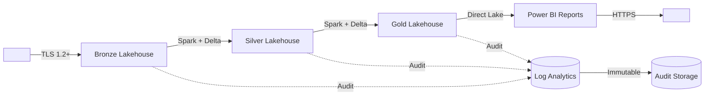
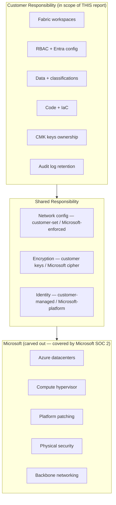
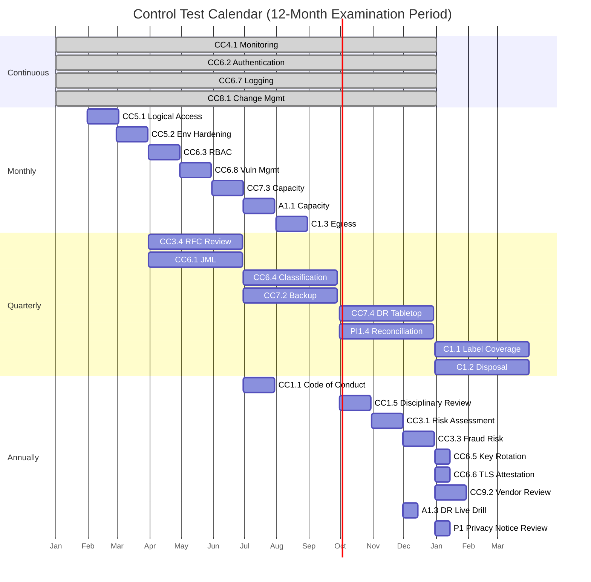

# SOC 2 Control Matrix Template — Microsoft Fabric Workloads

<div align="center" markdown>

**Copy-Paste-Ready Control Matrix for SOC 2 Type II Examination**


</div>

---

> ## Disclaimer
>
> **This is a TEMPLATE.** It contains placeholder fields (e.g., `<COMPANY_NAME>`, `<OWNER_NAME>`, `<EVIDENCE_PATH>`) that you must replace with values specific to your environment. The control statements, implementations, and evidence patterns described here are based on Microsoft Fabric platform capabilities current as of the **Last Updated** date and are intended as a starting point.
>
> **This template is NOT:**
>
> - A substitute for engaging a qualified CPA firm to perform your SOC 2 examination
> - Legal advice or audit advice
> - A guarantee of audit success
> - A pre-approved control set — your auditor must agree with each control
>
> **You MUST:**
>
> 1. Walk this matrix through with your auditor *before* the examination period begins
> 2. Customize control statements, implementations, and evidence locations to your specific environment
> 3. Confirm scope (which TSCs apply) with your auditor
> 4. Maintain this document as a living artifact throughout the examination period
>
> The anchor source-of-truth for the underlying mapping is [`docs/best-practices/security/soc2-type2-readiness.md`](../best-practices/security/soc2-type2-readiness.md). This template is the customer-facing operationalization of that mapping.

---

## How to Use This Template

This template is structured as a five-step adoption process. Do **not** hand the template as-is to your auditor — customize each section first.

### Step 1: Confirm Scope (Which TSCs Apply to Your Audit)

Mandatory: **Security (Common Criteria)** is required in every SOC 2.

Optional: select based on commitments you make to customers and the nature of your service.

- [ ] **Security (Common Criteria)** — REQUIRED
- [ ] **Availability** — select if you have uptime SLAs
- [ ] **Processing Integrity** — select if you transform/compute on customer data
- [ ] **Confidentiality** — select if you handle customer-confidential data
- [ ] **Privacy** — select if you collect/process end-user PII

**Action:** Strike through (or delete) sections corresponding to TSCs not in scope. Document the rationale for excluding any TSC.

### Step 2: Customize Control Owners

Replace every `<OWNER_NAME>` and `<OWNER_ROLE>` placeholder with the named individual or role accountable for that control. Owners must be:

- A specific named human or named role (not a team, not "TBD")
- Reachable during examination period
- Authorized to sign off on control evidence
- Trained on the control they own

**Action:** Convene a 60-minute working session with department heads to assign owners. Document in [Section 12 — Sign-Off](#section-12--sign-off).

### Step 3: Update Evidence Locations

Replace every `<EVIDENCE_PATH>` and `<EVIDENCE_QUERY>` placeholder with:

- A concrete file path, URL, or storage container reference
- Or a saved KQL query name with link to its workspace
- Or a reference to a runbook/SOP that produces evidence on demand

**Action:** Confirm each evidence location is:

- [ ] Accessible to the auditor (read-only) during fieldwork
- [ ] Stored on **immutable** storage (Azure Blob immutability policy or WORM)
- [ ] Retained for at least 12 months past examination period (24 months total)
- [ ] Tamper-evident (logged access; no admin can delete)

### Step 4: Walk the Matrix With Your Auditor BEFORE the Examination Period

This is the single most-important risk-mitigation step. Schedule a 2-3 hour walkthrough with your CPA firm to confirm:

- [ ] Each control statement is acceptable as-written
- [ ] Each implementation is judged sufficient
- [ ] Each evidence pattern will be acceptable for testing
- [ ] Test frequencies match auditor expectations
- [ ] Carve-out approach is acceptable
- [ ] Any controls that need rewording before period start

> **WARNING:** If you change controls *during* the examination period, the auditor may "reset the clock." Lock controls before period start.

### Step 5: Maintain Monthly During the Period

The matrix is a living document. Update it:

- [ ] Monthly — refresh evidence pointers, capture any drift
- [ ] After every significant change — re-walk with auditor if material
- [ ] Quarterly — formal control owner attestation (sign Section 12)
- [ ] At incidents — log to Exception Register (Section 9)

---

## Cover Page

> # SOC 2 Type II Control Matrix
>
> | Field | Value |
> |---|---|
> | **Company** | `<COMPANY_NAME>` |
> | **System / Service Name** | `<SYSTEM_NAME>` |
> | **Examination Period** | `<START_DATE>` to `<END_DATE>` |
> | **In-Scope TSCs** | ☐ Security ☐ Availability ☐ Processing Integrity ☐ Confidentiality ☐ Privacy |
> | **Auditor (CPA Firm)** | `<AUDITOR_FIRM_NAME>` |
> | **Lead Engagement Partner** | `<AUDITOR_PARTNER_NAME>` |
> | **Service Org Contact** | `<PRIMARY_CONTACT_NAME>` |
> | **Document Version** | `<VERSION>` |
> | **Last Updated** | `<YYYY-MM-DD>` |
> | **Classification** | 🔒 CONFIDENTIAL — AUDITOR EYES ONLY |

| Field | Value |
|-------|-------|
| Company | `<COMPANY_NAME>` |
| Legal entity | `<LEGAL_ENTITY_NAME>` |
| System / service name | `<SYSTEM_NAME>` |
| Examination period | `<START_DATE>` to `<END_DATE>` (typical: 6-12 months) |
| Type | [ ] SOC 2 Type I (point-in-time) [ ] SOC 2 Type II (period) |
| In-scope TSCs | [ ] Security [ ] Availability [ ] Processing Integrity [ ] Confidentiality [ ] Privacy |
| Auditor (CPA firm) | `<AUDITOR_FIRM_NAME>` |
| Engagement partner | `<AUDITOR_PARTNER_NAME>` |
| Primary service-org contact | `<PRIMARY_CONTACT_NAME>` (`<PRIMARY_CONTACT_EMAIL>`) |
| Backup contact | `<BACKUP_CONTACT_NAME>` |
| Document version | `<VERSION>` |
| Last updated | `<YYYY-MM-DD>` |
| Classification | CONFIDENTIAL — AUDITOR ACCESS UNDER NDA |
| Storage location | `<EVIDENCE_PATH>` (e.g., immutable Azure Blob container) |

---

## Section 1 — System Boundary

The system boundary defines exactly what the auditor will examine. **Be conservative** — including more in scope means more controls to evidence.

### 1.1 In-Scope Components

Replace the example rows with your actual components.

| Component | Type | Purpose | Hosts Customer Data? |
|-----------|------|---------|----------------------|
| `<FABRIC_CAPACITY_NAME>` | Microsoft Fabric capacity (F-SKU) | Compute substrate for analytics workloads | Yes |
| `<WORKSPACE_PROD>` | Fabric workspace (production) | Production data processing | Yes |
| `<WORKSPACE_STAGING>` | Fabric workspace (staging) | Pre-production validation | No (synthetic only) |
| `<LAKEHOUSE_BRONZE>` | OneLake lakehouse | Raw ingest layer | Yes |
| `<LAKEHOUSE_SILVER>` | OneLake lakehouse | Cleansed/conformed layer | Yes |
| `<LAKEHOUSE_GOLD>` | OneLake lakehouse | Aggregated/serving layer | Yes |
| `<EVENTHOUSE_NAME>` | KQL Eventhouse (RTI) | Streaming analytics | Yes |
| `<KEYVAULT_NAME>` | Azure Key Vault | CMK + secrets | No (keys only) |
| `<LOG_ANALYTICS_WS>` | Log Analytics workspace | Audit + monitoring logs | No (telemetry only) |
| `<STORAGE_AUDIT>` | Azure Storage (immutable) | Audit evidence retention | No (evidence only) |
| `<CICD_REPO>` | GitHub repository | Source-controlled IaC + Fabric items | No |
| `<KEYVAULT_NAME>` | Azure Key Vault | CMK keys, service-principal secrets | No |
| `<ENTRA_TENANT>` | Microsoft Entra ID tenant | Identity provider | No (identities only) |

### 1.2 Out-of-Scope Components (Carved Out)

| Component | Why Out of Scope | Treatment |
|-----------|------------------|-----------|
| Microsoft Azure infrastructure | Subservice organization | **Carve-out method** — see [Section 8](#section-8--carve-out-microsoft-as-subservice-organization) |
| Microsoft Fabric platform internals | Subservice organization | Carve-out — Microsoft's own SOC 2 report covers |
| `<DEVELOPER_LAPTOPS>` | Endpoint controls handled by IT (separate audit) | Inclusive — see endpoint policy `<POLICY_PATH>` |
| `<DEV_WORKSPACE>` | Development environment, no production data | Logical separation; data tagging enforced |
| `<UNRELATED_SYSTEM_X>` | Different service line | Not part of this report's scope |

### 1.3 Data Classification Scheme

Replace with your organization's scheme. Auditor will test that classified data has appropriate controls.

| Class | Label | Examples | Required Controls |
|-------|-------|----------|-------------------|
| **L4** | Restricted / Regulated | PII, PHI, payment data | CMK + OneLake row-level security + audit log + 18-month retention |
| **L3** | Confidential | Customer-specific business data | CMK + workspace RBAC + audit log + 12-month retention |
| **L2** | Internal | Aggregate metrics, internal reports | Workspace RBAC + audit log |
| **L1** | Public | Marketing content, public APIs | Standard access controls |

**Classification owner:** `<DATA_PROTECTION_OFFICER_NAME>`
**Labels enforced via:** Microsoft Purview sensitivity labels
**Label coverage SLA:** 100% of L3/L4 data must carry sensitivity labels (audited quarterly)

### 1.4 Data Flow Boundary



---

## Section 2 — Common Criteria (CC) Matrix

The Common Criteria (CC1.1 through CC9.2) are the foundation of every SOC 2 report. They map to the **Security** TSC.

> **Column legend:**
> - **Criterion ID** — AICPA TSC reference
> - **Description** — paraphrase of AICPA criterion text
> - **Control Statement** — your organization's commitment (customizable)
> - **Implementation** — concrete Fabric/Azure controls
> - **Owner** — named individual or role
> - **Evidence** — query, file path, or system reference
> - **Test Frequency** — how often the auditor (or you) tests
> - **Exception Notes** — track deviations or known gaps

### CC1 — Control Environment

| Criterion ID | Description | Control Statement | Implementation | Owner | Evidence | Test Frequency | Exception Notes |
|--------------|-------------|-------------------|----------------|-------|----------|----------------|-----------------|
| **CC1.1** | Demonstrates commitment to integrity and ethical values | `<COMPANY_NAME>` maintains a Code of Conduct that all employees acknowledge annually. | HR-managed policy; annual attestation tracked in `<HR_SYSTEM>` | `<CHRO_NAME>` (CHRO) | `<EVIDENCE_PATH>/code-of-conduct-attestations-FY<YYYY>.csv` | Annually | `<NONE_OR_ID>` |
| **CC1.2** | Independent oversight (board/audit committee) | The Board's `<COMMITTEE_NAME>` provides independent oversight of internal controls. | Board charter + quarterly minutes | `<GENERAL_COUNSEL_NAME>` | `<EVIDENCE_PATH>/board-minutes-Q<N>-<YYYY>.pdf` | Quarterly | |
| **CC1.3** | Establishes structures, reporting lines, authorities | Org chart + delegations of authority documented. | `<HR_SYSTEM>` org chart + signed DOA matrix | `<COO_NAME>` | `<EVIDENCE_PATH>/org-chart-<YYYY-MM>.pdf` | Annually | |
| **CC1.4** | Demonstrates commitment to competence | Job descriptions, performance management, training. | Annual performance reviews + training records | `<CHRO_NAME>` | `<HR_SYSTEM>/training-records` | Annually | |
| **CC1.5** | Holds individuals accountable | Disciplinary policy, performance consequences. | HR disciplinary action log | `<CHRO_NAME>` | `<HR_SYSTEM>/disciplinary-log` (sampled) | Annually | |

### CC2 — Communication & Information

| Criterion ID | Description | Control Statement | Implementation | Owner | Evidence | Test Frequency | Exception Notes |
|--------------|-------------|-------------------|----------------|-------|----------|----------------|-----------------|
| **CC2.1** | Internal communication of objectives & responsibilities | Security policies, SOPs, runbooks published in `<DOC_PORTAL>`. | `docs/best-practices/security/` + `docs/runbooks/` | `<CISO_NAME>` | `<EVIDENCE_PATH>/policy-acknowledgement-log.csv` | Annually | |
| **CC2.2** | External communication | Customer-facing security commitments published. | Trust Center page + DPA + sub-processor list | `<LEGAL_LEAD_NAME>` | `<EVIDENCE_PATH>/trust-center-snapshots/` | Continuous | |
| **CC2.3** | Quality information for decisions | Dashboards & reports for control owners. | Power BI control dashboards in `<WORKSPACE_PROD>` | `<DATA_PLATFORM_LEAD>` | `<PBI_REPORT_URL>` | Continuous | |

### CC3 — Risk Assessment

| Criterion ID | Description | Control Statement | Implementation | Owner | Evidence | Test Frequency | Exception Notes |
|--------------|-------------|-------------------|----------------|-------|----------|----------------|-----------------|
| **CC3.1** | Specifies objectives | Security objectives defined, reviewed annually. | Risk Register + STRIDE threat model (`docs/best-practices/security/threat-model-stride.md`) | `<CISO_NAME>` | `<EVIDENCE_PATH>/risk-register-<YYYY>.xlsx` | Annually | |
| **CC3.2** | Identifies risks | Threat-modeling exercises per major release. | STRIDE workshops; output to risk register | `<SEC_ARCH_NAME>` | `<EVIDENCE_PATH>/threat-models/` | Per major release | |
| **CC3.3** | Considers fraud risk | Fraud-risk assessment includes insider threat. | Internal audit fraud risk assessment | `<INTERNAL_AUDIT_LEAD>` | `<EVIDENCE_PATH>/fraud-risk-<YYYY>.pdf` | Annually | |
| **CC3.4** | Identifies & assesses changes | Change-management RFC process surfaces risk. | RFC template + CAB review | `<CAB_CHAIR_NAME>` | GitHub PRs + `<CAB_TICKET_SYSTEM>` | Continuous | |

### CC4 — Monitoring Activities

| Criterion ID | Description | Control Statement | Implementation | Owner | Evidence | Test Frequency | Exception Notes |
|--------------|-------------|-------------------|----------------|-------|----------|----------------|-----------------|
| **CC4.1** | Selects, develops, performs ongoing evaluations | Continuous monitoring via Workspace Monitoring + Sentinel. | KQL alerts + Action Groups; Sentinel analytics rules | `<SOC_LEAD_NAME>` | `<LAW_NAME>/SecurityAlert` table; alert export `<EVIDENCE_PATH>/alerts-<YYYY-MM>.csv` | Continuous | |
| **CC4.2** | Communicates deficiencies | SOC playbook escalates findings to leadership. | Incident response runbook (`docs/runbooks/incident-response-template.md`) | `<INCIDENT_COMMANDER>` | `<EVIDENCE_PATH>/postmortems/` | Per incident | |

### CC5 — Control Activities (Logical Access)

| Criterion ID | Description | Control Statement | Implementation | Owner | Evidence | Test Frequency | Exception Notes |
|--------------|-------------|-------------------|----------------|-------|----------|----------------|-----------------|
| **CC5.1** | Logical & physical access | All access to Fabric requires Entra ID + MFA + device compliance via Conditional Access. | Workspace Identity for service-to-service; Entra Conditional Access for users | `<IAM_LEAD_NAME>` | `<EVIDENCE_PATH>/conditional-access-policies-<YYYY-MM>.json`; Entra `SigninLogs` | Monthly | |
| **CC5.2** | Environment hardening | Network controls + encryption applied to all production data planes. | Private Endpoints + IP firewall + OAP + CMK + TLS 1.2+ | `<SEC_ARCH_NAME>` | `<EVIDENCE_PATH>/network-config-<YYYY-MM>.json` (Bicep state) | Monthly | |
| **CC5.3** | Acquired components | Software supply chain risk managed via SBOM, vuln scans, signed artifacts. | `docs/best-practices/security/supply-chain-security.md` | `<SEC_ARCH_NAME>` | `<EVIDENCE_PATH>/sbom/<RELEASE_TAG>/` | Per release | |

### CC6 — Logical & Physical Access Controls (Detailed)

| Criterion ID | Description | Control Statement | Implementation | Owner | Evidence | Test Frequency | Exception Notes |
|--------------|-------------|-------------------|----------------|-------|----------|----------------|-----------------|
| **CC6.1** | Restricts logical access — provision/deprovision | Joiner-Mover-Leaver process auto-provisions and revokes. | Entra ID lifecycle workflows + automation | `<IAM_LEAD_NAME>` | `<EVIDENCE_PATH>/jml-records-<YYYY-Q>.csv` | Quarterly | |
| **CC6.2** | Authentication | MFA + risk-based Conditional Access required for all Fabric access. | Entra Conditional Access policies | `<IAM_LEAD_NAME>` | KQL: `SigninLogs | where AuthenticationRequirement == "multiFactorAuthentication"` | Continuous | |
| **CC6.3** | Authorization (least privilege, RBAC) | Workspace and OneLake roles assigned by least privilege. | Fabric workspace roles + OneLake security roles | `<DATA_PLATFORM_LEAD>` | `<EVIDENCE_PATH>/iam-snapshot-<YYYY-MM>.json` | Monthly | |
| **CC6.4** | Data classification | Sensitivity labels applied per classification scheme. | Microsoft Purview sensitivity labels | `<DATA_PROTECTION_OFFICER_NAME>` | Purview compliance report `<PURVIEW_URL>` | Quarterly | |
| **CC6.5** | Encryption at rest | All production data encrypted with customer-managed keys. | Fabric CMK + Azure Key Vault | `<KEY_CUSTODIAN_NAME>` | `<EVIDENCE_PATH>/cmk-rotation-log-<YYYY>.csv`; Key Vault `AzureDiagnostics` | Annually (rotation), continuous (config) | |
| **CC6.6** | Encryption in transit | TLS 1.2+ enforced platform-wide. | Microsoft-managed (validated by Network Security doc) | `<SEC_ARCH_NAME>` | `<EVIDENCE_PATH>/tls-attestation-<YYYY>.pdf` | Annually | |
| **CC6.7** | Logging & monitoring | All control-plane and data-plane events logged for ≥12 months. | Workspace Monitoring + Log Analytics + Purview | `<SOC_LEAD_NAME>` | KQL evidence pack `<EVIDENCE_PATH>/cc6.7-monthly/` | Monthly | |
| **CC6.8** | Vulnerability management | Microsoft-managed for Fabric runtime; customer-managed for code. | Defender for Cloud + Dependabot + GHAS | `<SEC_OPS_NAME>` | `<EVIDENCE_PATH>/vuln-scan-<YYYY-MM>.csv` | Monthly | |

### CC7 — System Operations

| Criterion ID | Description | Control Statement | Implementation | Owner | Evidence | Test Frequency | Exception Notes |
|--------------|-------------|-------------------|----------------|-------|----------|----------------|-----------------|
| **CC7.1** | System operations — change management | Production changes require approved RFC + automated deployment. | fabric-cicd + GitHub Actions + branch protection | `<RELEASE_MGR_NAME>` | GitHub PR list + Action runs | Continuous | |
| **CC7.2** | Backups & recovery | RPO ≤ `<RPO_VALUE>`; RTO ≤ `<RTO_VALUE>`. | OneLake geo-redundancy + cross-region replication | `<SRE_LEAD_NAME>` | `<EVIDENCE_PATH>/backup-test-<YYYY-Q>.pdf` | Quarterly | |
| **CC7.3** | Capacity planning | Capacity reviewed monthly against utilization SLOs. | Capacity dashboard + alerts | `<CAPACITY_OWNER_NAME>` | `<EVIDENCE_PATH>/capacity-review-<YYYY-MM>.pdf` | Monthly | |
| **CC7.4** | Disaster recovery | DR plan executed via tabletop quarterly + live drill annually. | Multi-region failover runbook | `<SRE_LEAD_NAME>` | `<EVIDENCE_PATH>/dr-drill-<YYYY-Q>.pdf` | Quarterly (tabletop) / Annually (live) | |
| **CC7.5** | Incident response | IR runbook + 24x7 on-call coverage; postmortem within 5 business days. | `docs/runbooks/incident-response-template.md` + on-call handbook | `<INCIDENT_COMMANDER>` | `<EVIDENCE_PATH>/postmortems/` | Per incident | |

### CC8 — Change Management

| Criterion ID | Description | Control Statement | Implementation | Owner | Evidence | Test Frequency | Exception Notes |
|--------------|-------------|-------------------|----------------|-------|----------|----------------|-----------------|
| **CC8.1** | Authorizes, designs, develops, configures, documents, tests, approves, implements changes | All production changes require: PR review + 1+ approver + automated tests + deployment gate. | Branch protection + fabric-cicd + Deployment Pipelines | `<RELEASE_MGR_NAME>` | `<EVIDENCE_PATH>/change-log-<YYYY-Q>.csv` (PRs + approvals + deploy artifacts) | Quarterly | |

### CC9 — Risk Mitigation

| Criterion ID | Description | Control Statement | Implementation | Owner | Evidence | Test Frequency | Exception Notes |
|--------------|-------------|-------------------|----------------|-------|----------|----------------|-----------------|
| **CC9.1** | Identifies, selects, develops risk mitigation activities | Every identified risk has a mitigation in the Risk Register. | Risk Register + control matrix mapping | `<CISO_NAME>` | `<EVIDENCE_PATH>/risk-register-<YYYY>.xlsx` | Quarterly review | |
| **CC9.2** | Vendor & business partner management | Sub-processors contractually bound; DPA with each. | Sub-processor list + DPAs in `<CONTRACT_REPO>` | `<VENDOR_MGMT_NAME>` | `<EVIDENCE_PATH>/sub-processors-<YYYY>.pdf` + DPA register | Annually | |

---

## Section 3 — Security TSC Matrix

> **Note:** The Security TSC is the same as the Common Criteria — see [Section 2](#section-2--common-criteria-cc-matrix). No additional rows. If your auditor asks for a separate Security matrix, copy CC5 + CC6 + CC7 + CC8 into a new sheet labeled "Security TSC."

---

## Section 4 — Availability TSC Matrix

Required only if **Availability** is in scope.

| Criterion ID | Description | Control Statement | Implementation | Owner | Evidence | Test Frequency | Exception Notes |
|--------------|-------------|-------------------|----------------|-------|----------|----------------|-----------------|
| **A1.1** | Maintains, monitors, evaluates current and projected capacity | Capacity utilization tracked against SLO; autoscale rules in place. | Action Groups + Logic App scale-up | `<CAPACITY_OWNER_NAME>` | `<EVIDENCE_PATH>/capacity-review-<YYYY-MM>.pdf`; KQL: `FabricMetrics | summarize avg(CUUtilization) by bin(TimeGenerated, 1d)` | Monthly | |
| **A1.2** | Authorizes, designs, develops, implements, operates environmental protections | Environmental controls (power, HVAC, fire) — Microsoft-managed. | **Carve-out** — Microsoft Azure SOC 2 | N/A — Microsoft | Microsoft SOC 2 report on Service Trust Portal | Per Microsoft cadence | |
| **A1.3** | Tests recovery plan procedures | DR drills exercised at least annually with full failover; quarterly tabletops. | Multi-region failover runbook | `<SRE_LEAD_NAME>` | `<EVIDENCE_PATH>/dr-drill-<YYYY>.pdf` | Annually (live) / Quarterly (tabletop) | |

---

## Section 5 — Processing Integrity TSC Matrix

Required only if **Processing Integrity** is in scope.

| Criterion ID | Description | Control Statement | Implementation | Owner | Evidence | Test Frequency | Exception Notes |
|--------------|-------------|-------------------|----------------|-------|----------|----------------|-----------------|
| **PI1.1** | Obtains/generates, uses, communicates relevant quality information about processing objectives | Data contracts at producer-consumer boundaries; SLAs documented. | `docs/best-practices/data-management/data-contracts.md` | `<DATA_PLATFORM_LEAD>` | `<EVIDENCE_PATH>/data-contracts/` | Per contract change | |
| **PI1.2** | Inputs are complete and accurate | Schema validation at Bronze; Great Expectations checkpoints. | GE suites in `validation/` | `<DATA_QUALITY_LEAD>` | `<EVIDENCE_PATH>/ge-checkpoints-<YYYY-MM>/` | Per pipeline run; monthly summary | |
| **PI1.3** | Processing is timely | Freshness SLO ≤ `<FRESHNESS_TARGET>`. | SLO/SLI doc + alerting | `<DATA_PLATFORM_LEAD>` | `<EVIDENCE_PATH>/freshness-slo-<YYYY-Q>.pdf` | Monthly | |
| **PI1.4** | System processing is correct | Lineage + reconciliation between layers (Bronze→Silver→Gold). | Purview lineage + reconciliation queries | `<DATA_PLATFORM_LEAD>` | `<EVIDENCE_PATH>/reconciliation-<YYYY-Q>.csv` | Quarterly | |
| **PI1.5** | Outputs are complete, accurate, distributed appropriately | Output validation in CI; downstream attestation. | E2E tests + customer attestation | `<DATA_PLATFORM_LEAD>` | `<EVIDENCE_PATH>/output-validation-<YYYY-Q>/` | Quarterly | |

---

## Section 6 — Confidentiality TSC Matrix

Required only if **Confidentiality** is in scope.

| Criterion ID | Description | Control Statement | Implementation | Owner | Evidence | Test Frequency | Exception Notes |
|--------------|-------------|-------------------|----------------|-------|----------|----------------|-----------------|
| **C1.1** | Identifies and maintains confidential information | All L3/L4 data labeled with Purview sensitivity labels. | Purview labels + auto-labeling rules | `<DATA_PROTECTION_OFFICER_NAME>` | `<EVIDENCE_PATH>/label-coverage-<YYYY-Q>.pdf` | Quarterly | |
| **C1.2** | Disposes confidential information to meet objectives | Retention policies enforce deletion; Delta VACUUM removes orphaned files. | Delta retention + lifecycle rules | `<DATA_PLATFORM_LEAD>` | `<EVIDENCE_PATH>/disposal-attestation-<YYYY-Q>.pdf` | Quarterly | |
| **C1.3** | Protects confidential information during transmission, movement, removal | TLS 1.2+ enforced; data egress restricted via OAP. | OAP allow-list + TLS enforcement | `<SEC_ARCH_NAME>` | `<EVIDENCE_PATH>/oap-config-<YYYY-MM>.json` | Monthly | |

---

## Section 7 — Privacy TSC Matrix

Required only if **Privacy** is in scope. Pairs with [GDPR](../best-practices/security/gdpr-right-to-deletion.md) and [CCPA](../best-practices/security/ccpa-privacy-rights.md) docs.

| Criterion ID | Description | Control Statement | Implementation | Owner | Evidence | Test Frequency | Exception Notes |
|--------------|-------------|-------------------|----------------|-------|----------|----------------|-----------------|
| **P1** | Notice — privacy notice provided to data subjects | Public privacy notice published, version-controlled. | Website privacy notice + change log | `<PRIVACY_OFFICER_NAME>` | `<EVIDENCE_PATH>/privacy-notice-<VERSION>.pdf` | Per update | |
| **P2** | Choice and consent | Consent capture for all PII collection; revocable. | Consent service + audit log | `<PRIVACY_OFFICER_NAME>` | `<EVIDENCE_PATH>/consent-records-<YYYY-Q>.csv` | Quarterly sample | |
| **P3** | Collection — limited to disclosed purposes | Schema reviewed; only declared fields collected. | Data contract reviews + schema diff | `<DATA_PLATFORM_LEAD>` | Schema diff log `<EVIDENCE_PATH>/schema-changes-<YYYY-Q>.csv` | Per schema change | |
| **P4** | Use, retention, disposal | PII used only per stated purpose; retention enforced. | Purpose-binding labels + retention policies | `<PRIVACY_OFFICER_NAME>` | `<EVIDENCE_PATH>/retention-attestation-<YYYY-Q>.pdf` | Quarterly | |
| **P5** | Access — data subject access rights | DSAR fulfilled within `<DSAR_SLA_DAYS>` days. | DSAR runbook (`docs/compliance-templates/dsar-runbook.md` — landing batch 5b) | `<PRIVACY_OFFICER_NAME>` | `<EVIDENCE_PATH>/dsar-log-<YYYY-Q>.csv` | Per DSAR; quarterly summary | |
| **P6** | Disclosure to third parties | Sub-processor list maintained; data-sharing approvals tracked. | Sub-processor list + DPAs | `<VENDOR_MGMT_NAME>` | `<EVIDENCE_PATH>/sub-processors-<YYYY>.pdf` | Annually | |
| **P7** | Security for privacy | All PII at L4 controls (CMK, audit, OneLake row-level security). | OneLake security + CMK + audit | `<DATA_PROTECTION_OFFICER_NAME>` | `<EVIDENCE_PATH>/pii-controls-<YYYY-Q>.pdf` | Quarterly | |
| **P8** | Quality — accurate, complete, relevant | Data quality framework; subject correction process. | Great Expectations + correction SOP | `<DATA_QUALITY_LEAD>` | `<EVIDENCE_PATH>/dq-<YYYY-Q>.pdf` | Quarterly | |
| **P9** | Monitoring & enforcement of privacy program | Privacy incident response; annual audit. | Subset of incident response | `<PRIVACY_OFFICER_NAME>` | `<EVIDENCE_PATH>/privacy-incidents-<YYYY>.csv` | Per incident; annual summary | |

---

## Section 8 — Carve-Out: Microsoft as Subservice Organization

### 8.1 Method

Replace `<METHOD>` with one of:

- [x] **Carve-out** — Microsoft's controls are excluded from the scope of this report. Auditor relies on Microsoft's own SOC 2 (recommended for most customers).
- [ ] **Inclusive** — Microsoft's controls are included in this report (rare; requires Microsoft cooperation).

> **Default recommendation: Carve-out.** Microsoft Azure and Microsoft Fabric are routinely accepted as subservice organizations under the carve-out method.

### 8.2 Reference to Microsoft's SOC 2 Report

Microsoft publishes SOC 2 Type II reports for Azure and Microsoft 365 (covering Fabric) on the **Microsoft Service Trust Portal**.

| Service | Report | Where to Find It |
|---------|--------|------------------|
| Azure SOC 2 Type II | Annual | https://servicetrust.microsoft.com/ViewPage/MSComplianceGuide |
| Microsoft 365 / Fabric SOC 2 Type II | Annual | https://servicetrust.microsoft.com/ViewPage/MSComplianceGuide |
| Azure SOC 1 Type II | Annual | Service Trust Portal (under NDA) |
| ISO 27001 | Annual | Service Trust Portal |

**Action:** Download the latest Microsoft SOC 2 reports and store under `<EVIDENCE_PATH>/microsoft-attestations/` for auditor reference.

### 8.3 Boundary Diagram



### 8.4 User Entity Controls (UECs) — What the Customer MUST Do

Microsoft's SOC 2 reports list "Complementary User Entity Controls" — controls Microsoft assumes the customer operates. **Failure to operate these is a finding against the customer, not Microsoft.**

| UEC ID | UEC | How `<COMPANY_NAME>` Operates It | Evidence |
|--------|-----|-----------------------------------|----------|
| **UEC-1** | Customer manages Entra tenant identities, MFA, Conditional Access | See CC5.1, CC6.1, CC6.2 | Per CC5/CC6 evidence |
| **UEC-2** | Customer owns and rotates CMK keys | See CC6.5 | `<EVIDENCE_PATH>/cmk-rotation-log-<YYYY>.csv` |
| **UEC-3** | Customer configures network controls (Private Endpoint, IP firewall, OAP) | See CC5.2 | `<EVIDENCE_PATH>/network-config-<YYYY-MM>.json` |
| **UEC-4** | Customer applies sensitivity labels to its data | See CC6.4, C1.1 | Purview compliance report |
| **UEC-5** | Customer manages workspace RBAC | See CC6.3 | `<EVIDENCE_PATH>/iam-snapshot-<YYYY-MM>.json` |
| **UEC-6** | Customer retains audit logs ≥12 months | See CC6.7 | Log Analytics retention config |
| **UEC-7** | Customer reviews access quarterly | See CC6.1 | `<EVIDENCE_PATH>/access-review-<YYYY-Q>.csv` |
| **UEC-8** | Customer tests DR | See CC7.4, A1.3 | `<EVIDENCE_PATH>/dr-drill-<YYYY>.pdf` |
| **UEC-9** | Customer responds to security incidents | See CC7.5 | `<EVIDENCE_PATH>/postmortems/` |
| **UEC-10** | Customer manages its own data classification & retention | See CC6.4, C1.2 | Per quarter retention attestation |

> **Action:** For each UEC, confirm with your auditor that the mapped CC criterion satisfies the UEC. Disagreements here are a top-3 source of audit findings.

---

## Section 9 — Exception Register

Track every deviation from the documented control. **Auditors will find them anyway** — disclosing first builds trust and lets you provide root cause + remediation context.

### 9.1 Exception Register Schema

| Field | Description |
|-------|-------------|
| Exception ID | Sequential, e.g., `EXC-2026-001` |
| Date Identified | When discovered |
| Criterion Affected | e.g., `CC6.7` |
| Description | What deviated from the control |
| Root Cause | Why it happened |
| Impact Assessment | High / Medium / Low + reasoning |
| Remediation Plan | Specific steps + due date |
| Owner | Named individual |
| Status | Open / In Progress / Remediated / Accepted |
| Auditor Communicated | Y/N + date |
| Closure Date | When fully remediated |

### 9.2 Exception Register Template

| Exception ID | Date Identified | Criterion | Description | Root Cause | Impact | Remediation Plan | Due Date | Owner | Status | Auditor Notified | Closure Date |
|--------------|-----------------|-----------|-------------|------------|--------|------------------|----------|-------|--------|------------------|--------------|
| `EXC-<YYYY>-001` | `<YYYY-MM-DD>` | `<CC?.?>` | `<DESCRIPTION>` | `<ROOT_CAUSE>` | `<H/M/L>` | `<PLAN>` | `<YYYY-MM-DD>` | `<OWNER_NAME>` | Open | [ ] | |
| `EXC-<YYYY>-002` | | | | | | | | | | [ ] | |
| `EXC-<YYYY>-003` | | | | | | | | | | [ ] | |

### 9.3 Worked Example (Replace With Real Exceptions)

| Exception ID | Date Identified | Criterion | Description | Root Cause | Impact | Remediation Plan | Due Date | Owner | Status | Auditor Notified | Closure Date |
|--------------|-----------------|-----------|-------------|------------|--------|------------------|----------|-------|--------|------------------|--------------|
| `EXC-<YYYY>-EX1` | `<YYYY-MM-DD>` | CC6.7 | Log Analytics retention dropped to 30 days for 4 days due to misapplied Bicep | Bicep PR removed `retentionInDays: 365` | Low — no security event during gap | (a) Restore retention; (b) add Bicep policy guardrail blocking <365 | `<YYYY-MM-DD>` | `<SEC_OPS_NAME>` | Remediated | [x] `<YYYY-MM-DD>` | `<YYYY-MM-DD>` |

---

## Section 10 — Control Test Calendar

Sample 12-month control test cadence. Customize start month for your examination period.



### 10.1 Test Frequency Matrix (Tabular)

| Frequency | Criteria |
|-----------|----------|
| **Continuous** | CC4.1, CC6.2, CC6.7, CC8.1 |
| **Monthly** | CC5.1, CC5.2, CC6.3, CC6.8, CC7.3, A1.1, C1.3 |
| **Quarterly** | CC3.4, CC6.1, CC6.4, CC7.2, CC7.4 (tabletop), PI1.4, C1.1, C1.2, P2, P5 |
| **Annually** | CC1.1, CC1.5, CC3.1, CC3.3, CC6.5, CC6.6, CC9.2, A1.3 (live), P1 |
| **Per event** | CC2.2, CC3.2, CC4.2, CC7.5, P3, P9 |
| **Per release** | CC5.3, CC3.2 |

---

## Section 11 — Evidence Index

Every evidence reference in the matrix MUST resolve to a physical or digital location. Maintain this index.

### 11.1 Storage Requirements

All evidence MUST be stored on:

- [ ] **Immutable storage** (Azure Blob immutability policy, WORM, or equivalent)
- [ ] **Encrypted at rest** (CMK preferred; platform key acceptable)
- [ ] **Tamper-evident** (write logs; admin actions audited)
- [ ] **Retained for ≥ 24 months** (12 months examination period + 12 months post)
- [ ] **Auditor-accessible** (read-only via short-lived SAS or Entra group membership)

> See [`docs/best-practices/security/audit-trail-immutability.md`](../best-practices/security/audit-trail-immutability.md) for tamper-evident workflow patterns.

### 11.2 Evidence Index Table

| Evidence Reference | Type | Physical/Digital Location | Producer (System or Person) | Retention | Retrieval Procedure |
|--------------------|------|----------------------------|------------------------------|-----------|---------------------|
| `<EVIDENCE_PATH>/code-of-conduct-attestations-FY<YYYY>.csv` | HR record | `<HR_SYSTEM>` export | HRIS | 7 years | HR generates on request |
| `<EVIDENCE_PATH>/risk-register-<YYYY>.xlsx` | Document | Confluence + immutable blob | CISO office | 7 years | Confluence export |
| `<EVIDENCE_PATH>/conditional-access-policies-<YYYY-MM>.json` | Config snapshot | Azure Storage immutable container | Automated daily script (see Appendix C) | 24 months | Storage Browser; SAS link |
| `<EVIDENCE_PATH>/network-config-<YYYY-MM>.json` | Config snapshot | Azure Storage immutable container | Automated Bicep state export | 24 months | Storage Browser |
| `<EVIDENCE_PATH>/iam-snapshot-<YYYY-MM>.json` | Config snapshot | Azure Storage immutable container | Automated daily Fabric API call | 24 months | Storage Browser |
| `<EVIDENCE_PATH>/cmk-rotation-log-<YYYY>.csv` | Audit log | Azure Storage immutable container | Key Vault diagnostic export | 24 months | KQL query |
| `<EVIDENCE_PATH>/cc6.7-monthly/` | Monthly evidence pack | Azure Storage immutable container | Automated KQL evidence generator | 24 months | Storage Browser |
| `<EVIDENCE_PATH>/jml-records-<YYYY-Q>.csv` | HR + IAM record | HR system + Entra audit log join | Quarterly automation | 7 years | Quarterly export |
| `<EVIDENCE_PATH>/dr-drill-<YYYY>.pdf` | Drill report | SharePoint + immutable blob | SRE team | 7 years | SharePoint link |
| `<EVIDENCE_PATH>/postmortems/` | Incident docs | Confluence + immutable blob | Incident commander | 7 years | Confluence label search |
| `<EVIDENCE_PATH>/sub-processors-<YYYY>.pdf` | Vendor list | Vendor-management system | Vendor management | 7 years | System export |
| `<EVIDENCE_PATH>/microsoft-attestations/` | Vendor SOC 2 reports | Service Trust Portal download | Microsoft | Per Microsoft cadence | Service Trust Portal |
| `<EVIDENCE_PATH>/ge-checkpoints-<YYYY-MM>/` | DQ test results | Great Expectations data docs + immutable blob | GE checkpoint runs | 24 months | GE data docs link |
| `<EVIDENCE_PATH>/sbom/<RELEASE_TAG>/` | Software BOM | GitHub release artifact + Azure Storage | CI pipeline | 24 months | GitHub release |
| `<EVIDENCE_PATH>/access-review-<YYYY-Q>.csv` | Access review | Entra access reviews export | IAM team | 7 years | Entra portal export |

---

## Section 12 — Sign-Off

### 12.1 Control Owner Attestation (Quarterly)

Each control owner attests that, to the best of their knowledge, the control they own operated effectively for the quarter.

| Quarter | Owner Name | Owner Role | Controls Owned | Attestation | Signature | Date |
|---------|------------|------------|----------------|-------------|-----------|------|
| Q1 `<YYYY>` | `<OWNER_NAME>` | `<ROLE>` | `<CC?.?, CC?.?>` | I attest the listed controls operated effectively. | `<SIGNATURE>` | `<YYYY-MM-DD>` |
| Q2 `<YYYY>` | | | | | | |
| Q3 `<YYYY>` | | | | | | |
| Q4 `<YYYY>` | | | | | | |

### 12.2 Internal Audit Sign-Off

| Field | Value |
|-------|-------|
| Internal Audit lead | `<INTERNAL_AUDIT_LEAD>` |
| Review period | `<START_DATE>` to `<END_DATE>` |
| Findings issued | `<COUNT>` |
| Findings closed | `<COUNT>` |
| Findings open | `<COUNT>` |
| Internal audit conclusion | [ ] No exceptions [ ] Exceptions noted (see Section 9) |
| Signature | `<SIGNATURE>` |
| Date | `<YYYY-MM-DD>` |

### 12.3 Management Response (At Period End)

> **To the auditor:** Management of `<COMPANY_NAME>` has reviewed this control matrix and the evidence supporting each control. Management's response to the auditor's findings is as follows:
>
> - Total controls in scope: `<N>`
> - Controls operated as designed: `<N>`
> - Controls with exceptions (see Section 9): `<N>`
> - Management remediation commitments: `<COMMITMENTS>`
>
> Signed,
>
> ___________________________________
> `<CEO_NAME>`, Chief Executive Officer — `<YYYY-MM-DD>`
>
> ___________________________________
> `<CISO_NAME>`, Chief Information Security Officer — `<YYYY-MM-DD>`
>
> ___________________________________
> `<CFO_NAME>`, Chief Financial Officer — `<YYYY-MM-DD>`

---

## Section 13 — Glossary

| Term | Definition |
|------|------------|
| **AICPA** | American Institute of Certified Public Accountants — issuer of SOC 2 framework |
| **Carve-out** | Reporting method where a subservice organization's controls are excluded from the report's scope |
| **CC** | Common Criteria — the security-focused criteria mandatory in every SOC 2 |
| **CMK** | Customer-Managed Key — encryption key owned and rotated by the customer (vs. Microsoft platform key) |
| **DPA** | Data Processing Agreement — contract between controller and processor under GDPR |
| **DSAR** | Data Subject Access Request — privacy-rights request from an individual |
| **Examination Period** | The window of time (typically 6-12 months) over which Type II controls are tested |
| **Fabric** | Microsoft Fabric — unified analytics platform |
| **Inclusive method** | Reporting method where a subservice organization's controls are included in the report's scope |
| **IR** | Incident Response |
| **JML** | Joiner-Mover-Leaver — identity lifecycle process |
| **OAP** | Outbound Access Protection — Fabric egress firewall |
| **OneLake** | Microsoft Fabric unified data lake |
| **PIM** | Privileged Identity Management — Entra ID just-in-time elevation |
| **RPO** | Recovery Point Objective — maximum acceptable data loss |
| **RTO** | Recovery Time Objective — maximum acceptable downtime |
| **SBOM** | Software Bill of Materials |
| **SLO/SLI** | Service Level Objective / Service Level Indicator |
| **SOC 2** | Service Organization Control 2 — AICPA attestation report |
| **Subservice Organization** | A vendor whose service is part of the system in scope (e.g., Microsoft for Azure infra) |
| **TSC** | Trust Services Criteria — the five categories: Security, Availability, Processing Integrity, Confidentiality, Privacy |
| **Type I** | Point-in-time SOC 2 report (design effectiveness only) |
| **Type II** | Period-of-time SOC 2 report (design + operating effectiveness) |
| **UEC** | User Entity Control — control the customer must operate (assumed by subservice org's report) |
| **WORM** | Write-Once-Read-Many — immutable storage |
| **Workspace Identity** | Fabric managed identity for service-to-service authentication (GA 2026) |

---

## Appendix A — Sample KQL Queries for Continuous Evidence Generation

These queries produce monthly evidence packs. Save each as a saved query in your Log Analytics workspace and schedule via Logic App or Azure Function (see Appendix C).

### A.1 — CC5.1 / CC6.2 — MFA Enforcement Coverage (Monthly)

```kql
// Evidence: All sign-ins with MFA outcome
SigninLogs
| where TimeGenerated >= startofmonth(now()) and TimeGenerated < startofmonth(now()) + 30d
| extend MFASatisfied = tostring(AuthenticationDetails)
| summarize
    TotalSignins = count(),
    MFAEnforced = countif(AuthenticationRequirement == "multiFactorAuthentication"),
    MFASatisfiedCount = countif(MFASatisfied has "satisfied")
    by ResourceDisplayName, UserPrincipalName
| extend MFACoveragePct = round(100.0 * MFAEnforced / TotalSignins, 2)
| order by TotalSignins desc
```

### A.2 — CC6.1 — Privileged Access Activations (Continuous)

```kql
// Evidence: Every PIM activation in the period
AuditLogs
| where TimeGenerated >= startofmonth(now()) and TimeGenerated < startofmonth(now()) + 30d
| where ActivityDisplayName has "PIM" or ActivityDisplayName has "Add member to role"
| project TimeGenerated,
          Actor = tostring(InitiatedBy.user.userPrincipalName),
          Action = ActivityDisplayName,
          Target = tostring(TargetResources[0].displayName),
          Result,
          CorrelationId
| order by TimeGenerated asc
```

### A.3 — CC6.3 — Workspace Role Assignments Snapshot (Monthly)

```kql
// Evidence: Snapshot of who had what role at end-of-month
FabricWorkspaceRoles_CL  // assumes custom log from automated snapshot
| where TimeGenerated == endofmonth(now())
| summarize Members = make_set(UserPrincipalName) by WorkspaceId, WorkspaceName, RoleName
| order by WorkspaceName, RoleName
```

### A.4 — CC6.5 — CMK Rotation Verification (Annual)

```kql
// Evidence: Key Vault key rotation events
AzureDiagnostics
| where ResourceType == "VAULTS"
| where OperationName has "KeyRotate" or OperationName has "KeyUpdate"
| project TimeGenerated, ResourceId, OperationName, identity_claim_xms_mirid_s, ResultType
| order by TimeGenerated desc
```

### A.5 — CC6.7 — Audit Log Retention Verification (Continuous)

```kql
// Evidence: Confirm Log Analytics retention configured ≥ 365 days
// Run via Resource Graph + KQL hybrid
AzureActivity
| where OperationNameValue has "WORKSPACES/WRITE"
| project TimeGenerated, ResourceId, Properties
| extend RetentionDays = toint(parse_json(Properties).retentionInDays)
| where RetentionDays < 365
| project TimeGenerated, ResourceId, RetentionDays
// Empty result = passing
```

### A.6 — CC7.5 — Incident Response Time SLA (Per Incident)

```kql
// Evidence: Incident response within SLA
SecurityIncident
| where TimeGenerated >= startofmonth(now()) and TimeGenerated < startofmonth(now()) + 30d
| extend ResponseTimeMin = datetime_diff('minute', FirstActivityTime, CreatedTime)
| extend SLAMet = ResponseTimeMin <= 60  // adjust to your SLA
| summarize Total = count(), SLAMetCount = countif(SLAMet)
| extend SLACoveragePct = round(100.0 * SLAMetCount / Total, 2)
```

### A.7 — CC8.1 — Production Deployment Audit (Continuous)

```kql
// Evidence: Every change deployed to production with PR + approver linkage
GitHubAuditLog_CL  // assumes connector
| where TimeGenerated >= startofmonth(now())
| where Action == "deployment.created" and Environment == "production"
| join kind=leftouter (
    GitHubAuditLog_CL
    | where Action == "pull_request.merged"
) on $left.CommitSha == $right.MergeCommitSha
| project Time = TimeGenerated, PR = PRNumber, Approver = ReviewerLogin, DeployedBy = ActorLogin, CommitSha
| order by Time desc
```

### A.8 — CC9.2 — Sub-Processor Drift (Continuous)

```kql
// Evidence: Detect new outbound connections to non-approved sub-processors
FabricEgressLogs_CL  // assumes OAP custom log
| where TimeGenerated >= startofmonth(now())
| summarize Hits = count() by DestinationFqdn
| join kind=leftanti (ApprovedSubProcessors_CL | project DestinationFqdn) on DestinationFqdn
// Any rows = exceptions to investigate
```

### A.9 — A1.1 — Capacity Saturation (Monthly)

```kql
// Evidence: Capacity utilization bands across the period
FabricCapacityMetrics
| where TimeGenerated >= startofmonth(now()) and TimeGenerated < startofmonth(now()) + 30d
| summarize
    MaxCU = max(CUUtilization),
    AvgCU = avg(CUUtilization),
    P95CU = percentile(CUUtilization, 95),
    HoursOver80 = countif(CUUtilization > 80) / 60.0
    by CapacityName
| order by P95CU desc
```

### A.10 — C1.1 — Sensitivity Label Coverage (Quarterly)

```kql
// Evidence: % of L3/L4 tables carrying a sensitivity label
PurviewAuditLog_CL
| where TimeGenerated >= startofquarter(now())
| where AssetType == "Lakehouse_Table"
| summarize Labeled = countif(SensitivityLabel != ""), Total = count() by SourceSystem
| extend CoveragePct = round(100.0 * Labeled / Total, 2)
```

---

## Appendix B — Sample Bicep Snippets

Concrete IaC examples that produce evidenceable controls. Reference these from Bicep modules; auditors love deterministic config.

### B.1 — CMK on Storage Account (CC6.5)

```bicep
@description('Storage account with CMK from Key Vault')
param storageAccountName string
param keyVaultUri string
param keyName string
param userAssignedIdentityId string

resource storage 'Microsoft.Storage/storageAccounts@2023-05-01' = {
  name: storageAccountName
  location: resourceGroup().location
  sku: { name: 'Standard_GRS' }
  kind: 'StorageV2'
  identity: {
    type: 'UserAssigned'
    userAssignedIdentities: { '${userAssignedIdentityId}': {} }
  }
  properties: {
    minimumTlsVersion: 'TLS1_2'
    allowBlobPublicAccess: false
    supportsHttpsTrafficOnly: true
    encryption: {
      keySource: 'Microsoft.Keyvault'
      keyvaultproperties: {
        keyvaulturi: keyVaultUri
        keyname: keyName
      }
      identity: {
        userAssignedIdentity: userAssignedIdentityId
      }
    }
  }
}
```

### B.2 — Log Analytics Retention ≥ 365 Days (CC6.7)

```bicep
@description('Log Analytics workspace with SOC 2-compliant retention')
@minValue(365)
param retentionInDays int = 365

resource law 'Microsoft.OperationalInsights/workspaces@2022-10-01' = {
  name: '<LAW_NAME>'
  location: resourceGroup().location
  properties: {
    sku: { name: 'PerGB2018' }
    retentionInDays: retentionInDays  // >= 365 enforced via @minValue
    features: {
      enableLogAccessUsingOnlyResourcePermissions: true
    }
  }
}
```

### B.3 — Action Group for Critical Alerts (CC4.1)

```bicep
@description('Action Group routing critical alerts to on-call rotation')
param actionGroupName string
param oncallEmails array
param oncallSmsPhones array
param oncallWebhookUrl string

resource actionGroup 'Microsoft.Insights/actionGroups@2023-01-01' = {
  name: actionGroupName
  location: 'global'
  properties: {
    groupShortName: 'oncall'
    enabled: true
    emailReceivers: [for email in oncallEmails: {
      name: 'email-${replace(email, '@', '-')}'
      emailAddress: email
      useCommonAlertSchema: true
    }]
    smsReceivers: [for phone in oncallSmsPhones: {
      name: 'sms-${phone}'
      countryCode: '1'
      phoneNumber: phone
    }]
    webhookReceivers: [{
      name: 'oncall-webhook'
      serviceUri: oncallWebhookUrl
      useCommonAlertSchema: true
    }]
  }
}
```

### B.4 — Storage Account With Immutability Policy for Evidence Vault (Section 11)

```bicep
@description('Immutable container for SOC 2 audit evidence')
@minValue(2555)  // 7 years
param immutabilityDays int = 2555

resource evidenceContainer 'Microsoft.Storage/storageAccounts/blobServices/containers@2023-05-01' = {
  parent: blobService
  name: 'soc2-evidence'
  properties: {
    publicAccess: 'None'
    immutableStorageWithVersioning: {
      enabled: true
    }
  }
}

resource immutabilityPolicy 'Microsoft.Storage/storageAccounts/blobServices/containers/immutabilityPolicies@2023-05-01' = {
  parent: evidenceContainer
  name: 'default'
  properties: {
    immutabilityPeriodSinceCreationInDays: immutabilityDays
    allowProtectedAppendWrites: true
  }
}
```

---

## Appendix C — Sample Evidence Collection Automation

### C.1 — Daily Snapshot Script (Bash + Azure CLI)

Captures key configuration as JSON, uploads to immutable evidence container.

```bash
#!/usr/bin/env bash
# soc2-daily-evidence.sh
# Run via Azure Function timer trigger or scheduled GitHub Action
# Captures daily evidence snapshot per CC5.1, CC5.2, CC6.3, CC6.7

set -euo pipefail

DATE=$(date -u +%Y-%m-%d)
TENANT="<TENANT_ID>"
SUBSCRIPTION="<SUBSCRIPTION_ID>"
EVIDENCE_SA="<EVIDENCE_STORAGE_ACCOUNT>"
EVIDENCE_CONTAINER="soc2-evidence"
WORK_DIR=$(mktemp -d)

# CC5.1 / CC6.2 — Conditional Access policies
az rest --method GET \
  --uri "https://graph.microsoft.com/v1.0/identity/conditionalAccess/policies" \
  > "$WORK_DIR/conditional-access-${DATE}.json"

# CC6.3 — Workspace role assignments (Fabric REST)
az rest --method GET \
  --uri "https://api.fabric.microsoft.com/v1/admin/workspaces" \
  --headers "Authorization=Bearer $(az account get-access-token --resource https://api.fabric.microsoft.com --query accessToken -o tsv)" \
  > "$WORK_DIR/fabric-workspaces-${DATE}.json"

# CC6.5 — Key Vault keys (rotation status)
az keyvault key list --vault-name "<KEYVAULT_NAME>" \
  > "$WORK_DIR/keyvault-keys-${DATE}.json"

# CC6.7 — Log Analytics retention configuration
az monitor log-analytics workspace show \
  --resource-group "<RG_NAME>" \
  --workspace-name "<LAW_NAME>" \
  --query "{name:name, retentionInDays:retentionInDays, sku:sku.name}" \
  > "$WORK_DIR/law-retention-${DATE}.json"

# Upload to immutable evidence container
for f in "$WORK_DIR"/*.json; do
  az storage blob upload \
    --account-name "$EVIDENCE_SA" \
    --container-name "$EVIDENCE_CONTAINER" \
    --name "daily/${DATE}/$(basename "$f")" \
    --file "$f" \
    --auth-mode login
done

rm -rf "$WORK_DIR"
echo "Evidence captured for $DATE"
```

### C.2 — Monthly Evidence Pack (Python)

```python
"""soc2_monthly_evidence.py — produce monthly evidence pack per CC criterion.

Run on the first day of each month for the previous month.
Outputs go to immutable evidence container with date-partitioned path.
"""
from __future__ import annotations

import os
from datetime import date, timedelta
from pathlib import Path

import pandas as pd
from azure.identity import DefaultAzureCredential
from azure.monitor.query import LogsQueryClient
from azure.storage.blob import BlobServiceClient


CC_QUERIES = {
    "CC6.1": """
        AuditLogs
        | where TimeGenerated >= startofmonth(ago(30d))
                and TimeGenerated < startofmonth(now())
        | where ActivityDisplayName has "PIM"
        | project TimeGenerated, InitiatedBy.user.userPrincipalName,
                  TargetResources, Result
    """,
    "CC6.2": """
        SigninLogs
        | where TimeGenerated >= startofmonth(ago(30d))
                and TimeGenerated < startofmonth(now())
        | summarize Total=count(),
                    MFA=countif(AuthenticationRequirement
                                == "multiFactorAuthentication")
                    by UserPrincipalName
    """,
    "CC6.7": """
        AzureActivity
        | where TimeGenerated >= startofmonth(ago(30d))
                and TimeGenerated < startofmonth(now())
        | where OperationNameValue has "WORKSPACES/WRITE"
        | project TimeGenerated, Caller, ResourceId, ResultType
    """,
    "CC8.1": """
        // GitHub deployments + PR linkage
        GitHubAuditLog_CL
        | where TimeGenerated >= startofmonth(ago(30d))
        | where Action == "deployment.created"
                and Environment == "production"
    """,
}


def run_evidence_pack(month: date) -> Path:
    cred = DefaultAzureCredential()
    logs = LogsQueryClient(cred)
    workspace_id = os.environ["LOG_ANALYTICS_WORKSPACE_ID"]
    out = Path(f"/tmp/soc2-evidence-{month:%Y-%m}")
    out.mkdir(parents=True, exist_ok=True)

    for cc_id, query in CC_QUERIES.items():
        response = logs.query_workspace(
            workspace_id=workspace_id,
            query=query,
            timespan=timedelta(days=31),
        )
        if response.tables:
            df = pd.DataFrame(
                response.tables[0].rows,
                columns=[c.name for c in response.tables[0].columns],
            )
            df.to_csv(out / f"{cc_id}-{month:%Y-%m}.csv", index=False)

    # Upload to immutable container
    bsc = BlobServiceClient(
        account_url=os.environ["EVIDENCE_SA_URL"],
        credential=cred,
    )
    container = bsc.get_container_client("soc2-evidence")
    for f in out.iterdir():
        with f.open("rb") as fh:
            container.upload_blob(
                name=f"monthly/{month:%Y-%m}/{f.name}",
                data=fh,
                overwrite=False,  # immutable container rejects overwrite
            )
    return out


if __name__ == "__main__":
    today = date.today()
    last_month = (today.replace(day=1) - timedelta(days=1)).replace(day=1)
    run_evidence_pack(last_month)
```

### C.3 — Quarterly Access Review Export (PowerShell)

```powershell
# soc2-quarterly-access-review.ps1
# Per CC6.1 — quarterly access review evidence

param(
    [string]$Quarter = (Get-Date -Format "yyyy-Q"),
    [string]$EvidenceSA = "<EVIDENCE_STORAGE_ACCOUNT>",
    [string]$EvidenceContainer = "soc2-evidence"
)

Connect-MgGraph -Scopes "AccessReview.Read.All", "Directory.Read.All"

# Export all completed access reviews for the quarter
$reviews = Get-MgIdentityGovernanceAccessReviewDefinition |
    Where-Object { $_.Status -eq "Completed" -and
                   $_.LastModifiedDateTime -gt (Get-Date).AddMonths(-3) }

$output = @()
foreach ($r in $reviews) {
    $instances = Get-MgIdentityGovernanceAccessReviewDefinitionInstance `
        -AccessReviewScheduleDefinitionId $r.Id
    foreach ($i in $instances) {
        $decisions = Get-MgIdentityGovernanceAccessReviewDefinitionInstanceDecision `
            -AccessReviewScheduleDefinitionId $r.Id `
            -AccessReviewInstanceId $i.Id
        foreach ($d in $decisions) {
            $output += [PSCustomObject]@{
                ReviewName = $r.DisplayName
                ReviewId = $r.Id
                ReviewerPrincipal = $d.ReviewedBy.UserPrincipalName
                TargetPrincipal = $d.Principal.AdditionalProperties["userPrincipalName"]
                Decision = $d.Decision
                Justification = $d.Justification
                AppliedDateTime = $d.AppliedDateTime
            }
        }
    }
}

$csvPath = "$env:TEMP\access-review-$Quarter.csv"
$output | Export-Csv -Path $csvPath -NoTypeInformation

Connect-AzAccount -Identity
$ctx = New-AzStorageContext -StorageAccountName $EvidenceSA -UseConnectedAccount
Set-AzStorageBlobContent -File $csvPath `
    -Container $EvidenceContainer `
    -Blob "quarterly/$Quarter/access-review-$Quarter.csv" `
    -Context $ctx
```

---

## Appendix D — References

### Internal — Wave 5 Anchor & Companion Docs

- [SOC 2 Type II Readiness](../best-practices/security/soc2-type2-readiness.md) — anchor source-of-truth for this template
- [ISO 27001 Mapping](../best-practices/security/iso27001-mapping.md) — parallel control mapping
- [STRIDE Threat Model](../best-practices/security/threat-model-stride.md) — risk rationale (CC3.x)
- [Zero-Trust Blueprint](../best-practices/security/zero-trust-blueprint.md) — CC5/CC6 architecture
- [Data Exfiltration Prevention](../best-practices/security/data-exfiltration-prevention.md) — CC5.2/C1.3
- [Supply Chain Security](../best-practices/security/supply-chain-security.md) — CC5.3
- [GDPR Right to Deletion](../best-practices/security/gdpr-right-to-deletion.md) — Privacy TSC, P5
- [CCPA Privacy Rights](../best-practices/security/ccpa-privacy-rights.md) — Privacy TSC

### Internal — Operational Docs (referenced in matrix)

- [Incident Response Template](../runbooks/incident-response-template.md) — CC4.2, CC7.5
- [Multi-Region Failover Runbook](../runbooks/multi-region-failover.md) — CC7.4, A1.3
- [Tenant Migration Runbook](../runbooks/tenant-migration-dev-staging-prod.md) — CC8.1
- [SLO/SLI for Fabric](../best-practices/operations/slo-sli-fabric.md) — A1.1, PI1.3
- [Change Management](../best-practices/operations/change-management.md) — CC8.1
- [Observability Stack](../best-practices/operations/observability-stack.md) — CC4.1, CC6.7
- [On-Call Rotation Handbook](../best-practices/operations/oncall-rotation-handbook.md) — CC7.5
- [Capacity Throttling Response](../runbooks/capacity-throttling-response.md) — A1.1, CC7.3

### Internal — Data Management Docs

- [Data Contracts](../best-practices/data-management/data-contracts.md) — PI1.1, PI1.2
- [Data Quality Incident Runbook](../runbooks/data-quality-incident.md) — PI1.4

### Internal — Security Best Practices

- [Customer-Managed Keys](../best-practices/customer-managed-keys.md) — CC6.5
- [Network Security](../best-practices/network-security.md) — CC5.2, CC6.6
- [Identity & RBAC Patterns](../best-practices/identity-rbac-patterns.md) — CC5.1, CC6.1, CC6.3
- [Outbound Access Protection](../best-practices/outbound-access-protection.md) — CC5.2, C1.3
- [Data Governance Deep Dive](../best-practices/data-governance-deep-dive.md) — CC6.4, C1.1

### External — AICPA & Regulatory

- [AICPA SOC 2 Guide](https://www.aicpa-cima.com/topic/audit-assurance/audit-and-assurance-greater-than-soc-2)
- [AICPA Trust Services Criteria (2017, with 2022 revisions)](https://www.aicpa-cima.com/resources/download/trust-services-criteria)
- [AICPA Description Criteria (DC Section 200)](https://us.aicpa.org/interestareas/frc/assuranceadvisoryservices/description-criteria)

### External — Microsoft

- [Microsoft Trust Center — SOC Reports](https://servicetrust.microsoft.com/ViewPage/SOCReports)
- [Microsoft Service Trust Portal](https://servicetrust.microsoft.com/)
- [Microsoft Fabric Security Documentation](https://learn.microsoft.com/fabric/security/)
- [Microsoft Fabric Workspace Identity](https://learn.microsoft.com/fabric/security/workspace-identity)
- [Microsoft Fabric OneLake Security](https://learn.microsoft.com/fabric/onelake/security/onelake-security)
- [Microsoft Purview Sensitivity Labels](https://learn.microsoft.com/purview/sensitivity-labels)

### Companion Templates (this directory)

- [DSAR Runbook Template](./dsar-runbook.md) — Privacy TSC P5 implementation (landing batch 5b)
- [CTR Template](./ctr-template.md) — gaming-specific compliance
- [SAR Template](./sar-template.md) — gaming-specific compliance
- [W-2G Template](./w2g-template.md) — gaming-specific compliance
- [MICS Template](./mics-template.md) — gaming-specific compliance

---

[⬆️ Back to Top](#soc-2-control-matrix-template--microsoft-fabric-workloads) | [📋 Compliance Templates](./README.md) | [🏠 Home](../index.md)
