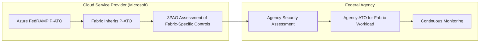

[Home](../index.md) > [Docs](../) > [Compliance](./) > FedRAMP

# ☁️ FedRAMP Compliance Mapping for Microsoft Fabric

**Federal Risk and Authorization Management Program — Fabric Authorization Path**

---

**Last Updated:** `2026-05-05` | **Version:** 1.0.0

---

## 📑 Table of Contents

- [🎯 Overview](#-overview)
- [📊 Fabric FedRAMP Authorization Status](#-fabric-fedramp-authorization-status)
- [🗺️ Control Mapping Table](#️-control-mapping-table)
- [🤝 Shared Responsibility Model](#-shared-responsibility-model)
- [⚠️ Gap Analysis and Limitations](#️-gap-analysis-and-limitations)
- [✅ Implementation Checklist](#-implementation-checklist)
- [📚 References](#-references)

---

## 🎯 Overview

The Federal Risk and Authorization Management Program (FedRAMP) provides a standardized approach to security assessment, authorization, and continuous monitoring for cloud products and services used by US federal agencies. FedRAMP is built on NIST 800-53 controls with additional requirements for cloud service providers (CSPs).

### Applicability to Fabric

FedRAMP applies to Microsoft Fabric when:

- A federal agency consumes Fabric services (directly or via system integrator)
- Fabric processes, stores, or transmits federal data
- Fabric is part of a system boundary seeking an Authority to Operate (ATO)
- The deployment handles Controlled Unclassified Information (CUI)

### FedRAMP Impact Levels

| Impact Level | Data Sensitivity | Cloud Requirement | Fabric Availability |
|-------------|------------------|-------------------|---------------------|
| **Low** | Public, non-sensitive | FedRAMP Low P-ATO | Via Azure Commercial (inherited) |
| **Moderate** | CUI, PII, financial | FedRAMP Moderate P-ATO | Via Azure Commercial (inherited) |
| **High** | Law enforcement, healthcare, critical infrastructure | FedRAMP High P-ATO | Azure Government only |
| **DoD IL4/IL5** | DoD CUI, national security | DoD CC SRG | Azure Government / GCC High |

---

## 📊 Fabric FedRAMP Authorization Status

### Current State (May 2026)

| Component | FedRAMP Status | Region | Notes |
|-----------|---------------|--------|-------|
| **Azure Commercial** | FedRAMP Moderate P-ATO | US regions | Foundation for Fabric |
| **Microsoft Fabric (Commercial)** | Inherits Azure Moderate P-ATO | US regions | Fabric runs on FedRAMP-authorized Azure infrastructure |
| **Azure Government** | FedRAMP High P-ATO | US Gov regions | Fabric availability limited |
| **Microsoft Fabric (GCC)** | In progress | US Gov regions | Check Microsoft roadmap for GA date |
| **Power BI (GCC)** | FedRAMP Moderate authorized | GCC regions | Subset of Fabric capabilities |
| **Power BI (GCC High)** | FedRAMP High authorized | GCC High regions | BI-only, not full Fabric |

> **Key Point:** Microsoft Fabric in Azure Commercial inherits the FedRAMP Moderate Provisional ATO through Azure's authorization. However, Fabric-specific capabilities (OneLake, Eventhouse, Data Engineering) may require additional agency-level assessment.

### Authorization Path

---

## 🗺️ Control Mapping Table

The following maps key FedRAMP Moderate baseline controls to Fabric implementations. FedRAMP uses NIST 800-53 controls with additional cloud-specific requirements. See the [NIST 800-53 mapping](nist-800-53.md) for the full control family breakdown.

| Control ID | Control Name | FedRAMP Requirement | Fabric Implementation | Evidence |
|-----------|-------------|---------------------|----------------------|----------|
| AC-2 | Account Management | Automated account lifecycle; disable inactive accounts within 90 days | Entra ID lifecycle management; Conditional Access policies for inactivity; Fabric workspace role audits | Entra ID access reviews, role audit exports |
| AC-17 | Remote Access | Encrypt all remote access; MFA required | All Fabric access via HTTPS/TLS 1.2+; Conditional Access MFA enforcement | CA policies, TLS audit |
| AU-2 | Audit Events | Log all account/object/management events per FedRAMP audit requirements | Fabric admin audit logs capture user activities, admin operations, data access events | Audit log configuration, sample events |
| AU-6 | Audit Review | Review audit logs at least weekly; automated alerting for anomalies | Microsoft Sentinel integration; Power BI monitoring workspace; custom KQL alert rules | Sentinel workbook, alert rule definitions |
| CA-7 | Continuous Monitoring | ConMon plan with monthly vulnerability scans, annual assessment | Azure Security Center continuous assessment; Fabric admin monitoring; monthly Defender scans | ConMon plan, scan reports, assessment schedule |
| CM-6 | Configuration Settings | Implement DISA STIGs or equivalent hardening benchmarks | Fabric tenant settings hardened per agency baseline; Bicep templates enforce configuration | Tenant settings export, IaC templates |
| IA-2(1) | MFA — Privileged | Phishing-resistant MFA for all privileged access | Conditional Access requiring FIDO2/passkey for Fabric Admin roles | CA policy for privileged roles |
| IA-2(12) | PIV Credentials | Accept and verify PIV/CAC credentials | Entra ID certificate-based authentication (CBA) for PIV/CAC; Conditional Access grant controls | CBA configuration, CA policy |
| IR-6 | Incident Reporting | Report incidents to US-CERT within required timeframes | Microsoft incident response process; customer SOC integration via Sentinel | Incident response plan, Sentinel playbooks |
| RA-5 | Vulnerability Scanning | Monthly authenticated scans; remediate High within 30 days | Defender for Cloud vulnerability assessment; Fabric infrastructure scanned by Microsoft | Defender scan reports, remediation tracking |
| SC-7 | Boundary Protection | Define and enforce authorized connections at managed interfaces | Managed VNet; private endpoints; Outbound Access Protection; tenant IP allowlist | Network configuration, OAP settings |
| SC-8 | Transmission Confidentiality | FIPS 140-2 validated encryption for data in transit | TLS 1.2+ for all Fabric communications (Azure infrastructure uses FIPS-validated modules) | TLS configuration, FIPS attestation |
| SC-28 | Protection at Rest | FIPS 140-2 validated encryption for data at rest | AES-256 encryption for OneLake and SQL Database; CMK option via Key Vault | Encryption config, CMK status, FIPS attestation |
| SI-4 | Information System Monitoring | Real-time alerting on security-relevant events | Microsoft Sentinel SIEM; Fabric admin audit stream; Defender for Cloud alerts | Sentinel analytics rules, Defender alerts |

---

## 🤝 Shared Responsibility Model

FedRAMP defines explicit CSP and customer responsibilities. In the Fabric context:

| FedRAMP Domain | Microsoft (CSP) | Customer (Agency) |
|---------------|-----------------|-------------------|
| **Physical & Environmental (PE)** | Full datacenter security, FedRAMP PE controls | N/A |
| **Infrastructure Security** | Azure infrastructure hardening, patching, monitoring | N/A |
| **Platform Services** | Fabric runtime security, OneLake storage, Spark engine | N/A |
| **Identity & Access (AC, IA)** | Entra ID infrastructure, MFA platform, PIV/CBA support | MFA policy enforcement, role assignments, access reviews, PIV integration |
| **Audit & Monitoring (AU, SI)** | Audit event generation, platform monitoring | Log collection, SIEM integration, audit review, ConMon reporting |
| **Configuration (CM)** | Platform baseline, OS hardening, runtime updates | Tenant settings, workspace configuration, IaC pipelines |
| **Incident Response (IR)** | Platform incident detection and Microsoft reporting obligations | Agency-specific IR plan, US-CERT reporting, SOC integration |
| **Risk Assessment (RA)** | Infrastructure vulnerability scanning | Application-layer scanning, POA&M management, annual assessment |
| **System Security Plan** | CSP SSP for Azure/Fabric platform controls | Agency SSP for customer-configured controls and shared responsibilities |

---

## ⚠️ Gap Analysis and Limitations

| Gap | FedRAMP Requirement | Impact | Compensating Control |
|-----|---------------------|--------|---------------------|
| Fabric not separately FedRAMP authorized | Independent P-ATO for each service | Agency must assess Fabric-specific controls beyond inherited Azure P-ATO | Conduct agency-level security assessment; leverage Azure P-ATO inheritance |
| No FIPS 140-2 attestation specific to Fabric | FIPS-validated cryptographic modules | High baseline may require explicit FIPS validation | Azure infrastructure uses FIPS-validated modules; request Microsoft attestation letter |
| Limited GCC/GCC High Fabric availability | FedRAMP High requires Gov Cloud | Full Fabric not yet available in all Gov regions | Use Power BI GCC High for BI; plan Fabric GCC migration when available |
| OneLake CMK not available | SC-28 requires customer key option for High | Cannot use customer-managed keys for Lakehouse data | Document MMK in SSP; use CMK for SQL Database; accept risk or use alternative storage |
| PIV/CAC authentication | IA-2(12) requires PIV acceptance | Requires Entra CBA configuration | Configure Entra certificate-based authentication for PIV/CAC |
| ConMon automation | CA-7 requires automated continuous monitoring | Manual monitoring gaps | Integrate Sentinel for automated monitoring; build ConMon dashboard |
| FedRAMP inventory requirements | CM-8 requires automated discovery | Fabric item inventory requires API scripting | Use Fabric Admin API and OneLake Catalog for automated inventory |

---

## ✅ Implementation Checklist

### Pre-Authorization

- [ ] Determine FedRAMP impact level (Low/Moderate/High) based on data classification
- [ ] Verify Azure region has FedRAMP P-ATO at required impact level
- [ ] Confirm Fabric availability in target region (Commercial vs. GCC)
- [ ] Identify inherited controls from Azure P-ATO vs. customer-configured controls
- [ ] Engage 3PAO for Fabric-specific security assessment if required

### Identity & Access

- [ ] Configure Entra ID Conditional Access with MFA for all Fabric users
- [ ] Configure certificate-based authentication (CBA) for PIV/CAC if required
- [ ] Implement privileged access policies (phishing-resistant MFA for admins)
- [ ] Configure workspace RBAC with least privilege roles
- [ ] Enable automated access reviews for quarterly recertification

### Audit & Monitoring

- [ ] Enable Fabric admin audit logging with required event coverage
- [ ] Configure SQL audit logs for all Fabric SQL databases
- [ ] Set up Microsoft Sentinel with Fabric data connector
- [ ] Create ConMon dashboards for weekly audit log review
- [ ] Configure automated alerting for security-relevant events
- [ ] Set audit log retention to meet agency requirements (min 1 year for Moderate)

### Network & Encryption

- [ ] Deploy managed VNet for Fabric workspace
- [ ] Configure private endpoints for data sources
- [ ] Enable Outbound Access Protection
- [ ] Verify TLS 1.2+ enforcement for all connections
- [ ] Configure CMK for Fabric SQL Database via Azure Key Vault
- [ ] Document encryption status for all data stores in SSP

### Configuration & Change Management

- [ ] Implement Bicep templates for all infrastructure (version-controlled)
- [ ] Deploy fabric-cicd pipeline with PR review gates
- [ ] Document tenant settings baseline and hardening rationale
- [ ] Establish Spark runtime migration schedule for patching

### Continuous Monitoring

- [ ] Develop ConMon plan with monthly scan schedule
- [ ] Configure Defender for Cloud vulnerability assessments
- [ ] Schedule annual security assessment with 3PAO
- [ ] Establish POA&M tracking for open findings
- [ ] Set up automated monthly reporting to agency AO

---

## 📚 References

### Internal Best-Practices

| Guide | Relevant FedRAMP Controls |
|-------|--------------------------|
| [Customer-Managed Keys](../best-practices/customer-managed-keys.md) | SC-12, SC-13, SC-28 |
| [SQL Audit Logs Compliance](../best-practices/sql-audit-logs-compliance.md) | AU-2, AU-3, AU-6, AU-11 |
| [Identity & RBAC Patterns](../best-practices/identity-rbac-patterns.md) | AC-2, AC-3, IA-2, IA-8 |
| [Network Security](../best-practices/network-security.md) | SC-7, SC-8, AC-17 |
| [Outbound Access Protection](../best-practices/outbound-access-protection.md) | SC-7, AC-4 |
| [Monitoring & Observability](../best-practices/monitoring-observability.md) | AU-6, CA-7, SI-4 |
| [fabric-cicd Deployment](../best-practices/fabric-cicd-deployment.md) | CM-2, CM-3, CM-5 |
| [Disaster Recovery & BCDR](../best-practices/disaster-recovery-bcdr.md) | CP-6, CP-7, CP-9, CP-10 |

### External References

- [FedRAMP Marketplace](https://marketplace.fedramp.gov/)
- [FedRAMP Security Assessment Framework](https://www.fedramp.gov/assets/resources/documents/FedRAMP_Security_Assessment_Framework.pdf)
- [Microsoft FedRAMP Documentation](https://learn.microsoft.com/en-us/compliance/regulatory/offering-fedramp)
- [Azure Government Compliance](https://learn.microsoft.com/en-us/azure/compliance/)
- [NIST 800-53 Rev. 5](https://csrc.nist.gov/publications/detail/sp/800-53/rev-5/final)

---

*This mapping reflects FedRAMP Moderate baseline requirements and Microsoft Fabric capabilities as of May 2026. Federal agencies must conduct their own security assessment and obtain an agency-specific ATO before processing federal data in Fabric.*
