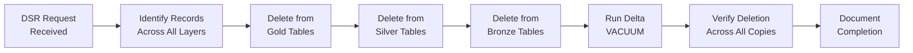

# 🌍 GDPR Compliance Mapping for Microsoft Fabric

**General Data Protection Regulation — Data Protection in OneLake and Fabric**

---

**Last Updated:** `2026-05-05` | **Version:** 1.0.0

---

## 🎯 Overview

The General Data Protection Regulation (GDPR) — Regulation (EU) 2016/679 — is the European Union's comprehensive data protection law governing the processing of personal data of individuals in the EU/EEA. It applies regardless of where the processing organization is located.

### Applicability to Fabric

GDPR applies to Microsoft Fabric deployments when:

- Fabric processes personal data of EU/EEA data subjects (employees, customers, patients, citizens)
- Your organization is established in the EU/EEA, regardless of where data is processed
- Your organization offers goods/services to EU/EEA residents or monitors their behavior
- Data transferred from the EU/EEA to other regions passes through or resides in Fabric

### Key GDPR Concepts in Fabric Context

| GDPR Concept | Fabric Mapping |
|-------------|----------------|
| **Data Controller** | Your organization — determines purpose and means of processing in Fabric |
| **Data Processor** | Microsoft — processes personal data on your behalf through Fabric services |
| **Data Subject** | Individual whose personal data is stored/processed in Fabric (customer, employee, patient) |
| **Personal Data** | Any data in Fabric that can identify a natural person (name, email, IP, employee ID, etc.) |
| **Special Category Data** | Health, biometric, genetic, racial, political, religious data requiring extra protection |
| **Processing** | Any operation on personal data in Fabric: collection, storage, analytics, reporting, deletion |

### Data Processing Agreement (DPA)

Microsoft provides GDPR-compliant Data Processing Addendum (DPA) as part of the Microsoft Product Terms:

| DPA Element | Coverage |
|-------------|----------|
| **Scope** | All personal data processed through Microsoft Fabric and Azure services |
| **Sub-processors** | Microsoft discloses sub-processors; customer can object to new sub-processors |
| **Data Transfers** | EU Standard Contractual Clauses (SCCs) for international transfers |
| **Security Measures** | Technical and organizational measures documented in DPA Annex |
| **Breach Notification** | Microsoft notifies customer within 72 hours of confirmed personal data breach |
| **Audit Rights** | Customer can audit Microsoft compliance via SOC 2 reports and Service Trust Portal |

---

## 📊 Control Mapping Table

GDPR articles mapped to Microsoft Fabric implementations:

| Article | Requirement | GDPR Obligation | Fabric Implementation | Evidence |
|---------|------------|-----------------|----------------------|----------|
| Art. 5(1)(a) | Lawfulness, Fairness, Transparency | Process personal data lawfully with documented legal basis | Document lawful basis for each processing activity in Fabric (consent, contract, legitimate interest); maintain processing records | Records of processing activities (ROPA) |
| Art. 5(1)(b) | Purpose Limitation | Collect data only for specified, explicit purposes | Workspace-level purpose documentation; sensitivity labels indicating permitted uses; DLP policies preventing repurposing | Workspace purpose documentation, label policies |
| Art. 5(1)(c) | Data Minimization | Process only data adequate and relevant to the purpose | Column-level security restricting unnecessary PII exposure; views/semantic models exposing only required fields; pseudonymization at ingestion | Column security config, view definitions |
| Art. 5(1)(e) | Storage Limitation | Retain personal data only as long as necessary | Data lifecycle policies in Purview; automated retention/deletion pipelines; Delta Lake time travel with configurable vacuum | Retention policy config, vacuum settings |
| Art. 5(1)(f) | Integrity and Confidentiality | Appropriate security measures for personal data | AES-256 encryption at rest; TLS 1.2+ in transit; RBAC; MFA; sensitivity labels; audit logging | Encryption config, RBAC export, audit logs |
| Art. 12-14 | Transparency and Information | Inform data subjects about processing | Privacy notices documenting Fabric analytics processing; data catalog entries describing personal data usage in OneLake Catalog | Privacy notice, catalog entries |
| Art. 15 | Right of Access | Provide data subject with copy of their personal data | Query pipelines to extract individual's data across Lakehouse/Warehouse; Power Automate workflow for DSR fulfillment | DSR workflow, extraction scripts |
| Art. 17 | Right to Erasure (Right to be Forgotten) | Delete personal data when requested and no legal basis to retain | Delta Lake `DELETE` operations targeting individual records; SQL Database record deletion; vacuum to remove historical versions; propagation across medallion layers | Deletion scripts, vacuum logs, propagation verification |
| Art. 20 | Right to Data Portability | Provide personal data in machine-readable format | Export pipelines generating CSV/JSON/Parquet for individual data subjects; API-based extraction from Fabric SQL Database | Export pipeline, format documentation |
| Art. 25 | Data Protection by Design and Default | Implement appropriate measures and defaults | Pseudonymization at Bronze ingestion; default sensitivity labels; OneLake data access roles with deny-by-default; privacy-preserving aggregations in Gold layer | Pipeline pseudonymization code, default label config |
| Art. 28 | Processor Obligations | Written contract with processor; security measures | Microsoft DPA/Product Terms as processor agreement; sub-processor disclosure; audit via Service Trust Portal | Signed DPA, sub-processor list |
| Art. 32 | Security of Processing | Appropriate technical and organizational measures | Encryption at rest/in transit; access controls (RBAC, MFA, CA); audit logging; incident response; pseudonymization; regular testing | Security configuration documentation |
| Art. 33 | Breach Notification (Supervisory Authority) | Notify supervisory authority within 72 hours of becoming aware | Microsoft notifies customer of platform breaches within 72 hours per DPA; customer must assess impact and notify supervisory authority | Incident response plan, notification procedure |
| Art. 35 | Data Protection Impact Assessment (DPIA) | DPIA required for high-risk processing | DPIA template covering Fabric analytics on personal data; assessment of Fabric-specific risks (AI/ML processing, profiling, large-scale monitoring) | Completed DPIA document |

---

## 🤝 Shared Responsibility Model

| GDPR Domain | Microsoft Responsibility (Processor) | Customer Responsibility (Controller) |
|------------|--------------------------------------|--------------------------------------|
| **Lawful Basis** | N/A — processor acts on controller's instructions | Determine and document lawful basis for each processing activity in Fabric |
| **Data Subject Rights** | Provide tools and APIs for data access, export, and deletion | Implement DSR workflows; respond to data subject requests within 30 days |
| **Data Minimization** | Platform features for access control and data partitioning | Configure column security, views, and pseudonymization; limit data collection |
| **Encryption** | Platform encryption at rest (AES-256 MMK); TLS 1.2+ in transit | CMK configuration; sensitivity labels; additional encryption for special category data |
| **Access Control** | Entra ID infrastructure; RBAC engine; MFA platform | User provisioning; role assignments; Conditional Access policies; data access roles |
| **Audit & Monitoring** | Audit event generation; platform logging infrastructure | Log collection; SIEM integration; monitoring for unauthorized access to personal data |
| **Breach Notification** | Notify customer of platform breaches within 72 hours per DPA | Assess breach impact; notify supervisory authority within 72 hours; notify data subjects if high risk |
| **International Transfers** | EU Standard Contractual Clauses (SCCs); data residency options | Verify transfer mechanism adequacy; conduct Transfer Impact Assessment if required |
| **Sub-processor Management** | Disclose sub-processors; maintain contracts; allow objection | Review sub-processor list; object to new sub-processors if necessary |
| **DPIA** | Provide information needed for DPIAs; maintain security documentation | Conduct DPIAs for high-risk processing; document risk mitigation measures |
| **DPO Engagement** | Microsoft has a corporate DPO | Designate and engage DPO for Fabric processing activities (if required) |

---

## ⚠️ Gap Analysis and Limitations

| Gap | GDPR Article | Impact | Compensating Control |
|-----|-------------|--------|---------------------|
| OneLake does not support surgical record deletion across Delta history | Art. 17 | Time travel may retain deleted records until vacuum | Configure Delta Lake vacuum to run within retention period; document vacuum schedule in ROPA |
| No automated DSR fulfillment workflow in Fabric | Art. 15, 17, 20 | DSR fulfillment requires custom development | Build Power Automate or custom pipeline for DSR search, extract, and delete across all layers |
| Sensitivity labels do not prevent all data exfiltration paths | Art. 5(1)(f) | Data may be exported through uncontrolled channels | Combine sensitivity labels with DLP policies, OAP, and export restrictions; monitor for exfiltration |
| Fabric Copilot/AI may process personal data without explicit design | Art. 25 | AI features may access personal data broadly | Disable Copilot in workspaces with personal data until privacy impact is assessed; configure AI governance |
| Cross-region replication may conflict with data residency | Art. 44-49 | Personal data may transfer outside EU/EEA | Use EU-based Fabric capacity; verify data residency settings; document transfer mechanisms |
| Pseudonymization reversal risk with linked datasets | Art. 25 | Pseudonymized data in Gold layer may be re-identifiable when joined with other data | Implement pseudonymization key separation; restrict access to mapping tables; conduct re-identification risk assessment |
| No built-in consent management in Fabric | Art. 6, 7 | Cannot track or enforce consent within Fabric | Integrate external consent management platform; filter processing based on consent status at ingestion |
| Retention enforcement requires custom pipelines | Art. 5(1)(e) | No platform-level automatic deletion by retention period | Build scheduled pipelines for retention enforcement; use Purview data lifecycle policies |

### Data Residency

Microsoft Fabric processes and stores data in the region where the Fabric capacity is provisioned. Key considerations:

| Region Category | Data Location | GDPR Transfer Mechanism |
|----------------|---------------|------------------------|
| **EU Capacity** | EU datacenters | No international transfer (within EU) |
| **US Capacity** | US datacenters | EU SCCs via Microsoft DPA |
| **UK Capacity** | UK datacenters | UK International Data Transfer Agreement |
| **Multi-Geo** | Per workspace assignment | Verify each workspace's region for transfer compliance |

### Right to Deletion in OneLake

Deleting personal data from OneLake (Lakehouse) requires a multi-step process:

**Important:** Delta Lake time travel retains deleted records until `VACUUM` runs. Configure vacuum retention period to align with your GDPR response timeline (default 7 days, adjustable).

---

## ✅ Implementation Checklist

### Legal Framework

- [ ] Verify Microsoft DPA is in place (included in Product Terms/Enterprise Agreement)
- [ ] Document lawful basis for each processing activity in Fabric
- [ ] Maintain Records of Processing Activities (ROPA) covering Fabric workloads
- [ ] Conduct DPIA for high-risk processing (profiling, large-scale monitoring, special category data)
- [ ] Verify data transfer mechanisms for non-EU Fabric capacity regions

### Data Subject Rights (Art. 12-22)

- [ ] Build data subject search pipeline to locate individual's data across Bronze/Silver/Gold layers
- [ ] Implement Art. 15 access request workflow (extract and format individual's data)
- [ ] Implement Art. 17 erasure workflow (delete across all layers + vacuum)
- [ ] Implement Art. 20 portability export (CSV/JSON/Parquet format)
- [ ] Implement Art. 16 rectification workflow (update records across layers)
- [ ] Establish 30-day response timeline tracking for all DSR types
- [ ] Test DSR workflows end-to-end with synthetic data

### Data Protection by Design (Art. 25)

- [ ] Implement pseudonymization at Bronze layer ingestion (hash/tokenize direct identifiers)
- [ ] Configure default sensitivity labels for workspaces containing personal data
- [ ] Set OneLake data access roles to deny-by-default for personal data folders
- [ ] Implement column-level security to restrict unnecessary PII exposure
- [ ] Configure privacy-preserving aggregations in Gold layer (k-anonymity, suppression)

### Security Measures (Art. 32)

- [ ] Configure workspace RBAC with least privilege for personal data access
- [ ] Enable MFA for all users via Conditional Access
- [ ] Deploy managed VNet and private endpoints for personal data workloads
- [ ] Enable Outbound Access Protection to prevent data exfiltration
- [ ] Configure CMK for SQL databases containing personal data
- [ ] Enable audit logging for all personal data access

### Retention & Deletion (Art. 5(1)(e))

- [ ] Define retention periods for each category of personal data
- [ ] Implement automated retention enforcement pipelines
- [ ] Configure Delta Lake vacuum schedule aligned with retention policy
- [ ] Document data disposal procedures and verification steps
- [ ] Configure Purview data lifecycle policies where applicable

### Monitoring & Breach Response (Art. 33, 34)

- [ ] Integrate Fabric audit logs with Microsoft Sentinel
- [ ] Configure alerts for unauthorized access to personal data
- [ ] Document breach assessment procedure for Fabric incidents
- [ ] Establish 72-hour notification workflow for supervisory authority
- [ ] Test breach response procedure annually

### Data Residency & Transfers (Art. 44-49)

- [ ] Verify Fabric capacity region aligns with data residency requirements
- [ ] Document transfer mechanisms for any non-EU processing
- [ ] Review Microsoft sub-processor list for adequacy
- [ ] Conduct Transfer Impact Assessment if transferring to non-adequate countries

---

## 📚 References

### Internal Best-Practices

| Guide | Relevant GDPR Articles |
|-------|----------------------|
| [Customer-Managed Keys](../best-practices/customer-managed-keys.md) | Art. 32 — Security of processing |
| [SQL Audit Logs Compliance](../best-practices/sql-audit-logs-compliance.md) | Art. 5(1)(f) — Integrity and confidentiality |
| [Identity & RBAC Patterns](../best-practices/identity-rbac-patterns.md) | Art. 5(1)(f), 25, 32 — Access control |
| [Network Security](../best-practices/network-security.md) | Art. 32 — Security measures |
| [Outbound Access Protection](../best-practices/outbound-access-protection.md) | Art. 5(1)(f), 32 — Data exfiltration prevention |
| [Monitoring & Observability](../best-practices/monitoring-observability.md) | Art. 33 — Breach detection |
| [Data Governance Deep Dive](../best-practices/data-governance-deep-dive.md) | Art. 5, 25, 30 — Data governance |
| [Data Sharing & Federation](../best-practices/data-sharing-federation.md) | Art. 26, 28, 44-49 — Data sharing and transfers |
| [Disaster Recovery & BCDR](../best-practices/disaster-recovery-bcdr.md) | Art. 32 — Availability and resilience |
| [Incremental Refresh & CDC](../best-practices/incremental-refresh-cdc.md) | Art. 5(1)(e) — Storage limitation |

### External References

- [GDPR Full Text (Regulation EU 2016/679)](https://gdpr.eu/)
- [European Data Protection Board (EDPB) Guidelines](https://edpb.europa.eu/our-work-tools/general-guidance_en)
- [Microsoft GDPR Compliance](https://learn.microsoft.com/en-us/compliance/regulatory/gdpr)
- [Microsoft DPA and Product Terms](https://www.microsoft.com/licensing/terms/)
- [Microsoft Trust Center — Privacy](https://www.microsoft.com/en-us/trust-center/privacy)
- [EU Standard Contractual Clauses](https://ec.europa.eu/info/law/law-topic/data-protection/international-dimension-data-protection/standard-contractual-clauses-scc_en)

---

*This mapping reflects GDPR requirements and Microsoft Fabric capabilities as of May 2026. Organizations must conduct their own data protection impact assessments and implement appropriate technical and organizational measures for their specific processing activities. This guide does not constitute legal advice.*
