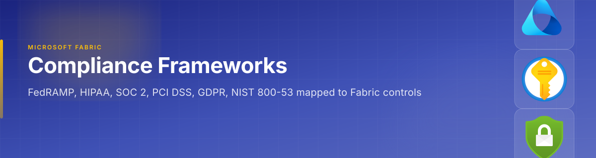

{ .hero-banner }

[Home](../index.md) > [Docs](../) > Compliance Frameworks

# 🏛️ Compliance Framework Mappings for Microsoft Fabric

**Enterprise Compliance Controls Mapped to Microsoft Fabric Implementations**

---

**Last Updated:** `2026-05-05` | **Version:** 1.0.0

---

## 🎯 Overview

This section provides detailed control-mapping documentation for six major compliance frameworks as they apply to Microsoft Fabric deployments. Each guide maps individual framework controls to specific Fabric features, configurations, and operational procedures — giving security and compliance teams a concrete, auditable reference for regulatory readiness.

All guides follow a consistent structure:

- **Framework overview** and applicability to Fabric workloads
- **Control mapping table** with Control ID, Name, Fabric Implementation, and Evidence
- **Shared responsibility model** — what Microsoft owns vs. what the customer must configure
- **Gap analysis** — current Fabric limitations and compensating controls
- **Implementation checklist** — actionable steps to achieve compliance
- **Cross-references** to existing best-practices documentation

---

## 📋 Compliance Frameworks

-   :material-shield-lock:{ .lg .middle } **NIST 800-53**

    ---

    Federal information security controls (AC, AU, CM, IA, SC, SI families) mapped to Fabric capabilities. Required for federal agencies and FedRAMP-authorized systems.

    [:octicons-arrow-right-24: NIST 800-53 Mapping](nist-800-53.md)

-   :material-cloud-check:{ .lg .middle } **FedRAMP**

    ---

    Fabric's path to FedRAMP authorization, current certification status, gap analysis, and compensating controls for government cloud deployments.

    [:octicons-arrow-right-24: FedRAMP Mapping](fedramp.md)

-   :material-hospital:{ .lg .middle } **HIPAA**

    ---

    Protected Health Information (PHI) handling in Fabric — BAA requirements, encryption, audit trails, and minimum necessary access controls.

    [:octicons-arrow-right-24: HIPAA Mapping](hipaa.md)

-   :material-certificate:{ .lg .middle } **SOC 2**

    ---

    Trust Service Criteria (Security, Availability, Processing Integrity, Confidentiality, Privacy) mapped to Fabric platform and customer controls.

    [:octicons-arrow-right-24: SOC 2 Mapping](soc2.md)

-   :material-credit-card:{ .lg .middle } **PCI DSS**

    ---

    Cardholder data environment (CDE) controls in Fabric — network segmentation, encryption, access controls, and logging for payment card data.

    [:octicons-arrow-right-24: PCI DSS Mapping](pci-dss.md)

-   :material-earth:{ .lg .middle } **GDPR**

    ---

    EU data protection requirements — data subject rights, data residency, right to deletion in OneLake, lawful basis for processing, and DPIAs.

    [:octicons-arrow-right-24: GDPR Mapping](gdpr.md)

---

## 🔗 Shared Responsibility in Fabric

All six frameworks share a common responsibility model when deployed on Microsoft Fabric:

| Layer | Microsoft Responsibility | Customer Responsibility |
|-------|--------------------------|------------------------|
| **Physical Infrastructure** | Datacenter security, hardware, network backbone | N/A |
| **Platform Services** | Fabric runtime, OneLake storage encryption at rest, OS patching | N/A |
| **Identity & Access** | Entra ID infrastructure, MFA platform | RBAC configuration, workspace roles, sensitivity labels |
| **Data Protection** | Platform-managed encryption (MMK), TLS in transit | CMK configuration, data classification, DLP policies |
| **Monitoring & Audit** | Platform audit log generation | Log collection, SIEM integration, alert configuration |
| **Governance** | Purview platform availability | Policy definition, lineage tracking, catalog curation |
| **Compliance Posture** | Attestations (SOC 2, ISO 27001, FedRAMP) | Control implementation, evidence collection, audit response |

---

## 📚 Related Best-Practices Documentation

These compliance mappings reference the following best-practices guides throughout:

| Best Practice Guide | Relevance |
|---------------------|-----------|
| [Customer-Managed Keys](../best-practices/customer-managed-keys.md) | Encryption at rest with customer-controlled keys |
| [SQL Audit Logs Compliance](../best-practices/sql-audit-logs-compliance.md) | Audit trail configuration and retention |
| [Identity & RBAC Patterns](../best-practices/identity-rbac-patterns.md) | Access control and role assignment |
| [Network Security](../best-practices/network-security.md) | Network isolation, private endpoints, firewall rules |
| [Outbound Access Protection](../best-practices/outbound-access-protection.md) | Data exfiltration prevention |
| [Data Governance Deep Dive](../best-practices/data-governance-deep-dive.md) | Purview integration, lineage, classification |
| [Monitoring & Observability](../best-practices/monitoring-observability.md) | Operational monitoring and alerting |
| [Disaster Recovery & BCDR](../best-practices/disaster-recovery-bcdr.md) | Business continuity controls |
| [Testing Strategies](../best-practices/testing-strategies.md) | Compliance testing approaches |
| [Data Sharing & Federation](../best-practices/data-sharing-federation.md) | Cross-boundary data sharing controls |

---

## 🏗️ How to Use These Guides

1. **Identify applicable frameworks** based on your industry and regulatory requirements
2. **Review the control mapping tables** to understand which Fabric features satisfy each control
3. **Check the shared responsibility model** to understand your obligations vs. Microsoft's
4. **Review the gap analysis** to identify controls requiring compensating measures
5. **Follow the implementation checklist** to configure Fabric for compliance
6. **Collect evidence** using the evidence column in mapping tables for audit readiness

---

*For questions about compliance posture, contact your organization's compliance team or Microsoft account representative.*
