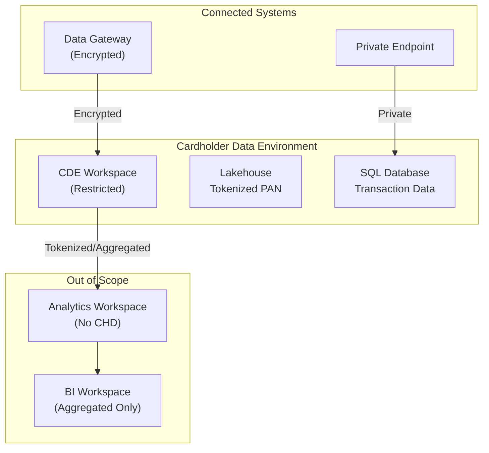

# 💳 PCI DSS Compliance Mapping for Microsoft Fabric

**Payment Card Industry Data Security Standard — Cardholder Data in Fabric**

---

**Last Updated:** `2026-05-05` | **Version:** 1.0.0

---

## 🎯 Overview

The Payment Card Industry Data Security Standard (PCI DSS) v4.0 defines security requirements for organizations that store, process, or transmit cardholder data (CHD) or sensitive authentication data (SAD). PCI DSS is mandated by the major payment card brands (Visa, Mastercard, American Express, Discover, JCB) and enforced through acquiring banks and payment processors.

### Applicability to Fabric

PCI DSS applies to Microsoft Fabric when:

- Fabric ingests or processes cardholder data (PAN, cardholder name, expiration date, service code)
- Fabric stores payment transaction data that includes full or partial PAN
- Fabric is used for payment analytics, fraud detection, or transaction reporting
- The Fabric deployment is within the cardholder data environment (CDE) boundary

### Cardholder Data Elements

| Data Element | PCI DSS Classification | Storage in Fabric | Protection Required |
|-------------|----------------------|-------------------|-------------------|
| Primary Account Number (PAN) | Cardholder Data | Must be rendered unreadable (hashed/tokenized/truncated/encrypted) | Encryption, masking, or tokenization |
| Cardholder Name | Cardholder Data | May be stored if protected | Access control, encryption at rest |
| Expiration Date | Cardholder Data | May be stored if protected | Access control, encryption at rest |
| Service Code | Cardholder Data | May be stored if protected | Access control, encryption at rest |
| Full Track Data | Sensitive Auth Data | **NEVER store after authorization** | Must not exist in Fabric |
| CVV/CVC | Sensitive Auth Data | **NEVER store after authorization** | Must not exist in Fabric |
| PIN/PIN Block | Sensitive Auth Data | **NEVER store after authorization** | Must not exist in Fabric |

> **Critical:** Sensitive Authentication Data (SAD) must NEVER be stored in Fabric after payment authorization, even if encrypted. Ensure data pipelines strip SAD before ingestion.

### CDE Scoping in Fabric

---

## 📊 Control Mapping Table

PCI DSS v4.0 requirements mapped to Microsoft Fabric implementations:

| Req. ID | Requirement | PCI DSS Requirement | Fabric Implementation | Evidence |
|---------|------------|---------------------|----------------------|----------|
| 1.2 | Network Security Controls | Install and maintain network security controls | Fabric managed VNet; private endpoints; Outbound Access Protection; IP firewall rules; NSG on gateway subnet | Network configuration export, OAP settings, firewall rules |
| 2.2 | Secure Configuration | Apply secure configurations to all system components | Fabric tenant settings hardened (disable public sharing, restrict export, limit embed); Bicep templates for infrastructure | Tenant settings export, IaC templates |
| 3.4 | PAN Rendering | Render PAN unreadable anywhere it is stored | Hash PAN at Bronze ingestion (SHA-256 with salt); tokenize via Azure Key Vault or third-party tokenization; display only last 4 digits | Hashing code in pipeline, token vault config |
| 3.5 | Cryptographic Key Management | Protect cryptographic keys used to protect stored CHD | Azure Key Vault for CMK; Key rotation policies; RBAC on Key Vault; separation of key management duties | Key Vault access policies, rotation policy, audit logs |
| 4.2 | Transmission Encryption | Protect CHD with strong cryptography during transmission | TLS 1.2+ enforced for all Fabric connections; HTTPS-only; encrypted data gateway connections | TLS configuration, gateway encryption settings |
| 5.2 | Anti-Malware | Deploy anti-malware on systems commonly affected by malware | Microsoft Defender for Cloud on Azure infrastructure; Fabric platform-level scanning; no customer-uploaded executables | Defender for Cloud status |
| 6.3 | Security Vulnerabilities | Identify and manage security vulnerabilities | Defender for Cloud vulnerability scanning; Fabric platform patching by Microsoft; Spark runtime version management | Vulnerability scan reports, runtime version |
| 7.2 | Access Control | Restrict access to CHD by business need-to-know | Dedicated CDE workspace with restricted membership; OneLake data access roles on CHD folders; RLS in semantic models | Workspace role list, data access roles, RLS policies |
| 8.3 | Strong Authentication | Secure authentication for users and administrators | Entra ID MFA via Conditional Access; phishing-resistant MFA for CDE workspace admins; minimum 12-character passwords | CA policies, authentication methods policy |
| 8.6 | Application and System Accounts | Manage application and system accounts | Managed identities for Fabric workspace (no shared passwords); service principal with scoped permissions; no interactive logon for system accounts | Managed identity config, SP role assignments |
| 9.4 | Media Protection | Protect media containing CHD | OneLake encryption at rest; SQL Database TDE; data lifecycle policies for CHD retention; secure deletion procedures | Encryption config, retention policies |
| 10.2 | Audit Logs | Implement audit logging for all access to CHD | Fabric admin audit logs; SQL audit logs for CDE databases; Entra ID sign-in logs; all access to CHD folders logged | Audit log config, sample audit entries |
| 10.4 | Log Review | Review audit logs to identify anomalies | Microsoft Sentinel with PCI-specific analytics rules; daily log review procedures; automated alerting on CDE workspace access | Sentinel rules, review procedures, alert config |
| 11.3 | Vulnerability Scanning | Perform internal and external vulnerability scans | Quarterly ASV scans on public-facing components; Defender for Cloud continuous scanning; configuration review for Fabric tenant | ASV scan reports, Defender findings |

---

## 🤝 Shared Responsibility Model

| PCI DSS Domain | Microsoft Responsibility | Customer Responsibility |
|---------------|--------------------------|------------------------|
| **Requirement 1 — Network Security** | Azure network infrastructure; Fabric platform network isolation; TLS enforcement | Managed VNet configuration; private endpoints; firewall rules; OAP; CDE network segmentation |
| **Requirement 2 — Secure Configuration** | Platform hardening; OS patching; default security settings | Tenant settings hardening; Bicep templates; workspace configuration; disable unnecessary features |
| **Requirement 3 — Protect Stored CHD** | Platform encryption at rest (AES-256 MMK); Key Vault infrastructure | PAN hashing/tokenization in pipelines; CMK configuration; data retention policies |
| **Requirement 4 — Transmission Encryption** | TLS 1.2+ enforcement on platform; encrypted backbone | Gateway encryption configuration; VPN for on-premises connections |
| **Requirement 5 — Anti-Malware** | Platform-level malware protection; Defender for Cloud infrastructure | N/A for Fabric PaaS (no customer OS-level malware concerns) |
| **Requirement 6 — Secure Development** | Fabric platform security development lifecycle | Secure pipeline development; code review for data engineering; CI/CD security gates |
| **Requirement 7 — Access Control** | RBAC engine; data access role infrastructure | CDE workspace membership; data access role configuration; need-to-know enforcement |
| **Requirement 8 — Authentication** | Entra ID infrastructure; MFA platform; managed identity service | MFA policy enforcement; password policies; service principal management |
| **Requirement 9 — Physical Security** | Datacenter physical security (PCI DSS Level 1 attested) | End-user device security; physical access to devices accessing Fabric |
| **Requirement 10 — Logging & Monitoring** | Audit event generation; platform log infrastructure | Log collection; SIEM integration; daily log review; alert response procedures |
| **Requirement 11 — Security Testing** | Platform vulnerability management; penetration testing of Azure | ASV scans; application-level pen testing; configuration reviews |
| **Requirement 12 — Security Policies** | Microsoft corporate security policies | Organization's PCI DSS security policy; Fabric-specific procedures; training |

---

## ⚠️ Gap Analysis and Limitations

| Gap | PCI DSS Requirement | Impact | Compensating Control |
|-----|---------------------|--------|---------------------|
| OneLake does not support field-level encryption | 3.4 — Render PAN unreadable | Cannot encrypt individual PAN fields in Lakehouse at storage layer | Hash or tokenize PAN before ingestion at Bronze layer; never store raw PAN in OneLake |
| No native tokenization service in Fabric | 3.4 — PAN protection | Must use external tokenization | Integrate Azure Key Vault or third-party tokenization service in ingestion pipeline |
| CDE network segmentation is logical, not physical | 1.2 — Network controls | Workspaces share tenant-level networking | Use dedicated capacity for CDE; managed VNet; private endpoints; OAP; document segmentation approach for QSA |
| No WAF in front of Fabric endpoints | 1.4 — Web application firewall | Public Fabric endpoints not protected by WAF | Configure Azure Front Door with WAF for any customer-facing Fabric-embedded reports |
| Fabric does not support file integrity monitoring | 11.5 — Change detection | Cannot monitor file changes on platform | Rely on Git-based source control for notebooks/pipelines; Delta Lake transaction logs for data integrity |
| Quarterly ASV scans may not cover Fabric PaaS | 11.3 — External vulnerability scanning | ASV tools cannot scan PaaS internals | Reference Microsoft's PCI DSS attestation for platform layer; scope ASV to customer-managed components |
| Shared capacity may not meet CDE isolation | 1.2 — Network segmentation | Other tenants share infrastructure | Use dedicated Fabric capacity (F64+); document PaaS isolation model for QSA |
| Sensitive authentication data may arrive in streams | 3.3 — SAD not stored after auth | Real-time streams may contain CVV or track data | Implement input validation at Eventstream ingestion to reject/strip SAD fields |

---

## ✅ Implementation Checklist

### Scoping

- [ ] Define CDE boundary: identify all Fabric workspaces that store, process, or transmit CHD
- [ ] Document data flows: map CHD from source systems through Fabric to reporting
- [ ] Identify connected systems: gateways, data sources, downstream consumers
- [ ] Minimize scope: tokenize/hash PAN at earliest point; use aggregated data outside CDE

### Network Security (Req. 1)

- [ ] Deploy managed VNet for CDE Fabric workspace
- [ ] Configure private endpoints for all data sources containing CHD
- [ ] Enable Outbound Access Protection to prevent data exfiltration
- [ ] Configure IP firewall rules restricting access to authorized networks
- [ ] Document network segmentation approach for QSA review

### Data Protection (Req. 3, 4)

- [ ] Implement PAN hashing (SHA-256 with secret salt) or tokenization at Bronze ingestion
- [ ] Verify no Sensitive Authentication Data exists in any Fabric storage
- [ ] Configure CMK for Fabric SQL databases in CDE via Azure Key Vault
- [ ] Set up key rotation policy (annual minimum, per PCI DSS v4.0)
- [ ] Verify TLS 1.2+ enforcement for all connections
- [ ] Configure data retention policies — destroy CHD when no longer needed

### Access Control (Req. 7, 8)

- [ ] Create dedicated CDE workspace with restricted membership (need-to-know only)
- [ ] Configure OneLake data access roles limiting CHD folder access
- [ ] Implement RLS in semantic models to restrict CHD visibility
- [ ] Enforce MFA for all CDE workspace users via Conditional Access
- [ ] Require phishing-resistant MFA (FIDO2/passkey) for CDE admins
- [ ] Use managed identities for automated processes (no shared credentials)

### Logging & Monitoring (Req. 10)

- [ ] Enable Fabric admin audit logging for CDE workspace
- [ ] Configure SQL audit logs for all CDE databases
- [ ] Integrate audit logs with Microsoft Sentinel
- [ ] Create PCI-specific Sentinel analytics rules for anomalous CHD access
- [ ] Establish daily log review procedure with documented sign-off
- [ ] Set audit log retention to minimum 12 months (3 months immediately accessible)

### Security Testing (Req. 11)

- [ ] Schedule quarterly ASV scans for in-scope external components
- [ ] Conduct annual penetration test including Fabric configuration review
- [ ] Implement continuous vulnerability scanning via Defender for Cloud
- [ ] Test incident response procedures annually

### Policies & Procedures (Req. 12)

- [ ] Document PCI DSS security policy covering Fabric CDE
- [ ] Train all personnel with CDE access on PCI DSS requirements
- [ ] Conduct annual risk assessment including Fabric workloads
- [ ] Maintain incident response plan with Fabric-specific procedures

---

## 📚 References

### Internal Best-Practices

| Guide | Relevant PCI DSS Requirements |
|-------|------------------------------|
| [Customer-Managed Keys](../best-practices/customer-managed-keys.md) | Req. 3.5 — Key management |
| [SQL Audit Logs Compliance](../best-practices/sql-audit-logs-compliance.md) | Req. 10.2, 10.4 — Logging |
| [Identity & RBAC Patterns](../best-practices/identity-rbac-patterns.md) | Req. 7.2, 8.3 — Access control |
| [Network Security](../best-practices/network-security.md) | Req. 1.2 — Network controls |
| [Outbound Access Protection](../best-practices/outbound-access-protection.md) | Req. 1.2 — Boundary protection |
| [Monitoring & Observability](../best-practices/monitoring-observability.md) | Req. 10.4 — Log review |
| [Data Governance Deep Dive](../best-practices/data-governance-deep-dive.md) | Req. 3.4 — Data protection |
| [Testing Strategies](../best-practices/testing-strategies.md) | Req. 11.3 — Security testing |
| [Capacity Planning](../best-practices/capacity-planning-cost-optimization.md) | CDE isolation via dedicated capacity |
| [Disaster Recovery & BCDR](../best-practices/disaster-recovery-bcdr.md) | Business continuity for CDE |

### External References

- [PCI DSS v4.0 Standard](https://www.pcisecuritystandards.org/document_library/)
- [PCI DSS Cloud Computing Guidelines](https://www.pcisecuritystandards.org/documents/PCI_DSS_v2_Cloud_Guidelines.pdf)
- [Microsoft PCI DSS Attestation](https://learn.microsoft.com/en-us/compliance/regulatory/offering-pci-dss)
- [Azure PCI DSS Blueprint](https://learn.microsoft.com/en-us/azure/compliance/blueprints/pci-dss)

---

*This mapping reflects PCI DSS v4.0 requirements and Microsoft Fabric capabilities as of May 2026. Organizations must engage a Qualified Security Assessor (QSA) for formal PCI DSS compliance validation. This guide supports scoping and control implementation but does not replace a formal assessment.*
