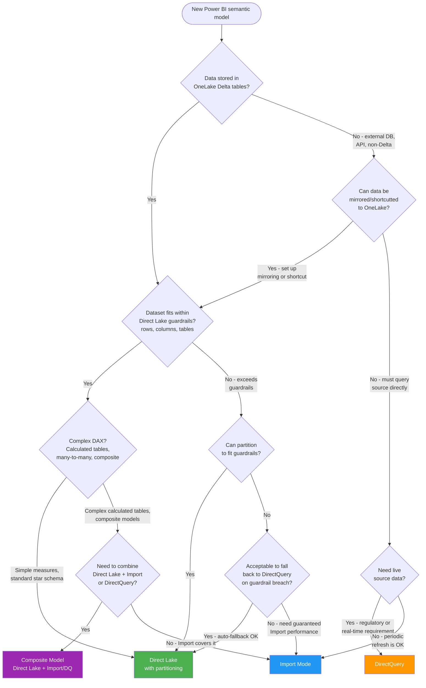

# Direct Lake vs Import vs DirectQuery

**Choose the right Power BI connectivity mode for your semantic model**

---

**Last Updated:** `2026-05-05` | **Version:** 1.0.0

---

## TL;DR

Use **Direct Lake** as the default for Fabric-native workloads -- it reads Delta tables directly from OneLake with no data movement, giving near-Import performance with DirectQuery-level freshness. Fall back to **Import** when you need complex DAX calculations, composite models, or data from non-OneLake sources. Use **DirectQuery** only when the source demands live connectivity and you accept the query latency cost.

---

## When This Question Comes Up

- Creating a new Power BI semantic model on top of Fabric Lakehouse or Warehouse data
- Migrating existing Import or DirectQuery models to Fabric
- Report performance is poor and you need to evaluate connectivity mode changes
- Dataset exceeds Power BI Pro memory limits and you need a strategy
- Compliance requires that no data copy exists outside the source system

---

## Decision Flowchart

---

## Direct Lake

### When

- Data is in OneLake as Delta tables (Lakehouse or via Warehouse shortcuts)
- Dataset size fits within Direct Lake guardrails (or acceptable fallback to DirectQuery)
- Standard star-schema model with simple-to-moderate DAX measures
- Near-real-time freshness is needed without paying Import refresh costs

### Why

- Zero data movement -- reads Parquet files directly from OneLake via columnar engine
- Near-Import query performance with no scheduled refresh overhead
- Automatic freshness as Delta tables are updated upstream
- V-Order optimization further accelerates column reads
- No duplicate data copies -- single source of truth in OneLake

### Tradeoffs

| Dimension | Assessment |
|-----------|------------|
| **Cost** | Lowest TCO; no Import refresh CU cost; reads share Fabric capacity |
| **Latency** | Sub-second for cached segments; cold reads depend on file count and size |
| **Compliance** | Data stays in OneLake; no PII duplication into Import cache |
| **Skill match** | Requires Delta table optimization knowledge (V-Order, compaction, partitioning) |

### Anti-patterns

- Skipping V-Order optimization and then blaming Direct Lake for slow queries
- Not monitoring framing (the Delta-to-columnar sync) and missing stale data
- Using Direct Lake on uncompacted Delta tables with thousands of small files
- Ignoring guardrail limits and not planning for automatic DirectQuery fallback behavior

---

## Import Mode

### When

- Data sources are outside OneLake and cannot be mirrored or shortcutted
- Complex DAX patterns require calculated tables, many-to-many relationships, or aggregations
- Composite models that blend Direct Lake tables with Import tables from other sources
- Dataset must be fully cached for guaranteed sub-second performance regardless of source state

### Why

- Fastest query performance -- data fully cached in the VertiPaq columnar engine
- Supports all DAX features including calculated tables and complex relationships
- Works with any data source Power BI can connect to
- Mature, well-understood model with predictable performance characteristics

### Tradeoffs

| Dimension | Assessment |
|-----------|------------|
| **Cost** | Refresh operations consume CU; storage for duplicate data in Import cache |
| **Latency** | Data freshness limited by refresh schedule (minimum 30-minute intervals for Pro) |
| **Compliance** | Data duplicated into Import cache -- PII governance must cover both copies |
| **Skill match** | Standard Power BI skill set; most teams already know Import mode |

### Anti-patterns

- Using Import for Fabric-native Lakehouse data when Direct Lake would eliminate refresh cost
- Scheduling frequent refreshes (every 15 min) when Direct Lake provides automatic freshness
- Ignoring Import cache memory limits on Power BI Pro (1 GB) or Premium Per User (100 GB)
- Not implementing incremental refresh for large Import datasets (full refresh every time)

---

## DirectQuery

### When

- Regulatory requirement that no data copy may exist outside the source system
- Source is a live operational database and reports must show current-second state
- Dataset is too large for Import and exceeds Direct Lake guardrails
- Aggregation tables or dual-mode tables can mitigate DirectQuery latency for key visuals

### Why

- Zero data duplication -- queries execute against the live source
- Always-fresh data without any refresh configuration
- No memory limits -- the source handles query execution
- Useful as a fallback tier in composite models alongside Direct Lake

### Tradeoffs

| Dimension | Assessment |
|-----------|------------|
| **Cost** | Each report interaction generates a source query; can increase source system load |
| **Latency** | Slowest mode; query time depends on source performance and network |
| **Compliance** | Strongest data residency posture -- no copies outside source |
| **Skill match** | Requires source query optimization; DAX-to-SQL translation can produce suboptimal queries |

### Anti-patterns

- Using DirectQuery as the default when Direct Lake is available (unnecessary latency)
- Not adding aggregation tables to accelerate common queries
- Pointing DirectQuery at an OLTP database and causing lock contention on operational workloads
- Ignoring query folding -- complex DAX that cannot fold generates slow, row-by-row queries

---

## Quick Comparison

| Dimension | Direct Lake | Import | DirectQuery |
|-----------|-------------|--------|-------------|
| **Data Freshness** | Near-real-time (auto) | Scheduled refresh | Live |
| **Query Speed** | Fast (cached segments) | Fastest (full cache) | Slowest (live query) |
| **Data Duplication** | None | Full copy in cache | None |
| **DAX Support** | Standard measures | Full (calculated tables) | Standard measures |
| **Max Dataset** | Guardrail-limited | Memory-limited | Source-limited |
| **Refresh Cost** | None | CU per refresh | None |
| **Best For** | Fabric-native Delta | Complex models, external data | Live compliance, huge datasets |

---

## Related Links

- [Direct Lake](../features/direct-lake.md) -- Direct Lake feature deep dive
- [Composite Models](../features/composite-models.md) -- Blending connectivity modes
- [Power BI Best Practices](../best-practices/power-bi-best-practices.md) -- Report and model optimization
- [V-Order Tuning](../best-practices/v-order-tuning-deep-dive.md) -- Optimizing Delta tables for Direct Lake
- [Mirroring](../features/mirroring.md) -- Bringing external data into OneLake
- [OneLake Shortcuts](../features/onelake-shortcuts-s3-gcs-dataverse.md) -- Cross-cloud data access
- [Capacity Planning](../best-practices/capacity-planning-cost-optimization.md) -- CU budget optimization
