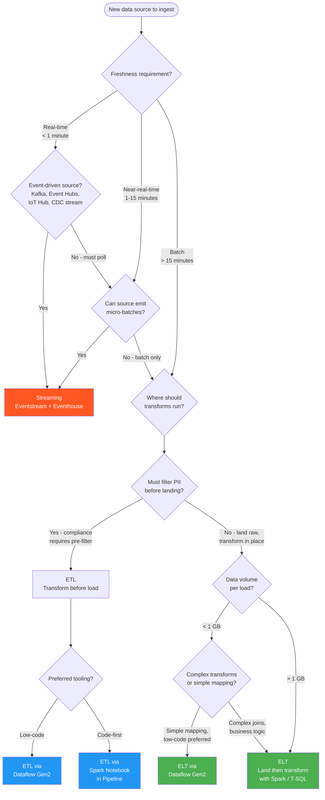

# ETL vs ELT vs Streaming

**Select the optimal data movement strategy for your Fabric workload**

---

**Last Updated:** `2026-05-05` | **Version:** 1.0.0

---

## TL;DR

Use **ELT** as the default pattern in Fabric -- land raw data in OneLake first, then transform with Spark or T-SQL at scale. Switch to **ETL** when data must be cleansed or filtered before landing (PII stripping, schema normalization from legacy sources). Use **Streaming** when business decisions depend on sub-minute data freshness (real-time dashboards, fraud detection, IoT telemetry).

---

## When This Question Comes Up

- Designing the initial data ingestion architecture for a new Fabric workspace
- Migrating SSIS, ADF, or Informatica pipelines to Fabric
- A stakeholder demands "real-time" dashboards and you need to assess if streaming is justified
- Data sources include a mix of batch databases, file drops, APIs, and event streams
- Compliance requires PII to be stripped before data lands in the lakehouse

---

## Decision Flowchart

---

## ELT (Extract-Load-Transform)

### When

- Default pattern for most Fabric workloads
- Data can be landed raw in Bronze without compliance concerns
- Transforms benefit from Spark or Warehouse compute at scale
- Medallion architecture (Bronze raw, Silver cleansed, Gold aggregated)

### Why

- Decouples ingestion from transformation, enabling independent scaling
- Raw data preserved in Bronze for replay, audit, and schema evolution
- Spark engine handles large-scale transforms more cost-effectively than pre-load processing
- Simplifies pipeline orchestration -- Copy Activity lands data, notebooks transform

### Tradeoffs

| Dimension | Assessment |
|-----------|------------|
| **Cost** | Lower ingestion cost (simple copy); transform cost depends on Spark/SQL CU usage |
| **Latency** | Batch-oriented; minimum ~5-15 minute cycle with scheduled pipelines |
| **Compliance** | Raw PII lands in Bronze -- requires access controls and retention policies |
| **Skill match** | Requires PySpark or T-SQL for transform layer; Copy Activity is low-code |

### Anti-patterns

- Landing PII or regulated data in Bronze without encryption and RBAC (use ETL if pre-filtering is mandatory)
- Skipping Bronze and transforming directly into Silver (loses raw audit trail)
- Using Dataflow Gen2 for >1 GB loads when Copy Activity + Spark notebook is faster
- Running transforms in the pipeline orchestration layer instead of delegating to Spark

---

## ETL (Extract-Transform-Load)

### When

- Compliance mandates PII stripping, masking, or filtering before data lands in OneLake
- Source schema is messy and requires normalization before landing (legacy mainframe, flat files)
- Data volume is small enough that pre-load transforms don't create bottlenecks
- Dataflow Gen2 low-code experience is preferred for citizen integrators

### Why

- Data arrives clean -- Bronze layer already meets governance requirements
- Reduces storage cost by filtering irrelevant records before loading
- Dataflow Gen2 provides Power Query-style visual transforms for non-developers
- Useful for edge cases where Spark transforms would be overkill

### Tradeoffs

| Dimension | Assessment |
|-----------|------------|
| **Cost** | Transform runs on ingestion compute; can be expensive for large datasets |
| **Latency** | Adds processing time before data is available in OneLake |
| **Compliance** | Strongest pre-landing compliance posture; PII never touches raw storage |
| **Skill match** | Dataflow Gen2 is accessible to Power Query users; Spark ETL needs developers |

### Anti-patterns

- Using ETL for multi-terabyte loads (transform bottleneck; use ELT and transform in Spark)
- Building complex business logic in Dataflow Gen2 when a Spark notebook is more maintainable
- Losing raw data auditability by filtering too aggressively before landing
- Chaining 10+ Dataflow transforms when a single Spark notebook would be clearer

---

## Streaming

### When

- Business requires sub-minute data freshness (fraud detection, live dashboards, IoT monitoring)
- Source natively emits events (Kafka, Azure Event Hubs, IoT Hub, database CDC)
- Use case involves pattern detection, alerting, or real-time aggregation
- Real-Time Intelligence (Eventhouse + KQL) is the query layer

### Why

- Eventstream provides managed, no-code stream ingestion into Eventhouse
- KQL enables sub-second analytical queries on streaming data
- Data Activator triggers alerts and actions based on real-time conditions
- Supports both hot path (Eventhouse) and warm path (Lakehouse Delta) simultaneously

### Tradeoffs

| Dimension | Assessment |
|-----------|------------|
| **Cost** | Always-on compute for stream processing; higher baseline cost than batch |
| **Latency** | Sub-second to seconds; best freshness available in Fabric |
| **Compliance** | Streaming data harder to mask in-flight; may need downstream PII handling |
| **Skill match** | Requires KQL for Eventhouse queries; Eventstream is low-code for ingestion |

### Anti-patterns

- Using streaming for data that is truly batch (daily file drops don't need Eventstream)
- Skipping the warm-path write to Lakehouse and querying Eventhouse for historical analytics
- Not setting retention policies on Eventhouse -- unbounded storage growth
- Building complex transforms in Eventstream when a Spark notebook post-ingestion is cleaner

---

## Quick Comparison

| Dimension | ELT | ETL | Streaming |
|-----------|-----|-----|-----------|
| **Freshness** | 5-60 min (batch) | 5-60 min (batch) | Seconds |
| **Complexity** | Medium | Medium-High | High |
| **Best Volume** | Any (Spark scales) | < 1 GB per load | Continuous events |
| **Transform Engine** | Spark / T-SQL | Dataflow Gen2 / Spark | Eventstream / KQL |
| **Raw Preservation** | Yes (Bronze) | Partial (pre-filtered) | Yes (Eventhouse + Lakehouse) |
| **Cost Profile** | Pay per job | Pay per job | Always-on |

---

## Related Links

- [Pipelines & Data Movement](../best-practices/03_PIPELINES_DATA_MOVEMENT.md) -- Pipeline best practices
- [Real-Time Intelligence](../features/real-time-intelligence.md) -- Eventstream and Eventhouse
- [Dataflow Gen2](../features/dataflow-gen2.md) -- Low-code data transforms
- [Copy Job CDC](../features/copy-job-cdc.md) -- Change data capture via Copy Job
- [Incremental Refresh & CDC](../best-practices/incremental-refresh-cdc.md) -- Incremental patterns
- [Medallion Architecture](../best-practices/medallion-architecture-deep-dive.md) -- Bronze/Silver/Gold patterns
- [Data Activator](../features/data-activator.md) -- Real-time alerting
