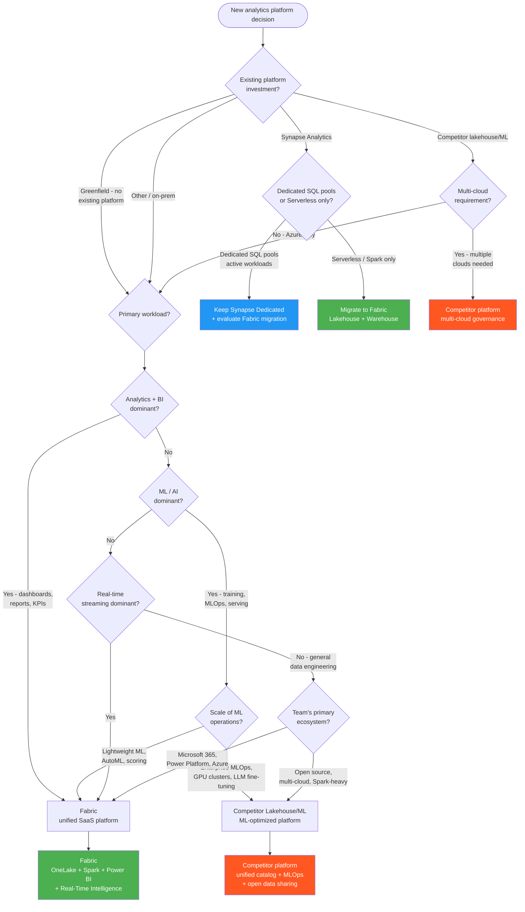

# Fabric vs a Lakehouse/ML Competitor vs Synapse

**Platform selection from a Fabric-first perspective**

!!! info "Third-party references — publicly sourced, good-faith comparison"
    This page references non-Microsoft products and services. That information is drawn from each vendor's **publicly available documentation** and is offered for honest, good-faith comparison only. This is a personal project written from a Microsoft Fabric and Azure perspective; it does **not** claim expertise in, or authority over, any third-party product, and nothing here is an official statement by, or endorsed by, those vendors. Capabilities, pricing, and features change often — always verify against the vendor's current official documentation. Where a third-party offering is the stronger choice, we say so plainly.

---

**Last Updated:** `2026-05-05` | **Version:** 1.0.0

---

## TL;DR

Choose **Fabric** when you want a unified SaaS analytics platform with integrated Lakehouse, Warehouse, Power BI, and Real-Time Intelligence under one capacity. Consider **a referenced lakehouse/ML competitor** when your workload is ML/AI-heavy, multi-cloud, or already standardized on that platform's catalog and governance — in those cases it is often the stronger choice. Keep **Azure Synapse Analytics** for existing dedicated SQL pool investments, but plan migration to Fabric for new workloads.

---

## When This Question Comes Up

- Greenfield project selecting a primary analytics platform on Azure
- Existing Synapse workspace evaluating migration to Fabric
- Organization runs a competitor's lakehouse/ML platform on other clouds and is considering Azure consolidation
- Team needs to weigh Fabric adoption vs expanding an existing competitor investment
- Multi-cloud strategy requires interoperability between Fabric and external platforms

---

## Decision Flowchart

---

## Fabric

### When

- Primary workload is analytics and BI with Power BI as the consumption layer
- Organization is Microsoft-first (M365, Power Platform, Azure)
- Unified governance under a single capacity model is valued over best-of-breed components
- Real-Time Intelligence (Eventstream, Eventhouse, KQL) is needed
- Team wants a SaaS experience with minimal infrastructure management

### Why

- Single platform: Lakehouse, Warehouse, Power BI, Real-Time Intelligence, Data Activator
- OneLake provides unified storage with automatic Delta Lake format
- Direct Lake connectivity eliminates Import refresh overhead for Power BI
- Integrated governance through Microsoft Purview
- Capacity-based pricing consolidates compute billing

### Tradeoffs

| Dimension | Assessment |
|-----------|------------|
| **Cost** | Capacity-based (F64+); predictable but requires right-sizing; can be expensive for burst ML |
| **Latency** | Excellent for analytics and streaming; not optimized for heavy ML training |
| **Compliance** | Strong Azure/FedRAMP posture; Purview integration for lineage and classification |
| **Skill match** | Ideal for T-SQL + Power BI teams; PySpark supported, though a dedicated lakehouse/ML competitor typically offers a deeper, more mature Spark ecosystem |

### Anti-patterns

- Running large-scale ML training (GPU clusters, LLM fine-tuning) on Fabric Spark when a competitor's purpose-built ML platform would handle it more efficiently
- Choosing Fabric solely for Spark workloads when the team already has deep expertise in a competitor's platform and its governance catalog
- Ignoring Fabric's capacity limits for concurrent users -- under-provisioning leads to throttling
- Treating Fabric as "just a Lakehouse" and not leveraging Real-Time Intelligence, Data Activator, or Copilot

---

## A Referenced Lakehouse/ML Competitor

### When

- ML/AI is the dominant workload: model training, experiment tracking, GPU clusters
- Multi-cloud strategy requires a consistent platform across several cloud providers
- The competitor's governance catalog is already the layer for data and ML assets
- Team is deeply invested in the open-source Spark ecosystem and the platform's data-sharing protocol

### Why

- Purpose-built for ML/AI: GPU-optimized clusters, experiment tracking, feature store, model serving — genuinely strong for heavy ML/AI work
- Multi-cloud: a consistent experience across multiple cloud providers
- A unified governance catalog spanning data, ML models, and notebooks
- An open data-sharing protocol enables secure cross-organization sharing without copying
- Mature Spark ecosystem with extensive third-party integrations

### Tradeoffs

| Dimension | Assessment |
|-----------|------------|
| **Cost** | Consumption-based pricing; GPU clusters can be expensive; separate BI tooling cost |
| **Latency** | Excellent for Spark and ML; BI typically requires external tools such as Power BI |
| **Compliance** | The platform's catalog provides fine-grained access; FedRAMP available on Azure |
| **Skill match** | Strong for Spark/Python/ML engineers; less natural for T-SQL/Power BI teams |

### Anti-patterns

- Using a Spark/ML-first competitor as a BI platform when it lacks native dashboarding equivalent to Power BI + Direct Lake
- Running the competitor's platform on Azure solely for Spark when Fabric Lakehouse provides equivalent compute
- Ignoring OneLake interoperability -- many competitor platforms can read/write OneLake via ABFS shortcuts
- Maintaining separate competitor and Fabric environments without open data-sharing or shortcut integration

---

## Synapse Analytics (Legacy)

### When

- Active dedicated SQL pool investments with complex migrations that cannot move to Fabric yet
- Existing Synapse Serverless SQL pools (consider migrating to Fabric Lakehouse SQL endpoint)
- Synapse Spark pools with established CI/CD (evaluate Fabric Spark with fabric-cicd)
- Regulatory or contractual lock-in to existing Synapse infrastructure

### Why

- Dedicated SQL pools provide guaranteed compute isolation for large-scale DW workloads
- Existing Synapse pipelines and linked services may be complex to migrate immediately
- Some compliance frameworks may have Synapse specifically in their authorization boundary

### Tradeoffs

| Dimension | Assessment |
|-----------|------------|
| **Cost** | Dedicated pools charge whether active or paused; Fabric capacity is more flexible |
| **Latency** | Dedicated pools offer predictable performance; Fabric scales dynamically |
| **Compliance** | Mature compliance posture; Fabric is catching up rapidly |
| **Skill match** | Synapse is familiar to existing Azure DW teams; Fabric adds new concepts (OneLake, Direct Lake) |

### Anti-patterns

- Starting new greenfield projects on Synapse instead of Fabric (Synapse is in maintenance mode)
- Maintaining Synapse Serverless when Fabric Lakehouse SQL endpoint provides equivalent functionality
- Not planning a migration path -- Synapse Spark and pipelines have direct Fabric equivalents
- Running Synapse and Fabric in parallel without a consolidation roadmap

---

## Quick Comparison

| Dimension | Fabric | Lakehouse/ML Competitor | Synapse |
|-----------|--------|------------|---------|
| **Model** | SaaS (capacity) | PaaS (consumption units) | PaaS (DWU/vCore) |
| **BI** | Power BI (native) | External (e.g., Power BI) | External |
| **ML/AI** | AutoML, notebooks | Experiment tracking, GPU, feature store | Spark ML |
| **Real-Time** | Eventstream, Eventhouse | Structured Streaming | N/A |
| **Governance** | Purview | Platform-native catalog | Purview |
| **Multi-Cloud** | Azure only | Multiple cloud providers | Azure only |
| **Storage** | OneLake (Delta) | Platform storage / catalog (Delta) | ADLS Gen2 |
| **Future** | Active development | Active development | Maintenance mode |

---

## Related Links

- [Fabric IQ](../features/fabric-iq.md) -- AI-powered Fabric assistant
- [Migration Patterns](../best-practices/migration-patterns.md) -- Platform migration strategies
- [OneLake Shortcuts](../features/onelake-shortcuts-s3-gcs-dataverse.md) -- Cross-platform data access
- [Iceberg Interoperability](../features/onelake-iceberg-interop.md) -- Open table format compatibility
- [Capacity Planning](../best-practices/capacity-planning-cost-optimization.md) -- Right-sizing Fabric capacity
- [Spark Environments](../features/spark-environments-job-definitions.md) -- Fabric Spark configuration
- [AutoML](../features/automl-model-endpoints.md) -- Fabric-native ML capabilities
