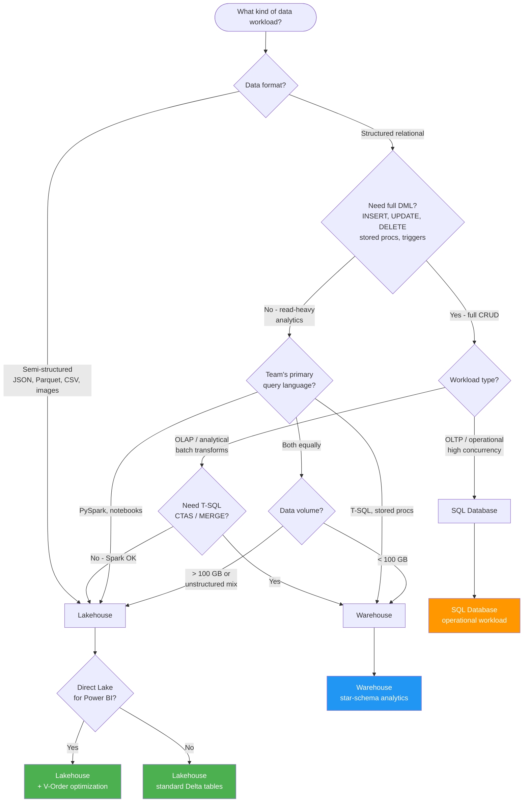

# Lakehouse vs Warehouse vs SQL Database

**Choose the right Fabric storage engine for your workload**

---

**Last Updated:** `2026-05-05` | **Version:** 1.0.0

---

## TL;DR

Use **Lakehouse** when your team writes PySpark and needs schema-on-read flexibility for semi-structured or mixed data. Use **Warehouse** when your team is T-SQL-first and the workload is read-heavy analytics with star-schema models. Use **SQL Database** when you need full OLTP capabilities (CRUD, stored procedures, triggers) for operational applications or transactional microservices.

---

## When This Question Comes Up

- Starting a new Fabric project and choosing the primary data store
- Migrating an existing SQL Server, Synapse, or Databricks workload to Fabric
- A team with mixed T-SQL and PySpark skills needs to pick a default engine
- You need to expose data to Power BI via Direct Lake and must decide where Delta tables live
- An application requires both analytical queries and operational transactions

---

## Decision Flowchart

---

## Lakehouse

### When

- Data engineering workloads with PySpark, Spark SQL, or notebook-driven development
- Semi-structured or mixed-format data (JSON, CSV, Parquet, images alongside Delta tables)
- Medallion architecture (Bronze/Silver/Gold) is the processing pattern
- Direct Lake connectivity is required for Power BI

### Why

- Native Delta Lake support with schema evolution and time travel
- Unified storage for files and tables in OneLake
- Best Direct Lake performance with V-Order optimization
- Scales to petabyte-level datasets with Spark parallelism
- Schema-on-read flexibility for exploratory workloads

### Tradeoffs

| Dimension | Assessment |
|-----------|------------|
| **Cost** | CU consumption on Spark; auto-scale can spike during large jobs |
| **Latency** | Batch-oriented; not ideal for sub-second transactional queries |
| **Compliance** | Delta change data feed supports audit trails; no built-in CDC like SQL Database |
| **Skill match** | Requires PySpark / Spark SQL skills; SQL endpoint is read-only |

### Anti-patterns

- Using Lakehouse as an OLTP store for high-frequency INSERT/UPDATE from applications
- Relying on the SQL analytics endpoint for write operations (it is read-only)
- Skipping V-Order optimization when Direct Lake is the consumption layer
- Storing thousands of small files without compaction (small-file problem)

---

## Warehouse

### When

- BI-centric analytics with T-SQL-fluent teams
- Star-schema dimensional models with CTAS, views, and stored procedures
- Cross-database queries spanning multiple Fabric workspaces
- Workloads that need high concurrency for concurrent BI report queries

### Why

- Full T-SQL DML (INSERT, UPDATE, DELETE, MERGE) on managed Delta tables
- Familiar SQL Server / Synapse DW experience with zero infrastructure management
- High-concurrency SQL endpoint optimized for BI query patterns
- Native support for cross-database queries and schema-on-write enforcement

### Tradeoffs

| Dimension | Assessment |
|-----------|------------|
| **Cost** | CU consumption on SQL engine; long-running transforms can be expensive vs Spark |
| **Latency** | Good for analytics queries; not designed for OLTP concurrency levels |
| **Compliance** | No native CDC; relies on pipeline-driven change capture |
| **Skill match** | Excellent for T-SQL teams; limited for teams needing Python/ML workflows |

### Anti-patterns

- Running heavy ETL transforms in Warehouse when Spark would be more cost-effective at scale
- Using Warehouse for operational OLTP workloads (use SQL Database instead)
- Expecting Direct Lake to work natively (requires shortcuts to Lakehouse Delta tables)
- Ignoring result-set caching configuration for repetitive BI queries

---

## SQL Database

### When

- Operational / OLTP workloads requiring high-concurrency CRUD
- Application backends needing stored procedures, triggers, and row-level security
- Change data capture (CDC) or change tracking is required at the database level
- Microservices that need a fully managed SQL Server engine inside Fabric

### Why

- Full SQL Server engine with complete DML, DDL, stored procedures, and triggers
- Native CDC and change tracking for downstream analytics pipelines
- Highest concurrency of the three engines for transactional workloads
- Automatic mirroring to OneLake for analytical consumption via Lakehouse or Warehouse

### Tradeoffs

| Dimension | Assessment |
|-----------|------------|
| **Cost** | CU consumption on SQL; separate from Spark/Warehouse budgets |
| **Latency** | Sub-millisecond transactional reads; analytical queries better served by Lakehouse/Warehouse |
| **Compliance** | Built-in audit, CDC, TDE; strongest compliance posture of the three |
| **Skill match** | Standard SQL Server skills; no PySpark needed for operational layer |

### Anti-patterns

- Using SQL Database as a data warehouse for large-scale analytical aggregations
- Skipping mirroring configuration and then querying operational tables directly for BI
- Running Spark notebooks against SQL Database instead of letting mirroring push data to OneLake
- Over-provisioning for analytics when the workload is purely operational

---

## Quick Comparison

| Capability | Lakehouse | Warehouse | SQL Database |
|---|---|---|---|
| **Engine** | Spark + SQL endpoint | T-SQL (Synapse DW) | Full SQL Server |
| **DML** | Delta Lake via Spark | T-SQL CRUD | Full CRUD + triggers |
| **Query Language** | PySpark, Spark SQL | T-SQL | T-SQL |
| **Schema** | Schema-on-read or write | Schema-on-write | Schema-on-write |
| **Direct Lake** | Native | Via shortcuts | Via mirroring |
| **Best For** | Data engineering, ML | BI analytics, T-SQL teams | OLTP, operational apps |
| **Concurrency** | Medium | High | Very High |
| **CDC** | Delta change data feed | N/A | Native CDC |

---

## Related Links

- [Direct Lake](../features/direct-lake.md) -- Zero-copy Power BI connectivity
- [Fabric SQL Database](../features/fabric-sql-database.md) -- SQL Database feature deep dive
- [Mirroring](../features/mirroring.md) -- Database mirroring to OneLake
- [Lakehouse Setup](../best-practices/07_LAKEHOUSE_SETUP.md) -- Lakehouse configuration best practices
- [Warehouse Setup](../best-practices/08_WAREHOUSE_SETUP.md) -- Warehouse configuration best practices
- [Medallion Architecture](../best-practices/medallion-architecture-deep-dive.md) -- Bronze/Silver/Gold patterns
- [Component Decision Trees](../DECISION_TREES.md) -- Additional component-level flowcharts
