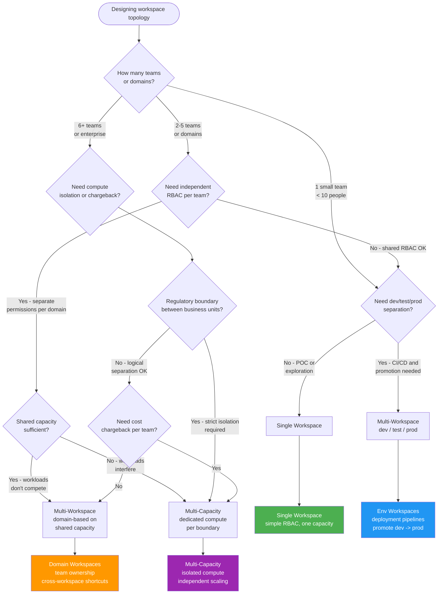

# Workspace Topology

<div align="center" markdown>

**Single vs multi-workspace vs multi-capacity architecture**


</div>

---

**Last Updated:** `2026-05-05` | **Version:** 1.0.0

---

## TL;DR

Use a **single workspace** for small teams or POC projects where simplicity outweighs isolation. Adopt **multi-workspace** (dev/test/prod or domain-based) when you need environment separation, independent RBAC, or deployment pipelines. Scale to **multi-capacity** when workload isolation, chargeback, or regulatory boundaries demand dedicated compute per business unit.

---

## When This Question Comes Up

- Setting up a new Fabric tenant or onboarding a new business unit
- Current single workspace is hitting RBAC complexity or performance contention
- Compliance requires environment separation (dev vs prod) with audit trails
- Finance requires capacity cost chargeback per department or domain
- Data mesh strategy requires domain teams to own their own Fabric resources

---

## Decision Flowchart



---

## Single Workspace

### When

- POC, hackathon, or exploratory project with a small team
- All team members need access to all items (no RBAC isolation needed)
- Budget is constrained and a single F64 capacity covers the workload
- Speed of setup is more important than governance maturity

### Why

- Simplest setup -- one workspace, one capacity, one set of permissions
- All items (Lakehouse, Warehouse, notebooks, reports) visible in one place
- No cross-workspace shortcut or deployment pipeline configuration needed
- Fastest path from zero to working POC

### Tradeoffs

| Dimension | Assessment |
|-----------|------------|
| **Cost** | Lowest management overhead; single capacity bill |
| **Latency** | All workloads share compute; heavy Spark jobs can throttle BI queries |
| **Compliance** | Limited RBAC granularity; everyone sees everything in the workspace |
| **Skill match** | Minimal Fabric admin skills required |

### Anti-patterns

- Keeping a single workspace as the team grows beyond 10 people (RBAC becomes unmanageable)
- Running dev experiments and production reports in the same workspace (no environment isolation)
- Deploying to production from a shared workspace without deployment pipelines
- Storing sensitive and non-sensitive data together without OneLake security policies

---

## Multi-Workspace (Environment-Based)

### When

- Team needs dev/test/prod separation for safe deployment promotion
- Deployment pipelines or fabric-cicd are used for CI/CD
- RBAC must differ between environments (developers access dev, only CI deploys to prod)
- Audit trails must show what changed between environments

### Why

- Fabric deployment pipelines natively support workspace-to-workspace promotion
- Developers can experiment in dev without affecting production reports
- RBAC per workspace enables least-privilege access (devs can't modify prod)
- fabric-cicd integrates with GitHub Actions for automated deployments

### Tradeoffs

| Dimension | Assessment |
|-----------|------------|
| **Cost** | Each workspace can share a capacity, but prod may need dedicated capacity for SLA |
| **Latency** | Dev workloads don't impact prod when on separate capacities |
| **Compliance** | Clear audit trail via deployment pipelines; separation of duties enforced |
| **Skill match** | Requires Fabric admin skills for workspace and pipeline configuration |

### Anti-patterns

- Creating dev/test/prod workspaces but not using deployment pipelines (manual copy defeats the purpose)
- Sharing a single capacity across dev and prod without throttling controls (dev Spark jobs starve prod BI)
- Not automating promotion -- manual deployment to prod introduces human error
- Over-segmenting into too many environments (dev/test/staging/UAT/preprod/prod) when dev/test/prod suffices

---

## Multi-Workspace (Domain-Based)

### When

- Multiple business domains (Sales, Finance, Operations) each need ownership of their data
- Data mesh strategy assigns domain teams as data product owners
- Cross-domain data sharing uses OneLake shortcuts rather than data copies
- Teams need independent release cycles without blocking each other

### Why

- Domain teams manage their own workspace lifecycle, RBAC, and release cadence
- OneLake shortcuts enable zero-copy cross-domain data sharing
- Workspace-level monitoring provides per-domain usage visibility
- Aligns with data mesh principles: domain ownership with federated governance

### Tradeoffs

| Dimension | Assessment |
|-----------|------------|
| **Cost** | Shared capacity keeps cost down; per-domain capacity adds cost but enables chargeback |
| **Latency** | Cross-workspace shortcuts add minimal latency; cross-capacity shortcuts are transparent |
| **Compliance** | Per-domain RBAC and sensitivity labels; Purview provides cross-domain lineage |
| **Skill match** | Each domain needs a workspace admin; central governance team sets policies |

### Anti-patterns

- Creating domain workspaces without establishing cross-domain data contracts (data silos re-emerge)
- Copying data between domains instead of using OneLake shortcuts (defeats zero-copy benefits)
- Not implementing a central governance workspace for shared reference data (master data fragmentation)
- Allowing domain teams to set conflicting naming conventions (creates confusion at the tenant level)

---

## Multi-Capacity

### When

- Regulatory or contractual boundaries require dedicated compute per business unit
- Finance requires capacity-level cost chargeback to different cost centers
- Workload profiles are incompatible (one domain runs heavy Spark, another runs concurrent BI)
- SLA requirements differ across business units (one domain needs 99.99%, another needs 99.9%)

### Why

- Complete compute isolation -- one domain's Spark burst doesn't throttle another's BI
- Capacity-level billing enables direct cost allocation to business units
- Independent scaling -- each capacity can be sized for its specific workload profile
- Regulatory boundaries are enforced at the infrastructure level, not just logical RBAC

### Tradeoffs

| Dimension | Assessment |
|-----------|------------|
| **Cost** | Highest cost -- each capacity has a minimum SKU (F64); underutilized capacity wastes budget |
| **Latency** | Best isolation; no cross-domain compute contention |
| **Compliance** | Strongest boundary enforcement; required for some regulatory frameworks |
| **Skill match** | Requires mature Fabric administration; capacity management, monitoring, and autoscale tuning |

### Anti-patterns

- Provisioning multi-capacity for a single small team (over-engineering; single workspace suffices)
- Not implementing capacity autoscale and leaving expensive capacities running 24/7 for batch workloads
- Ignoring cross-capacity shortcut latency for real-time workloads (test before committing)
- Creating one capacity per workspace instead of grouping related workspaces onto shared capacities

---

## Quick Comparison

| Dimension | Single | Multi-WS (Env) | Multi-WS (Domain) | Multi-Capacity |
|-----------|--------|----------------|-------------------|----------------|
| **Team Size** | < 10 | 5-30 | 10-100+ | 50+ |
| **RBAC** | Shared | Per environment | Per domain | Per capacity |
| **CI/CD** | Manual | Deployment pipelines | Per-domain pipelines | Per-domain + per-env |
| **Cost Model** | Simple | Shared capacity | Shared or per-domain | Per business unit |
| **Isolation** | None | Logical | Logical + ownership | Compute + logical |
| **Complexity** | Low | Medium | Medium-High | High |

---

## Topology Patterns Summary

```
Single Workspace:
  [WS: Everything] ─── Capacity A

Environment-Based:
  [WS: Dev] ──promote──> [WS: Test] ──promote──> [WS: Prod]
     └──────────────────── Capacity A ────────────────────┘

Domain-Based (shared capacity):
  [WS: Sales]  [WS: Finance]  [WS: Ops]
     └────────── Capacity A ──────────┘

Multi-Capacity:
  [WS: Sales-Dev] [WS: Sales-Prod]     [WS: Finance-Dev] [WS: Finance-Prod]
     └────── Capacity A ──────┘            └────── Capacity B ──────┘
```

---

## Related Links

- [Workspaces & Naming](../best-practices/01-workspaces-naming.md) -- Workspace naming conventions
- [Multi-Tenant Architecture](../best-practices/multi-tenant-workspace-architecture.md) -- Multi-tenant patterns
- [Identity & RBAC](../best-practices/identity-rbac-patterns.md) -- Access control patterns
- [OneLake Security](../features/onelake-security.md) -- Data-level security in OneLake
- [Capacity Planning](../best-practices/capacity-planning-cost-optimization.md) -- Right-sizing capacities
- [Deployment Pipelines](../features/deployment-pipelines.md) -- CI/CD workspace promotion
- [Data Sharing & Federation](../best-practices/data-sharing-federation.md) -- Cross-domain data sharing
- [Workspace Monitoring](../features/workspace-monitoring.md) -- Usage and performance monitoring
- [fabric-cicd Deployment](../best-practices/fabric-cicd-deployment.md) -- GitHub Actions integration
