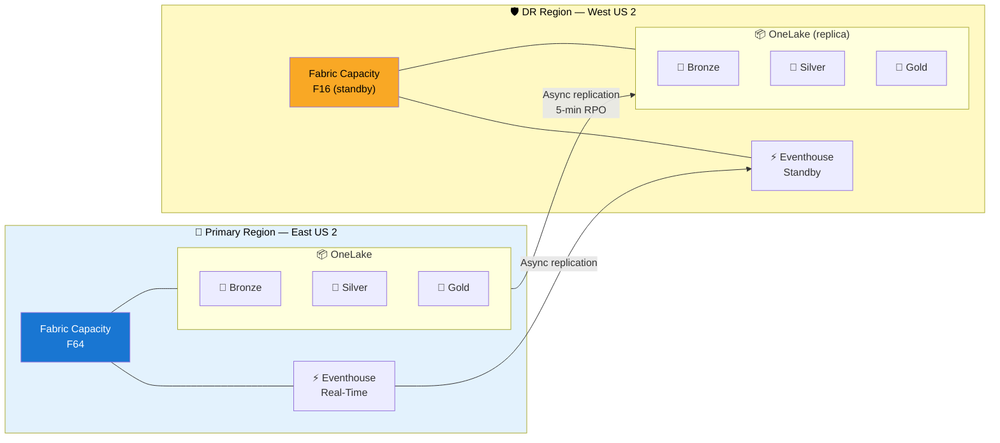
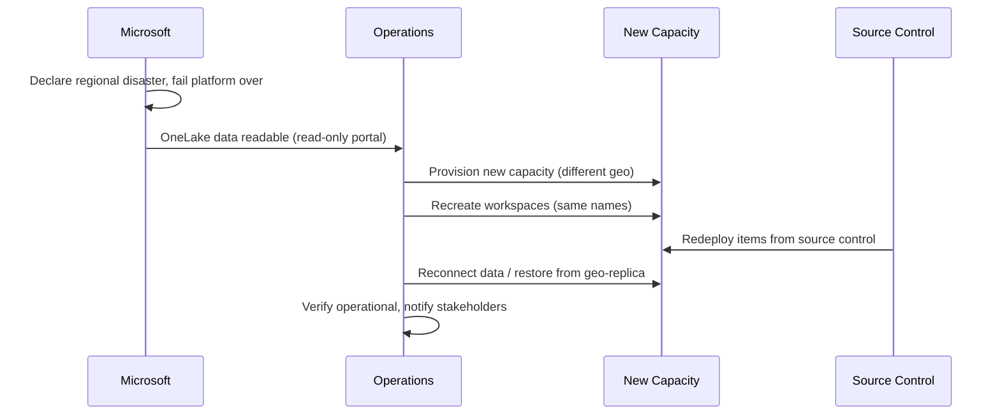

# 🔄 Disaster Recovery & Business Continuity {#disaster-recovery--business-continuity}

> **Last Updated**: 2026-09-15 | **Version**: 2.1
> **Status**: ✅ Final | **Maintainer**: Documentation Team

<div align="center" markdown>


</div>

---

## 🎯 Overview

This document outlines the disaster recovery (DR) and business continuity (BC) strategy for the Microsoft Fabric Casino Analytics platform. Gaming operations require high availability and rapid recovery to meet regulatory requirements and minimize business impact.

!!! warning "Read this first — scope of this page"
    This is the **casino-POC operational runbook**: backup/export patterns, Delta
    time-travel recovery, monitoring, and a testing schedule. For **how Fabric's
    platform-level DR actually behaves** — what Microsoft fails over vs. what you
    must rebuild, what is read-only after a regional failover, and the supported
    DR patterns — see [Fabric DR — Authoritative Answers](best-practices/fabric-dr-authoritative-answers.md),
    which is the source of truth for platform behavior. Where this page and that
    one differ, that one wins.

---

## ⏱️ Recovery Objectives

!!! info "These are POC targets, not platform guarantees"
    Microsoft does **not** publish RTO/RPO figures for Fabric. The values below
    are **targets this POC sets for itself** and must be validated by running the
    DR drills in the [Testing Schedule](#-testing-schedule). Treat them as
    contractual/internal objectives, not as a Microsoft SLA. See
    [Fabric DR — Authoritative Answers](best-practices/fabric-dr-authoritative-answers.md)
    for what Microsoft does and does not commit to.

### Recovery Time Objective (RTO)

| System Component | RTO | Priority |
|-----------------|-----|----------|
| Real-Time Analytics (Eventhouse) | 15 minutes | Critical |
| Gold Layer (BI Reports) | 1 hour | High |
| Silver Layer (Cleansed Data) | 4 hours | Medium |
| Bronze Layer (Raw Data) | 8 hours | Medium |
| Historical Analytics | 24 hours | Low |

### Recovery Point Objective (RPO)

| Data Type | RPO | Backup Frequency |
|-----------|-----|------------------|
| Slot Telemetry | 5 minutes | Continuous replication |
| Financial Transactions | 0 minutes | Synchronous |
| Player Profiles | 1 hour | Hourly snapshots |
| Aggregated Metrics | 4 hours | Incremental |
| Reference Data | 24 hours | Daily |

---

## 🏗️ Architecture: Multi-Region Deployment



---

## 💾 Backup Strategy

### OneLake Data Protection

#### Delta Lake Time Travel

Delta tables automatically maintain version history, enabling point-in-time recovery.

```python
# Restore to specific version
spark.read.format("delta") \
    .option("versionAsOf", 42) \
    .table("bronze_slot_telemetry")

# Restore to timestamp
spark.read.format("delta") \
    .option("timestampAsOf", "2024-01-15 10:00:00") \
    .table("bronze_slot_telemetry")
```

**Retention Settings:**
```sql
-- Configure retention for each table
ALTER TABLE bronze_slot_telemetry
SET TBLPROPERTIES ('delta.logRetentionDuration' = '30 days');

ALTER TABLE bronze_slot_telemetry
SET TBLPROPERTIES ('delta.deletedFileRetentionDuration' = '7 days');
```

#### Cross-Region Replication

OneLake geo-replication is **not configured per-workspace in Bicep** — there is no
`Microsoft.Fabric/replicationPolicies` resource. It is the **capacity-level disaster
recovery setting**, toggled in the Fabric portal (or via the Fabric Admin REST API):

1. Fabric portal → **Admin portal** → **Capacity settings** → select the capacity.
2. Under **Disaster recovery**, turn the setting **on**.
3. Note the **30-day lock**: after changing the setting you must wait 30 days before
   changing it again.

Once enabled, OneLake data in that capacity's workspaces is geo-replicated to the
Azure-paired region asynchronously. There is **no per-item include-list and no
customer-set replication frequency** — replication cadence is Microsoft-managed.

!!! warning "Cost"
    Enabling DR bills **BCDR Storage** plus **higher write CU consumption** (visible
    as separate line items in the Capacity Metrics app). See
    [OneLake consumption](https://learn.microsoft.com/fabric/onelake/onelake-consumption#disaster-recovery).

For what is and isn't covered by this replication (and what stays read-only after a
failover), see [Fabric DR — Authoritative Answers](best-practices/fabric-dr-authoritative-answers.md).

### Eventhouse Backup

```kql
// Export critical tables to external storage
.export to csv (
    h@"https://drbackupstorage.blob.core.windows.net/eventhouse-backup"
)
<| SlotTelemetry
| where ingestion_time() > ago(24h)
```

### Power BI Artifacts

```powershell
# Export Power BI workspace to PBIP format
# Run weekly or after significant changes

$workspace = Get-PowerBIWorkspace -Name "Casino-Analytics-Prod"
$reports = Get-PowerBIReport -WorkspaceId $workspace.Id

foreach ($report in $reports) {
    Export-PowerBIReport -Id $report.Id -OutFile "backup/reports/$($report.Name).pbix"
}
```

---

## 🔀 Failover Procedures

### Scenario 1: Primary Region Failure

!!! warning "Fabric regional failover is Microsoft-declared, not customer-triggered"
    You **cannot** self-initiate a Fabric regional failover, and there is **no
    customer-controlled DNS / Traffic Manager cutover** for the Fabric service.
    When Microsoft declares a regional disaster it fails the *platform* over so
    you can sign in and read geo-replicated OneLake data — but **workspaces,
    pipelines, notebooks, and reports are not operational** until you rebuild
    them on a new capacity. The steps below are the **customer-executed rebuild**
    you perform after (or in anticipation of) that Microsoft-led failover. See
    [Fabric DR — Authoritative Answers](best-practices/fabric-dr-authoritative-answers.md)
    for the full component-by-component breakdown.

**Trigger Criteria:**
- Primary region unavailable > 10 minutes
- Azure status confirms regional outage
- Automated health check failures

**Customer Recovery Steps (after Microsoft-led failover):**



**Detailed Steps:**

1. **Verify Outage (5 min)**
   ```bash
   # Check Azure status
   az rest --method get --url "https://status.azure.com/api/v2/status.json"

   # Verify Fabric capacity
   az rest --method get \
     --url "https://api.fabric.microsoft.com/v1/capacities/{capacityId}"
   ```

2. **Provision a new capacity in a different geo (10–30 min)**

   During a regional incident, demand for compute in the *paired* region spikes —
   a **different geo** is more likely to have available capacity. Create a fresh
   capacity rather than assuming a standby exists:
   ```bash
   az rest --method put \
     --url "https://management.azure.com/subscriptions/{sub}/resourceGroups/{rg}/providers/Microsoft.Fabric/capacities/fabric-casino-dr" \
     --body '{
       "location": "westus2",
       "sku": {"name": "F64", "tier": "Fabric"},
       "properties": {"administration": {"members": ["admin@contoso.com"]}}
     }'
   ```

3. **Recreate workspaces with the SAME names, then redeploy items from Git**

   Same names are required for recovery scripts to resolve item references.
   Redeploy Git-tracked items (notebooks, pipelines, semantic models, reports,
   warehouse definitions) from source control — this project's
   `scripts/fabric-cicd-deploy.py` does exactly this. **Data is the exception:**
   Git holds *definitions*, not table contents.

4. **Reconnect data from the geo-replicated OneLake copy**

   Point the redeployed lakehouses/warehouses at the geo-replicated OneLake data
   (readable via the ADLS Gen2 API / OneLake tools through the global endpoint).
   For anything stored **outside** OneLake (e.g. KQL Database), restore from your
   own backup — it is not covered by OneLake geo-replication.
   ```python
   # Sanity-check data currency after reconnect
   df = spark.table("lh_bronze.bronze_slot_telemetry")
   last_record = df.agg(max("_ingestion_timestamp")).collect()[0][0]
   print(f"Last available record: {last_record}")
   # Compare against your RPO target — actual lag is Microsoft-managed, not guaranteed
   ```

5. **Verify Operational (10 min)**
   - Confirm Power BI reports load against the rebuilt semantic models
   - Verify real-time dashboard data flow (Eventhouse reconnected)
   - Test data pipeline execution
   - Notify stakeholders

### Scenario 2: Data Corruption

**Trigger Criteria:**
- Data quality alerts fired
- Invalid data in Gold layer
- User-reported data issues

**Recovery Steps:**

1. **Identify Corruption Scope**
   ```python
   # Find affected partitions
   corrupted = spark.table("gold.fact_daily_slot_performance") \
     .filter("hold_percentage < -100 or hold_percentage > 100") \
     .select("play_date").distinct()

   print(f"Affected dates: {corrupted.collect()}")
   ```

2. **Restore from Delta History**
   ```python
   # Find last good version
   history = spark.sql("DESCRIBE HISTORY gold.fact_daily_slot_performance")
   history.show(10)

   # Restore specific version
   spark.sql("""
     RESTORE TABLE gold.fact_daily_slot_performance
     TO VERSION AS OF 42
   """)
   ```

3. **Reprocess from Silver**
   ```python
   # If needed, reprocess Gold from Silver
   # Trigger Gold layer notebook for affected dates
   ```

### Scenario 3: Capacity Failure

**Recovery Steps:**

1. **Create New Capacity**
   ```bash
   az rest --method put \
     --url "https://management.azure.com/subscriptions/{sub}/resourceGroups/{rg}/providers/Microsoft.Fabric/capacities/fabric-casino-recovery" \
     --body '{
       "location": "eastus2",
       "sku": {"name": "F64", "tier": "Fabric"},
       "properties": {"administration": {"members": ["admin@contoso.com"]}}
     }'
   ```

2. **Reassign Workspaces**
   ```powershell
   # Reassign workspaces to new capacity
   Set-PowerBIWorkspace -Id $workspaceId -CapacityId $newCapacityId
   ```

---

## 📡 Monitoring & Alerting

### Health Check Queries

```kql
// Eventhouse health check
SlotTelemetry
| where ingestion_time() > ago(5m)
| summarize RecordCount = count(), LastRecord = max(EventTimestamp)
| extend IsHealthy = RecordCount > 0 and LastRecord > ago(5m)
```

### Alert Configuration

```json
{
  "alertRules": [
    {
      "name": "DataIngestionLag",
      "condition": "LastIngestion > 10 minutes ago",
      "severity": "Critical",
      "action": "PageOnCall"
    },
    {
      "name": "ReplicationLag",
      "condition": "DRLag > 15 minutes",
      "severity": "High",
      "action": "NotifyOps"
    },
    {
      "name": "CapacityUtilization",
      "condition": "CPUPercent > 90 for 5 minutes",
      "severity": "Warning",
      "action": "AutoScale"
    }
  ]
}
```

---

## 🧪 Testing Schedule

!!! note "What 'DR test' means here"
    A Microsoft-declared regional failover **cannot be self-triggered**, so these
    drills exercise the **customer-owned rebuild** (provision capacity → redeploy
    from Git → reconnect data → verify), not Microsoft's platform failover. That
    is the part you control and the part worth measuring.

| Test Type | Frequency | Duration | Participants |
|-----------|-----------|----------|--------------|
| Backup Verification | Weekly | 2 hours | Data Engineering |
| Delta Time Travel | Monthly | 4 hours | Data Engineering |
| Recovery Rebuild Drill (scripted) | Quarterly | 8 hours | Full Team |
| Recovery Rebuild Drill (unannounced) | Annually | 4 hours | Full Team |
| Full Recovery (end-to-end) | Annually | 24 hours | Full Team + Mgmt |

### Test Checklist

```markdown
## DR Test Checklist

### Pre-Test
- [ ] Notify stakeholders
- [ ] Verify DR capacity available
- [ ] Document current primary state
- [ ] Confirm test window

### During Test
- [ ] Execute the customer rebuild runbook (provision capacity, redeploy from Git, reconnect data)
- [ ] Verify data accessibility
- [ ] Test report generation
- [ ] Validate real-time ingestion
- [ ] Test data pipeline execution
- [ ] Measure actual RTO against target

### Post-Test
- [ ] Document findings
- [ ] Calculate actual RTO/RPO vs. target
- [ ] Tear down the drill capacity (or hand back to primary)
- [ ] Verify primary operational
- [ ] Update procedures if needed
- [ ] Stakeholder debrief
```

---

## 📞 Contact Information

### Escalation Path

| Level | Role | Contact | Response Time |
|-------|------|---------|---------------|
| L1 | On-Call Engineer | PagerDuty | 5 minutes |
| L2 | Platform Lead | Teams/Phone | 15 minutes |
| L3 | Architecture Team | Teams/Phone | 30 minutes |
| L4 | VP Engineering | Phone | 1 hour |
| Vendor | Microsoft Support | Premier Support | Per SLA |

### Communication Templates

**Initial Incident:**
```
INCIDENT: [Brief description]
IMPACT: [User/business impact]
STATUS: [Investigating/Identified/Resolved]
NEXT UPDATE: [Time]
```

**Resolution:**
```
RESOLVED: [Brief description]
ROOT CAUSE: [What happened]
IMPACT DURATION: [Start - End]
DATA LOSS: [None/Describe]
FOLLOW-UP: [Actions]
```

---

## 📋 Regulatory Compliance

### Gaming Commission Requirements

- **Data Retention:** 7 years minimum for all gaming data
- **Audit Trail:** Complete transaction history must be recoverable
- **Recovery Demonstration:** Quarterly DR test documentation required
- **Notification:** Regulators must be notified of any data loss > 24 hours

### Compliance Checklist

- [ ] DR plan approved by compliance officer
- [ ] Quarterly DR tests documented
- [ ] Annual DR plan review
- [ ] Regulator notification procedures tested
- [ ] Audit trail recovery verified

---

## 📚 Related Documentation

| Document | Description |
|----------|-------------|
| [🧭 Fabric DR — Authoritative Answers](best-practices/fabric-dr-authoritative-answers.md) | **Source of truth** for platform-level DR behavior |
| [🛡️ Disaster Recovery & BCDR](best-practices/disaster-recovery-bcdr.md) | BCDR patterns and options |
| [🔀 Multi-Region Failover runbook](runbooks/multi-region-failover.md) | Operational failover steps |
| [🔄 DR Execution runbook](runbooks/disaster-recovery-execution.md) | DR execution steps |
| [🏗️ Architecture](architecture.md) | System architecture and design |
| [🔐 Security Guide](security.md) | Security controls and compliance |
| [🚀 Deployment Guide](deployment.md) | Infrastructure deployment |

---

[⬆️ Back to Top](#disaster-recovery--business-continuity) | [📚 Docs](index.md) | [🏠 Home](index.md)

---

> 📖 **Documentation maintained by:** Frank Garofalo
> 🔗 **Repository:** [Supercharge_Microsoft_Fabric](https://github.com/fgarofalo56/Supercharge_Microsoft_Fabric)
