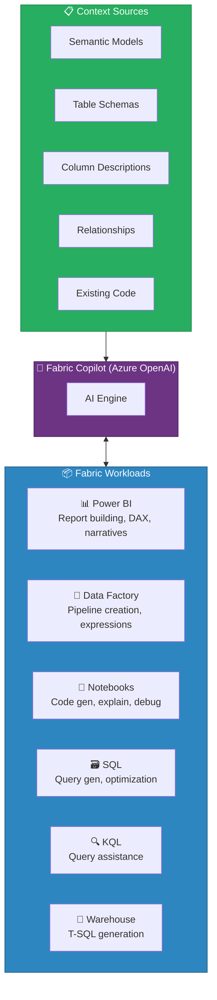
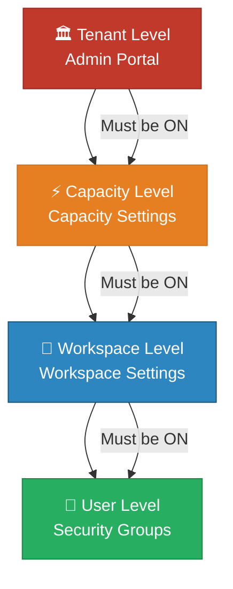
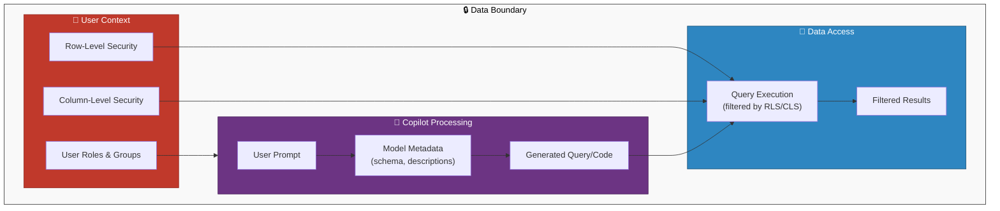

# 🤖 AI Copilot Configuration & Setup

<div align="center" markdown>

**Enterprise-Grade AI Assistance Across Microsoft Fabric Workloads**


</div>

---

**Last Updated:** `2026-03-12` | **Version:** 1.0.0

---

## 🎯 Overview

Copilot in Microsoft Fabric provides AI-powered assistance across every major workload in the platform. It leverages Azure OpenAI models to help users generate code, build reports, create pipelines, write queries, and explain data -- all within the context of their specific workspace and data model.

### Copilot Across Fabric Workloads



### Key Principles

| Principle | Description |
|-----------|-------------|
| **Context-Aware** | Copilot uses your data model, schemas, and descriptions to generate relevant responses |
| **Security-Respecting** | Copilot respects RLS, CLS, and workspace permissions -- it never reveals data a user cannot access |
| **Workload-Specific** | Each Copilot experience is tuned for its workload (DAX for Power BI, PySpark for Notebooks, etc.) |
| **Iterative** | Copilot supports conversational refinement of generated outputs |
| **Auditable** | All Copilot interactions are logged in the Fabric audit log |

---

## ⚙️ Enabling Copilot

Copilot must be enabled at multiple levels before users can access it. Follow this hierarchy from top to bottom.

### Enablement Hierarchy



### Level 1: Tenant-Level Settings (Admin Portal)

Navigate to the Fabric Admin Portal to configure tenant-wide Copilot settings:

> **Admin Portal → Tenant Settings → Copilot and Azure OpenAI Service**

| Setting | Status | Apply to | Notes |
|---|---|---|---|
| Users can use Copilot and other features powered by Azure OpenAI | Enabled / Disabled | Entire org / specific security groups | Exclude option available |
| Data sent to Azure OpenAI can be processed outside your capacity's geographic region, US, and EU data boundary | Enabled / Disabled | — | ⚠️ **Disable for FedRAMP / FISMA workloads** |
| Users can use Fabric IQ for natural language queries | Enabled / Disabled | Entire org / specific security groups | — |

> ⚠️ **Warning**: For federal agency workloads (USDA, SBA, NOAA, EPA, DOI, DOT/FAA), ensure the data residency setting is configured to keep data within the US boundary. Cross-region processing may violate FedRAMP and FISMA requirements.

### Level 2: Capacity-Level Settings

Each Fabric capacity can independently enable or disable Copilot:

```
Capacity Settings → Copilot
  ├── Enable Copilot for this capacity: [On / Off]
  └── Note: Requires F2 or higher SKU (Copilot not available on F1)
```

| SKU | Copilot Available | Notes |
|-----|-------------------|-------|
| F2 | Yes | Minimum for Copilot |
| F4 - F32 | Yes | Standard Copilot experience |
| F64 (This POC) | Yes | Full Copilot with all features |
| F128+ | Yes | Enterprise-scale Copilot |
| Trial | Limited | Preview features only |

### Level 3: Workspace-Level Settings

Each workspace can control Copilot availability:

```
Workspace Settings → General → Copilot and Azure OpenAI
  ├── Allow Copilot and other AI features: [On / Off]
  └── Default: Inherits from capacity setting
```

### Level 4: User-Level Access

Control which users can access Copilot through Entra ID security groups:

```
Recommended Security Group Structure:
├── sg-fabric-copilot-all          (All Copilot users)
│   ├── sg-fabric-copilot-pbi      (Power BI Copilot users)
│   ├── sg-fabric-copilot-de       (Data Engineering Copilot users)
│   ├── sg-fabric-copilot-sql      (SQL/KQL Copilot users)
│   └── sg-fabric-copilot-admin    (Full Copilot access)
├── sg-fabric-copilot-excluded     (Users excluded from Copilot)
```

### Verification Checklist

| Step | Action | Verified |
|------|--------|----------|
| 1 | Tenant setting enabled in Admin Portal | [ ] |
| 2 | Data residency configured per compliance needs | [ ] |
| 3 | Capacity SKU is F2 or higher | [ ] |
| 4 | Capacity-level Copilot enabled | [ ] |
| 5 | Workspace-level Copilot enabled | [ ] |
| 6 | User is member of appropriate security group | [ ] |
| 7 | User has at least Viewer role in workspace | [ ] |

---

## 📊 Copilot per Workload

### 📊 Power BI Copilot

Power BI Copilot is the most user-facing Copilot experience, helping report builders and consumers interact with data through natural language.

#### Capabilities

| Feature | Description | Typical User |
|---------|-------------|-------------|
| **Report Building** | "Create a report showing slot revenue by floor" | Report Author |
| **DAX Generation** | "Write a measure for year-over-year revenue growth" | Data Modeler |
| **Narrative Summaries** | Auto-generate text explaining report visuals | Report Consumer |
| **Visual Suggestions** | Recommend chart types for selected data | Report Author |
| **Q&A / Fabric IQ** | Natural language queries in reports | Report Consumer |
| **Page Summarization** | "Summarize the insights on this page" | Executive |

#### DAX Generation Examples

**Casino Domain:**

```
User: "Create a DAX measure for casino hold percentage"

Copilot generates:
```

```dax
Hold Percentage =
DIVIDE(
    SUMX(
        'SlotPerformance',
        'SlotPerformance'[CoinIn] - 'SlotPerformance'[CoinOut]
    ),
    SUM('SlotPerformance'[CoinIn]),
    0
) * 100
```

```
User: "Now create one for month-over-month change in hold percentage"

Copilot generates:
```

```dax
Hold Pct MoM Change =
VAR CurrentMonth = [Hold Percentage]
VAR PreviousMonth =
    CALCULATE(
        [Hold Percentage],
        DATEADD('Date'[Date], -1, MONTH)
    )
RETURN
    DIVIDE(CurrentMonth - PreviousMonth, PreviousMonth, 0) * 100
```

**Federal Domain:**

```
User: "Create a measure showing total USDA crop production with year-over-year comparison"

Copilot generates:
```

```dax
Crop Production YoY =
VAR CurrentYear = SUM('CropProduction'[ProductionValue])
VAR PreviousYear =
    CALCULATE(
        SUM('CropProduction'[ProductionValue]),
        SAMEPERIODLASTYEAR('Date'[Date])
    )
RETURN
    IF(
        NOT ISBLANK(PreviousYear),
        DIVIDE(CurrentYear - PreviousYear, PreviousYear, 0) * 100,
        BLANK()
    )
```

#### Narrative Visual Configuration

```
Add Narrative Visual to Report:
  1. Insert → Narrative Smart Visual
  2. Configure:
     ├── Summary type: [Auto / Custom prompt]
     ├── Custom prompt: "Summarize key slot performance trends,
     │    highlighting any machines below 5% hold percentage
     │    and comparing to last week"
     ├── Tone: [Professional / Casual / Executive]
     ├── Length: [Short / Medium / Detailed]
     └── Refresh: [With report / On demand]
```

### 🔄 Data Factory Copilot

Data Factory Copilot helps data engineers build and debug pipelines and dataflows.

#### Capabilities

| Feature | Description |
|---------|-------------|
| **Pipeline Authoring** | "Create a pipeline that copies data from USDA API to Bronze lakehouse" |
| **Expression Help** | Generate Data Factory expressions for complex transformations |
| **Error Debugging** | Explain pipeline failures and suggest fixes |
| **Dataflow Suggestions** | Recommend transformations based on source and target schemas |
| **Schedule Configuration** | Help set up optimal refresh schedules |

#### Example: Pipeline Creation

```
User: "Create a pipeline to ingest USDA crop production data daily"

Copilot scaffolds:
  Pipeline: pl-usda-crop-production-daily
  ├── Web Activity: Call USDA NASS QuickStats API
  │   ├── URL: https://quickstats.nass.usda.gov/api/api_GET/
  │   ├── Method: GET
  │   └── Parameters: source_desc=SURVEY&sector_desc=CROPS&...
  ├── Copy Activity: API Response → Bronze Lakehouse
  │   ├── Source: Web Activity output
  │   ├── Sink: lh_bronze.bronze_usda_crop_production
  │   └── Format: Delta
  ├── Notebook Activity: Run silver transformation
  │   └── Notebook: nb-silver-usda-crop-production
  └── On Failure: Send email notification
```

### 📓 Notebook Copilot

Notebook Copilot assists data engineers and scientists with code generation, explanation, and debugging within Fabric notebooks.

#### Capabilities

| Feature | Description | Languages |
|---------|-------------|-----------|
| **Code Generation** | Generate PySpark, SQL, or Python from natural language | PySpark, Python, SQL, Scala, R |
| **Code Explanation** | Explain what existing code does in plain language | All |
| **Bug Detection** | Identify and fix errors in code | All |
| **Optimization** | Suggest performance improvements | PySpark, SQL |
| **Documentation** | Generate docstrings and comments | All |
| **Chat Interface** | Conversational code assistance in side panel | All |

#### Example: PySpark Code Generation

```
User: "Read the bronze USDA crop production table, filter for corn in the
       top 5 producing states, calculate year-over-year production change,
       and write to silver layer"

Copilot generates:
```

```python
from pyspark.sql import functions as F
from pyspark.sql.window import Window

# Read bronze table
df_bronze = spark.read.format("delta").load(
    "Tables/bronze_usda_crop_production"
)

# Top 5 corn-producing states (by most recent year)
top_states = (
    df_bronze
    .filter(F.col("commodity_desc") == "CORN")
    .filter(F.col("statisticcat_desc") == "PRODUCTION")
    .groupBy("state_name")
    .agg(F.sum("value").alias("total_production"))
    .orderBy(F.desc("total_production"))
    .limit(5)
    .select("state_name")
    .rdd.flatMap(lambda x: x)
    .collect()
)

# Filter and calculate YoY change
window_spec = Window.partitionBy("state_name").orderBy("year")

df_silver = (
    df_bronze
    .filter(F.col("commodity_desc") == "CORN")
    .filter(F.col("statisticcat_desc") == "PRODUCTION")
    .filter(F.col("state_name").isin(top_states))
    .withColumn("prev_year_production",
                F.lag("value").over(window_spec))
    .withColumn("yoy_change_pct",
                F.when(F.col("prev_year_production").isNotNull(),
                       ((F.col("value") - F.col("prev_year_production"))
                        / F.col("prev_year_production") * 100))
                .otherwise(None))
    .withColumn("processed_timestamp", F.current_timestamp())
)

# Write to silver layer
df_silver.write.format("delta").mode("overwrite").save(
    "Tables/silver_usda_corn_production_yoy"
)

print(f"Silver table written: {df_silver.count()} rows for states: {top_states}")
```

### 🗃️ SQL Copilot

SQL Copilot assists with T-SQL query generation and optimization in Fabric Warehouse and SQL analytics endpoints.

#### Capabilities

| Feature | Description |
|---------|-------------|
| **Query Generation** | Generate SELECT, INSERT, UPDATE queries from natural language |
| **Schema Exploration** | "What tables contain player information?" |
| **Query Optimization** | Analyze execution plans and suggest improvements |
| **DDL Generation** | Create table definitions, views, and stored procedures |
| **Data Profiling** | Generate queries to profile data quality and distributions |

#### Example: Cross-Domain Query

```
User: "Write a query that joins casino player data with SBA loan data
       to find players who are also small business owners in the same state"

Copilot generates:
```

```sql
-- Cross-domain analysis: Casino players who are SBA loan recipients
-- Note: This query requires appropriate cross-workspace access permissions
SELECT
    p.player_id,
    p.player_name,
    p.state AS player_state,
    p.loyalty_tier,
    p.lifetime_value,
    s.loan_number,
    s.business_name,
    s.loan_amount,
    s.approval_date,
    s.jobs_reported
FROM gold_player_value p
INNER JOIN silver_sba_7a_loans s
    ON p.state = s.borrower_state
    AND p.player_name = s.borrower_name  -- Approximate match
WHERE p.loyalty_tier IN ('Gold', 'Platinum')
ORDER BY p.lifetime_value DESC;
```

> ⚠️ **Warning**: Cross-domain joins like the example above require careful data governance review. Ensure that joining PII across domains complies with your organization's data use policies and applicable regulations.

### 🔍 KQL Copilot

KQL Copilot assists with writing and optimizing Kusto Query Language queries in Eventhouse.

#### Capabilities

| Feature | Description |
|---------|-------------|
| **KQL Generation** | Generate KQL from natural language descriptions |
| **Query Explanation** | Explain complex KQL queries in plain language |
| **Optimization** | Suggest query performance improvements |
| **Function Creation** | Generate stored functions from descriptions |
| **Schema Exploration** | Navigate Eventhouse table structures |

#### Example: Anomaly Detection Query

```
User: "Write a KQL query to detect anomalous spikes in slot machine
       error rates over the past 7 days, grouped by floor location"

Copilot generates:
```

```kql
// Detect anomalous error rate spikes by floor location
let lookback = 7d;
let bin_size = 1h;
let sensitivity = 1.5;  // Lower = more sensitive
SlotTelemetryRaw
| where Timestamp > ago(lookback)
| summarize
    TotalEvents = count(),
    ErrorCount = countif(EventType == "error")
    by FloorLocation, bin(Timestamp, bin_size)
| extend ErrorRate = round(todouble(ErrorCount) / TotalEvents * 100, 2)
| order by FloorLocation asc, Timestamp asc
| make-series ErrorRate = avg(ErrorRate)
    on Timestamp
    step bin_size
    by FloorLocation
| extend (anomalies, score, baseline) =
    series_decompose_anomalies(ErrorRate, sensitivity)
| mv-expand
    Timestamp to typeof(datetime),
    ErrorRate to typeof(double),
    anomalies to typeof(int),
    score to typeof(double),
    baseline to typeof(double)
| where anomalies == 1  // Positive anomalies (spikes)
| project FloorLocation, Timestamp, ErrorRate, baseline, score
| order by score desc
```

---

## 📐 Configuration Best Practices

### Semantic Model Preparation

The single most impactful thing you can do to improve Copilot accuracy is to prepare your semantic model with rich metadata.

#### Naming Conventions That Help Copilot

| Category | Bad Name | Good Name | Why |
|----------|----------|-----------|-----|
| Table | `tbl_sl_perf` | `SlotPerformance` | Copilot maps NL terms to table names |
| Column | `ci` | `CoinIn` | Descriptive names enable accurate mapping |
| Measure | `m1` | `Total Revenue` | Copilot uses measure names in NL responses |
| Folder | (ungrouped) | `Financial Metrics` | Organization helps Copilot categorize |
| Relationship | (unnamed) | `Machine → Performance` | Named relationships improve join logic |

#### Description Guidelines

Write descriptions as if explaining to a new team member who has domain knowledge but no knowledge of your data model:

```yaml
# Table Description Template
table: gold_slot_performance
description: >
  Daily aggregated slot machine performance metrics. One row per machine per gaming day.
  Contains financial metrics (coin-in, coin-out, hold percentage), utilization metrics
  (hours played, session count), and maintenance flags. Source: Silver layer slot telemetry.
  Refresh: Daily at 4:00 AM ET. Grain: Machine + Date.

# Column Description Template
column: hold_pct
description: >
  Casino hold percentage - the portion of wagered money retained by the casino.
  Formula: (CoinIn - CoinOut) / CoinIn * 100.
  Normal range: 2-15%. Values outside this range may indicate machine issues.
  Business context: Higher hold = more revenue per dollar wagered.
```

#### Measure Descriptions

```dax
-- Include descriptions as DAX comments AND in the model metadata
-- Both help Copilot understand intent

// Measure: Total Revenue
// Description: Total net gaming revenue across all slot machines.
//   Calculated as CoinIn minus CoinOut (casino win).
//   Use for: Financial dashboards, floor performance analysis.
//   Time intelligence: Supports YoY, MoM, WoW comparisons.
//   Related measures: Hold Percentage, Average Daily Revenue
Total Revenue =
    SUMX(
        'SlotPerformance',
        'SlotPerformance'[CoinIn] - 'SlotPerformance'[CoinOut]
    )
```

### Column-Level Documentation Checklist

| Column Attribute | Required | Example |
|-----------------|----------|---------|
| **Description** | Yes | "Unique slot machine identifier (format: SL-XXXX)" |
| **Display Name** | Recommended | "Machine ID" (vs. raw column name `machine_id`) |
| **Data Type** | Auto-detected | Verify correct types (especially dates) |
| **Format String** | Recommended | "$#,##0.00" for currency, "0.0%" for percentages |
| **Summarize By** | Recommended | Set to "None" for dimension columns |
| **Sort By Column** | If applicable | Sort month name by month number |
| **Data Category** | If applicable | "City", "State", "Country", "URL", "Image URL" |

### Workspace Organization for Copilot

```
Recommended Workspace Structure:
ws-gaming-domain/
├── Lakehouses/
│   ├── lh_bronze      (Raw data - minimal Copilot interaction)
│   ├── lh_silver      (Cleansed - Copilot-ready with descriptions)
│   └── lh_gold        (Business ready - primary Copilot target)
├── Semantic Models/
│   ├── sm_gaming_ops   (Fully documented - Power BI Copilot)
│   └── sm_compliance   (RLS enforced - restricted Copilot)
├── Reports/
│   ├── rpt_floor_ops   (Copilot-enabled for consumers)
│   └── rpt_compliance  (Copilot with RLS filters)
├── Notebooks/
│   ├── nb_silver_*     (Copilot for code gen)
│   └── nb_gold_*       (Copilot for code gen)
└── Eventhouses/
    └── evh_operations  (KQL Copilot for queries)
```

---

## 🔐 Security and Compliance

### Data Boundary Architecture



### RLS/CLS with Copilot

Copilot queries are executed in the security context of the requesting user. This means:

| Security Feature | Copilot Behavior |
|-----------------|-----------------|
| **Row-Level Security** | Generated queries only return rows the user can access |
| **Column-Level Security** | Masked/hidden columns are not visible to Copilot |
| **Object-Level Security** | Hidden tables/measures are not available to Copilot |
| **Workspace Permissions** | Copilot only accesses items the user has permissions for |
| **Sensitivity Labels** | Copilot respects Microsoft Purview sensitivity labels |

> 💡 **Tip**: Test Copilot responses under each RLS role to verify that restricted data is not leaked through AI-generated narratives or summaries.

### Audit Logging

All Copilot interactions are captured in the Fabric unified audit log:

```kql
// Query Copilot audit events
search in (FabricAuditLogs)
    "CopilotInteraction"
| where TimeGenerated > ago(7d)
| project
    TimeGenerated,
    UserId,
    WorkspaceName,
    WorkloadName,
    Activity,
    CopilotPrompt = tostring(parse_json(AdditionalInfo).prompt),
    CopilotResponse = tostring(parse_json(AdditionalInfo).response_type),
    DataAccessed = tostring(parse_json(AdditionalInfo).tables_accessed)
| order by TimeGenerated desc
```

### Data Residency Configuration

For federal compliance workloads:

| Compliance Framework | Data Residency Requirement | Copilot Setting |
|---------------------|---------------------------|-----------------|
| **FedRAMP** | Data must remain within US boundaries | Disable cross-region processing |
| **FISMA** | Government data stays in authorized regions | Disable cross-region processing |
| **HIPAA** | PHI processing within contracted regions | Disable cross-region; verify BAA |
| **PCI DSS** | Cardholder data in approved environments | Disable cross-region processing |
| **42 CFR Part 2** | Substance abuse data has strict handling | Consider disabling Copilot for this workspace |
| **ITAR** | Defense data cannot leave US | Disable Copilot or use GovCloud |

```
Admin Portal → Tenant Settings → Copilot and Azure OpenAI Service
  → "Data sent to Azure OpenAI can be processed outside your
     capacity's geographic region, US, and EU data boundary"
  → Set to: DISABLED for federal workloads
```

### Opting Out of Data Collection

Organizations can control how Copilot data is used:

```
Admin Portal → Tenant Settings → Copilot
  ├── Allow Microsoft to use Copilot data to improve Fabric Copilot
  │   └── Set to: DISABLED for sensitive/federal workloads
  └── Log Copilot interactions for admin review
      └── Set to: ENABLED for compliance tracking
```

---

## 🏢 Enterprise Rollout

### Phased Enablement Strategy

```mermaid
flowchart LR
    subgraph Phase1["📋 Phase 1: Pilot (Weeks 1-4)"]
        P1A["Enable for IT/Data team only"]
        P1B["Test with non-sensitive data"]
        P1C["Document findings"]
    end

    subgraph Phase2["📋 Phase 2: Expand (Weeks 5-8)"]
        P2A["Enable for power users"]
        P2B["Add domain workspaces"]
        P2C["RLS/CLS validation"]
    end

    subgraph Phase3["📋 Phase 3: General (Weeks 9-12)"]
        P3A["Enable for all users"]
        P3B["Full workspace rollout"]
        P3C["Monitoring & optimization"]
    end

    Phase1 --> Phase2 --> Phase3

    style Phase1 fill:#E67E22,stroke:#CA6F1E,color:#fff
    style Phase2 fill:#2E86C1,stroke:#1A5276,color:#fff
    style Phase3 fill:#27AE60,stroke:#1E8449,color:#fff
```



#### Phase 1: Pilot (Weeks 1-4)

| Task | Owner | Deliverable |
|------|-------|-------------|
| Enable tenant settings (restricted to IT group) | Fabric Admin | Tenant configured |
| Test Power BI Copilot with gaming semantic model | BI Team | Accuracy report |
| Test Notebook Copilot with PySpark transforms | Data Engineering | Code quality assessment |
| Test KQL Copilot with Eventhouse queries | Streaming Team | Query accuracy report |
| Validate RLS enforcement with Copilot | Security Team | RLS compliance sign-off |
| Document prompt patterns that work well | All Teams | Prompt library v1 |

#### Phase 2: Expand (Weeks 5-8)

| Task | Owner | Deliverable |
|------|-------|-------------|
| Add domain power users to Copilot security group | Fabric Admin | User access expanded |
| Enable per-domain workspaces (USDA, EPA, NOAA) | Workspace Admins | Domain coverage |
| Add semantic model descriptions across all domains | Data Modeling | Metadata completeness |
| Test cross-domain scenarios | Data Engineering | Cross-domain report |
| Build training materials | Training Team | User guides |
| Configure audit logging and monitoring | Security | Audit dashboard |

#### Phase 3: General Availability (Weeks 9-12)

| Task | Owner | Deliverable |
|------|-------|-------------|
| Enable for all authorized users | Fabric Admin | Full rollout |
| Deploy training materials organization-wide | Training Team | Training complete |
| Set up Copilot usage monitoring dashboard | BI Team | Monitoring live |
| Establish feedback loop for accuracy improvement | All Teams | Continuous improvement |
| Review first-month usage metrics and ROI | Management | ROI report |

### Training Materials

#### Prompt Engineering Tips for End Users

| Do | Don't |
|----|-------|
| Be specific: "total slot revenue by floor for last 7 days" | Be vague: "show me data" |
| Reference known terms: "hold percentage" | Use ambiguous terms: "profit margin" |
| Include time context: "this month", "Q1 2026" | Leave time undefined: "recently" |
| Specify the output: "as a bar chart" | Assume output format |
| Iterate: "now break that down by denomination" | Restart from scratch each time |

#### Example Prompt Library

```yaml
# Casino Domain Prompts
casino_prompts:
  - category: "Floor Performance"
    prompts:
      - "Show slot revenue by floor section for the past 24 hours"
      - "Which machines have the lowest hold percentage this week?"
      - "Compare weekend vs weekday coin-in for high-limit slots"
      - "What is the trend in player sessions over the past month?"

  - category: "Compliance"
    prompts:
      - "How many CTR filings were generated today?"
      - "Show players with transactions approaching the $10,000 threshold"
      - "List all W-2G events for the current tax year by player"

# Federal Domain Prompts
federal_prompts:
  - category: "USDA"
    prompts:
      - "What was total corn production by state in 2025?"
      - "Show the year-over-year change in soybean yield"
      - "Which crops had the largest acreage increase this year?"

  - category: "EPA"
    prompts:
      - "Top 10 facilities by toxic release volume in 2024"
      - "Show the trend of PM2.5 concentrations in California"
      - "Which chemicals had the largest year-over-year increase in releases?"

  - category: "NOAA"
    prompts:
      - "List all Category 4+ hurricanes in the last 10 years"
      - "What was the average temperature in Phoenix each month last year?"
      - "Show severe weather alerts by state for this week"
```

### Measuring Copilot ROI

| Metric | Measurement Method | Target |
|--------|-------------------|--------|
| **Time Saved** | Survey: Hours saved per week on query/report building | 3-5 hrs/user/week |
| **Adoption Rate** | Audit log: % of licensed users using Copilot weekly | >60% after 90 days |
| **Query Accuracy** | Feedback ratings: % of Copilot outputs rated correct | >85% |
| **Self-Service Increase** | Ticket volume: Reduction in ad-hoc data requests to BI team | 30% reduction |
| **Time to Insight** | Measure: Time from question to answer (Copilot vs manual) | 70% reduction |
| **Report Creation Speed** | Track: Average time to create new report page | 50% reduction |

---

## ⚠️ Limitations and Known Issues

### General Limitations

| Limitation | Details | Mitigation |
|-----------|---------|-----------|
| **F2 Minimum** | Copilot requires F2 or higher capacity | Ensure POC uses F64 (confirmed) |
| **English Optimized** | Best results in English; other languages have reduced accuracy | Use English for technical prompts |
| **Schema Size** | Very large models (500+ tables) may reduce accuracy | Use display folders and focused semantic models |
| **Complex Logic** | Multi-step business logic may not translate correctly | Break into simpler measures, document formulas |
| **Real-Time Gap** | Copilot may not reflect schema changes immediately | Wait 5-10 minutes after model changes |
| **Token Limits** | Very long prompts or conversations may be truncated | Keep prompts concise, start new sessions |

### Workload-Specific Limitations

| Workload | Limitation | Workaround |
|----------|-----------|-----------|
| **Power BI** | Cannot create multi-page reports in one prompt | Create page by page, refine iteratively |
| **Power BI** | Limited support for custom visuals | Use standard visuals; customize manually |
| **Notebooks** | May generate deprecated APIs | Review generated code; update APIs as needed |
| **SQL** | Does not support all T-SQL extensions | Supplement with manual SQL for edge cases |
| **KQL** | Complex `scan` operator patterns may be incomplete | Use Copilot as starting point, refine manually |
| **Data Factory** | Cannot build full end-to-end pipelines | Scaffolds pipeline structure; add details manually |

### Known Issues (as of March 2026)

| Issue | Status | Workaround |
|-------|--------|-----------|
| Copilot may suggest measures that don't exist | Under investigation | Verify measure names in the model |
| Narrative visual may include data from filtered-out items | Patched in Feb 2026 update | Ensure latest Fabric update applied |
| KQL Copilot may not recognize materialized views | Being addressed | Reference underlying tables instead |
| Data Factory Copilot slow with large parameter lists | Performance fix planned | Simplify parameters or use manual entry |

---

## 📚 References

| Resource | URL |
|----------|-----|
| Copilot in Microsoft Fabric Overview | https://learn.microsoft.com/fabric/get-started/copilot-fabric-overview |
| Enable Copilot in Fabric | https://learn.microsoft.com/fabric/get-started/copilot-enable-fabric |
| Copilot for Power BI | https://learn.microsoft.com/power-bi/create-reports/copilot-introduction |
| Copilot in Fabric Notebooks | https://learn.microsoft.com/fabric/data-engineering/copilot-notebooks-overview |
| Copilot for SQL in Fabric | https://learn.microsoft.com/fabric/data-warehouse/copilot |
| Privacy and Security for Copilot | https://learn.microsoft.com/fabric/get-started/copilot-privacy-security |
| Fabric Audit Log Reference | https://learn.microsoft.com/fabric/admin/operation-list |

---

## 🔗 Related Documents

- [Fabric IQ](fabric-iq.md) -- Natural language analytics powered by Copilot
- [Real-Time Intelligence](real-time-intelligence.md) -- KQL Copilot in Eventhouse
- [Data Mesh Enterprise Patterns](data-mesh-enterprise-patterns.md) -- Copilot governance across domains
- [Security](../security.md) -- Security and compliance framework
- [Architecture](../architecture.md) -- System architecture overview

---

> 📝 **Document Metadata**
> - **Author**: Documentation Team
> - **Reviewers**: Fabric Admin, Security, Data Engineering, BI Team
> - **Classification**: Internal
> - **Next Review**: 2026-06-12
