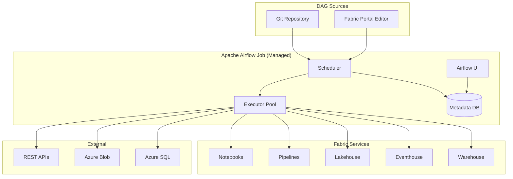
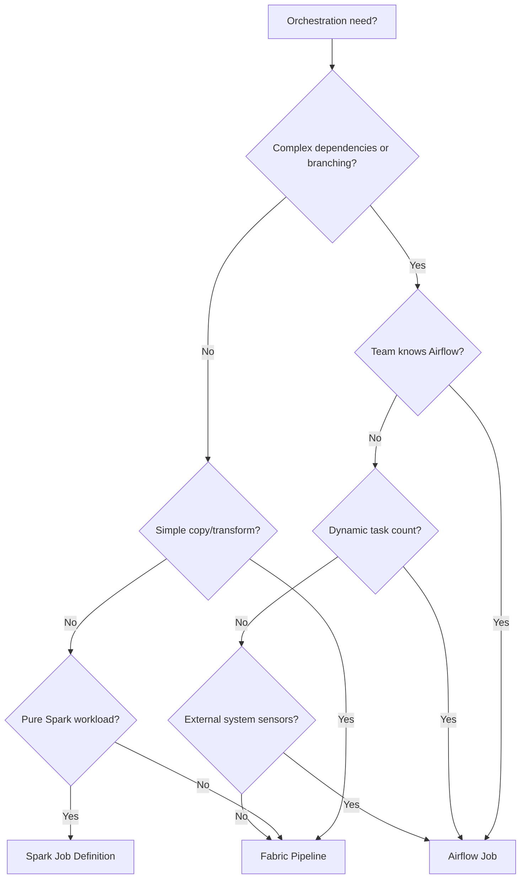

# 🌬️ Apache Airflow Job - Managed Orchestration in Fabric

<div align="center" markdown>

**Enterprise-Grade DAG Orchestration Without Infrastructure Management**


</div>

---

**Last Updated:** `2026-04-27` | **Version:** 1.0.0

---

## Overview

Apache Airflow Job in Microsoft Fabric provides a fully managed Airflow 2.x environment within the Fabric platform. It lets data engineers author DAGs (Directed Acyclic Graphs) using the familiar Airflow Python SDK while benefiting from Fabric's integrated security, capacity management, and monitoring.

This is the right choice when your orchestration needs exceed what Fabric Pipelines can express -- complex branching logic, dynamic task generation, cross-system dependencies, or teams with existing Airflow expertise.

### Key Capabilities

| Capability | Description |
|------------|-------------|
| **Managed infrastructure** | No VMs, no Kubernetes, no Airflow metadata DB to manage |
| **Airflow 2.9+** | Current Airflow version with TaskFlow API support |
| **Fabric operators** | Native operators for Notebooks, Pipelines, Lakehouses, Eventhouses |
| **Git sync** | DAGs sync from Git repo (GitHub, Azure DevOps) |
| **Python packages** | Install custom packages via requirements.txt |
| **Workspace Identity** | Authenticate to Fabric services automatically |
| **CU-based billing** | Compute charged against Fabric capacity |

---

## Architecture



---

## When to Use Airflow vs Alternatives

### Decision Matrix

| Criterion | Fabric Pipeline | Airflow Job | Spark Job Definition |
|-----------|----------------|-------------|---------------------|
| **Simple ETL** | Excellent | Overkill | Overkill |
| **Complex branching** | Limited | Excellent | N/A |
| **Dynamic task generation** | No | Yes (expand) | No |
| **External system deps** | Some connectors | Full Python ecosystem | No |
| **Team expertise** | Low barrier | Airflow knowledge needed | Spark knowledge needed |
| **Retry/backfill** | Basic | Advanced (catchup, backfill) | Basic |
| **Cross-workspace** | Via REST | Native operators | Single workspace |
| **Scheduling** | Cron + trigger | Cron + sensors + datasets | Cron only |
| **Monitoring** | Pipeline runs view | Airflow UI + Gantt charts | Spark UI |
| **CI/CD** | fabric-cicd | Git sync + DAG tests | fabric-cicd |
| **Cost** | CU per activity | CU for scheduler + workers | CU per job |

### Decision Flowchart



---

## Environment Setup

### Creating an Airflow Job

1. In your Fabric workspace, select **+ New** > **Apache Airflow Job**
2. Name the job (e.g., `casino-medallion-orchestrator`)
3. Configure Git sync (recommended) or use the built-in editor

### Git Sync Configuration

```yaml
# .airflow/config.yaml
git_sync:
  repository: https://github.com/contoso/fabric-dags.git
  branch: main
  dags_folder: dags/
  sync_interval_seconds: 60
  credentials:
    type: pat  # or ssh
    secret_name: github-pat  # from Key Vault
```

### Python Dependencies

```text
# requirements.txt
apache-airflow-providers-microsoft-fabric==1.2.0
great-expectations==0.18.0
delta-spark==3.1.0
requests==2.31.0
pydantic==2.5.0
```

### Environment Variables

```python
# Set in Airflow Job configuration, NOT in DAG code
# These are available to all DAGs in the job

# Fabric workspace settings
FABRIC_WORKSPACE_ID = "your-workspace-id"
FABRIC_LAKEHOUSE_NAME = "lh_bronze"

# Business configuration
CTR_THRESHOLD = "10000"
RETENTION_DAYS = "365"
ENVIRONMENT = "prod"
```

---

## DAG Authoring Patterns

### Pattern 1: Bronze-Silver-Gold Medallion Pipeline

```python
"""
Casino Medallion Pipeline
Orchestrates the full bronze → silver → gold data flow for casino data.
"""
from datetime import datetime, timedelta
from airflow.decorators import dag, task
from airflow.providers.microsoft.fabric.operators.notebook import FabricNotebookOperator
from airflow.providers.microsoft.fabric.operators.pipeline import FabricPipelineOperator
from airflow.providers.microsoft.fabric.sensors.lakehouse import FabricLakehouseSensor

default_args = {
    "owner": "data-engineering",
    "depends_on_past": False,
    "retries": 2,
    "retry_delay": timedelta(minutes=5),
    "email_on_failure": True,
    "email": ["data-team@contoso.com"],
}

@dag(
    dag_id="casino_medallion_pipeline",
    description="Daily medallion pipeline for casino data",
    schedule="0 6 * * *",  # 6 AM daily
    start_date=datetime(2026, 1, 1),
    catchup=False,
    default_args=default_args,
    tags=["casino", "medallion", "daily"],
)
def casino_medallion():
    
    # ---- BRONZE LAYER ----
    
    ingest_slot_telemetry = FabricNotebookOperator(
        task_id="bronze_slot_telemetry",
        workspace_id="{{ var.value.workspace_id }}",
        notebook_name="01_bronze_slot_telemetry",
        parameters={"date": "{{ ds }}", "env": "{{ var.value.environment }}"},
    )
    
    ingest_table_games = FabricNotebookOperator(
        task_id="bronze_table_games",
        workspace_id="{{ var.value.workspace_id }}",
        notebook_name="02_bronze_table_game_results",
        parameters={"date": "{{ ds }}"},
    )
    
    ingest_player_tracking = FabricNotebookOperator(
        task_id="bronze_player_tracking",
        workspace_id="{{ var.value.workspace_id }}",
        notebook_name="03_bronze_player_tracking",
        parameters={"date": "{{ ds }}"},
    )
    
    # ---- DATA QUALITY GATE ----
    
    @task
    def validate_bronze(ds=None):
        """Run Great Expectations on bronze tables."""
        import great_expectations as gx
        
        context = gx.get_context()
        results = context.run_checkpoint(checkpoint_name="bronze_checkpoint")
        
        if not results.success:
            raise ValueError(f"Bronze quality check failed for {ds}")
        return {"status": "passed", "date": ds}
    
    bronze_quality = validate_bronze()
    
    # ---- SILVER LAYER ----
    
    cleanse_slots = FabricNotebookOperator(
        task_id="silver_slot_cleansed",
        workspace_id="{{ var.value.workspace_id }}",
        notebook_name="01_silver_slot_cleansed",
        parameters={"date": "{{ ds }}"},
    )
    
    cleanse_table_games = FabricNotebookOperator(
        task_id="silver_table_games_cleansed",
        workspace_id="{{ var.value.workspace_id }}",
        notebook_name="02_silver_table_games_cleansed",
        parameters={"date": "{{ ds }}"},
    )
    
    cleanse_players = FabricNotebookOperator(
        task_id="silver_player_profiles",
        workspace_id="{{ var.value.workspace_id }}",
        notebook_name="03_silver_player_profiles",
        parameters={"date": "{{ ds }}"},
    )
    
    # ---- GOLD LAYER ----
    
    gold_slot_kpis = FabricNotebookOperator(
        task_id="gold_slot_performance",
        workspace_id="{{ var.value.workspace_id }}",
        notebook_name="01_gold_slot_performance",
        parameters={"date": "{{ ds }}"},
    )
    
    gold_compliance = FabricNotebookOperator(
        task_id="gold_compliance_report",
        workspace_id="{{ var.value.workspace_id }}",
        notebook_name="05_gold_compliance_monitoring",
        parameters={"date": "{{ ds }}"},
    )
    
    gold_revenue = FabricNotebookOperator(
        task_id="gold_revenue_dashboard",
        workspace_id="{{ var.value.workspace_id }}",
        notebook_name="03_gold_revenue_analysis",
        parameters={"date": "{{ ds }}"},
    )
    
    # ---- DEPENDENCIES ----
    
    # Bronze tasks run in parallel
    [ingest_slot_telemetry, ingest_table_games, ingest_player_tracking] >> bronze_quality
    
    # Silver depends on bronze quality gate
    bronze_quality >> [cleanse_slots, cleanse_table_games, cleanse_players]
    
    # Gold depends on all silver
    [cleanse_slots, cleanse_table_games, cleanse_players] >> [gold_slot_kpis, gold_compliance, gold_revenue]

casino_medallion()
```

### Pattern 2: Dynamic Task Generation

```python
"""
Federal Agency Dynamic Pipeline
Generates tasks dynamically based on configured agencies.
"""
from airflow.decorators import dag, task
from airflow.providers.microsoft.fabric.operators.notebook import FabricNotebookOperator

AGENCIES = ["usda", "sba", "noaa", "epa", "doi", "doj"]
LAYERS = ["bronze", "silver", "gold"]

@dag(
    dag_id="federal_multi_agency_pipeline",
    schedule="0 4 * * 1",  # Weekly on Monday at 4 AM
    start_date=datetime(2026, 1, 1),
    catchup=False,
    tags=["federal", "multi-agency"],
)
def federal_pipeline():
    
    @task
    def check_data_freshness(agency: str) -> dict:
        """Check if source data has been updated since last run."""
        from fabric.onelake import OneLakeClient
        client = OneLakeClient()
        stats = client.get_table_stats(f"lh_bronze.Lakehouse/Tables/{agency}")
        return {"agency": agency, "needs_refresh": stats["last_modified_hours_ago"] < 168}
    
    for agency in AGENCIES:
        freshness = check_data_freshness(agency)
        
        bronze = FabricNotebookOperator(
            task_id=f"bronze_{agency}",
            notebook_name=f"10_bronze_{agency}_ingest",
            parameters={"agency": agency, "date": "{{ ds }}"},
        )
        
        silver = FabricNotebookOperator(
            task_id=f"silver_{agency}",
            notebook_name=f"10_silver_{agency}_cleansed",
            parameters={"agency": agency},
        )
        
        gold = FabricNotebookOperator(
            task_id=f"gold_{agency}",
            notebook_name=f"10_gold_{agency}_analytics",
            parameters={"agency": agency},
        )
        
        freshness >> bronze >> silver >> gold

federal_pipeline()
```

### Pattern 3: Sensor-Based Orchestration

```python
from airflow.providers.microsoft.fabric.sensors.lakehouse import FabricLakehouseSensor

# Wait for upstream data to arrive before processing
wait_for_slot_data = FabricLakehouseSensor(
    task_id="wait_for_slot_data",
    workspace_id="{{ var.value.workspace_id }}",
    lakehouse_name="lh_bronze",
    table_name="slot_telemetry",
    partition_filter={"date": "{{ ds }}"},
    min_row_count=1000,
    poke_interval=300,  # Check every 5 minutes
    timeout=3600,  # Give up after 1 hour
    mode="reschedule",  # Free up worker while waiting
)
```

---

## Fabric-Specific Operators

### Available Operators

| Operator | Purpose | Key Parameters |
|----------|---------|----------------|
| `FabricNotebookOperator` | Run a Fabric notebook | `notebook_name`, `parameters`, `timeout` |
| `FabricPipelineOperator` | Trigger a Fabric pipeline | `pipeline_name`, `parameters` |
| `FabricLakehouseSensor` | Wait for data in Lakehouse | `table_name`, `min_row_count` |
| `FabricSqlOperator` | Execute SQL on warehouse/SQL DB | `sql`, `warehouse_name` |
| `FabricRestOperator` | Call Fabric REST API | `endpoint`, `method`, `body` |
| `FabricSparkJobOperator` | Run a Spark Job Definition | `sjd_name`, `arguments` |

### FabricRestOperator Example

```python
from airflow.providers.microsoft.fabric.operators.rest import FabricRestOperator

refresh_dataset = FabricRestOperator(
    task_id="refresh_semantic_model",
    method="POST",
    endpoint=f"/v1/workspaces/{workspace_id}/semanticModels/{model_id}/refresh",
    json_body={"type": "full"},
    expected_status_code=202,
)
```

---

## Monitoring and Logging

### Airflow UI

The managed Airflow job provides the full Airflow web UI:

- **DAG view**: DAG dependency graphs and run history
- **Tree view**: Run status across dates
- **Gantt chart**: Task duration analysis
- **Task logs**: Stdout/stderr for each task execution

### Integration with Fabric Monitoring

```python
# In your DAG, emit custom metrics to Fabric
@task
def emit_metrics(run_stats: dict):
    """Push DAG run metrics to Eventhouse for unified monitoring."""
    from fabric.eventhouse import EventhouseClient
    
    client = EventhouseClient(database="platform_monitoring")
    client.ingest({
        "dag_id": "casino_medallion_pipeline",
        "run_date": run_stats["date"],
        "duration_seconds": run_stats["duration"],
        "task_count": run_stats["tasks"],
        "failed_tasks": run_stats["failures"],
        "timestamp": datetime.utcnow().isoformat()
    }, table="airflow_runs")
```

### KQL Queries for Airflow Monitoring

```kql
// DAG execution trends
airflow_runs
| where timestamp > ago(30d)
| summarize
    AvgDuration = avg(duration_seconds),
    FailureRate = countif(failed_tasks > 0) * 100.0 / count(),
    TotalRuns = count()
    by dag_id, bin(timestamp, 1d)
| render timechart

// Slowest tasks across all DAGs
airflow_task_metrics
| where timestamp > ago(7d)
| summarize P95Duration = percentile(duration_seconds, 95) by task_id, dag_id
| top 20 by P95Duration desc
```

---

## CI/CD for DAGs

### Repository Structure

```
airflow-dags/
├── dags/
│   ├── casino_medallion.py
│   ├── federal_pipeline.py
│   ├── data_quality.py
│   └── utils/
│       ├── __init__.py
│       ├── fabric_helpers.py
│       └── quality_checks.py
├── tests/
│   ├── test_casino_medallion.py
│   ├── test_federal_pipeline.py
│   └── conftest.py
├── requirements.txt
├── .airflow/
│   └── config.yaml
└── .github/
    └── workflows/
        └── test-dags.yml
```

### DAG Testing

```python
# tests/test_casino_medallion.py
import pytest
from airflow.models import DagBag

@pytest.fixture
def dagbag():
    return DagBag(dag_folder="dags/", include_examples=False)

def test_dag_loads(dagbag):
    assert "casino_medallion_pipeline" in dagbag.dags
    assert dagbag.import_errors == {}

def test_dag_structure(dagbag):
    dag = dagbag.get_dag("casino_medallion_pipeline")
    assert len(dag.tasks) >= 9  # 3 bronze + 1 quality + 3 silver + 2 gold
    
    # Verify bronze tasks have no upstream dependencies
    bronze_tasks = [t for t in dag.tasks if t.task_id.startswith("bronze_")]
    for task in bronze_tasks:
        assert len(task.upstream_list) == 0

def test_no_cycles(dagbag):
    dag = dagbag.get_dag("casino_medallion_pipeline")
    # Airflow will raise if there's a cycle during parsing
    assert dag is not None
```

### GitHub Actions Workflow

```yaml
# .github/workflows/test-dags.yml
name: Test Airflow DAGs
on:
  pull_request:
    paths: ['dags/**', 'tests/**']

jobs:
  test:
    runs-on: ubuntu-latest
    steps:
      - uses: actions/checkout@v4
      - uses: actions/setup-python@v5
        with:
          python-version: '3.11'
      - run: |
          pip install apache-airflow==2.9.0 pytest
          pip install -r requirements.txt
      - run: pytest tests/ -v
```

---

## Casino Implementation

The full casino medallion DAG (shown above in Pattern 1) orchestrates:

1. **Bronze**: Parallel ingestion of slot telemetry, table games, and player tracking
2. **Quality gate**: Great Expectations validation before silver processing
3. **Silver**: Cleansing, deduplication, PII hashing
4. **Gold**: KPI computation, compliance reporting, revenue dashboards

### Compliance-Specific Tasks

```python
@task
def check_ctr_backlog(ds=None):
    """Verify all CTR-eligible transactions have been reported."""
    from fabric.sqlendpoint import SqlClient
    
    sql = SqlClient(lakehouse="lh_gold")
    result = sql.query(f"""
        SELECT COUNT(*) as unreported
        FROM gold_compliance_monitoring
        WHERE transaction_date = '{ds}'
          AND ctr_required = true
          AND ctr_filed = false
    """)
    
    unreported = result[0]["unreported"]
    if unreported > 0:
        raise ValueError(f"{unreported} unfiled CTRs for {ds}")
    return {"status": "compliant", "date": ds}
```

---

## Federal Agency Implementation

The dynamic federal pipeline (shown in Pattern 2) processes all six agencies in parallel with per-agency freshness checks. Each agency follows the same medallion flow but with agency-specific notebooks.

### Cross-Agency Quality Report

```python
@task
def cross_agency_quality_report(agency_results: list):
    """Aggregate quality metrics across all federal agencies."""
    report = {
        "report_date": datetime.utcnow().isoformat(),
        "agencies": {},
        "overall_pass_rate": 0
    }
    
    passed = 0
    for result in agency_results:
        agency = result["agency"]
        report["agencies"][agency] = {
            "status": result["status"],
            "row_count": result.get("row_count", 0),
            "quality_score": result.get("quality_score", 0)
        }
        if result["status"] == "passed":
            passed += 1
    
    report["overall_pass_rate"] = passed / len(agency_results)
    return report
```

---

## Limitations

| Limitation | Details | Workaround |
|------------|---------|------------|
| **Airflow version** | Managed version, cannot pin arbitrary versions | Use compatible operator versions |
| **No custom plugins** | Cannot install Airflow plugins (only providers) | Use TaskFlow Python tasks instead |
| **Worker scaling** | Limited by capacity CU allocation | Plan capacity for peak DAG loads |
| **No Celery/Kubernetes executor** | Local executor only in managed mode | Design DAGs with appropriate parallelism |
| **DAG size** | Max 200 tasks per DAG recommended | Split large DAGs into sub-DAGs |
| **Secrets** | No native Airflow secrets backend | Use Fabric Variable Libraries + Key Vault |
| **XCom size** | 48 KB per XCom value | Use OneLake for large intermediate data |

---

## References

- [Apache Airflow Job in Fabric](https://learn.microsoft.com/en-us/fabric/data-factory/apache-airflow-jobs-overview)
- [Fabric Airflow operators](https://learn.microsoft.com/en-us/fabric/data-factory/apache-airflow-jobs-operators)
- [Airflow best practices](https://airflow.apache.org/docs/apache-airflow/stable/best-practices.html)
- [Fabric Pipeline comparison](https://learn.microsoft.com/en-us/fabric/data-factory/pipeline-overview)
- [Git sync for Airflow DAGs](https://learn.microsoft.com/en-us/fabric/data-factory/apache-airflow-jobs-git-sync)
