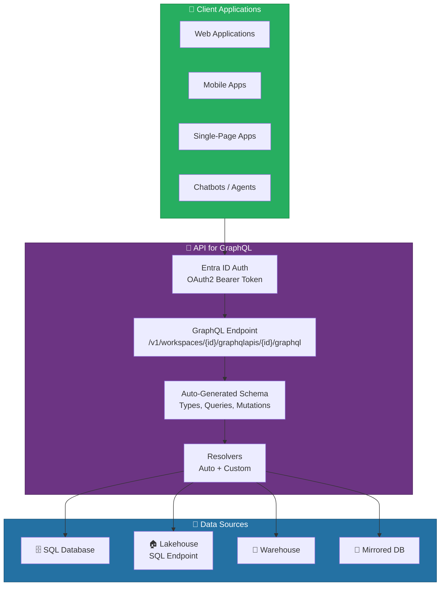
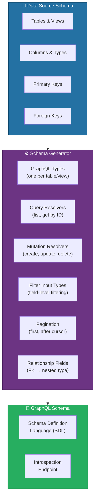
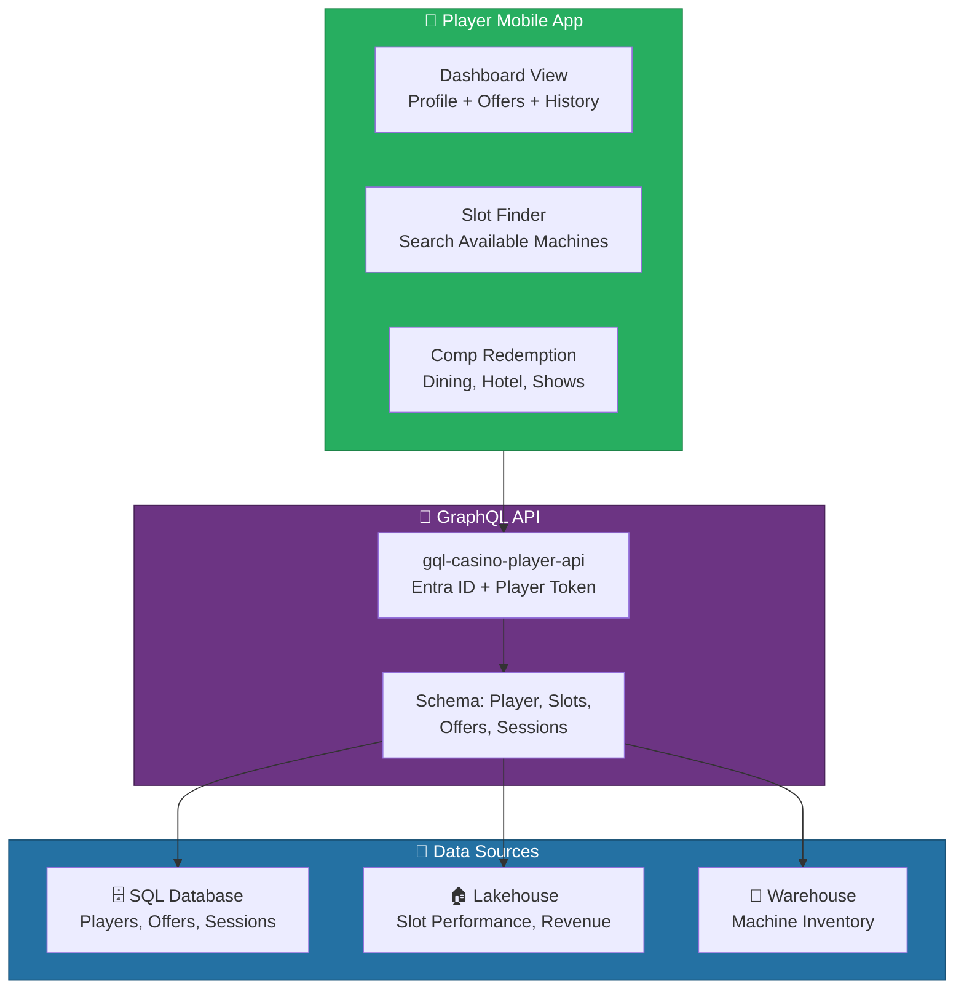
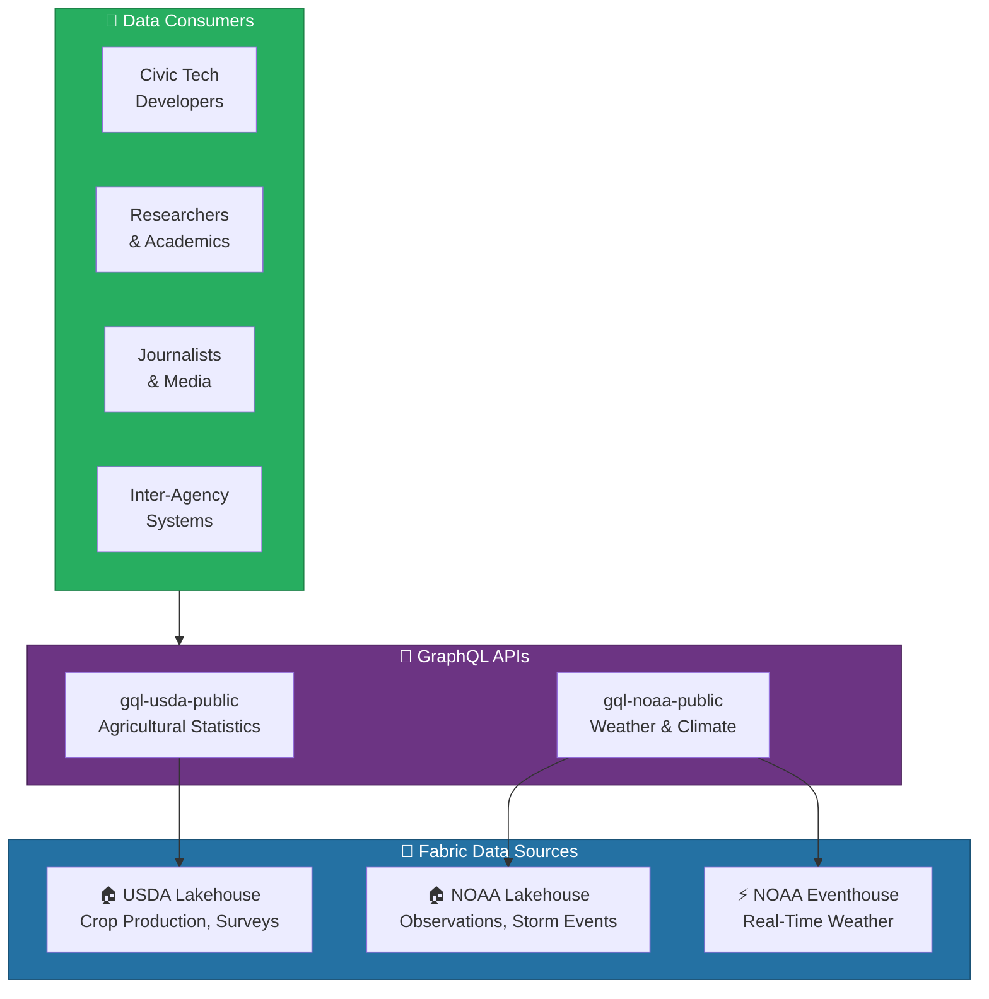
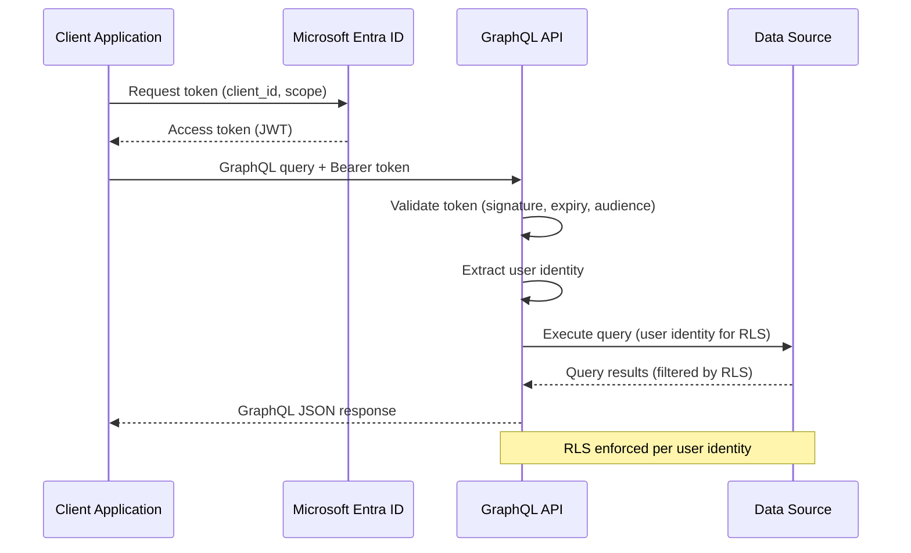

# 🔗 API for GraphQL - Unified Data Access Layer

<div align="center" markdown>

**Fabric-Native GraphQL API Item for Schema-Driven Data Access**


</div>

---

**Last Updated:** `2026-04-13` | **Version:** 1.0.0

---

## 🎯 Overview

API for GraphQL is a Fabric-native data access item that enables you to expose data stored in Microsoft Fabric through a GraphQL endpoint. Instead of building custom REST APIs or data services, you create a GraphQL API item in your workspace, connect it to one or more Fabric data sources (SQL Database, Lakehouse, Warehouse, or Mirrored Database), and Fabric auto-generates a fully typed GraphQL schema with queries, mutations, relationships, filtering, pagination, and sorting — all backed by the Fabric security model.

GraphQL provides a significant advantage over traditional REST APIs for data access: clients request exactly the fields they need (no over-fetching), can query across related entities in a single request (no N+1 queries), and the strongly typed schema serves as a living API contract that is always in sync with the underlying data.

### Key Capabilities

| Capability | Description |
|-----------|-------------|
| **Auto-Schema Generation** | Fabric generates GraphQL types, queries, and mutations from connected data source schemas |
| **Multi-Source Connectivity** | Connect to SQL Database, Lakehouse SQL endpoint, Warehouse, or Mirrored Database |
| **Relationships** | Define relationships between types across different data sources |
| **Filtering & Pagination** | Auto-generated filter inputs, ordering, and cursor-based pagination |
| **Mutations** | Create, update, and delete operations for supported data sources |
| **Custom Resolvers** | Extend auto-generated schema with stored procedure-backed resolvers |
| **Entra ID Authentication** | Built-in Microsoft Entra ID OAuth2 authentication for all endpoints |
| **Git Integration** | Source control for GraphQL schema and configuration via Fabric Git |
| **fabric-cicd GA** | Full support in the fabric-cicd deployment framework for CI/CD pipelines |

### GraphQL vs. REST for Fabric Data

| Dimension | REST (Custom API) | Fabric API for GraphQL |
|-----------|------------------|----------------------|
| **Setup** | Build, deploy, maintain a web service | Create a Fabric item, connect sources, auto-generate |
| **Schema** | Manually define endpoints and DTOs | Auto-generated from data source schema |
| **Fetching** | Multiple endpoints, over/under-fetching | Single endpoint, request exact fields needed |
| **Relationships** | Multiple API calls or custom joins | Traverse relationships in one query |
| **Maintenance** | Deploy new API version on schema change | Schema auto-updates when data source changes |
| **Security** | Implement auth middleware, RLS manually | Built-in Entra ID auth, RLS pass-through |
| **Deployment** | CI/CD for API service | fabric-cicd with Git integration |

### API for GraphQL in the Fabric Ecosystem



> 📝 **Note**: API for GraphQL is distinct from Azure API Management (APIM). It is a Fabric-native item that runs within the Fabric service boundary. For enterprise API gateway features (rate limiting policies, caching, developer portal, subscription management), you can place APIM in front of the Fabric GraphQL endpoint.

---

## 🏗️ Architecture

The API for GraphQL item operates as a managed GraphQL runtime within the Fabric service. When you connect a data source, Fabric introspects the source schema (tables, views, columns, data types, relationships) and generates a GraphQL schema definition. Queries and mutations submitted by clients are parsed, validated against the schema, and resolved by translating GraphQL operations into the appropriate data source queries (T-SQL for SQL Database and Warehouse, Spark SQL for Lakehouse).

### Processing Pipeline

```mermaid
flowchart LR
    subgraph Client["📱 Client Request"]
        REQ["GraphQL Query<br/>{ players(first: 10) { name tier } }"]
    end

    subgraph Auth["🔐 Authentication"]
        TOKEN["Entra ID Token<br/>Validation"]
        PERM["Permission Check<br/>Workspace + Source"]
    end

    subgraph Runtime["🔗 GraphQL Runtime"]
        PARSE["Schema Validation<br/>& Query Parsing"]
        PLAN["Execution Plan<br/>Field Resolution"]
        RESOLVE["Resolver Execution<br/>SQL Generation"]
    end

    subgraph Data["💾 Data Source"]
        EXEC["Query Execution<br/>T-SQL / Spark SQL"]
        RLS["RLS Enforcement<br/>User Identity"]
    end

    subgraph Response["📊 Response"]
        FMT["JSON Response<br/>Exact Fields Requested"]
    end

    Client --> Auth --> Runtime --> Data --> Response

    style Auth fill:#E67E22,stroke:#CA6F1E,color:#fff
    style Runtime fill:#6C3483,stroke:#4A235A,color:#fff
    style Data fill:#2471A3,stroke:#1A5276,color:#fff
    style Response fill:#27AE60,stroke:#1E8449,color:#fff
```



### Schema Generation Architecture



### How Resolvers Map to Data Sources

| GraphQL Operation | Generated SQL | Source Type |
|------------------|---------------|-------------|
| `query { players { id name } }` | `SELECT id, name FROM dbo.players` | SQL Database |
| `query { players(filter: { tier: { eq: "Gold" } }) }` | `SELECT ... FROM dbo.players WHERE tier = 'Gold'` | SQL Database |
| `query { players(first: 10, after: "cursor") }` | `SELECT TOP 10 ... WHERE id > @cursor` | SQL Database |
| `mutation { createPlayer(input: { ... }) }` | `INSERT INTO dbo.players (...) VALUES (...)` | SQL Database |
| `query { goldSlotPerformance { machineId coinIn } }` | `SELECT machineId, coinIn FROM gold_slot_performance` | Lakehouse |

> 💡 **Tip**: Use the GraphQL introspection endpoint to explore the auto-generated schema. Tools like Altair GraphQL Client, Insomnia, or Postman can introspect the schema and provide auto-complete for queries.

---

## ⚙️ Setup and Configuration

### Prerequisites

| Requirement | Details |
|------------|---------|
| **Fabric Capacity** | F2 or higher |
| **Data Source** | At least one SQL Database, Lakehouse, Warehouse, or Mirrored Database in the workspace |
| **Workspace Role** | Admin or Member role for creating GraphQL API items |
| **Entra ID App Registration** | Required for client applications to obtain OAuth2 tokens |
| **Tenant Settings** | API for GraphQL must be enabled in Fabric tenant admin settings |

### Step 1: Enable Tenant Settings

```
Admin Portal → Tenant Settings → API for GraphQL
  ├── Enable API for GraphQL → ✅ Enabled
  ├── Service principals can use Fabric APIs → ✅ Enabled (for CI/CD)
  └── Users can create Fabric items → ✅ Enabled
```

### Step 2: Create a GraphQL API Item

```
Workspace → + New → API for GraphQL
  Name: gql-casino-api
  Description: GraphQL API for casino player data, slot availability,
               rewards, and compliance summaries
```

### Step 3: Connect Data Sources

After creating the GraphQL API item, connect one or more data sources:

```
gql-casino-api → Data Sources → + Connect Data Source
  ├── sqldb-casino-operations (SQL Database)
  │   ├── ☑ dbo.players
  │   ├── ☑ dbo.gaming_sessions
  │   ├── ☑ dbo.cash_transactions
  │   └── ☑ dbo.w2g_filings
  ├── lh_gold (Lakehouse - SQL Endpoint)
  │   ├── ☑ gold_slot_performance
  │   ├── ☑ gold_player_summary
  │   └── ☑ gold_revenue_daily
  └── wh_analytics (Warehouse)
      ├── ☑ dim_machines
      └── ☑ fact_slot_metrics
```

### Step 4: Review Auto-Generated Schema

Fabric generates the GraphQL schema based on the connected source schemas:

```graphql
# Auto-generated types (simplified)
type Player {
  playerId: Int!
  loyaltyCardNo: String!
  firstName: String!
  lastName: String!
  loyaltyTier: String
  enrollmentDate: DateTime
  isActive: Boolean
  # Relationships (from FK)
  gamingSessions: [GamingSession!]
  cashTransactions: [CashTransaction!]
}

type GamingSession {
  sessionId: Long!
  playerId: Int!
  machineId: String
  sessionStart: DateTime!
  sessionEnd: DateTime
  coinIn: Decimal
  coinOut: Decimal
  # Relationships
  player: Player
}

type GoldSlotPerformance {
  machineId: String!
  gamingDate: Date!
  denomination: Decimal
  coinIn: Decimal
  coinOut: Decimal
  holdPct: Decimal
  floorLocation: String
}

# Auto-generated queries
type Query {
  players(
    filter: PlayerFilterInput
    orderBy: PlayerOrderByInput
    first: Int
    after: String
  ): PlayerConnection!

  player(playerId: Int!): Player

  gamingSessions(
    filter: GamingSessionFilterInput
    first: Int
    after: String
  ): GamingSessionConnection!

  goldSlotPerformances(
    filter: GoldSlotPerformanceFilterInput
    orderBy: GoldSlotPerformanceOrderByInput
    first: Int
    after: String
  ): GoldSlotPerformanceConnection!
}

# Auto-generated mutations (SQL Database sources only)
type Mutation {
  createPlayer(input: CreatePlayerInput!): Player
  updatePlayer(playerId: Int!, input: UpdatePlayerInput!): Player
  deletePlayer(playerId: Int!): Boolean
}
```

### Step 5: Configure Schema Modifications

Customize the auto-generated schema by adding or removing exposed fields, renaming types, or hiding sensitive columns:

```
gql-casino-api → Schema Editor
  ├── Player type
  │   ├── ☑ playerId → exposed
  │   ├── ☑ firstName → exposed
  │   ├── ☑ lastName → exposed
  │   ├── ☑ loyaltyTier → exposed
  │   ├── ☐ ssn → HIDDEN (sensitive)
  │   ├── ☐ dateOfBirth → HIDDEN (PII)
  │   └── ☐ email → HIDDEN (PII)
  └── CashTransaction type
      ├── ☑ transactionId → exposed
      ├── ☑ transactionType → exposed
      ├── ☑ amount → exposed
      └── ☐ cashierId → HIDDEN (internal)
```

### Step 6: Test with the Built-In Editor

The GraphQL API item includes a built-in query editor for testing:

```graphql
# Test query in the built-in editor
query {
  players(first: 5, filter: { loyaltyTier: { eq: "Platinum" } }) {
    items {
      playerId
      firstName
      lastName
      loyaltyTier
      gamingSessions(first: 3, orderBy: { sessionStart: DESC }) {
        items {
          machineId
          coinIn
          coinOut
          sessionStart
        }
      }
    }
    endCursor
    hasNextPage
  }
}
```

### Step 7: Obtain the API Endpoint

```
gql-casino-api → Settings → Endpoint
  URL: https://api.fabric.microsoft.com/v1/workspaces/{workspace-id}/graphqlapis/{api-id}/graphql
  Authentication: OAuth2 Bearer Token (Entra ID)
```

---

## 🔄 CI/CD Integration

API for GraphQL is fully supported in the fabric-cicd GA deployment framework, enabling automated deployment of GraphQL API items across development, staging, and production workspaces.

### Git Integration

```
gql-casino-api → Source Control → Connect to Git
  Repository: https://dev.azure.com/org/project/_git/fabric-items
  Branch: main
  Folder: /graphql/gql-casino-api
```

Git integration tracks the following artifacts:

| Artifact | File | Contents |
|----------|------|----------|
| **Item Definition** | `item.metadata.json` | API name, description, workspace binding |
| **Schema** | `schema.graphql` | Full GraphQL SDL (types, queries, mutations) |
| **Data Source Config** | `datasources.json` | Connected sources and table selections |
| **Resolver Config** | `resolvers.json` | Custom resolver mappings |
| **Security Config** | `security.json` | Field visibility, permission overrides |

### fabric-cicd Deployment

```yaml
# .github/workflows/deploy-graphql.yml
name: Deploy GraphQL API
on:
  push:
    branches: [main]
    paths:
      - 'graphql/**'

jobs:
  deploy:
    runs-on: ubuntu-latest
    steps:
      - uses: actions/checkout@v4

      - name: Install fabric-cicd
        run: pip install fabric-cicd

      - name: Deploy to Staging
        env:
          FABRIC_TOKEN: ${{ secrets.FABRIC_TOKEN }}
        run: |
          python scripts/fabric-cicd-deploy.py \
            --workspace-id ${{ vars.STAGING_WORKSPACE_ID }} \
            --items graphql/gql-casino-api \
            --item-type GraphQLApi
```

### Deployment Pipeline (Fabric UI)

```
Deployment Pipelines → casino-pipeline
  Development → Staging → Production
    ├── gql-casino-api (GraphQL API)
    ├── sqldb-casino-operations (SQL Database)
    └── lh_gold (Lakehouse)

  Deploy: Development → Staging
    ☑ Include dependent items
    ☑ Update data source connections
```

> 📝 **Note**: When promoting GraphQL API items across environments, data source connections are automatically rebound to the workspace-local versions. A GraphQL API in the staging workspace will connect to the staging SQL Database, not the development one.

---

## 🔧 Advanced Patterns

### Relationships Across Data Sources

Define relationships between types from different data sources to enable nested queries:

```graphql
# Relationship: Player (SQL Database) → SlotPerformance (Lakehouse)
# Configured in the schema editor or resolvers.json

type Player {
  playerId: Int!
  firstName: String!
  lastName: String!
  # Cross-source relationship
  recentPerformance(first: Int = 5): [GoldSlotPerformance!]
}
```

**Resolver Configuration:**

```json
{
  "relationships": [
    {
      "parentType": "Player",
      "field": "recentPerformance",
      "childType": "GoldSlotPerformance",
      "parentKey": "playerId",
      "childKey": "playerId",
      "childSource": "lh_gold",
      "defaultFirst": 5,
      "orderBy": { "gamingDate": "DESC" }
    }
  ]
}
```

### Pagination

The auto-generated schema uses cursor-based pagination for all list queries:

```graphql
# First page
query {
  players(first: 20) {
    items {
      playerId
      firstName
      loyaltyTier
    }
    endCursor
    hasNextPage
  }
}

# Next page (using endCursor from previous response)
query {
  players(first: 20, after: "eyJpZCI6MjB9") {
    items {
      playerId
      firstName
      loyaltyTier
    }
    endCursor
    hasNextPage
  }
}
```

### Filtering

Auto-generated filter inputs support field-level comparison operators:

```graphql
# Complex filtering
query {
  goldSlotPerformances(
    filter: {
      and: [
        { denomination: { eq: 1.00 } }
        { holdPct: { gte: 8.0 } }
        { gamingDate: { gte: "2026-04-01" } }
        { floorLocation: { contains: "Floor 2" } }
      ]
    }
    orderBy: { coinIn: DESC }
    first: 50
  ) {
    items {
      machineId
      denomination
      coinIn
      coinOut
      holdPct
      floorLocation
      gamingDate
    }
  }
}
```

### Custom Resolvers (Stored Procedure-Backed)

Extend the auto-generated schema with custom resolvers backed by stored procedures:

```sql
-- Create a stored procedure for the custom resolver
CREATE PROCEDURE dbo.usp_get_player_compliance_summary
    @player_id INT
AS
BEGIN
    SET NOCOUNT ON;

    SELECT
        p.player_id,
        p.loyalty_card_no,
        p.first_name,
        p.last_name,
        (SELECT COUNT(*) FROM dbo.cash_transactions ct
         WHERE ct.player_id = p.player_id AND ct.ctr_required = 1) AS ctr_count,
        (SELECT COUNT(*) FROM dbo.w2g_filings w
         WHERE w.player_id = p.player_id) AS w2g_count,
        (SELECT SUM(ct.amount) FROM dbo.cash_transactions ct
         WHERE ct.player_id = p.player_id
         AND ct.transaction_time >= DATEADD(DAY, -30, GETDATE())) AS cash_30d
    FROM dbo.players p
    WHERE p.player_id = @player_id;
END;
```

```graphql
# Custom type and query in schema editor
type PlayerComplianceSummary {
  playerId: Int!
  loyaltyCardNo: String!
  firstName: String!
  lastName: String!
  ctrCount: Int!
  w2gCount: Int!
  cash30d: Decimal
}

extend type Query {
  playerComplianceSummary(playerId: Int!): PlayerComplianceSummary
    @resolver(procedure: "dbo.usp_get_player_compliance_summary")
}
```

### Aggregation Queries

```graphql
# Revenue aggregation query (backed by Lakehouse view)
query {
  goldRevenueDailies(
    filter: { gamingDate: { gte: "2026-04-01", lte: "2026-04-13" } }
    orderBy: { gamingDate: ASC }
  ) {
    items {
      gamingDate
      totalCoinIn
      totalCoinOut
      netRevenue
      machineCount
    }
  }
}
```

---

## 🎰 Casino Implementation

### Mobile Player App: Slot Availability, Rewards, and Comp Redemption

The casino's mobile app uses the GraphQL API to provide players with real-time slot availability, loyalty rewards balance, comp offers, and session history — all in a single, efficient API layer.

### Casino GraphQL Schema

```graphql
# Player-facing types (PII fields hidden)
type PlayerProfile {
  playerId: Int!
  firstName: String!
  loyaltyTier: String!
  loyaltyPoints: Int!
  compBalance: Decimal!
  enrollmentDate: DateTime!
  # Relationships
  activeOffers: [CompOffer!]
  recentSessions: [SessionSummary!]
}

type SlotMachineAvailability {
  machineId: String!
  gameTitle: String!
  denomination: Decimal!
  floorLocation: String!
  status: String!  # available, occupied, maintenance
  lastPayout: Decimal
  lastPayoutTime: DateTime
}

type CompOffer {
  offerId: Int!
  offerType: String!  # free_play, dining, hotel, show
  description: String!
  value: Decimal!
  expirationDate: DateTime!
  isRedeemed: Boolean!
}

type SessionSummary {
  sessionId: Long!
  machineId: String
  gameTitle: String
  sessionDate: DateTime!
  duration: Int!  # minutes
  coinIn: Decimal!
  coinOut: Decimal!
  netResult: Decimal!
}

# Player-facing queries
type Query {
  myProfile: PlayerProfile
  availableSlots(
    denomination: Decimal
    floorLocation: String
    gameTitle: String
    first: Int = 20
  ): [SlotMachineAvailability!]
  myOffers(active: Boolean = true): [CompOffer!]
  mySessionHistory(
    first: Int = 10
    after: String
  ): SessionSummaryConnection!
}

# Player-facing mutations
type Mutation {
  redeemOffer(offerId: Int!): CompRedemptionResult!
  startSession(machineId: String!): SessionStartResult!
}
```

### Mobile App Query Examples

```graphql
# Player opens the app — single query loads everything
query PlayerDashboard {
  myProfile {
    firstName
    loyaltyTier
    loyaltyPoints
    compBalance
  }
  myOffers(active: true) {
    offerId
    offerType
    description
    value
    expirationDate
  }
  mySessionHistory(first: 5) {
    items {
      gameTitle
      sessionDate
      coinIn
      coinOut
      netResult
    }
  }
}

# Player searches for available $1 slots on Floor 2
query FindSlots {
  availableSlots(
    denomination: 1.00
    floorLocation: "Floor 2"
  ) {
    machineId
    gameTitle
    status
    lastPayout
    lastPayoutTime
  }
}

# Player redeems a dining comp
mutation RedeemDiningComp {
  redeemOffer(offerId: 4421) {
    success
    confirmationCode
    remainingCompBalance
    message
  }
}
```

### Casino API Data Flow



### Performance Considerations for Mobile

| Optimization | Implementation |
|-------------|---------------|
| **Field Selection** | App requests only needed fields — no over-fetching |
| **Batch Queries** | Dashboard loads profile, offers, and history in one request |
| **Pagination** | Session history uses cursor pagination — loads 10 at a time |
| **Caching** | App caches slot availability for 30 seconds; profile for 5 minutes |
| **Mutations** | Comp redemption uses optimistic UI update with server confirmation |

---

## 🏛️ Federal Agency Implementation

### Public Data Portal: USDA Crops and NOAA Weather via GraphQL

Federal agencies expose publicly available datasets through GraphQL APIs, enabling developers, researchers, and civic tech applications to query agricultural statistics and weather observations with precise field selection and efficient data retrieval.

### 🌾 USDA: Agricultural Statistics API

```graphql
# USDA public data types
type CropProduction {
  state: String!
  commodity: String!
  year: Int!
  plantedAcres: Long
  harvestedAcres: Long
  productionBushels: Long
  yieldPerAcre: Decimal
}

type CropSurvey {
  surveyId: String!
  state: String!
  commodity: String!
  statisticCategory: String!
  value: Decimal
  unit: String!
  year: Int!
  period: String!  # "ANNUAL", "MONTHLY"
}

type Query {
  cropProduction(
    state: String
    commodity: String
    year: Int
    first: Int = 50
  ): CropProductionConnection!

  cropSurveys(
    filter: CropSurveyFilterInput
    orderBy: CropSurveyOrderByInput
    first: Int = 100
  ): CropSurveyConnection!
}
```

**Example Queries:**

```graphql
# Top corn-producing states in 2025
query {
  cropProduction(
    commodity: "CORN"
    year: 2025
    first: 10
  ) {
    items {
      state
      plantedAcres
      harvestedAcres
      productionBushels
      yieldPerAcre
    }
  }
}

# Year-over-year soybean yield comparison
query {
  soybeans2024: cropProduction(commodity: "SOYBEANS", year: 2024) {
    items { state yieldPerAcre }
  }
  soybeans2025: cropProduction(commodity: "SOYBEANS", year: 2025) {
    items { state yieldPerAcre }
  }
}
```

### 🌀 NOAA: Weather Observations API

```graphql
# NOAA weather types
type WeatherStation {
  stationId: String!
  name: String!
  state: String!
  latitude: Decimal!
  longitude: Decimal!
  elevation: Decimal
  # Relationship: latest observation
  latestObservation: WeatherObservation
  recentObservations(first: Int = 24): [WeatherObservation!]
}

type WeatherObservation {
  stationId: String!
  observationTime: DateTime!
  temperature: Decimal  # Fahrenheit
  windSpeed: Decimal    # mph
  windDirection: Int    # degrees
  pressure: Decimal     # inches Hg
  humidity: Decimal     # percent
  precipitation: Decimal # inches
  visibility: Decimal   # miles
  condition: String     # "Clear", "Rain", "Snow"
}

type StormEvent {
  eventId: String!
  eventType: String!  # "Tornado", "Hurricane", "Flood"
  state: String!
  countyFips: String
  beginDate: DateTime!
  endDate: DateTime
  magnitude: Decimal
  injuries: Int
  deaths: Int
  damagePropEst: Decimal
  damageCropEst: Decimal
  narrative: String
}

type Query {
  weatherStations(
    state: String
    first: Int = 50
  ): WeatherStationConnection!

  weatherObservations(
    stationId: String!
    startTime: DateTime
    endTime: DateTime
    first: Int = 100
  ): WeatherObservationConnection!

  stormEvents(
    state: String
    eventType: String
    year: Int
    first: Int = 50
  ): StormEventConnection!
}
```

**Example Queries:**

```graphql
# Current conditions at Texas weather stations
query TexasWeather {
  weatherStations(state: "TX", first: 20) {
    items {
      stationId
      name
      latitude
      longitude
      latestObservation {
        temperature
        windSpeed
        humidity
        condition
        observationTime
      }
    }
  }
}

# Tornado events in Oklahoma in 2025
query OklahomaTornadoes {
  stormEvents(
    state: "OK"
    eventType: "Tornado"
    year: 2025
    first: 50
  ) {
    items {
      eventId
      beginDate
      magnitude
      injuries
      deaths
      narrative
    }
  }
}
```

### Federal API Data Flow



### Additional Federal Agency GraphQL Patterns

| Agency | API Name | Key Types | Primary Data Source |
|--------|----------|-----------|-------------------|
| **SBA** | `gql-sba-programs` | LoanProgram, LoanSummary, LenderProfile | Lakehouse (gold layer) |
| **EPA** | `gql-epa-environment` | ToxicRelease, FacilityProfile, AirQualityReading | Lakehouse + Eventhouse |
| **DOI** | `gql-doi-resources` | ParkInfo, SeismicEvent, MineralProduction | Lakehouse + Eventhouse |
| **DOT/FAA** | `gql-faa-aviation` | FlightStatus, RunwayCondition, AirportInfo | Warehouse + Eventhouse |

> 📝 **Note**: For public data portals, create separate GraphQL API items with read-only access and no mutation support. Use a dedicated service principal with read-only permissions on the underlying data sources to enforce the least-privilege principle.

---

## 🔐 Security

### Authentication

All GraphQL API requests require a valid Microsoft Entra ID OAuth2 bearer token. The API validates the token and resolves the user identity for downstream data access enforcement.

### Authentication Flow



### Entra ID App Registration

```
Azure Portal → App Registrations → + New Registration
  Name: casino-mobile-app
  Supported account types: Accounts in this org directory only
  Redirect URI: (platform-specific)

  API Permissions:
    ├── Microsoft Fabric → GraphQL.Read.All
    └── Microsoft Fabric → GraphQL.ReadWrite.All (if mutations needed)
```

### Client Authentication Example

```python
import requests
from azure.identity import DefaultAzureCredential

# Acquire token for Fabric API
credential = DefaultAzureCredential()
token = credential.get_token("https://api.fabric.microsoft.com/.default")

# GraphQL endpoint
url = "https://api.fabric.microsoft.com/v1/workspaces/{workspace_id}/graphqlapis/{api_id}/graphql"

# Execute query
query = """
query {
  players(first: 10, filter: { loyaltyTier: { eq: "Platinum" } }) {
    items { playerId firstName lastName loyaltyTier }
    hasNextPage
  }
}
"""

response = requests.post(
    url,
    headers={
        "Authorization": f"Bearer {token.token}",
        "Content-Type": "application/json"
    },
    json={"query": query}
)

data = response.json()
print(data)
```

### RLS Pass-Through

Row-Level Security defined on the underlying data source is fully enforced for GraphQL queries. The API passes the authenticated user's identity to the data source, and RLS filters are applied transparently.

```sql
-- RLS policy on SQL Database: floor managers see only their floor
CREATE SECURITY POLICY dbo.FloorPolicy
ADD FILTER PREDICATE dbo.fn_floor_access(floor_location)
ON dbo.gaming_sessions;

-- When a floor manager queries via GraphQL, they only see their floor's sessions
```

### Rate Limiting

| Rate Limit | Details |
|-----------|---------|
| **Per-User** | 100 requests per minute (default) |
| **Per-Workspace** | 1,000 requests per minute (default) |
| **Payload Size** | Maximum 256 KB per request |
| **Response Size** | Maximum 16 MB per response |
| **Query Depth** | Maximum 15 levels of nesting |
| **Query Complexity** | Computed based on field count and relationships |

> ⚠️ **Warning**: For public-facing APIs with high traffic, place Azure API Management (APIM) in front of the Fabric GraphQL endpoint. APIM provides advanced rate limiting, response caching, subscription key management, and a developer portal. The Fabric-native rate limits are designed for internal and moderate-traffic scenarios.

### Security Best Practices

| Practice | Description |
|----------|-------------|
| **Hide PII Fields** | Remove SSN, DOB, email from the GraphQL schema editor |
| **Least Privilege** | Connect only the tables the API needs; avoid exposing entire schemas |
| **Separate APIs** | Create different GraphQL APIs for different audiences (player-facing vs. admin) |
| **RLS on Sources** | Apply Row-Level Security on data sources before connecting to GraphQL |
| **Audit Logging** | Monitor GraphQL query patterns in Fabric audit logs |
| **APIM for Public APIs** | Use Azure API Management for public-facing endpoints |
| **Token Scoping** | Use application-specific Entra ID app registrations with minimal scopes |

---

## ⚠️ Limitations

### Current Limitations

| Limitation | Details | Workaround |
|-----------|---------|-----------|
| **Data Source Types** | SQL Database, Lakehouse (SQL endpoint), Warehouse, Mirrored Database only | For Eventhouse (KQL) data, create a Lakehouse shortcut or view |
| **Mutations** | Supported for SQL Database and Mirrored Database only (not Lakehouse/Warehouse) | Use Data Factory or direct SQL for writes to Lakehouse |
| **Subscriptions** | GraphQL subscriptions (real-time push) not supported | Use Eventstream + SignalR for real-time client updates |
| **File Uploads** | Binary file uploads not supported via GraphQL | Use OneLake REST API for file operations |
| **Custom Scalars** | Limited custom scalar type support | Use String with application-level parsing |
| **Batch Operations** | No native batch mutation support (bulk insert/update) | Use stored procedure-backed custom resolvers |
| **Schema Federation** | Cannot federate schemas across multiple GraphQL API items | Consolidate into a single API item or use APIM composition |
| **Offline Support** | No built-in offline/cache synchronization | Implement client-side caching (Apollo Client, Relay) |
| **Query Depth** | Maximum 15 levels of relationship nesting | Flatten deeply nested data into views |
| **Response Size** | Maximum 16 MB per response | Use pagination and limit field selection |

### Data Source Considerations

| Data Source | Queries | Mutations | Relationships | Real-Time |
|-------------|---------|-----------|---------------|-----------|
| **SQL Database** | ✅ | ✅ | ✅ (FK-based) | Near real-time |
| **Lakehouse** | ✅ | ❌ | ✅ (configured) | Batch refresh |
| **Warehouse** | ✅ | ❌ | ✅ (configured) | Batch refresh |
| **Mirrored Database** | ✅ | ✅ | ✅ (FK-based) | Near real-time |
| **Eventhouse (KQL)** | ❌ | ❌ | N/A | N/A |

### When to Use Alternative Approaches

| Scenario | Recommendation |
|----------|---------------|
| Real-time streaming to clients | Use Eventstream → SignalR for WebSocket push |
| Complex aggregation queries | Use Power BI semantic model or pre-computed views |
| File/blob operations | Use OneLake REST API or Azure Blob Storage SDK |
| Sub-millisecond latency | Use direct SQL connection or KQL query |
| Multi-region API endpoints | Use Azure API Management with geo-distributed backends |
| GraphQL schema federation | Use Apollo Federation or APIM GraphQL composition |

> 💡 **Tip**: API for GraphQL excels as a read-heavy, schema-driven data access layer for internal and moderate-traffic applications. For high-throughput, mission-critical transactional APIs, consider using the SQL Database TDS endpoint directly or building a dedicated API service.

---

## 📚 References

| Resource | URL |
|----------|-----|
| API for GraphQL Overview | https://learn.microsoft.com/fabric/data-engineering/api-graphql-overview |
| Create a GraphQL API | https://learn.microsoft.com/fabric/data-engineering/get-started-api-graphql |
| Connect Data Sources | https://learn.microsoft.com/fabric/data-engineering/connect-data-source-graphql |
| GraphQL Schema Editor | https://learn.microsoft.com/fabric/data-engineering/graphql-schema-editor |
| Authentication and Authorization | https://learn.microsoft.com/fabric/data-engineering/graphql-authentication |
| GraphQL Mutations | https://learn.microsoft.com/fabric/data-engineering/graphql-mutations |
| fabric-cicd for GraphQL | https://learn.microsoft.com/fabric/cicd/fabric-cicd |
| Git Integration | https://learn.microsoft.com/fabric/cicd/git-integration/intro-to-git-integration |
| Fabric REST API | https://learn.microsoft.com/rest/api/fabric/ |
| GraphQL Specification | https://spec.graphql.org/ |

---

## 🔗 Related Documents

- [Fabric SQL Database](fabric-sql-database.md) -- Primary OLTP data source for GraphQL APIs
- [Data Agents](data-agents.md) -- Natural language access (complementary to GraphQL for structured access)
- [fabric-cicd Deployment](../best-practices/fabric-cicd-deployment.md) -- CI/CD deployment patterns
- [OneLake Security](onelake-security.md) -- Securing data sources exposed through GraphQL
- [Real-Time Intelligence](real-time-intelligence.md) -- Real-time data patterns
- [Architecture](../ARCHITECTURE.md) -- System architecture overview

---

> 📝 **Document Metadata**
> - **Author**: Documentation Team
> - **Reviewers**: Data Engineering, API Platform, Security, Compliance
> - **Classification**: Internal
> - **Next Review**: 2026-07-13
