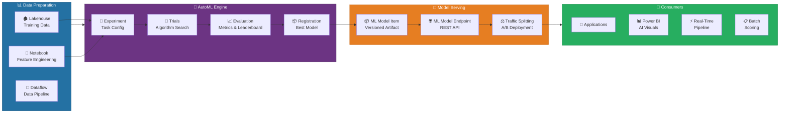
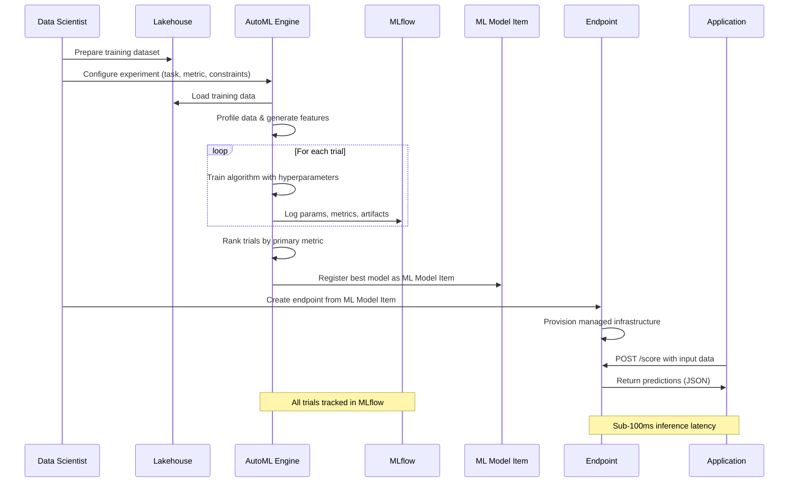
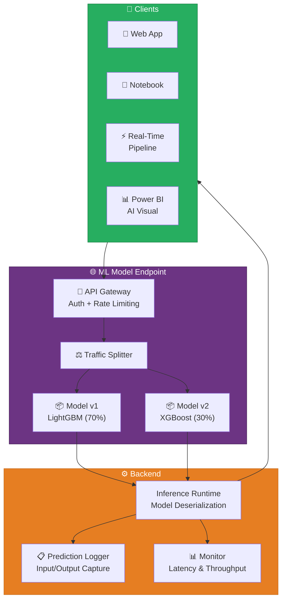
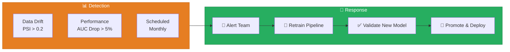
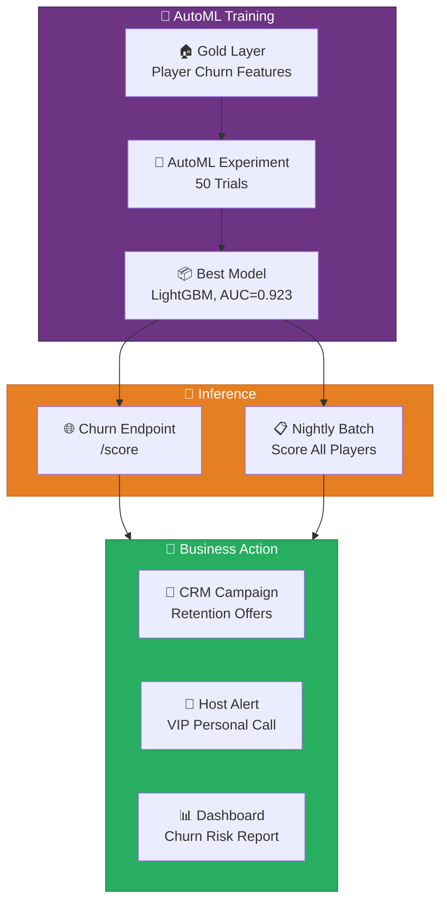

# 🤖 AutoML & ML Model Endpoints - Automated Training and Real-Time Serving

<div align="center" markdown>

**Automated Machine Learning and RESTful Model Serving in Microsoft Fabric**


</div>

---

**Last Updated:** `2026-04-13` | **Version:** 1.0.0

---

## 🎯 Overview

AutoML in Microsoft Fabric (GA March 2026) provides automated machine learning training for classification, regression, and time series forecasting tasks directly within the Fabric workspace. By automating feature engineering, algorithm selection, and hyperparameter tuning, AutoML enables data scientists and analysts to produce production-quality models without extensive manual experimentation. Every trial, metric, and artifact is tracked in MLflow, providing full reproducibility and governance.

ML Model Endpoints (Preview) extend the model lifecycle by enabling one-click deployment of trained ML Model items as RESTful inference endpoints. Applications, notebooks, pipelines, and real-time streams can call these endpoints to score new data in milliseconds, closing the gap between model development and operational consumption.

### Key Capabilities

| Capability | Description |
|-----------|-------------|
| **AutoML Experiment** | Automated search across algorithms and hyperparameters for classification, regression, and forecasting |
| **Intelligent Featurization** | Automatic imputation, encoding, scaling, and feature crossing based on data profiling |
| **Cross-Validation** | Configurable k-fold cross-validation with stratification for imbalanced datasets |
| **MLflow Tracking** | Every trial logs parameters, metrics, and artifacts to the Fabric MLflow tracking server |
| **ML Model Item** | First-class Fabric item that packages a trained model with metadata, lineage, and versioning |
| **ML Model Endpoint** | RESTful HTTPS endpoint serving an ML Model item with authentication and traffic management |
| **A/B Traffic Splitting** | Route percentages of inference traffic to different model versions for canary deployments |
| **Entra ID + API Key Auth** | Dual authentication modes for enterprise SSO and programmatic access |

### AutoML vs Manual Training

| Aspect | Manual Training | AutoML |
|--------|----------------|--------|
| **Algorithm selection** | Data scientist chooses | Automated search across 20+ algorithms |
| **Hyperparameter tuning** | Grid/random/Bayesian by hand | Intelligent Bayesian optimization |
| **Feature engineering** | Custom preprocessing pipeline | Automated featurization with profiling |
| **Time to first model** | Hours to days | Minutes to hours |
| **Reproducibility** | Depends on discipline | Built-in MLflow logging for every trial |
| **Best for** | Novel architectures, custom loss functions | Standard ML tasks with tabular data |

> 📝 **Note**: AutoML does not replace custom deep learning workflows. It is optimized for tabular data tasks (classification, regression, forecasting) using scikit-learn, LightGBM, XGBoost, and Prophet family algorithms. For custom neural network training, use Fabric notebooks with PyTorch or TensorFlow.

---

## 🏗️ Architecture Overview

AutoML and ML Model Endpoints operate as integrated layers within the Fabric Data Science workload. AutoML produces ML Model items stored in OneLake, and ML Model Endpoints serve those items via managed infrastructure.

### End-to-End Architecture



### Component Details

| Component | Role | Key Details |
|-----------|------|-------------|
| **AutoML Experiment** | Orchestrates the automated training process | Configures task type, primary metric, constraints, featurization |
| **Trial Runner** | Executes individual algorithm + hyperparameter combinations | Runs on Spark clusters with configurable concurrency |
| **MLflow Tracking** | Records parameters, metrics, and artifacts for each trial | Integrated Fabric MLflow server -- no external setup |
| **ML Model Item** | Fabric-native artifact storing the trained model | Includes model binary, conda environment, signature, and lineage |
| **ML Model Endpoint** | Managed REST API serving the model | Auto-scaling, authentication, versioning, and traffic splitting |
| **Model Monitor** | Tracks prediction performance and data drift | Compares incoming data distribution against training baseline |

### Data Flow Sequence



---

## ⚙️ AutoML Configuration

### Supported Task Types

| Task Type | Description | Primary Metrics | Algorithm Pool |
|-----------|-------------|-----------------|----------------|
| **Classification** | Predict discrete class labels | AUC_weighted, accuracy, precision, recall, F1 | LightGBM, XGBoost, RandomForest, LogisticRegression, SVM, KNN, GradientBoosting, ExtraTrees |
| **Regression** | Predict continuous numeric values | RMSE, MAE, R2, MAPE | LightGBM, XGBoost, RandomForest, ElasticNet, Lasso, Ridge, GradientBoosting, DecisionTree |
| **Forecasting** | Predict time series values | RMSE, MAE, MAPE, R2 | Prophet, ARIMA, ExponentialSmoothing, LightGBM (temporal), SeasonalNaive, Theta |

### Experiment Configuration

```python
# Databricks notebook source
# COMMAND ----------
# MAGIC %md
# MAGIC ## AutoML Experiment Configuration
# MAGIC Configure and run an AutoML experiment in Fabric.

# COMMAND ----------

from fabric.ml.automl import AutoMLExperiment
from fabric.ml.automl.config import ClassificationConfig, RegressionConfig, ForecastingConfig

# Classification example: Player churn prediction
churn_config = ClassificationConfig(
    experiment_name="casino-player-churn-v3",
    training_data="lh_gold.gold_player_churn_features",
    label_column="is_churned",
    primary_metric="AUC_weighted",

    # Feature configuration
    feature_columns=[
        "avg_daily_wager", "visit_frequency_30d", "days_since_last_visit",
        "total_lifetime_value", "loyalty_tier", "preferred_game_type",
        "avg_session_duration_min", "comp_redemption_rate",
        "win_loss_ratio_90d", "device_count"
    ],

    # AutoML constraints
    max_trials=50,
    max_concurrent_trials=5,
    timeout_minutes=120,
    early_stopping=True,
    early_stopping_patience=10,

    # Cross-validation
    n_cross_validations=5,
    stratified=True,  # Important for imbalanced churn labels

    # Featurization
    featurization="auto",  # auto | custom | off
    enable_feature_interaction=True,
    max_feature_interaction_depth=2,

    # Blocked algorithms (optional -- exclude slow ones)
    blocked_algorithms=["SVM"],

    # MLflow
    log_training_metrics=True,
    log_feature_importance=True
)

# COMMAND ----------

# Run the experiment
experiment_run = AutoMLExperiment.run(churn_config)
print(f"Experiment ID: {experiment_run.experiment_id}")
print(f"Best trial: {experiment_run.best_trial.trial_id}")
print(f"Best AUC: {experiment_run.best_trial.metrics['AUC_weighted']:.4f}")
print(f"Best algorithm: {experiment_run.best_trial.algorithm}")
```

### Featurization Pipeline

AutoML automatically applies a featurization pipeline based on data profiling. The following transforms are applied per column type:

| Column Type | Transforms Applied | Notes |
|-------------|-------------------|-------|
| **Numeric** | Impute (median), StandardScaler, MinMaxScaler | Outlier clipping optional |
| **Categorical (low cardinality)** | Impute (mode), OneHotEncoding | Up to 128 unique values |
| **Categorical (high cardinality)** | Impute (mode), TargetEncoding, HashEncoding | > 128 unique values |
| **DateTime** | Extract year, month, day, weekday, hour, is_weekend | Plus cyclical sin/cos encoding for hour/month |
| **Text** | TF-IDF (top 300 terms), character n-grams | For short text fields only |
| **Boolean** | Cast to 0/1 integer | No additional transform |
| **Dropped** | Columns with > 90% missing, constant values, or unique IDs | Logged in featurization summary |

> 💡 **Tip**: For maximum control, set `featurization="custom"` and provide a `FeaturizationConfig` object specifying transforms per column. This is recommended when domain knowledge suggests specific encoding strategies (e.g., ordinal encoding for loyalty tiers).

### Hyperparameter Search Strategy

AutoML uses a two-phase search strategy:

1. **Exploration Phase** (first 30% of budget): Random sampling across all algorithms to identify promising families
2. **Exploitation Phase** (remaining 70%): Bayesian optimization (Tree-Parzen Estimator) focused on the top-performing algorithm families

```mermaid
flowchart LR
    subgraph Phase1["🔍 Exploration (30% Budget)"]
        R1["Random Trial 1<br/>LightGBM"]
        R2["Random Trial 2<br/>XGBoost"]
        R3["Random Trial 3<br/>RandomForest"]
        R4["Random Trial 4<br/>LogisticReg"]
        R5["Random Trial 5<br/>ElasticNet"]
    end

    subgraph Ranking["📊 Interim Ranking"]
        LB["Leaderboard<br/>Top-3 Families"]
    end

    subgraph Phase2["🎯 Exploitation (70% Budget)"]
        B1["Bayesian Trial 6<br/>LightGBM (tuned)"]
        B2["Bayesian Trial 7<br/>XGBoost (tuned)"]
        B3["Bayesian Trial 8<br/>LightGBM (tuned)"]
        BN["...Trial N"]
    end

    Phase1 --> Ranking --> Phase2

    style Phase1 fill:#2471A3,stroke:#1A5276,color:#fff
    style Ranking fill:#6C3483,stroke:#4A235A,color:#fff
    style Phase2 fill:#E67E22,stroke:#CA6F1E,color:#fff
```



### Cross-Validation Configuration

| Parameter | Default | Description |
|-----------|---------|-------------|
| `n_cross_validations` | 5 | Number of folds |
| `stratified` | True (classification) | Preserve class distribution in each fold |
| `validation_size` | 0.2 | Hold-out fraction when CV is disabled |
| `test_data` | None | Optional separate test dataset for final evaluation |
| `time_column` | Required for forecasting | Column defining temporal ordering |
| `forecast_horizon` | Required for forecasting | Number of periods to predict |

> ⚠️ **Warning**: For forecasting tasks, do not use random k-fold cross-validation. AutoML automatically applies time series cross-validation (expanding window) when the task type is set to `Forecasting`. Ensure the `time_column` parameter is set correctly.

---

## 🤖 Model Training Workflow

### Step 1: Data Preparation

Prepare training data in a Lakehouse Gold table with engineered features:

```python
# Databricks notebook source
# COMMAND ----------
# MAGIC %md
# MAGIC ## Step 1: Prepare Training Dataset
# MAGIC Load and validate the feature table for AutoML training.

# COMMAND ----------

from pyspark.sql import SparkSession
from pyspark.sql.functions import col, when, datediff, current_date, avg, count, sum as spark_sum

spark = SparkSession.builder.getOrCreate()

# Load player activity data from Gold layer
player_features = spark.sql("""
    SELECT
        p.player_id,
        p.loyalty_tier,
        p.enrollment_date,
        DATEDIFF(CURRENT_DATE(), p.last_visit_date) AS days_since_last_visit,
        a.avg_daily_wager,
        a.visit_frequency_30d,
        a.total_lifetime_value,
        a.preferred_game_type,
        a.avg_session_duration_min,
        a.comp_redemption_rate,
        a.win_loss_ratio_90d,
        a.device_count,
        CASE
            WHEN DATEDIFF(CURRENT_DATE(), p.last_visit_date) > 90 THEN 1
            ELSE 0
        END AS is_churned
    FROM lh_gold.gold_player_profiles p
    JOIN lh_gold.gold_player_activity_agg a ON p.player_id = a.player_id
    WHERE p.enrollment_date < DATEADD(MONTH, -3, CURRENT_DATE())
""")

# Validate data quality
print(f"Total records: {player_features.count()}")
print(f"Churn rate: {player_features.filter(col('is_churned') == 1).count() / player_features.count():.2%}")
print(f"Null counts:")
for c in player_features.columns:
    null_count = player_features.filter(col(c).isNull()).count()
    if null_count > 0:
        print(f"  {c}: {null_count}")

# COMMAND ----------

# Save as Delta table for AutoML input
player_features.write.format("delta").mode("overwrite").saveAsTable("lh_gold.gold_player_churn_features")
```

### Step 2: Run AutoML Experiment

```python
# Databricks notebook source
# COMMAND ----------
# MAGIC %md
# MAGIC ## Step 2: Execute AutoML Experiment
# MAGIC Run the AutoML experiment and review trial results.

# COMMAND ----------

from fabric.ml.automl import AutoMLExperiment
from fabric.ml.automl.config import ClassificationConfig

config = ClassificationConfig(
    experiment_name="casino-player-churn-v3",
    training_data="lh_gold.gold_player_churn_features",
    label_column="is_churned",
    primary_metric="AUC_weighted",
    max_trials=50,
    max_concurrent_trials=5,
    timeout_minutes=120,
    n_cross_validations=5,
    stratified=True,
    featurization="auto"
)

run = AutoMLExperiment.run(config)

# COMMAND ----------

# Review the leaderboard
leaderboard = run.get_leaderboard()
print(leaderboard[["trial_id", "algorithm", "AUC_weighted", "accuracy", "F1_weighted", "duration_sec"]].to_string())

# COMMAND ----------

# Inspect the best trial
best = run.best_trial
print(f"\nBest Trial: {best.trial_id}")
print(f"Algorithm: {best.algorithm}")
print(f"AUC: {best.metrics['AUC_weighted']:.4f}")
print(f"Accuracy: {best.metrics['accuracy']:.4f}")
print(f"Feature importances:")
for feat, imp in sorted(best.feature_importances.items(), key=lambda x: -x[1])[:10]:
    print(f"  {feat}: {imp:.4f}")
```

### Step 3: Register the Best Model

```python
# Databricks notebook source
# COMMAND ----------
# MAGIC %md
# MAGIC ## Step 3: Register as ML Model Item
# MAGIC Save the best model as a versioned Fabric ML Model item.

# COMMAND ----------

from fabric.ml.model import MLModel

# Register the best trial as a Fabric ML Model item
model = MLModel.register(
    name="casino-player-churn",
    model_source=run.best_trial,
    description="Player churn classification model trained via AutoML. Predicts 90-day churn.",
    tags={
        "domain": "casino",
        "task": "classification",
        "primary_metric": "AUC_weighted",
        "best_auc": str(round(run.best_trial.metrics["AUC_weighted"], 4)),
        "algorithm": run.best_trial.algorithm,
        "training_data": "lh_gold.gold_player_churn_features",
        "phase": "9"
    }
)

print(f"Model registered: {model.name} v{model.version}")
print(f"Model ID: {model.model_id}")
```

### Step 4: Deploy to Endpoint

See the [ML Model Endpoints](#-ml-model-endpoints) section below.

---

## 🔌 ML Model Endpoints

ML Model Endpoints (Preview) provide managed RESTful inference serving for ML Model items. Once deployed, applications can score new data by sending HTTP POST requests to the endpoint URL.

### Endpoint Architecture



### Creating an Endpoint

```python
# Databricks notebook source
# COMMAND ----------
# MAGIC %md
# MAGIC ## Create ML Model Endpoint
# MAGIC Deploy the registered ML Model item as a REST API.

# COMMAND ----------

from fabric.ml.endpoint import MLModelEndpoint

# Create the endpoint
endpoint = MLModelEndpoint.create(
    name="casino-churn-prediction",
    model_name="casino-player-churn",
    model_version=1,
    description="Real-time player churn scoring endpoint",

    # Authentication configuration
    auth_mode="entra_id",  # "entra_id" | "api_key" | "both"

    # Scaling configuration
    instance_type="Standard_DS3_v2",
    instance_count=2,
    min_instances=1,
    max_instances=5,
    scale_up_threshold_pct=70,
    scale_down_threshold_pct=30
)

print(f"Endpoint URL: {endpoint.scoring_uri}")
print(f"Status: {endpoint.state}")
```

### Authentication

ML Model Endpoints support two authentication modes:

| Auth Mode | Use Case | Configuration |
|-----------|----------|---------------|
| **Entra ID (AAD)** | Enterprise SSO, user-delegated access | Bearer token from Microsoft Entra ID tenant |
| **API Key** | Programmatic access, service-to-service | Primary/secondary keys rotatable from Fabric UI |
| **Both** | Maximum flexibility | Either auth method accepted |

```python
# COMMAND ----------
# MAGIC %md
# MAGIC ### Calling the Endpoint

# COMMAND ----------

import requests
import json

# Option 1: Entra ID authentication
from azure.identity import DefaultAzureCredential

credential = DefaultAzureCredential()
token = credential.get_token("https://ml.fabric.microsoft.com/.default")

headers = {
    "Authorization": f"Bearer {token.token}",
    "Content-Type": "application/json"
}

# Option 2: API key authentication
# headers = {
#     "Authorization": f"Bearer {endpoint.primary_key}",
#     "Content-Type": "application/json"
# }

# Score a single player
payload = {
    "input_data": {
        "columns": [
            "avg_daily_wager", "visit_frequency_30d", "days_since_last_visit",
            "total_lifetime_value", "loyalty_tier", "preferred_game_type",
            "avg_session_duration_min", "comp_redemption_rate",
            "win_loss_ratio_90d", "device_count"
        ],
        "data": [
            [250.00, 12, 15, 45000.00, "Gold", "Slots",
             120.5, 0.65, 0.92, 2]
        ]
    }
}

response = requests.post(
    endpoint.scoring_uri,
    headers=headers,
    json=payload,
    timeout=30
)

result = response.json()
print(f"Churn probability: {result['predictions'][0]['churn_probability']:.4f}")
print(f"Churn prediction: {'Yes' if result['predictions'][0]['is_churned'] else 'No'}")
```

### Versioning and Traffic Splitting

Traffic splitting enables canary deployments and A/B testing of model versions:

```python
# COMMAND ----------
# MAGIC %md
# MAGIC ### A/B Traffic Splitting

# COMMAND ----------

from fabric.ml.endpoint import TrafficRule

# Deploy a new model version alongside the existing one
endpoint.add_deployment(
    deployment_name="v2-xgboost",
    model_name="casino-player-churn",
    model_version=2,
    instance_type="Standard_DS3_v2",
    instance_count=1
)

# Split traffic: 70% to v1, 30% to v2
endpoint.update_traffic(
    rules=[
        TrafficRule(deployment="v1-lightgbm", weight=70),
        TrafficRule(deployment="v2-xgboost", weight=30)
    ]
)

# After validation, shift 100% to v2
endpoint.update_traffic(
    rules=[
        TrafficRule(deployment="v2-xgboost", weight=100)
    ]
)

# Remove old deployment
endpoint.remove_deployment("v1-lightgbm")
```

### Endpoint Configuration Options

| Parameter | Default | Description |
|-----------|---------|-------------|
| `instance_type` | Standard_DS3_v2 | Compute SKU for inference nodes |
| `instance_count` | 1 | Initial number of instances |
| `min_instances` | 1 | Minimum instances for auto-scale |
| `max_instances` | 10 | Maximum instances for auto-scale |
| `request_timeout_ms` | 5000 | Maximum time per scoring request |
| `max_batch_size` | 100 | Maximum rows per single request |
| `enable_app_insights` | True | Log requests to Application Insights |
| `liveness_probe_period_s` | 10 | Health check interval |

> 💡 **Tip**: Start with `min_instances=1` for development and increase to `min_instances=2` for production to ensure zero-downtime during scale events or instance failures.

---

## 📊 Monitoring and Drift Detection

### Performance Monitoring Dashboard

ML Model Endpoints emit telemetry that can be visualized in Real-Time Dashboards or Power BI:

| Metric | Description | Alert Threshold |
|--------|-------------|-----------------|
| **Inference Latency (P50/P95/P99)** | Response time percentiles | P95 > 200ms |
| **Requests per Second** | Throughput | Sustained > 80% of max capacity |
| **Error Rate** | 4xx/5xx response percentage | > 1% |
| **Model Accuracy (online)** | Prediction correctness vs ground truth | AUC drop > 5% from baseline |
| **Input Data Drift** | Distribution shift in input features | KL divergence > 0.1 |
| **Prediction Drift** | Distribution shift in model outputs | PSI > 0.2 |

### Data Drift Detection

```python
# Databricks notebook source
# COMMAND ----------
# MAGIC %md
# MAGIC ## Data Drift Monitoring
# MAGIC Compare incoming inference data against training baseline.

# COMMAND ----------

from fabric.ml.monitor import DriftMonitor

# Create a drift monitor for the endpoint
monitor = DriftMonitor.create(
    name="churn-drift-monitor",
    endpoint_name="casino-churn-prediction",
    baseline_data="lh_gold.gold_player_churn_features",  # Training data
    monitoring_features=[
        "avg_daily_wager", "visit_frequency_30d", "days_since_last_visit",
        "total_lifetime_value", "avg_session_duration_min",
        "comp_redemption_rate", "win_loss_ratio_90d"
    ],
    
    # Drift detection settings
    drift_method="psi",  # Population Stability Index
    drift_threshold=0.2,
    
    # Monitoring schedule
    evaluation_frequency="daily",
    lookback_window_days=7,
    
    # Alerting
    alert_on_drift=True,
    alert_email="datascience-team@casino.com",
    alert_teams_webhook="https://hooks.teams.com/workflows/drift-alerts"
)

print(f"Monitor created: {monitor.monitor_id}")

# COMMAND ----------

# Check drift status
drift_report = monitor.get_latest_report()
print(f"Evaluation date: {drift_report.evaluation_date}")
print(f"Overall drift detected: {drift_report.drift_detected}")
print(f"\nFeature drift scores:")
for feature, score in drift_report.feature_scores.items():
    status = "⚠️ DRIFT" if score > 0.2 else "✅ OK"
    print(f"  {feature}: PSI={score:.4f} {status}")
```

### Retraining Triggers

| Trigger | Condition | Action |
|---------|-----------|--------|
| **Data Drift** | PSI > 0.2 for any monitored feature | Alert + queue retraining pipeline |
| **Performance Decay** | AUC drops > 5% below baseline | Alert + mandatory retraining |
| **Scheduled** | Monthly or quarterly cadence | Automated retrain with latest data |
| **Data Volume** | Training data grows > 20% | Queue incremental retraining |



---

## 🎰 Casino Implementation

### Use Case 1: Player Churn Prediction

Predict which loyalty program members are likely to stop visiting within the next 90 days, enabling proactive retention campaigns.

#### Feature Engineering

| Feature | Source | Description |
|---------|--------|-------------|
| `avg_daily_wager` | Gold aggregation | Average daily wager over last 30 days |
| `visit_frequency_30d` | Gold aggregation | Number of visits in last 30 days |
| `days_since_last_visit` | Player profile | Calendar days since last recorded visit |
| `total_lifetime_value` | Gold aggregation | Total coin-in minus payouts over lifetime |
| `loyalty_tier` | Player profile | Bronze / Silver / Gold / Platinum / Diamond |
| `preferred_game_type` | Gold aggregation | Most frequently played game category |
| `avg_session_duration_min` | Gold aggregation | Average session length in minutes |
| `comp_redemption_rate` | Gold aggregation | Fraction of earned comps actually redeemed |
| `win_loss_ratio_90d` | Gold aggregation | Win/loss ratio over last 90 days |
| `device_count` | Player profile | Number of unique devices used (mobile, kiosk) |

#### Deployment Architecture



#### Business Impact

| Metric | Before AutoML | After AutoML | Improvement |
|--------|--------------|--------------|-------------|
| Churn prediction accuracy | 72% (rule-based) | 92% (AutoML LightGBM) | +20% |
| False positive rate | 35% | 8% | -77% |
| Retention campaign ROI | 1.8x | 4.2x | +133% |
| Time to build model | 3 weeks (manual) | 4 hours (AutoML) | -97% |

### Use Case 2: Fraud Detection Endpoint

Deploy a real-time fraud scoring endpoint consumed by the Eventstream pipeline for transaction monitoring.

```python
# Databricks notebook source
# COMMAND ----------
# MAGIC %md
# MAGIC ## Real-Time Fraud Scoring
# MAGIC Integrate the fraud model endpoint with Eventstream for live transaction scoring.

# COMMAND ----------

# In the Eventstream custom operator or notebook:
import requests
from azure.identity import ManagedIdentityCredential

credential = ManagedIdentityCredential()
token = credential.get_token("https://ml.fabric.microsoft.com/.default")

def score_transaction(transaction: dict) -> dict:
    """Score a single transaction against the fraud detection endpoint."""
    payload = {
        "input_data": {
            "columns": [
                "transaction_amount", "transaction_type", "player_id",
                "time_since_last_txn_min", "daily_txn_count",
                "is_foreign_currency", "velocity_score"
            ],
            "data": [[
                transaction["amount"],
                transaction["type"],
                transaction["player_id"],
                transaction["time_since_last"],
                transaction["daily_count"],
                transaction["is_foreign"],
                transaction["velocity"]
            ]]
        }
    }

    response = requests.post(
        "https://fabric-ml.microsoft.com/endpoints/casino-fraud-detection/score",
        headers={
            "Authorization": f"Bearer {token.token}",
            "Content-Type": "application/json"
        },
        json=payload,
        timeout=5
    )

    result = response.json()
    return {
        "fraud_probability": result["predictions"][0]["fraud_probability"],
        "is_fraud": result["predictions"][0]["is_fraud"],
        "risk_category": result["predictions"][0]["risk_category"]
    }

# COMMAND ----------

# Route high-risk transactions to compliance review
def process_transaction(event):
    score = score_transaction(event)
    event["fraud_score"] = score["fraud_probability"]
    event["fraud_flag"] = score["is_fraud"]

    if score["fraud_probability"] > 0.85:
        # SAR alert: potential structuring or suspicious activity
        send_to_compliance_queue(event)

    if score["is_fraud"]:
        # Block transaction and alert security
        block_transaction(event)

    return event
```

#### Compliance Integration

| Threshold | Action | Regulation |
|-----------|--------|------------|
| Fraud score > 0.85 | Alert compliance team + SAR review | BSA/AML |
| Single transaction > $10,000 | Automatic CTR filing | BSA 31 CFR 103.22 |
| Multiple transactions $8K-$9.9K from same player | Structuring alert | BSA anti-structuring |
| Fraud score > 0.95 | Block transaction + alert security | Internal policy |

---

## 🏛️ Federal Agency Implementation

### 🌀 NOAA: Weather Severity Forecasting

Use AutoML forecasting to predict severe weather event likelihood based on historical observation data, enabling proactive alert issuance.

#### Training Configuration

```python
# Databricks notebook source
# COMMAND ----------
# MAGIC %md
# MAGIC ## NOAA Severe Weather Forecasting
# MAGIC AutoML time-series forecasting for severe weather event probability.

# COMMAND ----------

from fabric.ml.automl import AutoMLExperiment
from fabric.ml.automl.config import ForecastingConfig

noaa_config = ForecastingConfig(
    experiment_name="noaa-severe-weather-forecast-v2",
    training_data="lh_gold.gold_noaa_weather_severity_features",
    label_column="severe_event_count",
    time_column="observation_date",
    
    # Forecasting parameters
    forecast_horizon=7,  # 7-day forecast
    frequency="D",  # Daily observations
    
    primary_metric="RMSE",
    
    feature_columns=[
        "station_id", "region", "avg_temperature", "max_wind_speed",
        "min_pressure", "precipitation_24h", "humidity_pct",
        "temperature_delta_24h", "pressure_delta_24h",
        "historical_severe_count_30d", "season", "enso_index"
    ],
    
    # Time series specific settings
    target_rolling_window_size=7,
    target_lags=[1, 3, 7, 14],
    
    max_trials=40,
    max_concurrent_trials=4,
    timeout_minutes=90,
    n_cross_validations=3
)

run = AutoMLExperiment.run(noaa_config)

# COMMAND ----------

# Review forecast accuracy
best = run.best_trial
print(f"Best algorithm: {best.algorithm}")
print(f"RMSE: {best.metrics['RMSE']:.3f}")
print(f"MAE: {best.metrics['MAE']:.3f}")
print(f"MAPE: {best.metrics['MAPE']:.1f}%")
```

#### Deployment for Real-Time Alerting

```mermaid
flowchart LR
    subgraph Data["📊 NOAA Data"]
        OBS["Weather<br/>Observations"]
        HIST["Historical<br/>Severe Events"]
    end

    subgraph Model["🤖 AutoML Model"]
        FEAT["Feature<br/>Engineering"]
        TRAIN["AutoML<br/>Forecasting"]
        REG["ML Model<br/>Item"]
    end

    subgraph Serving["🌐 Endpoint"]
        EP["Severity Forecast<br/>Endpoint"]
        SCORE["7-Day<br/>Prediction"]
    end

    subgraph Action["🎯 Action"]
        NWS["NWS Watch/<br/>Warning"]
        FEMA["FEMA<br/>Readiness"]
        PUB["Public<br/>Notification"]
    end

    Data --> Model --> Serving --> Action

    style Data fill:#2471A3,stroke:#1A5276,color:#fff
    style Model fill:#6C3483,stroke:#4A235A,color:#fff
    style Serving fill:#E67E22,stroke:#CA6F1E,color:#fff
    style Action fill:#27AE60,stroke:#1E8449,color:#fff
```



### 🌊 EPA: Water Quality Classification Endpoint

Deploy a classification endpoint that continuously scores water treatment plant samples against Safe Drinking Water Act thresholds.

#### Training Configuration

```python
# Databricks notebook source
# COMMAND ----------
# MAGIC %md
# MAGIC ## EPA Water Quality Classification
# MAGIC AutoML classification for SDWA compliance status prediction.

# COMMAND ----------

from fabric.ml.automl import AutoMLExperiment
from fabric.ml.automl.config import ClassificationConfig

epa_config = ClassificationConfig(
    experiment_name="epa-water-quality-compliance-v2",
    training_data="lh_gold.gold_epa_water_quality_features",
    label_column="compliance_status",  # "compliant" | "warning" | "violation"
    primary_metric="AUC_weighted",
    
    feature_columns=[
        "facility_id", "source_type", "treatment_method",
        "ph_level", "turbidity_ntu", "chlorine_residual_mg_l",
        "total_coliform_count", "lead_ppb", "copper_ppb",
        "nitrate_mg_l", "arsenic_ppb", "fluoride_mg_l",
        "flow_rate_mgd", "temperature_c",
        "days_since_last_inspection", "historical_violation_count",
        "season", "population_served"
    ],
    
    max_trials=50,
    max_concurrent_trials=5,
    timeout_minutes=120,
    n_cross_validations=5,
    stratified=True  # Important: violation class is rare
)

run = AutoMLExperiment.run(epa_config)

# COMMAND ----------

# Register model
from fabric.ml.model import MLModel

model = MLModel.register(
    name="epa-water-quality-compliance",
    model_source=run.best_trial,
    description="Water quality compliance classification. Predicts SDWA compliance status.",
    tags={
        "domain": "epa",
        "regulation": "SDWA",
        "task": "multiclass_classification",
        "classes": "compliant,warning,violation"
    }
)

# COMMAND ----------

# Deploy as endpoint
from fabric.ml.endpoint import MLModelEndpoint

endpoint = MLModelEndpoint.create(
    name="epa-water-quality-scorer",
    model_name="epa-water-quality-compliance",
    model_version=1,
    auth_mode="both",
    instance_count=2,
    min_instances=1,
    max_instances=4
)

print(f"Endpoint URL: {endpoint.scoring_uri}")
```

#### Compliance Thresholds

| Parameter | MCL (EPA Limit) | Model Feature | Alert Action |
|-----------|-----------------|---------------|--------------|
| Lead | 15 ppb (action level) | `lead_ppb` | Notify state primacy agency within 24h |
| Copper | 1300 ppb (action level) | `copper_ppb` | Notify state primacy agency within 24h |
| Total Coliform | 5% positive samples/month | `total_coliform_count` | Issue public notice |
| Turbidity | 4 NTU (never exceed) | `turbidity_ntu` | Immediate state notification |
| Nitrate | 10 mg/L | `nitrate_mg_l` | Issue public notice within 24h |
| Arsenic | 10 ppb | `arsenic_ppb` | Quarterly consumer notice |

> ⚠️ **Warning**: ML model predictions complement but do not replace regulatory laboratory testing. All compliance determinations must be based on certified laboratory analysis per EPA Method 200.8 (metals), Method 524.2 (organics), and SM 9223B (coliform). The model serves as an early warning system between scheduled sampling events.

### Cross-Agency Model Comparison

| Agency | Task Type | Primary Metric | Best Algorithm | Score | Endpoint Latency |
|--------|-----------|----------------|----------------|-------|------------------|
| Casino (Churn) | Classification | AUC_weighted | LightGBM | 0.923 | 45ms |
| Casino (Fraud) | Classification | AUC_weighted | XGBoost | 0.967 | 32ms |
| NOAA (Severity) | Forecasting | RMSE | Prophet + LightGBM | 1.24 | 78ms |
| EPA (Water Quality) | Multiclass | AUC_weighted | GradientBoosting | 0.941 | 52ms |
| USDA (Crop Yield) | Regression | R2 | XGBoost | 0.887 | 41ms |
| DOI (Fire Risk) | Classification | F1_weighted | RandomForest | 0.912 | 55ms |

---

## ⚠️ Limitations

### AutoML Limitations

| Limitation | Details | Workaround |
|-----------|---------|------------|
| **Tabular data only** | No image, text, or audio support | Use custom notebooks with PyTorch/TensorFlow |
| **Max training data** | 100 GB per experiment | Sample or partition large datasets |
| **Max features** | 1,000 columns | Feature selection before AutoML |
| **Algorithm pool** | Fixed set of algorithms per task type | Use custom training for exotic algorithms |
| **GPU training** | Not available in AutoML (CPU only) | Use manual notebooks for GPU-intensive models |
| **Custom metrics** | Cannot define custom optimization metrics | Use closest built-in metric + post-hoc evaluation |
| **Streaming data** | AutoML trains on static snapshots | Schedule periodic retraining with latest data |

### ML Model Endpoint Limitations (Preview)

| Limitation | Details | Expected Resolution |
|-----------|---------|---------------------|
| **Cold start latency** | First request after scale-from-zero: 30-90 seconds | Set `min_instances=1` to avoid |
| **Max concurrent requests** | 200 per instance (varies by SKU) | Scale horizontally with auto-scaling |
| **Model size** | Max 5 GB model artifact | Compress models or use ensemble decomposition |
| **Request payload** | Max 100 rows per request, 6 MB payload | Batch into multiple requests |
| **Response timeout** | Max 60 seconds per request | Optimize model inference or reduce batch size |
| **Supported frameworks** | MLflow-compatible models (sklearn, LightGBM, XGBoost, Prophet) | Custom serving for PyTorch/TF models via notebooks |
| **Regions** | Available in Fabric GA regions; some SKUs restricted | Check regional availability |
| **No GPU inference** | CPU-only inference nodes | Use Azure ML managed endpoints for GPU inference |

### What is Not Supported

| Capability | Alternative |
|-----------|-------------|
| Deep learning training (CNN, Transformer) | Fabric notebooks with PyTorch/TensorFlow |
| Real-time feature stores | Azure ML managed feature store |
| GPU inference | Azure ML managed online endpoints |
| Multi-model endpoints (different schemas) | Separate endpoints per model |
| Custom Docker containers | Azure ML custom containers |
| A/B testing with statistical significance | Manual analysis or Azure ML experimentation |

> 📝 **Note**: ML Model Endpoints are in Preview as of April 2026. Feature availability, limits, and pricing are subject to change. For production workloads requiring SLA guarantees, consider Azure ML managed online endpoints until ML Model Endpoints reach GA.

---

## 📚 References

| Resource | URL |
|----------|-----|
| AutoML in Fabric Overview | https://learn.microsoft.com/fabric/data-science/automl-overview |
| ML Model Items | https://learn.microsoft.com/fabric/data-science/machine-learning-model |
| ML Model Endpoints (Preview) | https://learn.microsoft.com/fabric/data-science/machine-learning-model-endpoint |
| MLflow in Fabric | https://learn.microsoft.com/fabric/data-science/mlflow-autologging |
| Fabric Data Science Overview | https://learn.microsoft.com/fabric/data-science/data-science-overview |
| Azure ML Managed Endpoints (comparison) | https://learn.microsoft.com/azure/machine-learning/concept-endpoints |
| Fabric Capacity Planning | https://learn.microsoft.com/fabric/enterprise/licenses |
| BSA/AML Compliance (FinCEN) | https://www.fincen.gov/resources/statutes-and-regulations |
| EPA Safe Drinking Water Act | https://www.epa.gov/sdwa |

---

## 🔗 Related Documents

- [Fabric IQ](fabric-iq.md) -- Natural language querying that can invoke ML model results
- [Real-Time Intelligence](real-time-intelligence.md) -- RTI pipeline integration with fraud endpoints
- [Data Agents](data-agents.md) -- AI agents that consume ML endpoint predictions
- [AI Copilot Configuration](ai-copilot-configuration.md) -- Copilot assistance for notebook-based ML workflows
- [Digital Twin Builder](digital-twin-builder.md) -- Digital twins enhanced with predictive models
- [Architecture](../ARCHITECTURE.md) -- System architecture overview

---

> 📝 **Document Metadata**
> - **Author**: Documentation Team
> - **Reviewers**: Data Science, Data Engineering, Compliance, Federal Programs
> - **Classification**: Internal
> - **Next Review**: 2026-07-13
