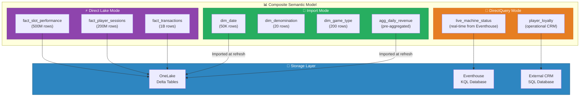
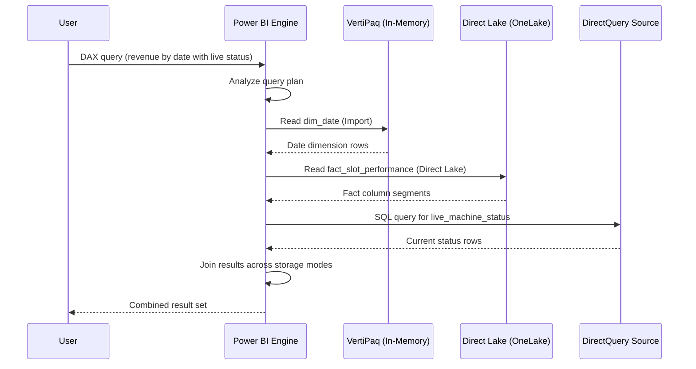
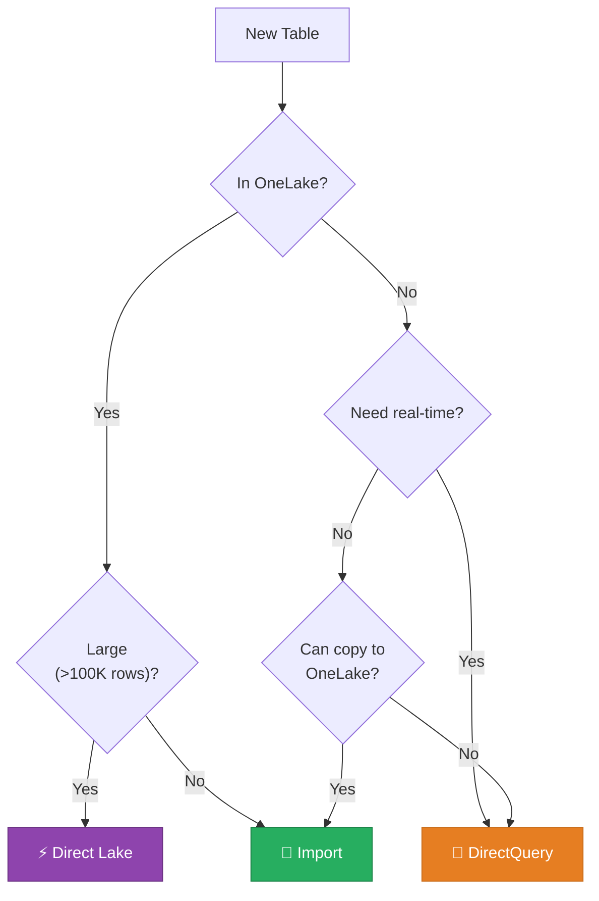
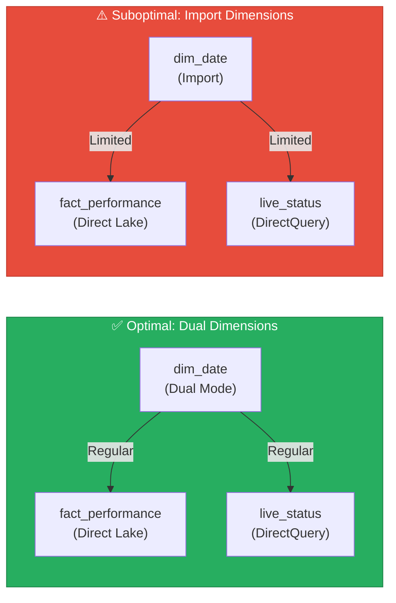
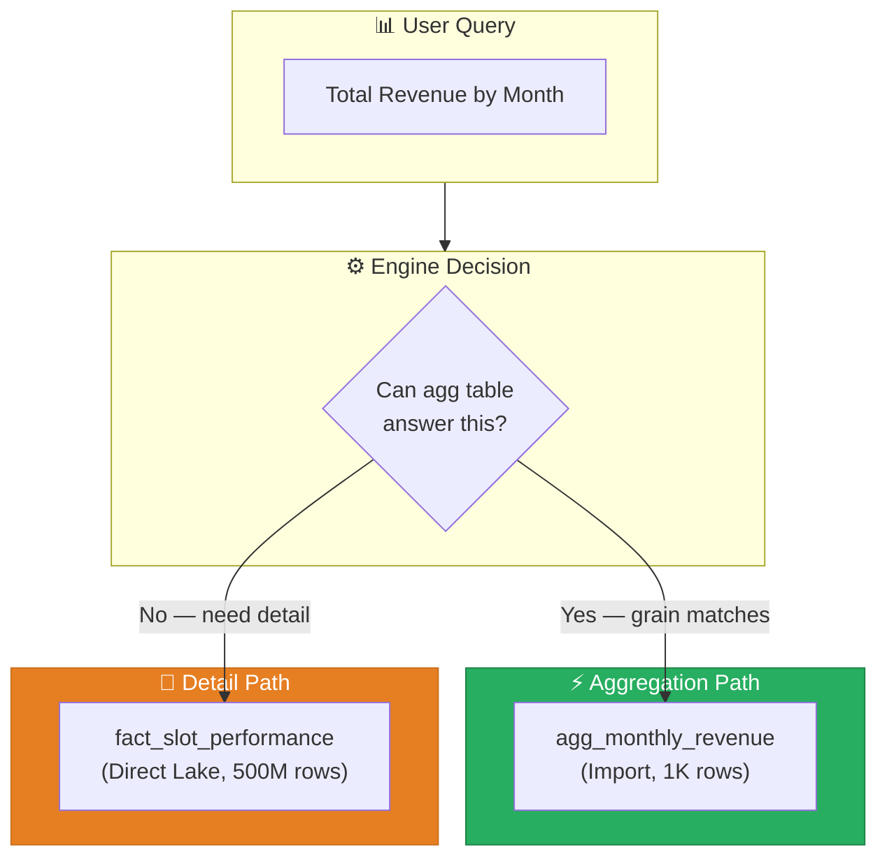
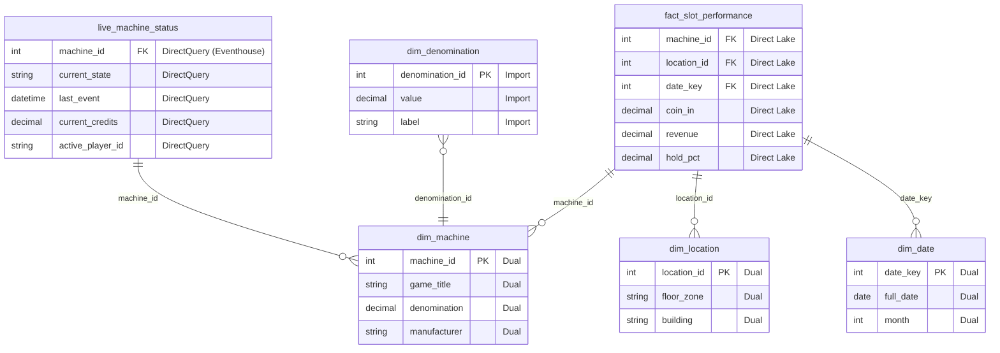
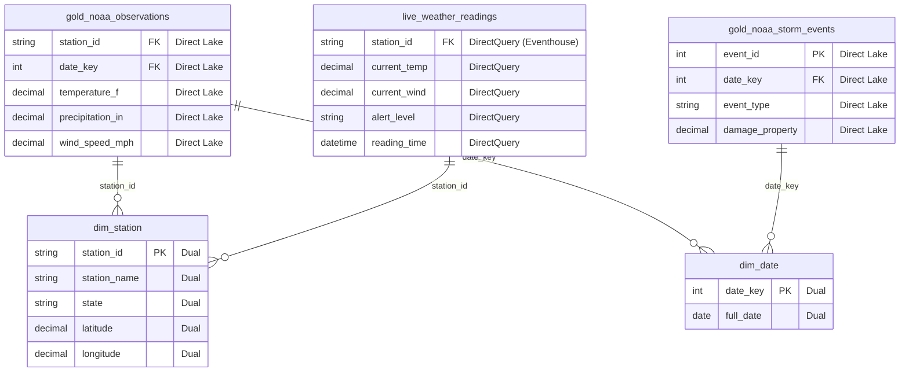

# 🔀 Composite Models - Mixed Storage Mode Semantic Models

<div align="center" markdown>

**Combine Import, DirectQuery, and Direct Lake in a Single Semantic Model for Maximum Flexibility**


</div>

---

**Last Updated:** `2026-04-21` | **Version:** 1.0.0

---

## 🎯 Overview

Composite Models in Power BI allow a single semantic model to contain tables with different storage modes — **Import**, **DirectQuery**, and **Direct Lake** — in the same model. This enables architects to optimize each table's storage independently: import small reference data for maximum performance, use Direct Lake for large fact tables that need freshness, and connect via DirectQuery to external sources that cannot be copied into OneLake.

### Why Composite Models Matter

Real-world analytics rarely fit a single storage mode. A casino dashboard might need sub-second performance on slot telemetry (Direct Lake from OneLake), always-current player loyalty data (DirectQuery to an operational database), and a static denomination lookup table (Import). Composite models make this possible in a single semantic model without duplicating data or maintaining multiple reports.

### Key Capabilities

| Capability | Description |
|-----------|-------------|
| **Mixed Storage Modes** | Combine Import, DirectQuery, and Direct Lake tables in one model |
| **Per-Table Control** | Set storage mode independently for each table |
| **Aggregation Tables** | Pre-aggregated Import tables that accelerate DirectQuery fact tables |
| **Query Delegation** | Engine decides whether to query in-memory or push to source |
| **Chained Models** | Connect to published semantic models as DirectQuery sources |
| **Incremental Adoption** | Convert individual tables from Import to DirectQuery/Direct Lake without rebuilding |

### When to Use Composite Models

| Scenario | Recommended Approach |
|----------|---------------------|
| Large fact tables + small dimensions | Direct Lake facts + Import dimensions |
| OneLake data + external SQL Server data | Direct Lake for OneLake + DirectQuery for SQL Server |
| Real-time KQL data + historical Lakehouse data | DirectQuery to Eventhouse + Direct Lake from Lakehouse |
| Enterprise model + departmental extensions | Chained DirectQuery to shared model + local Import tables |
| Performance optimization via aggregations | Import aggregation tables + DirectQuery detail tables |

---

## 🏗️ Architecture

### Composite Model Storage Modes



### Query Execution Flow



---

## ⚙️ Storage Modes

### Storage Mode Comparison

| Property | Import | DirectQuery | Direct Lake |
|----------|--------|-------------|-------------|
| **Data Location** | In-memory (VertiPaq) | Source system | OneLake → VertiPaq on demand |
| **Freshness** | Stale (refresh schedule) | Always current | Near-real-time (Delta commit) |
| **Performance** | Fastest (sub-second) | Slowest (source query) | Fast (close to Import) |
| **Data Duplication** | Yes (copy into model) | No | No |
| **Best For** | Small dimensions, lookups | External live sources | Large OneLake fact tables |
| **Max Rows (F64)** | ~1B (memory constrained) | Source limit | 3B rows per table (guardrail) |

### Choosing Storage Mode per Table



### Setting Storage Mode in Power BI Desktop

| Step | Action |
|------|--------|
| 1 | Open Model View in Power BI Desktop |
| 2 | Select a table |
| 3 | In Properties pane → Storage Mode |
| 4 | Choose: Import, DirectQuery, or Dual |
| 5 | Repeat for each table |

> ⚠️ **Warning**: Changing a table from Import to DirectQuery is irreversible in that session. Save a backup of your .pbix before changing storage modes.

### Dual Storage Mode

Tables set to **Dual** mode are stored both in-memory (Import) and maintain a DirectQuery connection. The engine automatically chooses the optimal path:

- Joins with Import tables → uses the in-memory copy
- Joins with DirectQuery tables → uses the DirectQuery path

This avoids the limited-relationship penalty when a dimension needs to join with both Import and DirectQuery fact tables.

---

## 🔗 Relationship Rules

### Limited Relationships

When tables have different storage modes, relationships between them may become **limited** — meaning the engine cannot guarantee referential integrity and must apply cross-source join strategies.

| From (1-side) | To (many-side) | Relationship Type | Performance Impact |
|--------------|---------------|-------------------|-------------------|
| Import | Import | **Regular** | None — full VertiPaq optimization |
| Direct Lake | Direct Lake | **Regular** | None — both read from OneLake |
| DirectQuery | DirectQuery (same source) | **Regular** | None — pushed to source |
| Import | DirectQuery | **Limited** | Cross-source join; potential slowdown |
| Import | Direct Lake | **Limited** | Cross-source join; moderate impact |
| Direct Lake | DirectQuery | **Limited** | Cross-source join; potential slowdown |
| DirectQuery (Source A) | DirectQuery (Source B) | **Limited** | Cross-source join; both sides queried independently |

### Impact of Limited Relationships

| Behavior | Regular Relationship | Limited Relationship |
|----------|---------------------|---------------------|
| **Referential integrity assumed** | ✅ Yes | ❌ No |
| **RELATED() function** | ✅ Works | ✅ Works (with caveats) |
| **Many-to-many** | Supported | Supported |
| **Bi-directional filtering** | Default behavior | Must be explicitly enabled |
| **Query plan** | Single-engine optimization | Multi-engine join |
| **Performance** | Optimal | Potentially slower |

### Design Pattern: Minimize Limited Relationships



> 💡 **Tip**: Set shared dimension tables (dim_date, dim_location) to **Dual** mode to maintain regular relationships with both Direct Lake fact tables and DirectQuery sources.

---

## 📊 Query Delegation and Performance

### How the Engine Decides

When a DAX query spans multiple storage modes, the engine:

1. **Decomposes** the query into per-source sub-queries
2. **Pushes down** filters and aggregations to each source
3. **Retrieves** partial results from each source
4. **Joins** partial results in-memory
5. **Evaluates** remaining DAX on the joined result

### Performance Optimization Matrix

| Optimization | Description | Impact |
|-------------|-------------|--------|
| **Filter push-down** | WHERE clauses pushed to DirectQuery sources | Reduces data transferred |
| **Aggregation push-down** | GROUP BY pushed to source when possible | Reduces rows returned |
| **Segment skipping** | Direct Lake skips irrelevant Parquet segments | Reduces I/O |
| **VertiPaq caching** | Import tables fully cached in memory | Sub-millisecond lookups |
| **Dual-mode routing** | Engine picks Import or DQ path based on join context | Avoids limited relationships |

### Performance Anti-Patterns

| Anti-Pattern | Why It's Slow | Fix |
|-------------|---------------|-----|
| Joining Import fact with DQ dimension | Cross-source join on large fact table | Move fact to DQ or dimension to Dual |
| Bi-directional filter on limited relationship | Forces full materialization of both sides | Use single-direction filtering |
| Complex DAX across storage modes | Cannot push down complex calculations | Pre-compute in Gold layer |
| Many DQ sources in one model | Each source adds query latency | Consolidate sources; use OneLake shortcuts |

---

## 📐 Aggregation Tables

### What Are Aggregation Tables?

Aggregation tables are pre-summarized Import-mode tables that the engine automatically uses when a query can be answered at a higher grain. They sit "in front of" a DirectQuery or Direct Lake detail table and intercept compatible queries.

### Aggregation Flow



### Aggregation Table Example

```sql
-- Pre-aggregated monthly revenue (materialized in Gold layer)
CREATE TABLE agg_monthly_revenue AS
SELECT
    date_key_month,
    location_id,
    game_type,
    SUM(coin_in) AS total_coin_in,
    SUM(revenue) AS total_revenue,
    AVG(hold_pct) AS avg_hold_pct,
    COUNT(*) AS record_count
FROM lh_gold.gold_slot_performance
GROUP BY date_key_month, location_id, game_type
```

| Aggregation Column | Function | Detail Column |
|-------------------|----------|---------------|
| total_coin_in | Sum | gold_slot_performance[coin_in] |
| total_revenue | Sum | gold_slot_performance[revenue] |
| avg_hold_pct | Average | gold_slot_performance[hold_pct] |
| record_count | Count | gold_slot_performance[machine_id] |
| date_key_month | GroupBy | dim_date[month_key] |
| location_id | GroupBy | dim_location[location_id] |
| game_type | GroupBy | dim_game[game_type] |

---

## 🎰 Casino Implementation

### Real-Time Slot Dashboard with Historical Context

The casino composite model combines three storage modes to deliver a unified dashboard:

#### Model Design



#### Storage Mode Assignments

| Table | Storage Mode | Rows | Rationale |
|-------|-------------|------|-----------|
| fact_slot_performance | Direct Lake | 500M | Large fact table; needs freshness from OneLake |
| live_machine_status | DirectQuery | ~5K (current) | Real-time machine state from Eventhouse |
| dim_machine | Dual | 5K | Joins with both DL and DQ tables |
| dim_location | Dual | 200 | Joins with both DL and DQ tables |
| dim_date | Dual | 50K | Joins with DL facts |
| dim_denomination | Import | 20 | Tiny static lookup |
| agg_monthly_revenue | Import | 2K | Pre-aggregated for executive dashboard |

#### Key DAX Measures

```dax
// Historical Revenue (from Direct Lake fact table)
Total Revenue =
SUM(fact_slot_performance[revenue])

// Live Machine Count (from DirectQuery Eventhouse)
Active Machines Now =
COUNTROWS(
    FILTER(
        live_machine_status,
        live_machine_status[current_state] = "Active"
    )
)

// Combined: Revenue per Active Machine
Revenue Per Active Machine =
DIVIDE(
    [Total Revenue],
    [Active Machines Now],
    0
)

// Uses aggregation table automatically for monthly grain
Monthly Revenue Trend =
CALCULATE(
    [Total Revenue],
    ALLEXCEPT(dim_date, dim_date[month], dim_date[year])
)
```

---

## 🏛️ Federal Agency Implementation

### NOAA Real-Time Weather + Historical Analysis

A composite model combining real-time weather data from Eventhouse (DirectQuery) with historical climate data from the Lakehouse (Direct Lake).

#### Model Design



#### Storage Mode Assignments

| Table | Storage Mode | Rationale |
|-------|-------------|-----------|
| gold_noaa_observations | Direct Lake | 50M+ historical observations from Lakehouse |
| live_weather_readings | DirectQuery | Real-time KQL queries to Eventhouse |
| gold_noaa_storm_events | Direct Lake | Historical storm data from Lakehouse |
| dim_station | Dual | Shared dimension across DL and DQ sources |
| dim_date | Dual | Shared date dimension |

#### Key DAX Measures

```dax
// Historical Average Temperature (Direct Lake)
Avg Historical Temperature =
AVERAGE(gold_noaa_observations[temperature_f])

// Current Temperature (DirectQuery to Eventhouse)
Current Temperature =
AVERAGE(live_weather_readings[current_temp])

// Temperature Deviation from Historical
Temperature Anomaly =
[Current Temperature] - [Avg Historical Temperature]

// Stations with Active Alerts (DirectQuery)
Stations with Alerts =
COUNTROWS(
    FILTER(
        live_weather_readings,
        live_weather_readings[alert_level] <> "None"
    )
)
```

### Multi-Agency Executive Dashboard

A chained composite model that connects to individual agency semantic models via DirectQuery and adds cross-agency Import reference tables:

| Source | Storage Mode | Agency |
|--------|-------------|--------|
| USDA Semantic Model | DirectQuery (chained) | Agriculture |
| SBA Semantic Model | DirectQuery (chained) | Small Business |
| NOAA Semantic Model | DirectQuery (chained) | Weather/Climate |
| EPA Semantic Model | DirectQuery (chained) | Environment |
| dim_agency | Import | Cross-agency lookup |
| dim_fiscal_period | Import | Unified fiscal calendar |

---

## 🔐 Security

### RLS in Composite Models

RLS applies independently per storage mode:

| Storage Mode | RLS Enforcement |
|-------------|----------------|
| **Import** | VertiPaq applies DAX filter before returning results |
| **Direct Lake** | VertiPaq applies DAX filter on loaded segments |
| **DirectQuery** | DAX filter translated to SQL/KQL WHERE clause and pushed to source |

### Cross-Source Security Considerations

| Concern | Description | Mitigation |
|---------|-------------|-----------|
| **RLS consistency** | Same user may see different data scope per source | Define matching RLS roles across all connected sources |
| **DQ credential exposure** | DirectQuery connections use stored credentials | Use SSO or Workspace Identity where possible |
| **Chained model RLS** | RLS on source model applies; cannot override in downstream model | Ensure source model RLS aligns with composite model audience |

### Security Best Practices

| Practice | Description |
|----------|-------------|
| **Unified RLS roles** | Define the same role names and logic across all source models |
| **Test per storage mode** | Verify RLS produces correct results for Import, DL, and DQ tables separately |
| **Workspace Identity for DL** | Use Workspace Identity for Direct Lake; avoids per-user delegation |
| **SSO for DirectQuery** | Enable Azure AD SSO for DirectQuery sources to enforce source-level security |
| **Audit cross-source queries** | Monitor queries that span storage modes for unexpected data exposure |

---

## ⚠️ Limitations

| Limitation | Details | Workaround |
|-----------|---------|-----------|
| **Limited relationships** | Cross-storage-mode relationships have reduced VertiPaq optimization | Use Dual mode for shared dimensions |
| **No calculated tables across modes** | Calculated tables cannot reference DirectQuery tables | Pre-compute in the source; import the result |
| **Aggregation table complexity** | Setting up aggregation mappings requires precise column matching | Use Power BI Desktop "Manage aggregations" UI; test with Performance Analyzer |
| **Chained model depth** | Maximum one level of chaining (model A → model B, not A → B → C) | Flatten chain; merge sources into fewer models |
| **Storage mode change irreversible** | Cannot revert Import → DirectQuery in the same session | Save backup .pbix before changing |
| **Mixed refresh semantics** | Import tables need scheduled refresh; DL tables auto-sync; DQ is always live | Document refresh schedule; align Import refresh with DL pipeline completion |
| **Composite + Direct Lake constraints** | Adding DQ tables to a Direct Lake model may trigger guardrail re-evaluation | Monitor DirectLakeBehavior setting; test fallback scenarios |
| **Performance variability** | Queries crossing storage modes have variable latency depending on source responsiveness | Use aggregation tables for frequently-accessed cross-mode measures; monitor with Performance Analyzer |

### Feature Availability

| Feature | Status |
|---------|--------|
| Composite models (Import + DQ) | ✅ GA |
| Composite models with Direct Lake | ✅ GA (April 2025) |
| Aggregation tables (Import + DQ) | ✅ GA |
| Aggregation tables (Import + DL) | ✅ GA |
| Chained models (DQ to published model) | ✅ GA |
| Dual storage mode | ✅ GA |
| Composite models on Eventhouse | ✅ GA |

---

## 📚 References

| Resource | URL |
|----------|-----|
| Composite Models Overview | https://learn.microsoft.com/power-bi/transform-model/desktop-composite-models |
| Storage Mode in Power BI | https://learn.microsoft.com/power-bi/transform-model/desktop-storage-mode |
| Aggregations in Power BI | https://learn.microsoft.com/power-bi/transform-model/desktop-aggregations |
| Manage Relationships | https://learn.microsoft.com/power-bi/transform-model/desktop-relationships-understand |
| Composite Models with Direct Lake | https://learn.microsoft.com/fabric/get-started/direct-lake-overview#composite-models |
| DirectQuery for Eventhouse | https://learn.microsoft.com/fabric/real-time-intelligence/power-bi-connector |
| Performance Analyzer | https://learn.microsoft.com/power-bi/create-reports/desktop-performance-analyzer |

---

## 🔗 Related Documents

- [Direct Lake](direct-lake.md) -- Direct Lake storage mode details and guardrails
- [Real-Time Intelligence](real-time-intelligence.md) -- Eventhouse as a DirectQuery source
- [Paginated Reports](paginated-reports.md) -- Print-ready reports using composite model data
- [Scorecards & Metrics](scorecards-metrics.md) -- KPI tracking with composite model measures
- [Fabric IQ](fabric-iq.md) -- Natural language queries over composite semantic models
- [Materialized Lake Views](materialized-lake-views.md) -- Pre-computed views for aggregation tables
- [Architecture](../ARCHITECTURE.md) -- System architecture overview
- [Security](../SECURITY.md) -- Security and compliance framework

---

> 📝 **Document Metadata**
> - **Author**: Documentation Team
> - **Reviewers**: Data Engineering, BI Team, Architecture
> - **Classification**: Internal
> - **Next Review**: 2026-07-21
