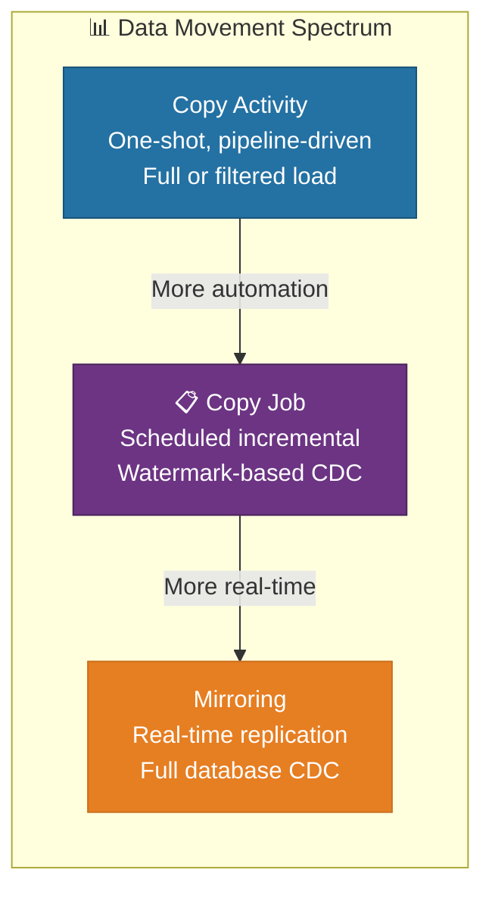
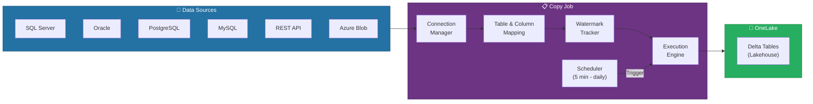
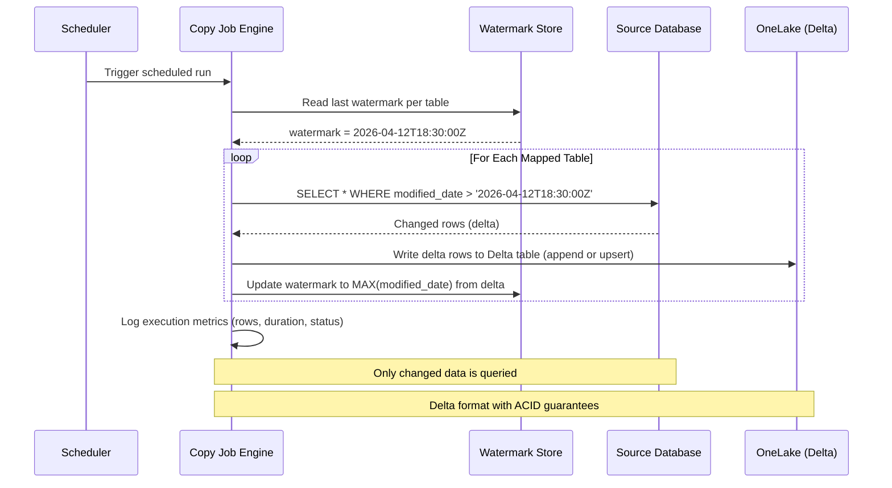
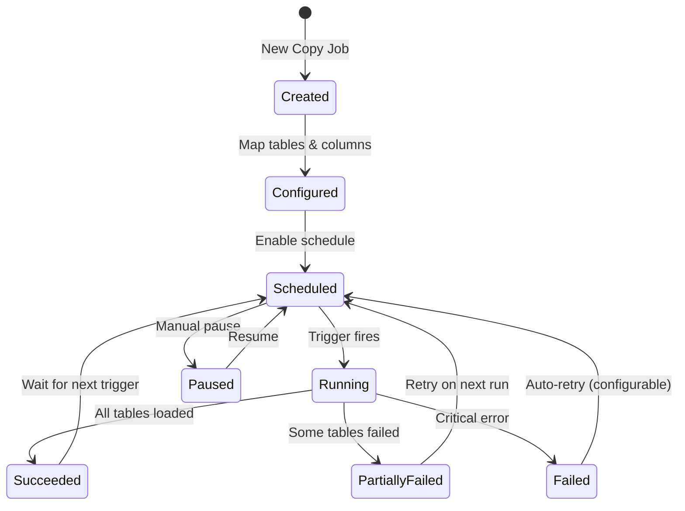
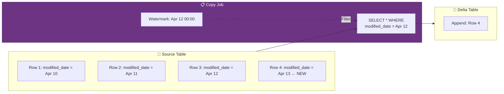
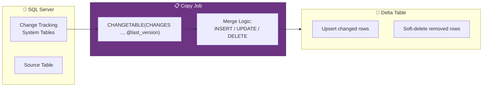
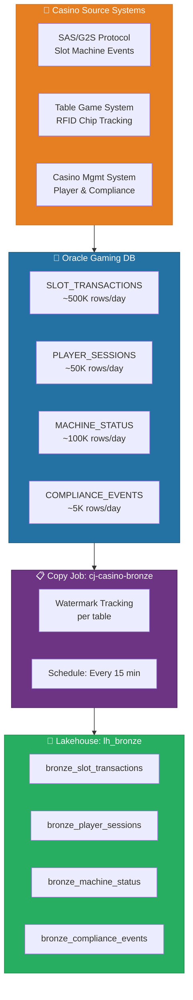
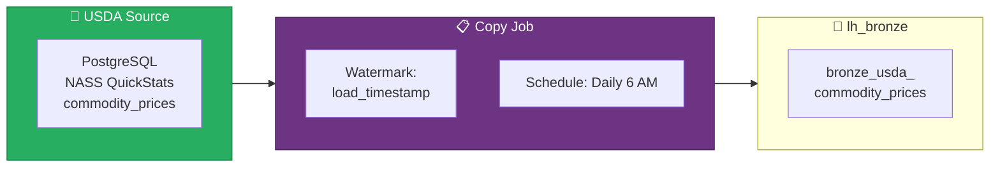

[Home](../index.md) > [Docs](../) > [Features](./) > Copy Job CDC

# 📋 Copy Job - Continuous Ingestion with Change Data Capture

<div align="center">

**Low-Code Incremental Data Ingestion for Microsoft Fabric**


</div>

---

**Last Updated:** `2026-04-13` | **Version:** 1.0.0

---

## 📑 Table of Contents

- [🎯 Overview](#-overview)
- [🏗️ Architecture](#️-architecture)
- [⚙️ Configuration](#️-configuration)
- [🔄 CDC Patterns](#-cdc-patterns)
- [📐 Source & Destination Mapping](#-source--destination-mapping)
- [🎰 Casino Implementation](#-casino-implementation)
- [🏛️ Federal Agency Implementation](#️-federal-agency-implementation)
- [📊 Monitoring and Troubleshooting](#-monitoring-and-troubleshooting)
- [⚡ Performance Optimization](#-performance-optimization)
- [⚠️ Limitations](#️-limitations)
- [📚 References](#-references)

---

## 🎯 Overview

Copy Job is a Microsoft Fabric workspace item (Preview) designed for **continuous, low-code data ingestion with built-in change data capture (CDC)**. It fills a critical gap in the Fabric data movement spectrum -- between the one-shot Copy Activity (which runs once per pipeline execution) and database Mirroring (which provides full real-time replication). Copy Job provides a middle ground: **scheduled incremental ingestion** that automatically tracks what has changed since the last run and loads only the delta.

Think of Copy Job as a managed, low-code alternative to building custom watermark-based incremental notebooks. Instead of writing PySpark logic to track high-water marks, manage checkpoints, and handle schema drift, Copy Job handles all of this through a visual configuration experience.

### Where Copy Job Fits



### Key Capabilities

| Capability | Description |
|-----------|-------------|
| **Scheduled Incremental Loads** | Configure load frequency from every 5 minutes to daily; only changed/new data is loaded |
| **Automatic Watermark Tracking** | Copy Job manages high-water mark state internally -- no manual checkpoint management |
| **Multi-Table Support** | Ingest multiple tables from the same source in a single Copy Job with independent watermarks |
| **Schema Mapping** | Visual column mapping with support for type conversion and column renaming |
| **Change Tracking Integration** | Native support for SQL Server Change Tracking and timestamp-based incremental detection |
| **Delta Lake Output** | All data lands in OneLake as Delta tables, ready for Lakehouse querying |
| **Built-In Monitoring** | Execution history, rows loaded, duration, and error details per table per run |
| **Low-Code Experience** | No PySpark or SQL required -- fully visual configuration in the Fabric portal |

### Copy Job vs. Alternatives

| Feature | Copy Activity | Copy Job | Mirroring |
|---------|-------------|----------|-----------|
| **Setup Complexity** | Medium (pipeline + parameters) | Low (visual wizard) | Low (connection + select tables) |
| **Incremental Support** | Manual (watermark logic) | Built-in (automatic watermarks) | Automatic (CDC log tailing) |
| **Schedule Flexibility** | Pipeline triggers | Built-in scheduler (5 min - daily) | Continuous (near real-time) |
| **Multi-Table** | One per activity (or ForEach) | Multiple tables per job | Entire database |
| **Target Format** | Delta, Parquet, CSV | Delta only | Delta (read-only mirror) |
| **Write Mode** | Overwrite, Append, Upsert | Append, Upsert | Mirror (system-managed) |
| **Source Changes** | Full requery per run | Watermark-filtered queries | Log-based CDC |
| **Best For** | One-time loads, complex transforms | Scheduled incremental ETL | Full database replication |

---

## 🏗️ Architecture

Copy Job operates as a managed orchestration item within the Fabric workspace. Each Copy Job encapsulates source connectivity, table mappings, watermark state, scheduling, and execution monitoring.

### Component Architecture



### Execution Flow



### Copy Job Lifecycle



---

## ⚙️ Configuration

### Step 1: Create the Copy Job Item

```
Workspace → + New → Copy Job (Preview)
  Name: cj-casino-slot-logs
  Description: Incremental ingestion of slot machine transaction logs from Oracle
```

### Step 2: Configure the Source Connection

```
Copy Job → Source → + Add Connection
  Connection Type: Oracle
  Server: <oracle-host>:1521
  Database: GAMING_OPS
  Authentication: Service Principal (recommended)
  
  Advanced:
  ├── Connection Timeout: 30 seconds
  ├── Command Timeout: 600 seconds
  └── Encryption: Required
```

### Step 3: Select and Map Tables

```
Copy Job → Tables → + Add Tables
  ☑ SLOT_TRANSACTIONS       → bronze_slot_transactions
  ☑ PLAYER_SESSIONS          → bronze_player_sessions
  ☑ MACHINE_STATUS_LOG       → bronze_machine_status
  ☑ COMPLIANCE_EVENTS        → bronze_compliance_events
```

### Step 4: Configure Incremental Column

For each table, specify the column used to detect changes:

| Source Table | Incremental Column | Type | Write Mode |
|-------------|-------------------|------|------------|
| `SLOT_TRANSACTIONS` | `TRANSACTION_TIMESTAMP` | Timestamp | Append |
| `PLAYER_SESSIONS` | `SESSION_END_TIME` | Timestamp | Append |
| `MACHINE_STATUS_LOG` | `STATUS_CHANGE_ID` | Integer (monotonic) | Append |
| `COMPLIANCE_EVENTS` | `MODIFIED_DATE` | Timestamp | Upsert (on `event_id`) |

### Step 5: Configure Column Mapping

```
Copy Job → Tables → SLOT_TRANSACTIONS → Column Mapping

  Source Column          → Target Column              Type Conversion
  ─────────────────────────────────────────────────────────────────
  TRANSACTION_ID         → transaction_id             VARCHAR → string
  MACHINE_ID             → machine_id                 VARCHAR → string
  TRANSACTION_TIMESTAMP  → transaction_timestamp      TIMESTAMP → timestamp
  TRANSACTION_TYPE       → transaction_type           VARCHAR → string
  AMOUNT                 → amount                     NUMBER(18,2) → decimal(18,2)
  PLAYER_ID              → player_id                  VARCHAR → string (nullable)
  DENOMINATION           → denomination               NUMBER(5,2) → decimal(5,2)
  FLOOR_LOCATION         → floor_location             VARCHAR → string
  
  Exclude Columns:
  ☐ INTERNAL_AUDIT_FLAG (internal use only)
  ☐ RAW_SAS_PAYLOAD (too large for bronze)
```

### Step 6: Configure Schedule

```
Copy Job → Schedule
  Frequency: Every 15 minutes
  Start Time: Immediate
  End Time: None (continuous)
  
  Advanced:
  ├── Retry on Failure: 3 attempts with 5-minute backoff
  ├── Timeout per Table: 10 minutes
  ├── Concurrent Table Loads: 4 (parallel)
  └── Alert on Failure: Email data-engineering@casino.com
```

### Step 7: Initial Load

Before starting scheduled incremental runs, perform an initial full load:

```
Copy Job → Run → Initial Load
  Mode: Full (load all existing data)
  Tables: All mapped tables
  
  Progress:
  ├── SLOT_TRANSACTIONS     █████████████████████░ 95% (4.2M rows)
  ├── PLAYER_SESSIONS       ████████████████████░░ 88% (1.8M rows)
  ├── MACHINE_STATUS_LOG    █████████████████████████ 100% (320K rows)
  └── COMPLIANCE_EVENTS     █████████████████████████ 100% (45K rows)
```

> 📝 **Note**: The initial full load establishes the baseline watermark for each table. Subsequent scheduled runs will only load rows with incremental column values greater than the stored watermark.

---

## 🔄 CDC Patterns

Copy Job supports three change data capture patterns. Choose the pattern that matches your source system's capabilities.

### Pattern Comparison

| Pattern | Mechanism | Source Requirement | Accuracy | Performance |
|---------|-----------|-------------------|----------|-------------|
| **Watermark (Timestamp)** | Query rows where `modified_date > last_watermark` | Table has a reliable `modified_date` column | High (if timestamp is always updated) | Good (index on timestamp column recommended) |
| **Watermark (Integer)** | Query rows where `id > last_watermark` | Table has a monotonically increasing integer column | High (for append-only tables) | Excellent (primary key scan) |
| **Change Tracking** | Query SQL Server Change Tracking system tables | SQL Server with Change Tracking enabled on source tables | Exact (includes deletes) | Good (CT overhead on source) |

### Pattern 1: Timestamp-Based Watermark

The most common pattern. Requires a column that is updated whenever the row is modified (e.g., `modified_date`, `updated_at`, `last_change_timestamp`).



**Configuration:**

```json
{
    "table": "SLOT_TRANSACTIONS",
    "incremental_column": "TRANSACTION_TIMESTAMP",
    "incremental_type": "timestamp",
    "write_mode": "append",
    "watermark_initial": "1970-01-01T00:00:00Z"
}
```

**Advantages:**
- Works with any database that supports timestamp columns
- Simple to implement and understand
- Good performance with index on timestamp column

**Considerations:**
- Does not detect deletes (deleted rows are not captured)
- Requires the timestamp column to be updated on every modification
- Clock skew between source servers can cause missed rows (rare)

### Pattern 2: Integer-Based Watermark

Best for append-only tables with an auto-increment primary key. The watermark tracks the highest loaded ID value.

```json
{
    "table": "MACHINE_STATUS_LOG",
    "incremental_column": "STATUS_CHANGE_ID",
    "incremental_type": "integer",
    "write_mode": "append",
    "watermark_initial": 0
}
```

**Advantages:**
- Extremely efficient (primary key index scan)
- No false positives -- each ID is loaded exactly once
- No dependency on timestamps or clock synchronization

**Considerations:**
- Only works for append-only tables (no updates to existing rows)
- ID gaps (from rollbacks or deletes) are harmless but may seem unexpected

### Pattern 3: SQL Server Change Tracking

For SQL Server sources with Change Tracking enabled, Copy Job can query the CT system tables directly. This is the most accurate pattern because it captures inserts, updates, and deletes.



**Configuration:**

```json
{
    "table": "COMPLIANCE_EVENTS",
    "incremental_column": null,
    "incremental_type": "change_tracking",
    "write_mode": "upsert",
    "upsert_key": ["event_id"],
    "handle_deletes": "soft_delete",
    "soft_delete_column": "_is_deleted"
}
```

**Advantages:**
- Captures inserts, updates, AND deletes
- Exact change detection (no false positives or missed rows)
- Minimal source query impact (reads CT tables, not full table scans)

**Considerations:**
- SQL Server only (not available for Oracle, PostgreSQL, MySQL)
- Change Tracking must be enabled on the source database and tables
- CT retention on source must be longer than the Copy Job schedule interval

### Upsert (Merge) Write Mode

When using the Upsert write mode, Copy Job performs a Delta Lake MERGE operation:

```sql
-- Conceptual merge logic executed by Copy Job
MERGE INTO bronze_compliance_events AS target
USING (SELECT * FROM staging_batch) AS source
ON target.event_id = source.event_id
WHEN MATCHED THEN
    UPDATE SET
        target.event_type = source.event_type,
        target.amount = source.amount,
        target.modified_date = source.modified_date,
        target._last_updated = current_timestamp()
WHEN NOT MATCHED THEN
    INSERT (event_id, event_type, amount, modified_date, _last_updated)
    VALUES (source.event_id, source.event_type, source.amount,
            source.modified_date, current_timestamp());
```

> 💡 **Tip**: Use Append mode for high-volume, insert-only tables (telemetry, logs, transactions). Use Upsert mode for slowly changing dimension tables or tables where existing rows are updated (compliance events, player profiles, machine configurations).

---

## 📐 Source & Destination Mapping

### Supported Sources

| Source | Version | Auth Methods | Change Detection |
|--------|---------|-------------|-----------------|
| **SQL Server** | 2016+ | SQL Auth, Windows Auth, Entra ID | Timestamp, Integer, Change Tracking |
| **Azure SQL Database** | All | SQL Auth, Entra ID, Managed Identity | Timestamp, Integer, Change Tracking |
| **Oracle** | 12c+ | Oracle Auth | Timestamp, Integer |
| **PostgreSQL** | 12+ | PostgreSQL Auth, Entra ID | Timestamp, Integer |
| **MySQL** | 8.0+ | MySQL Auth | Timestamp, Integer |
| **Azure Blob Storage** | All | Account Key, SAS, Managed Identity | File modified date |
| **Azure Data Lake Gen2** | All | Account Key, SAS, Managed Identity | File modified date |
| **Amazon S3** | All | Access Key, IAM Role | File modified date |
| **REST API** | HTTP/HTTPS | API Key, OAuth, Bearer Token | Response-based (pagination token) |
| **Snowflake** | All | Snowflake Auth | Timestamp, Integer |

### Destination Configuration

All Copy Job destinations are Delta tables in a Fabric Lakehouse:

```
Destination:
  Lakehouse: lh_bronze
  Schema: dbo (default)
  Table Prefix: bronze_ (optional, applied to all tables)
  
  Delta Settings:
  ├── Optimize Write: true (auto-compact small files)
  ├── Auto-Compact: true (merge small Delta files)
  ├── Liquid Clustering: false (configure post-load)
  └── Partition Columns: none (configure post-load)
```

### Type Mapping Reference

| Source Type (Oracle) | Source Type (SQL Server) | Delta Lake Type |
|---------------------|------------------------|-----------------|
| VARCHAR2 | VARCHAR / NVARCHAR | string |
| NUMBER(p,s) | DECIMAL(p,s) | decimal(p,s) |
| NUMBER (no scale) | INT / BIGINT | long |
| DATE | DATETIME / DATETIME2 | timestamp |
| TIMESTAMP | DATETIME2(7) | timestamp |
| CLOB | NVARCHAR(MAX) | string |
| BLOB | VARBINARY(MAX) | binary |
| RAW | BINARY | binary |

---

## 🎰 Casino Implementation

Casino gaming systems generate high-volume transactional data in operational databases (typically Oracle or SQL Server). Copy Job provides a low-code way to continuously ingest this data into the Fabric Bronze layer without building custom incremental notebooks.

### Casino Ingestion Architecture



### Incremental Oracle Slot Logs (Every 15 Minutes)

The primary casino ingestion scenario: slot machine transaction logs are loaded incrementally from Oracle every 15 minutes.

**Copy Job Configuration:**

```json
{
    "copy_job_name": "cj-casino-slot-logs",
    "source": {
        "type": "Oracle",
        "connection": "<oracle-host>:1521/GAMING_OPS",
        "authentication": "service_principal"
    },
    "tables": [
        {
            "source_table": "GAMING_OPS.SLOT_TRANSACTIONS",
            "target_table": "bronze_slot_transactions",
            "target_lakehouse": "lh_bronze",
            "incremental_column": "TRANSACTION_TIMESTAMP",
            "incremental_type": "timestamp",
            "write_mode": "append",
            "column_mapping": [
                {"source": "TRANSACTION_ID", "target": "transaction_id"},
                {"source": "MACHINE_ID", "target": "machine_id"},
                {"source": "TRANSACTION_TIMESTAMP", "target": "transaction_timestamp"},
                {"source": "TRANSACTION_TYPE", "target": "transaction_type"},
                {"source": "AMOUNT", "target": "amount"},
                {"source": "PLAYER_ID", "target": "player_id"},
                {"source": "DENOMINATION", "target": "denomination"},
                {"source": "FLOOR_LOCATION", "target": "floor_location"}
            ]
        }
    ],
    "schedule": {
        "frequency": "every_15_minutes",
        "retry_count": 3,
        "retry_interval_minutes": 5,
        "timeout_minutes": 10
    }
}
```

### Compliance Event Upsert

Compliance events (CTR, SAR, W-2G) can be modified after initial creation (status changes, review outcomes). Use Upsert mode to keep the Bronze layer current:

```json
{
    "source_table": "GAMING_OPS.COMPLIANCE_EVENTS",
    "target_table": "bronze_compliance_events",
    "incremental_column": "MODIFIED_DATE",
    "write_mode": "upsert",
    "upsert_key": ["event_id"],
    "column_mapping": [
        {"source": "EVENT_ID", "target": "event_id"},
        {"source": "EVENT_TYPE", "target": "event_type"},
        {"source": "PLAYER_ID", "target": "player_id"},
        {"source": "AMOUNT", "target": "amount"},
        {"source": "STATUS", "target": "status"},
        {"source": "REVIEWER_ID", "target": "reviewer_id"},
        {"source": "CREATED_DATE", "target": "created_date"},
        {"source": "MODIFIED_DATE", "target": "modified_date"}
    ]
}
```

> ⚠️ **Warning**: Compliance data (CTR, SAR, W-2G) must be ingested completely and accurately. Configure alerts for any Copy Job failures on compliance tables. NIGC MICS requires that all reportable transactions are captured within regulatory time windows.

---

## 🏛️ Federal Agency Implementation

Federal agencies can use Copy Job to incrementally ingest data from agency source systems, public APIs, and partner databases into the Fabric Bronze layer.

### USDA -- Commodity Price Delta Loads

USDA commodity price data is updated daily in a PostgreSQL database maintained by the NASS QuickStats system. Copy Job loads only the new or updated price records.



**Configuration:**

```json
{
    "copy_job_name": "cj-usda-commodity-prices",
    "source": {
        "type": "PostgreSQL",
        "connection": "nass-quickstats.usda.gov:5432/quickstats",
        "authentication": "entra_id"
    },
    "tables": [
        {
            "source_table": "public.commodity_prices",
            "target_table": "bronze_usda_commodity_prices",
            "target_lakehouse": "lh_bronze",
            "incremental_column": "load_timestamp",
            "incremental_type": "timestamp",
            "write_mode": "append"
        },
        {
            "source_table": "public.crop_production_estimates",
            "target_table": "bronze_usda_crop_production",
            "target_lakehouse": "lh_bronze",
            "incremental_column": "release_date",
            "incremental_type": "timestamp",
            "write_mode": "upsert",
            "upsert_key": ["state_fips", "commodity_code", "year"]
        }
    ],
    "schedule": {
        "frequency": "daily",
        "time": "06:00",
        "timezone": "America/New_York"
    }
}
```

### DOT/FAA -- Flight Status Delta Loads

The DOT Bureau of Transportation Statistics updates flight performance data in near-real-time. Copy Job loads delta records from the BTS REST API.

**Configuration:**

```json
{
    "copy_job_name": "cj-dot-flight-status",
    "source": {
        "type": "REST_API",
        "base_url": "https://api.bts.dot.gov/v1/flights",
        "authentication": {
            "type": "api_key",
            "header": "X-API-Key"
        },
        "pagination": {
            "type": "offset",
            "page_size": 10000
        }
    },
    "tables": [
        {
            "source_endpoint": "/on-time-performance",
            "target_table": "bronze_dot_flight_performance",
            "target_lakehouse": "lh_bronze",
            "incremental_column": "last_updated",
            "incremental_type": "timestamp",
            "write_mode": "upsert",
            "upsert_key": ["flight_id", "flight_date"]
        },
        {
            "source_endpoint": "/delays",
            "target_table": "bronze_dot_flight_delays",
            "target_lakehouse": "lh_bronze",
            "incremental_column": "delay_record_id",
            "incremental_type": "integer",
            "write_mode": "append"
        }
    ],
    "schedule": {
        "frequency": "every_30_minutes"
    }
}
```

### Multi-Agency Copy Job Summary

| Agency | Source | Tables | Schedule | CDC Pattern | Daily Volume |
|--------|--------|--------|----------|-------------|-------------|
| **USDA** | PostgreSQL | commodity_prices, crop_production | Daily 6 AM | Timestamp | ~50K rows |
| **SBA** | Azure SQL DB | ppp_loans, 7a_loans, disaster_loans | Daily 7 AM | Timestamp | ~30K rows |
| **NOAA** | REST API | observations, alerts, storm_events | Every 30 min | Timestamp | ~200K rows |
| **EPA** | PostgreSQL | tri_releases, aqs_daily, facility_registry | Daily 5 AM | Timestamp | ~100K rows |
| **DOI** | REST API | earthquake_events, land_transactions | Every hour | Integer | ~20K rows |
| **DOT/FAA** | REST API | flight_performance, delay_records | Every 30 min | Timestamp/Integer | ~150K rows |

> 💡 **Tip**: Group agency tables by source system into a single Copy Job. For example, all USDA tables that come from the same PostgreSQL instance should be in one Copy Job to minimize connection overhead and simplify monitoring.

---

## 📊 Monitoring and Troubleshooting

### Execution History

Copy Job provides built-in execution history accessible from the Fabric portal:

```
Copy Job → Monitor → Run History

  Run ID          Start Time           Duration    Tables  Rows Loaded  Status
  ────────────────────────────────────────────────────────────────────────────
  run-2026-0413-1  2026-04-13 18:15:00  2m 34s     4       12,847      ✅ Succeeded
  run-2026-0413-2  2026-04-13 18:00:00  2m 18s     4       11,230      ✅ Succeeded
  run-2026-0413-3  2026-04-13 17:45:00  3m 02s     4       15,102      ✅ Succeeded
  run-2026-0413-4  2026-04-13 17:30:00  8m 15s     4       14,890      ⚠️ Partial
  run-2026-0413-5  2026-04-13 17:15:00  2m 45s     4       13,445      ✅ Succeeded
```

### Per-Table Run Details

```
Copy Job → Monitor → Run Details (run-2026-0413-4)

  Table                        Rows   Duration  Status    Error
  ──────────────────────────────────────────────────────────────
  bronze_slot_transactions     8,230  1m 45s    ✅        —
  bronze_player_sessions       2,100  0m 32s    ✅        —
  bronze_machine_status        4,560  0m 48s    ✅        —
  bronze_compliance_events     0      5m 10s    ❌ Failed  ORA-12170: TNS:Connect timeout
```

### Watermark State Inspection

```
Copy Job → Monitor → Watermark State

  Table                        Current Watermark              Last Updated
  ─────────────────────────────────────────────────────────────────────────
  bronze_slot_transactions     2026-04-13T18:14:59.123Z       2026-04-13 18:17:34
  bronze_player_sessions       2026-04-13T18:12:30.456Z       2026-04-13 18:17:34
  bronze_machine_status        STATUS_CHANGE_ID = 4,823,107   2026-04-13 18:17:34
  bronze_compliance_events     2026-04-13T17:28:00.000Z       2026-04-13 17:33:15 ← STALE
```

### Common Issues and Resolutions

| Issue | Symptom | Root Cause | Resolution |
|-------|---------|-----------|------------|
| **Connection Timeout** | `ORA-12170: TNS:Connect timeout` | Source database unreachable | Check network connectivity, VPN/ExpressRoute, firewall rules |
| **Stale Watermark** | Table shows old watermark, new data not loading | Previous run failed before watermark update | Manually reset watermark or retry |
| **Duplicate Rows** | Target table has duplicate records | Source timestamp column not unique | Add upsert key; switch to Upsert write mode |
| **Schema Drift** | `Column 'NEW_COL' not found in mapping` | Source table added new column | Update column mapping in Copy Job configuration |
| **Slow Initial Load** | Initial full load takes hours | Large source table with no partitioning | Use parallel load (increase concurrent table limit) |
| **Throttling** | `429 Too Many Requests` (REST API source) | API rate limit exceeded | Reduce schedule frequency or add backoff settings |

---

## ⚡ Performance Optimization

### Source Query Optimization

| Optimization | Description | Impact |
|-------------|-------------|--------|
| **Index on Incremental Column** | Ensure the watermark column has an index on the source database | 10-100x faster incremental queries |
| **Partition Elimination** | If source table is partitioned by date, watermark queries benefit from partition pruning | Significant for large tables |
| **Column Projection** | Map only needed columns; exclude large BLOB/CLOB columns | Reduces network transfer and target storage |
| **Read Replicas** | Point Copy Job to a read replica instead of the primary database | Zero impact on OLTP performance |

### Copy Job Tuning

| Setting | Default | Recommendation | Description |
|---------|---------|----------------|-------------|
| **Concurrent Tables** | 4 | 4-8 (depends on source capacity) | Number of tables loaded in parallel per run |
| **Batch Size** | 10,000 rows | 50,000-100,000 for high-volume tables | Rows per write batch to Delta Lake |
| **Timeout per Table** | 10 minutes | Adjust based on expected load time | Fail individual table if it exceeds timeout |
| **Schedule Frequency** | 15 minutes | Match to source change velocity | More frequent = lower latency but more CU |
| **Optimize Write** | On | Keep On | Auto-compacts small Delta files during write |

### CU Consumption Estimates

| Scenario | Tables | Rows/Run | Schedule | Est. CU/Day |
|----------|--------|----------|----------|-------------|
| **Casino Slot Logs** | 4 tables | ~13K rows | Every 15 min | 2-4% of F64 |
| **USDA Daily Load** | 2 tables | ~50K rows | Daily | < 0.5% of F64 |
| **NOAA Observations** | 3 tables | ~200K rows | Every 30 min | 1-2% of F64 |
| **Full Federal (6 agencies)** | 12 tables | ~550K rows | Mixed | 3-5% of F64 |

> 💡 **Tip**: Copy Job is significantly more CU-efficient than running equivalent Spark notebooks for simple incremental loads. The managed execution engine avoids Spark session startup overhead (which can add 30-60 seconds per run).

---

## ⚠️ Limitations

### Current Limitations (Preview)

| Limitation | Details | Workaround |
|-----------|---------|-----------|
| **Preview Status** | Feature is in Public Preview; API and configuration may change | Avoid production-critical workflows during preview |
| **Supported Sources** | Limited to sources listed in the Supported Sources section | Use Copy Activity in a pipeline for unsupported sources |
| **Delta Output Only** | Cannot write to Parquet, CSV, or Warehouse tables | Use Delta Lake; convert downstream if needed |
| **No Complex Transforms** | Column mapping and type conversion only; no expressions or lookups | Use Silver-layer notebooks for complex transformations |
| **Max Tables per Job** | 50 tables per Copy Job | Create multiple Copy Jobs for larger source systems |
| **Max Parallelism** | 8 concurrent table loads per Copy Job | Split into multiple jobs if more parallelism is needed |
| **No Delete Detection** | Timestamp and Integer patterns do not detect source deletes | Use Change Tracking pattern (SQL Server only) or periodic full refresh |
| **Schedule Minimum** | 5 minutes minimum schedule interval | Use Mirroring or Eventstream for sub-minute latency requirements |
| **Watermark Reset** | Resetting watermark requires manual intervention in portal | No API for programmatic watermark reset (expected at GA) |
| **Schema Evolution** | New columns in source are not auto-added to mapping | Manually update column mapping when source schema changes |

### Feature Roadmap

| Enhancement | Expected Timeline | Description |
|------------|------------------|-------------|
| **Expression Columns** | GA (H2 2026) | Add computed columns during ingestion (e.g., `CONCAT`, `UPPER`) |
| **CDC for All Sources** | GA (H2 2026) | Log-based CDC for Oracle, PostgreSQL (beyond SQL Server) |
| **API Management** | GA (H2 2026) | Programmatic Copy Job management via REST API |
| **Auto-Schema Evolution** | Post-GA | Automatically add new source columns to mapping |
| **Cross-Workspace Target** | Post-GA | Write to Lakehouses in different workspaces |

> 📝 **Note**: Copy Job is designed for structured, incremental ingestion. For complex ETL with transformations, joins, and business logic, continue using Spark notebooks or Dataflow Gen2 in the Silver layer.

---

## 📚 References

| Resource | URL |
|----------|-----|
| Copy Job Overview | https://learn.microsoft.com/fabric/data-factory/copy-job-overview |
| Data Factory in Fabric | https://learn.microsoft.com/fabric/data-factory/data-factory-overview |
| Copy Activity (comparison) | https://learn.microsoft.com/fabric/data-factory/copy-data-activity |
| Database Mirroring (comparison) | https://learn.microsoft.com/fabric/database/mirrored-database/overview |
| Delta Lake MERGE | https://learn.microsoft.com/fabric/data-engineering/lakehouse-delta-merge |
| SQL Server Change Tracking | https://learn.microsoft.com/sql/relational-databases/track-changes/about-change-tracking-sql-server |

---

## 🔗 Related Documents

- [Real-Time Intelligence](real-time-intelligence.md) -- For sub-second latency, use Eventstreams instead of Copy Job
- [Fabric IQ](fabric-iq.md) -- Query Copy Job-loaded Bronze tables with natural language
- [Data Governance Deep Dive](../best-practices/data-governance-deep-dive.md) -- Governance for incremental ingestion
- [Performance Best Practices](../best-practices/performance-best-practices.md) -- Delta table optimization post-ingestion
- [Fabric CI/CD Deployment](../best-practices/fabric-cicd-deployment.md) -- Deploy Copy Job configurations via CI/CD
- [Architecture](../ARCHITECTURE.md) -- System architecture overview

---

> 📝 **Document Metadata**
> - **Author**: Documentation Team
> - **Reviewers**: Data Engineering, Data Factory, Platform Operations
> - **Classification**: Internal
> - **Next Review**: 2026-07-13
