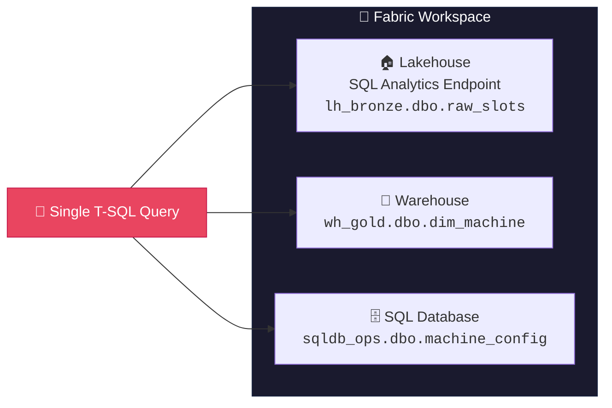
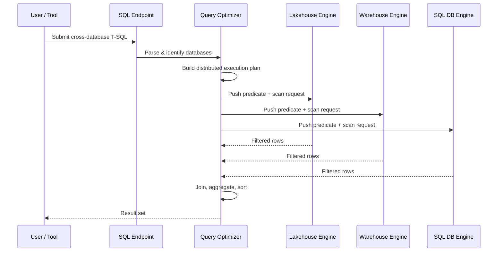
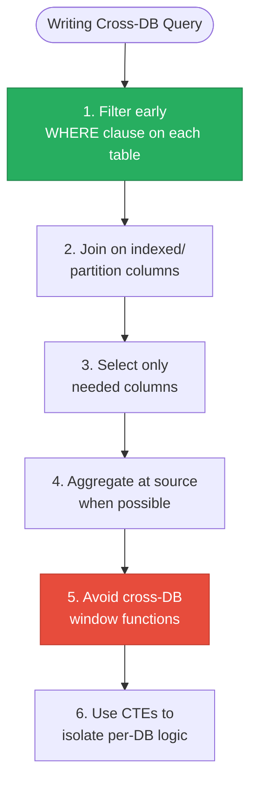

# 🔗 Cross-Database Queries in Microsoft Fabric

<div align="center" markdown>

**Query Across Lakehouse, Warehouse, and SQL Database Using Three-Part Naming**


</div>

---

**Last Updated:** `2026-04-21` | **Version:** 1.0.0

---

## 🎯 Overview

Cross-database queries in Microsoft Fabric allow you to write a single T-SQL query that references tables across multiple Fabric items — Lakehouses (via SQL analytics endpoint), Warehouses, and SQL Databases — using standard **three-part naming** (`database.schema.table`). This eliminates the need for data duplication, ETL pipelines between analytics stores, or external tooling for cross-item joins.

### Key Capabilities

| Capability | Description |
|-----------|-------------|
| **Three-part naming** | Reference any table as `database_name.schema_name.table_name` |
| **Cross-item joins** | JOIN tables from Lakehouse SQL endpoint, Warehouse, and SQL Database |
| **Unified security** | Queries execute under caller identity; workspace permissions enforced |
| **No data movement** | Query optimizer pushes predicates to source where possible |
| **Cross-database views** | Create views in one database that reference tables in another |
| **Workspace scoped** | Databases must be in the same workspace (or linked via shortcuts) |

### What You Can Query Across



---

## 🏗️ Architecture

### Query Processing Flow

When a cross-database query is submitted, the Fabric SQL engine determines the optimal execution plan:



### Data Movement vs Pushdown

| Scenario | Behavior | Performance |
|----------|----------|-------------|
| Filter on single database | Predicate pushdown to source engine | ⚡ Fast |
| JOIN with filter on both sides | Pushdown both predicates, join in optimizer | ⚡ Fast |
| JOIN with no filters | Full table scans, data movement to join engine | 🐌 Slow |
| Aggregation on single database | Pushed down, only aggregated result moves | ⚡ Fast |
| Cross-database ORDER BY | Sort happens after data movement | ⚡ Moderate |
| Cross-database window functions | Data movement required for full window | 🐌 Slow |

---

## 📝 Syntax & Three-Part Naming

### Basic Syntax

```sql
-- Three-part naming: database.schema.table
SELECT *
FROM database_name.schema_name.table_name;

-- Lakehouse tables always use 'dbo' schema
SELECT * FROM lh_bronze.dbo.raw_slot_telemetry;

-- Warehouse tables use 'dbo' or custom schemas
SELECT * FROM wh_gold.dbo.dim_machine;
SELECT * FROM wh_gold.analytics.fact_daily_revenue;

-- SQL Database tables
SELECT * FROM sqldb_operations.dbo.machine_configuration;
```

### Cross-Database JOIN

```sql
-- Join Lakehouse Bronze data with Warehouse Gold dimension
SELECT
    t.transaction_id,
    t.machine_id,
    t.wager_amount,
    t.payout_amount,
    m.machine_name,
    m.floor_location,
    m.denomination
FROM lh_bronze.dbo.raw_slot_transactions AS t
INNER JOIN wh_gold.dbo.dim_machine AS m
    ON t.machine_id = m.machine_id
WHERE t.transaction_date >= '2026-04-01';
```

### Cross-Database View

```sql
-- Create a view in the Warehouse that references Lakehouse tables
CREATE VIEW wh_gold.dbo.vw_compliance_summary AS
SELECT
    c.filing_type,
    c.filing_date,
    c.status,
    p.player_tier,
    p.state
FROM lh_gold.dbo.gold_compliance_ctr AS c
INNER JOIN wh_gold.dbo.dim_player AS p
    ON c.player_id = p.player_id;
```

---

## 🔀 Supported Query Patterns

### Pattern Matrix

| Pattern | Lakehouse → Warehouse | Warehouse → Lakehouse | SQL DB → Lakehouse | SQL DB → Warehouse |
|---------|:--------------------:|:--------------------:|:-----------------:|:-----------------:|
| SELECT with JOIN | ✅ | ✅ | ✅ | ✅ |
| INSERT INTO...SELECT | ❌ | ✅ (into WH) | ✅ (into SQL DB) | ✅ (into WH) |
| CREATE VIEW referencing | ✅ (in WH) | ✅ (in WH) | ✅ (in SQL DB) | ✅ (in SQL DB) |
| CTAS (SELECT INTO) | ❌ | ✅ (into WH) | ✅ (into SQL DB) | ✅ (into WH) |
| Subqueries | ✅ | ✅ | ✅ | ✅ |
| CTEs | ✅ | ✅ | ✅ | ✅ |
| UNION / UNION ALL | ✅ | ✅ | ✅ | ✅ |

> **Note:** Lakehouse SQL analytics endpoints are read-only. You cannot INSERT INTO a Lakehouse table from a cross-database query. Use Spark notebooks for Lakehouse writes.

### Common Table Expressions (CTEs)

```sql
-- CTE combining data from three sources
WITH bronze_transactions AS (
    SELECT
        machine_id,
        SUM(wager_amount) AS total_wagers,
        COUNT(*) AS transaction_count
    FROM lh_bronze.dbo.raw_slot_transactions
    WHERE transaction_date = CAST(GETDATE() AS DATE)
    GROUP BY machine_id
),
machine_info AS (
    SELECT machine_id, machine_name, floor_location, denomination
    FROM wh_gold.dbo.dim_machine
    WHERE is_active = 1
),
maintenance_status AS (
    SELECT machine_id, last_service_date, next_service_date, status
    FROM sqldb_operations.dbo.machine_maintenance
)
SELECT
    mi.machine_name,
    mi.floor_location,
    bt.total_wagers,
    bt.transaction_count,
    ms.status AS maintenance_status,
    ms.next_service_date
FROM bronze_transactions bt
INNER JOIN machine_info mi ON bt.machine_id = mi.machine_id
LEFT JOIN maintenance_status ms ON bt.machine_id = ms.machine_id
ORDER BY bt.total_wagers DESC;
```

---

## ⚡ Performance Considerations

### Query Optimization Rules



### Performance Comparison

| Query Pattern | Est. Duration (10M rows) | Data Movement | Recommendation |
|--------------|-------------------------|---------------|----------------|
| Single-DB query with pushdown | < 5s | None | ✅ Best case |
| Cross-DB JOIN with filters both sides | 5–15s | Filtered rows only | ✅ Good |
| Cross-DB JOIN, filter one side only | 15–60s | Full scan on unfiltered side | ⚠️ Add filters |
| Cross-DB JOIN, no filters | 60–300s | Full scan both sides | ❌ Avoid; pre-aggregate |
| Cross-DB + ORDER BY + TOP | 5–20s | Data movement for sort | ✅ Acceptable |
| Cross-DB + window functions | 30–120s | Full data movement | ⚠️ Pre-compute in Gold |

### Indexing Impact

| Database Type | Indexing Support | Cross-DB Impact |
|--------------|-----------------|-----------------|
| Lakehouse SQL endpoint | Automatic (V-Order, file pruning) | V-Order improves predicate pushdown |
| Warehouse | Clustered columnstore (auto) | Segment elimination on filter columns |
| SQL Database | Full index support (rowstore + columnstore) | Indexes used for local predicate evaluation |

---

## 🔐 Authentication & Security

### Security Model

Cross-database queries execute under the **caller's identity**. The user must have appropriate permissions on every database referenced in the query.

| Permission Level | Lakehouse | Warehouse | SQL Database |
|-----------------|-----------|-----------|-------------|
| Read data | Workspace Viewer + SQL ReadAll | Warehouse Reader role | db_datareader |
| Create views | N/A (read-only) | Warehouse Contributor | db_ddladmin |
| Insert data | N/A (read-only) | Warehouse Contributor | db_datawriter |

### Row-Level Security

RLS policies apply independently in each database. A cross-database JOIN respects the RLS of each source:

```sql
-- If Lakehouse has RLS filtering by agency_code
-- and Warehouse has RLS filtering by floor_location:
-- The cross-DB query returns only rows matching BOTH policies

SELECT l.*, w.*
FROM lh_gold.dbo.gold_agency_kpis AS l
INNER JOIN wh_gold.dbo.dim_location AS w
    ON l.location_id = w.location_id;
-- Result: Only rows where user has access in BOTH databases
```

---

## 🎰 Casino Implementation

### Ad-Hoc Compliance Analysis

Compliance officers frequently need to join raw Bronze transaction data with Gold-layer compliance filings and operational machine data for investigations:

```sql
-- Compliance investigation: Find all transactions for a flagged player
-- across raw data (Lakehouse), compliance records (Lakehouse Gold),
-- and machine config (SQL DB)
SELECT
    t.transaction_id,
    t.transaction_timestamp,
    t.amount,
    t.transaction_type,
    m.machine_name,
    m.floor_location,
    c.filing_type,
    c.filing_status,
    c.filed_date
FROM lh_bronze.dbo.raw_slot_transactions AS t
INNER JOIN sqldb_operations.dbo.machine_configuration AS m
    ON t.machine_id = m.machine_id
LEFT JOIN lh_gold.dbo.gold_compliance_ctr AS c
    ON t.player_id = c.player_id
    AND CAST(t.transaction_timestamp AS DATE) = c.transaction_date
WHERE t.player_id = 'P-12345'
    AND t.transaction_timestamp >= '2026-04-01'
ORDER BY t.transaction_timestamp;
```

### Floor Operations Dashboard Query

```sql
-- Real-time floor status: Combine live telemetry with master data
-- and maintenance status for the floor manager dashboard
SELECT
    m.floor_location,
    m.denomination,
    COUNT(DISTINCT t.machine_id) AS active_machines,
    SUM(t.net_revenue) AS total_revenue,
    AVG(t.hold_percentage) AS avg_hold_pct,
    SUM(CASE WHEN mx.status = 'needs_service' THEN 1 ELSE 0 END) AS machines_needing_service
FROM wh_gold.dbo.fact_slot_daily AS t
INNER JOIN wh_gold.dbo.dim_machine AS m
    ON t.machine_id = m.machine_id
LEFT JOIN sqldb_operations.dbo.machine_maintenance AS mx
    ON t.machine_id = mx.machine_id
WHERE t.date_key = CAST(GETDATE() AS DATE)
GROUP BY m.floor_location, m.denomination
ORDER BY total_revenue DESC;
```

### Casino Cross-Database Views

```sql
-- Create unified compliance view in the Warehouse
CREATE VIEW wh_gold.dbo.vw_compliance_360 AS
SELECT
    'CTR' AS filing_type,
    c.player_id,
    c.transaction_date,
    c.amount,
    c.filing_status,
    p.player_tier,
    p.risk_score
FROM lh_gold.dbo.gold_compliance_ctr AS c
INNER JOIN wh_gold.dbo.dim_player AS p ON c.player_id = p.player_id

UNION ALL

SELECT
    'SAR' AS filing_type,
    s.player_id,
    s.detection_date,
    s.total_amount,
    s.filing_status,
    p.player_tier,
    p.risk_score
FROM lh_gold.dbo.gold_compliance_sar AS s
INNER JOIN wh_gold.dbo.dim_player AS p ON s.player_id = p.player_id;
```

---

## 🏛️ Federal Agency Implementation

### Cross-Agency Analytics

Federal analysts need to correlate data across agencies without duplicating datasets. Cross-database queries enable this directly:

```sql
-- Cross-agency: Correlate NOAA storm events with SBA disaster loans
-- to measure federal response effectiveness
WITH storm_events AS (
    SELECT
        state,
        event_type,
        event_date,
        damage_property,
        damage_crops
    FROM lh_gold.dbo.gold_noaa_storm_events
    WHERE severity IN ('Severe', 'Extreme')
        AND event_date >= '2025-01-01'
),
disaster_loans AS (
    SELECT
        state,
        loan_type,
        approval_date,
        loan_amount,
        DATEDIFF(DAY, disaster_date, approval_date) AS days_to_approval
    FROM lh_gold.dbo.gold_sba_disaster_loans
    WHERE disaster_date >= '2025-01-01'
)
SELECT
    se.state,
    COUNT(DISTINCT se.event_date) AS storm_events,
    SUM(se.damage_property) AS total_property_damage,
    COUNT(DISTINCT dl.approval_date) AS loans_approved,
    SUM(dl.loan_amount) AS total_loan_disbursed,
    AVG(dl.days_to_approval) AS avg_days_to_approval
FROM storm_events se
LEFT JOIN disaster_loans dl
    ON se.state = dl.state
    AND dl.approval_date BETWEEN se.event_date AND DATEADD(DAY, 90, se.event_date)
GROUP BY se.state
ORDER BY total_property_damage DESC;
```

### EPA + DOI Environmental Correlation

```sql
-- Cross-agency: Correlate EPA toxic releases with DOI land permits
SELECT
    epa.state,
    epa.facility_name,
    epa.chemical_name,
    SUM(epa.release_amount_lbs) AS total_toxic_release,
    COUNT(DISTINCT doi.permit_id) AS nearby_permits,
    STRING_AGG(DISTINCT doi.permit_type, ', ') AS permit_types
FROM lh_gold.dbo.gold_epa_tri_releases AS epa
LEFT JOIN lh_gold.dbo.gold_doi_land_permits AS doi
    ON epa.state = doi.state
    AND epa.county = doi.county
    AND doi.permit_date BETWEEN
        DATEADD(YEAR, -1, epa.reporting_year_start)
        AND epa.reporting_year_start
WHERE epa.year = 2025
    AND epa.release_medium = 'Air'
GROUP BY epa.state, epa.facility_name, epa.chemical_name
HAVING SUM(epa.release_amount_lbs) > 10000
ORDER BY total_toxic_release DESC;
```

### USDA + NOAA Agricultural Impact Analysis

```sql
-- How weather events affect crop production by state
SELECT
    c.state,
    c.commodity,
    c.yield_per_acre,
    c.production_value,
    COUNT(n.event_id) AS weather_events_in_growing_season,
    SUM(n.damage_crops) AS reported_crop_damage
FROM wh_gold.dbo.fact_usda_crop_production AS c
LEFT JOIN lh_gold.dbo.gold_noaa_storm_events AS n
    ON c.state = n.state
    AND n.event_date BETWEEN c.planting_date AND c.harvest_date
WHERE c.year = 2025
GROUP BY c.state, c.commodity, c.yield_per_acre, c.production_value
ORDER BY reported_crop_damage DESC;
```

---

## 📊 Advanced Scenarios

### Materialized Cross-Database Aggregations

For frequently used cross-database queries, materialize results into the Warehouse:

```sql
-- Scheduled procedure: Materialize cross-agency summary daily
CREATE PROCEDURE wh_gold.dbo.usp_refresh_cross_agency_summary
AS
BEGIN
    TRUNCATE TABLE wh_gold.dbo.cross_agency_daily_summary;

    INSERT INTO wh_gold.dbo.cross_agency_daily_summary
    SELECT
        'USDA' AS agency,
        CAST(GETDATE() AS DATE) AS snapshot_date,
        COUNT(*) AS record_count,
        SUM(production_value) AS total_value
    FROM lh_gold.dbo.gold_usda_crop_production
    WHERE year = YEAR(GETDATE())

    UNION ALL

    SELECT 'SBA', CAST(GETDATE() AS DATE),
        COUNT(*), SUM(loan_amount)
    FROM lh_gold.dbo.gold_sba_ppp_loans
    WHERE YEAR(disbursement_date) = YEAR(GETDATE())

    UNION ALL

    SELECT 'NOAA', CAST(GETDATE() AS DATE),
        COUNT(*), SUM(damage_property)
    FROM lh_gold.dbo.gold_noaa_storm_events
    WHERE YEAR(event_date) = YEAR(GETDATE());
END;
```

### Dynamic Cross-Database Discovery

```sql
-- List all tables accessible via cross-database queries in this workspace
SELECT
    TABLE_CATALOG AS database_name,
    TABLE_SCHEMA AS schema_name,
    TABLE_NAME AS table_name,
    TABLE_TYPE
FROM INFORMATION_SCHEMA.TABLES
ORDER BY TABLE_CATALOG, TABLE_SCHEMA, TABLE_NAME;
```

---

## ⚠️ Limitations

| Limitation | Details | Workaround |
|-----------|---------|-----------|
| **Same workspace only** | Cross-database queries work within a single workspace | Use shortcuts to surface external data into workspace |
| **Lakehouse is read-only** | Cannot INSERT INTO Lakehouse SQL endpoint | Use Spark notebooks for Lakehouse writes |
| **No cross-workspace joins** | Cannot join tables across different workspaces directly | Create shortcuts or replicate via pipelines |
| **DDL restrictions** | Cannot CREATE TABLE in Lakehouse via SQL | Use Spark or Lakehouse UI for table creation |
| **Performance on large unfiltered joins** | Full table scans cause significant data movement | Always add WHERE filters to reduce data movement |
| **No distributed transactions** | No ACID guarantees across databases | Handle consistency in application logic |
| **Statistics lag** | Lakehouse SQL endpoint statistics may be stale | Run `DBCC SHOW_STATISTICS` to check; auto-updates periodically |
| **UDF limitations** | User-defined functions cannot reference cross-database tables | Inline the logic or use views |
| **Temp tables** | Local temp tables cannot be joined with cross-database references in all scenarios | Use CTEs instead |
| **Preview caveats** | Some cross-database patterns may change before GA | Follow Fabric release notes |

---

## 📚 References

| Resource | URL |
|----------|-----|
| Cross-Database Queries Overview | https://learn.microsoft.com/fabric/data-warehouse/cross-database-query |
| Lakehouse SQL Analytics Endpoint | https://learn.microsoft.com/fabric/data-engineering/lakehouse-sql-analytics-endpoint |
| Fabric Warehouse T-SQL Reference | https://learn.microsoft.com/fabric/data-warehouse/tsql-surface-area |
| Fabric SQL Database | https://learn.microsoft.com/fabric/database/sql/overview |
| Three-Part Naming in Fabric | https://learn.microsoft.com/fabric/data-warehouse/three-part-naming |
| Query Performance Tuning | https://learn.microsoft.com/fabric/data-warehouse/query-performance |
| Workspace Permissions | https://learn.microsoft.com/fabric/get-started/roles-workspaces |
| Shortcuts Overview | https://learn.microsoft.com/fabric/onelake/onelake-shortcuts |

---

## 🔗 Related Documents

- [Fabric SQL Database](fabric-sql-database.md) -- SQL Database in Fabric deep dive
- [Mirroring](mirroring.md) -- Replicate external databases into Fabric for cross-DB queries
- [Direct Lake](direct-lake.md) -- BI connectivity over Lakehouse tables
- [Lakehouse vs Warehouse vs SQL DB Decision Guide](../best-practices/lakehouse-warehouse-sqldb-decision-guide.md) -- When to use each
- [Data Sharing & Federation](../best-practices/data-sharing-federation.md) -- Cross-workspace data access patterns
- [Network Security](../best-practices/network-security.md) -- Securing cross-database access

---

[Back to Features Index](../index.md) | [Back to Documentation](../index.md)

---

> 📝 **Document Metadata**
> - **Author**: Documentation Team
> - **Reviewers**: Data Engineering, Data Warehouse, Security
> - **Classification**: Internal
> - **Next Review**: 2026-07-21
