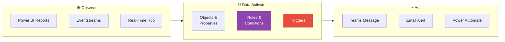
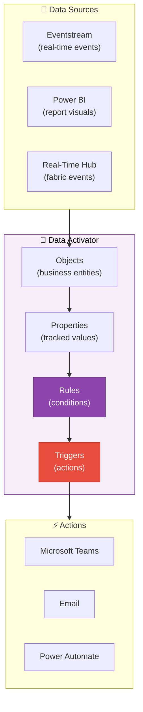
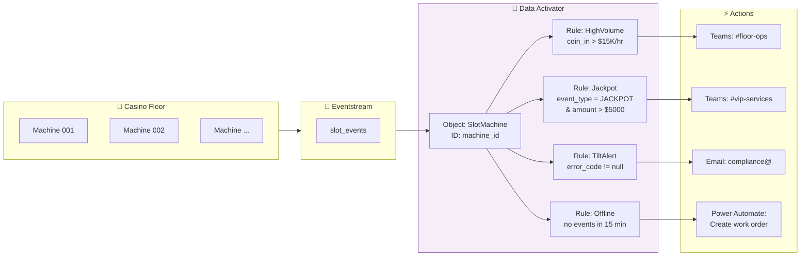
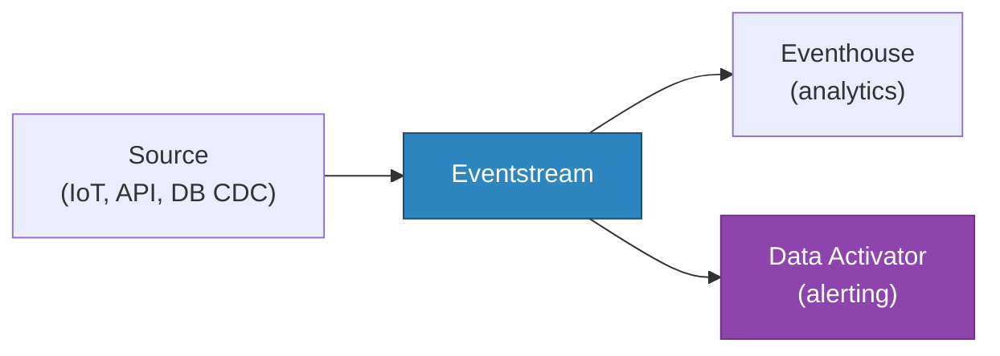

# 🔔 Data Activator — Real-Time Alerting and Actions

<div align="center" markdown>

**Rule-Based Triggers for Microsoft Fabric Data**


</div>

---

**Last Updated:** `2026-04-21` | **Version:** 1.0.0

---

## 🎯 Overview

Data Activator (formerly Reflex) is a **no-code alerting and action engine** in Microsoft Fabric that monitors data in real-time and triggers automated responses when conditions are met. It connects to Eventstreams, Power BI reports, and Fabric items to detect patterns, threshold breaches, and anomalies — then fires actions such as Teams messages, emails, or Power Automate flows.

Data Activator bridges the gap between seeing data in dashboards and acting on it. Instead of manually watching metrics, you define rules that watch for you and take action automatically.

### Where Data Activator Fits



### Key Capabilities

| Capability | Description |
|-----------|-------------|
| **Objects** | Represent monitored business entities (machines, players, stations, agencies) |
| **Properties** | Numeric or categorical values tracked over time |
| **Rules** | Conditions evaluated per object instance: threshold, change, pattern |
| **Triggers** | Actions fired when a rule condition is met |
| **Eventstream Input** | Monitor streaming events in real-time (sub-minute latency) |
| **Power BI Input** | Monitor any visual in a published Power BI report |
| **Real-Time Hub Input** | Connect to fabric-wide event sources |
| **No Code Required** | Fully visual configuration in the Fabric portal |

### Data Activator vs. Alternatives

| Feature | Data Activator | KQL Alerting | Azure Monitor | Power Automate |
|---------|---------------|-------------|---------------|----------------|
| **Setup** | No-code, visual | KQL + alert rules | Metric/log rules | Flow designer |
| **Data Sources** | Eventstream, Power BI, RT Hub | Eventhouse tables | Azure resources | 600+ connectors |
| **Latency** | Seconds to minutes | Minutes | Minutes | Depends on trigger |
| **Action Types** | Teams, email, Power Automate | Email, webhook | Action groups | Full workflow |
| **Object-Level** | ✅ Per-entity tracking | ❌ Aggregate only | ❌ Resource-level | ❌ N/A |
| **Best For** | Business data alerts | KQL data alerts | Infrastructure | Complex workflows |

---

## 🏗️ Architecture

### Component Architecture



### Core Concepts

| Concept | Definition | Casino Example | Federal Example |
|---------|-----------|----------------|-----------------|
| **Object** | A business entity to monitor | Slot Machine | Weather Station |
| **Object ID** | Unique identifier per instance | `machine_id` | `station_id` |
| **Property** | A value tracked over time | `coin_in` | `temperature` |
| **Rule** | A condition to evaluate | `coin_in > 10000 in 1 hour` | `temperature > 110°F` |
| **Trigger** | An action when rule fires | Send Teams alert | Email agency lead |

---

## ⚙️ Configuration

### Creating a Data Activator (Reflex)

1. Open your Fabric workspace
2. Click **+ New** → **Reflex** (or **Data Activator**)
3. The visual designer opens with three tabs: **Data**, **Design**, **Monitor**

### Connecting to an Eventstream

1. In the **Data** tab, click **Get Data** → **Eventstream**
2. Select an existing Eventstream or create a new one
3. Map fields:
   - **Object ID**: the field that identifies each entity (e.g., `machine_id`)
   - **Timestamp**: the event time field
   - **Properties**: values to track (e.g., `coin_in`, `coin_out`, `amount`)

### Connecting to a Power BI Report

1. Open any published Power BI report
2. Right-click a visual → **Set alert** (or **Trigger action**)
3. Select the measure and condition
4. Choose an action (Teams, email, Power Automate)
5. This creates a Data Activator item in your workspace automatically

### Defining a Rule

In the **Design** tab:

1. Select an object (e.g., `SlotMachine`)
2. Select a property (e.g., `coin_in`)
3. Add a **Detect** step:
   - **Threshold**: value exceeds, drops below, or equals
   - **Change**: value increases/decreases by amount or percentage
   - **Pattern**: value enters/exits a range over a time window
4. Add a **Summarize** step (optional):
   - Sum, average, count, min, max over a time window
5. Add an **Act** step:
   - Send Teams message, email, or trigger Power Automate flow

### Rule Definition Example

```
Object: SlotMachine
Property: hourly_coin_in (summarized from coin_in, Sum, 1 hour)

Rule: HighVolumeAlert
  Detect: When hourly_coin_in > 15000
  Act: Send Teams message to #casino-floor-ops
    "🎰 High volume alert: Machine {machine_id} at casino {casino_id}
     has processed ${hourly_coin_in} in the last hour."
```

---

## 📐 Trigger Patterns

### Threshold Triggers

Monitor when a value crosses a static boundary:

| Trigger | Condition | Use Case |
|---------|-----------|----------|
| **High Value** | `value > threshold` | Revenue spike, temperature extreme |
| **Low Value** | `value < threshold` | Inventory depletion, low traffic |
| **Equal** | `value == target` | Status change, code match |
| **Range Exit** | `value NOT BETWEEN low AND high` | Out-of-spec readings |

### Change Triggers

Detect significant changes relative to previous values:

| Trigger | Condition | Use Case |
|---------|-----------|----------|
| **Increase By** | `current - previous > delta` | Sudden revenue jump |
| **Decrease By** | `previous - current > delta` | Revenue drop, equipment failure |
| **% Change** | `abs(current - previous) / previous > pct` | Anomaly detection |

### Aggregation + Threshold (Compound)

Summarize over a time window, then apply a threshold:

```
Summarize: Sum of coin_in over 1 hour
Detect: Sum > 15000
Act: Alert
```

```
Summarize: Count of events over 15 minutes
Detect: Count == 0
Act: Alert (machine may be offline)
```

### Multi-Rule Patterns

Combine rules on the same object for layered alerting:

```
Object: SlotMachine

Rule 1 (Warning):   hourly_coin_in > 10000  → Teams message
Rule 2 (Critical):  hourly_coin_in > 20000  → Email + Power Automate
Rule 3 (Offline):   event_count (15 min) == 0 → Teams + Email
```

---

## 🎰 Casino Implementation

### Slot Machine Floor Monitoring



### Rule Definitions

#### 1. High-Volume Machine Alert

```
Object: SlotMachine (object_id: machine_id)
Property: hourly_revenue
  Summarize: Sum of coin_in over 1 hour

Rule: HighVolumeAlert
  Detect: hourly_revenue > 15000
  Act: Teams message to #casino-floor-ops
    "🎰 HIGH VOLUME: Machine {machine_id} ({casino_id})
     Revenue: ${hourly_revenue} in last hour
     Action: Verify machine operation and player status"
```

#### 2. Jackpot Notification

```
Object: SlotMachine (object_id: machine_id)
Property: event_type, amount

Rule: JackpotAlert
  Detect: event_type == "JACKPOT" AND amount > 5000
  Act: Teams message to #vip-services
    "🎉 JACKPOT: Machine {machine_id}
     Amount: ${amount}
     Casino: {casino_id}
     Action: Dispatch attendant for W-2G processing"
```

#### 3. Machine Offline Detection

```
Object: SlotMachine (object_id: machine_id)
Property: event_count
  Summarize: Count of events over 15 minutes

Rule: OfflineAlert
  Detect: event_count == 0
  Act: Power Automate flow
    → Create work order in maintenance system
    → Teams message to #maintenance
    "⚠️ OFFLINE: Machine {machine_id} — no events in 15 minutes"
```

#### 4. Compliance Structuring Alert

```
Object: Player (object_id: player_card_id)
Property: rolling_cash_total
  Summarize: Sum of cash_amount over 24 hours

Rule: StructuringAlert
  Detect: rolling_cash_total BETWEEN 8000 AND 9999
    AND transaction_count > 3
  Act: Email to compliance@casino.com
    "🔴 STRUCTURING ALERT: Player {player_card_id}
     24hr cash total: ${rolling_cash_total}
     Transactions: {transaction_count}
     Action: Review for SAR filing"
```

#### 5. CTR Auto-Flag

```
Object: Player (object_id: player_card_id)
Property: daily_cash_total
  Summarize: Sum of cash_amount over 24 hours

Rule: CTRRequired
  Detect: daily_cash_total >= 10000
  Act: Email to compliance@casino.com + Power Automate
    "📋 CTR REQUIRED: Player {player_card_id}
     24hr total: ${daily_cash_total}
     Threshold: $10,000
     Action: File CTR within 15 days"
```

---

## 🏛️ Federal Agency Implementation

### NOAA Severe Weather Alerts

```
Object: WeatherStation (object_id: station_id)
Property: wind_speed, temperature, precipitation

Rule: HighWindAlert
  Detect: wind_speed > 60 (mph)
  Act: Teams to #noaa-ops + Email
    "🌪️ HIGH WIND: Station {station_id} ({location})
     Wind speed: {wind_speed} mph
     Action: Issue wind advisory"

Rule: ExtremeHeatAlert
  Detect: temperature > 110 (°F)
  Act: Teams + Power Automate (notify public health)
    "🌡️ EXTREME HEAT: Station {station_id}
     Temperature: {temperature}°F
     Action: Issue heat advisory"
```

### EPA Air Quality Alerts

```
Object: MonitoringSite (object_id: site_id)
Property: aqi, pm25

Rule: UnhealthyAQI
  Detect: aqi > 150
  Act: Teams to #epa-monitoring + Email
    "⚠️ UNHEALTHY AQI: Site {site_id} ({county}, {state})
     AQI: {aqi} (Unhealthy)
     PM2.5: {pm25} μg/m³
     Action: Issue air quality alert"

Rule: HazardousAQI
  Detect: aqi > 300
  Act: Email + Power Automate (emergency notification)
    "🔴 HAZARDOUS AQI: Site {site_id}
     AQI: {aqi}
     Action: Activate emergency response protocol"
```

### DOI Earthquake Detection

```
Object: SeismicEvent (object_id: event_id)
Property: magnitude, depth

Rule: SignificantQuake
  Detect: magnitude >= 5.0
  Act: Teams to #doi-emergency + Email + Power Automate
    "🌍 EARTHQUAKE: Magnitude {magnitude}
     Location: {latitude}, {longitude}
     Depth: {depth} km
     Action: Activate response protocols"
```

### USDA Commodity Price Alert

```
Object: Commodity (object_id: commodity_code)
Property: price, daily_change_pct

Rule: PriceSwing
  Detect: abs(daily_change_pct) > 5
  Act: Teams to #usda-markets
    "📊 PRICE SWING: {commodity_name}
     Change: {daily_change_pct}%
     Current price: ${price}/bushel
     Action: Review market conditions"
```

### Multi-Agency Alert Summary

| Agency | Object | Rule | Condition | Action |
|--------|--------|------|-----------|--------|
| **Casino** | SlotMachine | HighVolume | coin_in > $15K/hr | Teams |
| **Casino** | SlotMachine | Jackpot | amount > $5K | Teams + W-2G flow |
| **Casino** | Player | CTR | cash > $10K/24hr | Email + compliance flow |
| **NOAA** | WeatherStation | HighWind | wind > 60 mph | Teams + advisory flow |
| **EPA** | MonitoringSite | UnhealthyAQI | AQI > 150 | Teams + public alert |
| **DOI** | SeismicEvent | SignificantQuake | magnitude ≥ 5.0 | Teams + emergency flow |
| **USDA** | Commodity | PriceSwing | change > 5% | Teams |
| **SBA** | LoanApplication | FraudRisk | risk_score > 0.85 | Email + review flow |

---

## 🔗 Integration Patterns

### Eventstream → Data Activator

The primary real-time pattern:



Configure in the Eventstream editor:
1. Add a **Destination** → **Reflex** (Data Activator)
2. Select or create a Reflex item
3. Map object ID and properties

### Power BI → Data Activator

For alerts on scheduled-refresh data:

1. Open a published Power BI report
2. Right-click a visual → **Set alert**
3. Define condition and action
4. Data Activator monitors the visual's data on each refresh

### Power Automate Integration

For complex workflows beyond Teams/email:

```
Data Activator Trigger
  → Power Automate Flow
    → Create ServiceNow ticket
    → Send SMS via Twilio
    → Update SharePoint list
    → Call Azure Function
    → Post to Slack
```

---

## 📊 Monitoring and Troubleshooting

### Monitoring Tab

The **Monitor** tab in the Data Activator shows:

```
Rule: HighVolumeAlert
  Status: Active
  Last evaluated: 2026-04-21 14:32:00
  Triggers fired (24h): 7
  Triggers fired (7d): 43

  Recent Triggers:
    2026-04-21 14:32:00  machine_id=SM-0847  hourly_revenue=$17,230  → Teams sent ✅
    2026-04-21 13:15:00  machine_id=SM-0231  hourly_revenue=$16,100  → Teams sent ✅
    2026-04-21 12:45:00  machine_id=SM-1102  hourly_revenue=$21,300  → Teams sent ✅
```

### Common Issues

| Issue | Symptom | Resolution |
|-------|---------|------------|
| **No triggers firing** | Rule shows 0 triggers | Verify Eventstream is flowing; check object ID mapping |
| **Delayed triggers** | Alerts arrive late | Check Eventstream latency; ensure timestamp field is correct |
| **Excessive triggers** | Noisy alerts | Increase threshold, add time window aggregation, add cooldown |
| **Teams message fails** | Trigger fires but no message | Verify Teams channel permissions and webhook configuration |
| **Power Automate fails** | Flow not triggered | Check flow is enabled; verify connection credentials |
| **Missing objects** | Not all entities appear | Verify object ID field has unique values in source data |

### Alert Fatigue Prevention

| Strategy | Implementation |
|----------|---------------|
| **Cooldown Period** | Don't re-alert for same object within N minutes |
| **Aggregation Window** | Summarize before threshold (hourly vs. per-event) |
| **Severity Levels** | Warning → Critical → Emergency with escalation |
| **Batching** | Group multiple triggers into a single digest |
| **Time-of-Day** | Suppress non-critical alerts outside business hours |

---

## ⚠️ Limitations

### Current Limitations

| Limitation | Details | Workaround |
|-----------|---------|-----------|
| **No Custom Code** | Cannot write custom functions or scripts | Use Power Automate for complex logic |
| **Limited Condition Types** | Threshold, change, and range only | Combine with KQL alerting for complex patterns |
| **Action Types** | Teams, email, Power Automate only | Use Power Automate to bridge to other systems |
| **Object Limit** | Max 1,000 unique object instances per Reflex | Create multiple Reflex items or aggregate objects |
| **Evaluation Frequency** | Sub-minute for Eventstream; depends on refresh for Power BI | Use Eventstream for lowest latency |
| **No Historical Replay** | Cannot retroactively evaluate rules on past data | Use KQL queries for historical analysis |
| **GA Status** | Generally available as of late 2025 | Stable for production use |
| **No API** | No REST API for programmatic rule management | Manual portal configuration only |

---

## 📚 References

| Resource | URL |
|----------|-----|
| Data Activator Overview | https://learn.microsoft.com/fabric/data-activator/data-activator-introduction |
| Get Started with Data Activator | https://learn.microsoft.com/fabric/data-activator/data-activator-get-started |
| Data Activator + Eventstreams | https://learn.microsoft.com/fabric/data-activator/data-activator-get-data-eventstreams |
| Data Activator + Power BI | https://learn.microsoft.com/fabric/data-activator/data-activator-get-data-power-bi |
| Create Rules | https://learn.microsoft.com/fabric/data-activator/data-activator-create-triggers-design-mode |
| Power Automate Integration | https://learn.microsoft.com/fabric/data-activator/data-activator-trigger-power-automate-flows |
| Real-Time Hub | https://learn.microsoft.com/fabric/real-time-hub/real-time-hub-overview |

---

## 🔗 Related Documents

- [Real-Time Intelligence](real-time-intelligence.md) — Eventstreams and Eventhouse for streaming analytics
- [Workspace Monitoring](workspace-monitoring.md) — Infrastructure monitoring for Fabric workspaces
- [Alerting Best Practices](../best-practices/alerting-data-activator.md) — Alert rule design and fatigue prevention
- [Copy Job CDC](copy-job-cdc.md) — Incremental ingestion that feeds Data Activator via Eventstream
- [Architecture](../ARCHITECTURE.md) — System architecture overview

---

> 📝 **Document Metadata**
> - **Author**: Documentation Team
> - **Reviewers**: Real-Time Intelligence, Operations, Compliance
> - **Classification**: Internal
> - **Next Review**: 2026-07-21
