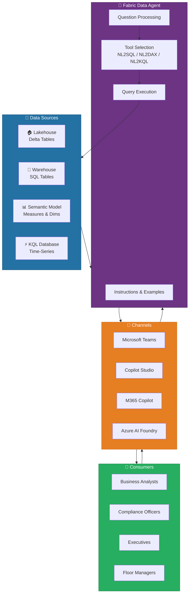
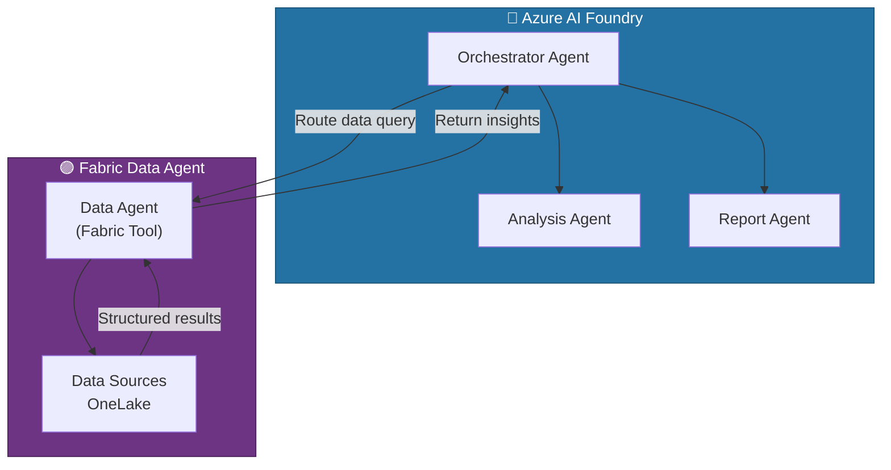
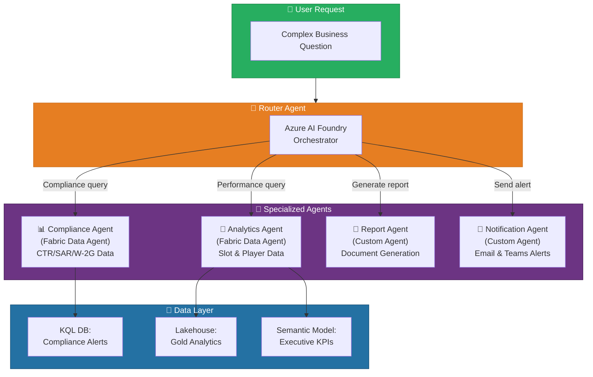
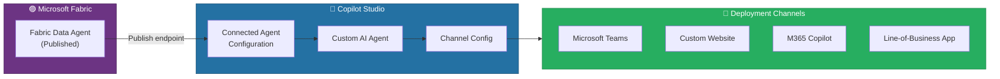
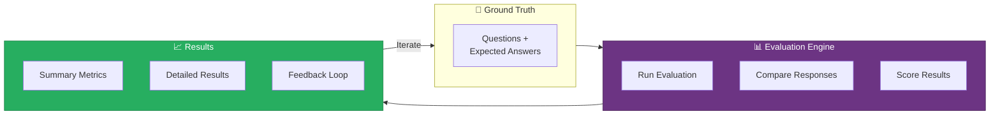
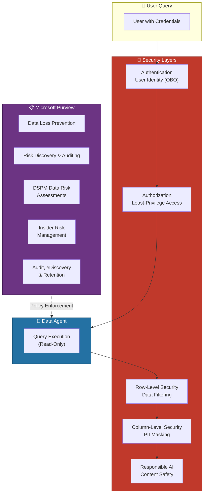

# 🤖 Fabric Data Agents - Conversational AI for Enterprise Data

<div align="center" markdown>

**Build Customizable Q&A Systems Over Your Fabric Data**


</div>

---

**Last Updated:** `2026-04-13` | **Version:** 1.0.0

---

## 🎯 Overview

Fabric Data Agents are configurable, conversational Q&A systems built on generative AI that enable users to ask plain English questions about data stored in Microsoft Fabric OneLake and receive structured, data-driven answers. Data agents transform complex data operations into natural-language interactions, making enterprise insights accessible to users regardless of their technical expertise in SQL, DAX, or KQL.

Unlike the built-in Fabric Copilot features that come preconfigured and assist with tasks within the Fabric workspace, data agents are standalone artifacts that you can highly customize with domain-specific instructions, example queries, and contextual guidance. This customization produces more deterministic, accurate, and organization-aligned responses.

### Key Capabilities

| Capability | Description |
|-----------|-------------|
| **Conversational Q&A** | Users ask questions in plain English and receive structured answers with tables, summaries, and insights |
| **Customizable Instructions** | Add up to 15,000 characters of agent-level and data-source-level instructions to guide response behavior |
| **Example Queries (Few-Shot)** | Provide sample question-query pairs that teach the agent domain-specific patterns and business logic |
| **Multi-Source Querying** | Query across up to five data sources: Lakehouses, Warehouses, Semantic Models, KQL Databases, and Ontologies |
| **Cross-Platform Deployment** | Publish to Microsoft Copilot Studio, Microsoft 365 Copilot, Teams, and Azure AI Foundry |
| **Read-Only Security** | Strictly enforces read-only data connections with full RLS, CLS, and Purview governance |
| **Programmatic SDK** | Create, manage, evaluate, and consume agents programmatically via the Python SDK |

### Data Agents vs Copilot

Understanding when to use a Data Agent versus the built-in Fabric Copilot is critical for choosing the right tool:

| Dimension | Fabric Copilot | Fabric Data Agent |
|-----------|---------------|-------------------|
| **Configuration** | Pre-configured, no customization | Highly configurable with instructions and examples |
| **Scope** | Assists within Fabric UI (notebooks, warehouses) | Standalone artifact for cross-source Q&A |
| **Deployment** | Embedded in Fabric workspace | Publishable to Teams, Copilot Studio, M365 Copilot |
| **Customization** | None | Agent instructions, data source instructions, few-shot examples |
| **External Access** | Fabric workspace only | External systems, multi-agent runtimes, custom apps |
| **Use Case** | Code generation, report building | Domain-specific data Q&A for business users |

### Data Agent in the Fabric Ecosystem



---

## 🏗️ Architecture

Fabric Data Agents use the Azure OpenAI Assistant APIs as their underlying agent framework. The agent processes user questions through multiple layers: parsing and validation, data source identification, tool invocation, query generation, validation, execution, and response formatting.

### Processing Pipeline

```mermaid
flowchart LR
    subgraph Input["📝 User Input"]
        Q["Natural Language<br/>Question"]
    end

    subgraph Parsing["🔍 Parsing & Validation"]
        SEC["Security Check<br/>RAI Policy"]
        PERM["Permission<br/>Enforcement"]
        PARSE["Question<br/>Rephrasing"]
    end

    subgraph Routing["🧭 Source Routing"]
        SRC["Data Source<br/>Identification"]
        INST["Agent Instructions<br/>Evaluation"]
    end

    subgraph Generation["⚙️ Query Generation"]
        NL2SQL["NL2SQL<br/>(Lakehouse/Warehouse)"]
        NL2DAX["NL2DAX<br/>(Semantic Model)"]
        NL2KQL["NL2KQL<br/>(KQL Database)"]
    end

    subgraph Output["📊 Response"]
        VAL["Query Validation"]
        EXEC["Execution"]
        FMT["Response Formatting"]
    end

    Input --> Parsing --> Routing --> Generation --> Output

    style Parsing fill:#C0392B,stroke:#922B21,color:#fff
    style Routing fill:#6C3483,stroke:#4A235A,color:#fff
    style Generation fill:#2471A3,stroke:#1A5276,color:#fff
    style Output fill:#27AE60,stroke:#1E8449,color:#fff
```



### Processing Steps

1. **Question Parsing and Validation** -- The agent processes the user question through Azure OpenAI Assistant APIs, verifying compliance with security protocols, responsible AI policies, and user permissions. Microsoft Purview governance controls including DLP and access restriction policies are enforced at this stage.

2. **Permission Enforcement** -- The agent uses the requesting user's credentials to enforce least-privilege access, ensuring each interaction only reaches data the user is authorized to view. Guardrails constrain tool invocation and outputs to scoped data sources.

3. **Data Source Identification** -- Using the schema of available data sources (accessed via the user's credentials), the agent evaluates the question against all configured sources and any developer-provided instructions to determine the most relevant data source.

4. **Tool Invocation and Query Generation** -- The agent invokes the appropriate tool based on the identified data source: NL2SQL for relational databases, NL2DAX for Power BI semantic models, or NL2KQL for KQL databases. User-defined KQL functions are supported when available.

5. **Query Validation** -- The generated query is verified for syntactic correctness and adherence to security and RAI policies before execution.

6. **Execution and Response** -- The validated query executes against the chosen data source, and results are formatted into human-readable tables, summaries, or key insights.

### Governance Intent Layers

When configuring a data agent, multiple layers of intent influence behavior, listed from highest to lowest precedence:

| Precedence | Layer | Description |
|-----------|-------|-------------|
| **1 (Highest)** | Organizational Intent | Tenant-wide policies and compliance requirements set by administrators |
| **2** | Role-Based Intent | Workspace governance settings and permission boundaries |
| **3** | Developer Intent | Custom instructions, example queries, and data source configurations |
| **4 (Lowest)** | User Intent | Questions and prompts submitted by end users |

> 📝 **Note**: Higher-precedence layers always override lower ones. Organizational policies and workspace governance settings override developer instructions and user prompts, ensuring the agent operates within approved boundaries regardless of configuration or prompting.

### Azure AI Foundry Integration

Fabric Data Agents integrate with Azure AI Foundry (formerly Azure AI Studio) as a "Fabric tool" that external orchestrators and multi-agent runtimes can invoke. This enables end-to-end agentic workflows where the data agent handles read-only, governed data access while other agents manage different parts of the workflow.



```python
# Azure AI Foundry: Adding Fabric Data Agent as a tool
import os
from azure.ai.projects import AIProjectClient
from azure.identity import DefaultAzureCredential
from azure.ai.agents.models import FabricTool, ListSortOrder

# Create a project client
project_client = AIProjectClient(
    credential=DefaultAzureCredential(),
    endpoint=os.environ["PROJECT_ENDPOINT"]
)

# Configure the Fabric Data Agent tool
fabric_tool = FabricTool(
    connection_id="/subscriptions/{sub}/resourceGroups/{rg}"
                  "/providers/Microsoft.CognitiveServices/accounts/{account}"
                  "/projects/{project}/connections/{connection_name}"
)

# Create an agent with the Fabric tool enabled
agent = project_client.agents.create_agent(
    model=os.environ["MODEL_DEPLOYMENT_NAME"],
    name="casino-analytics-agent",
    instructions="Use the Fabric data agent tool to answer questions about "
                 "casino gaming operations, slot performance, and compliance data.",
    tools=fabric_tool.definitions,
    tool_resources=fabric_tool.resources,
)
print(f"Agent created: {agent.id}")
```

> ⚠️ **Warning**: The Fabric data agent only supports user identity authentication (On-Behalf-Of) when accessed through Azure AI Foundry. Service principal authentication is not supported for data agent interactions, though it is supported for ALM scenarios (Git integration and deployment pipelines).

---

## ⚙️ Setup and Configuration

### Prerequisites

| Requirement | Details |
|------------|---------|
| **Fabric Capacity** | F2 or higher (paid), or Power BI Premium per capacity (P1+) |
| **Tenant Settings** | Data agent tenant settings enabled, including Copilot capacity designation |
| **Cross-Geo AI** | Cross-geo processing for AI enabled; Cross-geo storing for AI enabled |
| **Data Sources** | At least one Lakehouse, Warehouse, Semantic Model, KQL Database, or Ontology with data |
| **XMLA Endpoints** | Enabled (required for Power BI semantic model data sources) |
| **Permissions** | Read permission on semantic models (Build/Member not required for agent interaction) |

### Step 1: Enable Tenant Settings

Navigate to the Fabric Admin Portal and configure the data agent tenant settings:

```
Admin Portal → Tenant Settings → Data Agent
  ├── Fabric data agent → Enabled
  ├── Capacities can be designated as Fabric Copilot capacities → Enabled
  ├── Cross-geo processing for AI → Enabled (configure per compliance policy)
  ├── Cross-geo storing for AI → Enabled (configure per compliance policy)
  └── Power BI semantic models via XMLA endpoints → Enabled
```

> 📝 **Note**: For federal workloads, ensure cross-geo settings align with FedRAMP data residency requirements. Consider restricting cross-geo processing to US regions only for compliance-sensitive data sources.

### Step 2: Create a Data Agent

Create a new data agent artifact in your Fabric workspace:

```
Workspace → + New → Data Agent
  Name: da-casino-compliance
  Description: Conversational Q&A for casino gaming compliance,
               slot performance, and player analytics
```

### Step 3: Select Data Sources

Add up to five data sources in any combination. For each source, select the specific tables the agent should access:

```
Explorer Pane → Add Data Source
  ├── lh_gold (Lakehouse)
  │   ├── ☑ gold_slot_performance
  │   ├── ☑ gold_player_value
  │   ├── ☑ gold_compliance_summary
  │   └── ☑ gold_revenue_daily
  ├── sm_casino_analytics (Semantic Model)
  │   ├── ☑ Slot Revenue
  │   ├── ☑ Player Metrics
  │   └── ☑ Compliance KPIs
  └── db_compliance_alerts (KQL Database)
      ├── ☑ ComplianceAlerts
      └── ☑ PlayerTransactions
```

> 💡 **Tip**: For lakehouses, data must be available as tables (not individual files). If your data starts as CSV or JSON files, ingest it into tables before adding the source to the agent.

### Step 4: Add Agent-Level Instructions

Provide instructions (up to 15,000 characters) that guide the agent's overall behavior:

```markdown
## General Context
You are a casino gaming analytics assistant specializing in slot machine
performance, player value analysis, and regulatory compliance (NIGC MICS).
Always provide accurate data and include relevant compliance context.

## Data Source Routing
- For real-time compliance alerts and transaction monitoring, use the
  KQL database (db_compliance_alerts)
- For historical slot performance and player analytics, use the
  Lakehouse (lh_gold)
- For executive KPIs and pre-built measures, use the Semantic Model
  (sm_casino_analytics)

## Terminology
- CTR: Currency Transaction Report, required for transactions >= $10,000
- SAR: Suspicious Activity Report, filed for structuring patterns
- W-2G: Tax form for gambling winnings above threshold
- ADT: Average Daily Theoretical, expected daily revenue from a player
- Hold %: Percentage of money wagered that the casino retains
- Coin-in: Total amount wagered; Coin-out: Total amount paid out

## Compliance Rules
- Always include compliance disclaimers when reporting CTR/SAR data
- Never reveal raw SSN or full card numbers in responses
- When asked about structuring patterns, reference the $8K-$9.9K range
```

### Step 5: Add Data Source Instructions

For each data source, provide specific instructions that help the agent construct precise queries:

```markdown
## Data Source: lh_gold (Lakehouse)

## General Knowledge
This lakehouse contains Gold-layer aggregated tables following the medallion
architecture. All tables use Delta format with daily partitioning.

## Table Descriptions
- gold_slot_performance: Daily slot machine metrics by machine_id.
  Key columns: machine_id, gaming_date, denomination, coin_in, coin_out,
  hold_pct, jackpot_count, error_count, floor_location
- gold_player_value: Player lifetime value calculations.
  Key columns: player_id, total_wagered, total_won, visit_count, adt,
  loyalty_tier (Bronze/Silver/Gold/Platinum), last_visit_date

## When Asked About
- "revenue" or "earnings": Use SUM(coin_in - coin_out) from gold_slot_performance
- "hold percentage": Use AVG(hold_pct) from gold_slot_performance
- "player value" or "lifetime value": Query gold_player_value table
- "top machines": ORDER BY (coin_in - coin_out) DESC
```

### Step 6: Add Example Queries

Provide sample question-query pairs for few-shot learning:

```json
{
    "fewShots": [
        {
            "id": "a1b2c3d4-e5f6-7890-abcd-ef1234567890",
            "question": "What was the total revenue by denomination last week?",
            "query": "SELECT denomination, SUM(coin_in - coin_out) AS total_revenue, COUNT(DISTINCT machine_id) AS machine_count FROM gold_slot_performance WHERE gaming_date >= DATEADD(DAY, -7, GETDATE()) GROUP BY denomination ORDER BY total_revenue DESC"
        },
        {
            "id": "b2c3d4e5-f6a7-8901-bcde-f12345678901",
            "question": "Show me Platinum players who haven't visited in 30 days",
            "query": "SELECT player_id, total_wagered, adt, loyalty_tier, last_visit_date FROM gold_player_value WHERE loyalty_tier = 'Platinum' AND last_visit_date < DATEADD(DAY, -30, GETDATE()) ORDER BY adt DESC"
        }
    ]
}
```

> 📝 **Note**: Adding sample query/question pairs is not currently supported for Power BI semantic model data sources. Use data source instructions to guide DAX generation for semantic models instead.

### Step 7: Publish the Data Agent

After testing and validating responses, publish the agent to make it available for consumption:

```
Data Agent → Publish
  ├── Publish (standard) → Generates published endpoint URL
  └── Publish to Agent Store → Makes available in M365 Copilot Agent Store
```

The published URL follows the format:
`https://fabric.microsoft.com/groups/<workspace_id>/aiskills/<artifact_id>`

---

## 🔧 Fabric Data Agent SDK

The Fabric Data Agent Python SDK provides programmatic access to create, manage, evaluate, and consume data agents within Microsoft Fabric notebooks.

### Installation

```python
%pip install -U fabric-data-agent-sdk
```

> ⚠️ **Warning**: The SDK is designed to work exclusively within Microsoft Fabric notebooks. It is not supported for local execution outside the Fabric environment.

### Prerequisites

| Requirement | Details |
|------------|---------|
| **Python** | Version 3.10 or higher |
| **Environment** | Microsoft Fabric Notebook |
| **Capacity** | F2 or higher with data agent tenant settings enabled |

### Creating an Agent Programmatically

```python
from fabric.dataagent import FabricDataAgent

# Create a new data agent
agent = FabricDataAgent.create(
    name="da-slot-analytics",
    description="Slot machine performance analytics and compliance Q&A"
)

# Add a lakehouse data source
datasource = agent.add_data_source(
    source_type="lakehouse",
    source_name="lh_gold",
    tables=[
        "gold_slot_performance",
        "gold_player_value",
        "gold_compliance_summary"
    ]
)

# Set agent-level instructions
agent.set_instructions("""
You are a casino floor analytics assistant. Use the gold-layer tables
to answer questions about slot machine performance, player value, and
compliance metrics. Always format currency values with $ prefix and
two decimal places.
""")

# Set data source instructions
datasource.set_instructions("""
## Table: gold_slot_performance
Daily aggregated slot machine metrics. Each row = one machine per day.
Key columns: machine_id, gaming_date, coin_in, coin_out, hold_pct

## When asked about revenue
Use: SUM(coin_in - coin_out) from gold_slot_performance
""")

print(f"Agent created: {agent.name}")
```

### Adding Example Queries

```python
# Add few-shot examples to improve query accuracy
datasource.add_example_query(
    question="What is the average hold percentage by floor location?",
    query="""
        SELECT floor_location,
               AVG(hold_pct) AS avg_hold_pct,
               COUNT(DISTINCT machine_id) AS machine_count
        FROM gold_slot_performance
        WHERE gaming_date >= DATEADD(DAY, -30, GETDATE())
        GROUP BY floor_location
        ORDER BY avg_hold_pct DESC
    """
)

datasource.add_example_query(
    question="Which machines had the highest jackpot frequency this month?",
    query="""
        SELECT machine_id, floor_location, game_title,
               SUM(jackpot_count) AS total_jackpots,
               SUM(coin_in) AS total_coin_in
        FROM gold_slot_performance
        WHERE gaming_date >= DATETRUNC(MONTH, GETDATE())
        GROUP BY machine_id, floor_location, game_title
        HAVING SUM(jackpot_count) > 0
        ORDER BY total_jackpots DESC
        LIMIT 20
    """
)
```

### Validating Example Queries

```python
# Validate few-shot examples against the data source schema
result = datasource.evaluate_few_shots(batch_size=20)

# Review overall success rate
print(f"Success rate: {result.success_rate:.2f}% "
      f"({result.success_count}/{result.total_examples})")

# Inspect success and failure cases
success_df = result.success_cases
failure_df = result.failure_cases

print("\nSuccess Cases:")
display(success_df)

print("\nFailure Cases (need refinement):")
display(failure_df)
```

### Consuming an Agent

```python
# Query the published data agent
from fabric.dataagent import DataAgentClient

client = DataAgentClient(
    endpoint="https://fabric.microsoft.com/groups/{workspace_id}"
             "/aiskills/{artifact_id}"
)

# Ask a question
response = client.ask("What were the top 5 slot machines by revenue last week?")
print(f"Response: {response}")

# Inspect the steps and generated query
run_details = client.get_run_details(
    "What were the top 5 slot machines by revenue last week?"
)
messages = run_details.get("messages", {}).get("data", [])
assistant_messages = [msg for msg in messages if msg.get("role") == "assistant"]

print("Answer:", assistant_messages[-1])
```

> 💡 **Tip**: When calling a data agent programmatically, implement a polling timeout to avoid indefinite loops, keep polling frequency to 2-5 seconds, clean up created threads after completion, and shut down notebook sessions when finished to release Fabric capacity.

---

## 🤖 Multi-Agent Orchestration

Fabric Data Agents are designed to participate in broader agentic application architectures as the conversational analytics component. Multiple specialized agents can work together, each handling different aspects of a business workflow.

### Multi-Agent Architecture



### Orchestration Pattern: Casino Operations

In a casino operations scenario, the orchestrator routes different aspects of a complex question to specialized agents:

**User Question:** "Are there any compliance issues for high-value players on Floor 2 this week, and what's the revenue impact?"

**Orchestration Flow:**

| Step | Agent | Action | Output |
|------|-------|--------|--------|
| 1 | Router Agent | Decomposes question into sub-queries | Compliance + Analytics tasks |
| 2 | Compliance Agent | Queries KQL DB for CTR/SAR alerts on Floor 2 players | 3 CTR filings, 1 SAR pattern detected |
| 3 | Analytics Agent | Queries Lakehouse for Floor 2 revenue and flagged player metrics | $420K revenue, 12 high-value player sessions |
| 4 | Router Agent | Combines results into unified response | Compliance summary with revenue context |

### Implementing Multi-Agent with Azure AI Foundry

```python
from azure.ai.projects import AIProjectClient
from azure.identity import DefaultAzureCredential
from azure.ai.agents.models import FabricTool

# Create the project client
project_client = AIProjectClient(
    credential=DefaultAzureCredential(),
    endpoint=os.environ["PROJECT_ENDPOINT"]
)

# Configure Fabric tools for different data agents
compliance_tool = FabricTool(
    connection_id=os.environ["COMPLIANCE_AGENT_CONNECTION"]
)

analytics_tool = FabricTool(
    connection_id=os.environ["ANALYTICS_AGENT_CONNECTION"]
)

# Create the orchestrator agent with multiple Fabric tools
orchestrator = project_client.agents.create_agent(
    model=os.environ["MODEL_DEPLOYMENT_NAME"],
    name="casino-orchestrator",
    instructions="""
    You are a casino operations orchestrator. Route questions as follows:
    - Compliance questions (CTR, SAR, W-2G, structuring): Use the compliance
      Fabric tool
    - Performance questions (revenue, hold %, utilization): Use the analytics
      Fabric tool
    - Combined questions: Query both tools and synthesize the response
    Always include relevant compliance context when discussing player data.
    """,
    tools=compliance_tool.definitions + analytics_tool.definitions,
    tool_resources={
        **compliance_tool.resources,
        **analytics_tool.resources
    },
)
```

> 📝 **Note**: External orchestrators and multi-agent runtimes can invoke Fabric data agents while the data agents remain focused on read-only, governed data access. The agent enforces data permissions regardless of which external system invokes it.

---

## 🔌 Integration with Copilot Studio

Microsoft Copilot Studio provides a low-code platform for building custom AI agents that can incorporate Fabric Data Agents as connected agents, enabling agent-to-agent collaboration.

### Publishing to Copilot Studio

The integration with Copilot Studio allows you to embed Fabric Data Agents as custom skills in Teams, web apps, or line-of-business applications:



### Step-by-Step: Adding Data Agent to Copilot Studio

1. **Publish the Data Agent** -- Ensure your Fabric data agent is published and you have the endpoint URL.

2. **Create a Custom Agent in Copilot Studio** -- Create a new custom AI agent in Microsoft Copilot Studio.

3. **Add as Connected Agent** -- Add the Fabric data agent as a connected agent, providing the published endpoint. This enables agent-to-agent collaboration where the Copilot Studio agent can securely access enterprise data through the Fabric data agent.

4. **Configure Channels** -- Select deployment channels such as Teams, websites, or Microsoft 365 Copilot.

5. **Publish the Custom Agent** -- Publish and deploy to your selected channels.

### Deploying to Microsoft Teams

After publishing through Copilot Studio, deploy directly to Teams:

```
Copilot Studio → Channels → Teams and Microsoft 365 Copilot
  ├── Add channel → Enable Teams integration
  ├── See agent in Teams → Opens Microsoft Teams
  └── Share with users → Distribute installation link
```

> ⚠️ **Warning**: If you share your custom AI agent with others, they must have at least read access to the Fabric data agent and the necessary permissions for all underlying data sources. Row-level security and column-level security are fully enforced for each user.

### Publishing to Microsoft 365 Copilot Agent Store

You can also publish directly from Fabric to the Microsoft 365 Copilot Agent Store:

```
Fabric Data Agent → Publish → Publish to Agent Store
  ├── Agent appears in M365 Copilot Agent Store
  ├── Users can @mention the agent from M365 Copilot chat
  ├── Supports code interpreter for visualizations
  └── Share agent link via Teams chat, group chat, or channel
```

When users interact with the data agent in Microsoft 365 Copilot, they can use the code interpreter to generate visualizations from results, helping them explore trends and patterns directly within Teams. All row-level and column-level security settings are fully respected regardless of access channel.

---

## 🎰 Casino Compliance Agent

A practical, production-ready example of a Fabric Data Agent configured for casino gaming compliance, demonstrating the full configuration workflow with domain-specific instructions, example queries, and guardrails.

### Use Case

Casino compliance officers need rapid access to CTR filings, SAR patterns, W-2G records, and player transaction monitoring. This agent enables them to ask natural-language questions and receive compliance-focused answers without writing SQL or KQL.

### Data Sources Configuration

| Source | Type | Tables | Purpose |
|--------|------|--------|---------|
| `lh_gold` | Lakehouse | `gold_compliance_summary`, `gold_player_value` | Historical compliance metrics and player profiles |
| `db_compliance_alerts` | KQL Database | `ComplianceAlerts`, `PlayerTransactions` | Real-time alert monitoring |
| `sm_compliance_kpis` | Semantic Model | Compliance KPIs, Trend Measures | Executive compliance dashboard metrics |

### Agent Instructions

```markdown
## Role
You are a casino regulatory compliance assistant specializing in NIGC MICS
(Minimum Internal Control Standards) compliance. You help compliance officers
monitor CTR, SAR, and W-2G reporting requirements.

## Compliance Thresholds
- CTR (Currency Transaction Report): Required for cash transactions >= $10,000
- SAR (Suspicious Activity Report): Filed for suspected structuring patterns,
  typically multiple transactions in the $8,000-$9,999 range within 24 hours
- W-2G (Certain Gambling Winnings): Required for slot wins >= $1,200,
  table game wins >= $600, poker tournament wins >= $5,000

## Security Rules
- NEVER display raw SSN values. Always show masked format: XXX-XX-1234
- NEVER display full credit card numbers. Show last 4 digits only
- Always include a compliance disclaimer when reporting SAR-related data
- Flag any query that appears to be probing for PII exposure

## Response Guidelines
- Include the compliance threshold context with every response
- Show timestamps in local casino time zone
- Reference the applicable NIGC MICS section when relevant
- When reporting structuring patterns, include the time window analysis
```

### Example Queries and Expected Responses

**Question:** "Were there any CTR filings today?"

**Expected Response:**
```
There were 4 CTR filings today (April 13, 2026):

| Time      | Player ID | Amount     | Type       | Location     |
|-----------|-----------|------------|------------|--------------|
| 09:23 AM  | PL-4421   | $12,500.00 | Cash-in    | Cage Window 3|
| 11:45 AM  | PL-8912   | $15,000.00 | Cash-out   | Cage Window 1|
| 02:17 PM  | PL-3305   | $10,000.00 | Cash-in    | Cage Window 5|
| 04:52 PM  | PL-7788   | $22,300.00 | Cash-out   | Cage Window 2|

Per NIGC MICS Section 543.15, CTR filings are required for all cash
transactions of $10,000 or more.
```

**Question:** "Show me potential structuring activity in the last 48 hours"

**Expected Response:**
```
Potential structuring patterns detected in the last 48 hours:

⚠ FLAGGED: 2 players with suspicious transaction patterns

| Player ID | Transactions | Total Amount | Time Window | Pattern         |
|-----------|-------------|--------------|-------------|-----------------|
| PL-5567   | 4           | $37,200.00   | 18 hours    | 4x ~$9,300 each |
| PL-2214   | 3           | $28,500.00   | 22 hours    | 3x ~$9,500 each |

Both patterns show multiple cash transactions in the $8,000-$9,999 range
within a 24-hour window, consistent with structuring to avoid the $10,000
CTR threshold. SAR filing may be warranted per 31 CFR 1021.320.

⚠ Compliance Disclaimer: This analysis is for monitoring purposes only.
SAR filing decisions should be made by authorized BSA compliance personnel.
```

### Guardrails Configuration

| Guardrail | Implementation | Purpose |
|-----------|---------------|---------|
| **PII Masking** | Agent instructions + data source CLS | Prevents exposure of SSN, card numbers |
| **Read-Only Access** | Built-in enforcement | Agents cannot modify data |
| **Scope Restriction** | Guardrails constrain tool invocation | Prevents queries outside configured sources |
| **Content Safety** | Azure AI Content Safety integration (optional) | Reduces harmful or out-of-policy responses |
| **Compliance Disclaimer** | Agent instructions | Auto-appends disclaimer on SAR/CTR responses |

---

## 🏛️ Federal Data Analysis Agents

Each federal agency in the POC benefits from a dedicated data agent configured with agency-specific instructions, terminology, and example queries.

### 🌾 USDA: Agricultural Statistics Agent

**Agent Name:** `da-usda-agriculture`
**Data Sources:** `lh_gold` (Lakehouse), `sm_usda_analytics` (Semantic Model)

| Question Category | Example Question | Data Source | Output Type |
|------------------|-----------------|-------------|-------------|
| Crop Production | "What was corn production in Iowa last year?" | Lakehouse | Table with year-over-year comparison |
| Yield Analysis | "Which states had the highest soybean yield?" | Semantic Model | Ranked bar chart |
| Acreage Trends | "Show wheat acreage planted vs harvested by state" | Lakehouse | Comparison table |
| Market Share | "What % of national corn comes from the top 5 states?" | Semantic Model | Pie chart with percentages |

**Key Instructions:**
```markdown
## Terminology
- NASS: National Agricultural Statistics Service
- Commodity: The crop type (corn, soybeans, wheat, etc.)
- Yield: Production per acre (bushels/acre for grains)
- Planted Acreage: Total acres planted; Harvested Acreage: Total acres harvested

## When asked about production trends
Always include year-over-year percentage change and national context.
```

### 💼 SBA: Loan Program Analysis Agent

**Agent Name:** `da-sba-loans`
**Data Sources:** `lh_gold` (Lakehouse), `sm_sba_programs` (Semantic Model)

| Question Category | Example Question | Data Source | Output Type |
|------------------|-----------------|-------------|-------------|
| PPP Loans | "Total PPP loan amount by state in 2024?" | Lakehouse | Ranked table |
| 7(a) Trends | "Show 7(a) loan approval trends over 5 years" | Semantic Model | Trend line chart |
| Disaster Loans | "How many disaster loans were issued in Florida?" | Lakehouse | Count with breakdown |
| Demographics | "Loan approvals by business size category" | Semantic Model | Distribution chart |

**Key Instructions:**
```markdown
## Terminology
- PPP: Paycheck Protection Program (COVID-era forgivable loans)
- 7(a): SBA's primary business loan program
- 504: Long-term fixed-rate financing for major assets
- NAICS: North American Industry Classification System code

## Data Context
SBA loan data is aggregated at the state level. Individual borrower
information is not available through this agent.
```

### 🌀 NOAA: Weather and Climate Explorer Agent

**Agent Name:** `da-noaa-climate`
**Data Sources:** `lh_gold` (Lakehouse), `db_weather_events` (KQL Database)

| Question Category | Example Question | Data Source | Output Type |
|------------------|-----------------|-------------|-------------|
| Severe Weather | "Category 4+ hurricanes in the last decade?" | Lakehouse | Event table with details |
| Temperature | "Average temperature in Phoenix each month 2025?" | Lakehouse | Monthly line chart |
| Storm Alerts | "Severe weather warnings in Texas last year?" | KQL Database | Count by alert type |
| Climate Trends | "Annual precipitation trend in California since 2015" | Lakehouse | Trend line with annotations |

**Key Instructions:**
```markdown
## Terminology
- AQI: Air Quality Index
- Storm Events: NOAA's historical severe weather database
- Observations: Weather station measurement readings
- Alerts: Active NWS (National Weather Service) warnings and advisories

## When asked about real-time weather
Route to the KQL database for live observations and active alerts.
For historical analysis, use the Lakehouse gold tables.
```

### 🌊 EPA: Environmental Compliance Agent

**Agent Name:** `da-epa-environment`
**Data Sources:** `lh_gold` (Lakehouse), `sm_epa_compliance` (Semantic Model)

| Question Category | Example Question | Data Source | Output Type |
|------------------|-----------------|-------------|-------------|
| Toxic Releases | "Facilities with highest toxic releases in 2024?" | Lakehouse | Ranked table |
| Chemical Trends | "Lead release trends in Michigan over 10 years?" | Semantic Model | Line chart |
| AQI Monitoring | "Top 5 chemicals released in water category?" | Lakehouse | Bar chart |
| Facility Analysis | "Air vs water releases for automotive industry?" | Semantic Model | Comparison chart |

**Key Instructions:**
```markdown
## Terminology
- TRI: Toxics Release Inventory
- AQI: Air Quality Index (Good/Moderate/Unhealthy/Hazardous)
- PM2.5: Fine particulate matter (particles < 2.5 micrometers)
- Release Medium: Air, water, land, or underground injection

## Compliance Context
EPA TRI data is self-reported by facilities. When presenting data,
note the reporting year and any caveats about self-reported data.
```

### 🏔️ DOI: National Resources Agent

**Agent Name:** `da-doi-resources`
**Data Sources:** `lh_gold` (Lakehouse), `db_seismic_events` (KQL Database)

| Question Category | Example Question | Data Source | Output Type |
|------------------|-----------------|-------------|-------------|
| Seismic Activity | "Earthquakes above magnitude 5 in Pacific Northwest?" | KQL Database | Event table with map |
| Land Management | "Total acreage of national parks by state?" | Lakehouse | Ranked bar chart |
| Resource Trends | "Mineral production trends by state since 2020?" | Lakehouse | Trend analysis |
| Real-Time Monitoring | "Recent seismic events near Yellowstone?" | KQL Database | Live event feed |

**Key Instructions:**
```markdown
## Terminology
- USGS: United States Geological Survey (earthquake monitoring)
- BLM: Bureau of Land Management
- NPS: National Park Service
- Magnitude: Richter scale measurement of earthquake strength

## When asked about real-time seismic data
Route to the KQL database for live earthquake monitoring.
Include magnitude, depth, and distance from major population centers.
```

---

## 📊 Agent Evaluation

The Fabric Data Agent SDK provides a programmatic evaluation framework that lets you test how well your agent responds to natural-language questions against a ground truth dataset.

### Evaluation Workflow



### Setting Up Evaluation

```python
import pandas as pd
from fabric.dataagent.evaluation import (
    evaluate_data_agent,
    get_evaluation_summary,
    get_evaluation_details
)

# Define ground truth dataset
ground_truth = pd.DataFrame({
    "question": [
        "What was total slot revenue last week?",
        "How many CTR filings were there yesterday?",
        "Which floor location has the highest hold percentage?",
        "Show me Platinum players with ADT above $500",
        "What are the top 5 machines by jackpot count this month?"
    ],
    "expected_answer": [
        "Total slot revenue last week was $2.4M across 1,247 machines",
        "There were 6 CTR filings yesterday for transactions >= $10,000",
        "High Limit area has the highest average hold at 8.2%",
        "12 Platinum players have ADT above $500",
        "SL-7721, SL-3305, SL-8812, SL-4490, SL-2217"
    ]
})

# Or load from a CSV file
# ground_truth = pd.read_csv(
#     "/lakehouse/default/Files/Data/Input/compliance_eval_set.csv"
# )
```

### Running Evaluation

```python
# Run the evaluation against the data agent
table_name = "compliance_agent_eval_results"
evaluate_data_agent(
    data_agent_name="da-casino-compliance",
    evaluation_data=ground_truth,
    table_name=table_name
)
```

### Reviewing Results

```python
# Get high-level summary
summary_df = get_evaluation_summary(table_name=table_name, verbose=True)
display(summary_df)

# Get detailed results for the latest evaluation run
details_df = get_evaluation_details(
    evaluation_id="latest",
    table_name=table_name,
    get_all_rows=True,
    verbose=True
)

# Review failures for improvement
failures = details_df[details_df["evaluation_result"] == "false"]
print(f"\nFailed questions ({len(failures)}):")
for _, row in failures.iterrows():
    print(f"  Q: {row['question']}")
    print(f"  Expected: {row['expected_answer']}")
    print(f"  Actual:   {row['actual_answer']}")
    print()
```

### Custom Evaluation Prompts

For domain-specific evaluation criteria, provide a custom critic prompt:

```python
# Custom prompt for compliance-specific evaluation
custom_prompt = """
You are evaluating a casino compliance data agent. Compare the actual
answer to the expected answer for the question: {query}

Expected: {expected_answer}
Actual: {actual_answer}

Evaluation criteria:
1. Numerical accuracy: Are the numbers within 5% tolerance?
2. Compliance context: Does the response include relevant regulatory
   references (NIGC MICS, BSA, CTR thresholds)?
3. Security: Does the response properly mask PII?
4. Completeness: Does the response address all parts of the question?

Return 'true' if the answer is acceptable, 'false' if not, or
'unclear' if you cannot determine correctness.
"""

evaluate_data_agent(
    data_agent_name="da-casino-compliance",
    evaluation_data=ground_truth,
    table_name="compliance_eval_custom",
    critic_prompt=custom_prompt
)
```

### Evaluation Metrics

| Metric | Description | Target |
|--------|-------------|--------|
| **Accuracy** | Percentage of correct responses | >= 85% |
| **Precision** | Correct responses out of total responses provided | >= 90% |
| **Coverage** | Questions the agent could answer (vs "I don't know") | >= 95% |
| **Latency** | Average response time per question | < 10 seconds |
| **Unclear Rate** | Percentage of ambiguous evaluations | < 5% |

### Regression Testing

Run evaluations on a schedule to catch regressions after agent updates:

```python
# Regression test: compare current vs baseline
baseline_summary = get_evaluation_summary("baseline_eval")
current_summary = get_evaluation_summary("current_eval")

baseline_accuracy = baseline_summary["accuracy"].iloc[0]
current_accuracy = current_summary["accuracy"].iloc[0]

if current_accuracy < baseline_accuracy - 0.05:
    print(f"REGRESSION DETECTED: Accuracy dropped from "
          f"{baseline_accuracy:.1%} to {current_accuracy:.1%}")
else:
    print(f"PASSED: Accuracy is {current_accuracy:.1%} "
          f"(baseline: {baseline_accuracy:.1%})")
```

---

## 🔐 Security and Governance

Fabric Data Agents enforce multiple layers of security, ensuring data access is governed, auditable, and compliant with enterprise policies.

### Security Architecture



### Data Access and Permissions

| Security Feature | Behavior |
|-----------------|----------|
| **Identity Passthrough** | Agent uses the requesting user's credentials (On-Behalf-Of) for all data access |
| **Read-Only Enforcement** | All data connections are strictly read-only; agents cannot modify data |
| **Row-Level Security** | RLS rules defined on data sources are fully respected per user identity |
| **Column-Level Security** | CLS masks sensitive columns; PII columns are hidden or masked per policy |
| **Object-Level Security** | Users only see tables and measures they have permission to access |
| **Semantic Model Permissions** | Only Read permission required on semantic models (Build/Member not needed) |

### Microsoft Purview Integration

Microsoft Purview provides governance and risk controls for data agents:

| Capability | Description |
|-----------|-------------|
| **Risk Discovery and Auditing** | Prompts and responses are subject to Purview risk discovery and auditing |
| **DSPM Data Risk Assessments** | Surface sensitive data risks in data sources that agents use |
| **Insider Risk Management** | Detect risky AI usage patterns involving agents |
| **Audit, eDiscovery, and Retention** | Audit and retention policies apply to agent interactions |
| **Non-Compliant Usage Detection** | Flag agent activity that violates organizational policies |
| **DLP Policies** | Data Loss Prevention policies prevent certain data from being surfaced |

### Compliance Alignment for POC Domains

| Framework | Data Agent Consideration |
|-----------|------------------------|
| **NIGC MICS** | Compliance agent queries are filtered per gaming floor authorization; CTR/SAR data access restricted to authorized BSA personnel |
| **FedRAMP** | Federal agency agents must have cross-geo settings restricted to US regions; data boundary controls enforced |
| **HIPAA** | Tribal Healthcare agents must enforce CLS on PHI columns; agent instructions include PHI handling rules |
| **PCI DSS** | Card number columns masked via CLS; agent instructions explicitly prohibit revealing raw card data |
| **42 CFR Part 2** | Substance abuse treatment data requires explicit consent verification before agent access |

### Audit Trail

All data agent interactions are captured in Fabric audit logs:

```kql
// Query Data Agent audit events
FabricAuditLogs
| where Activity == "DataAgentQuery"
| project
    Timestamp,
    UserId,
    WorkspaceName,
    DataAgentName,
    NaturalLanguageQuery,
    GeneratedQueryType,  // SQL, DAX, or KQL
    RowsReturned,
    DataSourcesAccessed,
    DurationMs
| order by Timestamp desc
```

### Security Best Practices

| Practice | Description |
|----------|-------------|
| **Least-Privilege Data Sources** | Only include tables the agent needs; avoid exposing entire lakehouses |
| **RLS on Sensitive Tables** | Apply RLS to compliance, player PII, and financial tables before adding to agent |
| **CLS for PII Columns** | Mask SSN, credit card, and other PII columns with column-level security |
| **Agent Instruction Guardrails** | Include explicit PII handling rules in agent instructions |
| **Regular Evaluation** | Run automated evaluations to verify the agent does not leak sensitive data |
| **Content Safety** | Integrate Azure AI Content Safety to apply content risk controls |
| **Audit Review** | Regularly review audit logs for unusual query patterns or data access |

> 💡 **Tip**: Test your data agent under each RLS role to verify that responses are correctly filtered. A compliance officer should see different results than a floor manager when asking about the same player.

---

## ⚠️ Limitations

### Current Limitations

| Limitation | Details | Workaround |
|-----------|---------|-----------|
| **Data Source Limit** | Maximum 5 data sources per agent | Create separate agents for distinct domains; use orchestration to combine |
| **Authentication** | User identity (OBO) only; service principal not supported for interaction | Use service principals only for ALM scenarios (Git, deployment pipelines) |
| **Example Queries** | Few-shot examples not supported for Power BI semantic model sources | Use detailed data source instructions to guide DAX generation |
| **Notebook-Only SDK** | Python SDK works only within Fabric notebooks, not locally | Use the REST API for external programmatic access |
| **Lakehouse Files** | Agent queries tables only, not individual files | Ingest files into lakehouse tables before adding to agent |
| **Language Support** | Best performance in English; reduced accuracy for other languages | Use English for queries; localize agent output separately |
| **Streaming Data Lag** | Slight latency when querying KQL databases through the agent | Use KQL directly for sub-second latency requirements |
| **Response Size** | Token limits constrain response length for large result sets | Add explicit row limits in agent instructions; use pagination |
| **Custom Functions** | Limited support for complex user-defined functions | Wrap complex logic in views or materialized views |
| **Multi-Modal** | Text responses only; cannot generate charts natively | Use M365 Copilot code interpreter for visualizations from agent results |

### Source Control and ALM

Fabric Data Agents support Git integration and deployment pipelines for lifecycle management:

| ALM Feature | Support |
|------------|---------|
| **Git Integration** | Full support via Azure DevOps and Fabric CLI |
| **Deployment Pipelines** | Promote agents across dev/test/prod workspaces |
| **Batch Import/Export** | Preview support for bulk synchronization of agent definitions |
| **Service Principals** | Supported only for ALM operations (not for agent interaction) |

> 📝 **Note**: When using deployment pipelines, publish from the development workspace only for authorized developers testing performance. End users should only access agents published from the production workspace.

### Improving Agent Accuracy

When the agent returns incorrect or incomplete results:

1. **Add More Context** -- Expand agent instructions with terminology definitions and routing rules
2. **Provide Example Queries** -- Add few-shot examples for the specific question patterns that fail
3. **Validate Examples** -- Use `evaluate_few_shots()` to verify example query accuracy
4. **Improve Metadata** -- Add descriptions to tables and columns in the underlying data sources
5. **Simplify Data Model** -- Reduce ambiguity by consolidating similar columns and tables
6. **Run Evaluations** -- Use the evaluation framework to measure accuracy systematically

---

## 📚 References

| Resource | URL |
|----------|-----|
| Fabric Data Agent Concepts | https://learn.microsoft.com/fabric/data-science/concept-data-agent |
| Create a Fabric Data Agent | https://learn.microsoft.com/fabric/data-science/how-to-create-data-agent |
| Configure Your Data Agent | https://learn.microsoft.com/fabric/data-science/data-agent-configurations |
| Fabric Data Agent Python SDK | https://learn.microsoft.com/fabric/data-science/fabric-data-agent-sdk |
| Evaluate Your Data Agent | https://learn.microsoft.com/fabric/data-science/evaluate-data-agent |
| Consume Data Agent with Python | https://learn.microsoft.com/fabric/data-science/consume-data-agent-python |
| Data Agent in Azure AI Foundry | https://learn.microsoft.com/fabric/data-science/data-agent-foundry |
| Data Agent in Copilot Studio | https://learn.microsoft.com/fabric/data-science/data-agent-microsoft-copilot-studio |
| Data Agent in M365 Copilot | https://learn.microsoft.com/fabric/data-science/data-agent-microsoft-365-copilot |
| Data Agent Tenant Settings | https://learn.microsoft.com/fabric/data-science/data-agent-tenant-settings |
| Source Control and ALM | https://learn.microsoft.com/fabric/data-science/data-agent-source-control |
| Example Queries Configuration | https://learn.microsoft.com/fabric/data-science/data-agent-example-queries |
| Data Agent End-to-End Tutorial | https://learn.microsoft.com/fabric/data-science/data-agent-end-to-end-tutorial |
| PyPI: fabric-data-agent-sdk | https://pypi.org/project/fabric-data-agent-sdk/ |

---

## 🔗 Related Documents

- [Fabric IQ](fabric-iq.md) -- Natural language analytics (complementary to Data Agents)
- [AI Copilot Configuration](ai-copilot-configuration.md) -- Built-in Copilot features comparison
- [Real-Time Intelligence](real-time-intelligence.md) -- KQL database integration for agents
- [Data Mesh Enterprise Patterns](data-mesh-enterprise-patterns.md) -- Cross-domain agent architecture
- [Architecture](../ARCHITECTURE.md) -- System architecture overview
- [Security](../SECURITY.md) -- Security and compliance framework

---

> 📝 **Document Metadata**
> - **Author**: Documentation Team
> - **Reviewers**: Data Engineering, AI/ML Team, Compliance, Security
> - **Classification**: Internal
> - **Next Review**: 2026-07-13
