# 🏛️ Data Mesh & Enterprise Architecture Patterns


<div align="center" markdown>

**Scaling Microsoft Fabric Across Domains with Data Mesh Principles**


</div>

---

**Last Updated:** `2026-03-12` | **Version:** 1.0.0

---

## 🎯 Overview

Data Mesh is an architectural paradigm that decentralizes data ownership to domain teams while maintaining centralized governance standards. Microsoft Fabric's workspace-centric model, combined with OneLake's unified storage, provides a natural foundation for implementing Data Mesh at enterprise scale.

This document describes how Data Mesh principles apply to our multi-agency environment -- spanning Casino/Gaming, USDA, SBA, NOAA, EPA, DOI, DOT/FAA, and Tribal Healthcare -- where each agency operates as an autonomous domain while participating in a federated governance framework.

### Data Mesh vs. Traditional Architecture

| Aspect | Traditional Data Lake/Warehouse | Data Mesh on Fabric |
|--------|-------------------------------|---------------------|
| **Ownership** | Central data team owns everything | Domain teams own their data products |
| **Architecture** | Monolithic lakehouse/warehouse | Distributed workspaces per domain |
| **Governance** | Centralized enforcement | Federated computational governance |
| **Scale Model** | Scale the central team | Scale the number of autonomous domains |
| **Data Quality** | Central team responsibility | Domain team responsibility (with standards) |
| **Discovery** | Central catalog | Federated catalog (Purview) |
| **Access** | Central team provisions access | Self-serve with domain-managed policies |
| **Technology** | Uniform stack | Consistent platform, domain-chosen patterns |

---

## 🧩 Data Mesh Principles in Fabric

### Principle 1: Domain Ownership

Each federal agency (domain) owns its data from ingestion through consumption. Domain teams are responsible for data quality, schema evolution, and service-level agreements.

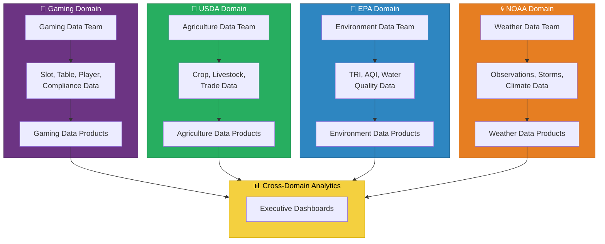

**Implementation in Fabric:**
- Each domain gets its own Fabric workspace
- Domain teams have Admin/Member roles in their workspace
- Domain teams choose their own ingestion patterns (pipelines, notebooks, dataflows)
- Domain teams are accountable for SLAs on their data products

### Principle 2: Data as a Product

Data is treated as a product with clear ownership, quality guarantees, documentation, and discoverability. Each domain publishes data products that other domains can consume.

| Data Product Attribute | Description | Fabric Implementation |
|-----------------------|-------------|----------------------|
| **Discoverable** | Easy to find in a catalog | Purview registration + OneLake data hub |
| **Addressable** | Unique, stable reference | OneLake path + workspace/item naming |
| **Trustworthy** | Quality guarantees and SLAs | Great Expectations + data quality monitors |
| **Self-Describing** | Schema and documentation | Delta table metadata + Purview glossary |
| **Interoperable** | Standard formats and contracts | Delta Lake format + schema contracts |
| **Secure** | Access controls and audit | Workspace roles + RLS + Purview policies |

### Principle 3: Self-Serve Data Platform

Fabric provides the self-serve infrastructure that enables domain teams to build, deploy, and manage data products without relying on a central platform team for every request.

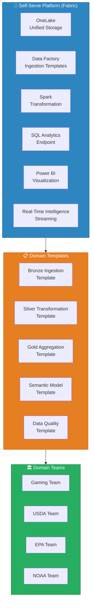

**Self-Serve Capabilities:**
- Workspace creation from templates (pre-configured lakehouses, pipelines, notebooks)
- Standardized medallion architecture notebooks available as shared libraries
- Data quality framework (Great Expectations) pre-configured with domain-specific rules
- CI/CD pipelines for workspace deployment via GitHub Actions
- Monitoring dashboards for data freshness, quality, and consumption

### Principle 4: Federated Computational Governance

Governance is a federation between a central governance team that defines standards and domain teams that implement them. Microsoft Purview serves as the federated governance platform.

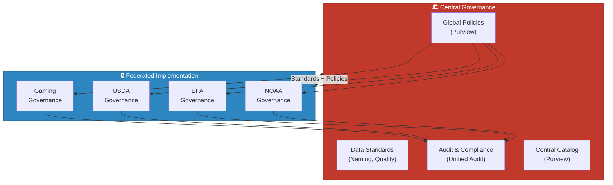

---

## 🏗️ Workspace Topology

### Multi-Domain Workspace Configuration

Each domain operates in its own Fabric workspace, with additional shared workspaces for governance and cross-domain analytics.

```
OneLake
├── ws-gaming-domain/              🎰 Casino/Gaming POC
│   ├── lh_bronze                  Raw slot, table, player, compliance data
│   ├── lh_silver                  Cleansed and validated gaming data
│   ├── lh_gold                    Business-ready aggregations and KPIs
│   ├── evh_operations             Real-time slot telemetry
│   ├── sm_gaming_operations       Semantic model for floor operations
│   ├── sm_gaming_compliance       Semantic model for compliance reporting
│   └── rpt_*                      Power BI reports
│
├── ws-usda-domain/                🌾 Agriculture
│   ├── lh_bronze                  Raw NASS, ERS, FAS data
│   ├── lh_silver                  Cleansed crop, livestock, trade data
│   ├── lh_gold                    Production rankings, yield analysis
│   ├── sm_usda_production         Semantic model for production analytics
│   └── rpt_*                      Power BI reports
│
├── ws-sba-domain/                 💼 Small Business Administration
│   ├── lh_bronze                  Raw 7(a), 504, PPP loan data
│   ├── lh_silver                  Cleansed loan and disaster data
│   ├── lh_gold                    Loan portfolio analytics
│   ├── sm_sba_lending             Semantic model for lending analytics
│   └── rpt_*                      Power BI reports
│
├── ws-noaa-domain/                🌀 Weather & Climate
│   ├── lh_bronze                  Raw observations, storms, alerts
│   ├── lh_silver                  Cleansed weather and climate data
│   ├── lh_gold                    Climate summaries, storm analytics
│   ├── evh_weather                Real-time weather observations
│   ├── sm_noaa_weather            Semantic model for weather analytics
│   └── rpt_*                      Power BI reports
│
├── ws-epa-domain/                 🌊 Environment
│   ├── lh_bronze                  Raw TRI, AQI, water quality data
│   ├── lh_silver                  Cleansed environmental data
│   ├── lh_gold                    Release rankings, compliance summaries
│   ├── evh_monitoring             Real-time AQI sensor data
│   ├── sm_epa_environment         Semantic model for environmental analytics
│   └── rpt_*                      Power BI reports
│
├── ws-doi-domain/                 🏔️ Natural Resources
│   ├── lh_bronze                  Raw earthquake, land, water data
│   ├── lh_silver                  Cleansed geological and resource data
│   ├── lh_gold                    Seismic analytics, land summaries
│   ├── evh_seismic                Real-time earthquake events
│   ├── sm_doi_resources           Semantic model for resource analytics
│   └── rpt_*                      Power BI reports
│
├── ws-dot-faa-domain/             ✈️ Transportation
│   ├── lh_bronze                  Raw flight, safety, infrastructure data
│   ├── lh_silver                  Cleansed transportation data
│   ├── lh_gold                    Delay analytics, safety metrics
│   ├── evh_flights                Real-time flight tracking
│   ├── sm_dot_transportation      Semantic model for transportation analytics
│   └── rpt_*                      Power BI reports
│
├── ws-tribal-health-domain/       🏥 Tribal Healthcare
│   ├── lh_bronze                  Raw IHS, patient, billing data
│   ├── lh_silver                  Cleansed healthcare data (PHI masked)
│   ├── lh_gold                    Population health, quality measures
│   ├── sm_tribal_health           Semantic model (HIPAA RLS enforced)
│   └── rpt_*                      Power BI reports
│
├── ws-governance/                 🛡️ Cross-Cutting Governance
│   ├── lh_data_quality            Quality metrics across all domains
│   ├── lh_audit_trail             Centralized audit and lineage data
│   ├── lh_metadata                Unified metadata catalog
│   ├── sm_governance              Governance monitoring semantic model
│   └── rpt_governance_dashboard   Data quality and governance reporting
│
└── ws-executive-analytics/        📊 Cross-Domain Executive Analytics
    ├── lh_gold_federated          Federated Gold tables from all domains
    ├── sm_executive               Unified executive semantic model
    ├── sm_cross_domain            Cross-domain analysis model
    └── rpt_executive_*            Executive dashboards and reports
```

### Workspace Architecture Diagram

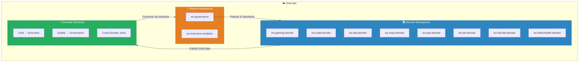

### Workspace Role Assignments

| Role | Domain Workspace | Governance Workspace | Executive Workspace |
|------|-----------------|---------------------|-------------------|
| **Admin** | Domain Lead | Governance Lead | Analytics Director |
| **Member** | Domain Engineers | Governance Analysts | Senior Analysts |
| **Contributor** | Domain Analysts | -- | Report Authors |
| **Viewer** | Business Users | Auditors | Executives |

> 📝 **Note**: Use Entra ID security groups for role assignments, not individual users. Example: `sg-fabric-usda-member`, `sg-fabric-gaming-admin`.

---

## 📦 Data Product Contracts

### Schema Versioning

Each data product publishes a schema contract that consumers can depend on. Schema changes follow semantic versioning:

```yaml
# data-product-contract.yaml
# Location: Each domain workspace root

product_name: "gold_slot_performance"
domain: "gaming"
owner: "gaming-data-team@org.com"
version: "2.1.0"
version_history:
  - version: "2.1.0"
    date: "2026-03-01"
    changes: "Added jackpot_count column"
    breaking: false
  - version: "2.0.0"
    date: "2026-01-15"
    changes: "Renamed revenue to hold_amount for clarity"
    breaking: true
  - version: "1.0.0"
    date: "2025-11-01"
    changes: "Initial release"
    breaking: false

schema:
  format: "delta"
  location: "ws-gaming-domain/lh_gold/Tables/gold_slot_performance"
  partition_columns: ["gaming_date"]
  columns:
    - name: "machine_id"
      type: "string"
      nullable: false
      description: "Unique slot machine identifier (SL-XXXX)"
      pii: false
    - name: "gaming_date"
      type: "date"
      nullable: false
      description: "Business day for this performance record"
      pii: false
    - name: "coin_in"
      type: "decimal(18,2)"
      nullable: false
      description: "Total dollars wagered"
      pii: false
    - name: "coin_out"
      type: "decimal(18,2)"
      nullable: false
      description: "Total dollars paid out"
      pii: false
    - name: "hold_amount"
      type: "decimal(18,2)"
      nullable: false
      description: "Net casino win (coin_in - coin_out)"
      pii: false
    - name: "hold_pct"
      type: "decimal(5,2)"
      nullable: false
      description: "Hold percentage: hold_amount / coin_in * 100"
      pii: false
    - name: "jackpot_count"
      type: "integer"
      nullable: true
      description: "Number of jackpot events (added v2.1.0)"
      pii: false
```

### SLA Definitions

Each data product declares its service-level agreements:

```yaml
# sla-definition.yaml

product_name: "gold_slot_performance"
domain: "gaming"

freshness:
  target: "4 hours"
  measurement: "Time since last successful refresh"
  schedule: "Daily at 04:00 ET"
  alert_threshold: "6 hours"
  escalation: "gaming-oncall@org.com"

quality:
  completeness:
    target: "99.5%"
    measurement: "% of non-null required columns"
  accuracy:
    target: "99.9%"
    measurement: "% of records passing validation rules"
  uniqueness:
    target: "100%"
    measurement: "No duplicate machine_id + gaming_date combinations"

availability:
  target: "99.9%"
  measurement: "Uptime of SQL analytics endpoint"
  maintenance_window: "Sundays 02:00-06:00 ET"

volume:
  expected_daily_rows: "50,000-100,000"
  alert_if_below: "10,000"
  alert_if_above: "500,000"
```

### Discoverability Metadata

Register all data products in Microsoft Purview for cross-domain discovery:

```json
{
    "purview_registration": {
        "collection": "Gaming Domain",
        "asset_type": "Delta Table",
        "qualified_name": "onelake://ws-gaming-domain/lh_gold/Tables/gold_slot_performance",
        "classifications": ["Gaming", "Financial", "Operational"],
        "glossary_terms": ["Slot Performance", "Hold Percentage", "Coin-In", "Revenue"],
        "contacts": {
            "owners": ["gaming-data-team@org.com"],
            "experts": ["slot-analytics@org.com"]
        },
        "description": "Daily aggregated slot machine performance metrics including financial, utilization, and maintenance indicators. Primary data product for gaming floor analytics.",
        "sensitivity_label": "Confidential",
        "certification_status": "Certified",
        "certified_by": "Data Governance Board",
        "certified_date": "2026-02-15"
    }
}
```

### Access Request Workflows

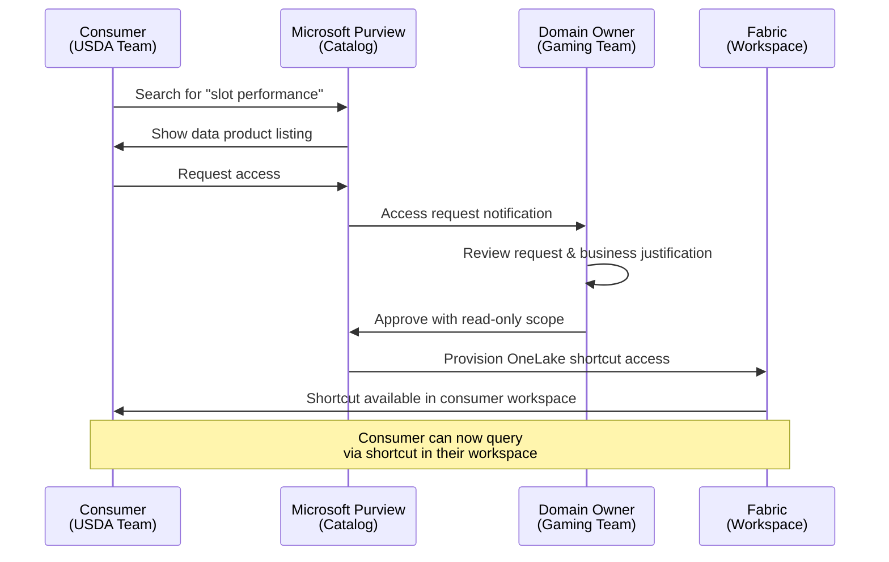

---

## 🔀 Cross-Domain Patterns

### OneLake Shortcuts for Cross-Workspace Access

OneLake shortcuts are the primary mechanism for cross-domain data access. They provide zero-copy references to data in other workspaces without duplicating storage.

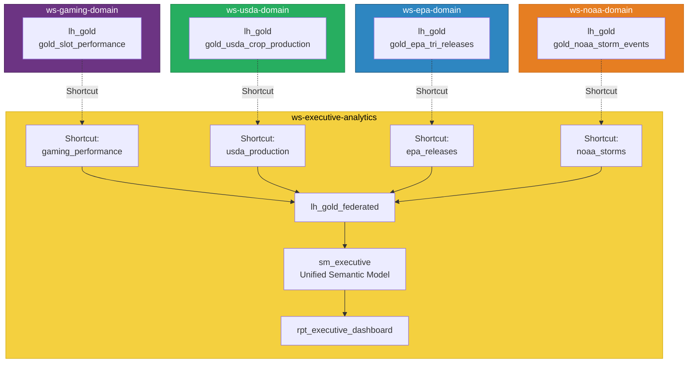

#### Creating Shortcuts

```python
# PySpark notebook in ws-executive-analytics
# Create shortcut to gaming Gold table

# Method 1: OneLake Shortcut via Lakehouse API
shortcut_config = {
    "name": "gaming_performance",
    "target": {
        "oneLake": {
            "workspaceId": "ws-gaming-domain-guid",
            "itemId": "lh_gold-guid",
            "path": "Tables/gold_slot_performance"
        }
    }
}

# Method 2: Read directly via OneLake path
df_gaming = spark.read.format("delta").load(
    "abfss://ws-gaming-domain@onelake.dfs.fabric.microsoft.com/lh_gold.Lakehouse/Tables/gold_slot_performance"
)

# Method 3: SQL via cross-workspace query (SQL analytics endpoint)
# SELECT * FROM [ws-gaming-domain].[lh_gold].[dbo].[gold_slot_performance]
```

### Shared Semantic Models

For cross-domain reporting, create composite semantic models in the executive workspace that reference multiple domain Gold tables:

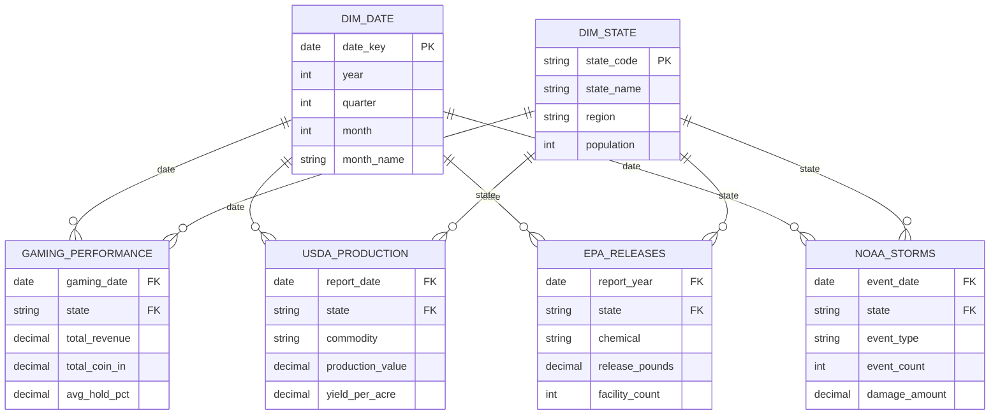

### Cross-Domain Gold Tables

Create federated Gold tables that combine data from multiple domains for executive-level insights:

```python
# Notebook: nb-gold-federated-state-summary
# Workspace: ws-executive-analytics

from pyspark.sql import functions as F

# Read domain Gold tables via shortcuts
df_gaming = spark.read.format("delta").load("Tables/gaming_performance")
df_usda = spark.read.format("delta").load("Tables/usda_production")
df_epa = spark.read.format("delta").load("Tables/epa_releases")
df_noaa = spark.read.format("delta").load("Tables/noaa_storms")

# Create cross-domain state summary
df_state_summary = (
    df_gaming
    .groupBy("state")
    .agg(
        F.sum("total_revenue").alias("gaming_revenue"),
        F.avg("avg_hold_pct").alias("avg_hold_pct")
    )
    .join(
        df_usda.groupBy("state")
        .agg(F.sum("production_value").alias("crop_production")),
        on="state", how="full_outer"
    )
    .join(
        df_epa.groupBy("state")
        .agg(F.sum("release_pounds").alias("toxic_releases")),
        on="state", how="full_outer"
    )
    .join(
        df_noaa.groupBy("state")
        .agg(
            F.count("*").alias("storm_events"),
            F.sum("damage_amount").alias("storm_damage")
        ),
        on="state", how="full_outer"
    )
)

# Write federated Gold table
df_state_summary.write.format("delta").mode("overwrite").save(
    "Tables/gold_federated_state_summary"
)
```

### Federated Queries

Domain teams can query other domains' published data products without leaving their workspace:

```sql
-- Query from ws-usda-domain, accessing gaming data via shortcut
-- Compare agricultural states with gaming revenue
SELECT
    u.state_name,
    u.commodity,
    u.production_value AS crop_production,
    g.total_revenue AS gaming_revenue,
    g.total_revenue / NULLIF(u.production_value, 0) AS gaming_to_crop_ratio
FROM silver_usda_crop_production u
LEFT JOIN gaming_performance g  -- OneLake shortcut
    ON u.state_name = g.state
WHERE u.commodity = 'CORN'
    AND u.year = 2025
ORDER BY u.production_value DESC;
```

---

## 📈 Large-Scale Enterprise Considerations

### Capacity Management Across Domains

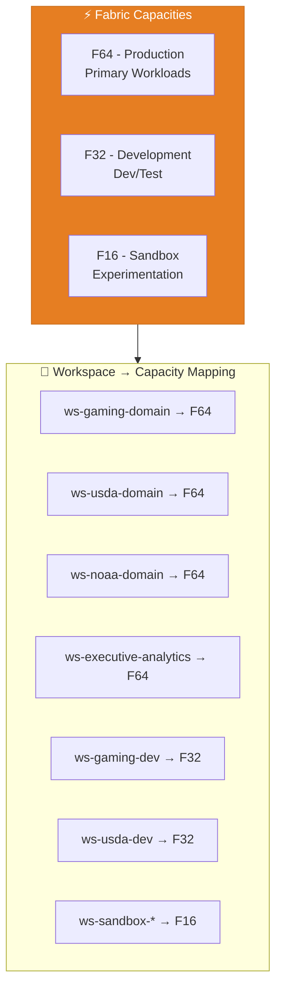

#### Capacity Sizing per Domain

| Domain | Workload Profile | Recommended Capacity | CU Allocation |
|--------|-----------------|---------------------|---------------|
| **Gaming** | Heavy streaming + BI + compliance | F64 (shared) | 25-30% |
| **USDA** | Batch-heavy, large datasets | F64 (shared) | 10-15% |
| **SBA** | Medium batch, loan analytics | F64 (shared) | 5-10% |
| **NOAA** | Streaming + batch + BI | F64 (shared) | 15-20% |
| **EPA** | Streaming sensors + batch | F64 (shared) | 10-15% |
| **DOI** | Event streaming + batch | F64 (shared) | 5-10% |
| **DOT/FAA** | Heavy streaming (flights) | F64 (shared) | 10-15% |
| **Tribal Healthcare** | Batch + BI (HIPAA) | F64 (shared) | 5-10% |
| **Governance** | Light monitoring + catalog | F64 (shared) | 2-5% |
| **Executive Analytics** | BI-heavy, cross-domain | F64 (shared) | 5-10% |

> 💡 **Tip**: For the POC, all workspaces share a single F64 capacity. In production, consider separate capacities for compliance-sensitive workloads (Tribal Healthcare, Gaming Compliance) to ensure isolation.

### Cost Allocation and Chargeback

Implement cost allocation by tracking CU consumption per workspace:

```kql
// Monitor CU consumption by workspace
FabricCapacityMetrics
| where Timestamp > ago(30d)
| summarize
    TotalCU = sum(CU_Consumed),
    AvgDailyCU = avg(CU_Consumed)
    by WorkspaceName, bin(Timestamp, 1d)
| summarize
    MonthlyTotalCU = sum(TotalCU),
    AvgDailyCU = avg(AvgDailyCU),
    PeakDailyCU = max(TotalCU)
    by WorkspaceName
| extend CostShare = round(todouble(MonthlyTotalCU) /
         toscalar(FabricCapacityMetrics
         | where Timestamp > ago(30d)
         | summarize sum(CU_Consumed)) * 100, 1)
| order by MonthlyTotalCU desc
```

**Chargeback Model:**

| Model | Description | Best For |
|-------|-------------|----------|
| **Equal Split** | Divide capacity cost equally among domains | Simplest, early adoption |
| **Proportional** | Allocate based on actual CU consumption | Mature organizations |
| **Tiered** | Base allocation + burst pricing | Balanced fairness and predictability |
| **Per-Domain Capacity** | Separate capacity per domain | Maximum isolation and accountability |

### Monitoring and Observability

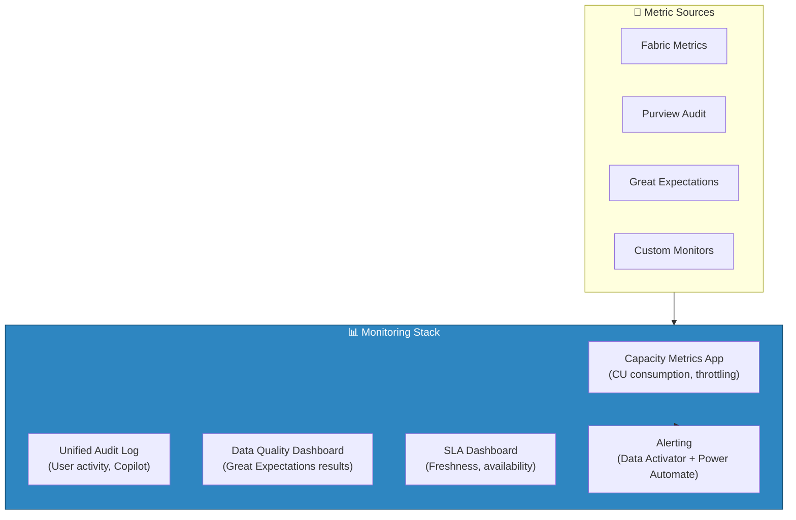

#### Key Monitoring Metrics

| Metric | Source | Alert Threshold |
|--------|--------|----------------|
| CU Utilization | Capacity Metrics App | >80% sustained for 30min |
| Throttling Events | Capacity Metrics App | Any throttling event |
| Data Freshness | Custom SLA monitor | Exceeds SLA target by 50% |
| Data Quality Score | Great Expectations | Below 95% for any product |
| Pipeline Failures | Data Factory | Any failure on production pipelines |
| Query Performance | Eventhouse/Warehouse | P95 latency > 10 seconds |
| Storage Growth | OneLake metrics | >10% unexpected growth |
| User Adoption | Audit Log | <50% active users in domain |

### Disaster Recovery

| Component | RPO | RTO | Strategy |
|-----------|-----|-----|----------|
| **OneLake Data** | Near-zero | 4 hours | Built-in geo-redundant storage |
| **Workspace Config** | 24 hours | 8 hours | GitHub IaC (Bicep templates) |
| **Semantic Models** | 24 hours | 4 hours | PBIX/TMDL in Git + auto-deploy |
| **Pipelines** | 24 hours | 4 hours | Pipeline definitions in Git |
| **Notebooks** | Near-zero | 1 hour | Git-integrated notebooks |
| **Eventhouse** | Minutes | 1 hour | Follower databases for read replicas |
| **Reports** | 24 hours | 2 hours | PBIP in Git + auto-deploy |

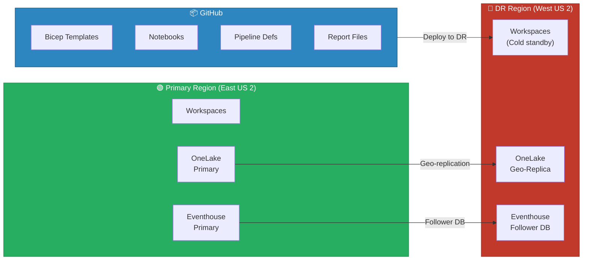

### Multi-Region Deployment

For federal workloads with data sovereignty requirements:

| Region | Workspaces | Capacity | Compliance |
|--------|-----------|----------|-----------|
| **East US 2** (Primary) | All production domains | F64 | FedRAMP Moderate |
| **West US 2** (DR) | Cold standby | F16 (scaled up during failover) | FedRAMP Moderate |
| **US Gov Virginia** | If GovCloud required | F64 | FedRAMP High, DoD IL4 |

---

## 🔄 Migration Path: Centralized to Mesh

### Phase 1: Foundation (Months 1-3)

Establish the workspace topology and governance framework without disrupting existing workloads.

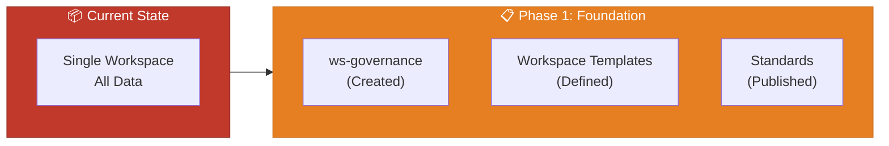

| Task | Deliverable |
|------|-------------|
| Define workspace naming standards | Naming convention document |
| Create ws-governance workspace | Governance workspace operational |
| Define data product contract template | Contract YAML template |
| Set up Purview collection structure | Collections per domain |
| Create medallion architecture templates | Notebook templates for Bronze/Silver/Gold |
| Establish data quality framework | Great Expectations configuration |
| Define SLA templates per tier | SLA definition templates |

### Phase 2: Domain Separation (Months 3-6)

Create domain workspaces and begin migrating data ownership from the central workspace.

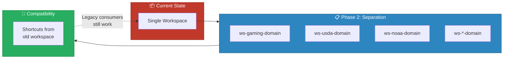

| Task | Deliverable |
|------|-------------|
| Create domain workspaces from templates | 8 domain workspaces |
| Migrate Bronze/Silver/Gold tables per domain | Data migrated with zero downtime |
| Create backward-compatible shortcuts | Legacy consumers unaffected |
| Assign domain teams to workspace roles | RBAC configured |
| Register data products in Purview | All Gold tables cataloged |
| Set up domain-level CI/CD pipelines | GitHub Actions per domain |

### Phase 3: Full Mesh (Months 6-12)

Complete the transition to full mesh architecture with cross-domain analytics and federated governance.

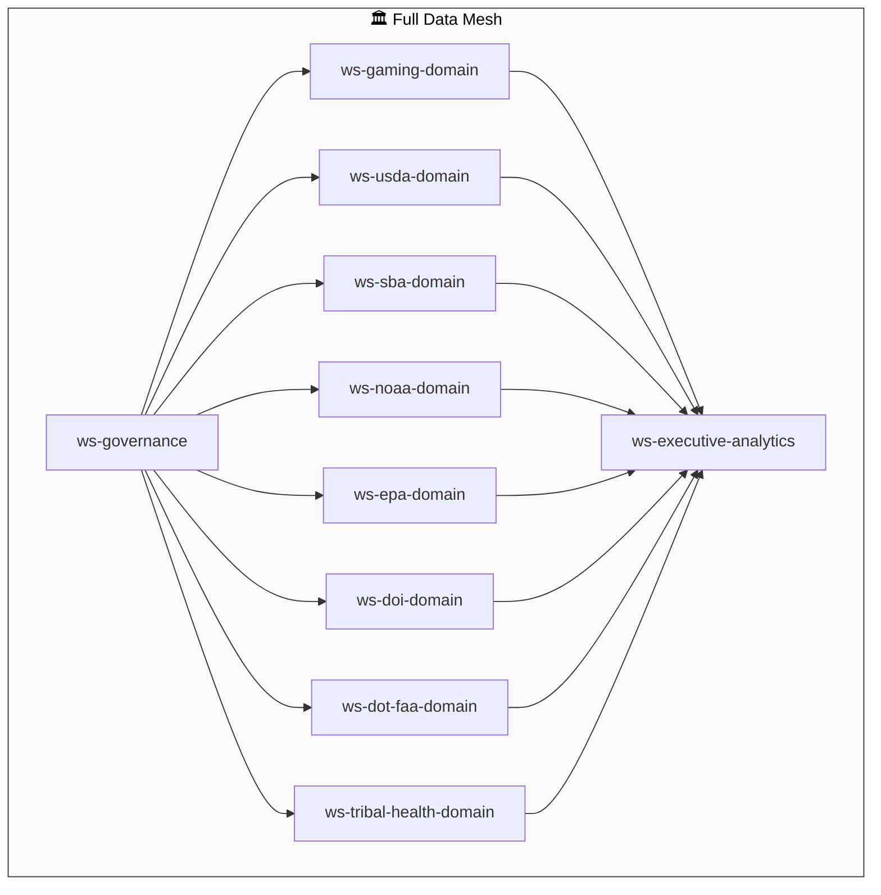

| Task | Deliverable |
|------|-------------|
| Decommission centralized workspace | All data in domain workspaces |
| Set up executive analytics workspace | Cross-domain dashboards live |
| Implement cross-domain shortcuts | All approved data sharing via shortcuts |
| Complete Purview governance policies | Automated classification and labeling |
| Domain teams fully autonomous | Each domain independently operated |
| Establish mesh review cadence | Monthly governance review meetings |

---

## 🛡️ Governance at Scale

### Purview Policies Across Workspaces

Microsoft Purview provides centralized policy management that applies across all Fabric workspaces:

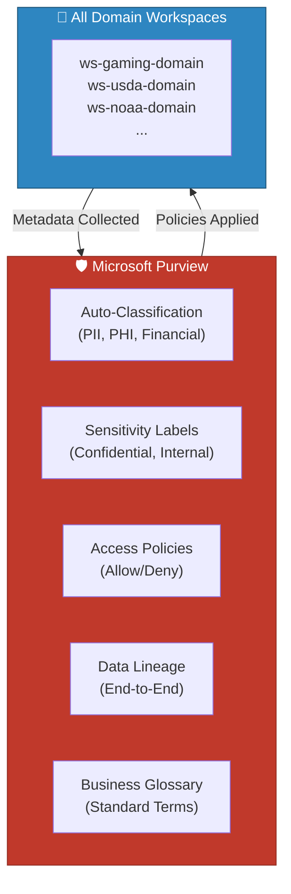

#### Classification Policies

| Classification | Description | Auto-Applied To |
|---------------|-------------|----------------|
| **PII** | Personally Identifiable Information | SSN, Names, Addresses |
| **PHI** | Protected Health Information | Tribal Healthcare data |
| **Financial** | Financial transaction data | Gaming revenue, SBA loans |
| **Compliance** | Regulatory reporting data | CTR, SAR, W-2G |
| **Public** | Publicly available data | USDA NASS, NOAA weather, EPA TRI |
| **Government** | Government-sensitive data | DOT/FAA operational data |

#### Sensitivity Labels

| Label | Scope | Enforcement |
|-------|-------|------------|
| **Public** | USDA production stats, NOAA weather | No restrictions |
| **Internal** | Operational metrics, performance data | Organization only |
| **Confidential** | Financial data, compliance reports | Restricted + encrypted |
| **Highly Confidential** | PII, PHI, SSN, card numbers | Strict access + audit |

### Centralized vs. Federated Data Stewardship

| Responsibility | Central Governance Team | Domain Data Steward |
|---------------|----------------------|-------------------|
| **Standards Definition** | Define naming, quality, security standards | Implement standards in domain |
| **Policy Creation** | Create Purview policies and classifications | Apply policies to domain assets |
| **Quality Framework** | Define quality metrics and thresholds | Monitor and remediate domain quality |
| **Audit** | Conduct cross-domain audits | Provide domain audit evidence |
| **Catalog Management** | Maintain Purview structure and glossary | Register and document domain products |
| **Access Governance** | Define access request workflow | Approve domain-level access requests |
| **Compliance** | Define regulatory requirements | Implement compliance controls in domain |
| **Training** | Develop governance training materials | Train domain team members |

### Quality Gates and Data Certification

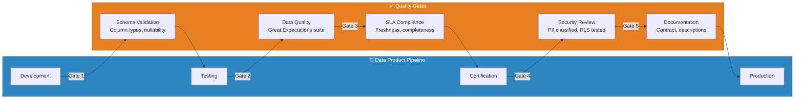

#### Certification Levels

| Level | Requirements | Badge | Recertification |
|-------|-------------|-------|-----------------|
| **Bronze** | Schema valid, basic quality checks pass |  | Quarterly |
| **Silver** | Bronze + SLA defined + documentation complete |  | Quarterly |
| **Gold** | Silver + >99% quality + security review + consumer tested |  | Monthly |

#### Great Expectations Quality Checks

```python
# Domain-level data quality suite
# Location: validation/great_expectations/suites/

# Gaming domain quality suite
gaming_suite = {
    "suite_name": "gold_slot_performance_quality",
    "expectations": [
        {
            "type": "expect_column_values_to_not_be_null",
            "kwargs": {"column": "machine_id"}
        },
        {
            "type": "expect_column_values_to_be_between",
            "kwargs": {"column": "hold_pct", "min_value": 0, "max_value": 100}
        },
        {
            "type": "expect_column_pair_values_a_to_be_greater_than_b",
            "kwargs": {"column_A": "coin_in", "column_B": "coin_out", "or_equal": True}
        },
        {
            "type": "expect_compound_columns_to_be_unique",
            "kwargs": {"column_list": ["machine_id", "gaming_date"]}
        },
        {
            "type": "expect_table_row_count_to_be_between",
            "kwargs": {"min_value": 10000, "max_value": 500000}
        }
    ]
}
```

### Governance Monitoring Dashboard

The ws-governance workspace contains a monitoring dashboard that tracks governance health across all domains:

```
┌──────────────────────────────────────────────────────────┐
│  🛡️ Data Governance Health Dashboard                     │
├──────────────┬──────────────┬──────────────┬─────────────┤
│  Domains     │  Products    │  Certified   │  Quality    │
│  10 Active   │  47 Total    │  38 (81%)    │  97.2% Avg  │
├──────────────┴──────────────┴──────────────┴─────────────┤
│  📊 Data Product Quality by Domain                       │
│  ═══════════════════════════════════════════              │
│  Gaming    ████████████████████░ 98.5%                    │
│  USDA      ███████████████████░░ 96.8%                    │
│  NOAA      ████████████████████░ 97.9%                    │
│  EPA       █████████████████████ 99.1%                    │
│  SBA       ████████████████░░░░░ 93.2%  ⚠️               │
│  DOI       ███████████████████░░ 96.4%                    │
│  DOT/FAA   ██████████████████░░░ 95.7%                    │
│  Tribal HC ████████████████████░ 98.0%                    │
├──────────────────────────────┬────────────────────────────┤
│  ⏰ SLA Compliance           │  🔐 Security Posture       │
│  On-Time: 94%                │  PII Classified: 100%      │
│  Breached: 3 products        │  RLS Enforced: 100%        │
│  At Risk: 5 products         │  Labels Applied: 97%       │
└──────────────────────────────┴────────────────────────────┘
```

---

## 📐 Reference Architecture

### Complete Data Mesh Reference Architecture

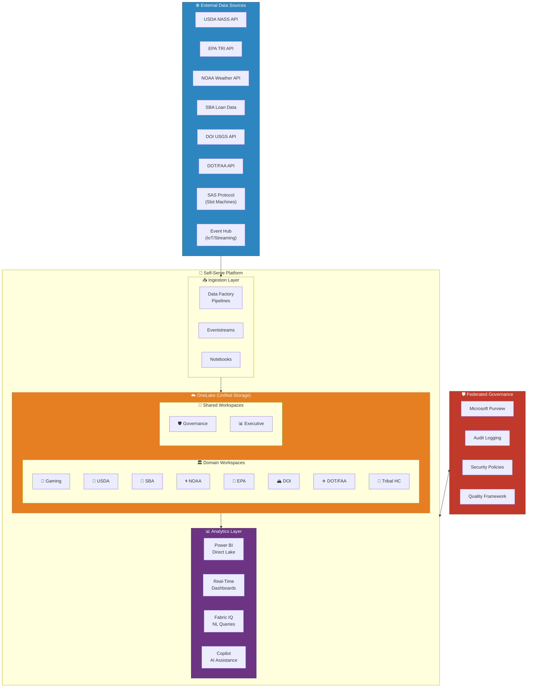

### Domain Data Flow Pattern

Each domain follows a standardized data flow pattern within its workspace:

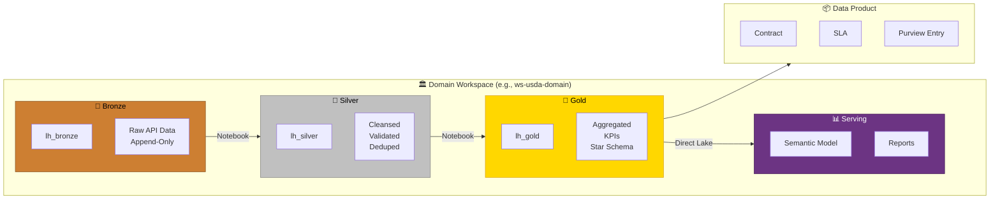

### Network and Security Architecture

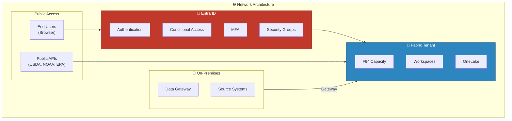

---

## 📚 References

| Resource | URL |
|----------|-----|
| Data Mesh Principles (Zhamak Dehghani) | https://www.datamesh-architecture.com/ |
| Microsoft Fabric Governance | https://learn.microsoft.com/fabric/governance/governance-compliance-overview |
| OneLake Shortcuts | https://learn.microsoft.com/fabric/onelake/onelake-shortcuts |
| Purview with Fabric | https://learn.microsoft.com/fabric/governance/use-microsoft-purview-hub |
| Workspace Roles | https://learn.microsoft.com/fabric/fundamentals/roles-workspaces |
| Capacity Management | https://learn.microsoft.com/fabric/enterprise/licenses |
| Disaster Recovery in Fabric | https://learn.microsoft.com/fabric/security/security-overview |
| Data Mesh on Azure (Microsoft) | https://learn.microsoft.com/azure/cloud-adoption-framework/scenarios/cloud-scale-analytics/architectures/what-is-data-mesh |

---

## 🔗 Related Documents

- [Fabric IQ](fabric-iq.md) -- Natural language analytics across domains
- [Real-Time Intelligence](real-time-intelligence.md) -- Streaming architecture patterns
- [AI Copilot Configuration](ai-copilot-configuration.md) -- Copilot governance across domains
- [Architecture](../ARCHITECTURE.md) -- System architecture overview
- [Security](../SECURITY.md) -- Security and compliance framework
- [Best Practices: Workspaces & Naming](../best-practices/01_WORKSPACES_NAMING.md) -- Naming conventions

---

> 📝 **Document Metadata**
> - **Author**: Documentation Team
> - **Reviewers**: Enterprise Architecture, Data Governance, Security, Domain Leads
> - **Classification**: Internal
> - **Next Review**: 2026-06-12
