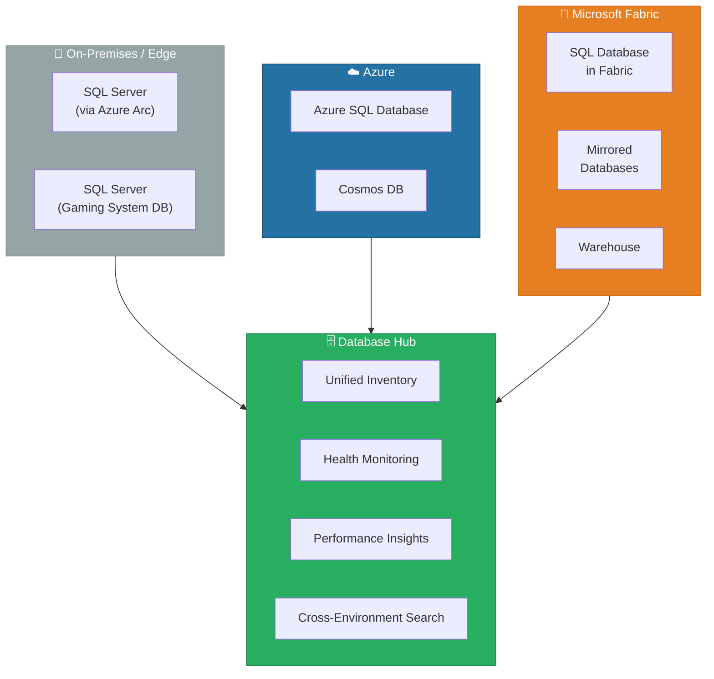
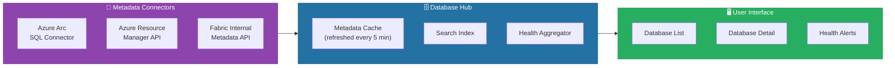

[Home](../index.md) > [Docs](../) > [Features](./) > Database Hub

# 🗄️ Database Hub — Unified Database Management

<div align="center" markdown>

**Single Pane of Glass for Databases Across Edge, Cloud, and Fabric**


</div>

---

**Last Updated:** `2026-04-22` | **Version:** 1.0.0

---

> ⚠️ **Early Access Notice**: Database Hub is currently in **Early Access** (announced March 2026). Features, UI, and capabilities may change significantly before general availability. Do not use for production-critical workflows. Early Access requires opt-in via Fabric Admin portal.

---

## 📑 Table of Contents

- [🎯 Overview](#-overview)
- [🏗️ Architecture Overview](#️-architecture-overview)
- [⚙️ Setup and Configuration](#️-setup-and-configuration)
- [📊 Core Capabilities](#-core-capabilities)
- [🎰 Casino Use Case](#-casino-use-case)
- [🏛️ Federal Use Case](#️-federal-use-case)
- [🔌 Integration Points](#-integration-points)
- [⚡ Performance and Health Monitoring](#-performance-and-health-monitoring)
- [⚠️ Limitations and Early Access Status](#️-limitations-and-early-access-status)
- [📚 References](#-references)

---

## 🎯 Overview

Database Hub is a unified management experience in Microsoft Fabric that provides a **single pane of glass** for discovering, monitoring, and managing databases across edge, cloud, and Fabric environments. Instead of switching between Azure Portal, SQL Server Management Studio, and the Fabric Portal to manage different database assets, Database Hub brings all database inventory into one centralized view.

Database Hub aggregates metadata from:

- **SQL Database in Fabric** -- Native Fabric SQL databases
- **Mirrored Databases** -- Real-time replicas of Azure SQL, Cosmos DB, Snowflake, and others
- **Azure SQL Database** -- Cloud SQL databases linked via Azure Resource Manager
- **SQL Server (on-premises/VM)** -- Edge databases registered through Azure Arc
- **Warehouses** -- Fabric Warehouse items

### Key Capabilities

| Capability | Description |
|-----------|-------------|
| **Unified Discovery** | Browse all database assets in one inventory view regardless of hosting location |
| **Health Dashboard** | At-a-glance health status, DTU/vCore utilization, storage consumption |
| **Performance Insights** | Query performance metrics, slow query identification, index recommendations |
| **Cross-Environment Search** | Search for databases, tables, or columns across all registered environments |
| **Connection Strings** | One-click copy of connection strings for any registered database |
| **Lineage View** | See how databases connect to downstream Fabric items (Lakehouses, Warehouses, Reports) |
| **Mirroring Status** | Monitor real-time mirroring lag and replication health for Mirrored Databases |

### Where Database Hub Fits



---

## 🏗️ Architecture Overview

Database Hub operates as a **metadata aggregation layer**. It does not store or replicate data -- it connects to existing database management APIs to gather metadata, health metrics, and performance telemetry.



---

## ⚙️ Setup and Configuration

### Prerequisites

> ⚠️ **Early Access**: Enable Database Hub via Fabric Admin Portal → Preview Features → Database Hub

1. **Fabric capacity**: F64 or higher SKU
2. **Admin permissions**: Fabric Administrator or Workspace Administrator role
3. **Azure Arc** (optional): For on-premises SQL Server registration
4. **Network connectivity**: Hub must reach Azure Resource Manager APIs

### Step 1: Enable Database Hub (Early Access)

```
Fabric Admin Portal → Tenant Settings → Preview Features
  → Database Hub (Early Access): Enable
  → Allowed Security Groups: [Select groups with access]
```

### Step 2: Register Database Sources

#### Fabric-Native Databases (Automatic)

SQL Database in Fabric, Mirrored Databases, and Warehouses appear automatically in Database Hub once the feature is enabled. No additional registration is needed.

#### Azure SQL Databases

```
Database Hub → + Register Database → Azure SQL Database
  Subscription: [Select Azure subscription]
  Resource Group: [Select resource group]
  Server: [Select Azure SQL Server]
  Databases: [Select one or more databases]
  Authentication: Entra ID (recommended) or SQL Authentication
```

#### On-Premises SQL Server (via Azure Arc)

```
Database Hub → + Register Database → SQL Server (Arc)
  Arc Resource: [Select Arc-enabled SQL Server]
  Instance: [Select instance]
  Databases: [Select databases to register]
  Connectivity: Azure Arc agent (outbound HTTPS 443)
```

### Step 3: Configure Health Alerts

```
Database Hub → Settings → Health Alerts
  CPU Threshold: 80% (warning), 95% (critical)
  Storage Threshold: 85% (warning), 95% (critical)
  Mirroring Lag: 5 minutes (warning), 15 minutes (critical)
  Notification: Email / Teams channel / Data Activator
```

---

## 📊 Core Capabilities

### Unified Database Inventory

The inventory view shows all registered databases in a sortable, filterable table:

| Column | Description |
|--------|-------------|
| **Name** | Database name |
| **Type** | SQL Database in Fabric, Mirrored, Azure SQL, Arc SQL Server, Warehouse |
| **Location** | Fabric workspace, Azure region, or on-premises server |
| **Status** | Online, Offline, Degraded, Mirroring |
| **Size** | Storage consumption |
| **Last Activity** | Timestamp of last query execution |
| **Owner** | Workspace or resource owner |

### Cross-Environment Search

Search for a table or column name across all registered databases:

```
Database Hub → Search: "player_transactions"

Results:
  ✅ lh_bronze.bronze_player_transactions (SQL Database in Fabric, ws-gaming)
  ✅ casino_ops.dbo.PlayerTransactions (Azure SQL, eastus2)
  ✅ mirror_casino_ops.PlayerTransactions (Mirrored DB, ws-gaming)
  ✅ gaming_dw.dbo.fact_player_transactions (Arc SQL Server, on-prem-01)
```

### Connection String Manager

One-click connection string generation for any registered database:

```
Database Hub → [Select Database] → Connect
  ADO.NET: Server=tcp:xxxxx.database.fabric.microsoft.com,1433;...
  JDBC: jdbc:sqlserver://xxxxx.database.fabric.microsoft.com:1433;...
  ODBC: Driver={ODBC Driver 18 for SQL Server};Server=...
  Python (pyodbc): connection_string = "DRIVER={ODBC Driver 18}..."
```

---

## 🎰 Casino Use Case

### Unified View of Gaming System Databases

A casino operation typically runs multiple database systems:

| Database | Type | Location | Purpose |
|----------|------|----------|---------|
| `casino_ops` | Azure SQL | Azure East US 2 | Primary OLTP gaming system |
| `slot_telemetry_raw` | SQL Server | On-premises (via Arc) | Edge slot machine telemetry collector |
| `mirror_casino_ops` | Mirrored Database | Fabric ws-gaming | Real-time mirror for analytics |
| `lh_bronze` | SQL Database in Fabric | Fabric ws-gaming | Bronze layer Lakehouse |
| `gaming_dw` | Warehouse | Fabric ws-gaming | Gold layer data warehouse |

Without Database Hub, the DBA must check Azure Portal for `casino_ops`, SSMS for the on-premises server, and Fabric Portal for the mirror and Lakehouse. With Database Hub, all five databases appear in one view with health status, storage, and performance metrics side by side.

### Mirroring Lag Monitoring

Database Hub surfaces mirroring health for the `mirror_casino_ops` Mirrored Database:

```
Database Hub → mirror_casino_ops → Mirroring Status
  Replication Lag: 12 seconds ✅
  Tables Mirrored: 47 / 47
  Last Sync: 2026-04-22T14:30:12Z
  Throughput: 2,450 rows/sec
  Status: Healthy
```

If mirroring lag exceeds the configured threshold (e.g., 5 minutes), Database Hub triggers a health alert -- critical for compliance workflows where near-real-time data is required for CTR/SAR monitoring.

---

## 🏛️ Federal Use Case

### Multi-Agency Database Inventory

Federal organizations managing data across multiple agencies can use Database Hub to maintain a centralized catalog:

| Database | Agency | Type | Location | Classification |
|----------|--------|------|----------|---------------|
| `usda_crop_production` | USDA | Mirrored Database | Fabric ws-usda | Official Use Only |
| `sba_loan_programs` | SBA | SQL Database in Fabric | Fabric ws-sba | CUI |
| `noaa_weather_obs` | NOAA | Azure SQL | Azure East US | Public |
| `epa_tri_releases` | EPA | Mirrored Database | Fabric ws-epa | Official Use Only |
| `doi_earthquake_events` | DOI | SQL Database in Fabric | Fabric ws-doi | Public |
| `legacy_grants_db` | SBA | SQL Server (Arc) | On-premises DC | CUI |

### Cross-Agency Data Discovery

A federal data analyst searching for "loan" across all registered databases:

```
Database Hub → Search: "loan"

Results:
  ✅ sba_loan_programs.dbo.ppp_loans (SQL Database in Fabric, ws-sba) [CUI]
  ✅ sba_loan_programs.dbo.loan_disbursements (SQL Database in Fabric, ws-sba) [CUI]
  ✅ legacy_grants_db.dbo.SBA_Loans_Archive (Arc SQL Server, dc-east) [CUI]
  ⛔ Access Denied: usda_loan_guarantees (Mirrored DB, ws-usda) [insufficient permissions]
```

> The search respects sensitivity labels and Purview policies -- the analyst sees results from databases they have access to, while restricted databases show an access-denied indicator.

### FISMA Compliance Dashboard

Database Hub provides a compliance-oriented view showing database health aligned with FISMA controls:

| FISMA Control | Database Hub Feature | Status |
|--------------|---------------------|--------|
| **AC-2 (Account Management)** | Database owner and access role visibility | ✅ Visible |
| **AU-6 (Audit Review)** | Last activity timestamps, query audit trail | ✅ Enabled |
| **CM-8 (Information System Inventory)** | Complete database asset inventory | ✅ Registered |
| **CP-9 (System Backup)** | Backup status and recovery point | ✅ Monitored |
| **SI-4 (System Monitoring)** | Health alerts and performance monitoring | ✅ Active |

---

## 🔌 Integration Points

| Integration | How | Use Case |
|------------|-----|----------|
| **Mirroring** | Database Hub monitors Mirrored Database replication health | Ensure analytics data freshness |
| **OneLake Catalog** | Databases registered in Hub appear in OneLake Catalog searches | Unified data discovery |
| **Data Activator** | Health alerts trigger Data Activator actions | Automated incident response |
| **Purview** | Sensitivity labels from Purview surface in Database Hub inventory | Governance visibility |
| **Fabric MCP** | AI agents discover databases through MCP `discover_items` | Agent-driven database queries |

---

## ⚡ Performance and Health Monitoring

Database Hub aggregates performance metrics from all registered databases:

| Metric | SQL Database in Fabric | Azure SQL | Arc SQL Server | Mirrored DB |
|--------|----------------------|-----------|----------------|-------------|
| **CPU Utilization** | ✅ | ✅ | ✅ | N/A |
| **Storage Used** | ✅ | ✅ | ✅ | ✅ |
| **Active Connections** | ✅ | ✅ | ✅ | N/A |
| **Query Performance** | ✅ | ✅ | ✅ (limited) | N/A |
| **Mirroring Lag** | N/A | N/A | N/A | ✅ |
| **Backup Status** | ✅ (automatic) | ✅ | ✅ | N/A |
| **Index Recommendations** | ✅ | ✅ | ❌ | N/A |

---

## ⚠️ Limitations and Early Access Status

> ⚠️ **Early Access Disclaimer**: Database Hub is in Early Access. The following limitations are expected to evolve before GA.

| Limitation | Details | Expected Resolution |
|-----------|---------|-------------------|
| **Early Access** | Feature requires opt-in; not covered by production SLAs | GA expected H2 2026 |
| **Read-Only Management** | Cannot create, alter, or drop databases from Database Hub | Post-GA enhancement |
| **Limited Arc Support** | Only SQL Server 2019+ supported via Azure Arc | Broader version support at GA |
| **No Cross-Tenant** | Cannot register databases from other Entra ID tenants | Post-GA with B2B trust |
| **Metadata Refresh** | 5-minute refresh interval for health metrics; not real-time | Configurable intervals at GA |
| **No Cost Tracking** | Database Hub does not surface cost or billing information | Integration with Capacity Metrics planned |
| **UI Only** | No REST API or programmatic access to Database Hub features | API expected at GA |
| **Region Availability** | Available in commercial Azure regions only; no Gov Cloud | Gov Cloud support post-GA |
| **Max Registrations** | 500 databases per tenant during Early Access | Limit increase at GA |

---

## 📚 References

| Resource | URL |
|----------|-----|
| Database Hub Overview | https://learn.microsoft.com/fabric/database/database-hub-overview |
| SQL Database in Fabric | https://learn.microsoft.com/fabric/database/sql/overview |
| Mirrored Databases | https://learn.microsoft.com/fabric/database/mirrored-database/overview |
| Azure Arc-enabled SQL Server | https://learn.microsoft.com/azure/azure-arc/data-services/overview |
| Fabric Admin Portal Settings | https://learn.microsoft.com/fabric/admin/tenant-settings-index |
| OneLake Catalog | https://learn.microsoft.com/fabric/governance/use-microsoft-purview-hub |

---

## 🔗 Related Documents

- [Fabric SQL Database](fabric-sql-database.md) -- Native SQL databases managed through Database Hub
- [Mirroring](mirroring.md) -- Real-time database mirroring monitored by Database Hub
- [OneLake Catalog](onelake-catalog.md) -- Data discovery that complements Database Hub
- [Workspace Monitoring](workspace-monitoring.md) -- Workspace-level monitoring alongside database monitoring
- [Identity & RBAC Patterns](../best-practices/identity-rbac-patterns.md) -- Access control for database assets
- [Architecture](../ARCHITECTURE.md) -- System architecture overview

---

> 📝 **Document Metadata**
> - **Author**: Documentation Team
> - **Reviewers**: Data Engineering, Database Administration, Federal Operations, Security
> - **Classification**: Internal
> - **Next Review**: 2026-07-22
