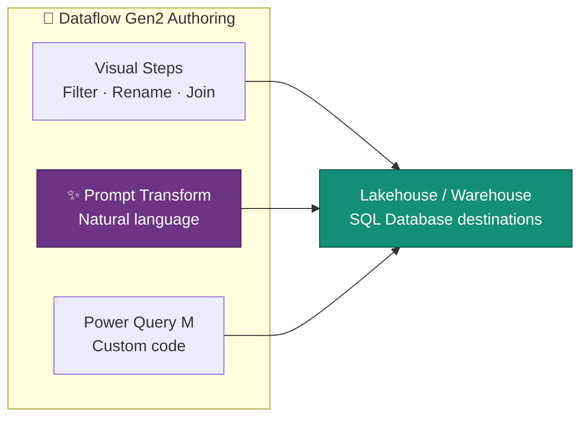

# ✨ AI-Powered Prompt Transform — Natural-Language Transformations in Dataflow Gen2

**Enrich and Transform Data with Plain-English Prompts — No ML Models to Build or Manage**

---

**Last Updated:** `2026-08-22` | **Version:** 1.0.0

---

## 🎯 Overview

The **AI-Powered Prompt Transform** (Generally Available March 2026) integrates generative AI directly into Dataflow Gen2's low-code authoring experience. Authors describe a transformation in natural language — "standardize the state column to two-letter codes", "extract the product category from the description", "mask the SSN column" — and the transform generates and applies the logic, without building or managing machine learning models.

AI operations are accounted against an **explicit AI meter**, so consumption is visible and attributable in capacity reporting rather than hidden in general compute.

### Where It Fits

| Approach | Best For |
|----------|----------|
| **Visual steps** | Deterministic, well-understood transforms |
| **Prompt Transform** | Fuzzy, semantic, or pattern-based logic (standardization, extraction, classification, enrichment) |
| **Custom M** | Precise logic the visual editor can't express and AI shouldn't guess |

---

## 🧪 Example Prompts

| Prompt | Generated Behavior |
|--------|--------------------|
| "Standardize `state` to uppercase two-letter codes" | Maps "California", "calif.", "CA" → `CA` |
| "Extract the game type from `machine_name`" | Parses "SLOT-WHEEL-042" → `WHEEL` |
| "Classify `complaint_text` sentiment as Positive, Neutral, or Negative" | Adds a sentiment column |
| "Mask all but the last four digits of `card_number`" | `****-****-****-1234` |
| "Flag rows where `cash_in` is between 8000 and 9900 as `structuring_review`" | Adds a boolean flag column (SAR-pattern screening) |

!!! tip "Review the applied steps"
    The Prompt Transform generates real transformation steps. Always review the **Applied steps** list and spot-check output before publishing — AI-generated logic can surprise you on edge cases.

---

## 🎰 Casino POC Use Cases

1. **Player complaint triage** — classify free-text complaints by category and sentiment during Bronze→Silver cleansing, routing regulatory-relevant ones for review.
2. **Structuring pre-screen** — flag sub-threshold cash transaction patterns ($8K–$9.9K band) as a data-quality annotation before the SAR rules engine runs.
3. **Address standardization** — normalize patron addresses from legacy systems during migration dataflows.
4. **Game-name normalization** — map inconsistent vendor machine names to the canonical game dimension.

For heavier, governed AI enrichment at scale, see the AI Functions compliance notebook pattern (`notebooks/gold/17_gold_ai_functions_compliance.py`) — Prompt Transform is the low-code entry point; AI Functions in notebooks are the code-first equivalent.

---

## 💰 Capacity & Metering

- Prompt Transform operations bill against an **explicit AI meter** — visible in the Capacity Metrics app as a distinct operation class.
- Cost scales with rows processed and prompt complexity; prototype on a sample query before running against full tables.
- For high-volume, repeatable enrichment, compare against running the same logic once in Spark and persisting the result — AI per-row billing adds up on large fact tables.

---

## ⚠️ Considerations

| Consideration | Detail |
|---------------|--------|
| **Non-determinism** | AI-generated results can vary run-to-run; persist outputs to a destination rather than re-running against live sources |
| **Data processed by AI service** | Prompt content and row values are processed by the AI service — confirm this fits your data-classification policy (see [Outbound Access Protection](../best-practices/outbound-access-protection.md)) |
| **Review before production** | Treat generated steps like any code change: review, test on samples, then promote via [CI/CD](../best-practices/fabric-cicd-deployment.md) |
| **PII** | Mask or exclude PII columns from prompts where possible; see the POC's PII hashing conventions |

---

## 🔗 Related Documents

- [Dataflow Gen2](dataflow-gen2.md) — The low-code ETL engine hosting the Prompt Transform
- [AI Copilot Configuration](ai-copilot-configuration.md) — Tenant/capacity settings for AI features
- [Prompt Engineering for Fabric](prompt-engineering-fabric.md) — Writing effective prompts for Fabric AI surfaces
- [Copy Job CDC](copy-job-cdc.md) — Managed incremental ingestion feeding your dataflows
- [Capacity Planning & Cost Optimization](../best-practices/capacity-planning-cost-optimization.md) — AI meter consumption in capacity reporting

---

> 📝 **Document Metadata**
> - **Author**: Documentation Team
> - **Reviewers**: Data Engineering, Data Factory
> - **Classification**: Internal
> - **Next Review**: 2026-11-22
