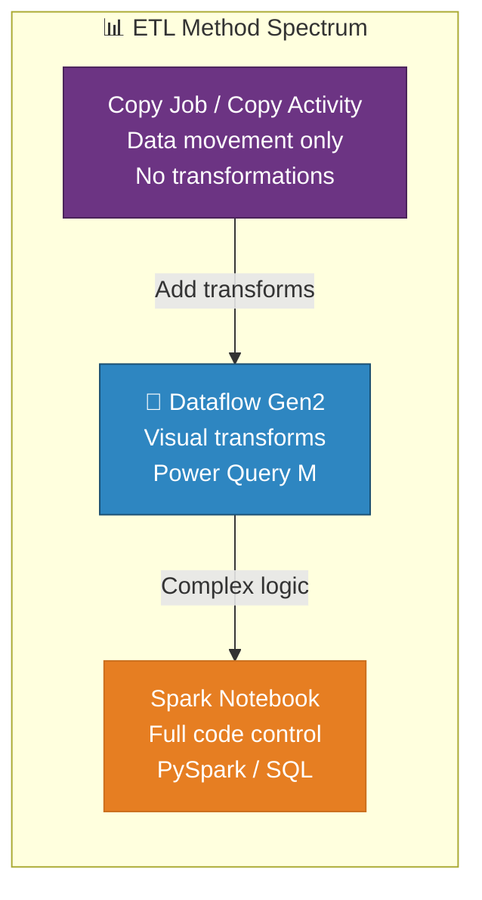
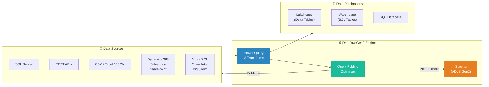
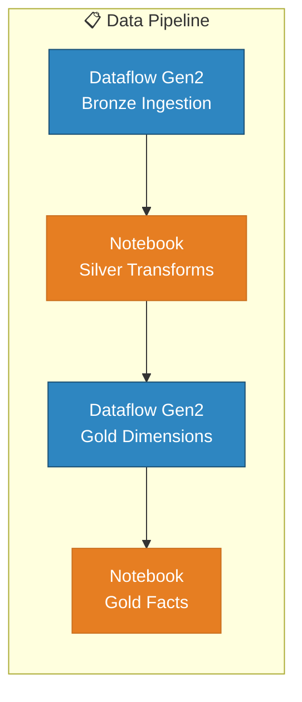

# 🔄 Dataflow Gen2 — Low-Code ETL with Power Query

<div align="center" markdown>

**Visual Data Transformation for Microsoft Fabric**


</div>

---

**Last Updated:** `2026-04-21` | **Version:** 1.0.0

---

## 🎯 Overview

Dataflow Gen2 is Microsoft Fabric's **low-code, visual ETL engine** built on Power Query Online. It lets analysts and engineers author data transformations using the same Power Query M language familiar from Power BI Desktop and Excel — but with enterprise-grade execution, direct output to Fabric destinations (Lakehouse, Warehouse, SQL Database), and integration with Data Factory pipelines.

Dataflow Gen2 fills the gap between ad-hoc Power BI data prep and full Spark notebooks. When your transformation logic involves filtering, renaming, type conversion, pivoting, and joining — without the complexity that warrants PySpark — Dataflow Gen2 is the right choice.

### Where Dataflow Gen2 Fits



### Key Capabilities

| Capability | Description |
|-----------|-------------|
| **300+ Connectors** | Connect to databases, files, APIs, SaaS apps, and cloud services |
| **Power Query M Language** | Familiar M syntax with 700+ built-in functions |
| **Query Folding** | Push transformations back to the data source for optimal performance |
| **Staging** | Optional ADLS staging for large datasets that exceed direct query limits |
| **Data Destinations** | Write directly to Lakehouse tables, Warehouse tables, or SQL Database tables |
| **Parameterization** | Dynamic parameters for reusable, configurable dataflows |
| **Fast Copy** | High-throughput copy mode for simple move-and-load scenarios |
| **Pipeline Integration** | Embed dataflows in Data Factory pipelines for orchestration |
| **Incremental Refresh** | Built-in incremental refresh for partitioned date-based loads |

### Dataflow Gen2 vs. Alternatives

| Feature | Dataflow Gen2 | Spark Notebook | Copy Activity | Copy Job |
|---------|-------------|----------------|---------------|----------|
| **Skill Required** | Analyst (Power Query) | Engineer (PySpark/SQL) | Low-code | Low-code |
| **Transform Depth** | Moderate (M functions) | Full (arbitrary code) | None (mapping only) | Minimal (type cast) |
| **Query Folding** | ✅ Native | ❌ N/A | ❌ N/A | ❌ N/A |
| **Connectors** | 300+ | JDBC/ODBC + custom | 100+ | 10+ |
| **Output Targets** | Lakehouse, Warehouse, SQL DB | Any OneLake path | Lakehouse, Files | Lakehouse only |
| **Scheduling** | Built-in + pipeline trigger | Pipeline or manual | Pipeline | Built-in |
| **Max Data Volume** | Moderate (staging helps) | Very large | Very large | Large |
| **Cost Model** | CU-based | CU-based (Spark session) | CU-based | CU-based |
| **Best For** | Analyst-led ETL, medium transforms | Complex logic, ML prep | Move-only | Incremental CDC |

---

## 🏗️ Architecture

### Component Architecture



### Execution Model

Dataflow Gen2 executes in three phases:

1. **Extract** — Connect to source(s) using one of 300+ connectors. If query folding is possible, filter and transform operations are pushed to the source engine.
2. **Transform** — Apply Power Query M steps: filter rows, rename columns, change types, merge queries, pivot/unpivot, add computed columns, group/aggregate.
3. **Load** — Write results to the configured data destination (Lakehouse Delta table, Warehouse table, or SQL Database table).

```
┌──────────────┐    ┌──────────────────┐    ┌──────────────────┐
│   EXTRACT    │ →  │    TRANSFORM     │ →  │      LOAD        │
│              │    │                  │    │                  │
│ • Connect    │    │ • Filter rows    │    │ • Lakehouse      │
│ • Query fold │    │ • Rename cols    │    │ • Warehouse      │
│ • Read data  │    │ • Change types   │    │ • SQL Database   │
│              │    │ • Add columns    │    │                  │
│              │    │ • Merge / Join   │    │ • Append mode    │
│              │    │ • Group / Agg    │    │ • Replace mode   │
└──────────────┘    └──────────────────┘    └──────────────────┘
```

---

## ⚙️ Configuration

### Creating a Dataflow Gen2

1. Open your Fabric workspace
2. Click **+ New** → **Dataflow Gen2**
3. The Power Query editor opens in-browser

### Connecting to a Data Source

In the Power Query editor:

1. Click **Get Data** → select your connector (e.g., SQL Server, CSV, REST API)
2. Enter connection details (server, database, credentials)
3. Select tables or provide a query
4. Click **Transform Data** to open the editor

### Example: Connect to SQL Server

```powerquery-m
let
    Source = Sql.Database("casino-sql.database.windows.net", "CasinoOLTP"),
    SlotMachines = Source{[Schema="dbo", Item="SlotMachines"]}[Data]
in
    SlotMachines
```

### Configuring a Data Destination

1. In the Power Query editor, select a query
2. Click the **⊕** icon or **Data destination** in the ribbon
3. Choose: **Lakehouse**, **Warehouse**, or **SQL Database**
4. Select workspace → target item → table name
5. Choose update method: **Append** or **Replace**
6. Map columns (auto-mapped by name; manual override available)

### Update Methods

| Method | Behavior | Use Case |
|--------|----------|----------|
| **Replace** | Drops and recreates the table each run | Full snapshot tables, dimension tables |
| **Append** | Adds new rows to the existing table | Fact tables, incremental loads |

> ⚠️ **Note**: Dataflow Gen2 does not natively support Delta MERGE (upsert). For SCD Type 2 or deduplication, append to a staging table and run a downstream notebook or stored procedure to merge.

---

## 🔀 Power Query M Patterns

### Filtering Rows

```powerquery-m
// Remove rows where amount is null or negative
let
    Source = ...,
    FilteredRows = Table.SelectRows(Source, each
        [Amount] <> null and [Amount] > 0
    )
in
    FilteredRows
```

### Renaming and Retyping Columns

```powerquery-m
let
    Source = ...,
    Renamed = Table.RenameColumns(Source, {
        {"MACHINE_ID", "machine_id"},
        {"CASINO_ID", "casino_id"},
        {"EVENT_TS", "event_timestamp"},
        {"AMT", "amount"}
    }),
    Retyped = Table.TransformColumnTypes(Renamed, {
        {"machine_id", type text},
        {"casino_id", type text},
        {"event_timestamp", type datetimezone},
        {"amount", Currency.Type}
    })
in
    Retyped
```

### Adding Computed Columns

```powerquery-m
let
    Source = ...,
    WithNetWin = Table.AddColumn(Source, "net_win", each [coin_in] - [coin_out], Currency.Type),
    WithHoldPct = Table.AddColumn(WithNetWin, "hold_percentage", each
        if [coin_in] > 0 then ([coin_in] - [coin_out]) / [coin_in] * 100 else 0,
        type number
    ),
    WithDayOfWeek = Table.AddColumn(WithHoldPct, "day_of_week", each
        Date.DayOfWeek([event_timestamp], Day.Monday) + 1,
        Int64.Type
    )
in
    WithDayOfWeek
```

### Merging (Joining) Queries

```powerquery-m
// Join slot telemetry with machine dimension
let
    SlotEvents = ...,
    Machines = ...,
    Merged = Table.NestedJoin(
        SlotEvents, {"machine_id"},
        Machines, {"machine_id"},
        "MachineInfo", JoinKind.LeftOuter
    ),
    Expanded = Table.ExpandTableColumn(Merged, "MachineInfo", {
        "manufacturer", "model", "denomination", "casino_name"
    })
in
    Expanded
```

### Pivoting and Unpivoting

```powerquery-m
// Unpivot metric columns for a normalized fact table
let
    Source = ...,
    Unpivoted = Table.UnpivotOtherColumns(Source,
        {"machine_id", "casino_id", "event_date"},
        "metric_name", "metric_value"
    )
in
    Unpivoted
```

### Grouping and Aggregation

```powerquery-m
// Daily machine summary
let
    Source = ...,
    Grouped = Table.Group(Source, {"machine_id", "event_date"}, {
        {"total_coin_in", each List.Sum([coin_in]), Currency.Type},
        {"total_coin_out", each List.Sum([coin_out]), Currency.Type},
        {"game_count", each Table.RowCount(_), Int64.Type},
        {"avg_bet", each List.Average([amount]), type number}
    })
in
    Grouped
```

### Parameterization

Create reusable dataflows with dynamic parameters:

```powerquery-m
// Define parameter in Power Query editor: StartDate (Date type)
let
    Source = Sql.Database("casino-sql.database.windows.net", "CasinoOLTP"),
    SlotEvents = Source{[Schema="dbo", Item="SlotEvents"]}[Data],
    Filtered = Table.SelectRows(SlotEvents, each
        [event_timestamp] >= StartDate
    )
in
    Filtered
```

Parameters are set when the dataflow runs (manually, on schedule, or via pipeline).

---

## 📐 Data Destinations

### Lakehouse (Recommended for Bronze/Silver)

| Setting | Recommendation |
|---------|---------------|
| **Target** | Lakehouse Delta table |
| **Update Method** | Append (fact tables), Replace (dimensions) |
| **Table Name** | Follow medallion convention: `bronze_slot_telemetry` |
| **Column Mapping** | Auto-map with manual override for renames |

```
Dataflow Gen2 → Data Destination → Lakehouse
  Workspace: casino-fabric-poc
  Lakehouse: lh_bronze
  Table: bronze_slot_telemetry
  Update method: Append
```

### Warehouse (Recommended for Gold / Reporting)

| Setting | Recommendation |
|---------|---------------|
| **Target** | Warehouse table (T-SQL accessible) |
| **Update Method** | Replace for snapshots, Append for incremental |
| **Schema** | Use `dbo` or custom schema |

```
Dataflow Gen2 → Data Destination → Warehouse
  Workspace: casino-fabric-poc
  Warehouse: wh_gold
  Table: dbo.daily_revenue_summary
  Update method: Replace
```

### SQL Database

| Setting | Recommendation |
|---------|---------------|
| **Target** | Fabric SQL Database table |
| **Update Method** | Append or Replace |
| **Use Case** | Operational reporting, application backends |

### Multi-Destination Pattern

A single Dataflow Gen2 can write different queries to different destinations:

```
Query: SlotTelemetryRaw    → lh_bronze.bronze_slot_telemetry     (Append)
Query: SlotTelemetryCleaned → lh_silver.silver_slot_cleansed      (Replace)
Query: MachineDimension     → wh_gold.dbo.dim_machine             (Replace)
```

> 💡 **Tip**: Use multi-destination for lightweight end-to-end flows that don't require Spark. A single dataflow can read from a source, cleanse in the middle, and write Bronze + Silver + Gold in one execution.

---

## 🎰 Casino Implementation

### Slot Telemetry Ingestion (Bronze)

This example loads raw slot machine data from an on-premises SQL Server via a gateway into the Bronze Lakehouse:

```powerquery-m
let
    // Connect via on-premises data gateway
    Source = Sql.Database(
        "casino-floor-sql.contoso.local", "SlotManagement",
        [CreateNavigationProperties=false]
    ),
    SlotEvents = Source{[Schema="dbo", Item="SlotEvents"]}[Data],

    // Select and rename columns to standard Bronze schema
    Selected = Table.SelectColumns(SlotEvents, {
        "MACHINE_ID", "CASINO_ID", "EVENT_TYPE", "EVENT_TS",
        "COIN_IN", "COIN_OUT", "DENOMINATION", "PLAYER_CARD_ID"
    }),
    Renamed = Table.RenameColumns(Selected, {
        {"MACHINE_ID", "machine_id"},
        {"CASINO_ID", "casino_id"},
        {"EVENT_TYPE", "event_type"},
        {"EVENT_TS", "event_timestamp"},
        {"COIN_IN", "coin_in"},
        {"COIN_OUT", "coin_out"},
        {"DENOMINATION", "denomination"},
        {"PLAYER_CARD_ID", "player_card_id"}
    }),
    Retyped = Table.TransformColumnTypes(Renamed, {
        {"machine_id", type text},
        {"casino_id", type text},
        {"event_type", type text},
        {"event_timestamp", type datetimezone},
        {"coin_in", Currency.Type},
        {"coin_out", Currency.Type},
        {"denomination", type number},
        {"player_card_id", type text}
    }),

    // Add ingestion metadata
    WithMeta = Table.AddColumn(Retyped, "_ingestion_timestamp",
        each DateTimeZone.UtcNow(), type datetimezone),
    WithSource = Table.AddColumn(WithMeta, "_source_system",
        each "SlotManagement_OLTP", type text)
in
    WithSource
```

**Data Destination:** `lh_bronze` → `bronze_slot_telemetry` → **Append**

### Player Dimension (Silver → Gold)

```powerquery-m
let
    Source = Sql.Database(
        "casino-crm-sql.contoso.local", "PlayerCRM"
    ),
    Players = Source{[Schema="dbo", Item="Players"]}[Data],

    // Cleanse
    Trimmed = Table.TransformColumns(Players, {
        {"first_name", Text.Trim},
        {"last_name", Text.Trim},
        {"email", Text.Lower}
    }),

    // Mask PII for Silver layer
    Masked = Table.TransformColumns(Trimmed, {
        {"ssn", each if _ <> null then "***-**-" & Text.End(_, 4) else null},
        {"card_number", each if _ <> null then "****-****-****-" & Text.End(_, 4) else null}
    }),

    // Add tier classification
    WithTier = Table.AddColumn(Masked, "player_tier", each
        if [lifetime_value] >= 100000 then "Platinum"
        else if [lifetime_value] >= 50000 then "Gold"
        else if [lifetime_value] >= 10000 then "Silver"
        else "Bronze",
        type text
    )
in
    WithTier
```

**Data Destination:** `lh_silver` → `silver_player_cleansed` → **Replace**

### Compliance CTR Pre-Screening

```powerquery-m
let
    Source = Sql.Database(
        "casino-floor-sql.contoso.local", "SlotManagement"
    ),
    Transactions = Source{[Schema="dbo", Item="CashTransactions"]}[Data],

    // Filter to cash transactions >= $3,000 (pre-CTR analysis threshold)
    HighValue = Table.SelectRows(Transactions, each [amount] >= 3000),

    // Daily aggregate per player for structuring detection
    DailyTotals = Table.Group(HighValue,
        {"player_id", "transaction_date"},
        {
            {"daily_total", each List.Sum([amount]), Currency.Type},
            {"transaction_count", each Table.RowCount(_), Int64.Type}
        }
    ),

    // Flag potential CTR ($10K+) and structuring ($8K-$9.9K with 3+ txns)
    WithFlags = Table.AddColumn(DailyTotals, "compliance_flag", each
        if [daily_total] >= 10000 then "CTR_REQUIRED"
        else if [daily_total] >= 8000 and [transaction_count] >= 3 then "STRUCTURING_ALERT"
        else "MONITOR",
        type text
    )
in
    WithFlags
```

**Data Destination:** `lh_gold` → `gold_compliance_screening` → **Append**

---

## 🏛️ Federal Agency Implementation

### USDA Crop Production (Bronze Ingestion)

```powerquery-m
let
    // Connect to USDA NASS API
    Source = Json.Document(Web.Contents(
        "https://quickstats.nass.usda.gov/api/api_GET/",
        [Query=[
            key = UsdaApiKey,
            commodity_desc = "CORN",
            statisticcat_desc = "PRODUCTION",
            year__GE = "2020",
            format = "JSON"
        ]]
    )),
    Data = Source[data],
    AsTable = Table.FromList(Data, Splitter.SplitByNothing(), null, null, ExtraValues.Error),
    Expanded = Table.ExpandRecordColumn(AsTable, "Column1", {
        "commodity_desc", "statisticcat_desc", "state_name",
        "year", "Value", "unit_desc", "source_desc"
    }),
    Retyped = Table.TransformColumnTypes(Expanded, {
        {"year", Int64.Type},
        {"Value", type number}
    }),
    Renamed = Table.RenameColumns(Retyped, {
        {"commodity_desc", "commodity"},
        {"statisticcat_desc", "statistic_category"},
        {"state_name", "state"},
        {"Value", "value"},
        {"unit_desc", "unit"},
        {"source_desc", "source"}
    }),
    WithMeta = Table.AddColumn(Renamed, "_ingestion_timestamp",
        each DateTimeZone.UtcNow(), type datetimezone)
in
    WithMeta
```

**Data Destination:** `lh_bronze` → `bronze_usda_crop_production` → **Append**

### NOAA Weather Observations (Bronze)

```powerquery-m
let
    // Connect to NOAA Climate Data Online API
    Source = Json.Document(Web.Contents(
        "https://www.ncdc.noaa.gov/cdo-web/api/v2/data",
        [
            Headers = [token = NoaaApiToken],
            Query = [
                datasetid = "GHCND",
                locationid = "FIPS:36",  // New York
                startdate = Text.From(StartDate),
                enddate = Text.From(EndDate),
                datatypeid = "TMAX,TMIN,PRCP",
                limit = "1000"
            ]
        ]
    )),
    Results = Source[results],
    AsTable = Table.FromList(Results, Splitter.SplitByNothing()),
    Expanded = Table.ExpandRecordColumn(AsTable, "Column1", {
        "date", "datatype", "station", "value"
    }),
    Retyped = Table.TransformColumnTypes(Expanded, {
        {"date", type date},
        {"value", type number}
    })
in
    Retyped
```

### EPA Air Quality (Bronze)

```powerquery-m
let
    // EPA AQS API - Daily AQI readings
    Source = Json.Document(Web.Contents(
        "https://aqs.epa.gov/data/api/dailyData/byState",
        [Query=[
            email = EpaEmail,
            key = EpaApiKey,
            param = "88101",      // PM2.5
            bdate = "20260101",
            edate = "20260131",
            state = "06"          // California
        ]]
    )),
    Data = Source[Data],
    AsTable = Table.FromList(Data, Splitter.SplitByNothing()),
    Expanded = Table.ExpandRecordColumn(AsTable, "Column1", {
        "state_code", "county_code", "site_number",
        "date_local", "arithmetic_mean", "aqi",
        "parameter_name", "units_of_measure"
    }),
    Retyped = Table.TransformColumnTypes(Expanded, {
        {"date_local", type date},
        {"arithmetic_mean", type number},
        {"aqi", Int64.Type}
    }),
    WithMeta = Table.AddColumn(Expanded, "_ingestion_timestamp",
        each DateTimeZone.UtcNow(), type datetimezone)
in
    WithMeta
```

### Multi-Agency Dataflow Summary

| Agency | Source Type | Query/Table | Destination | Update | Schedule |
|--------|-----------|-------------|-------------|--------|----------|
| **USDA** | REST API | NASS QuickStats | `lh_bronze.bronze_usda_crop_production` | Append | Daily |
| **SBA** | Azure SQL | ppp_loans, 7a_loans | `lh_bronze.bronze_sba_*` | Append | Daily |
| **NOAA** | REST API | CDO weather data | `lh_bronze.bronze_noaa_observations` | Append | Every 6 hrs |
| **EPA** | REST API | AQS daily data | `lh_bronze.bronze_epa_air_quality` | Append | Daily |
| **DOI** | REST API | USGS earthquakes | `lh_bronze.bronze_doi_earthquakes` | Append | Hourly |

> 💡 **Tip**: Create one Dataflow Gen2 per agency with multiple queries. This groups related transforms and simplifies monitoring.

---

## 📊 Scheduling and Orchestration

### Built-In Schedule

Configure a schedule directly on the dataflow:

```
Dataflow Gen2 → Settings → Schedule
  Frequency: Daily
  Time: 06:00 AM (UTC)
  Time zone: (UTC-05:00) Eastern Time
  End date: None (runs indefinitely)
```

### Pipeline Integration

Embed dataflows in Data Factory pipelines for orchestration:



### Pipeline Activity Configuration

In a Data Factory pipeline, add a **Dataflow** activity:

```json
{
    "name": "IngestSlotTelemetry",
    "type": "DataflowActivity",
    "typeProperties": {
        "dataflowId": "<dataflow-gen2-id>",
        "parameters": {
            "StartDate": {
                "value": "@pipeline().parameters.ProcessDate",
                "type": "Expression"
            }
        }
    },
    "dependsOn": []
}
```

### Incremental Refresh

For date-partitioned tables, configure incremental refresh:

1. Create two parameters: `RangeStart` (DateTime) and `RangeEnd` (DateTime)
2. Filter your source query using these parameters:
   ```powerquery-m
   Table.SelectRows(Source, each
       [event_timestamp] >= RangeStart and [event_timestamp] < RangeEnd
   )
   ```
3. In **Settings → Incremental Refresh**, configure:
   - Store rows in the last: **90 days**
   - Refresh rows in the last: **3 days**
   - Detect data changes: (optional, needs a max-date column)

---

## ⚡ Performance Optimization

### Query Folding

Query folding pushes M transformations back to the source database as native SQL. This is the single most impactful optimization.

| Step Type | Foldable? | Notes |
|-----------|-----------|-------|
| `Table.SelectRows` (filter) | ✅ Yes | Becomes `WHERE` clause |
| `Table.SelectColumns` (projection) | ✅ Yes | Becomes `SELECT` column list |
| `Table.Sort` | ✅ Yes | Becomes `ORDER BY` |
| `Table.FirstN` / `Table.LastN` | ✅ Yes | Becomes `TOP` / `LIMIT` |
| `Table.Group` (aggregation) | ✅ Yes | Becomes `GROUP BY` |
| `Table.RenameColumns` | ✅ Yes | Becomes `AS` alias |
| `Table.TransformColumnTypes` | ✅ Mostly | Becomes `CAST` |
| `Table.AddColumn` (simple) | ⚠️ Sometimes | Folds for basic expressions |
| `Table.AddColumn` (M function) | ❌ No | Custom M functions cannot fold |
| `Table.NestedJoin` | ⚠️ Sometimes | Folds when both sources are the same database |
| `Table.Pivot` / `Table.Unpivot` | ❌ No | Processed in-memory |

**Verify folding:** Right-click a step → **View Native Query**. If grayed out, folding broke at that step.

> 💡 **Best Practice**: Put all foldable steps (filters, column selection, renames) **before** non-foldable steps (custom columns, pivots). Order matters — once folding breaks, all subsequent steps run in memory.

### Staging

Enable staging for large datasets that exceed direct memory:

```
Dataflow Gen2 → Settings → Staging
  ☑ Allow use of staging lakehouse
  Staging Lakehouse: lh_staging
```

With staging enabled, Dataflow Gen2 first loads data into a temporary Lakehouse table, then applies non-foldable transformations using Spark, and writes results to the final destination. This enables processing datasets that exceed Power Query's in-memory limit.

### Performance Tips

| Tip | Description | Impact |
|-----|-------------|--------|
| **Enable Fast Copy** | For simple copy-only scenarios, skip transform engine | 2-5x faster for move-only loads |
| **Column Pruning** | Select only needed columns early | Reduces memory and network |
| **Filter Early** | Apply row filters as the first step | Leverages query folding |
| **Avoid Dynamic Types** | Cast to specific types instead of `type any` | Prevents type inference overhead |
| **Limit API Pagination** | For REST APIs, paginate with explicit `$top` / `limit` | Prevents runaway memory usage |
| **Use Staging** | Enable for datasets > 100MB | Offloads to Spark for large volumes |

### CU Consumption Estimates

| Scenario | Rows | Transforms | Staging | Est. CU/Run | Est. Duration |
|----------|------|-----------|---------|-------------|---------------|
| **Slot Telemetry Daily** | ~100K | Filter + rename + add columns | Off | 1-2% of F64 | 2-5 min |
| **Player Dimension Full** | ~50K | Cleanse + mask PII + tier | Off | < 1% of F64 | 1-3 min |
| **USDA API Ingest** | ~10K | Expand JSON + rename + type | Off | < 0.5% of F64 | 1-2 min |
| **Large Historical Load** | ~5M | Filter + join + aggregate | On | 3-5% of F64 | 10-20 min |

---

## ⚠️ Limitations

### Current Limitations

| Limitation | Details | Workaround |
|-----------|---------|-----------|
| **No Delta MERGE** | Cannot perform upsert (update + insert) natively | Append to staging table, then MERGE via notebook or stored procedure |
| **Memory Limit (No Staging)** | ~1 GB in-memory processing without staging | Enable staging lakehouse for large datasets |
| **No Streaming** | Batch execution only; no real-time/streaming | Use Eventstream or Real-Time Intelligence for streaming |
| **Limited Error Handling** | No try/catch or per-row error routing | Handle errors in downstream notebooks |
| **Schedule Minimum** | 15-minute minimum refresh interval | Use Copy Job (5 min) or Eventstream (real-time) for lower latency |
| **No Git Integration** | Dataflow Gen2 definitions are not yet supported in Fabric Git integration | Export M queries to `.pq` files for version control manually |
| **Parameter Types** | Limited parameter types (text, number, date, boolean) | Use text parameters with `Text.From` / `Number.From` conversion |
| **Cross-Workspace** | Cannot write to destinations in a different workspace | Create dataflow in the target workspace, read from source via shortcut |

### When to Use Spark Notebooks Instead

| Scenario | Why Notebook Wins |
|----------|-------------------|
| Delta MERGE / SCD Type 2 | Native `MERGE INTO` support |
| > 1M rows without staging | Spark handles large volumes natively |
| Complex business logic | Full Python/Scala expressiveness |
| ML feature engineering | PySpark + MLlib integration |
| Unit testing required | pytest integration |
| Schema enforcement (strict) | `StructType` schema definition |
| Multi-hop medallion within one job | Notebook sections for Bronze → Silver → Gold |

---

## 📚 References

| Resource | URL |
|----------|-----|
| Dataflow Gen2 Overview | https://learn.microsoft.com/fabric/data-factory/create-first-dataflow-gen2 |
| Power Query M Reference | https://learn.microsoft.com/powerquery-m/power-query-m-function-reference |
| Query Folding Guide | https://learn.microsoft.com/power-query/query-folding-basics |
| Data Destinations | https://learn.microsoft.com/fabric/data-factory/dataflow-gen2-data-destinations-and-managed-settings |
| Dataflow Gen2 in Pipelines | https://learn.microsoft.com/fabric/data-factory/dataflow-gen2-in-pipelines |
| Incremental Refresh | https://learn.microsoft.com/fabric/data-factory/dataflow-gen2-incremental-refresh |
| Fast Copy | https://learn.microsoft.com/fabric/data-factory/dataflow-gen2-fast-copy |
| Staging Lakehouse | https://learn.microsoft.com/fabric/data-factory/dataflow-gen2-staging |
| Connectors List | https://learn.microsoft.com/fabric/data-factory/connector-overview |

---

## 🆕 FabCon 2026 Announcements

The following enhancements were announced at **FabCon Atlanta, March 2026**, expanding Dataflow Gen2 capabilities for multi-platform strategies and production reliability.

### New Destinations (Preview)

Dataflow Gen2 now supports additional output destinations, enabling broader data distribution patterns:

| Destination | Status | Description |
|-------------|--------|-------------|
| **Snowflake** |  | Write Dataflow Gen2 outputs directly to Snowflake tables for multi-platform analytics strategies |
| **Excel** |  | Write to Excel files (.xlsx) in OneLake or SharePoint for business user consumption |
| **ADLS Gen2** |  | Write directly to Azure Data Lake Storage Gen2 containers (Parquet, CSV, or Delta) |
| **Lakehouse Files** |  | Write to the Lakehouse **Files** area (not just managed Tables), enabling unstructured/semi-structured output |

**Casino Use Case:** Export daily compliance summaries to Excel for regulatory officers who prefer spreadsheet-based review, while simultaneously writing the same data to Snowflake for cross-platform analytics teams.

**Federal Use Case:** Write USDA crop production reports to ADLS Gen2 for inter-agency sharing with partners who haven't adopted Fabric, while maintaining the gold-layer Delta tables in Lakehouse for internal dashboards.

### Failure Notifications (Preview)

Dataflow Gen2 now supports **email notifications on refresh failure**, ensuring data pipeline issues are surfaced immediately:

- **Automatic alerts**: Configure email recipients who are notified when a dataflow refresh fails
- **Failure details**: Notification includes error message, failure timestamp, and affected dataflow name
- **Configuration path**: Dataflow Settings → Notifications → Enable "Send email on failure"
- **Multiple recipients**: Add team distribution lists or individual stakeholders
- **Integration**: Works alongside Data Activator for advanced alerting scenarios (e.g., Slack, Teams)

To configure:
1. Open the Dataflow Gen2 item in your workspace
2. Navigate to **Settings** → **Notifications**
3. Toggle **"Email on refresh failure"** to On
4. Add recipient email addresses
5. Optionally configure retry behavior before notification triggers

### Preview-Only Steps Now GA

Several transformation steps that were previously available only in Preview are now **Generally Available** for production use:

- **Fuzzy Merge**: Join tables using approximate matching (configurable similarity threshold)
- **AI Insights**: Sentiment analysis, key phrase extraction, and language detection via built-in AI models
- **Dataverse connector enhancements**: Improved performance and pagination for large Dataverse tables
- **Native query folding indicators**: Visual indicators showing which transformation steps fold to the source query engine

These steps are now fully supported under Microsoft SLAs and recommended for production dataflows.

---

## 🔗 Related Documents

- [Copy Job CDC](copy-job-cdc.md) — Managed incremental ingestion with watermark-based CDC
- [Mirroring](mirroring.md) — Real-time database replication into OneLake
- [Data Governance Deep Dive](../best-practices/data-governance-deep-dive.md) — Governance for ETL pipelines
- [Performance Best Practices](../best-practices/performance-parallelism.md) — Delta table optimization post-ingestion
- [Fabric CI/CD Deployment](../best-practices/fabric-cicd-deployment.md) — Deploy Fabric items via CI/CD
- [Architecture](../ARCHITECTURE.md) — System architecture overview

---

> 📝 **Document Metadata**
> - **Author**: Documentation Team
> - **Reviewers**: Data Engineering, Data Factory, Analytics
> - **Classification**: Internal
> - **Next Review**: 2026-07-21
