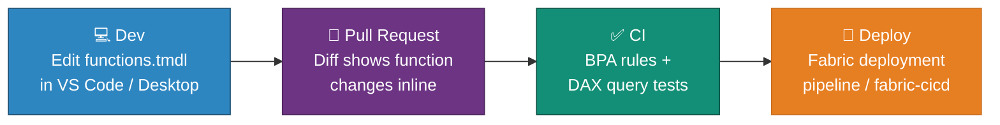

# ƒ DAX User-Defined Functions — Reusable DAX Logic in Semantic Models

<div align="center" markdown>

**Write Once, Reuse Everywhere — Parameterized DAX Functions in Your Semantic Model**


</div>

---

**Last Updated:** `2026-08-22` | **Version:** 1.0.0

---

## 🎯 Overview

DAX user-defined functions (UDFs) let you define **named, parameterized, reusable DAX expressions** directly inside a Power BI semantic model. Instead of copying the same business logic into dozens of measures — tax calculations, currency conversion, customer lifetime value, compliance thresholds — you define the logic once as a function and call it from any measure, calculated column, or visual calculation.

UDFs are stored in the model as first-class objects (visible in Model explorer under the **Functions** node, and in TMDL as `functions.tmdl`), which means they participate in source control, CI/CD, and deployment pipelines exactly like tables and measures.

### Why UDFs Matter

| Problem Without UDFs | With UDFs |
|----------------------|-----------|
| Same logic duplicated across 20+ measures | Logic defined once, called everywhere |
| A business-rule change requires editing every measure | Edit the function; all callers update |
| Inconsistent implementations drift apart over time | Single source of truth per rule |
| Hard to review logic in PRs (scattered across measures) | Functions reviewable as standalone TMDL |

### Key Capabilities

| Capability | Description |
|------------|-------------|
| **Parameters** | Typed input parameters with optional default values |
| **Any expression** | Full DAX expression support, including context transition |
| **Callable from** | Measures, calculated columns, visual calculations, other UDFs |
| **Model explorer** | Functions node lists all UDFs; right-click → Quick queries to test |
| **TMDL storage** | Persisted in `functions.tmdl` — diffable, reviewable, deployable |
| **DAX query view** | Define and evaluate functions interactively before committing |

---

## 🏗️ Defining a Function

### In TMDL (`functions.tmdl`)

```dax
/// Adds tax to an amount at the given rate.
/// @param amount The pre-tax amount.
/// @param rate   The tax rate as a decimal (e.g. 0.07 for 7%).
function AddTax =
    ( amount : DOUBLE, rate : DOUBLE = 0.07 ) =>
        amount * ( 1 + rate )

/// Customer lifetime value: total sales for the current customer.
function CustomerLifetimeValue =
    ( customerKey : INT64 ) =>
        CALCULATE (
            SUM ( 'Sales'[Sales Amount] ),
            'Sales'[CustomerKey] = customerKey
        )
```

### In DAX Query View

```dax
DEFINE
    FUNCTION AddTax = ( amount, rate = 0.07 ) => amount * ( 1 + rate )

EVALUATE
{ AddTax ( 100 ), AddTax ( 100, 0.0825 ) }
```

Use DAX query view to prototype the function, then promote it into the model via **Update model** or by editing `functions.tmdl` in a Power BI project.

---

## 📞 Calling a UDF

### In a Measure

```dax
Sales Amount with Tax =
SUMX (
    'Sales',
    AddTax ( 'Sales'[Sales Amount], 0.0825 )
)
```

### In a Calculated Column

```dax
Sales Amount with Tax =
CONVERT ( AddTax ( 'Sales'[Sales Amount] ), CURRENCY )
```

!!! tip "Type consistency"
    UDFs return a variant-typed result. When a calculated column or strongly typed consumer needs a consistent type, wrap the call with `CONVERT` or a similar function.

### In a Visual Calculation

```dax
Sales Amount with Tax = AddTax ( [Sales Amount] )
```

!!! warning "Visual calculation scope"
    Visual calculations only operate on fields present in the visual. You cannot pass model objects (columns or measures not in the visual) into a UDF from a visual calculation context.

---

## 🎰 Casino POC Example — Compliance Thresholds

The casino POC has repeated threshold logic (CTR $10,000, W-2G $1,200 slots / $5,000 poker). UDFs make these rules explicit and centrally managed:

```dax
/// Returns TRUE if a cash transaction meets the CTR reporting threshold.
function IsCTRReportable =
    ( cashAmount : CURRENCY ) =>
        cashAmount >= 10000

/// Returns the W-2G threshold for a game type, or BLANK if not applicable.
function W2GThreshold =
    ( gameType : STRING ) =>
        SWITCH (
            UPPER ( gameType ),
            "SLOTS", 1200,
            "KENO", 1500,
            "POKER", 5000,
            BLANK ()
        )

/// Flags a jackpot as W-2G reportable for its game type.
function IsW2GReportable =
    ( gameType : STRING, winAmount : CURRENCY ) =>
        VAR threshold = W2GThreshold ( gameType )
        RETURN
            NOT ISBLANK ( threshold ) && winAmount >= threshold
```

Used in measures:

```dax
CTR Reportable Transactions =
CALCULATE (
    COUNTROWS ( 'CashTransactions' ),
    FILTER (
        'CashTransactions',
        IsCTRReportable ( 'CashTransactions'[Amount] )
    )
)

W2G Jackpots =
CALCULATE (
    COUNTROWS ( 'Jackpots' ),
    FILTER (
        'Jackpots',
        IsW2GReportable ( 'Jackpots'[GameType], 'Jackpots'[WinAmount] )
    )
)
```

When a threshold changes (regulatory update), you edit **one function** — every measure, calculated column, and report picks it up on the next refresh.

---

## 🔄 CI/CD & Source Control

Because UDFs live in `functions.tmdl`, they flow through the same pipeline as the rest of the model:



**Recommended checks:**

1. **Best Practice Analyzer** — add rules flagging duplicated measure logic that should be a UDF.
2. **DAX query tests** — evaluate each function against known inputs in CI (see [TMDL & Developer Mode](tmdl-power-bi-developer-mode.md#dax-query-tests)).
3. **Naming convention** — PascalCase, verb-first (`AddTax`, `IsCTRReportable`), documented with `///` comments.

---

## ⚠️ Limitations & Considerations

| Consideration | Detail |
|---------------|--------|
| **Variant return type** | Wrap with `CONVERT` when a consumer needs a fixed type |
| **Visual calculations** | Can only pass fields present in the visual |
| **Recursion** | Not supported — a UDF cannot call itself |
| **Desktop version** | Requires a recent Power BI Desktop; verify your ring supports UDFs before adopting in shared models |
| **XMLA/TMSL** | Functions are model metadata — external tools must support the Functions collection |

---

## 🔗 Related Documents

- [TMDL & Power BI Developer Mode](tmdl-power-bi-developer-mode.md) — TMDL project structure, CI/CD, DAX query tests
- [Composite Models](composite-models.md) — Semantic model architecture patterns
- [Direct Lake](direct-lake.md) — Storage mode for the models hosting your UDFs
- [Scorecards & Metrics](scorecards-metrics.md) — KPI tracking built on governed measures
- [Fabric CI/CD Deployment](../best-practices/fabric-cicd-deployment.md) — Deploy semantic models via CI/CD

---

> 📝 **Document Metadata**
> - **Author**: Documentation Team
> - **Reviewers**: BI Engineering, Analytics
> - **Classification**: Internal
> - **Next Review**: 2026-11-22
