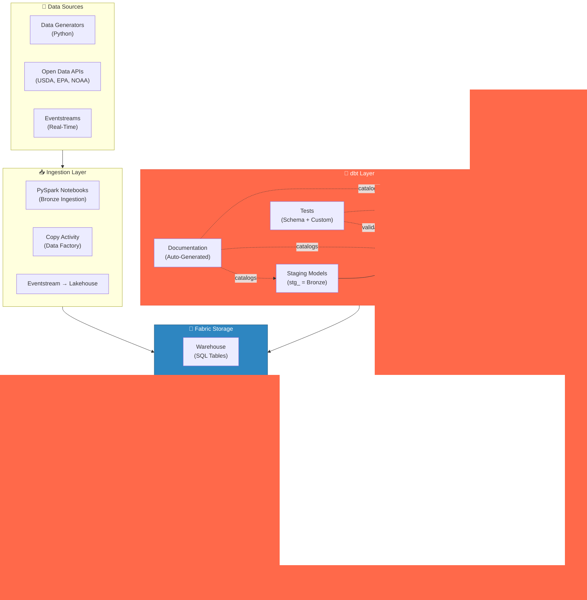
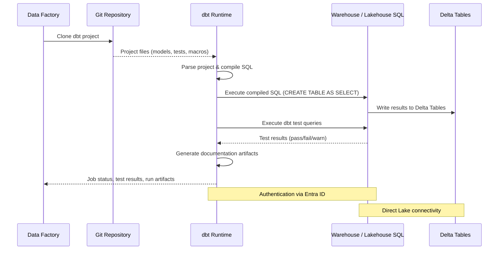
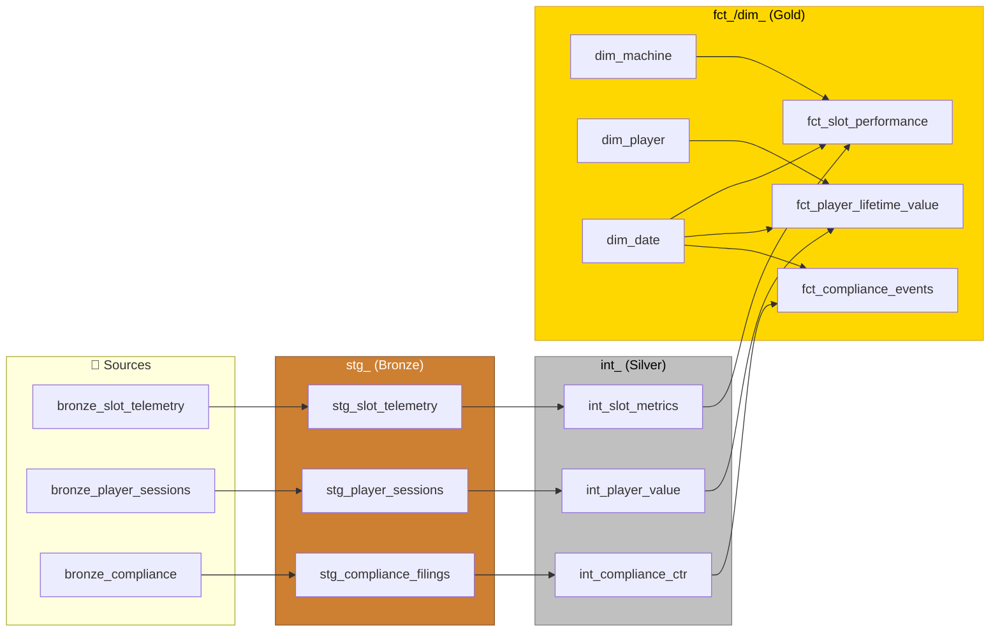
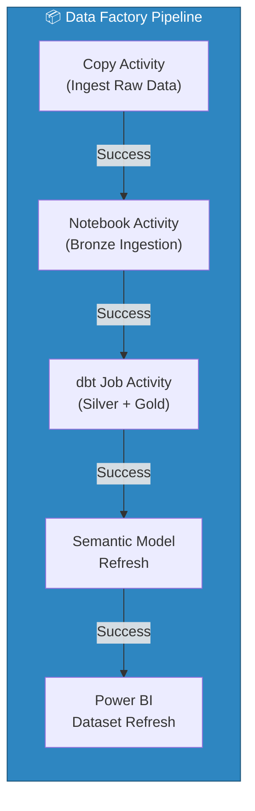
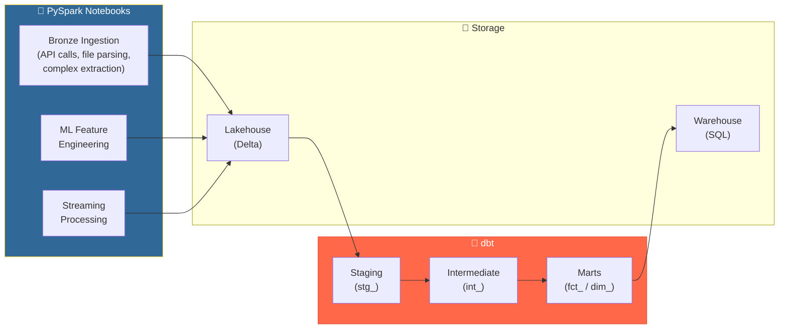

# 🔧 dbt Integration with Microsoft Fabric

<div align="center" markdown>

**Transform Data with dbt Natively in Fabric Data Factory**


</div>

---

**Last Updated:** `2026-04-13` | **Version:** 1.0.0

---

!!! info "Third-party references — publicly sourced, good-faith comparison"
    This page references non-Microsoft products and services. That information is drawn from each vendor's **publicly available documentation** and is offered for honest, good-faith comparison only. This is a personal project written from a Microsoft Fabric and Azure perspective; it does **not** claim expertise in, or authority over, any third-party product, and nothing here is an official statement by, or endorsed by, those vendors. Capabilities, pricing, and features change often — always verify against the vendor's current official documentation. Where a third-party offering is the stronger choice, we say so plainly.

## 🎯 Overview

The **dbt Job in Fabric Data Factory** (Preview, announced at Microsoft Ignite 2025) brings the dbt (data build tool) transformation framework natively into the Microsoft Fabric ecosystem. Teams can now author, schedule, and monitor dbt projects directly within Data Factory without provisioning external compute or managing separate orchestration infrastructure.

### Key Capabilities

| Capability | Description |
|-----------|-------------|
| **Native Fabric Item** | dbt Job is a first-class Data Factory item -- create it from the workspace like any other Fabric artifact |
| **Serverless Execution** | dbt runs on Fabric-managed compute; no Spark clusters or VMs to provision |
| **Entra ID Authentication** | Connects to Warehouse and Lakehouse SQL endpoints using Microsoft Entra ID (Azure AD) -- no service account passwords |
| **SQL-Based Transforms** | Author transformations in SQL, compiled and executed against Fabric Warehouse or Lakehouse SQL analytics endpoint |
| **Integrated Testing** | dbt test commands run as part of the job, validating data quality inline with transformation pipelines |
| **Documentation Generation** | `dbt docs generate` produces a browsable catalog of all models, columns, tests, and lineage |
| **Git Integration** | Connect the dbt Job to a Git repository containing your dbt project for version-controlled transformations |
| **Pipeline Integration** | Trigger dbt Jobs from Data Factory pipelines alongside notebook activities, copy activities, and dataflows |

### Why dbt in Fabric?

dbt has become the industry standard for analytics engineering -- the practice of applying software engineering principles (version control, testing, documentation, modularity) to data transformations. Bringing dbt into Fabric means:

1. **SQL-first teams** can contribute transformations without learning PySpark
2. **Existing dbt projects** from Snowflake, BigQuery, or Databricks can migrate to Fabric with adapter changes
3. **Testing and documentation** are embedded in the transformation layer, not bolted on after the fact
4. **Lineage and governance** integrate with Microsoft Purview through dbt's manifest artifacts

---

## 🏗️ Architecture

### How dbt Fits in the Fabric Ecosystem



### dbt Job Execution Flow



### Medallion Architecture Alignment

dbt's layered modeling conventions map directly onto the medallion architecture used throughout this project:

| Medallion Layer | dbt Convention | Prefix | Purpose |
|----------------|---------------|--------|---------|
| **Bronze** | Staging | `stg_` | Light transformations on raw sources -- renaming, type casting, deduplication |
| **Silver** | Intermediate | `int_` | Business logic, joins, validations, cleansing, conforming |
| **Gold** | Marts | `fct_` / `dim_` | Fact tables, dimension tables, KPI aggregations, star schema |

> 💡 **Tip**: dbt staging models typically reference `source()` definitions that point to Bronze Lakehouse tables ingested by PySpark notebooks. dbt does not replace the ingestion layer -- it replaces the transformation notebooks from Silver onward.

---

## ⚙️ Setup and Configuration

### Prerequisites

| Requirement | Details |
|------------|---------|
| **Fabric Capacity** | F2 or higher (F64 recommended for production workloads) |
| **Data Factory** | Enabled in the Fabric workspace |
| **Warehouse or Lakehouse** | At least one target with a SQL analytics endpoint |
| **Git Repository** | GitHub, Azure DevOps, or Bitbucket repo containing a dbt project |
| **dbt Project** | Valid `dbt_project.yml` with `dbt-fabric` adapter configured |

### Step 1: Create a dbt Job Item

Navigate to your Fabric workspace and create the dbt Job:

```
Workspace → + New → Data Factory → dbt Job (Preview)
  Name: dbt-casino-transforms
  Description: dbt transformations for casino analytics medallion architecture
```

### Step 2: Connect to Git Repository

Link the dbt Job to your version-controlled dbt project:

```
dbt Job Settings → Source Control
  ├── Provider: GitHub / Azure DevOps / Bitbucket
  ├── Repository: org/fabric-dbt-casino
  ├── Branch: main
  ├── dbt Project Path: /  (root of repo, or subdirectory)
  └── Authentication: OAuth / PAT
```

### Step 3: Configure the Target Connection

Set up the `profiles.yml` for your Fabric Warehouse or Lakehouse SQL endpoint:

```yaml
# profiles.yml -- Fabric Warehouse target
fabric_casino:
  target: dev
  outputs:
    dev:
      type: fabric
      driver: "ODBC Driver 18 for SQL Server"
      server: "your-workspace.datawarehouse.fabric.microsoft.com"
      database: "wh-casino-analytics"
      schema: "dbt_dev"
      authentication: "ActiveDirectoryInteractive"
      # For service principal (CI/CD):
      # authentication: "ActiveDirectoryServicePrincipal"
      # client_id: "{{ env_var('DBT_FABRIC_CLIENT_ID') }}"
      # client_secret: "{{ env_var('DBT_FABRIC_CLIENT_SECRET') }}"
      # tenant_id: "{{ env_var('DBT_FABRIC_TENANT_ID') }}"
      threads: 4
      retries: 2

    prod:
      type: fabric
      driver: "ODBC Driver 18 for SQL Server"
      server: "your-workspace.datawarehouse.fabric.microsoft.com"
      database: "wh-casino-analytics"
      schema: "dbt_prod"
      authentication: "ActiveDirectoryServicePrincipal"
      client_id: "{{ env_var('DBT_FABRIC_CLIENT_ID') }}"
      client_secret: "{{ env_var('DBT_FABRIC_CLIENT_SECRET') }}"
      tenant_id: "{{ env_var('DBT_FABRIC_TENANT_ID') }}"
      threads: 8
      retries: 3
```

### Step 4: Validate the Connection

Run a connection test from the dbt Job item:

```
dbt Job → Test Connection
  ✅ Successfully connected to wh-casino-analytics
  ✅ Schema dbt_dev created (or already exists)
  ✅ Entra ID authentication successful
```

> 📝 **Note**: When running inside Fabric Data Factory, the dbt Job uses the workspace identity for authentication. The `profiles.yml` authentication settings are primarily for local development and CI/CD pipelines.

---

## 📂 Project Structure

### Standard dbt Project Layout for Fabric

```
dbt-fabric-casino/
├── dbt_project.yml              # Project configuration
├── profiles.yml                 # Connection profiles (local dev only)
├── packages.yml                 # dbt package dependencies
│
├── models/
│   ├── staging/                 # Bronze → Staging (stg_)
│   │   ├── casino/
│   │   │   ├── _casino_sources.yml
│   │   │   ├── stg_slot_telemetry.sql
│   │   │   ├── stg_player_sessions.sql
│   │   │   ├── stg_table_game_results.sql
│   │   │   └── stg_compliance_filings.sql
│   │   └── federal/
│   │       ├── _federal_sources.yml
│   │       ├── stg_usda_crop_production.sql
│   │       ├── stg_epa_tri_releases.sql
│   │       ├── stg_noaa_storm_events.sql
│   │       ├── stg_sba_ppp_loans.sql
│   │       └── stg_doi_earthquake_events.sql
│   │
│   ├── intermediate/            # Silver → Intermediate (int_)
│   │   ├── casino/
│   │   │   ├── int_slot_metrics.sql
│   │   │   ├── int_player_value.sql
│   │   │   ├── int_compliance_ctr.sql
│   │   │   └── int_compliance_sar.sql
│   │   └── federal/
│   │       ├── int_usda_crop_analysis.sql
│   │       ├── int_epa_release_trends.sql
│   │       ├── int_noaa_climate_summary.sql
│   │       ├── int_sba_loan_metrics.sql
│   │       └── int_doi_seismic_analysis.sql
│   │
│   └── marts/                   # Gold → Marts (fct_ / dim_)
│       ├── casino/
│       │   ├── fct_slot_performance.sql
│       │   ├── fct_player_lifetime_value.sql
│       │   ├── fct_compliance_events.sql
│       │   ├── dim_machine.sql
│       │   ├── dim_player.sql
│       │   └── dim_date.sql
│       └── federal/
│           ├── fct_usda_crop_rankings.sql
│           ├── fct_epa_facility_compliance.sql
│           ├── fct_noaa_weather_trends.sql
│           ├── dim_agency.sql
│           ├── dim_state.sql
│           └── dim_date.sql
│
├── tests/                       # Custom data tests
│   ├── assert_ctr_threshold.sql
│   ├── assert_sar_structuring.sql
│   └── assert_crop_yield_positive.sql
│
├── macros/                      # Reusable SQL macros
│   ├── compliance_thresholds.sql
│   ├── medallion_helpers.sql
│   └── date_spine.sql
│
├── seeds/                       # Static reference data (CSV)
│   ├── state_codes.csv
│   ├── denomination_types.csv
│   └── agency_metadata.csv
│
└── snapshots/                   # Slowly changing dimensions
    ├── snap_player_tier.sql
    └── snap_machine_config.sql
```

### dbt_project.yml Configuration

```yaml
name: "fabric_casino"
version: "1.0.0"
config-version: 2
profile: "fabric_casino"

model-paths: ["models"]
analysis-paths: ["analyses"]
test-paths: ["tests"]
seed-paths: ["seeds"]
macro-paths: ["macros"]
snapshot-paths: ["snapshots"]

clean-targets:
  - "target"
  - "dbt_packages"

models:
  fabric_casino:
    staging:
      +materialized: view
      +schema: staging
      +tags: ["bronze", "staging"]
    intermediate:
      +materialized: table
      +schema: silver
      +tags: ["silver", "intermediate"]
    marts:
      +materialized: table
      +schema: gold
      +tags: ["gold", "marts"]
```

### packages.yml

```yaml
packages:
  - package: dbt-labs/dbt_utils
    version: ">=1.0.0"
  - package: calogica/dbt_expectations
    version: ">=0.10.0"
  - package: dbt-labs/codegen
    version: ">=0.12.0"
```

---

## 📐 Model Patterns

### Staging Models (Bronze → stg_)

Staging models apply light transformations to raw source data: renaming columns to consistent conventions, casting data types, and deduplicating records.

#### Source Definition

```yaml
# models/staging/casino/_casino_sources.yml
version: 2

sources:
  - name: bronze_casino
    description: "Raw casino data ingested by PySpark notebooks into the Bronze Lakehouse"
    database: lh_bronze
    schema: dbo
    tables:
      - name: bronze_slot_telemetry
        description: "Raw slot machine telemetry events from SAS protocol"
        columns:
          - name: machine_id
            description: "Slot machine identifier (SL-XXXX format)"
          - name: event_type
            description: "Event category: spin, jackpot, error, tilt"
          - name: wager_amount
            description: "Dollar amount wagered on this event"
          - name: payout_amount
            description: "Dollar amount paid to player"
          - name: event_timestamp
            description: "UTC timestamp of the event"

      - name: bronze_player_sessions
        description: "Player card-in/card-out session data from loyalty system"
```

#### Staging Model SQL

```sql
-- models/staging/casino/stg_slot_telemetry.sql
{{ config(materialized='view') }}

with source as (
    select * from {{ source('bronze_casino', 'bronze_slot_telemetry') }}
),

renamed as (
    select
        cast(machine_id as varchar(20))       as machine_id,
        cast(event_type as varchar(20))       as event_type,
        cast(wager_amount as decimal(12, 2))  as wager_amount,
        cast(payout_amount as decimal(12, 2)) as payout_amount,
        cast(event_timestamp as datetime2)    as event_at,
        cast(floor_location as varchar(50))   as floor_location,
        cast(denomination as decimal(6, 2))   as denomination,
        cast(game_title as varchar(100))      as game_title,
        cast(session_id as varchar(40))       as session_id,
        -- Derived columns
        wager_amount - payout_amount          as hold_amount,
        cast(ingestion_timestamp as datetime2) as _loaded_at
    from source
    where machine_id is not null
      and event_timestamp is not null
)

select * from renamed
```

### Intermediate Models (Silver → int_)

Intermediate models apply business logic, join related datasets, validate data quality, and produce cleansed, conformed records.

```sql
-- models/intermediate/casino/int_slot_metrics.sql
{{ config(materialized='table') }}

with telemetry as (
    select * from {{ ref('stg_slot_telemetry') }}
    where event_type = 'spin'
),

daily_metrics as (
    select
        machine_id,
        floor_location,
        denomination,
        game_title,
        cast(event_at as date)              as gaming_date,
        count(*)                             as spin_count,
        sum(wager_amount)                    as total_coin_in,
        sum(payout_amount)                   as total_coin_out,
        sum(hold_amount)                     as total_hold,
        case
            when sum(wager_amount) > 0
            then round(sum(hold_amount) / sum(wager_amount) * 100, 2)
            else 0
        end                                  as hold_pct,
        min(event_at)                        as first_spin_at,
        max(event_at)                        as last_spin_at,
        datediff(minute, min(event_at), max(event_at)) as active_minutes
    from telemetry
    group by
        machine_id, floor_location, denomination,
        game_title, cast(event_at as date)
),

validated as (
    select
        *,
        case
            when hold_pct < 0 or hold_pct > 25 then 'ANOMALY'
            when hold_pct < 2 then 'LOW_HOLD'
            when hold_pct > 15 then 'HIGH_HOLD'
            else 'NORMAL'
        end as hold_status
    from daily_metrics
    where spin_count > 0
)

select * from validated
```

### Mart Models (Gold → fct_ / dim_)

Mart models produce the final star-schema fact and dimension tables consumed by Power BI via Direct Lake.

```sql
-- models/marts/casino/fct_slot_performance.sql
{{ config(
    materialized='table',
    description='Daily slot machine performance fact table for Power BI Direct Lake consumption'
) }}

with metrics as (
    select * from {{ ref('int_slot_metrics') }}
),

machines as (
    select * from {{ ref('dim_machine') }}
),

dates as (
    select * from {{ ref('dim_date') }}
)

select
    -- Keys
    {{ dbt_utils.generate_surrogate_key(['m.machine_id', 'm.gaming_date']) }} as performance_key,
    d.date_key,
    mc.machine_key,
    -- Measures
    m.spin_count,
    m.total_coin_in,
    m.total_coin_out,
    m.total_hold,
    m.hold_pct,
    m.active_minutes,
    m.hold_status,
    -- Calculated measures
    case
        when m.active_minutes > 0
        then round(m.total_coin_in / (m.active_minutes / 60.0), 2)
        else 0
    end as coin_in_per_hour,
    m.first_spin_at,
    m.last_spin_at,
    current_timestamp as _dbt_loaded_at
from metrics m
left join machines mc on m.machine_id = mc.machine_id
left join dates d on m.gaming_date = d.calendar_date
```

### Incremental Models for Large Tables

For tables with millions of rows, use incremental materialization to process only new records:

```sql
-- models/intermediate/casino/int_player_sessions.sql
{{ config(
    materialized='incremental',
    unique_key='session_id',
    incremental_strategy='merge',
    on_schema_change='sync_all_columns'
) }}

with sessions as (
    select * from {{ ref('stg_player_sessions') }}
    
    where _loaded_at > (select max(_loaded_at) from {{ this }})
    
),

enriched as (
    select
        session_id,
        player_id,
        machine_id,
        card_in_at,
        card_out_at,
        datediff(minute, card_in_at, card_out_at) as session_duration_minutes,
        total_wagered,
        total_won,
        total_wagered - total_won as net_loss,
        _loaded_at
    from sessions
    where card_in_at is not null
      and card_out_at is not null
      and card_out_at > card_in_at
)

select * from enriched
```

---

## ✅ Testing Patterns

### Schema Tests (YAML-Defined)

Schema tests are declared alongside model definitions and run automatically as part of `dbt test`:

```yaml
# models/marts/casino/schema.yml
version: 2

models:
  - name: fct_slot_performance
    description: "Daily slot machine performance fact table"
    columns:
      - name: performance_key
        description: "Surrogate key (machine_id + gaming_date)"
        tests:
          - unique
          - not_null

      - name: machine_key
        description: "Foreign key to dim_machine"
        tests:
          - not_null
          - relationships:
              to: ref('dim_machine')
              field: machine_key

      - name: hold_pct
        description: "Casino hold percentage (0-25 range expected)"
        tests:
          - not_null
          - dbt_expectations.expect_column_values_to_be_between:
              min_value: 0
              max_value: 25
              row_condition: "hold_status != 'ANOMALY'"

      - name: total_coin_in
        description: "Total dollars wagered"
        tests:
          - not_null
          - dbt_expectations.expect_column_values_to_be_between:
              min_value: 0

      - name: spin_count
        description: "Number of spins for the day"
        tests:
          - dbt_expectations.expect_column_values_to_be_between:
              min_value: 1

  - name: dim_machine
    description: "Slot machine dimension with current attributes"
    columns:
      - name: machine_key
        tests:
          - unique
          - not_null
      - name: machine_id
        tests:
          - unique
          - not_null
      - name: denomination
        tests:
          - accepted_values:
              values: [0.01, 0.05, 0.25, 0.50, 1.00, 5.00, 25.00, 100.00]
```

### Custom Tests (SQL-Defined)

Custom singular tests validate complex business rules that go beyond column-level checks:

```sql
-- tests/assert_ctr_threshold.sql
-- Validate that all CTR compliance events are for transactions >= $10,000
-- Failure indicates a data quality issue in the compliance pipeline

select
    compliance_event_id,
    player_id,
    transaction_amount,
    filing_type
from {{ ref('fct_compliance_events') }}
where filing_type = 'CTR'
  and transaction_amount < 10000
```

```sql
-- tests/assert_sar_structuring.sql
-- Validate SAR filings: structuring pattern = 3+ transactions of $8K-$9.9K in 24h

with sar_filings as (
    select
        player_id,
        filing_date,
        pattern_transaction_count,
        pattern_total_amount
    from {{ ref('fct_compliance_events') }}
    where filing_type = 'SAR'
      and pattern_type = 'STRUCTURING'
)

select *
from sar_filings
where pattern_transaction_count < 3
   or pattern_total_amount < 24000  -- minimum 3 x $8,000
```

```sql
-- tests/assert_crop_yield_positive.sql
-- USDA crop yield values must be positive where production is reported

select
    state_name,
    commodity_name,
    crop_year,
    yield_per_acre
from {{ ref('fct_usda_crop_rankings') }}
where production_value > 0
  and (yield_per_acre is null or yield_per_acre <= 0)
```

### Data Freshness Tests

```yaml
# models/staging/casino/_casino_sources.yml (freshness section)
sources:
  - name: bronze_casino
    freshness:
      warn_after: { count: 6, period: hour }
      error_after: { count: 24, period: hour }
    loaded_at_field: ingestion_timestamp
    tables:
      - name: bronze_slot_telemetry
        freshness:
          warn_after: { count: 1, period: hour }
          error_after: { count: 4, period: hour }
```

Run freshness checks:

```bash
dbt source freshness
```

### dbt Expectations Package

The `dbt_expectations` package brings Great Expectations-style tests to dbt:

```yaml
# Additional expectations examples
- name: gaming_date
  tests:
    - dbt_expectations.expect_column_values_to_be_of_type:
        column_type: date
    - dbt_expectations.expect_row_values_to_have_recent_data:
        datepart: day
        interval: 2
```

---

## 📖 Documentation Generation

### Auto-Generated Documentation

dbt generates a browsable documentation site from model descriptions, column descriptions, and test definitions:

```bash
# Generate documentation
dbt docs generate

# Serve locally (development)
dbt docs serve --port 8080
```

The generated catalog includes:

| Artifact | Content |
|----------|---------|
| **Model Catalog** | Every model with description, columns, tags, and materialization strategy |
| **Column Lineage** | Column-level lineage tracing data from source to mart |
| **DAG Visualization** | Interactive directed acyclic graph showing model dependencies |
| **Test Coverage** | Which columns are tested and with what assertions |
| **Source Freshness** | Last-loaded timestamps for all declared sources |

### Column-Level Lineage

dbt tracks how columns flow through transformations:

```
bronze_slot_telemetry.wager_amount
  → stg_slot_telemetry.wager_amount (cast to decimal)
    → int_slot_metrics.total_coin_in (sum aggregation)
      → fct_slot_performance.total_coin_in (joined with dims)
```

### DAG Visualization



### Integration with Microsoft Purview

dbt's manifest and catalog artifacts can be ingested into Microsoft Purview for enterprise-wide governance:

| Integration Point | Method |
|-------------------|--------|
| **Lineage** | Parse `manifest.json` to register dbt models as Purview assets with upstream/downstream lineage |
| **Glossary** | Map dbt model and column descriptions to Purview glossary terms |
| **Classification** | Tag columns containing PII (SSN, card numbers) with Purview sensitivity labels |
| **Data Quality** | Publish dbt test results as Purview data quality scores |

> 📝 **Note**: The Purview-dbt integration requires the Purview REST API or the `purview-dbt` open-source connector. This is not a native Fabric feature but a recommended governance pattern.

---

## ⏰ Scheduling and Orchestration

### dbt Job Scheduling in Data Factory

Configure the dbt Job to run on a schedule directly in Fabric:

```
dbt Job → Schedule
  ├── Frequency: Daily
  ├── Time: 06:00 UTC (after overnight ingestion completes)
  ├── Time Zone: UTC
  ├── dbt Commands:
  │   ├── 1: dbt seed --full-refresh
  │   ├── 2: dbt run --select staging intermediate marts
  │   ├── 3: dbt test
  │   └── 4: dbt docs generate
  └── Notifications: Email on failure
```

### Pipeline Integration

Embed the dbt Job within a Data Factory pipeline for end-to-end orchestration:



**Pipeline configuration:**

```json
{
    "name": "pl-casino-daily-etl",
    "activities": [
        {
            "name": "Bronze Ingestion",
            "type": "SparkNotebook",
            "notebook": "01_bronze_slot_telemetry",
            "onSuccess": ["dbt Silver-Gold"]
        },
        {
            "name": "dbt Silver-Gold",
            "type": "dbtJob",
            "dbt_job_id": "dbt-casino-transforms",
            "commands": ["dbt run", "dbt test"],
            "onSuccess": ["Refresh Semantic Model"],
            "onFailure": ["Send Alert Email"]
        },
        {
            "name": "Refresh Semantic Model",
            "type": "SemanticModelRefresh",
            "model": "sm-casino-analytics"
        }
    ]
}
```

### CI/CD: Run dbt in PR Validation

Use GitHub Actions or Azure DevOps Pipelines to validate dbt changes before merging:

```yaml
# .github/workflows/dbt-ci.yml
name: dbt CI
on:
  pull_request:
    paths:
      - "models/**"
      - "tests/**"
      - "macros/**"
      - "dbt_project.yml"

jobs:
  dbt-check:
    runs-on: ubuntu-latest
    steps:
      - uses: actions/checkout@v4

      - name: Install dbt
        run: pip install dbt-fabric

      - name: dbt deps
        run: dbt deps

      - name: dbt compile
        run: dbt compile --target ci

      - name: dbt test (schema only)
        run: dbt test --select test_type:schema --target ci

      - name: dbt docs generate
        run: dbt docs generate
```

### Monitoring: Job Run History

Track dbt Job execution history in Data Factory:

| Metric | Location |
|--------|----------|
| **Run Status** | Data Factory → dbt Job → Run History |
| **Test Results** | Each run shows pass/fail/warn/error counts per test |
| **Model Timing** | Execution time per model for performance tracking |
| **Compilation Logs** | Full dbt logs available for debugging |
| **Artifacts** | `manifest.json`, `catalog.json`, `run_results.json` |

---

## 🎰 Casino Analytics Example

### End-to-End dbt Pipeline: Slot Performance

This example traces a complete transformation chain from Bronze ingestion through Gold mart output.

#### Source: Bronze Slot Telemetry

```yaml
# models/staging/casino/_casino_sources.yml
sources:
  - name: bronze_casino
    database: lh_bronze
    schema: dbo
    tables:
      - name: bronze_slot_telemetry
        freshness:
          warn_after: { count: 1, period: hour }
          error_after: { count: 4, period: hour }
        loaded_at_field: ingestion_timestamp
```

#### Staging: stg_slot_telemetry

```sql
-- models/staging/casino/stg_slot_telemetry.sql
{{ config(materialized='view') }}

select
    machine_id,
    event_type,
    cast(wager_amount as decimal(12, 2)) as wager_amount,
    cast(payout_amount as decimal(12, 2)) as payout_amount,
    wager_amount - payout_amount as hold_amount,
    event_timestamp as event_at,
    floor_location,
    denomination,
    game_title,
    session_id,
    ingestion_timestamp as _loaded_at
from {{ source('bronze_casino', 'bronze_slot_telemetry') }}
where machine_id is not null
```

#### Intermediate: int_slot_metrics (daily aggregation)

```sql
-- models/intermediate/casino/int_slot_metrics.sql (see Model Patterns section above)
```

#### Mart: fct_slot_performance (star schema fact)

```sql
-- models/marts/casino/fct_slot_performance.sql (see Model Patterns section above)
```

#### Compliance Models

```sql
-- models/intermediate/casino/int_compliance_ctr.sql
{{ config(materialized='table') }}

with transactions as (
    select * from {{ ref('stg_player_transactions') }}
),

ctr_candidates as (
    select
        player_id,
        transaction_id,
        transaction_amount,
        transaction_at,
        transaction_type,
        -- CTR threshold: $10,000
        case
            when transaction_amount >= {{ var('ctr_threshold', 10000) }}
            then true
            else false
        end as is_ctr_reportable
    from transactions
    where transaction_amount >= {{ var('ctr_threshold', 10000) }}
)

select
    transaction_id,
    player_id,
    transaction_amount,
    transaction_at,
    transaction_type,
    'CTR' as filing_type,
    'PENDING' as filing_status,
    current_timestamp as flagged_at
from ctr_candidates
where is_ctr_reportable = true
```

```sql
-- models/intermediate/casino/int_compliance_sar.sql
{{ config(materialized='table') }}

with transactions as (
    select * from {{ ref('stg_player_transactions') }}
    where transaction_amount between {{ var('sar_lower', 8000) }}
                                 and {{ var('sar_upper', 9999.99) }}
),

structuring_patterns as (
    select
        player_id,
        cast(transaction_at as date) as txn_date,
        count(*) as txn_count,
        sum(transaction_amount) as total_amount,
        min(transaction_at) as first_txn_at,
        max(transaction_at) as last_txn_at
    from transactions
    group by player_id, cast(transaction_at as date)
    having count(*) >= 3  -- 3+ transactions in a single day
)

select
    {{ dbt_utils.generate_surrogate_key(['player_id', 'txn_date']) }} as sar_pattern_id,
    player_id,
    txn_date as pattern_date,
    txn_count as pattern_transaction_count,
    total_amount as pattern_total_amount,
    'SAR' as filing_type,
    'STRUCTURING' as pattern_type,
    'PENDING' as filing_status,
    current_timestamp as flagged_at
from structuring_patterns
```

---

## 🏛️ Federal Data Example

### USDA Crop Analysis Chain

```sql
-- models/staging/federal/stg_usda_crop_production.sql
{{ config(materialized='view') }}

with source as (
    select * from {{ source('bronze_federal', 'bronze_usda_crop_production') }}
),

renamed as (
    select
        cast(state_fips_code as varchar(5))   as state_fips,
        cast(state_name as varchar(50))        as state_name,
        cast(commodity_desc as varchar(100))   as commodity_name,
        cast(statisticcat_desc as varchar(50)) as statistic_category,
        cast(year as int)                      as crop_year,
        cast(value as decimal(18, 2))          as value,
        cast(unit_desc as varchar(30))         as unit,
        cast(source_desc as varchar(50))       as data_source,
        cast(ingestion_timestamp as datetime2) as _loaded_at
    from source
    where value is not null
      and state_fips_code is not null
)

select * from renamed
```

```sql
-- models/intermediate/federal/int_usda_crop_analysis.sql
{{ config(materialized='table') }}

with production as (
    select * from {{ ref('stg_usda_crop_production') }}
    where statistic_category = 'PRODUCTION'
),

acreage as (
    select * from {{ ref('stg_usda_crop_production') }}
    where statistic_category = 'AREA HARVESTED'
),

combined as (
    select
        p.state_fips,
        p.state_name,
        p.commodity_name,
        p.crop_year,
        p.value as production_value,
        p.unit as production_unit,
        a.value as acreage_harvested,
        case
            when a.value > 0
            then round(p.value / a.value, 2)
            else null
        end as yield_per_acre,
        p._loaded_at
    from production p
    left join acreage a
        on p.state_fips = a.state_fips
        and p.commodity_name = a.commodity_name
        and p.crop_year = a.crop_year
)

select * from combined
```

### EPA Water Quality Transformation Chain

```sql
-- models/intermediate/federal/int_epa_release_trends.sql
{{ config(materialized='table') }}

with releases as (
    select * from {{ ref('stg_epa_tri_releases') }}
),

annual_trends as (
    select
        facility_name,
        facility_state,
        chemical_name,
        release_medium,
        reporting_year,
        sum(release_amount_lbs) as total_release_lbs,
        count(distinct facility_id) as facility_count,
        -- Year-over-year change
        lag(sum(release_amount_lbs)) over (
            partition by facility_state, chemical_name, release_medium
            order by reporting_year
        ) as prior_year_release_lbs
    from releases
    group by
        facility_name, facility_state, chemical_name,
        release_medium, reporting_year
)

select
    *,
    case
        when prior_year_release_lbs > 0
        then round(
            (total_release_lbs - prior_year_release_lbs) / prior_year_release_lbs * 100, 2
        )
        else null
    end as yoy_change_pct
from annual_trends
```

### Cross-Agency Dimension: dim_state

```sql
-- models/marts/federal/dim_state.sql
{{ config(materialized='table') }}

with state_data as (
    select * from {{ ref('seed_state_codes') }}
)

select
    {{ dbt_utils.generate_surrogate_key(['state_fips']) }} as state_key,
    state_fips,
    state_abbreviation,
    state_name,
    census_region,
    census_division,
    current_timestamp as _dbt_loaded_at
from state_data
```

---

## 🔄 Migration from PySpark Notebooks

### When to Use dbt vs PySpark

dbt and PySpark serve different purposes within the Fabric ecosystem. The decision depends on the type of transformation and the team's skills.

| Factor | dbt | PySpark Notebooks |
|--------|-----|-------------------|
| **Language** | SQL | Python / PySpark |
| **Best for** | Relational transforms, aggregations, joins, window functions | Complex parsing, ML feature engineering, binary data, unstructured data |
| **Materialization** | Table, view, incremental, snapshot | Delta table writes via Spark DataFrame API |
| **Testing** | Built-in (schema tests, custom tests, freshness) | Requires separate pytest / Great Expectations setup |
| **Documentation** | Auto-generated catalog with lineage | Manual markdown cells in notebooks |
| **Version Control** | Git-native (SQL files) | `.ipynb` files (harder to diff and review) |
| **Orchestration** | dbt Job in Data Factory | Notebook activity in Data Factory |
| **Learning Curve** | Low (SQL + YAML) | Medium-High (Python + Spark + Delta) |
| **Team Fit** | Analytics engineers, SQL analysts | Data engineers, data scientists |
| **Schema Evolution** | `on_schema_change` config | Manual schema merge logic |
| **Performance** | Fabric SQL engine (optimized for relational) | Spark distributed compute (optimized for large-scale parallel) |
| **Streaming** | Not supported (batch only) | Structured Streaming support |

### Hybrid Approach: dbt + PySpark

The recommended approach for this project is a hybrid architecture:



**Division of responsibility:**

| Layer | Tool | Rationale |
|-------|------|-----------|
| **Ingestion (Bronze)** | PySpark Notebooks | API calls, file parsing, schema inference, streaming -- requires Python |
| **Transformation (Silver)** | dbt | SQL-based cleansing, validation, joins -- benefits from dbt testing and documentation |
| **Aggregation (Gold)** | dbt | Star schema, KPIs, business logic -- SQL is more readable and reviewable |
| **ML Features** | PySpark Notebooks | Complex feature engineering, statistical functions, model training |
| **Streaming** | PySpark + Eventstreams | Real-time processing requires Spark Structured Streaming |

### Migration Steps for Existing Notebooks

If migrating an existing Silver or Gold PySpark notebook to dbt:

1. **Extract the SQL logic** from `spark.sql()` calls or DataFrame operations
2. **Create a dbt model** with the extracted SQL, using `{{ ref() }}` and `{{ source() }}` macros
3. **Add schema tests** to replace any `assert` statements in the notebook
4. **Add documentation** (descriptions for model and columns in YAML)
5. **Test equivalence** by comparing row counts and sample values between notebook output and dbt output
6. **Deprecate the notebook** once dbt model is validated in production

---

## ⚠️ Limitations

### Current Limitations (Preview)

| Limitation | Details | Workaround |
|-----------|---------|-----------|
| **Preview Status** | dbt Job in Data Factory is in Preview as of April 2026 | Use for non-critical workloads; keep PySpark notebooks as fallback |
| **Adapter Maturity** | `dbt-fabric` adapter may lag behind `dbt-sqlserver` features | Check adapter release notes for supported dbt features |
| **No Streaming** | dbt is batch-only; cannot process streaming data | Use PySpark Structured Streaming or Eventstreams for real-time |
| **Warehouse Required** | dbt targets Fabric Warehouse or Lakehouse SQL endpoint (not Spark) | Ensure SQL analytics endpoint is enabled on Lakehouse |
| **Python Models** | dbt Python models (using `dbt.ref()` in Python) have limited support | Use PySpark notebooks for Python-heavy transformations |
| **Snapshot Limitations** | SCD Type 2 snapshots may have performance constraints on large dimensions | Consider incremental merge patterns for very large dimensions |
| **Macro Compatibility** | Not all community dbt macros are compatible with Fabric SQL dialect | Test macros in dev before deploying; use `dbt-fabric`-specific alternatives |
| **Concurrency** | Thread count limited by Fabric Warehouse concurrency settings | Tune `threads` in `profiles.yml` based on capacity SKU |

### Fabric SQL vs Standard T-SQL

The Fabric Warehouse SQL engine supports most T-SQL syntax but has some differences:

| Feature | Support | Notes |
|---------|---------|-------|
| `CREATE TABLE AS SELECT` | ✅ | Primary materialization method |
| `MERGE` (for incremental) | ✅ | Used by incremental strategy |
| Window functions | ✅ | `ROW_NUMBER`, `LAG`, `LEAD`, `RANK` |
| CTEs | ✅ | Primary query structuring pattern |
| Stored procedures | ❌ | Not supported in Fabric Warehouse |
| Triggers | ❌ | Use Data Factory orchestration instead |
| Temporary tables | ⚠️ | Session-scoped only |
| User-defined functions | ⚠️ | Limited support |

---

## 📚 References

| Resource | URL |
|----------|-----|
| dbt Job in Fabric Data Factory (Preview) | https://learn.microsoft.com/fabric/data-factory/dbt-job |
| dbt-fabric Adapter | https://github.com/microsoft/dbt-fabric |
| dbt Core Documentation | https://docs.getdbt.com/ |
| dbt Best Practices Guide | https://docs.getdbt.com/best-practices |
| dbt Testing Documentation | https://docs.getdbt.com/docs/build/data-tests |
| dbt Expectations Package | https://github.com/calogica/dbt-expectations |
| Fabric Warehouse SQL Reference | https://learn.microsoft.com/fabric/data-warehouse/sql-reference |
| Data Factory Pipelines | https://learn.microsoft.com/fabric/data-factory/pipeline-overview |
| Microsoft Purview dbt Integration | https://learn.microsoft.com/purview/how-to-lineage-dbt |

---

## 🔗 Related Documents

- [Real-Time Intelligence](real-time-intelligence.md) -- Streaming analytics (complements dbt's batch transforms)
- [Fabric IQ](fabric-iq.md) -- Natural language queries over dbt-produced Gold tables
- [AI Copilot Configuration](ai-copilot-configuration.md) -- Copilot-assisted SQL authoring
- [Data Mesh Enterprise Patterns](data-mesh-enterprise-patterns.md) -- Cross-domain dbt project patterns
- [Architecture](../ARCHITECTURE.md) -- System architecture overview

---

> 📝 **Document Metadata**
> - **Author**: Documentation Team
> - **Reviewers**: Data Engineering, Analytics Engineering
> - **Classification**: Internal
> - **Next Review**: 2026-06-13
