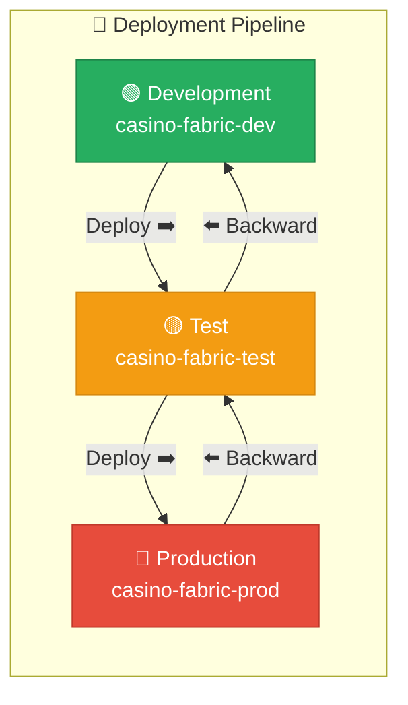
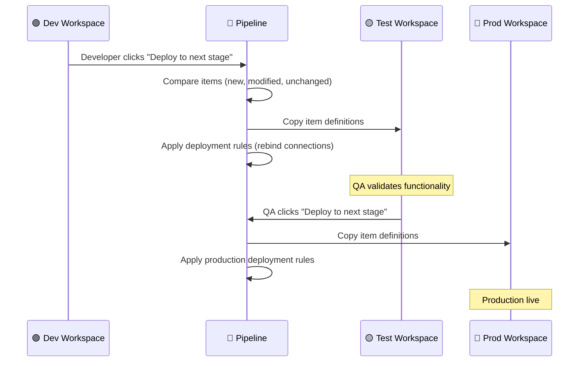

# 🚀 Deployment Pipelines — Stage-Based Promotion in Fabric

<div align="center" markdown>

**Built-In Dev/Test/Prod Lifecycle Management for Microsoft Fabric**


</div>

---

**Last Updated:** `2026-04-21` | **Version:** 1.0.0

---

## 🎯 Overview

Deployment Pipelines is Fabric's **native, built-in ALM (Application Lifecycle Management) tool** for promoting workspace items through development stages. It provides a visual comparison between Dev, Test, and Production workspaces, with one-click deployment, deployment rules for environment-specific configuration, and full deployment history.

Deployment Pipelines complement (but differ from) Git-based CI/CD with `fabric-cicd`. While Git integration manages source-controlled item definitions, Deployment Pipelines manage the runtime promotion of compiled/instantiated Fabric items between workspaces.

### Deployment Pipelines vs. fabric-cicd

| Aspect | Deployment Pipelines (Native) | fabric-cicd (Python CLI) |
|--------|------------------------------|--------------------------|
| **Interface** | Fabric portal (visual) | CLI / GitHub Actions |
| **Stages** | 2-10 named stages | Branch-based (any number) |
| **Configuration** | Deployment rules (portal) | `.fabric-cicd-config.yaml` |
| **Item Scope** | All Fabric items | Items with Git support |
| **Data Handling** | No data movement | No data movement |
| **Approval** | Manual promotion | PR-based review |
| **Automation** | REST API | Python SDK + CI/CD |
| **Best For** | Visual promotion workflows | DevOps-native teams |

### Key Capabilities

| Capability | Description |
|-----------|-------------|
| **Multi-Stage Pipelines** | 2 to 10 stages (commonly Dev → Test → Prod) |
| **Visual Comparison** | Side-by-side diff showing which items are new, modified, or unchanged |
| **Selective Deployment** | Deploy all items or pick specific items to promote |
| **Deployment Rules** | Per-stage parameter overrides (connections, datasets, Lakehouse bindings) |
| **Auto-Bind** | Automatically rebind semantic models and reports to stage-specific data sources |
| **Backwards Deployment** | Deploy from higher stage back to lower (e.g., Prod → Dev) |
| **Deployment History** | Full audit trail of who deployed what, when |
| **REST API** | Programmatic deployment via Fabric REST API |
| **Supported Items** | Notebooks, Lakehouses, Warehouses, Pipelines, Dataflows, Reports, Semantic Models, and more |

---

## 🏗️ Architecture

### Stage Architecture



### What Gets Deployed

Deployment Pipelines copy **item definitions** (metadata, configuration, queries, expressions) between workspaces. They do **not** copy data.

```mermaid
flowchart LR
    subgraph Dev["🟢 DEV Workspace"]
        direction TB
        D1["✅ Notebook code"]
        D2["✅ Pipeline JSON"]
        D3["✅ Semantic model"]
        D4["✅ Report layout"]
        D5["✅ Lakehouse schema"]
        D6["❌ Lakehouse DATA"]
        D7["❌ Warehouse DATA"]
    end
    subgraph Prod["🔴 PROD Workspace"]
        direction TB
        P1["✅ Notebook code"]
        P2["✅ Pipeline JSON"]
        P3["✅ Semantic model"]
        P4["✅ Report layout"]
        P5["✅ Lakehouse schema"]
        P6["❌ (not copied)"]
        P7["❌ (not copied)"]
    end
    Dev -->|"Deployment Pipeline<br/>copies item definitions only"| Prod
    style Dev fill:#E8F5E9,color:#000
    style Prod fill:#FFEBEE,color:#000
```



---

## ⚙️ Configuration

### Creating a Deployment Pipeline

1. Open the Fabric portal → **Workspaces** → **Deployment Pipelines** (in left nav)
2. Click **+ New Pipeline**
3. Name it (e.g., `casino-analytics-pipeline`)
4. Add stages (default: Development, Test, Production)
5. Assign a workspace to each stage

### Assigning Workspaces to Stages

| Stage | Workspace | Capacity | Purpose |
|-------|-----------|----------|---------|
| Development | `casino-fabric-dev` | F2 (shared) | Active development, experimentation |
| Test | `casino-fabric-test` | F4 (dedicated) | Integration testing, QA validation |
| Production | `casino-fabric-prod` | F64 (dedicated) | Live production workloads |

> ⚠️ **Important**: Each workspace can be assigned to only ONE deployment pipeline stage. A workspace cannot belong to multiple pipelines.

### Stage Permissions

| Role | View Pipeline | Deploy to Stage | Configure Rules |
|------|:------------:|:--------------:|:--------------:|
| **Pipeline Admin** | ✅ | ✅ All stages | ✅ |
| **Workspace Admin** | ✅ | ✅ Assigned stage only | ❌ |
| **Workspace Member** | ✅ | ❌ | ❌ |
| **Viewer** | ✅ | ❌ | ❌ |

---

## 🔄 Deployment Workflow

### Standard Promotion Flow



### Comparison View

Before deploying, the pipeline shows a comparison:

> **Comparison view:** Development → Test

| Item | Dev | Test | Status |
|---|---|---|---|
| 01_bronze_slot_telemetry | v3.2 | v3.1 | 🔄 Modified |
| 01_silver_slot_cleansed | v2.5 | v2.5 | ✅ Same |
| daily_revenue_report | v1.8 | — | 🆕 New |
| lh_bronze | exists | exists | ✅ Same |
| slot_analytics_model | v4.0 | v3.9 | 🔄 Modified |
| compliance_pipeline | v2.1 | v2.1 | ✅ Same |

*Available actions:* **Deploy selected** · **Deploy all** · **Cancel**

### Selective Deployment

You can deploy specific items instead of all changes:

1. In the comparison view, check/uncheck individual items
2. Click **Deploy selected**
3. Only checked items are promoted

This is useful when:
- Multiple features are in-flight in Dev but only one is ready for Test
- A hotfix needs to go to Prod without promoting unrelated changes

---

## 📐 Deployment Rules

Deployment rules configure stage-specific parameter overrides so items work correctly in each environment without manual reconfiguration.

### Rule Types

| Rule Type | Applies To | Example |
|-----------|-----------|---------|
| **Data Source** | Semantic models, Dataflows | Change SQL Server connection string |
| **Parameter** | Semantic models, Dataflows, Notebooks | Change `environment` param from "dev" to "prod" |
| **Lakehouse** | Notebooks, Pipelines | Rebind from `lh_bronze_dev` to `lh_bronze_prod` |
| **Warehouse** | Notebooks, Pipelines, Reports | Rebind from `wh_gold_dev` to `wh_gold_prod` |
| **Connection** | All items with connections | Swap connection to prod database |

### Configuring Rules

1. In the Deployment Pipeline, click **Deployment Rules** (⚙️) on the target stage
2. Select an item type (e.g., Semantic Model, Notebook)
3. Add a rule:
   - **Source**: the parameter/connection in the source stage
   - **Target**: the value to use in the destination stage

### Casino Example: Lakehouse Rebinding

```
Rule: Lakehouse rebind for Test stage
  Item: 01_bronze_slot_telemetry (Notebook)
  Parameter: default_lakehouse
    Dev:  lh_bronze (workspace: casino-fabric-dev)
    Test: lh_bronze (workspace: casino-fabric-test)
    Prod: lh_bronze (workspace: casino-fabric-prod)
```

### Casino Example: Connection String Override

```
Rule: SQL Server connection for Prod stage
  Item: slot_analytics_model (Semantic Model)
  Data Source Rule:
    Dev:  casino-sql-dev.database.windows.net
    Test: casino-sql-test.database.windows.net
    Prod: casino-sql-prod.database.windows.net
```

---

## 🎰 Casino Implementation

### Casino Deployment Pipeline Structure

```mermaid
flowchart TB
    subgraph Pipeline["🚀 casino-analytics-pipeline"]
        subgraph DEV["🟢 casino-fabric-dev"]
            D_NB["Notebooks (17)"]
            D_LH["Lakehouses (3)"]
            D_PL["Pipelines (4)"]
            D_DF["Dataflows (3)"]
            D_SM["Semantic Models (2)"]
            D_RP["Reports (5)"]
        end
        subgraph TEST["🟡 casino-fabric-test"]
            T_NB["Notebooks (17)"]
            T_LH["Lakehouses (3)"]
            T_PL["Pipelines (4)"]
            T_DF["Dataflows (3)"]
            T_SM["Semantic Models (2)"]
            T_RP["Reports (5)"]
        end
        subgraph PROD["🔴 casino-fabric-prod"]
            P_NB["Notebooks (17)"]
            P_LH["Lakehouses (3)"]
            P_PL["Pipelines (4)"]
            P_DF["Dataflows (3)"]
            P_SM["Semantic Models (2)"]
            P_RP["Reports (5)"]
        end
    end

    DEV -->|Deploy| TEST -->|Deploy| PROD

    style DEV fill:#D5F5E3,stroke:#27AE60
    style TEST fill:#FEF9E7,stroke:#F39C12
    style PROD fill:#FADBD8,stroke:#E74C3C
```



### Deployment Rules for Casino POC

| Item | Rule Type | Dev Value | Test Value | Prod Value |
|------|-----------|-----------|------------|------------|
| All Notebooks | Lakehouse | `lh_bronze` (dev ws) | `lh_bronze` (test ws) | `lh_bronze` (prod ws) |
| Semantic Model | Connection | `casino-sql-dev` | `casino-sql-test` | `casino-sql-prod` |
| Compliance Pipeline | Parameter `env` | `dev` | `test` | `prod` |
| Compliance Pipeline | Parameter `alert_email` | `dev@casino.com` | `qa@casino.com` | `compliance@casino.com` |

### Promotion Checklist

Before promoting from Test → Prod:

- [ ] All notebooks run successfully in Test workspace
- [ ] Data quality checks pass on Test Lakehouse data
- [ ] Compliance rules validated (CTR thresholds, SAR patterns)
- [ ] Reports render correctly with Test semantic model
- [ ] Pipeline schedules verified (no dev-only triggers active)
- [ ] Deployment rules configured for Prod stage
- [ ] Stakeholder approval obtained

---

## 🏛️ Federal Agency Implementation

### Multi-Agency Pipeline Strategy

For federal deployments, create separate deployment pipelines per agency to maintain independent promotion schedules:

| Pipeline | Stages | Owner | Promotion Cadence |
|----------|--------|-------|-------------------|
| `usda-analytics-pipeline` | Dev → Staging → Prod | USDA Data Team | Bi-weekly |
| `noaa-analytics-pipeline` | Dev → Staging → Prod | NOAA Data Team | Weekly (weather season) |
| `epa-analytics-pipeline` | Dev → Staging → Prod | EPA Data Team | Monthly |
| `doi-analytics-pipeline` | Dev → Staging → Prod | DOI Data Team | Bi-weekly |
| `sba-analytics-pipeline` | Dev → Staging → Prod | SBA Data Team | Monthly |

### FedRAMP Compliance Considerations

| Requirement | Implementation |
|-------------|---------------|
| **Change Control** | Deployment history provides full audit trail |
| **Separation of Duties** | Different users deploy to Test vs. Prod (role-based) |
| **Approval Gates** | Manual promotion requires authorized user |
| **Environment Isolation** | Separate workspaces on separate capacities |
| **Configuration Management** | Deployment rules ensure prod settings applied consistently |

---

## 🔗 API and Automation

### REST API for Deployment Pipelines

Automate deployments via the Fabric REST API:

#### List Deployment Pipelines

```http
GET https://api.fabric.microsoft.com/v1/deploymentPipelines
Authorization: Bearer {token}
```

#### Get Pipeline Stages

```http
GET https://api.fabric.microsoft.com/v1/deploymentPipelines/{pipelineId}/stages
```

#### Deploy to Stage

```http
POST https://api.fabric.microsoft.com/v1/deploymentPipelines/{pipelineId}/deploy
Content-Type: application/json

{
    "sourceStageOrder": 0,
    "targetStageOrder": 1,
    "items": [
        {
            "sourceItemId": "{item-id}",
            "itemType": "Notebook"
        }
    ],
    "options": {
        "allowCreateArtifact": true,
        "allowOverwriteArtifact": true
    }
}
```

#### Check Deployment Status

```http
GET https://api.fabric.microsoft.com/v1/deploymentPipelines/{pipelineId}/operations/{operationId}
```

### GitHub Actions Integration

```yaml
# .github/workflows/promote-to-prod.yml
name: Promote to Production

on:
  workflow_dispatch:
    inputs:
      confirm:
        description: 'Type "promote" to confirm'
        required: true

jobs:
  deploy:
    runs-on: ubuntu-latest
    if: github.event.inputs.confirm == 'promote'
    steps:
      - name: Authenticate
        run: |
          az login --service-principal \
            -u ${{ secrets.AZURE_CLIENT_ID }} \
            -p ${{ secrets.AZURE_CLIENT_SECRET }} \
            --tenant ${{ secrets.AZURE_TENANT_ID }}

      - name: Deploy Test → Prod
        run: |
          TOKEN=$(az account get-access-token \
            --resource https://api.fabric.microsoft.com \
            --query accessToken -o tsv)

          curl -X POST \
            "https://api.fabric.microsoft.com/v1/deploymentPipelines/${{ vars.PIPELINE_ID }}/deploy" \
            -H "Authorization: Bearer $TOKEN" \
            -H "Content-Type: application/json" \
            -d '{
              "sourceStageOrder": 1,
              "targetStageOrder": 2,
              "options": {
                "allowOverwriteArtifact": true
              }
            }'
```

---

## ⚠️ Limitations

### Current Limitations

| Limitation | Details | Workaround |
|-----------|---------|-----------|
| **No Data Deployment** | Only item definitions; not data | Run data pipelines post-deployment |
| **Workspace 1:1** | Each workspace can only belong to one pipeline | Use separate pipelines for separate workloads |
| **Max 10 Stages** | Up to 10 stages per pipeline | 3-4 stages is typical |
| **No Merge** | No merge or conflict resolution between stages | Use Git integration for code-level merging |
| **Deployment Rules Scope** | Not all item types support all rule types | Some items may need manual post-deployment config |
| **No Conditional Logic** | Cannot skip items based on conditions | Use selective deployment or API automation |
| **Cross-Tenant** | Cannot deploy across tenants | Export/import or use fabric-cicd for cross-tenant |

### When to Use fabric-cicd Instead

| Scenario | Recommendation |
|----------|---------------|
| Git-native CI/CD workflows | fabric-cicd |
| Cross-tenant promotion | fabric-cicd |
| Complex approval gates | fabric-cicd + GitHub PR reviews |
| Visual one-click promotion | Deployment Pipelines |
| Non-technical stakeholder promotion | Deployment Pipelines |
| Hybrid (both) | Git for source control + Deployment Pipelines for promotion |

---

## 📚 References

| Resource | URL |
|----------|-----|
| Deployment Pipelines Overview | https://learn.microsoft.com/fabric/cicd/deployment-pipelines/intro-to-deployment-pipelines |
| Get Started | https://learn.microsoft.com/fabric/cicd/deployment-pipelines/get-started-with-deployment-pipelines |
| Deployment Rules | https://learn.microsoft.com/fabric/cicd/deployment-pipelines/create-rules |
| REST API | https://learn.microsoft.com/rest/api/fabric/core/deployment-pipelines |
| Best Practices | https://learn.microsoft.com/fabric/cicd/deployment-pipelines/best-practices-for-deployment-pipelines |
| Supported Items | https://learn.microsoft.com/fabric/cicd/deployment-pipelines/understand-the-deployment-process |

---

## 🔗 Related Documents

- [Fabric CI/CD Deployment](../best-practices/fabric-cicd-deployment.md) — Git-based CI/CD with fabric-cicd Python CLI
- [Workspace Monitoring](workspace-monitoring.md) — Monitor deployed workspaces
- [Identity & RBAC Patterns](../best-practices/identity-rbac-patterns.md) — Role-based access for deployment stages
- [Architecture](../ARCHITECTURE.md) — System architecture overview

---

> 📝 **Document Metadata**
> - **Author**: Documentation Team
> - **Reviewers**: Platform Engineering, DevOps, Compliance
> - **Classification**: Internal
> - **Next Review**: 2026-07-21
