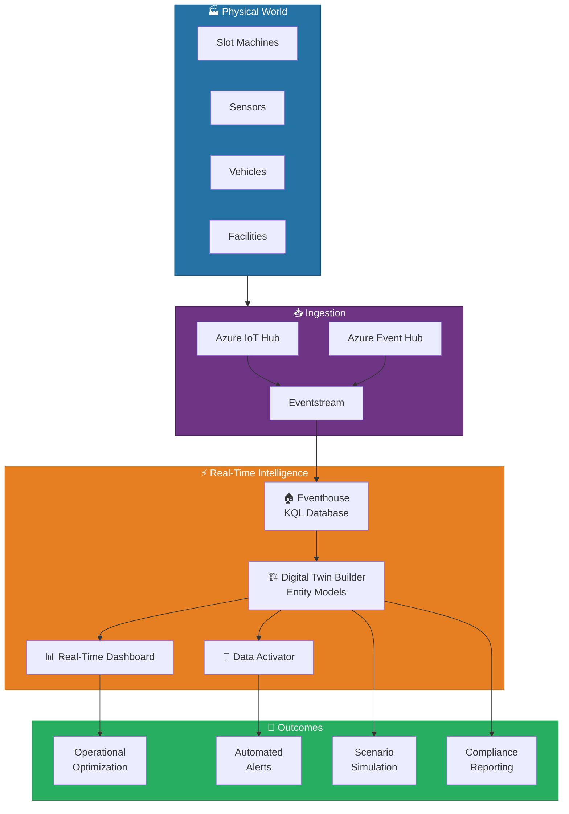
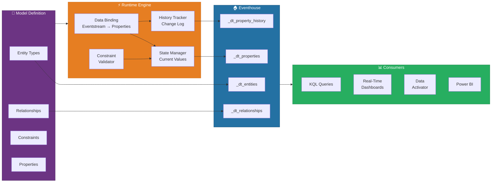
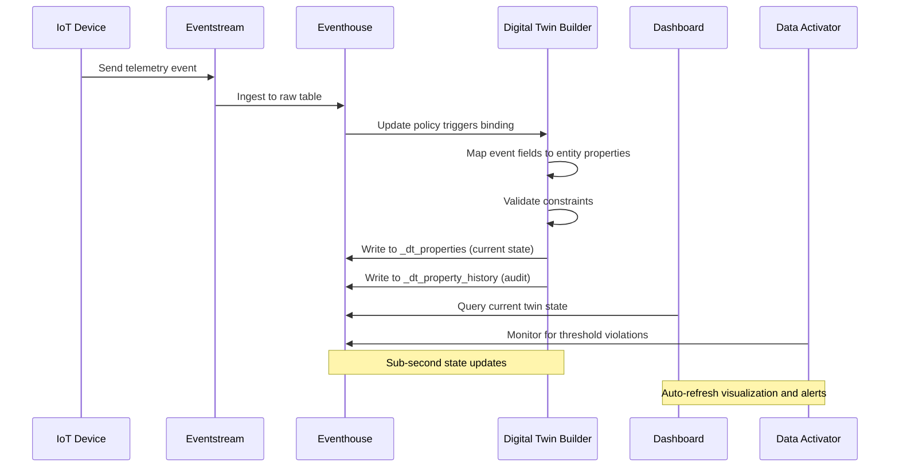
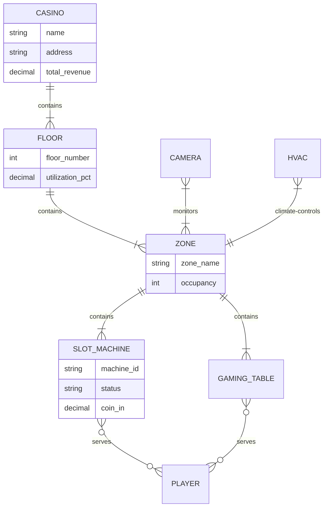
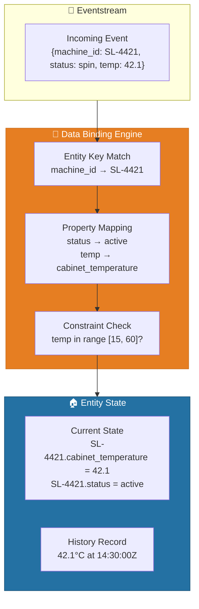
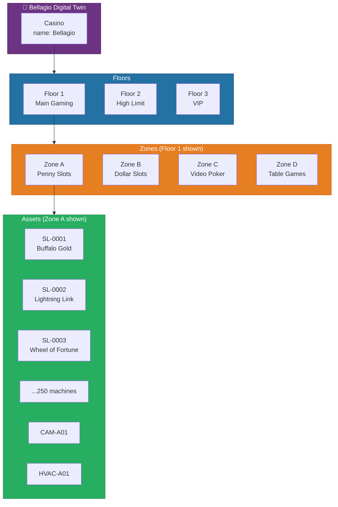
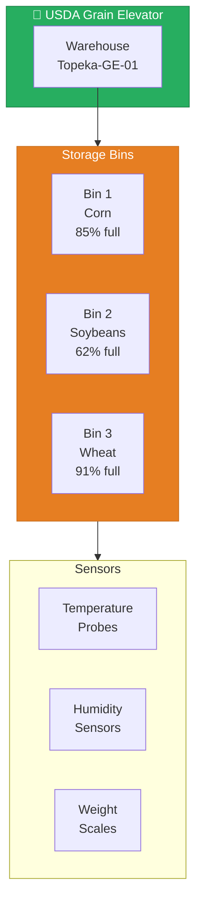
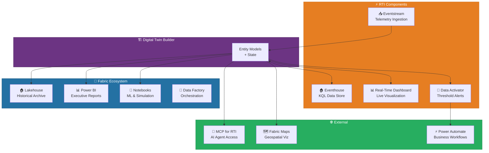

# 🏗️ Digital Twin Builder - Real-Time Entity Modeling

<div align="center" markdown>

**Data-Driven Representations of Physical Assets in Microsoft Fabric**


</div>

---

**Last Updated:** `2026-04-13` | **Version:** 1.0.0

---

## 🎯 What is Digital Twin Builder

Digital Twin Builder is a Real-Time Intelligence item in Microsoft Fabric (Preview, announced at Ignite 2024 and expanded through 2025) that creates data-driven, real-time representations of physical entities -- machines, facilities, vehicles, infrastructure, and environmental systems. By linking live telemetry streams to entity models, Digital Twin Builder enables organizations to monitor, simulate, and optimize physical operations using the same platform they already use for analytics.

Unlike standalone digital twin platforms that require separate infrastructure, Digital Twin Builder is built natively on top of Eventhouse and KQL databases within Fabric. This means every entity state update is queryable with KQL, visualizable in Real-Time Dashboards, and actionable through Data Activator -- all without moving data between systems.

### Key Capabilities

| Capability | Description |
|-----------|-------------|
| **Entity Type Modeling** | Define hierarchical entity types with static properties (metadata) and dynamic properties (telemetry) |
| **Real-Time Binding** | Map Eventstream data to entity properties for continuous state updates |
| **Relationship Graphs** | Model containment, monitoring, and dependency relationships between entities |
| **State History** | Automatically track property changes over time in the underlying KQL database |
| **Constraint Validation** | Define min/max ranges, allowed values, and required properties at the type level |
| **Visual Entity Explorer** | Browse and inspect entity instances, relationships, and current state in a graphical UI |
| **KQL Integration** | Query entity state, history, and relationships using full KQL syntax |

### Where Digital Twin Builder Fits



### Digital Twin Builder vs. Azure Digital Twins

| Aspect | Azure Digital Twins (ADT) | Fabric Digital Twin Builder |
|--------|--------------------------|----------------------------|
| **Deployment** | Standalone Azure resource | Fabric workspace item |
| **Modeling Language** | DTDL (Digital Twins Definition Language) | Visual + KQL-based type definitions |
| **Data Store** | ADT service + Azure Data Explorer | Eventhouse (native KQL database) |
| **Query Language** | ADT SQL-like query API | Full KQL |
| **Real-Time Dashboards** | Requires custom integration | Native RTI dashboard support |
| **Analytics** | Export to ADX or Synapse | Same workspace as Lakehouse, Warehouse, Power BI |
| **Alerting** | Azure Functions + Logic Apps | Data Activator (built-in) |
| **Best For** | Complex simulation, large-scale IoT | Operational monitoring integrated with Fabric analytics |

> 📝 **Note**: Digital Twin Builder does not replace Azure Digital Twins for complex simulation scenarios with millions of twins and advanced graph traversal. It is optimized for operational monitoring use cases where the twin data needs to flow seamlessly into Fabric analytics, dashboards, and alerting.

---

## 🏗️ Architecture Overview

Digital Twin Builder operates as a metadata and state management layer on top of an Eventhouse KQL database. When you create a Digital Twin Builder item, Fabric provisions internal KQL tables to store entity types, instances, relationships, and property history.

### Component Architecture



### Internal KQL Tables

Digital Twin Builder creates and manages these system tables within the Eventhouse:

| Internal Table | Purpose | Key Columns |
|---------------|---------|-------------|
| `_dt_entities` | Entity instance registry | EntityId, EntityTypeId, Name, CreatedAt, Metadata |
| `_dt_entity_types` | Type definitions | TypeId, TypeName, ParentTypeId, Schema |
| `_dt_properties` | Current property values (latest state) | EntityId, PropertyName, Value, UpdatedAt |
| `_dt_property_history` | Full change history for all properties | EntityId, PropertyName, OldValue, NewValue, ChangedAt |
| `_dt_relationships` | Edges between entities | SourceEntityId, TargetEntityId, RelationType, Metadata |

> ⚠️ **Warning**: The `_dt_` prefixed tables are managed by Digital Twin Builder. Do not modify them directly with `.alter` or `.delete` commands. Use the Digital Twin Builder UI or API to manage entity state.

### Data Flow Sequence



---

## ⚙️ Setup and Configuration

### Prerequisites

| Requirement | Details |
|------------|---------|
| **Fabric Capacity** | F64 or higher (RTI workload requires F64+ for production) |
| **RTI Workload** | Real-Time Intelligence workload enabled in workspace |
| **Eventhouse** | At least one Eventhouse provisioned in the workspace |
| **Eventstream** | Active Eventstream ingesting telemetry data (for real-time binding) |
| **Permissions** | Workspace Admin or Member role for creating Digital Twin items |
| **Region** | Available in all Fabric GA regions (Preview feature availability may vary) |

### Step 1: Provision the Eventhouse

If you do not already have an Eventhouse, create one to serve as the storage backend:

```
Workspace → + New → Eventhouse
  Name: evh-digital-twins
  Description: KQL database backing digital twin entity models
  Database: db-twin-state
```

### Step 2: Create the Digital Twin Builder Item

```
Workspace → + New → Digital Twin Builder (Preview)
  Name: dtb-casino-floor
  Description: Digital twin model for casino floor operations
  Eventhouse: evh-digital-twins
  Database: db-twin-state
```

> 📝 **Note**: The Digital Twin Builder item appears under the Real-Time Intelligence section in the workspace. If you do not see it, verify that the Preview features toggle is enabled in your tenant admin settings.

### Step 3: Define Entity Types

Use the visual entity type designer or KQL commands to define your entity type hierarchy:

```
Digital Twin Builder → Entity Types → + New Entity Type
  Name: SlotMachine
  Display Name: Slot Machine
  Description: Individual slot machine on the casino floor

  Static Properties (metadata):
  ├── machine_id (string, required, unique)
  ├── manufacturer (string)
  ├── game_title (string)
  ├── denomination (decimal)
  ├── floor_location (string)
  ├── install_date (datetime)
  └── serial_number (string)

  Dynamic Properties (telemetry):
  ├── status (string, enum: ["active","idle","error","maintenance"])
  ├── current_player_id (string, nullable)
  ├── coin_in_session (decimal, default: 0)
  ├── coin_out_session (decimal, default: 0)
  ├── error_code (string, nullable)
  ├── last_spin_time (datetime)
  ├── cabinet_temperature (decimal, unit: celsius)
  └── door_open (boolean, default: false)
```

### Step 4: Map Data Sources

Connect your Eventstream to the entity properties:

```
Digital Twin Builder → Data Bindings → + New Binding
  Source: es-slot-telemetry (Eventstream)
  Entity Type: SlotMachine
  Entity Key Mapping: $.machine_id → machine_id

  Property Mappings:
  ├── $.event_type → status (with transform: map spin→active, error→error)
  ├── $.wager → coin_in_session (aggregation: sum per session)
  ├── $.payout → coin_out_session (aggregation: sum per session)
  ├── $.error_code → error_code
  ├── $.timestamp → last_spin_time
  ├── $.cabinet_temp → cabinet_temperature
  └── $.door_sensor → door_open
```

### Step 5: Configure Relationships

Define how entities relate to each other:

```
Digital Twin Builder → Relationships → + New Relationship
  Relationship: "contains"
    Source: CasinoFloor → Target: Zone (1:many)
    Source: Zone → Target: SlotMachine (1:many)

  Relationship: "monitors"
    Source: Camera → Target: Zone (many:many)

  Relationship: "serves"
    Source: SlotMachine → Target: Player (many:many, temporal)
```

---

## 📐 Entity Modeling Patterns

### Entity Type Design Principles

Entity types in Digital Twin Builder follow a class-instance model similar to object-oriented programming. Each entity type defines a schema (properties, constraints, relationships), and instances are created from that type to represent real-world objects.

### Property Classification

| Property Type | Update Frequency | Source | Examples |
|--------------|-----------------|--------|----------|
| **Static (Metadata)** | Rarely changes | Manual entry, bulk import, or initial provisioning | Serial number, manufacturer, install date, location |
| **Dynamic (Telemetry)** | Continuous real-time updates | Eventstream binding | Temperature, status, utilization, error codes |
| **Computed** | Derived on read | KQL function or materialized view | Hold percentage, uptime ratio, time since last service |
| **Aggregate** | Periodic rollup | Materialized view update policy | Daily revenue, weekly error count, monthly utilization |

### Casino Domain Entity Types

| Entity Type | Description | Static Properties | Dynamic Properties |
|------------|-------------|-------------------|-------------------|
| **Casino** | Top-level facility | name, address, license_number, capacity | total_revenue, active_players, alert_count |
| **Floor** | Physical floor level | floor_number, square_footage, zone_count | utilization_pct, active_machines, revenue |
| **Zone** | Section within a floor | zone_id, zone_name, machine_capacity | occupancy, avg_hold_pct, error_count |
| **SlotMachine** | Individual slot device | machine_id, manufacturer, denomination | status, coin_in, coin_out, temperature |
| **GamingTable** | Table game position | table_id, game_type, min_bet, max_bet | status, active_players, drop_amount |
| **Player** | Loyalty program member | player_id, tier, enrollment_date | active_session, session_wager, last_activity |
| **Camera** | Surveillance camera | camera_id, model, resolution, location | status, feed_quality, disk_usage_pct |
| **HVAC** | Climate control unit | unit_id, zone_coverage, btu_capacity | temperature, humidity, filter_status |

### Federal Domain Entity Types

| Entity Type | Agency | Description | Static Properties | Dynamic Properties |
|------------|--------|-------------|-------------------|-------------------|
| **Warehouse** | USDA | Grain storage facility | facility_id, location, capacity_bushels | temperature, humidity, fill_level_pct, pest_alert |
| **StorageBin** | USDA | Individual bin within warehouse | bin_id, commodity_type, capacity | weight, moisture_content, last_inspection |
| **WeatherStation** | NOAA | Observation station | station_id, lat, lon, elevation | temperature, wind_speed, pressure, precipitation |
| **Radar** | NOAA | NEXRAD radar installation | radar_id, location, range_nm | operational_status, volume_scan_time, calibration |
| **TreatmentPlant** | EPA | Water treatment facility | facility_id, permit_number, capacity_mgd | flow_rate, ph_level, chlorine_residual, turbidity |
| **AirMonitor** | EPA | Air quality monitoring station | station_id, pollutants_tracked, location | pm25, pm10, ozone, aqi_category |
| **ParkSite** | DOI | National park location | park_code, name, acreage | visitor_count, trail_status, fire_danger_level |
| **Seismograph** | DOI | Seismic monitoring station | station_id, network, lat, lon | last_event_mag, noise_level, data_quality |
| **Runway** | DOT/FAA | Airport runway | runway_id, airport_code, length_ft | surface_condition, visibility, wind_crosswind |
| **Aircraft** | DOT/FAA | Aircraft in flight | tail_number, aircraft_type, airline | altitude, speed, heading, delay_minutes |

### Relationship Types



| Relationship | Cardinality | Description | Example |
|-------------|-------------|-------------|---------|
| **contains** | 1:many | Hierarchical parent-child ownership | Floor contains Zones; Zone contains Machines |
| **monitors** | many:many | Surveillance or observation coverage | Camera monitors multiple Zones |
| **serves** | many:many, temporal | Service relationship with time bounds | Machine serves Player during a session |
| **adjacent-to** | many:many | Physical proximity relationship | Zone A is adjacent to Zone B |
| **depends-on** | 1:many | Operational dependency | Machine depends on HVAC for cooling |
| **climate-controls** | 1:1 | Environmental control assignment | HVAC unit controls one Zone |

---

## 🔄 Real-Time Data Binding

### Binding Architecture

Data bindings connect Eventstream telemetry fields to entity properties. When new events arrive, the binding engine matches each event to the correct entity instance (via the entity key), extracts the mapped fields, and updates the entity state.



### Binding Configuration

```json
{
    "binding_name": "slot-telemetry-binding",
    "source": {
        "type": "eventstream",
        "name": "es-slot-telemetry",
        "format": "JSON"
    },
    "entity_type": "SlotMachine",
    "entity_key": {
        "event_field": "$.machine_id",
        "entity_property": "machine_id"
    },
    "property_mappings": [
        {
            "event_field": "$.event_type",
            "entity_property": "status",
            "transform": {
                "type": "value_map",
                "mappings": {
                    "spin": "active",
                    "idle": "idle",
                    "error": "error",
                    "maintenance": "maintenance"
                }
            }
        },
        {
            "event_field": "$.cabinet_temp",
            "entity_property": "cabinet_temperature",
            "transform": null
        },
        {
            "event_field": "$.wager",
            "entity_property": "coin_in_session",
            "transform": {
                "type": "accumulate",
                "reset_on": "session_change"
            }
        }
    ],
    "history_tracking": {
        "enabled": true,
        "retention_days": 90,
        "track_properties": ["status", "cabinet_temperature", "error_code"]
    }
}
```

### KQL Queries for Entity State Updates

Once bindings are active, entity state is queryable through standard KQL:

```kql
// Get current state of all slot machines on Floor 2
_dt_entities
| where EntityType == "SlotMachine"
| join kind=inner (
    _dt_properties
    | where PropertyName in ("status", "coin_in_session", "cabinet_temperature", "floor_location")
    | summarize Properties = make_bag(pack(PropertyName, Value)) by EntityId
) on EntityId
| extend
    Status = tostring(Properties["status"]),
    CoinIn = todouble(Properties["coin_in_session"]),
    Temperature = todouble(Properties["cabinet_temperature"]),
    Location = tostring(Properties["floor_location"])
| where Location startswith "Floor 2"
| project Name, Status, CoinIn, Temperature, Location
| order by CoinIn desc
```

```kql
// Track property changes over the last hour for a specific machine
_dt_property_history
| where EntityId == "SL-4421"
| where ChangedAt > ago(1h)
| where PropertyName == "status"
| project ChangedAt, PropertyName, OldValue, NewValue
| order by ChangedAt desc
```

### Refresh Intervals and Latency

| Configuration | Latency | CU Impact | Use Case |
|--------------|---------|-----------|----------|
| **Real-time binding (default)** | Sub-second | Higher | Critical operational monitoring |
| **Micro-batch (5s window)** | 5 seconds | Moderate | Standard telemetry with acceptable delay |
| **Batch (30s window)** | 30 seconds | Lower | Non-critical state updates |
| **On-demand** | Manual trigger | Minimal | Static property refresh, bulk import |

> 💡 **Tip**: Use real-time binding only for properties that require immediate state reflection (status, alerts, safety-critical sensors). Configure less critical properties like temperature trending on 5-second micro-batch to reduce CU consumption.

---

## 🎰 Casino Floor Use Case

### Scenario Overview

A casino floor with 3 floors, 12 zones, 1,500 slot machines, 200 table games, 150 surveillance cameras, and 30 HVAC units. The digital twin provides a unified, real-time view of all physical assets and their operational state.

### Entity Hierarchy



### Real-Time Floor Monitoring KQL Queries

```kql
// Floor utilization dashboard: machines by status per zone
_dt_entities
| where EntityType == "SlotMachine"
| join kind=inner (
    _dt_properties
    | where PropertyName in ("status", "floor_location")
    | summarize Properties = make_bag(pack(PropertyName, Value)) by EntityId
) on EntityId
| extend
    Status = tostring(Properties["status"]),
    Zone = tostring(Properties["floor_location"])
| summarize
    Active = countif(Status == "active"),
    Idle = countif(Status == "idle"),
    Error = countif(Status == "error"),
    Maintenance = countif(Status == "maintenance"),
    Total = count()
    by Zone
| extend UtilizationPct = round(todouble(Active) / Total * 100, 1)
| order by UtilizationPct desc
```

```kql
// Identify machines with abnormal cabinet temperature (overheat risk)
_dt_entities
| where EntityType == "SlotMachine"
| join kind=inner (
    _dt_properties
    | where PropertyName in ("cabinet_temperature", "status", "floor_location")
    | summarize Properties = make_bag(pack(PropertyName, Value)) by EntityId
) on EntityId
| extend
    Temperature = todouble(Properties["cabinet_temperature"]),
    Status = tostring(Properties["status"]),
    Location = tostring(Properties["floor_location"])
| where Temperature > 55.0  // Warning threshold
| project Name, Temperature, Status, Location
| order by Temperature desc
```

```kql
// Revenue by zone using twin relationships (last 4 hours)
_dt_relationships
| where RelationType == "contains" and SourceEntityType == "Zone"
| join kind=inner (
    _dt_properties
    | where PropertyName == "coin_in_session"
    | project EntityId, CoinIn = todouble(Value)
) on $left.TargetEntityId == $right.EntityId
| join kind=inner (
    _dt_entities | where EntityType == "Zone" | project EntityId, ZoneName = Name
) on $left.SourceEntityId == $right.EntityId
| summarize TotalCoinIn = sum(CoinIn), MachineCount = dcount(TargetEntityId) by ZoneName
| extend AvgPerMachine = round(TotalCoinIn / MachineCount, 2)
| order by TotalCoinIn desc
```

### Data Activator Alerts from Twin State

| Alert | Twin Property | Condition | Action |
|-------|--------------|-----------|--------|
| Machine Overheat | SlotMachine.cabinet_temperature | > 60°C for 5+ min | Page floor technician + auto-disable machine |
| Zone Underutilization | Zone.utilization_pct | < 20% for 2+ hours | Notify floor manager for rebalancing |
| Door Tamper | SlotMachine.door_open | true AND status != maintenance | Alert security + trigger camera review |
| Error Cluster | Zone.error_count | > 5 machines in error within 15min | Alert maintenance supervisor |
| HVAC Failure | HVAC.filter_status | "blocked" or temperature drift > 5°C | Facilities work order + player safety notification |

---

## 🏛️ Federal Facility Use Cases

### 🌾 USDA: Grain Storage Facility Monitoring

Monitor temperature, humidity, and fill levels across grain storage warehouses to prevent spoilage and optimize inventory.



**Key monitoring queries:**

```kql
// Bins at risk of spoilage (high temp + high moisture)
_dt_entities
| where EntityType == "StorageBin"
| join kind=inner (
    _dt_properties
    | where PropertyName in ("temperature", "moisture_content", "commodity_type", "fill_level_pct")
    | summarize Properties = make_bag(pack(PropertyName, Value)) by EntityId
) on EntityId
| extend
    Temperature = todouble(Properties["temperature"]),
    Moisture = todouble(Properties["moisture_content"]),
    Commodity = tostring(Properties["commodity_type"]),
    FillLevel = todouble(Properties["fill_level_pct"])
| where Temperature > 30 and Moisture > 14  // Spoilage risk thresholds
| project Name, Commodity, Temperature, Moisture, FillLevel
| order by Temperature desc
```

### 🌀 NOAA: Weather Station Network

Create a digital twin of the entire NOAA weather observation network with real-time sensor feeds.

**Entity hierarchy:** Network > Region > Station > Sensor

**Key monitoring queries:**

```kql
// Stations reporting anomalous readings (potential sensor malfunction)
_dt_entities
| where EntityType == "WeatherStation"
| join kind=inner (
    _dt_properties
    | where PropertyName in ("temperature", "wind_speed", "pressure", "operational_status")
    | summarize Properties = make_bag(pack(PropertyName, Value)) by EntityId
) on EntityId
| extend
    Temp = todouble(Properties["temperature"]),
    Wind = todouble(Properties["wind_speed"]),
    Pressure = todouble(Properties["pressure"]),
    Status = tostring(Properties["operational_status"])
| where Temp < -60 or Temp > 60 or Wind > 200 or Pressure < 870 or Pressure > 1085
| project Name, Temp, Wind, Pressure, Status
```

### 🌊 EPA: Water Treatment Plant Monitoring

Monitor critical water quality parameters in real time to ensure regulatory compliance and public safety.

**Entity hierarchy:** Region > TreatmentPlant > ProcessStage > Sensor

**Key monitoring queries:**

```kql
// Plants with pH or turbidity out of compliance range
_dt_entities
| where EntityType == "TreatmentPlant"
| join kind=inner (
    _dt_properties
    | where PropertyName in ("ph_level", "turbidity", "chlorine_residual", "flow_rate")
    | summarize Properties = make_bag(pack(PropertyName, Value)) by EntityId
) on EntityId
| extend
    pH = todouble(Properties["ph_level"]),
    Turbidity = todouble(Properties["turbidity"]),
    Chlorine = todouble(Properties["chlorine_residual"]),
    FlowRate = todouble(Properties["flow_rate"])
| where pH < 6.5 or pH > 8.5 or Turbidity > 4.0  // EPA Safe Drinking Water Act limits
| project Name, pH, Turbidity, Chlorine, FlowRate
| order by Turbidity desc
```

> ⚠️ **Warning**: EPA Safe Drinking Water Act compliance requires continuous monitoring of disinfectant residual and turbidity. Treatment plants exceeding Maximum Contaminant Levels (MCLs) must notify their state primacy agency within 24 hours.

### 🏔️ DOI: National Park Visitor Flow and Resource Management

Model national park infrastructure including trails, campgrounds, visitor centers, and natural resources for capacity management and safety.

**Entity hierarchy:** Park > District > Site (Trail, Campground, Center) > Sensor

**Key monitoring queries:**

```kql
// Parks exceeding visitor capacity thresholds
_dt_entities
| where EntityType == "ParkSite"
| join kind=inner (
    _dt_properties
    | where PropertyName in ("visitor_count", "capacity", "trail_status", "fire_danger_level")
    | summarize Properties = make_bag(pack(PropertyName, Value)) by EntityId
) on EntityId
| extend
    Visitors = toint(Properties["visitor_count"]),
    Capacity = toint(Properties["capacity"]),
    FireDanger = tostring(Properties["fire_danger_level"])
| extend OccupancyPct = round(todouble(Visitors) / Capacity * 100, 1)
| where OccupancyPct > 85 or FireDanger in ("Very High", "Extreme")
| project Name, Visitors, Capacity, OccupancyPct, FireDanger
| order by OccupancyPct desc
```

### ✈️ DOT/FAA: Airport and Runway Digital Twin

Model airport infrastructure with real-time runway conditions, gate assignments, and aircraft positions for operational awareness.

**Entity hierarchy:** Airport > Terminal > Gate; Airport > Runway; Airspace > Aircraft

**Key monitoring queries:**

```kql
// Runway status overview with weather conditions
_dt_entities
| where EntityType == "Runway"
| join kind=inner (
    _dt_properties
    | where PropertyName in ("surface_condition", "visibility", "wind_crosswind", "airport_code")
    | summarize Properties = make_bag(pack(PropertyName, Value)) by EntityId
) on EntityId
| extend
    Surface = tostring(Properties["surface_condition"]),
    Visibility = todouble(Properties["visibility"]),
    Crosswind = todouble(Properties["wind_crosswind"]),
    Airport = tostring(Properties["airport_code"])
| where Surface != "dry" or Visibility < 3.0 or Crosswind > 15.0
| project Airport, Name, Surface, Visibility, Crosswind
| order by Visibility asc
```

---

## 🔌 Integration Points

Digital Twin Builder integrates with the full Fabric RTI stack and broader Fabric ecosystem. Each integration point serves a distinct operational need.

### Integration Architecture



### Integration Details

| Integration | Purpose | Data Flow | Configuration |
|------------|---------|-----------|---------------|
| **Eventhouse** | Persistent storage for all twin state and history | Bidirectional | Automatic -- created with DTB item |
| **Eventstream** | Real-time telemetry ingestion | Eventstream → DTB | Data binding configuration (see Setup) |
| **Real-Time Dashboard** | Visual monitoring of twin state | DTB → Dashboard via KQL | Create tiles querying `_dt_*` tables |
| **Data Activator** | Automated alerting on twin property thresholds | DTB state → Activator conditions | Monitor twin properties for threshold violations |
| **Lakehouse** | Long-term archival of twin state history | DTB → Lakehouse (scheduled copy) | Data pipeline or shortcut to `_dt_property_history` |
| **Power BI** | Executive reporting on twin analytics | DTB → Semantic Model → PBI | Direct Lake mode on Lakehouse archive |
| **Notebooks** | ML model training, anomaly detection, simulation | Read twin state via KQL | Use `kusto` connector in PySpark notebooks |
| **MCP for RTI** | AI agent interaction with twin data | Agent ↔ DTB via natural language | MCP server configured to Eventhouse endpoint |
| **Fabric Maps** | Geospatial visualization of entity locations | DTB lat/lon properties → Map visual | Configure map tile with entity location properties |
| **Power Automate** | Business workflow automation on alerts | Data Activator → Power Automate | Flow triggered by Activator action |

### MCP for RTI: AI Agent Interaction

When combined with MCP for RTI, AI agents can query and reason about digital twin state using natural language:

```python
# Example: AI agent querying twin state through MCP
# Agent prompt: "What slot machines on Floor 2 are currently in error status?"

# MCP translates to KQL and executes against Eventhouse
# Returns structured entity data to the agent for reasoning
```

> 💡 **Tip**: Combining Digital Twin Builder with MCP for RTI enables AI-powered operations assistants that can monitor entity state, answer natural language questions about facility status, and recommend actions based on twin data patterns.

---

## ⚡ Performance Considerations

### Entity Count and Scale Limits

| Dimension | Preview Limit | Expected GA Limit | Recommendation |
|-----------|--------------|-------------------|----------------|
| **Entity types per twin** | 50 | 200 | Group related entities under common types |
| **Entity instances per type** | 100,000 | 1,000,000 | Use hierarchy to distribute across types |
| **Properties per entity type** | 100 | 500 | Separate static and dynamic schemas |
| **Relationships per entity** | 50 | 200 | Model only operationally relevant relationships |
| **Property updates per second** | 10,000 | 100,000 | Batch low-priority updates in micro-batch mode |
| **History retention** | 90 days (configurable) | 365 days | Archive to Lakehouse for longer retention |

### Property Update Frequency

| Update Frequency | CU Impact | Recommended For |
|-----------------|-----------|-----------------|
| Every event (1-10ms) | Very High | Safety-critical: door sensors, fire alarms, runway conditions |
| Sub-second (100ms-1s) | High | Operational: machine status, error codes |
| Micro-batch (5s) | Moderate | Standard telemetry: temperature, utilization |
| Batch (30s-60s) | Low | Informational: aggregated metrics, trends |
| On-demand | Minimal | Static metadata: location changes, configuration |

### KQL Optimization for Twin Queries

```kql
// GOOD: Filter entity type early, project only needed properties
_dt_entities
| where EntityType == "SlotMachine"
| join kind=inner (
    _dt_properties
    | where PropertyName == "status"
    | project EntityId, Status = Value
) on EntityId
| where Status == "error"
| project Name, Status

// BAD: Fetching all properties then filtering
_dt_properties
| summarize Properties = make_bag(pack(PropertyName, Value)) by EntityId
| join kind=inner _dt_entities on EntityId
| where EntityType == "SlotMachine"
| where tostring(Properties["status"]) == "error"
```

### Capacity Consumption Estimates

| Workload | Entity Count | Updates/sec | Est. CU (F64) |
|----------|-------------|-------------|---------------|
| Casino Floor (single property) | 1,500 machines | 500 | 3-5% |
| Casino Floor (full twin) | 2,000 entities total | 2,000 | 8-12% |
| NOAA Weather Network | 10,000 stations | 1,000 | 5-8% |
| EPA Treatment Plants | 500 facilities | 200 | 2-3% |
| DOI Park Sites | 1,000 sites | 100 | 1-2% |
| DOT/FAA Airport (single) | 500 entities | 300 | 2-4% |

> 📝 **Note**: CU consumption varies significantly based on query complexity, dashboard refresh rates, and the number of tracked properties. Monitor consumption using `.show capacity` commands and adjust binding refresh intervals accordingly.

---

## ⚠️ Limitations and Preview Status

### Preview Limitations

Digital Twin Builder is in Public Preview as of early 2026. The following limitations apply during the preview period:

| Limitation | Details | Expected Resolution |
|-----------|---------|-------------------|
| **No DTDL Import** | Cannot import existing Azure Digital Twins models via DTDL | GA release -- DTDL import/export planned |
| **Limited Visualization** | Entity explorer is read-only; no 3D visualization | Post-GA -- 3D rendering with custom visuals |
| **No Simulation Engine** | Cannot run "what-if" scenarios on twin state | Post-GA -- simulation mode planned |
| **Single Eventhouse** | Each twin item is bound to one Eventhouse | GA release -- multi-database support |
| **No Cross-Workspace Twins** | Twins cannot span multiple workspaces | Future -- aligned with Data Mesh workspace federation |
| **API Availability** | REST API for twin management is limited | GA release -- full CRUD API |
| **History Retention** | Property history limited to configured retention in Eventhouse | Use Lakehouse archival for longer retention |
| **Event Ordering** | Out-of-order events may cause temporary state inconsistency | Use event timestamp for proper ordering in bindings |

### Feature Roadmap (Expected)

| Timeframe | Feature | Description |
|-----------|---------|-------------|
| **GA (2026 H2)** | DTDL Import/Export | Migrate existing Azure Digital Twins models |
| **GA (2026 H2)** | Full REST API | Programmatic entity management |
| **GA (2026 H2)** | Multi-database | Twin spanning multiple Eventhouse databases |
| **Post-GA** | Simulation Mode | What-if analysis on twin state |
| **Post-GA** | 3D Visualization | Custom 3D renders of physical layouts |
| **Post-GA** | Copilot Integration | Natural language twin queries via Fabric IQ |
| **Post-GA** | Cross-Workspace | Federated twins across Data Mesh domains |

### What is Not Supported

The following capabilities are not in scope for Digital Twin Builder and should be addressed with other tools:

| Capability | Alternative |
|-----------|-------------|
| Complex physics simulation | Azure Digital Twins + Azure HPC |
| 3D BIM model rendering | Azure Digital Twins + 3D Scenes Studio |
| Device provisioning and management | Azure IoT Hub Device Provisioning Service |
| Edge computing and offline scenarios | Azure IoT Edge |
| Millions of twin instances | Azure Digital Twins (purpose-built for massive scale) |

> ⚠️ **Warning**: Do not use Digital Twin Builder for safety-critical control systems. It is designed for monitoring and analytics, not closed-loop control. Safety-critical control should use dedicated SCADA/PLC systems with appropriate safety certifications.

---

## 📚 References

| Resource | URL |
|----------|-----|
| Digital Twin Builder Overview | https://learn.microsoft.com/fabric/real-time-intelligence/digital-twin-builder |
| Real-Time Intelligence Overview | https://learn.microsoft.com/fabric/real-time-intelligence/overview |
| Eventhouse Documentation | https://learn.microsoft.com/fabric/real-time-intelligence/eventhouse |
| Eventstream Documentation | https://learn.microsoft.com/fabric/real-time-intelligence/event-streams/overview |
| Data Activator | https://learn.microsoft.com/fabric/real-time-intelligence/data-activator/data-activator-introduction |
| Azure Digital Twins (for comparison) | https://learn.microsoft.com/azure/digital-twins/overview |
| KQL Reference | https://learn.microsoft.com/kusto/query/ |
| Fabric Capacity Planning | https://learn.microsoft.com/fabric/enterprise/licenses |

---

## 🔗 Related Documents

- [Real-Time Intelligence](real-time-intelligence.md) -- RTI components that power Digital Twin Builder
- [Fabric IQ](fabric-iq.md) -- Natural language querying for twin data
- [AI Copilot Configuration](ai-copilot-configuration.md) -- KQL Copilot for Eventhouse twin queries
- [Data Mesh Enterprise Patterns](data-mesh-enterprise-patterns.md) -- Cross-domain twin architecture
- [Architecture](../ARCHITECTURE.md) -- System architecture overview

---

> 📝 **Document Metadata**
> - **Author**: Documentation Team
> - **Reviewers**: Data Engineering, RTI Team, IoT Architecture, Compliance
> - **Classification**: Internal
> - **Next Review**: 2026-07-13
