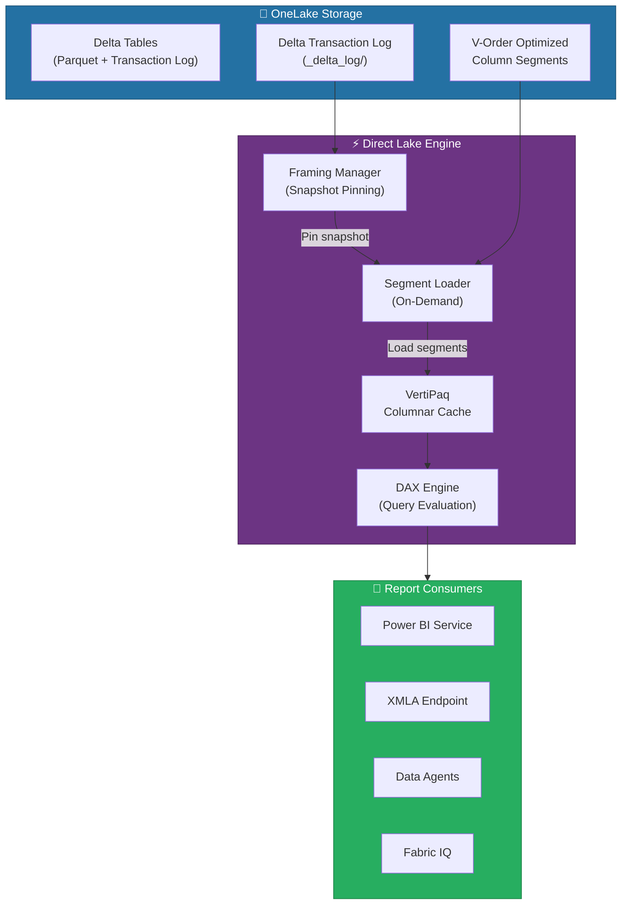
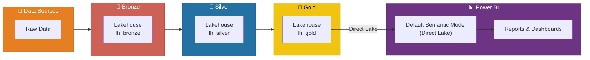
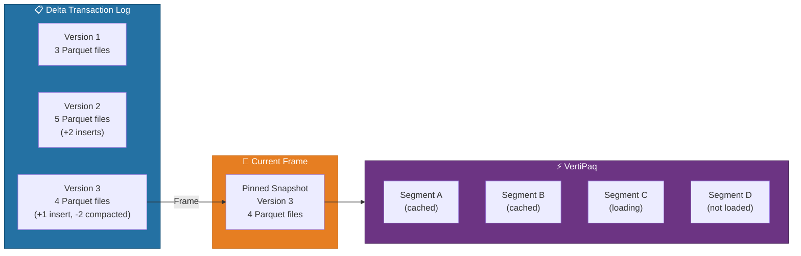
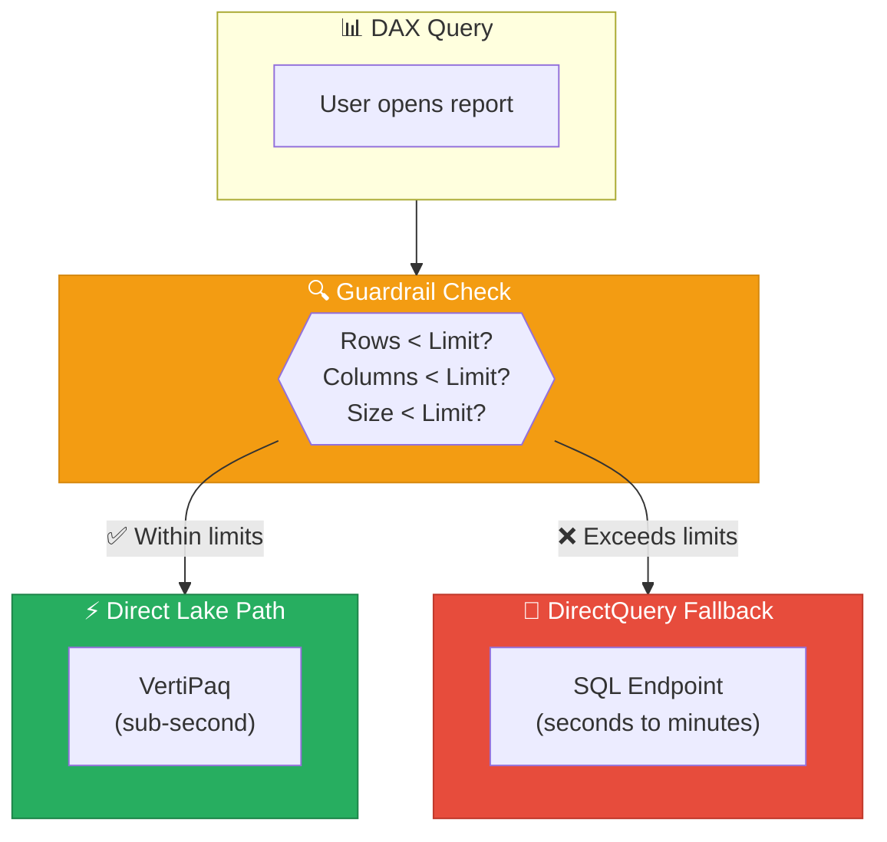
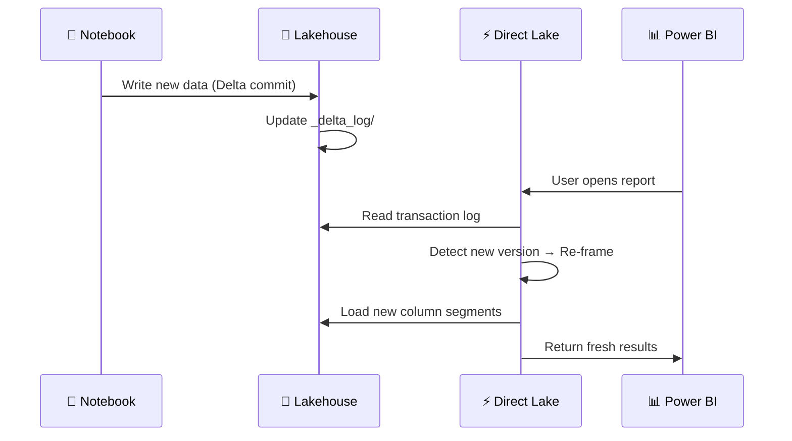
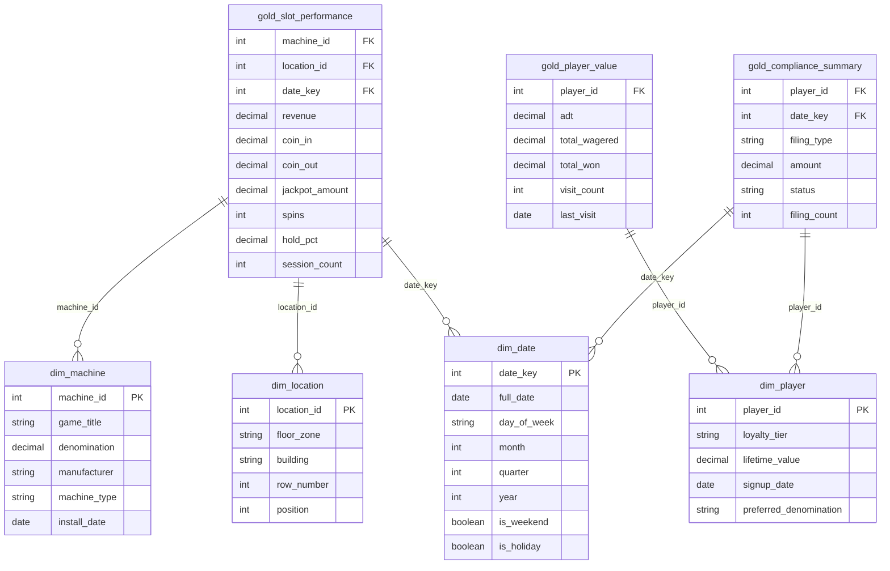
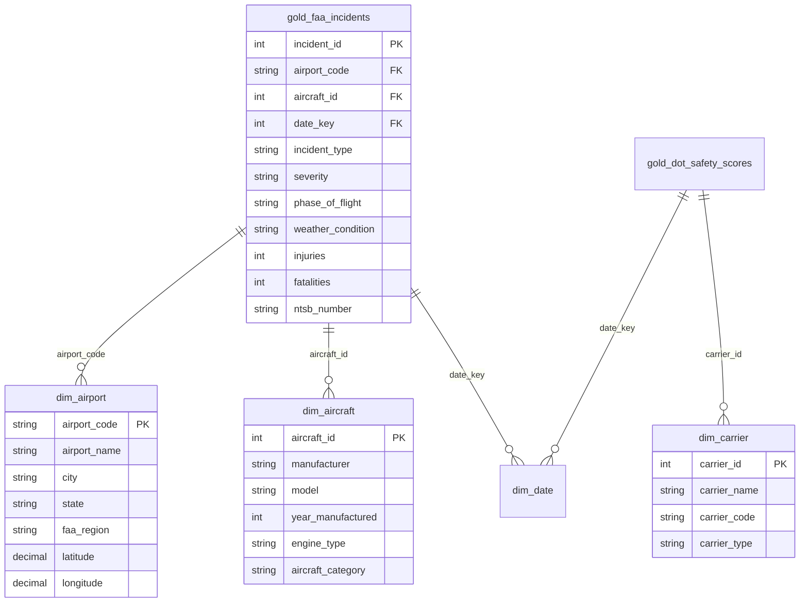
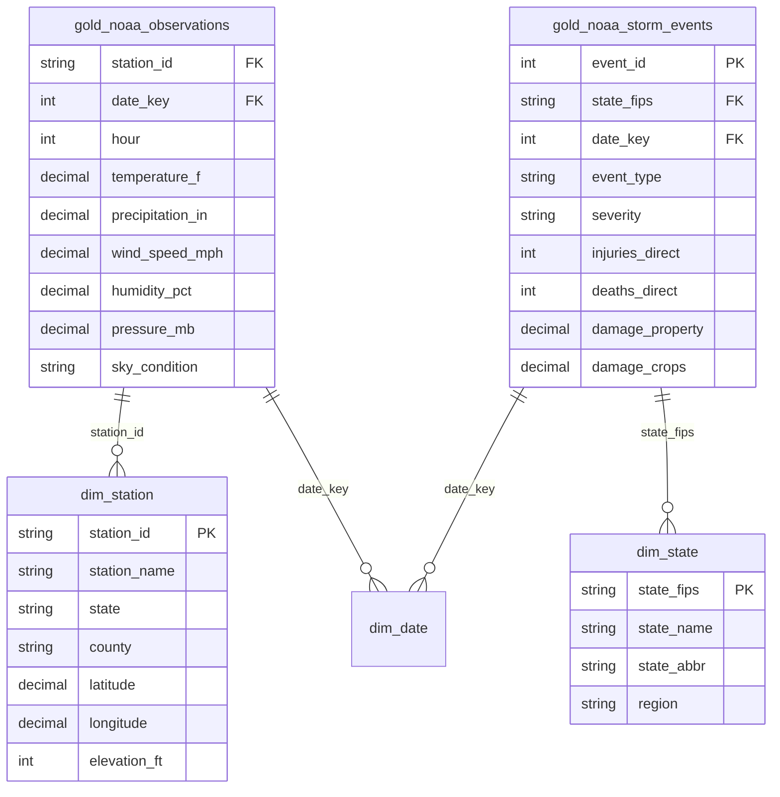
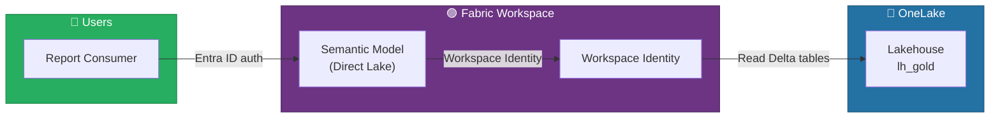

[Home](../index.md) > [Docs](../) > [Features](./) > Direct Lake

# ⚡ Direct Lake - Zero-Copy Power BI over OneLake


<div align="center" markdown>

**Sub-Second Analytics Directly from Delta Lake — No Import, No DirectQuery**


</div>

---

**Last Updated:** `2026-04-13` | **Version:** 1.0.0

---

## 📑 Table of Contents

- [🎯 Overview](#-overview)
- [🏗️ Architecture](#️-architecture)
- [⚙️ Configuration](#️-configuration)
- [📊 Framing & Performance](#-framing--performance)
- [📏 Guardrails & Fallback](#-guardrails--fallback)
- [🔄 Refresh & Sync](#-refresh--sync)
- [🎰 Casino Implementation](#-casino-implementation)
- [🏛️ Federal Agency Implementation](#️-federal-agency-implementation)
- [🔐 Security](#-security)
- [⚠️ Limitations](#️-limitations)
- [📚 References](#-references)

---

## 🎯 Overview

Direct Lake is Microsoft Fabric's revolutionary connectivity mode for Power BI that reads Delta and Parquet files directly from OneLake without importing data into the semantic model or issuing live queries through a SQL endpoint. It combines the performance of Import mode (in-memory columnar engine) with the freshness of DirectQuery (always up-to-date data), eliminating the traditional trade-off between speed and currency that has defined Power BI deployments for a decade.

### Why Direct Lake Matters

In traditional Power BI, organizations must choose between two imperfect options:

| Mode | Advantage | Disadvantage |
|------|-----------|--------------|
| **Import** | Sub-second queries via in-memory VertiPaq engine | Data becomes stale; scheduled refreshes consume capacity; dataset size limits |
| **DirectQuery** | Always-current data with no duplication | Slower queries; SQL endpoint pressure; complex DAX can timeout |

Direct Lake eliminates this trade-off by reading Delta/Parquet column segments directly from OneLake storage into the VertiPaq engine on demand. No ETL import pipeline, no SQL translation layer — the analysis engine reads columnar data natively.

### Key Capabilities

| Capability | Description |
|-----------|-------------|
| **Zero-Copy Access** | Reads Delta/Parquet files directly from OneLake — no data duplication |
| **Import-Like Performance** | Loads column segments into VertiPaq on demand for sub-second DAX evaluation |
| **Automatic Freshness** | Reflects Delta table changes without scheduled refresh |
| **V-Order Optimization** | Fabric-optimized write format that maximizes Direct Lake read performance |
| **Transparent Fallback** | Falls back to DirectQuery automatically when guardrails are exceeded |
| **Default in Fabric** | Every Lakehouse and Warehouse semantic model uses Direct Lake by default |

### GA Milestones

| Date | Milestone |
|------|-----------|
| November 2023 | Direct Lake public preview with Fabric GA |
| March 2024 | Framing improvements and expanded SKU support |
| September 2024 | Direct Lake on Warehouse (preview) |
| February 2025 | DirectLakeBehavior property GA |
| April 2025 | Composite models with Direct Lake GA |
| November 2025 | Direct Lake on Warehouse GA; V-Order v2 improvements |
| March 2026 | Lakehouse schemas support; expanded guardrails on F64+ |

---

## 🏗️ Architecture

Direct Lake introduces a fundamentally different data flow compared to Import and DirectQuery. Understanding this architecture is essential for optimizing performance and diagnosing query behavior.

### Data Flow Comparison

```mermaid
flowchart TB
    subgraph Import["📦 Import Mode"]
        IS["Data Source"] --> IE["ETL / Refresh"] --> IV["VertiPaq<br/>In-Memory Store"] --> IR["DAX Query<br/>Engine"]
        IR --> IU["📊 Report"]
    end

    subgraph DQ["🔗 DirectQuery Mode"]
        DS["Data Source"] --> DG["SQL Endpoint"] --> DT["SQL Translation<br/>Layer"] --> DU["📊 Report"]
    end

    subgraph DL["⚡ Direct Lake Mode"]
        DF["Delta/Parquet<br/>in OneLake"] --> DV["VertiPaq<br/>On-Demand Load"] --> DR["DAX Query<br/>Engine"]
        DR --> DD["📊 Report"]
    end

    style Import fill:#2471A3,stroke:#1A5276,color:#fff
    style DQ fill:#E67E22,stroke:#CA6F1E,color:#fff
    style DL fill:#6C3483,stroke:#4A235A,color:#fff
```



### Direct Lake Internal Architecture



### How Direct Lake Reads Data

1. **Delta Transaction Log** — When a query arrives, the framing manager reads the Delta transaction log to identify the current set of Parquet files (the "frame")
2. **Snapshot Pinning** — The engine pins a consistent snapshot, ensuring all tables in the semantic model reflect the same point-in-time state
3. **On-Demand Segment Loading** — Only the column segments needed by the query are loaded from OneLake into the VertiPaq cache
4. **DAX Evaluation** — The DAX engine evaluates the query against in-memory columnar data, achieving sub-second performance
5. **Cache Reuse** — Loaded segments remain in memory until evicted by memory pressure or a new frame

> 💡 **Tip**: Unlike Import mode, Direct Lake does not load all data upfront. It loads column segments on demand per query, so the first query after a new frame may be slightly slower (cold query) while subsequent queries reuse cached segments (warm query).

### Where Direct Lake Fits in the Medallion Architecture



> 📝 **Note**: Direct Lake is designed to read from the **Gold layer** of the medallion architecture. Build your star schema, aggregations, and KPI tables in the Gold Lakehouse, then let Direct Lake serve them to Power BI with zero data movement.

---

## ⚙️ Configuration

### Default Semantic Model (Automatic)

Every Lakehouse and Warehouse in Microsoft Fabric automatically generates a default semantic model that uses Direct Lake mode. No configuration is required — when you create tables in your Lakehouse, they appear in the default semantic model immediately.

```
Fabric Workspace → Lakehouse (lh_gold)
  ├── Tables/
  │   ├── gold_slot_performance        ← Auto-exposed in semantic model
  │   ├── gold_player_value            ← Auto-exposed in semantic model
  │   └── gold_compliance_summary      ← Auto-exposed in semantic model
  └── Default Semantic Model (Direct Lake)
      └── All tables above are automatically available
```

> 📝 **Note**: The default semantic model includes all tables in the Lakehouse. You cannot selectively exclude tables from the default model. For curated models with a subset of tables, create a custom semantic model.

### Creating a Custom Semantic Model

For production deployments, create a dedicated semantic model with curated tables, relationships, measures, and hierarchies:

1. **From the Workspace** — Select **New Item** → **Semantic Model** → Choose **Lakehouse** or **Warehouse** as source
2. **Select Tables** — Pick only the Gold-layer tables needed for your reports
3. **Define Relationships** — Create star schema relationships between fact and dimension tables
4. **Add Measures** — Write DAX measures for KPIs, calculated ratios, and time intelligence
5. **Set Properties** — Configure display folders, formatting, descriptions, and synonyms

```
New Semantic Model → Source: lh_gold (Lakehouse)
  ├── Select Tables:
  │   ├── ✅ gold_slot_performance (fact)
  │   ├── ✅ gold_player_value (fact)
  │   ├── ✅ dim_machine
  │   ├── ✅ dim_location
  │   ├── ✅ dim_date
  │   └── ❌ gold_raw_audit_log (excluded)
  ├── Relationships:
  │   ├── gold_slot_performance[machine_id] → dim_machine[machine_id]
  │   ├── gold_slot_performance[location_id] → dim_location[location_id]
  │   └── gold_slot_performance[date_key] → dim_date[date_key]
  └── Measures:
      ├── [Total Revenue] = SUM(gold_slot_performance[revenue])
      ├── [Hold %] = DIVIDE([Total Revenue], [Total Coin-In])
      └── [Revenue YoY] = ... (time intelligence)
```

### XMLA Endpoint Configuration

The XMLA read/write endpoint enables third-party tools (Tabular Editor, ALM Toolkit, DAX Studio) to connect to Direct Lake semantic models for advanced development:

```
Fabric Admin Portal → Tenant Settings
  └── Integration Settings
      └── Allow XMLA endpoints and Analyze in Excel
          → Enabled for: Entire organization (or specific security groups)

Workspace Settings → Premium/Fabric
  └── XMLA Endpoint: Read/Write
```

**Connecting with Tabular Editor:**

```
Server: powerbi://api.powerbi.com/v1.0/myorg/WorkspaceName
Database: SemanticModelName
Authentication: Azure Active Directory (Interactive or Service Principal)
```

### Tabular Editor Workflow

Tabular Editor is the recommended tool for advanced Direct Lake semantic model development:

| Task | Tabular Editor Feature |
|------|----------------------|
| **Bulk Measure Creation** | Script editor with C# macros for generating measures programmatically |
| **Relationship Management** | Visual diagram view for star schema design |
| **Display Folder Organization** | Drag-and-drop folder assignment for measures and columns |
| **Best Practice Analyzer** | Built-in rules that flag common Direct Lake anti-patterns |
| **Deployment** | Deploy changes to Dev/Test/Prod workspaces via XMLA |
| **Source Control** | Export model metadata to JSON for Git version control |

> 💡 **Tip**: Use Tabular Editor's Best Practice Analyzer with the Direct Lake-specific rule set. It flags issues like calculated columns (which force DirectQuery fallback), unnecessary bi-directional relationships, and missing V-Order optimization hints.

### Verifying Direct Lake Mode

Confirm that your semantic model is using Direct Lake (not Import or DirectQuery):

**In Power BI Service:**
```
Semantic Model → Settings → Model Settings
  └── Storage Mode: Direct Lake ✅
```

**Via DAX Studio:**
```dax
// Check storage mode for each table
SELECT
    [Name] AS TableName,
    [StorageMode] AS StorageMode
FROM $SYSTEM.TMSCHEMA_TABLES
WHERE [StorageMode] <> 0
```

Expected output for Direct Lake tables: `StorageMode = 3` (Direct Lake).

**Via DMV Query:**
```dax
// Verify Direct Lake framing status
SELECT * FROM $SYSTEM.DISCOVER_STORAGE_TABLES
```

---

## 📊 Framing & Performance

### What is Framing?

Framing is the process by which the Direct Lake engine pins a consistent snapshot of the Delta table's Parquet files. When a query arrives, the engine reads the Delta transaction log to determine which Parquet files constitute the current version of each table. This set of files is the "frame."



### Warm vs Cold Queries

| Query Type | Description | Typical Latency | When It Happens |
|-----------|-------------|-----------------|-----------------|
| **Warm** | Column segments already cached in VertiPaq from prior queries | 50–500 ms | Most queries in active dashboards |
| **Cold** | Segments must be loaded from OneLake into VertiPaq | 1–10 seconds | First query after new frame, new columns, or cache eviction |
| **Transcoding** | Non-V-Order files require transcoding before caching | 5–30 seconds | Reading external Parquet not written by Fabric |

### V-Order Optimization

V-Order is a Fabric-specific write-time optimization that arranges Parquet data for maximum Direct Lake read performance. When Fabric writes Delta tables (via notebooks, pipelines, or dataflows), it applies V-Order encoding by default.

**V-Order Benefits:**

| Optimization | Impact |
|-------------|--------|
| **Column Segment Alignment** | Segments align to VertiPaq's internal page size, eliminating transcoding |
| **Dictionary Encoding** | High-cardinality columns use optimized dictionaries for faster lookups |
| **Run-Length Encoding** | Sorted low-cardinality columns achieve extreme compression ratios |
| **Parquet Row Group Sizing** | Row groups sized for optimal parallel loading |

**Ensuring V-Order is Applied:**

```python
# V-Order is enabled by default in Fabric Spark
# Verify in notebook:
spark.conf.get("spark.sql.parquet.vorder.enabled")
# Expected: "true"

# Explicitly enable if needed:
spark.conf.set("spark.sql.parquet.vorder.enabled", "true")

# Write a Gold table with V-Order
(gold_df
    .write
    .format("delta")
    .mode("overwrite")
    .option("overwriteSchema", "true")
    .saveAsTable("lh_gold.gold_slot_performance"))
```

> ⚠️ **Warning**: If you bring external Parquet files into OneLake via shortcuts or manual uploads, they may not have V-Order encoding. Direct Lake can still read them, but cold query performance will be significantly slower due to transcoding. Run `OPTIMIZE` on the table to apply V-Order retroactively.

### Performance Best Practices

| Practice | Rationale |
|----------|-----------|
| **Use star schema** | Direct Lake performs best with fact/dimension models; avoid wide denormalized tables |
| **Pre-aggregate in Gold** | Compute KPIs in notebooks; avoid complex DAX that scans large fact tables |
| **Minimize column count** | Only include columns used by reports; fewer columns = faster framing |
| **Sort fact tables by date** | Enables segment skipping for time-filtered queries |
| **Use integer keys** | Integer joins are faster than string joins in VertiPaq |
| **Keep cardinality reasonable** | High-cardinality text columns (e.g., free-text descriptions) bloat memory |
| **OPTIMIZE regularly** | Compacts small files and applies V-Order for faster reads |
| **Avoid calculated columns** | Use notebook-computed columns in Gold instead; calculated columns force fallback |

---

## 📏 Guardrails & Fallback

### Guardrail Limits by SKU

Direct Lake enforces guardrails that limit the size and complexity of data that can be loaded. When a table or model exceeds these limits, the engine falls back to DirectQuery automatically.

| SKU | Max Rows per Table | Max Size per Table (GB) | Max Columns per Table | Max Tables per Model |
|-----|-------------------|------------------------|-----------------------|---------------------|
| **F2** | 300 million | 10 | 500 | 500 |
| **F4** | 300 million | 10 | 500 | 500 |
| **F8** | 300 million | 10 | 500 | 500 |
| **F16** | 300 million | 10 | 500 | 500 |
| **F32** | 300 million | 10 | 500 | 500 |
| **F64** (POC SKU) | 1.5 billion | 40 | 1,000 | 1,000 |
| **F128** | 3 billion | 80 | 1,000 | 1,000 |
| **F256** | 6 billion | 160 | 1,000 | 1,000 |
| **F512** | 12 billion | 320 | 1,500 | 1,500 |
| **F1024** | 24 billion | 640 | 1,500 | 1,500 |
| **F2048** | 24 billion | 640 | 1,500 | 1,500 |

> 📝 **Note**: For this POC on F64 SKU, the guardrails allow up to **1.5 billion rows** per table and **40 GB** per table. The casino slot telemetry table (~500M rows) and federal datasets (10M–50M rows each) operate well within these limits.

### DirectQuery Fallback

When a query exceeds guardrail limits, Direct Lake transparently falls back to DirectQuery mode. This ensures the report continues to function, but performance degrades because queries are now translated to SQL and executed against the SQL endpoint.



### DirectLakeBehavior Property

The `DirectLakeBehavior` property controls how the semantic model handles guardrail violations:

| Value | Behavior |
|-------|----------|
| **`Automatic`** (default) | Falls back to DirectQuery when guardrails are exceeded; transparent to users |
| **`DirectLakeOnly`** | Never falls back; returns an error if guardrails are exceeded |
| **`DirectQueryOnly`** | Bypasses Direct Lake entirely; always uses DirectQuery (debugging only) |

**Setting DirectLakeBehavior via XMLA:**

```json
{
  "createOrReplace": {
    "object": {
      "database": "sm_casino_analytics"
    },
    "database": {
      "model": {
        "directLakeBehavior": "DirectLakeOnly"
      }
    }
  }
}
```

**Setting via Tabular Editor:**

```
Model → Properties → Direct Lake Behavior → DirectLakeOnly
```

> 💡 **Tip**: Set `DirectLakeBehavior` to `DirectLakeOnly` in development and testing to immediately surface any guardrail violations. Switch to `Automatic` in production so reports degrade gracefully rather than failing outright.

### Monitoring Fallback Events

Track fallback occurrences to identify tables that need optimization:

```dax
// In DAX Studio, query the DMV for fallback events
SELECT
    [TABLE_NAME],
    [FALLBACK_REASON],
    [FALLBACK_TIMESTAMP]
FROM $SYSTEM.DISCOVER_STORAGE_TABLE_COLUMN_SEGMENTS
WHERE [FALLBACK_REASON] IS NOT NULL
```

**Common Fallback Reasons and Remediation:**

| Fallback Reason | Cause | Remediation |
|----------------|-------|-------------|
| **RowCount exceeded** | Table has more rows than SKU allows | Aggregate in Gold; partition by date; upgrade SKU |
| **ColumnCount exceeded** | Too many columns in one table | Remove unused columns; split into fact + dimension |
| **TableSize exceeded** | Parquet file size exceeds limit | Run OPTIMIZE to compact; remove historical partitions |
| **Calculated column** | Model contains calculated columns | Replace with notebook-computed columns in Gold |
| **Calculated table** | Model contains calculated tables | Materialize the table in the Lakehouse instead |

---

## 🔄 Refresh & Sync

### Automatic Sync on Delta Commit

Direct Lake automatically detects changes to the underlying Delta tables. When a notebook, pipeline, or dataflow writes new data to the Lakehouse, the next query will trigger a re-frame that picks up the new Parquet files.



> 📝 **Note**: Auto-sync is triggered by the next query after a Delta commit. There is no continuous polling. If no one queries the report, re-framing does not occur until a query arrives. This is by design to conserve capacity resources.

### Manual Refresh (Force Re-Frame)

Trigger an immediate re-frame without waiting for the next query:

**Power BI Service:**
```
Semantic Model → Refresh → Refresh Now
```

**REST API:**
```http
POST https://api.powerbi.com/v1.0/myorg/groups/{workspaceId}/datasets/{datasetId}/refreshes
Content-Type: application/json

{
    "type": "Full"
}
```

**PowerShell:**
```powershell
# Force refresh via Power BI REST API
$workspaceId = "your-workspace-id"
$datasetId = "your-dataset-id"

Invoke-PowerBIRestMethod `
    -Url "groups/$workspaceId/datasets/$datasetId/refreshes" `
    -Method Post `
    -Body '{"type": "Full"}'
```

### Scheduled Framing

For dashboards that must reflect data as of a specific time, configure a scheduled refresh:

```
Semantic Model → Settings → Scheduled Refresh
  ├── Refresh Frequency: Daily
  ├── Time: 06:00 AM (after overnight ETL completes)
  ├── Time Zone: US Eastern
  └── Send refresh failure notification: ✅
```

> 💡 **Tip**: In Direct Lake, a "refresh" is really just a re-frame — it reads the transaction log and pins new file references. It does not import data. This makes refresh operations dramatically faster than Import mode (seconds vs. minutes/hours).

### Table Maintenance

Regular maintenance of the underlying Delta tables ensures optimal Direct Lake performance:

#### OPTIMIZE (Compaction)

Compacts small Parquet files into larger ones, applies V-Order encoding, and reduces the number of files the framing manager must track:

```sql
-- Run OPTIMIZE on Gold tables via SQL endpoint
OPTIMIZE lh_gold.gold_slot_performance;
OPTIMIZE lh_gold.gold_player_value;
OPTIMIZE lh_gold.gold_compliance_summary;

-- Z-Order by the most common filter column for segment skipping
OPTIMIZE lh_gold.gold_slot_performance
    ZORDER BY (date_key, location_id);
```

```python
# Run OPTIMIZE via Spark
from delta.tables import DeltaTable

dt = DeltaTable.forName(spark, "lh_gold.gold_slot_performance")
dt.optimize().executeCompaction()

# With Z-Order
dt.optimize().executeZOrderBy("date_key", "location_id")
```

#### VACUUM (Cleanup)

Removes old Parquet files that are no longer referenced by the current Delta version:

```sql
-- Remove files older than 7 days (default retention)
VACUUM lh_gold.gold_slot_performance;

-- Remove files older than 24 hours (use with caution)
VACUUM lh_gold.gold_slot_performance RETAIN 24 HOURS;
```

> ⚠️ **Warning**: Do not VACUUM with a retention period shorter than the longest-running query or active Direct Lake frame. If the engine is still reading from a file that gets vacuumed, the query will fail. The default 7-day retention is safe for most workloads.

#### Maintenance Schedule

| Task | Frequency | Gold Tables Affected | Purpose |
|------|-----------|---------------------|---------|
| `OPTIMIZE` | Daily (after ETL) | All fact tables | Compact small files; apply V-Order |
| `OPTIMIZE ZORDER` | Weekly | Large fact tables (slot_performance, transactions) | Optimize segment skipping for filtered queries |
| `VACUUM` | Weekly | All tables | Reclaim storage from old file versions |
| Verify V-Order | Monthly | All tables | Confirm V-Order encoding is applied |

---

## 🎰 Casino Implementation

### Slot KPI Dashboard with Sub-Second Response

The casino POC uses Direct Lake to power a real-time slot performance dashboard that serves floor managers, executives, and compliance officers with sub-second response times across 500M+ rows of historical telemetry.

#### Data Model



#### Key DAX Measures

```dax
// Total Revenue — core slot KPI
Total Revenue =
SUM(gold_slot_performance[revenue])

// Hold Percentage — profitability metric
Hold % =
DIVIDE(
    [Total Revenue],
    SUM(gold_slot_performance[coin_in]),
    0
)

// Revenue Year-over-Year — time intelligence
Revenue YoY =
VAR CurrentRevenue = [Total Revenue]
VAR PriorYearRevenue =
    CALCULATE(
        [Total Revenue],
        SAMEPERIODLASTYEAR(dim_date[full_date])
    )
RETURN
    DIVIDE(
        CurrentRevenue - PriorYearRevenue,
        PriorYearRevenue,
        0
    )

// Theoretical Win — expected revenue based on math
Theoretical Win =
SUMX(
    gold_slot_performance,
    gold_slot_performance[coin_in] * gold_slot_performance[hold_pct]
)

// Win/Loss Ratio — actual vs theoretical
Win Loss Ratio =
DIVIDE(
    [Total Revenue],
    [Theoretical Win],
    0
)

// CTR Filing Count — compliance KPI
CTR Filing Count =
CALCULATE(
    SUM(gold_compliance_summary[filing_count]),
    gold_compliance_summary[filing_type] = "CTR"
)
```

#### Performance Results on F64

| Metric | Import Mode (Baseline) | Direct Lake | Improvement |
|--------|----------------------|-------------|-------------|
| **Dashboard Load (warm)** | 1.2 seconds | 0.8 seconds | 33% faster |
| **Dashboard Load (cold)** | 1.2 seconds | 3.5 seconds | Slower (initial load) |
| **Cross-Filter Response** | 0.3 seconds | 0.4 seconds | Comparable |
| **Data Freshness** | 30 min (scheduled) | Real-time (auto-sync) | ∞ improvement |
| **Refresh Duration** | 12 minutes | < 5 seconds (re-frame) | 99.3% faster |
| **Storage Duplication** | 2x (OneLake + Import) | 1x (OneLake only) | 50% savings |

### Real-Time Revenue by Floor Zone

A floor-level revenue monitor that updates as slot telemetry flows through the medallion pipeline:

```dax
// Revenue by Floor Zone — geographic breakdown
Revenue by Zone =
CALCULATE(
    [Total Revenue],
    ALLEXCEPT(dim_location, dim_location[floor_zone])
)

// Active Machines — machines with activity in the last hour
Active Machines =
CALCULATE(
    DISTINCTCOUNT(gold_slot_performance[machine_id]),
    FILTER(
        gold_slot_performance,
        gold_slot_performance[last_activity] >= NOW() - TIME(1, 0, 0)
    )
)

// Occupancy Rate — percentage of machines in use
Occupancy Rate =
DIVIDE(
    [Active Machines],
    COUNTROWS(dim_machine),
    0
)
```

> 💡 **Tip**: For true sub-minute latency on the floor zone dashboard, combine Direct Lake for historical context with a Real-Time Intelligence dashboard for live streaming metrics. Use a composite report page with side-by-side visuals from both sources.

---

## 🏛️ Federal Agency Implementation

### DOT/FAA Incident Dashboard

The Department of Transportation / Federal Aviation Administration incident dashboard uses Direct Lake to provide interactive drill-through analysis across 10 million+ flight incident records.

#### Data Model



#### Key DAX Measures

```dax
// Total Incidents — primary safety KPI
Total Incidents =
COUNTROWS(gold_faa_incidents)

// Incident Rate per 10,000 Flights
Incident Rate =
DIVIDE(
    [Total Incidents],
    [Total Flights] / 10000,
    0
)

// Severity Distribution — drill-through measure
Incidents by Severity =
CALCULATE(
    [Total Incidents],
    ALLEXCEPT(gold_faa_incidents, gold_faa_incidents[severity])
)

// Year-over-Year Safety Trend
Incident YoY Change =
VAR CurrentYear = [Total Incidents]
VAR PriorYear =
    CALCULATE(
        [Total Incidents],
        SAMEPERIODLASTYEAR(dim_date[full_date])
    )
RETURN
    DIVIDE(
        CurrentYear - PriorYear,
        PriorYear,
        0
    )

// Top Incident Airports — ranking measure
Airport Incident Rank =
RANKX(
    ALL(dim_airport[airport_name]),
    [Total Incidents],
    ,
    DESC,
    Dense
)
```

#### Dashboard Features

| Feature | Direct Lake Benefit |
|---------|-------------------|
| **Drill-through from map to incident list** | Sub-second response even with 10M+ rows; no SQL translation needed |
| **Time-series trend by FAA region** | Date-sorted Gold table enables segment skipping for date filters |
| **Cross-filter by aircraft type and severity** | VertiPaq bitmap indexes handle multi-dimensional filtering efficiently |
| **Export to PDF for regulatory reporting** | Full fidelity export; Direct Lake data matches what is in OneLake |

### NOAA Weather Explorer with Time-Series Drill-Through

The NOAA weather explorer dashboard demonstrates Direct Lake's performance with dense time-series data — hourly weather observations across thousands of stations.

#### Data Model



#### Key DAX Measures

```dax
// Average Temperature — basic weather metric
Avg Temperature =
AVERAGE(gold_noaa_observations[temperature_f])

// Temperature Anomaly — deviation from 30-year baseline
Temperature Anomaly =
VAR CurrentAvg = [Avg Temperature]
VAR BaselineAvg =
    CALCULATE(
        [Avg Temperature],
        DATESBETWEEN(
            dim_date[full_date],
            DATE(1991, 1, 1),
            DATE(2020, 12, 31)
        )
    )
RETURN
    CurrentAvg - BaselineAvg

// Total Storm Damage — financial impact
Total Storm Damage =
SUM(gold_noaa_storm_events[damage_property])
    + SUM(gold_noaa_storm_events[damage_crops])

// Storm Event Count by Severity
Severe Events =
CALCULATE(
    COUNTROWS(gold_noaa_storm_events),
    gold_noaa_storm_events[severity] IN {"Severe", "Extreme"}
)
```

#### Dashboard Features

| Feature | Direct Lake Benefit |
|---------|-------------------|
| **Hourly temperature heatmap (50M+ observations)** | V-Order sorted by station + date enables fast segment skipping |
| **Storm event timeline with damage drill-through** | Sub-second drill from map to event detail table |
| **Station-level precipitation trend** | Time intelligence measures evaluate in-memory without SQL translation |
| **Multi-state comparison matrix** | Bitmap indexes handle cross-filter across geographic dimensions efficiently |

> 📝 **Note**: NOAA observation data is highly granular (hourly readings × thousands of stations). Pre-aggregate to daily granularity in the Gold layer for dashboard use. Keep hourly data available in Silver for drill-through and data science workloads.

---

## 🔐 Security

### Row-Level Security (RLS) in Direct Lake

RLS works identically in Direct Lake as it does in Import mode. DAX filter expressions defined on the semantic model are enforced by the VertiPaq engine before results are returned to the user.

**Casino RLS Example — Floor Manager Role:**

```dax
// Floor managers see only their assigned zones
[floor_zone] = USERPRINCIPALNAME()
-- Mapped via a security table: user_email → floor_zone
```

```dax
// Alternatively, use a security mapping table
FILTER(
    dim_location,
    dim_location[floor_zone] IN
        SELECTCOLUMNS(
            FILTER(
                security_floor_assignments,
                security_floor_assignments[user_email] = USERPRINCIPALNAME()
            ),
            "Zone", security_floor_assignments[floor_zone]
        )
)
```

**Federal RLS Example — Agency Data Partition:**

```dax
// Federal users see only their agency's data
[agency_code] IN
    SELECTCOLUMNS(
        FILTER(
            security_agency_access,
            security_agency_access[user_email] = USERPRINCIPALNAME()
        ),
        "Agency", security_agency_access[agency_code]
    )
```

### Column-Level Security (CLS)

CLS restricts specific columns from being visible to users who do not have the appropriate role. In Direct Lake, CLS prevents the engine from loading restricted column segments for unauthorized users.

| Column | CLS Role | Who Can See |
|--------|----------|------------|
| `player_ssn` | `ComplianceOfficer` | BSA compliance team only |
| `credit_card_last4` | `FinanceAdmin` | Finance department only |
| `player_email` | `MarketingTeam` | Marketing and loyalty teams |
| `detailed_address` | `ComplianceOfficer` | Compliance only; masked for all others |

**CLS Configuration in Tabular Editor:**

```
Table: dim_player → Column: player_ssn
  └── Column Permissions:
      ├── ComplianceOfficer: Read ✅
      ├── FloorManager: None ❌
      └── Executive: None ❌
```

### Object-Level Security (OLS)

OLS hides entire tables or columns from the semantic model metadata. Unlike CLS (which returns blank/error), OLS makes the object invisible — users do not even know the column or table exists.

```
Table: gold_compliance_summary
  └── Object-Level Security:
      ├── ComplianceOfficer: Visible ✅
      ├── FloorManager: Hidden ❌ (table not visible in field list)
      └── Executive: Hidden ❌
```

### Workspace Identity for OneLake Access

Workspace Identity is a Fabric-native identity that the semantic model uses to access OneLake data. This eliminates the need for shared credentials or service principal configurations.



> 📝 **Note**: Workspace Identity is the recommended access model for Direct Lake semantic models. It allows the model to read from lakehouses in other workspaces without granting individual user access to the underlying storage. See [OneLake Security](onelake-security.md) for detailed configuration.

### Security Best Practices

| Practice | Description |
|----------|-------------|
| **RLS on all fact tables** | Apply row-level security to compliance, financial, and PII-adjacent tables |
| **CLS for PII columns** | Mask SSN, credit card numbers, email addresses, and phone numbers |
| **OLS for sensitive tables** | Hide compliance detail tables from non-compliance roles |
| **Workspace Identity** | Use Workspace Identity instead of shared credentials for cross-workspace access |
| **Test under each role** | Validate that RLS/CLS/OLS produce correct results for every security role |
| **Audit query access** | Enable Fabric audit logging to track who queries what data |
| **DirectLakeBehavior = DirectLakeOnly** | In production, prevent accidental fallback to DirectQuery which may bypass some security optimizations |

### Compliance Alignment

| Framework | Direct Lake Consideration |
|-----------|--------------------------|
| **NIGC MICS** | RLS restricts compliance data to authorized BSA personnel; CLS masks player PII |
| **FedRAMP** | Data remains in OneLake (US region); no data duplication outside the tenant |
| **HIPAA** | CLS on PHI columns; OLS on health-related tables for non-clinical roles |
| **PCI DSS** | Card number columns hidden via OLS; only last-4 digits exposed via CLS |
| **42 CFR Part 2** | Substance abuse treatment data tables protected by OLS + RLS consent verification |

---

## ⚠️ Limitations

### Current Limitations

| Limitation | Details | Workaround |
|-----------|---------|-----------|
| **No Calculated Tables** | DAX calculated tables are not supported in Direct Lake mode | Materialize the table in the Lakehouse as a Delta table using a notebook |
| **No Hybrid Tables** | Cannot mix Import and Direct Lake storage modes in the same table | Use composite models to combine Direct Lake tables with Import tables in separate models |
| **Calculated Columns Force Fallback** | Adding DAX calculated columns to a Direct Lake table triggers DirectQuery fallback | Pre-compute columns in the Gold layer using PySpark; add as physical columns |
| **Composite Model Constraints** | Composite models with Direct Lake have limited cross-source measure support | Keep complex cross-source measures in a dedicated Import-mode bridge model |
| **No Incremental Refresh** | Incremental refresh policies are not applicable to Direct Lake | Delta tables handle incremental writes natively; OPTIMIZE for compaction |
| **External Parquet Performance** | Non-V-Order Parquet files require transcoding, slowing cold queries | Run OPTIMIZE on tables with external data to apply V-Order encoding |
| **Aggregation Tables Not Supported** | User-defined aggregation tables are not available in Direct Lake | Pre-aggregate in the Gold layer; build summary tables in notebooks |
| **XMLA Write Limitations** | Some XMLA write operations (e.g., process commands) are not applicable | Use Fabric-native refresh; XMLA for metadata changes only |
| **Dynamic RLS with CUSTOMDATA()** | CUSTOMDATA() function not supported in Direct Lake RLS | Use USERPRINCIPALNAME() with a security mapping table instead |
| **Real-Time (<1 min)** | Direct Lake does not stream data; minimum latency depends on Delta commit frequency | Combine with RTI dashboards for true real-time; use Direct Lake for historical context |

### Feature Availability Timeline

| Feature | Status | Expected GA |
|---------|--------|-------------|
| Direct Lake on Lakehouse | ✅ GA | November 2023 |
| DirectLakeBehavior property | ✅ GA | February 2025 |
| Composite models with Direct Lake | ✅ GA | April 2025 |
| Direct Lake on Warehouse | ✅ GA | November 2025 |
| Lakehouse schemas support | ✅ GA | March 2026 |
| Calculated tables support | ❌ Not available | TBD |
| Hybrid tables (mixed storage) | ❌ Not available | TBD |
| Push-based framing (near real-time) | 🔄 Preview | H2 2026 |
| CUSTOMDATA() in RLS | ❌ Not available | TBD |

### When to NOT Use Direct Lake

| Scenario | Recommended Alternative |
|----------|------------------------|
| **Sub-second streaming dashboards** | Use Real-Time Intelligence (KQL + Real-Time Dashboard) |
| **Complex DAX with 50+ measures** | Use Import mode for compute-heavy semantic models |
| **External data sources (SQL Server, Oracle)** | Use DirectQuery or Import; Direct Lake requires OneLake storage |
| **Small datasets (< 100K rows)** | Import mode is simpler and equally fast for small data |
| **Heavy write-back scenarios** | Direct Lake is read-only; use Power Apps or custom APIs for write-back |

---

## 📚 References

| Resource | URL |
|----------|-----|
| Direct Lake Overview | https://learn.microsoft.com/fabric/get-started/direct-lake-overview |
| Direct Lake Semantic Models | https://learn.microsoft.com/power-bi/enterprise/directlake-overview |
| Direct Lake Fixed Identity (Workspace Identity) | https://learn.microsoft.com/fabric/get-started/direct-lake-fixed-identity |
| Guardrails for Direct Lake | https://learn.microsoft.com/fabric/get-started/direct-lake-guardrails |
| Framing in Direct Lake | https://learn.microsoft.com/fabric/get-started/direct-lake-analyze-framing |
| Analyze Query Processing (Fallback) | https://learn.microsoft.com/fabric/get-started/direct-lake-analyze-query-processing |
| Direct Lake on Warehouse | https://learn.microsoft.com/fabric/get-started/direct-lake-power-bi-models |
| Default Semantic Model | https://learn.microsoft.com/fabric/data-warehouse/default-power-bi-semantic-model |
| V-Order Optimization | https://learn.microsoft.com/fabric/data-engineering/delta-optimization-and-v-order |
| Delta Table Maintenance | https://learn.microsoft.com/fabric/data-engineering/lakehouse-table-maintenance |

---

## 🔗 Related Documents

- [Real-Time Intelligence](real-time-intelligence.md) -- Streaming analytics complement to Direct Lake
- [Fabric IQ](fabric-iq.md) -- Natural language queries over Direct Lake semantic models
- [Data Agents](data-agents.md) -- Conversational AI leveraging Direct Lake
- [OneLake Security](onelake-security.md) -- Storage-level security for Direct Lake access
- [Materialized Lake Views](materialized-lake-views.md) -- Pre-computed views for Direct Lake
- [Data Mesh Enterprise Patterns](data-mesh-enterprise-patterns.md) -- Cross-domain Direct Lake strategies
- [Architecture](../ARCHITECTURE.md) -- System architecture overview
- [Security](../SECURITY.md) -- Security and compliance framework

---

> 📝 **Document Metadata**
> - **Author**: Documentation Team
> - **Reviewers**: Data Engineering, BI Team, Security
> - **Classification**: Internal
> - **Next Review**: 2026-07-13
