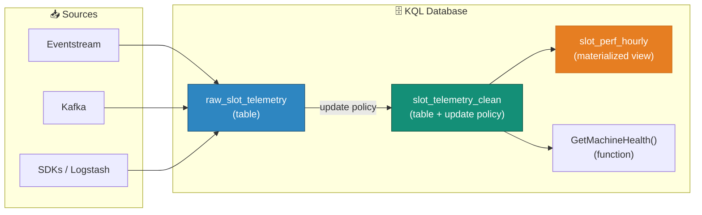

# 🕸️ Eventhouse Entity Diagrams — Visual KQL Database Lineage

**Visually Explore Relationships and Data Flow Across Your KQL Database**

---

**Last Updated:** `2026-08-22` | **Version:** 1.0.0

---

## 🎯 Overview

**Entity diagrams** in Real-Time Intelligence render the lineage and relationships of KQL database items as an interactive graph. Instead of reconstructing data flow from memory or documentation, you can see — at a glance — how tables, materialized views, functions, external tables, and data connections relate, from source to destination.

The diagram simplifies database management: track dependencies before changing a schema, spot orphaned entities, understand ingestion paths, and take action directly from the visual.

!!! info "Preview feature"
    Entity diagrams are in [preview](https://learn.microsoft.com/fabric/fundamentals/preview). Behavior and availability may change before GA.

### What the Diagram Shows

| Element | Representation |
|---------|----------------|
| **Tables** | Nodes with row/ingestion context |
| **Materialized views** | Nodes linked to their source tables |
| **Functions** | Nodes linked to the tables/views they reference |
| **External tables** | Nodes representing OneLake/external sources |
| **Data connections** | Edges showing ingestion flow (Eventstream, SDKs, Kafka, Logstash, data flows) |
| **Update policies** | Edges showing table-to-table transformation chains |

---

## 🏗️ How It Works

The entity diagram renders exactly this shape from your live database metadata — no manual diagramming.

---

## 🔑 Prerequisites & Permissions

| Requirement | Detail |
|-------------|--------|
| **Workspace** | Fabric-enabled capacity with a KQL database |
| **View diagram** | Database **view** permissions |
| **Ingestion details** | Database **Admin** or **Monitor** role to see per-entity ingestion stats (see [KQL role-based access control](https://learn.microsoft.com/fabric/real-time-intelligence/manage-database-permissions)) |

---

## 🎰 Casino POC Use Cases

1. **Pre-change impact analysis** — before altering `raw_slot_telemetry`'s schema, open the entity diagram to see every downstream update policy, materialized view, and function that depends on it.
2. **Onboarding** — new engineers explore the real-time estate visually instead of reading KQL management commands.
3. **Orphan detection** — spot tables with no ingestion edges (stale connections) or views whose sources were dropped.
4. **Ingestion health** — with Admin/Monitor permissions, per-entity ingestion details surface which connections are flowing and which have stalled — complementing [Workspace Monitoring](workspace-monitoring.md).

For workspace-level lineage across *all* Fabric item types (not just KQL entities), see [Lineage](https://learn.microsoft.com/fabric/governance/lineage) in the governance docs — the two views are complementary.

---

## ⚠️ Considerations

| Consideration | Detail |
|---------------|--------|
| **Preview** | Not yet covered by production SLAs; validate before relying on it operationally |
| **KQL scope** | Shows entities within one KQL database — cross-database and cross-item lineage lives in workspace lineage |
| **Permissions-gated detail** | Ingestion stats require elevated database roles; viewers see structure only |

---

## 🔗 Related Documents

- [Real-Time Intelligence](real-time-intelligence.md) — Eventstreams, Eventhouse, KQL, and business events
- [Eventhouse Vector Database](eventhouse-vector-database.md) — Vector storage and search in Eventhouse
- [Workspace Monitoring](workspace-monitoring.md) — Activity, capacity, and item performance monitoring
- [Data Activator](data-activator.md) — Trigger actions on real-time conditions
- [Monitoring & Observability](../best-practices/monitoring-observability.md) — End-to-end observability patterns

---

> 📝 **Document Metadata**
> - **Author**: Documentation Team
> - **Reviewers**: Real-Time Engineering
> - **Classification**: Internal
> - **Next Review**: 2026-11-22
