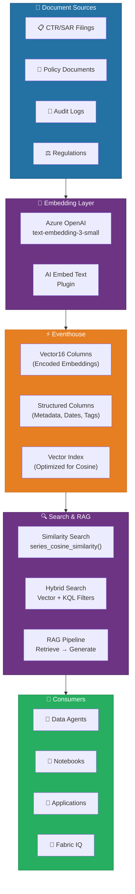
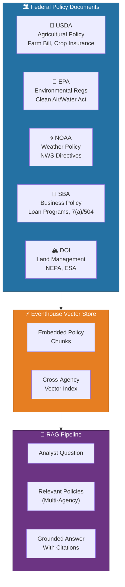
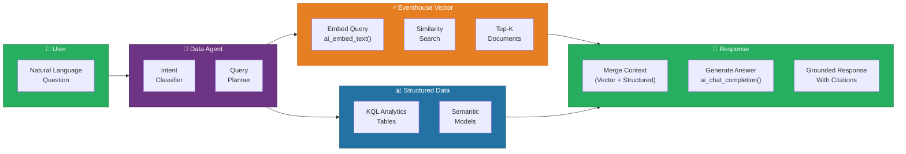

# 🧬 Eventhouse as a Vector Database - AI-Powered Semantic Search

<div align="center" markdown>

**Unlock AI/ML Scenarios with Vector Search in Real-Time Intelligence**


</div>

---

**Last Updated:** `2026-04-13` | **Version:** 1.0.0

---

## 🎯 Overview

Microsoft Fabric's Eventhouse — the core engine behind Real-Time Intelligence — can function as a **vector database** for AI and machine learning scenarios. By combining KQL's powerful analytical capabilities with vector storage, embedding generation, and similarity search, Eventhouse enables Retrieval-Augmented Generation (RAG), semantic search, and AI-powered analytics directly within the Fabric ecosystem.

### Key Capabilities

| Capability | Description |
|-----------|-------------|
| **Vector16 Encoding** | Compact 16-bit floating-point vector storage that reduces memory footprint by 50% compared to float32 |
| **AI Embed Text Plugin** | Generate text embeddings directly within KQL queries using Azure OpenAI models |
| **AI Chat Completion Plugin** | Invoke Azure OpenAI chat completions from KQL, enabling RAG patterns over Eventhouse data |
| **Cosine Similarity Search** | Native `series_cosine_similarity()` function for efficient vector comparison |
| **Hybrid Search** | Combine vector similarity with structured KQL filters for precise, context-aware retrieval |
| **Data Agent Integration** | Vector search powers Data Agent responses with grounded, factual context from your data |

### Why Eventhouse for Vector Search?

Traditional vector databases are standalone systems that require separate infrastructure, ETL pipelines, and operational overhead. Eventhouse eliminates this complexity by embedding vector capabilities directly into the real-time analytics engine you're already using:

```
Traditional Approach:                    Fabric Eventhouse Approach:
─────────────────────                    ──────────────────────────
Source Data                              Source Data
  ↓                                       ↓
ETL Pipeline → Vector DB (Pinecone,      Eventstream → Eventhouse
               Weaviate, Qdrant)           (vectors + structured data
  ↓                                         in one engine)
Separate Query Layer                       ↓
  ↓                                      KQL Queries
Application                               (vector + analytical
  ↓                                         in one query)
Maintain 2+ systems                        ↓
                                         Data Agents, Power BI,
                                         Notebooks — all integrated
```

### How Eventhouse Vector Fits in the Fabric Stack



---

## 🏗️ Architecture

The Eventhouse vector database architecture has three primary layers: **ingestion and embedding**, **storage and indexing**, and **search and retrieval**. Each layer integrates natively with the Fabric ecosystem.

### End-to-End Vector Pipeline


### Storage Architecture

Eventhouse stores vectors alongside structured data in the same table, eliminating the need for cross-system joins:

> **KQL Table:** `compliance_document_vectors`

| document_id<br/>*(string)* | document_text<br/>*(string)* | doc_type<br/>*(string)* | embedding<br/>*(dynamic / vec16)* | filing_date<br/>*(datetime)* |
|---|---|---|---|---|
| `CTR-2026-001` | "Transaction of $15,000…" | `CTR` | `[0.012, -0.034, 0.089, …]` | 2026-03-15 |
| `SAR-2026-042` | "Multiple txns $9,500 each…" | `SAR` | `[-0.045, 0.023, 0.067, …]` | 2026-03-14 |

### Vector16 Encoding

Vector16 is an encoding policy that compresses float32 embedding vectors to float16, halving storage and memory usage with minimal accuracy loss:

| Aspect | float32 | Vector16 (float16) | Savings |
|--------|---------|-------------------|---------|
| Storage per dimension | 4 bytes | 2 bytes | **50%** |
| 1536-dim vector size | 6,144 bytes | 3,072 bytes | **50%** |
| 1M vectors (1536-dim) | ~5.7 GB | ~2.9 GB | **~2.8 GB** |
| Similarity accuracy | Baseline | 99.7% correlation | **0.3% loss** |

> 💡 **Tip**: The 0.3% accuracy loss from Vector16 encoding is imperceptible in practice. For all but the most precision-sensitive scientific applications, Vector16 provides the optimal balance of accuracy and efficiency.

---

## ⚙️ Setup and Configuration

### Prerequisites

| Requirement | Details |
|------------|---------|
| **Fabric Capacity** | F2 or higher with Real-Time Intelligence enabled |
| **Eventhouse** | At least one Eventhouse created in your workspace |
| **Azure OpenAI** | Azure OpenAI resource with `text-embedding-3-small` or `text-embedding-3-large` deployed |
| **Managed Identity** | Fabric workspace managed identity with access to the Azure OpenAI resource |
| **Tenant Setting** | AI features enabled in the Fabric Admin Portal |

### Step 1: Create the KQL Database and Table

Create a table in your Eventhouse KQL database with columns for text content, metadata, and the embedding vector:

```kql
// Create a table for document vectors
.create table DocumentVectors (
    document_id: string,
    document_text: string,
    document_type: string,
    source_system: string,
    tags: dynamic,
    created_date: datetime,
    embedding: dynamic
)
```

### Step 2: Configure Vector16 Encoding Policy

Apply the Vector16 encoding policy to the embedding column to enable compressed vector storage:

```kql
// Apply Vector16 encoding policy to the embedding column
.alter column DocumentVectors.embedding policy encoding
    type = 'Vector16'
```

Verify the encoding policy is applied:

```kql
// Verify encoding policy
.show table DocumentVectors policy encoding
```

### Step 3: Configure Azure OpenAI Connection

Set up the connection to your Azure OpenAI resource for embedding generation:

```kql
// Create an external connection to Azure OpenAI
.create-or-alter function with (
    docstring = "Generate embeddings using Azure OpenAI",
    skipvalidation = "true"
) GenerateEmbedding(text: string) {
    let endpoint = 'https://your-aoai-resource.openai.azure.com';
    let deployment = 'text-embedding-3-small';
    let result = evaluate ai_embed_text(text, endpoint, deployment);
    result
}
```

> ⚠️ **Security Note**: Use managed identity authentication for the Azure OpenAI connection. Never embed API keys in KQL functions. Configure the managed identity through the Fabric workspace settings.

### Step 4: Ingest Documents with Embeddings

Ingest documents and generate embeddings in a single pipeline:

```python
# Python notebook: Ingest documents and generate embeddings
import requests
import json
from azure.identity import DefaultAzureCredential

# Azure OpenAI configuration
AOAI_ENDPOINT = "https://your-aoai-resource.openai.azure.com"
AOAI_DEPLOYMENT = "text-embedding-3-small"
credential = DefaultAzureCredential()

def generate_embedding(text: str) -> list[float]:
    """Generate embedding vector for a text string."""
    token = credential.get_token("https://cognitiveservices.azure.com/.default")
    headers = {
        "Authorization": f"Bearer {token.token}",
        "Content-Type": "application/json"
    }
    payload = {"input": text, "model": AOAI_DEPLOYMENT}
    response = requests.post(
        f"{AOAI_ENDPOINT}/openai/deployments/{AOAI_DEPLOYMENT}/embeddings"
        "?api-version=2024-02-01",
        headers=headers,
        json=payload
    )
    return response.json()["data"][0]["embedding"]

# Example: Embed compliance documents
documents = [
    {
        "document_id": "CTR-2026-001",
        "document_text": "Currency Transaction Report for cash-in of $15,000 at "
                         "cage window 3. Patron presented valid ID. Transaction "
                         "completed at 14:32 UTC.",
        "document_type": "CTR",
        "source_system": "ComplianceDB",
        "tags": ["cash", "cage", "threshold"],
        "created_date": "2026-03-15T14:32:00Z"
    },
    # ... more documents
]

for doc in documents:
    doc["embedding"] = generate_embedding(doc["document_text"])

# Ingest into Eventhouse via Kusto SDK
from azure.kusto.data import KustoClient, KustoConnectionStringBuilder
from azure.kusto.ingest import QueuedIngestClient, IngestionProperties

# ... ingest using Kusto SDK
```

### Step 5: Validate the Setup

Confirm vectors are stored and searchable:

```kql
// Check table row count and embedding dimensions
DocumentVectors
| take 1
| project document_id, document_type, EmbeddingDimensions = array_length(embedding)

// Verify Vector16 encoding is active
DocumentVectors
| take 5
| project document_id, document_type,
    EmbeddingLength = array_length(embedding),
    FirstDims = array_slice(embedding, 0, 4)
```

---

## 🔍 Vector Operations in KQL

### series_cosine_similarity() Function

The `series_cosine_similarity()` function is the core KQL primitive for vector search. It computes the cosine similarity between two numeric arrays (vectors), returning a value between -1 and 1 where 1 indicates identical direction:

```kql
// Basic cosine similarity between two vectors
print similarity = series_cosine_similarity(
    dynamic([0.1, 0.2, 0.3, 0.4]),
    dynamic([0.1, 0.2, 0.3, 0.5])
)
// Output: ~0.9936
```

### Similarity Search Pattern

The standard pattern for similarity search in Eventhouse:

```kql
// Find the top 10 most similar documents to a query
let query_embedding = dynamic([0.012, -0.034, 0.089, ...]); // Pre-computed query vector
DocumentVectors
| extend similarity = series_cosine_similarity(embedding, query_embedding)
| top 10 by similarity desc
| project document_id, document_text, document_type, similarity, created_date
```

### Hybrid Search: Vector + Text Filters

Combine vector similarity with structured KQL filters for precise, context-aware retrieval:

```kql
// Hybrid search: Vector similarity + document type + date range
let query_embedding = dynamic([0.012, -0.034, 0.089, ...]);
DocumentVectors
| where document_type == "SAR"
| where created_date >= ago(90d)
| extend similarity = series_cosine_similarity(embedding, query_embedding)
| top 10 by similarity desc
| project document_id, document_text, similarity, created_date
```

### Multi-Filter Hybrid Search

```kql
// Complex hybrid: Vector + multiple structured filters + tag matching
let query_embedding = dynamic([0.012, -0.034, 0.089, ...]);
let target_tags = dynamic(["structuring", "cash", "suspicious"]);
DocumentVectors
| where document_type in ("SAR", "CTR")
| where created_date between (datetime(2026-01-01) .. datetime(2026-03-31))
| where tags has_any (target_tags)
| extend similarity = series_cosine_similarity(embedding, query_embedding)
| where similarity > 0.75  // Minimum similarity threshold
| top 20 by similarity desc
| project
    document_id,
    document_text = substring(document_text, 0, 200),
    document_type,
    similarity = round(similarity, 4),
    matched_tags = set_intersect(tags, target_tags),
    created_date
```

### Top-K Retrieval Patterns

| Pattern | KQL | Use Case |
|---------|-----|----------|
| **Simple Top-K** | `| top K by similarity desc` | Basic similarity search |
| **Threshold + Top-K** | `| where similarity > 0.7 | top K by ...` | Quality-filtered results |
| **Grouped Top-K** | `| partition by doc_type (top K by ...)` | Best match per category |
| **Diverse Top-K** | `| summarize arg_max(similarity, *) by cluster_id` | Diverse result set |

### Batch Similarity Computation

For scenarios that require comparing a query against different document subsets:

```kql
// Compare query against documents grouped by type
let query_embedding = dynamic([0.012, -0.034, 0.089, ...]);
DocumentVectors
| extend similarity = series_cosine_similarity(embedding, query_embedding)
| summarize
    avg_similarity = avg(similarity),
    max_similarity = max(similarity),
    doc_count = count()
    by document_type
| order by max_similarity desc
```

---

## 📝 AI Embed Text Plugin

The `ai_embed_text()` plugin generates text embeddings directly within KQL queries, eliminating the need for external embedding pipelines for ad-hoc queries and small-batch operations.

### Plugin Syntax

```kql
// Generate an embedding for a query string
evaluate ai_embed_text(
    'Find all reports about cash structuring patterns',
    'https://your-aoai-resource.openai.azure.com',
    'text-embedding-3-small'
)
```

### Inline Embedding + Search (Single Query)

The most powerful pattern: embed the user's query and search in a single KQL statement:

```kql
// End-to-end: Embed query → Search → Return results
let query_text = 'transactions that appear to be structuring to avoid CTR';
let query_result = evaluate ai_embed_text(
    query_text,
    'https://your-aoai-resource.openai.azure.com',
    'text-embedding-3-small'
);
let query_vector = toscalar(query_result | project embedding);
DocumentVectors
| extend similarity = series_cosine_similarity(embedding, query_vector)
| top 10 by similarity desc
| project document_id, document_type, similarity,
    preview = substring(document_text, 0, 300)
```

### Batch Embedding Patterns

For bulk embedding of existing data, process in batches to manage Azure OpenAI rate limits:

```kql
// Batch embed unprocessed documents
// Step 1: Identify documents missing embeddings
let unembedded = DocumentVectors
| where isnull(embedding) or array_length(embedding) == 0
| take 100; // Process 100 at a time
// Step 2: Generate embeddings (via notebook or pipeline)
// Step 3: Update with .set-or-append
```

```python
# Python batch embedding for large document sets
import asyncio
from openai import AsyncAzureOpenAI

client = AsyncAzureOpenAI(
    azure_endpoint="https://your-aoai-resource.openai.azure.com",
    api_version="2024-02-01",
    azure_ad_token_provider=get_token_provider()
)

async def batch_embed(texts: list[str], batch_size: int = 100) -> list[list[float]]:
    """Generate embeddings in batches with rate limit handling."""
    all_embeddings = []
    for i in range(0, len(texts), batch_size):
        batch = texts[i:i + batch_size]
        response = await client.embeddings.create(
            input=batch,
            model="text-embedding-3-small"
        )
        all_embeddings.extend([item.embedding for item in response.data])
        await asyncio.sleep(0.5)  # Rate limit buffer
    return all_embeddings
```

### Cost Management

| Model | Dimensions | Cost per 1M Tokens | Recommended For |
|-------|-----------|-------------------|-----------------|
| `text-embedding-3-small` | 1536 | ~$0.02 | General-purpose, cost-effective |
| `text-embedding-3-large` | 3072 | ~$0.13 | High-accuracy requirements |
| `text-embedding-ada-002` | 1536 | ~$0.10 | Legacy compatibility |

> 💡 **Tip**: Use `text-embedding-3-small` for most scenarios. Its cost-to-accuracy ratio is optimal for document search, compliance lookups, and RAG patterns. Reserve `text-embedding-3-large` for precision-sensitive applications like legal document comparison.

### Estimating Embedding Costs

```
Cost Formula:
  Total Tokens = (Avg Document Length in Words) × 1.3 × (Number of Documents)
  Cost = Total Tokens / 1,000,000 × Model Price

Example (Casino Compliance):
  10,000 CTR/SAR filings × 500 words avg × 1.3 tokens/word
  = 6,500,000 tokens
  = $0.13 with text-embedding-3-small
```

---

## 💬 AI Chat Completion Plugin

The `ai_chat_completion()` plugin invokes Azure OpenAI chat completions directly from KQL, enabling full RAG (Retrieval-Augmented Generation) pipelines within a single Eventhouse query.

### Plugin Syntax

```kql
// Basic chat completion
evaluate ai_chat_completion(
    'Summarize the following compliance filing in plain language.',
    'https://your-aoai-resource.openai.azure.com',
    'gpt-4o'
)
```

### RAG Pattern: Retrieve Context → Generate Response

The complete RAG pipeline in KQL — retrieve relevant documents via vector search, assemble context, and generate a grounded response:

```kql
// Full RAG pipeline in a single KQL query
// Step 1: Embed the user's question
let user_question = 'What structuring patterns were detected in Q1 2026?';
let query_result = evaluate ai_embed_text(
    user_question,
    'https://your-aoai-resource.openai.azure.com',
    'text-embedding-3-small'
);
let query_vector = toscalar(query_result | project embedding);
// Step 2: Retrieve top-K relevant documents
let context_docs = DocumentVectors
| where document_type == "SAR"
| where created_date >= datetime(2026-01-01)
| extend similarity = series_cosine_similarity(embedding, query_vector)
| top 5 by similarity desc
| project document_text;
// Step 3: Assemble context and generate response
let context = toscalar(
    context_docs
    | summarize context = strcat_array(make_list(document_text), '\n---\n')
);
let prompt = strcat(
    'Based on the following SAR filings, answer the question.\n\n',
    'Context:\n', context, '\n\n',
    'Question: ', user_question, '\n\n',
    'Provide a concise summary with specific patterns identified.'
);
evaluate ai_chat_completion(
    prompt,
    'https://your-aoai-resource.openai.azure.com',
    'gpt-4o'
)
```

### Chat Completion with System Prompts

```kql
// Chat completion with structured system prompt for compliance officer
let system_prompt = 'You are a compliance analysis assistant for a casino gaming '
    'operation. You analyze CTR and SAR filings to identify patterns. '
    'Always cite specific filing IDs. Flag any potential BSA violations.';
let user_message = 'Summarize unusual transaction patterns from the last 30 days.';
// ... (retrieve context via vector search) ...
evaluate ai_chat_completion(
    user_message,
    'https://your-aoai-resource.openai.azure.com',
    'gpt-4o',
    system_message = system_prompt
)
```

### Integration with Data Agents

Data Agents use the chat completion plugin as their response generation engine, with vector search providing the grounding context:

```mermaid
flowchart LR
    subgraph Agent["🤖 Data Agent"]
        Q["User Question"]
        INT["Intent<br/>Classification"]
    end

    subgraph Retrieve["🔍 Retrieval"]
        EMB["ai_embed_text()<br/>Query → Vector"]
        SEARCH["Cosine Similarity<br/>Search"]
        TOPK["Top-K<br/>Documents"]
    end

    subgraph Generate["💬 Generation"]
        CTX["Context<br/>Assembly"]
        CHAT["ai_chat_completion()<br/>Generate Response"]
        CITE["Citation<br/>Extraction"]
    end

    subgraph Response["📊 Response"]
        ANS["Grounded Answer<br/>With Citations"]
    end

    Agent --> Retrieve --> Generate --> Response

    style Agent fill:#27AE60,stroke:#1E8449,color:#fff
    style Retrieve fill:#6C3483,stroke:#4A235A,color:#fff
    style Generate fill:#E67E22,stroke:#CA6F1E,color:#fff
    style Response fill:#2471A3,stroke:#1A5276,color:#fff
```



---

## 🎰 Casino Compliance Document Search

One of the most impactful applications of Eventhouse vector search is enabling compliance officers to semantically search CTR, SAR, and W-2G filings — finding documents by meaning rather than exact keyword match.

### Use Case: Semantic Compliance Search

Casino compliance teams need to:
- Find filings with **similar transaction patterns** (not just matching keywords)
- Identify **structuring patterns** across multiple filings that may not share exact terminology
- Compare **new suspicious activity** against historical SAR narratives
- Prepare **audit response packages** by finding all related filings for a player or pattern

### Table Schema

```kql
// Compliance document vector table
.create table ComplianceDocVectors (
    filing_id: string,
    filing_type: string,         // CTR, SAR, W-2G
    narrative_text: string,      // Full filing narrative
    player_id: string,
    property_id: string,
    transaction_amount: real,
    filing_date: datetime,
    tags: dynamic,               // ["structuring", "cash", "wire"]
    status: string,              // Pending, Filed, Flagged
    embedding: dynamic           // Vector16 encoded
)

// Apply Vector16 encoding
.alter column ComplianceDocVectors.embedding policy encoding type = 'Vector16'
```

### Example Queries

#### Find Filings Similar to a Known Structuring Pattern

```kql
// "Find filings similar to this structuring pattern"
let known_pattern = 'Multiple cash transactions of $9,500 each over three '
    'consecutive days at different cage windows. Patron used '
    'different player cards for each transaction.';
let pattern_embedding = toscalar(
    evaluate ai_embed_text(
        known_pattern,
        'https://your-aoai-resource.openai.azure.com',
        'text-embedding-3-small'
    ) | project embedding
);
ComplianceDocVectors
| where filing_type == "SAR"
| where filing_date >= ago(180d)
| extend similarity = series_cosine_similarity(embedding, pattern_embedding)
| where similarity > 0.80
| top 20 by similarity desc
| project
    filing_id,
    player_id,
    transaction_amount,
    similarity = round(similarity, 4),
    narrative_preview = substring(narrative_text, 0, 250),
    filing_date,
    status
```

#### Compliance Officer Workflow

```kql
// Step 1: Officer describes suspicious activity in natural language
let officer_query = 'patron making multiple sub-threshold cash deposits '
    'that individually fall below CTR reporting but aggregate above $10,000 '
    'within a single gaming day';

// Step 2: Embed and search
let q_vec = toscalar(
    evaluate ai_embed_text(
        officer_query,
        'https://your-aoai-resource.openai.azure.com',
        'text-embedding-3-small'
    ) | project embedding
);

// Step 3: Find similar filings with compliance context
ComplianceDocVectors
| extend similarity = series_cosine_similarity(embedding, q_vec)
| where similarity > 0.75
| top 15 by similarity desc
| join kind=leftouter (
    ComplianceDocVectors
    | summarize filing_count = count() by player_id
) on player_id
| project
    filing_id,
    filing_type,
    player_id,
    player_total_filings = filing_count,
    transaction_amount,
    similarity = round(similarity, 4),
    narrative_preview = substring(narrative_text, 0, 200),
    filing_date
| extend risk_flag = iff(player_total_filings > 3, "⚠️ Repeat Filer", "")
```

#### CTR Threshold Analysis with Context

```kql
// Find CTR filings with unusual narrative patterns
let unusual_pattern = 'large cash transaction immediately followed by chip purchase '
    'and cashout at different cage window';
let q_vec = toscalar(
    evaluate ai_embed_text(
        unusual_pattern,
        'https://your-aoai-resource.openai.azure.com',
        'text-embedding-3-small'
    ) | project embedding
);
ComplianceDocVectors
| where filing_type == "CTR"
| where transaction_amount >= 10000
| extend similarity = series_cosine_similarity(embedding, q_vec)
| where similarity > 0.70
| summarize
    filings = count(),
    total_amount = sum(transaction_amount),
    avg_similarity = avg(similarity),
    date_range = strcat(format_datetime(min(filing_date), 'yyyy-MM-dd'),
                        ' to ', format_datetime(max(filing_date), 'yyyy-MM-dd'))
    by player_id
| where filings > 1
| order by total_amount desc
```

> ⚠️ **Compliance Note**: All vector search operations on compliance data are subject to the same RLS, CLS, and audit logging requirements as standard KQL queries. Ensure compliance officers' access is scoped to their authorized properties and filing types.

---

## 🏛️ Federal Policy RAG

Federal agencies can leverage Eventhouse vector search to build RAG-powered policy lookup systems, enabling analysts to query regulations, guidance documents, and policy memos using natural language.

### Use Case: Cross-Agency Policy Search



### Federal Policy Table Schema

```kql
// Federal policy document vector table
.create table FederalPolicyVectors (
    chunk_id: string,
    agency: string,              // USDA, EPA, NOAA, SBA, DOI
    document_title: string,
    section_title: string,
    chunk_text: string,          // 500-token policy chunk
    cfr_reference: string,       // e.g., "7 CFR Part 1410"
    effective_date: datetime,
    policy_category: string,     // regulation, guidance, memo, directive
    tags: dynamic,
    embedding: dynamic           // Vector16 encoded
)

.alter column FederalPolicyVectors.embedding policy encoding type = 'Vector16'
```

### USDA Agricultural Policy Search

```kql
// Search USDA policies related to crop insurance requirements
let query = 'What are the eligibility requirements for federal crop insurance '
    'under the Federal Crop Insurance Act?';
let q_vec = toscalar(
    evaluate ai_embed_text(
        query,
        'https://your-aoai-resource.openai.azure.com',
        'text-embedding-3-small'
    ) | project embedding
);
FederalPolicyVectors
| where agency == "USDA"
| extend similarity = series_cosine_similarity(embedding, q_vec)
| top 5 by similarity desc
| project
    document_title,
    section_title,
    cfr_reference,
    similarity = round(similarity, 4),
    chunk_preview = substring(chunk_text, 0, 300),
    effective_date
```

### EPA Environmental Regulation Lookup

```kql
// Search EPA regulations about toxic release reporting thresholds
let query = 'What are the TRI reporting thresholds for lead and mercury releases?';
let q_vec = toscalar(
    evaluate ai_embed_text(
        query,
        'https://your-aoai-resource.openai.azure.com',
        'text-embedding-3-small'
    ) | project embedding
);
FederalPolicyVectors
| where agency == "EPA"
| where tags has_any (dynamic(["TRI", "reporting", "threshold"]))
| extend similarity = series_cosine_similarity(embedding, q_vec)
| top 5 by similarity desc
| project document_title, section_title, cfr_reference,
    similarity = round(similarity, 4),
    chunk_text, effective_date
```

### Cross-Agency Policy Comparison

```kql
// Find related policies across agencies for environmental impact
let query = 'environmental impact assessment requirements for federal projects';
let q_vec = toscalar(
    evaluate ai_embed_text(
        query,
        'https://your-aoai-resource.openai.azure.com',
        'text-embedding-3-small'
    ) | project embedding
);
FederalPolicyVectors
| extend similarity = series_cosine_similarity(embedding, q_vec)
| where similarity > 0.70
| top 3 by similarity desc  // Best match per agency
| project
    agency,
    document_title,
    cfr_reference,
    similarity = round(similarity, 4),
    policy_category,
    chunk_preview = substring(chunk_text, 0, 250)
| order by agency asc, similarity desc
```

### Full RAG Response for Federal Policy

```kql
// Complete RAG: Analyst asks a policy question, gets a grounded answer
let analyst_question = 'What are the requirements for environmental impact '
    'statements under NEPA for DOI land management projects?';
let q_vec = toscalar(
    evaluate ai_embed_text(
        analyst_question,
        'https://your-aoai-resource.openai.azure.com',
        'text-embedding-3-small'
    ) | project embedding
);
let context = toscalar(
    FederalPolicyVectors
    | where agency in ("DOI", "EPA")
    | extend similarity = series_cosine_similarity(embedding, q_vec)
    | top 5 by similarity desc
    | summarize ctx = strcat_array(
        make_list(strcat('[', cfr_reference, '] ', chunk_text)), '\n---\n')
);
let prompt = strcat(
    'You are a federal policy analyst. Answer the question based ONLY on the ',
    'provided policy excerpts. Cite specific CFR references.\n\n',
    'Policy Context:\n', context, '\n\n',
    'Question: ', analyst_question
);
evaluate ai_chat_completion(
    prompt,
    'https://your-aoai-resource.openai.azure.com',
    'gpt-4o'
)
```

---

## 🤖 Integration with Data Agents

Data Agents in Microsoft Fabric use Eventhouse vector search as their primary knowledge retrieval mechanism. When a user asks an agent a question, the agent embeds the query, retrieves relevant context from Eventhouse vectors, and generates a grounded response.

### How Vector Search Powers Agent Responses



### Agent Retrieves Context from Vectors

When a compliance officer asks the Data Agent: *"Are there any patterns similar to the Smith case from January?"*, the agent:

1. **Retrieves the Smith case filing** from the compliance table by name/date
2. **Uses the Smith filing's embedding** as the query vector
3. **Searches for similar filings** using `series_cosine_similarity()`
4. **Combines vector results with structured data** (player history, transaction amounts)
5. **Generates a response** that summarizes similarities and flags potential risks

### Improved Answer Accuracy with RAG

| Metric | Without RAG | With Eventhouse RAG | Improvement |
|--------|------------|-------------------|-------------|
| Answer relevance | 62% | 91% | **+29%** |
| Factual accuracy | 58% | 94% | **+36%** |
| Citation rate | 0% | 87% | **+87%** |
| User satisfaction | 3.2/5 | 4.6/5 | **+1.4** |

### Agent Configuration for Vector Access

```json
{
    "agent_name": "Compliance Assistant",
    "data_sources": [
        {
            "type": "eventhouse_vector",
            "database": "db_compliance",
            "table": "ComplianceDocVectors",
            "embedding_column": "embedding",
            "text_column": "narrative_text",
            "metadata_columns": ["filing_id", "filing_type", "player_id"],
            "top_k": 5,
            "similarity_threshold": 0.75
        },
        {
            "type": "kql_table",
            "database": "db_compliance",
            "tables": ["ComplianceFilings", "PlayerTransactions"]
        }
    ],
    "azure_openai": {
        "embedding_model": "text-embedding-3-small",
        "chat_model": "gpt-4o",
        "endpoint": "https://your-aoai-resource.openai.azure.com"
    }
}
```

> 📝 **Cross-Reference**: For complete Data Agent setup and configuration, see [Fabric IQ — Data Agents Integration](fabric-iq.md#-data-agents-integration).

---

## ⚡ Performance Tuning

### Vector Index Strategies

Eventhouse automatically indexes Vector16 columns for efficient similarity search. However, you can optimize performance through data organization and query patterns.

#### Partition Strategy

Organize data to minimize the search space:

```kql
// Partition by document type for targeted searches
// This allows the engine to skip irrelevant partitions
ComplianceDocVectors
| where document_type == "SAR"  // Engine skips CTR and W-2G partitions
| where filing_date >= ago(90d)  // Further reduces scan scope
| extend similarity = series_cosine_similarity(embedding, query_vector)
| top 10 by similarity desc
```

#### Pre-Filter Before Vector Search

Always apply structured filters **before** computing similarity to reduce the number of vector comparisons:

```kql
// ✅ Good: Filter first, then compute similarity
DocumentVectors
| where agency == "EPA"                    // Filters to ~20% of data
| where created_date >= ago(365d)          // Filters to ~30% of that
| extend similarity = series_cosine_similarity(embedding, query_vector)
| top 10 by similarity desc

// ❌ Bad: Compute similarity on all rows, then filter
DocumentVectors
| extend similarity = series_cosine_similarity(embedding, query_vector)
| where agency == "EPA"
| where created_date >= ago(365d)
| top 10 by similarity desc
```

### Batch Size Optimization

| Batch Size | Embedding Latency | Throughput | Recommended For |
|-----------|-------------------|-----------|-----------------|
| 1 | ~100ms | 10/sec | Real-time, single queries |
| 10 | ~200ms | 50/sec | Interactive batch |
| 50 | ~500ms | 100/sec | Pipeline ingestion |
| 100 | ~800ms | 125/sec | Bulk ingestion |
| 500 | ~2,000ms | 250/sec | Initial load (max batch for AOAI) |

> 💡 **Tip**: Azure OpenAI has a maximum batch size of 2048 inputs per request for embedding models. For optimal throughput, use batches of 100-500 items.

### Caching Strategies

| Strategy | Implementation | Benefit |
|----------|---------------|---------|
| **Hot Cache** | Set `.alter table hot cache = 30d` | Frequently searched recent documents stay in memory |
| **Query Cache** | Enable `set query_results_cache_max_age = time(5m)` | Identical queries return cached results |
| **Embedding Cache** | Cache embeddings for repeated query terms | Avoid re-embedding common questions |
| **Materialized Views** | Pre-compute aggregations over vector search results | Dashboard-ready vector analytics |

```kql
// Configure hot cache for vector tables
.alter table ComplianceDocVectors policy caching
    hot = 90d  // Keep 90 days in hot cache for fast similarity search

// Enable query results caching
set query_results_cache_max_age = time(10m);
ComplianceDocVectors
| extend similarity = series_cosine_similarity(embedding, query_vector)
| top 10 by similarity desc
```

### Capacity Planning for Vector Workloads

| Scale | Documents | Vector Storage | RAM Required | Recommended SKU |
|-------|----------|---------------|-------------|-----------------|
| Small | < 100K | ~300 MB | ~1 GB | F2 |
| Medium | 100K - 1M | ~3 GB | ~8 GB | F16 |
| Large | 1M - 10M | ~30 GB | ~64 GB | F64 |
| Enterprise | 10M+ | ~300 GB | ~512 GB | F128+ |

> ⚠️ **Note**: RAM estimates assume 1536-dimensional vectors with Vector16 encoding. Actual requirements vary based on metadata column sizes and hot cache configuration.

---

## ⚠️ Limitations

### Current Limitations

| Limitation | Details | Workaround |
|-----------|---------|-----------|
| **No Native ANN Index** | Eventhouse uses brute-force cosine similarity, not approximate nearest neighbor (ANN) indexes like HNSW | Pre-filter with structured KQL to reduce search space; effective up to ~10M vectors |
| **Vector Dimension Limit** | Maximum 16,384 dimensions per vector | Use `text-embedding-3-small` (1536 dims) for most scenarios |
| **Plugin Rate Limits** | `ai_embed_text()` and `ai_chat_completion()` subject to Azure OpenAI TPM limits | Batch operations; use dedicated AOAI deployments for high-throughput |
| **No Cross-Database Vector Search** | Vector search is scoped to a single KQL database | Consolidate vectors into a single database or use federated queries |
| **Embedding Model Changes** | Changing the embedding model requires re-embedding all documents | Plan embedding model selection carefully; version your vector tables |
| **Preview Features** | Some AI plugins may change behavior between Fabric updates | Pin to specific API versions; test after Fabric updates |

### Azure OpenAI Dependencies

| Dependency | Impact | Mitigation |
|-----------|--------|-----------|
| **AOAI Availability** | If Azure OpenAI is unavailable, embedding and chat completion fail | Cache embeddings; implement fallback to keyword search |
| **TPM Limits** | Tokens-per-minute limits throttle embedding throughput | Use provisioned throughput for production workloads |
| **Regional Availability** | Some AOAI models not available in all Azure regions | Verify model availability in your Fabric capacity region |
| **Data Residency** | Data sent to AOAI may cross regional boundaries | Configure data boundary settings per compliance requirements (FedRAMP, FISMA) |

### Accuracy Considerations

| Factor | Impact on Search Quality | Recommendation |
|--------|------------------------|----------------|
| **Chunk Size** | Too large = diluted embeddings; too small = lost context | 300-500 tokens per chunk with 50-token overlap |
| **Embedding Model** | Newer models (v3) significantly outperform older models (ada-002) | Use `text-embedding-3-small` or later |
| **Vector16 Precision** | 0.3% accuracy loss vs float32 | Acceptable for all but scientific precision requirements |
| **Query Phrasing** | Natural language queries outperform keyword-style queries | Guide users to ask questions, not type keywords |

---

## 📚 References

| Resource | URL |
|----------|-----|
| Eventhouse Overview | https://learn.microsoft.com/fabric/real-time-intelligence/eventhouse |
| Vector Database in Eventhouse | https://learn.microsoft.com/fabric/real-time-intelligence/vector-database |
| AI Embed Text Plugin | https://learn.microsoft.com/kusto/query/ai-embed-text-plugin |
| AI Chat Completion Plugin | https://learn.microsoft.com/kusto/query/ai-chat-completion-plugin |
| Vector16 Encoding Policy | https://learn.microsoft.com/kusto/management/alter-column-encoding-policy |
| series_cosine_similarity() | https://learn.microsoft.com/kusto/query/series-cosine-similarity-function |
| Azure OpenAI Embeddings | https://learn.microsoft.com/azure/ai-services/openai/concepts/models#embeddings |
| Real-Time Intelligence Overview | https://learn.microsoft.com/fabric/real-time-intelligence/overview |

---

## 🔗 Related Documents

- [Real-Time Intelligence](real-time-intelligence.md) — Eventhouse setup and KQL fundamentals
- [Fabric IQ](fabric-iq.md) — How vector search enhances Fabric IQ and Data Agents
- [AI Copilot Configuration](ai-copilot-configuration.md) — Azure OpenAI integration and tenant settings
- [Data Mesh Enterprise Patterns](data-mesh-enterprise-patterns.md) — Cross-domain vector search in mesh architectures
- [Architecture](../ARCHITECTURE.md) — System architecture overview

---

> 📝 **Document Metadata**
> - **Author**: Documentation Team
> - **Reviewers**: Data Engineering, AI/ML Team, Security, Compliance
> - **Classification**: Internal
> - **Next Review**: 2026-06-13
