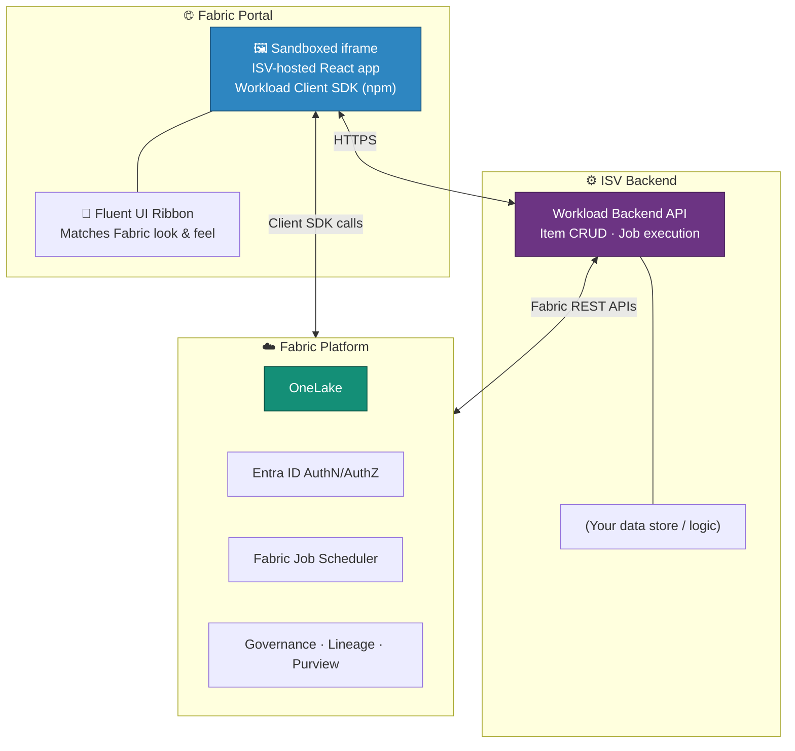

# 🧩 Fabric Extensibility Toolkit — Build Custom Workloads on Fabric

<div align="center" markdown>

**Embed Your Own Items, Editors, and Experiences Natively in the Fabric Portal**


</div>

---

**Last Updated:** `2026-08-22` | **Version:** 1.0.0

---

## 🎯 Overview

The **Microsoft Fabric Extensibility Toolkit** (GA March 2026) lets partners and enterprises build **custom workloads** that run natively inside the Fabric portal. A workload can define new item types — with their own creation flow, editor UI, job execution, and OneLake integration — that appear alongside Lakehouses, Warehouses, and Pipelines as first-class Fabric citizens.

Where the REST APIs let you *automate* Fabric from the outside, the Extensibility Toolkit lets you *extend* Fabric from the inside: your application's frontend is embedded in a sandboxed `<iframe>` in the portal, wired into Fabric's item lifecycle, security, and governance through the Workload Client SDK.

### When to Use the Extensibility Toolkit

| Scenario | Fit |
|----------|-----|
| **Data application** — combine Fabric and non-Fabric capabilities into one complete app | ✅ Core scenario |
| **Data store** — manage and store data with custom query/write APIs (like Lakehouse or Cosmos DB) | ✅ Core scenario |
| **Data visualization** — apps built on Fabric data items (custom reports, dashboards) | ✅ Core scenario |
| **Fabric customization** — provision preconfigured workspaces, add admin functionality | ✅ Core scenario |
| Pure automation of existing items (create/refresh/deploy) | ❌ Use [REST APIs](fabric-rest-apis.md) instead |

### Out-of-the-Box Samples

The [Extensibility Samples](https://aka.ms/fabric-extensibility-toolkit-samples) repo provides item types you can use directly or adapt:

1. **Package Installer** — installs predefined packages (items, data, job schedules) into new or existing workspaces
2. **OneLake Editor** — opens and visualizes OneLake data for Fabric items, including items created via the toolkit

---

## 🏗️ Architecture



### Components

| Component | Role |
|-----------|------|
| **Workload manifest** | Declares the workload, its item types, and their capabilities to Fabric |
| **Frontend (React)** | Your item editor UI, hosted by you, embedded via sandboxed iframe |
| **Workload Client SDK** | npm package providing bootstrap, APIs, and interfaces to operate as a micro-frontend in the portal |
| **Backend API** | Implements item lifecycle (create/read/update/delete), job execution, and data plane operations |
| **Developer mode** | Fabric developer mode lets you observe changes in real time while iterating |

---

## 🚀 Getting Started

### 1. Clone the Sample

Start from the [Microsoft Fabric workload development sample repository](https://github.com/microsoft/Microsoft-Fabric-workload-development-sample). The sample frontend is a standard React app that:

- Showcases most available SDK calls
- Demonstrates a Fluent UI-based extensible ribbon matching Fabric's look and feel
- Allows easy customization
- Reflects changes in real time with Fabric developer mode enabled

### 2. Define Your Item Type

The manifest declares what your item can do — create experience, editor route, job types, OneLake interactions:

```json
{
  "workloadName": "Contoso.CasinoCompliance",
  "items": [
    {
      "name": "ComplianceRulePack",
      "displayName": "Compliance Rule Pack",
      "editor": { "path": "/editor" },
      "jobs": [ "Validate", "Publish" ],
      "oneLake": { "read": true, "write": true }
    }
  ]
}
```

### 3. Implement the Backend

Your backend implements the workload API contract — item CRUD, job execution callbacks, and (optionally) OneLake read/write via the Fabric REST APIs with the user's delegated Entra token.

### 4. Test in Developer Mode

Enable Fabric developer mode, register the workload in a dev tenant, and iterate: portal changes and your local frontend update live.

---

## 🎰 POC Relevance — CSA-in-a-Box

The Extensibility Toolkit is the delivery vehicle for productizing POC accelerators:

| POC Asset | As a Workload |
|-----------|---------------|
| 58 tutorials + medallion notebooks | **Package Installer** pattern — one-click install of a preconfigured casino analytics workspace (items, sample data, job schedules) |
| Compliance rules (CTR/SAR/W-2G) | Custom **Compliance Rule Pack** item with its own editor and validation job |
| OneLake sample data browser | Adapt the **OneLake Editor** sample for guided demo data exploration |

This turns the POC from "a repo you clone" into "a workload you install" — the CSA-in-a-Box pattern.

---

## 🔒 Security & Governance

- **Entra ID throughout** — user identity flows from portal → iframe → your backend via token exchange; no separate auth silo
- **Sandboxed iframe** — the frontend is isolated; all Fabric interaction goes through the SDK's audited surface
- **Workspace roles apply** — your items honor the same Admin/Member/Contributor/Viewer model as native items
- **Lineage & Purview** — items created through the toolkit participate in workspace lineage and can be scanned like native items

---

## ⚠️ Considerations

| Consideration | Detail |
|---------------|--------|
| **You host the frontend** | The web app runs on your infrastructure — plan for availability, TLS, and scaling |
| **Backend contract** | Job execution and item lifecycle callbacks must meet Fabric's reliability expectations |
| **Tenant opt-in** | Admins control which workloads are available; distribution may require marketplace listing or tenant registration |
| **Not for automation** | If you only need to script existing item types, use the [REST APIs](fabric-rest-apis.md) or [fabric-cicd](../best-practices/fabric-cicd-deployment.md) |

---

## 🔗 Related Documents

- [Fabric REST APIs](fabric-rest-apis.md) — Automate existing Fabric resources programmatically
- [Fabric MCP](fabric-mcp.md) — Model Context Protocol integration for AI agents
- [Git Integration](git-integration.md) — Source control for Fabric items
- [Fabric CI/CD Deployment](../best-practices/fabric-cicd-deployment.md) — Deploy Fabric items via CI/CD
- [Multi-Tenant Workspace Architecture](../best-practices/multi-tenant-workspace-architecture.md) — Workspace patterns for ISV scenarios

---

> 📝 **Document Metadata**
> - **Author**: Documentation Team
> - **Reviewers**: Platform Engineering, Partner Solutions
> - **Classification**: Internal
> - **Next Review**: 2026-11-22
