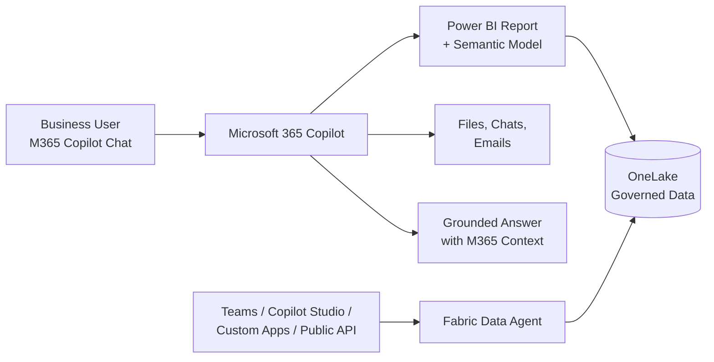

# 💬 Fabric IQ Conversational Analytics — Data Answers in Microsoft 365 Copilot

**Ask Questions Over Governed Power BI Semantic Models — Right Where You Already Work**

---

**Last Updated:** `2026-09-07` | **Version:** 1.0.0

---

## 🎯 Overview

Fabric IQ conversational analytics (announced July 2026) brings **Power BI data answers directly into Microsoft 365 Copilot Chat and Copilot Cowork**. Business teams can incorporate governed data into their decision-making without switching to Power BI to look up numbers or trends — users ask natural-language questions about their organization's data right where they already work: in Copilot Chat alongside their files, emails, and conversations.

For specialized analysis, conversational analytics works alongside **Fabric data agents**, which provide curated, domain-specific Q&A over Lakehouses, Warehouses, KQL databases, semantic models, and ontologies.

### How It Works

1. A user asks Microsoft 365 Copilot a data question (e.g., "What was slot revenue by property last quarter?")
2. Copilot uses that user's **existing permissions** to access the relevant Power BI report and underlying semantic model
3. Copilot grounds the answer in your Power BI data, then **interprets and reconciles it with broader Microsoft 365 context** — files, chats, and emails — for a more complete decision picture

This capability works **independently of the "Share Fabric data with your Microsoft 365 services" tenant setting** because no background metadata sharing is required. That setting only affects discoverability: Power BI content appears in the item-attachment menu (the **+** button) only when the setting is enabled. Users can still reference content by pasting a link or naming a report in their prompt regardless.

### Conversational Analytics vs. Data Agents

| | Conversational Analytics (M365 Copilot) | Fabric Data Agents |
|---|---|---|
| **Audience** | Business users in M365 apps | Analysts and app developers |
| **Data source** | Power BI reports and semantic models | Lakehouses, Warehouses, KQL DBs, semantic models, ontologies |
| **Curation** | Automatic source selection | Curated instructions, examples, domain guidance |
| **Surface** | Copilot Chat, Copilot Cowork | Fabric portal, Teams, Copilot Studio, custom apps, public API |
| **Best for** | Ad-hoc questions in the flow of work | Specialized, governed Q&A embedded in apps |

---

## 🏗️ Architecture

---

## ⚙️ Prerequisites

| Requirement | Detail |
|-------------|--------|
| **Microsoft 365 Copilot Premium license** | Required for all users |
| **Frontier access** | Data answering grounded in Power BI reports is initially available in Frontier |
| **Power BI access** | User must have both permission and licensed access to view the reports and semantic models they ask about |
| **Copilot in Fabric** | **Not** required — the user doesn't need access to Copilot in Fabric |

### Improving Answer Quality

- [Prepare data for AI](https://learn.microsoft.com/power-bi/create-reports/copilot-prepare-data-ai) and approve semantic models — this improves accuracy and ensures high-quality responses
- Use the [standalone Copilot experience](https://learn.microsoft.com/power-bi/create-reports/copilot-chat-with-data-standalone) for cross-item conversational analysis with automatic source selection

---

## 🎰 Casino/Gaming POC Applications

| Use Case | Application |
|----------|-------------|
| **Executive Q&A** | Property GMs ask "How did weekend slot hold compare to forecast?" in Teams without opening Power BI |
| **Compliance briefings** | Compliance officers ask CTR filing questions grounded in the governed compliance semantic model |
| **Federal program reviews** | Program managers query grant spending models during M365 budget meetings |
| **Operations huddles** | Floor managers ask about real-time occupancy metrics in Copilot Cowork during shift briefings |

---

## ⚠️ Limitations & Considerations

| Consideration | Detail |
|---------------|--------|
| **Frontier program** | Initially available only in Frontier — check tenant eligibility |
| **Premium license** | M365 Copilot Premium required per user — this is a separate cost from Fabric capacity |
| **Permissions honored** | Answers respect each user's Power BI permissions, RLS, and CLS — no elevation |
| **Discoverability setting** | Item-attachment menu requires the "Share Fabric data with your Microsoft 365 services" tenant setting |

---

## 🔗 Related Documents

- [Fabric IQ](fabric-iq.md) — The semantic foundation (ontology, graph) that grounds answers
- [Data Agents](data-agents.md) — Curated conversational Q&A for specialized domains
- [Fabric Data Agent API](data-agent-api.md) — Programmatic data agent management
- [AI Copilot Configuration](ai-copilot-configuration.md) — Tenant settings and capacity requirements for Copilot
- [Fabric IQ Planning](fabric-iq-planning.md) — Plan-vs-actual questions over planning data

---

## 📚 Microsoft Learn References

- [Fabric IQ in Microsoft 365 Copilot Chat (Frontier)](https://learn.microsoft.com/fabric/iq/connectors/microsoft-365-copilot-overview)
- [What is Fabric IQ?](https://learn.microsoft.com/fabric/iq/overview)
- [Analyze and train data in Microsoft Fabric](https://learn.microsoft.com/fabric/fundamentals/analyze-train-data)
- [Prepare data for AI](https://learn.microsoft.com/power-bi/create-reports/copilot-prepare-data-ai)
- [Standalone Copilot experience](https://learn.microsoft.com/power-bi/create-reports/copilot-chat-with-data-standalone)

---

> 📝 **Document Metadata**
> - **Author**: Documentation Team
> - **Reviewers**: BI Engineering, AI/ML Team
> - **Classification**: Internal
> - **Next Review**: 2026-12-07
