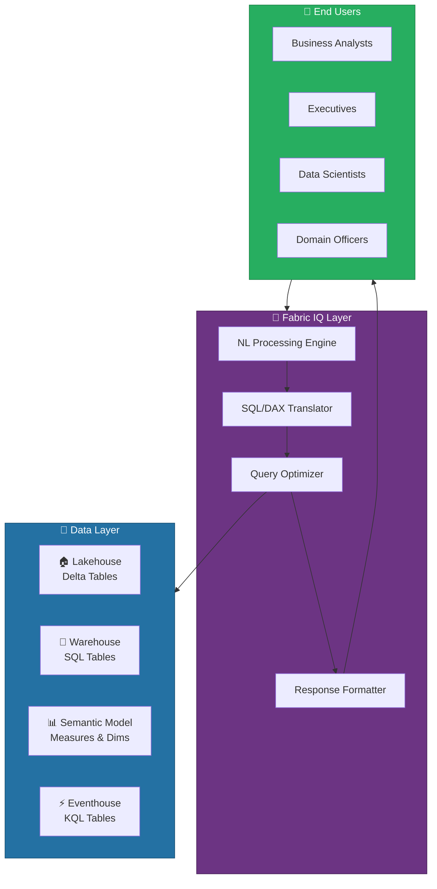
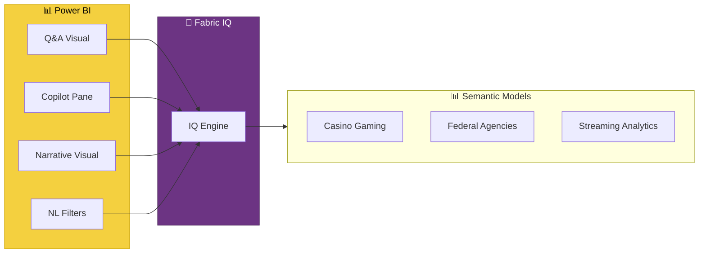
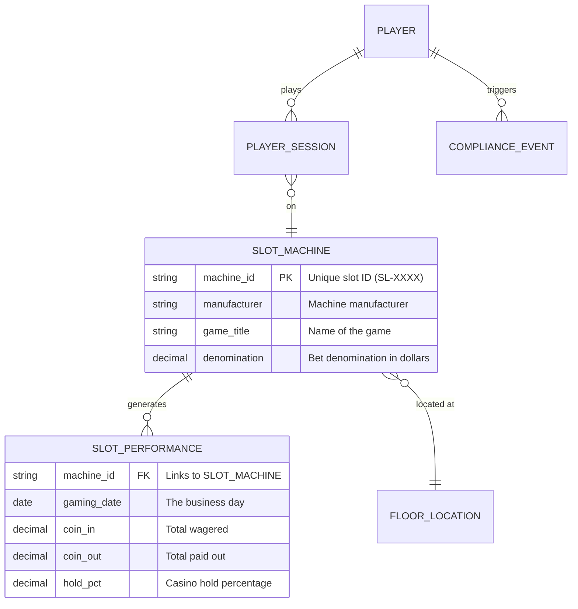
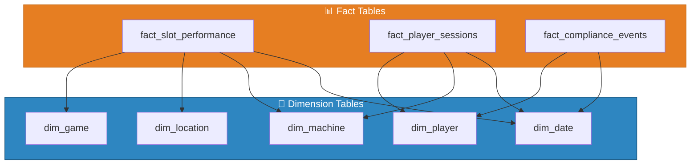
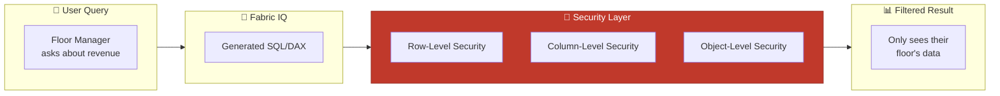
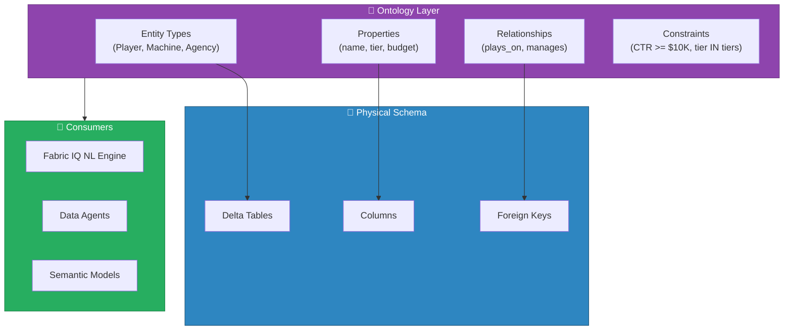
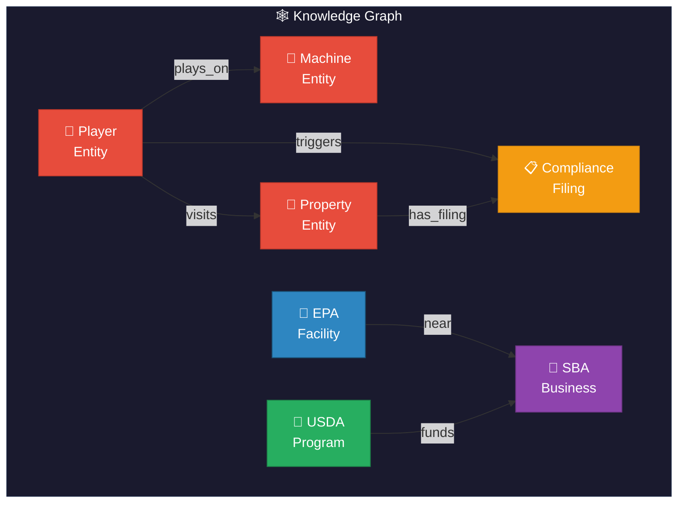

[Home](../index.md) > [Docs](../) > [Features](./) > Fabric IQ

# 🧠 Fabric IQ - Natural Language Analytics


<div align="center" markdown>

**Unlock Data Insights with Natural Language**


</div>

---

**Last Updated:** `2026-04-13` | **Version:** 2.0.0

---

## 📑 Table of Contents

- [🎯 What is Fabric IQ](#-what-is-fabric-iq)
- [🏗️ Architecture Overview](#️-architecture-overview)
- [⚙️ Setup and Configuration](#️-setup-and-configuration)
- [🔄 How It Works: NL to SQL/DAX Translation](#-how-it-works-nl-to-sqldax-translation)
- [🔌 Integration Points](#-integration-points)
- [🏛️ Agency Use Cases](#️-agency-use-cases)
- [📐 Data Preparation Best Practices](#-data-preparation-best-practices)
- [📊 Semantic Model Optimization](#-semantic-model-optimization)
- [⚠️ Limitations and Workarounds](#️-limitations-and-workarounds)
- [🔐 Security Considerations](#-security-considerations)
- [📚 References](#-references)
- [🧬 Ontology Items](#-ontology-items)
- [📋 Plan Items](#-plan-items)
- [🕸️ Knowledge Graph](#️-knowledge-graph)
- [🤖 Data Agents Integration](#-data-agents-integration)
- [🔄 Fabric IQ Evolution](#-fabric-iq-evolution)

---

## 🎯 What is Fabric IQ

Fabric IQ is Microsoft Fabric's natural language querying engine that enables users to ask questions about their data in plain English and receive structured answers powered by SQL and DAX translation. Rather than requiring analysts and domain experts to learn query languages, Fabric IQ bridges the gap between business questions and technical data access.

### Key Capabilities

| Capability | Description |
|-----------|-------------|
| **Natural Language Queries** | Ask questions in plain English about any dataset in your Fabric workspace |
| **SQL/DAX Translation** | Automatically converts natural language into optimized SQL or DAX |
| **Multi-Source** | Queries across Lakehouse, Warehouse, and Semantic Models |
| **Context-Aware** | Uses semantic model metadata, descriptions, and relationships for accuracy |
| **Conversational** | Supports follow-up questions that refine or extend previous queries |
| **Visual Output** | Returns results as tables, charts, or narrative summaries |

### How Fabric IQ Fits in the Analytics Stack



---

## 🏗️ Architecture Overview

Fabric IQ operates as an AI-powered middleware layer that sits between the user's natural language input and the underlying data engines. The architecture leverages Azure OpenAI models tuned specifically for data querying scenarios.

### Component Architecture

```mermaid
flowchart LR
    subgraph Input["📝 Input Processing"]
        Q["User Question"]
        CTX["Conversation Context"]
        HIST["Query History"]
    end

    subgraph Understanding["🧠 Understanding"]
        INT["Intent Classification"]
        ENT["Entity Extraction"]
        DIS["Disambiguation"]
    end

    subgraph Generation["⚙️ Query Generation"]
        SCH["Schema Mapping"]
        QG["Query Builder"]
        VAL["Validation"]
    end

    subgraph Execution["🚀 Execution"]
        SQL["SQL Engine"]
        DAX["DAX Engine"]
        KQL["KQL Engine"]
    end

    subgraph Output["📊 Output"]
        TAB["Table Results"]
        VIZ["Visualizations"]
        NAR["Narrative"]
    end

    Input --> Understanding --> Generation --> Execution --> Output

    style Understanding fill:#6C3483,stroke:#4A235A,color:#fff
    style Generation fill:#2E86C1,stroke:#1A5276,color:#fff
    style Execution fill:#E67E22,stroke:#CA6F1E,color:#fff
```



### Processing Pipeline

1. **Intent Classification** -- Determines whether the user wants aggregation, filtering, comparison, trend analysis, or anomaly detection
2. **Entity Extraction** -- Identifies tables, columns, measures, time ranges, and filter values from the natural language input
3. **Schema Mapping** -- Maps extracted entities to actual database objects using semantic model metadata and descriptions
4. **Query Builder** -- Constructs the SQL or DAX query with appropriate joins, aggregations, and filters
5. **Validation** -- Verifies the generated query is syntactically correct and semantically reasonable
6. **Execution** -- Runs the query against the target engine (SQL for Lakehouse/Warehouse, DAX for Semantic Models)
7. **Response Formatting** -- Structures results as tables, charts, or narrative text based on the question type

---

## ⚙️ Setup and Configuration

### Prerequisites

| Requirement | Details |
|------------|---------|
| **Fabric Capacity** | F2 or higher (Copilot features require F2+) |
| **License** | Fabric capacity license or Power BI Premium per User |
| **Tenant Setting** | Copilot and AI features enabled in Admin Portal |
| **Semantic Model** | Well-documented semantic model with descriptions |
| **Region** | Available in supported Azure regions |

### Step 1: Enable at the Tenant Level

Navigate to the Fabric Admin Portal and enable the Copilot and AI features:

```
Admin Portal → Tenant Settings → Copilot and Azure OpenAI Service
  ├── Users can use Copilot and other features powered by Azure OpenAI → Enabled
  ├── Data sent to Azure OpenAI can be processed outside your capacity's geographic region → Configure per policy
  └── Users can use Fabric IQ → Enabled
```

> 📝 **Note**: Tenant-level settings must be configured by a Fabric Admin. For federal workloads, ensure the data residency setting aligns with your compliance requirements (FedRAMP, FISMA).

### Step 2: Configure Workspace Settings

In each workspace where Fabric IQ will be used:

```
Workspace Settings → General → Copilot
  ├── Allow Copilot in this workspace → On
  └── IQ data access → Configure which semantic models are accessible
```

### Step 3: Prepare Your Semantic Model

The quality of Fabric IQ responses depends heavily on your semantic model metadata. Configure the following in your semantic model:

```python
# Example: Adding descriptions programmatically via XMLA endpoint
import xmla

# Table descriptions
table_descriptions = {
    "gold_slot_performance": "Aggregated slot machine performance metrics including hold percentage, coin-in, coin-out, and jackpot frequency by machine, denomination, and time period",
    "gold_player_value": "Player lifetime value calculations including total wagered, total won, visit frequency, average daily theoretical, and loyalty tier",
    "bronze_usda_crop_production": "Raw USDA crop production statistics by state, commodity, and year from the NASS QuickStats API",
    "silver_epa_tri_releases": "Cleansed EPA Toxics Release Inventory data with validated chemical names, facility locations, and release quantities"
}

# Column descriptions
column_descriptions = {
    "gold_slot_performance.hold_pct": "The percentage of money wagered that the casino retains. Calculated as (coin_in - coin_out) / coin_in. Industry standard range: 2-15%",
    "gold_slot_performance.coin_in": "Total amount wagered on the slot machine in dollars",
    "gold_player_value.adt": "Average Daily Theoretical - the expected daily revenue from a player based on their play patterns"
}
```

### Step 4: Validate IQ Readiness

Run the IQ readiness assessment to identify metadata gaps:

```sql
-- Check for tables missing descriptions
SELECT
    t.name AS table_name,
    CASE WHEN t.description IS NULL OR t.description = '' THEN 'Missing' ELSE 'OK' END AS description_status,
    COUNT(c.name) AS total_columns,
    SUM(CASE WHEN c.description IS NULL OR c.description = '' THEN 1 ELSE 0 END) AS columns_missing_descriptions
FROM sys.tables t
LEFT JOIN sys.columns c ON t.object_id = c.object_id
GROUP BY t.name, t.description
ORDER BY columns_missing_descriptions DESC;
```

---

## 🔄 How It Works: NL to SQL/DAX Translation

### Translation Examples

Fabric IQ translates natural language into the appropriate query language based on the target data source:

#### SQL Translation (Lakehouse / Warehouse)

**User Question:** "What was the total coin-in by denomination for the last 30 days?"

**Generated SQL:**
```sql
SELECT
    denomination,
    SUM(coin_in) AS total_coin_in,
    COUNT(DISTINCT machine_id) AS machine_count
FROM gold_slot_performance
WHERE gaming_date >= DATEADD(DAY, -30, GETDATE())
GROUP BY denomination
ORDER BY total_coin_in DESC;
```

#### DAX Translation (Semantic Model)

**User Question:** "Show me the top 10 players by lifetime value who visited this month"

**Generated DAX:**
```dax
EVALUATE
TOPN(
    10,
    FILTER(
        SUMMARIZECOLUMNS(
            'Player'[PlayerID],
            'Player'[PlayerName],
            'Player'[LoyaltyTier],
            "LifetimeValue", [Total Lifetime Value],
            "VisitsThisMonth", [Visits Current Month]
        ),
        [VisitsThisMonth] > 0
    ),
    [LifetimeValue], DESC
)
```

#### KQL Translation (Eventhouse)

**User Question:** "Show me slot machines with error rates above 5% in the last hour"

**Generated KQL:**
```kql
SlotTelemetry
| where Timestamp > ago(1h)
| summarize
    TotalEvents = count(),
    ErrorEvents = countif(EventType == "Error")
    by MachineId, Location
| extend ErrorRate = round(todouble(ErrorEvents) / TotalEvents * 100, 2)
| where ErrorRate > 5.0
| order by ErrorRate desc
```

### Translation Confidence

Fabric IQ provides a confidence score with each translation:

| Confidence Level | Score Range | Behavior |
|-----------------|-------------|----------|
| **High** | 90-100% | Executes automatically, returns results |
| **Medium** | 70-89% | Executes but shows the generated query for validation |
| **Low** | 50-69% | Asks clarifying questions before executing |
| **Insufficient** | <50% | Returns suggestions for how to rephrase the question |

> 💡 **Tip**: The more descriptive your semantic model metadata (table descriptions, column descriptions, measure descriptions), the higher the translation confidence will be.

---

## 🔌 Integration Points

### Power BI Integration

Fabric IQ integrates directly into Power BI reports and dashboards:

| Feature | Description |
|---------|-------------|
| **Q&A Visual** | Embed a Fabric IQ-powered Q&A visual in any Power BI report |
| **Copilot Pane** | Use the Copilot side panel to ask questions about the current report |
| **Narrative Smart Visual** | Auto-generated text summaries powered by IQ |
| **Natural Language Filters** | Type filter expressions in natural language |



### Notebook Integration

Use Fabric IQ programmatically within notebooks:

```python
# Using Fabric IQ in a PySpark notebook
from fabric.iq import FabricIQ

iq = FabricIQ(workspace="ws-gaming-domain")

# Ask a question and get a DataFrame
result = iq.ask("What were the top 5 slot machines by revenue last week?")
display(result.to_dataframe())

# Get the generated query for review
print(result.generated_query)

# Provide feedback to improve future translations
result.feedback(rating=5, correct=True)
```

### Lakehouse Integration

Fabric IQ can query Lakehouse tables directly when connected via a semantic model or through SQL analytics endpoints:

```python
# Query Lakehouse tables through IQ
result = iq.ask(
    question="Show me USDA corn production trends for Iowa since 2020",
    data_source="lh_silver",
    output_format="chart"
)
```

---

## 🏛️ Agency Use Cases

### 🎰 Casino/Gaming

Casino operators need rapid access to gaming floor performance, player analytics, and compliance data. Fabric IQ makes these insights accessible to floor managers and compliance officers without SQL knowledge.

| Question | IQ Translates To | Output |
|----------|-----------------|--------|
| "Show me slot machines with hold percentage below 5% this week" | SQL query against `gold_slot_performance` filtering `hold_pct < 5` for current week | Table of underperforming machines with location, denomination, and hold % |
| "Which players triggered CTR thresholds today?" | SQL query against `silver_compliance_ctr` for transactions >= $10,000 today | Alert table with player ID, transaction amount, and timestamp |
| "What's the average daily theoretical for platinum players this month?" | DAX measure calculation on `gold_player_value` filtered to Platinum tier | Single metric with trend sparkline |
| "Compare weekend vs weekday slot revenue for Q1" | SQL with CASE on day-of-week grouping against `gold_slot_performance` | Comparison bar chart |

**Example Conversation:**

```
User: "Show me slot machines with hold percentage below 5% this week"

IQ: Here are 23 slot machines with hold percentage below 5% for this week
    (March 6-12, 2026):

    | Machine ID | Location    | Denom | Hold % | Coin-In     |
    |-----------|-------------|-------|--------|-------------|
    | SL-4421   | Floor 2, A3 | $0.25 | 2.1%   | $45,230.00  |
    | SL-7833   | Floor 1, B7 | $1.00 | 3.4%   | $128,550.00 |
    | SL-2109   | High Limit  | $5.00 | 4.2%   | $312,000.00 |
    | ...       | ...         | ...   | ...    | ...         |

    💡 The average hold percentage across all machines this week is 7.8%.
       These 23 machines are performing below the 5% threshold.

User: "Which of those are in the high limit area?"

IQ: Filtering to High Limit area, there are 5 machines below 5% hold:
    ...
```

### 🌾 USDA (Agriculture)

Agricultural analysts can query crop production, acreage, and yield data without needing to navigate NASS data structures.

| Question | IQ Translates To | Output |
|----------|-----------------|--------|
| "What was corn production in Iowa for the last 3 years?" | SQL against `silver_usda_crop_production` filtered by commodity='CORN', state='IOWA', year IN (2023,2024,2025) | Trend table with year-over-year comparison |
| "Which states had the highest soybean yield in 2025?" | SQL with ORDER BY yield DESC LIMIT 10 on `gold_usda_crop_rankings` | Ranked bar chart by state |
| "Compare wheat acreage planted vs harvested by state" | SQL joining planted and harvested acreage from `silver_usda_crop_production` | Side-by-side comparison table |
| "What percentage of national corn production comes from the top 5 states?" | SQL with window functions for percentage calculation | Pie chart with percentages |

### 🌊 EPA (Environment)

Environmental analysts can investigate toxic releases, facility compliance, and pollution trends across the EPA Toxics Release Inventory.

| Question | IQ Translates To | Output |
|----------|-----------------|--------|
| "Which facilities had the highest toxic releases in 2024?" | SQL against `silver_epa_tri_releases` ordered by total_release_amount for year 2024 | Ranked table with facility name, location, chemical, and pounds released |
| "Show me the trend of lead releases in Michigan over 10 years" | SQL time-series query filtered by chemical='Lead' and state='MI' | Line chart showing annual trend |
| "What are the top 5 chemicals released in the water category?" | SQL aggregation on `silver_epa_tri_releases` filtered by release_medium='Water' | Bar chart of chemicals by total pounds |
| "Compare air vs water releases for the automotive industry" | SQL with CASE pivot on release_medium filtered by industry_sector | Comparison chart |

### 🌀 NOAA (Weather & Climate)

Weather and climate researchers can query historical storm data, observations, and climate records using natural language.

| Question | IQ Translates To | Output |
|----------|-----------------|--------|
| "Show me all Category 4+ hurricanes in the last decade" | SQL against `silver_noaa_storm_events` filtered by event_type='Hurricane' AND category >= 4 AND year >= 2016 | Table with storm name, category, date, affected states |
| "What was the average temperature in Phoenix for each month in 2025?" | SQL aggregation on `silver_noaa_observations` grouped by month | Line chart showing monthly averages |
| "How many severe weather warnings were issued in Texas last year?" | SQL count on `silver_noaa_alerts` filtered by state and year | Count with breakdown by alert type |
| "Show me the trend of annual precipitation in California since 2015" | SQL time-series on `gold_noaa_climate_summary` | Trend line with drought annotations |

### 🏔️ DOI (Interior)

Natural resource managers can query geological, land management, and earthquake data.

| Question | IQ Translates To | Output |
|----------|-----------------|--------|
| "Show me all earthquakes above magnitude 5 in the Pacific Northwest this year" | SQL against `silver_doi_earthquake_events` with geo-filter and mag >= 5 | Map visualization with event table |
| "What is the total acreage of national parks by state?" | SQL aggregation on `silver_doi_land_management` grouped by state | Ranked bar chart |

### 💼 SBA (Small Business)

SBA analysts can investigate loan programs, disaster assistance, and small business demographics.

| Question | IQ Translates To | Output |
|----------|-----------------|--------|
| "What was the total PPP loan amount by state in 2024?" | SQL aggregation on `silver_sba_ppp_loans` grouped by state | Choropleth map or ranked table |
| "Show me the trend of 7(a) loan approvals over the last 5 years" | SQL time-series on `silver_sba_7a_loans` | Trend line chart |

---

## 📐 Data Preparation Best Practices

Fabric IQ accuracy is directly proportional to the quality of your data model metadata. Follow these practices to maximize IQ effectiveness.

### 1. Table and Column Naming

Use clear, descriptive names that a non-technical user would understand:

| Practice | Bad Example | Good Example |
|----------|-------------|-------------|
| Avoid abbreviations | `sl_perf_mth` | `slot_performance_monthly` |
| Use business terms | `tbl_ctr_comp` | `compliance_currency_transactions` |
| Include context | `data` | `usda_crop_production_by_state` |
| Avoid prefixes in display | `dbo.fact_rev` | `Revenue` (display name) |

### 2. Add Comprehensive Descriptions

Every table and column should have a business-friendly description:

```json
{
    "table": "gold_slot_performance",
    "description": "Daily aggregated slot machine performance metrics. Each row represents one machine for one gaming day. Includes financial metrics (coin-in, coin-out, hold), utilization metrics (hours played, sessions), and maintenance flags.",
    "columns": {
        "machine_id": "Unique identifier for the slot machine (format: SL-XXXX)",
        "hold_pct": "Casino hold percentage - the portion of money wagered that the casino retains. Formula: (coin_in - coin_out) / coin_in * 100. Industry standard: 2-15%. Values below 2% or above 15% may indicate machine issues.",
        "coin_in": "Total dollars wagered on this machine for the gaming day. Includes all denominations converted to dollar amount.",
        "adt": "Average Daily Theoretical - the expected casino revenue from this machine based on game math and denomination. Used for capacity planning."
    }
}
```

### 3. Define Synonyms and Aliases

Configure synonyms so IQ understands domain-specific terminology:

```json
{
    "synonyms": {
        "revenue": ["coin_in", "total_wagered", "handle"],
        "profit": ["hold", "win", "net_revenue"],
        "player": ["patron", "guest", "customer", "gambler"],
        "slot machine": ["slot", "game", "device", "unit"],
        "hold percentage": ["hold_pct", "hold rate", "house edge", "win percentage"]
    }
}
```

### 4. Create Measure Descriptions

For DAX measures in semantic models, include detailed descriptions:

```dax
-- Good: Descriptive measure with explanation
Total Revenue =
    -- Total gaming revenue across all slot machines
    -- Calculated as the sum of coin-in minus coin-out (net casino win)
    -- Use for: Financial reporting, floor performance analysis
    -- Time intelligence: Supports year-over-year, month-over-month comparisons
    SUMX(
        'SlotPerformance',
        'SlotPerformance'[CoinIn] - 'SlotPerformance'[CoinOut]
    )
```

### 5. Establish Clear Relationships

Well-defined relationships help IQ understand how to join tables:



---

## 📊 Semantic Model Optimization

### Optimization Checklist

| Area | Action | Impact on IQ |
|------|--------|-------------|
| **Naming** | Use business-friendly display names for all tables and columns | High - IQ maps NL terms to display names |
| **Descriptions** | Add descriptions to every table, column, and measure | Critical - Primary source for NL understanding |
| **Relationships** | Define all foreign key relationships explicitly | High - Enables correct joins |
| **Hierarchies** | Create date, geography, and product hierarchies | Medium - Enables drill-down questions |
| **Synonyms** | Configure synonyms for domain-specific terms | High - Handles industry jargon |
| **Formatting** | Set appropriate data types and format strings | Medium - Ensures correct output formatting |
| **Folders** | Organize measures into display folders | Low - Helps IQ categorize measures |

### Semantic Model Design Patterns

#### Pattern 1: Star Schema for IQ



> 💡 **Tip**: Star schemas are strongly preferred over snowflake schemas for Fabric IQ because the simpler join paths produce more accurate query translations.

#### Pattern 2: Cross-Domain Semantic Model

For executive dashboards that span multiple agencies, create a unified semantic model with clear domain prefixes:

```
Executive Semantic Model
├── Gaming/
│   ├── Slot Revenue
│   ├── Table Game Revenue
│   └── Player Metrics
├── Agriculture (USDA)/
│   ├── Crop Production
│   ├── Acreage Planted
│   └── Yield by State
├── Environment (EPA)/
│   ├── Toxic Releases
│   ├── Facility Compliance
│   └── Chemical Trends
└── Weather (NOAA)/
    ├── Storm Events
    ├── Climate Observations
    └── Alert History
```

---

## ⚠️ Limitations and Workarounds

### Known Limitations

| Limitation | Details | Workaround |
|-----------|---------|-----------|
| **Complex Joins** | IQ may struggle with queries requiring 4+ table joins | Create pre-joined Gold views or denormalized tables |
| **Custom Functions** | Cannot call user-defined functions in generated queries | Wrap complex logic in views or materialized measures |
| **Ambiguous Terms** | Generic terms like "revenue" may map incorrectly across domains | Use domain-specific synonyms and clear naming |
| **Time Intelligence** | Complex fiscal calendar logic may not translate correctly | Pre-build fiscal calendar DAX measures |
| **Subqueries** | Nested subqueries are not always generated correctly | Simplify data model to reduce subquery need |
| **Language Support** | Best performance in English; other languages have reduced accuracy | Use English for queries; localize output separately |
| **Row Limits** | Results limited to 10,000 rows by default | Add explicit pagination or export to notebook |
| **Real-Time Data** | Slight latency when querying Eventhouse through IQ | Use KQL directly for sub-second latency needs |

### Improving Accuracy

When IQ returns incorrect results, use these strategies:

1. **Rephrase the Question** -- Be more specific about tables, time ranges, and metrics
2. **Add Context** -- Reference specific table or measure names in your question
3. **Provide Feedback** -- Use the thumbs up/down feedback to train IQ on your data model
4. **Check Metadata** -- Ensure descriptions accurately reflect column content
5. **Simplify the Model** -- Reduce ambiguity by consolidating similar columns

> 📝 **Note**: Fabric IQ improves over time as it learns from user feedback and query patterns within your organization.

---

## 🔐 Security Considerations

### Row-Level Security (RLS) Enforcement

Fabric IQ fully respects Row-Level Security defined in your semantic models. When a user asks a question, the response only includes data they are authorized to see.



### Security Best Practices

| Practice | Description |
|----------|-------------|
| **RLS on Sensitive Data** | Apply RLS to compliance, player PII, and financial tables |
| **CLS for PII** | Use Column-Level Security to mask SSN, credit card numbers |
| **Audit Logging** | Enable audit logging to track all IQ queries and who asked them |
| **Data Boundaries** | Configure data boundary settings to keep queries within region |
| **Role Testing** | Test IQ responses under each RLS role to verify correct filtering |

### Compliance Alignment

| Framework | IQ Consideration |
|-----------|-----------------|
| **NIGC MICS** | IQ queries against compliance tables are filtered per gaming floor authorization |
| **FedRAMP** | Federal workloads must have data boundary set to US regions only |
| **HIPAA** | Tribal Healthcare workspace IQ must enforce CLS on PHI columns |
| **PCI DSS** | Card number columns should be masked; IQ cannot reveal raw card data |
| **42 CFR Part 2** | Substance abuse treatment data requires explicit consent before IQ access |

### Audit Trail

All Fabric IQ interactions are logged in the Fabric audit log:

```kql
// Query Fabric IQ audit events
FabricAuditLogs
| where Activity == "FabricIQQuery"
| project
    Timestamp,
    UserId,
    WorkspaceName,
    NaturalLanguageQuery,
    GeneratedQuery,
    RowsReturned,
    ConfidenceScore
| order by Timestamp desc
```

---

## 📚 References

| Resource | URL |
|----------|-----|
| Microsoft Fabric Copilot Overview | https://learn.microsoft.com/fabric/get-started/copilot-fabric-overview |
| Q&A in Power BI | https://learn.microsoft.com/power-bi/natural-language/q-and-a-intro |
| Semantic Model Best Practices | https://learn.microsoft.com/fabric/fundamentals/semantic-models-best-practices |
| Row-Level Security in Fabric | https://learn.microsoft.com/fabric/security/service-admin-row-level-security |
| Fabric Admin Settings for Copilot | https://learn.microsoft.com/fabric/admin/service-admin-portal-copilot |

---

## 🧬 Ontology Items

> **Status:** Preview | **Introduced:** April 2026

Ontology Items are a new Preview capability in Fabric IQ that allow you to define **entity types, relationships, properties, and constraints** over your data. Rather than treating tables and columns as raw schema objects, ontology items transform them into meaningful business concepts that both humans and AI agents can understand.

### What Ontology Items Do

An ontology elevates your data from a technical schema into a **semantic data layer**. For example, a column named `player_id` in a Lakehouse table becomes a **Player** entity with rich properties like `name`, `tier`, `lifetime_value`, and `preferred_denomination`. This mapping enables Fabric IQ to reason about your data at a business level rather than a column level.

### Casino/Gaming Ontology Example

| Entity | Properties | Relationships |
|--------|-----------|---------------|
| **Player** | name, loyalty_tier, lifetime_value, signup_date | plays_on → Machine, triggers → Compliance_Filing |
| **Machine** | machine_id, game_title, denomination, manufacturer | located_at → Floor_Location, generates → Performance_Record |
| **Transaction** | amount, type, timestamp, method | initiated_by → Player, processed_at → Machine |
| **Compliance_Filing** | filing_type (CTR/SAR/W-2G), threshold, status | filed_for → Player, reviewed_by → Compliance_Officer |

### Federal Agency Ontology Example

| Entity | Properties | Relationships |
|--------|-----------|---------------|
| **Agency** | name, acronym, budget, jurisdiction | manages → Program, publishes → Report |
| **Program** | program_name, funding_level, start_date, status | serves → Beneficiary, funded_by → Agency |
| **Beneficiary** | beneficiary_type, location, demographics | enrolled_in → Program |
| **Report** | report_type, period, publication_date | produced_by → Agency, covers → Program |

### Ontology Structure



### Configuring Ontology Items

Navigate to the Fabric IQ experience in your workspace and select **Ontology Items (Preview)** from the item creation menu. From there you can:

1. **Auto-discover entities** -- Fabric IQ scans your Lakehouse or Warehouse tables and proposes entity types based on naming patterns, foreign keys, and column types
2. **Manually define entities** -- Create entity types, map them to tables, assign properties to columns, and define relationships
3. **Add business rules** -- Attach constraints (e.g., CTR threshold = $10,000) and validation logic to entity properties
4. **Publish** -- Once published, the ontology is available to all Fabric IQ consumers in the workspace

> 💡 **Tip**: Start with auto-discovery and then refine. The auto-discovery engine handles 70-80% of common patterns, and manual refinement brings accuracy to 95%+ for domain-specific concepts.

---

## 📋 Plan Items

> **Status:** Preview | **Introduced:** April 2026

Plan Items introduce a **unified, no-code collaborative planning surface** within Fabric IQ. A Plan brings together reporting, analytics, data integration, and management into a single view, enabling business teams to plan and execute data-driven initiatives without switching between tools.

### Key Capabilities

| Capability | Description |
|-----------|-------------|
| **Unified Canvas** | Combine Power BI visuals, data tables, text annotations, and action items in one planning surface |
| **Collaborative Editing** | Multiple users can edit the same plan simultaneously with real-time sync and commenting |
| **Semantic Model Integration** | Plans connect directly to Power BI semantic models for live data, measures, and calculations |
| **Scenario Modeling** | Create what-if scenarios by adjusting parameters and seeing projected outcomes in real time |
| **Action Tracking** | Assign follow-up actions to team members with due dates and status tracking |
| **Version History** | Full audit trail of plan changes, who made them, and when |

### Use Cases

#### Casino Revenue Forecasting Plan

A revenue planning surface that combines:
- Live slot and table game revenue from the Gold semantic model
- Projected revenue scenarios based on seasonal patterns and events
- Floor layout optimization recommendations with expected lift
- Action items for floor managers (machine moves, denomination changes)
- Compliance checkpoints (CTR filing targets, audit readiness)

#### Federal Budget Allocation Planning

A multi-agency budget planning surface that combines:
- Current budget utilization by program from agency Gold tables
- Grant disbursement forecasts with historical trend baselines
- Scenario modeling for budget reallocation across programs
- Cross-agency comparison dashboards with USDA, SBA, EPA, NOAA, and DOI data
- Action tracking for program managers and budget officers

### Creating a Plan Item

```
Workspace → New Item → Plan (Preview)
  ├── Connect to Semantic Model → Select model(s)
  ├── Add Planning Sections → Revenue, Operations, Compliance
  ├── Configure Scenarios → Baseline, Optimistic, Conservative
  └── Invite Collaborators → Assign roles (Editor, Viewer, Contributor)
```

> 📝 **Note**: Plan Items require the same Fabric capacity as Copilot features (F2+). Collaborative editing requires all participants to have at least a Viewer role in the workspace.

---

## 🕸️ Knowledge Graph

> **Status:** Preview | **Introduced:** April 2026

Fabric IQ now builds **knowledge graphs** from ontology definitions, enabling complex relationship traversal and graph-powered insights that go far beyond simple SQL joins. The knowledge graph connects entities across tables, lakehouses, and even workspaces, allowing users to ask questions that span multiple domains.

### How the Knowledge Graph Works

When you define ontology items with entities and relationships, Fabric IQ automatically constructs a navigable knowledge graph. This graph enables:

1. **Multi-Hop Queries** -- Traverse relationships across several entities in a single natural language question
2. **Implicit Joins** -- IQ infers the join path from the graph without requiring users to know the schema
3. **Cross-Domain Discovery** -- Find connections between entities that exist in different lakehouses or semantic models
4. **Pattern Detection** -- Identify recurring relationship patterns that indicate business insights or risks

### Casino Example: Multi-Hop Query

**User Question:** "Which high-value players visited properties with compliance flags in the last 90 days?"

This question requires traversing: **Player** → (plays_at) → **Property** → (has_filing) → **Compliance_Filing**, filtering by `player.lifetime_value > threshold` and `compliance_filing.status = 'flagged'` and `date >= 90 days ago`.

Without the knowledge graph, this would require the user to know three tables and their join keys. With the graph, Fabric IQ resolves the path automatically.

### Federal Example: Cross-Agency Query

**User Question:** "Show me EPA facilities near SBA-funded businesses in flood-prone NOAA zones"

This traverses across three agency ontologies: **EPA_Facility** → (geo_near) → **SBA_Business** → (located_in) → **NOAA_Flood_Zone**, combining geospatial proximity with relationship traversal.

### Knowledge Graph Architecture



### Query Performance

The knowledge graph uses indexed adjacency lists and materialized relationship paths to ensure graph traversal queries execute within Power BI's interactive latency expectations:

| Traversal Depth | Expected Latency | Use Case |
|----------------|------------------|----------|
| 1 hop | < 1 second | Direct relationships (Player → Sessions) |
| 2 hops | 1-3 seconds | Indirect relationships (Player → Machine → Location) |
| 3+ hops | 3-10 seconds | Cross-domain discovery (Player → Property → Compliance → Reviewer) |

> ⚠️ **Note**: Graph queries beyond 3 hops may require pre-materialized paths for interactive performance. Consider creating Gold-layer summary tables for frequently traversed paths.

---

## 🤖 Data Agents Integration

> **Status:** Preview | **Introduced:** April 2026

Fabric IQ serves as the **semantic backbone** for [Data Agents](data-agents.md), providing the ontology, knowledge graph, and natural language understanding that agents need to deliver accurate, context-aware responses. Rather than operating on raw schema alone, agents leverage the full Fabric IQ semantic layer.

### How Agents Use Fabric IQ

| Component | Agent Benefit |
|-----------|--------------|
| **Ontology** | Agents understand that `player_id` is a Player with a tier and value, not just an integer column |
| **Knowledge Graph** | Agents traverse relationships to answer multi-step questions without explicit join instructions |
| **NL Translation** | Agents delegate query generation to the IQ engine for optimized SQL/DAX/KQL |
| **Semantic Metadata** | Descriptions, synonyms, and business rules guide agent responses toward domain-accurate answers |
| **Confidence Scoring** | Agents can decide whether to execute a query or ask for clarification based on IQ confidence |

### Agent-Powered Use Case

**User to Agent:** "What's the revenue trend for downtown properties over the last quarter?"

The agent workflow:

1. **Entity Resolution (via Ontology):** Maps "downtown properties" to `Property` entities where `location_zone = 'Downtown'`
2. **Metric Resolution (via Semantic Model):** Identifies "revenue" as the `[Total Revenue]` DAX measure
3. **Time Resolution:** Interprets "last quarter" as the most recent completed fiscal quarter
4. **Query Generation (via IQ Engine):** Generates an optimized DAX query with time intelligence
5. **Graph Enhancement:** Uses the knowledge graph to include related metrics (occupancy, player visits) that add context
6. **Response Formatting:** Returns a trend chart with narrative summary and anomaly callouts

### Configuration

To enable agent access to Fabric IQ capabilities:

```
Workspace Settings → Fabric IQ → Data Agent Access
  ├── Allow agents to use Ontology definitions → On
  ├── Allow agents to traverse Knowledge Graph → On
  ├── Agent query confidence threshold → 70% (recommended)
  └── Agent audit logging → On (required for compliance workloads)
```

> 📝 **Cross-Reference:** For full Data Agent setup, capabilities, and deployment patterns, see [Data Agents](data-agents.md).

---

## 🔄 Fabric IQ Evolution

Fabric IQ has evolved significantly from its initial release as a natural language query tool to a comprehensive **semantic platform** that powers ontology, planning, knowledge graphs, and intelligent agents.

### Version Comparison: v1 vs v2

| Aspect | Fabric IQ v1 (NL-to-SQL) | Fabric IQ v2 (Semantic Platform) |
|--------|--------------------------|----------------------------------|
| **Core Function** | Translate natural language to SQL/DAX/KQL | Full semantic understanding with entity awareness |
| **Data Model Understanding** | Schema-level (tables, columns, relationships) | Ontology-level (entities, properties, constraints, business rules) |
| **Query Scope** | Single-source queries within one Lakehouse or Semantic Model | Cross-source, cross-domain queries via knowledge graph |
| **Planning** | Not available | Unified Plan items with scenario modeling |
| **Agent Support** | Limited (basic NL query delegation) | Full semantic backbone for Data Agents |
| **Relationship Traversal** | Explicit joins based on foreign keys | Implicit multi-hop traversal via knowledge graph |
| **Business Rules** | External (defined in notebooks or pipelines) | Embedded in ontology constraints |
| **Confidence Model** | Score based on schema match | Score based on ontology + graph + semantic context |

### Feature Availability Matrix

| Feature | v1 (GA) | v2 (Preview) | Expected GA |
|---------|---------|-------------|-------------|
| Natural Language Queries | ✅ | ✅ | -- |
| SQL/DAX/KQL Translation | ✅ | ✅ | -- |
| Conversational Follow-ups | ✅ | ✅ | -- |
| Semantic Model Integration | ✅ | ✅ | -- |
| Ontology Items | -- | ✅ | H2 2026 |
| Plan Items | -- | ✅ | H2 2026 |
| Knowledge Graph | -- | ✅ | H2 2026 |
| Data Agents Backbone | -- | ✅ | H2 2026 |
| Cross-Domain Graph Queries | -- | ✅ | 2027 |

### Roadmap: Preview to GA

The v2 Preview features are expected to progress through the following stages:

1. **Private Preview (Current):** Available to tenants with Fabric capacity F64+ and explicit opt-in via Admin Portal
2. **Public Preview (H2 2026):** Available to all Fabric tenants with F2+ capacity
3. **General Availability (Late 2026 / Early 2027):** Full production support with SLAs and compliance certifications (FedRAMP, HIPAA)

### Migration Path for Existing Configurations

If you already have Fabric IQ v1 configured with semantic model metadata, synonyms, and descriptions:

| Existing Configuration | Migration to v2 |
|----------------------|-----------------|
| **Table/Column Descriptions** | Automatically imported into ontology as entity/property descriptions |
| **Synonyms** | Carried forward; can be enriched with ontology aliases |
| **Q&A Linguistic Schema** | Mapped to ontology entity types and relationships |
| **RLS / CLS Rules** | Fully preserved; ontology respects existing security definitions |
| **Feedback History** | Training data is retained and applied to the v2 confidence model |

> 💡 **Tip**: No breaking changes. All v1 NL query functionality continues to work as-is. v2 features are additive -- you can adopt ontology, plans, and knowledge graph incrementally without disrupting existing IQ configurations.

---

## 🔗 Related Documents

- [AI Copilot Configuration](ai-copilot-configuration.md) -- Full Copilot enablement guide
- [Real-Time Intelligence](real-time-intelligence.md) -- RTI integration with IQ
- [Data Mesh Enterprise Patterns](data-mesh-enterprise-patterns.md) -- Cross-domain IQ strategies
- [Architecture](../ARCHITECTURE.md) -- System architecture overview
- [Security](../SECURITY.md) -- Security and compliance framework

---

> 📝 **Document Metadata**
> - **Author**: Documentation Team
> - **Reviewers**: Data Engineering, BI Team, Security
> - **Classification**: Internal
> - **Next Review**: 2026-06-12
