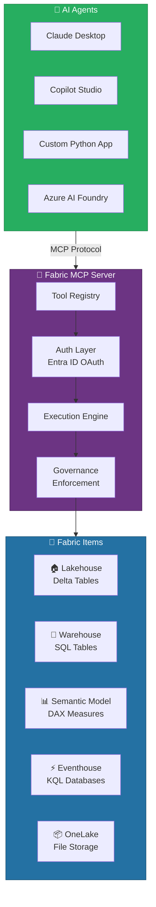
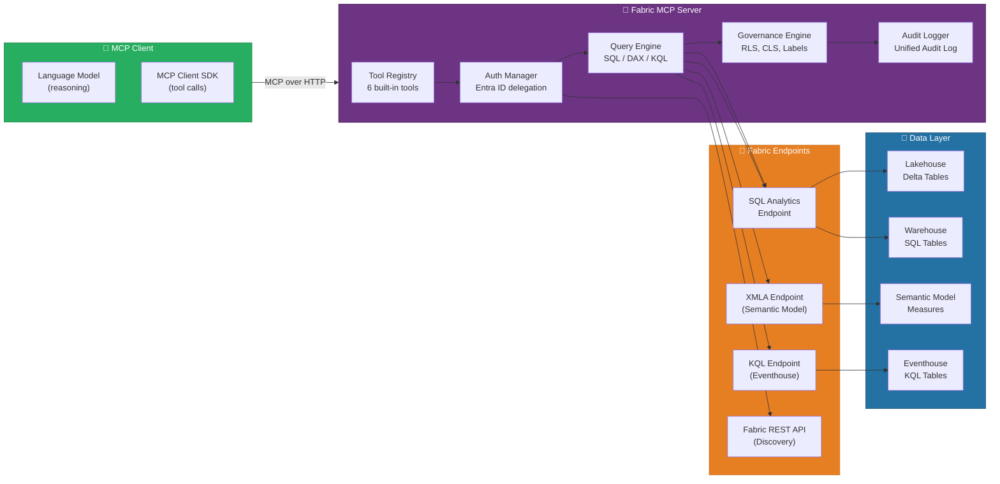
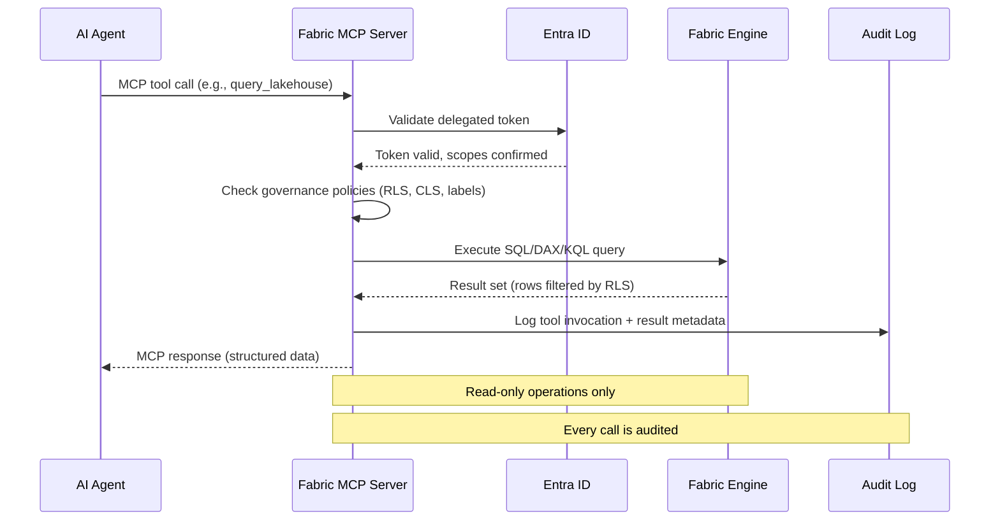
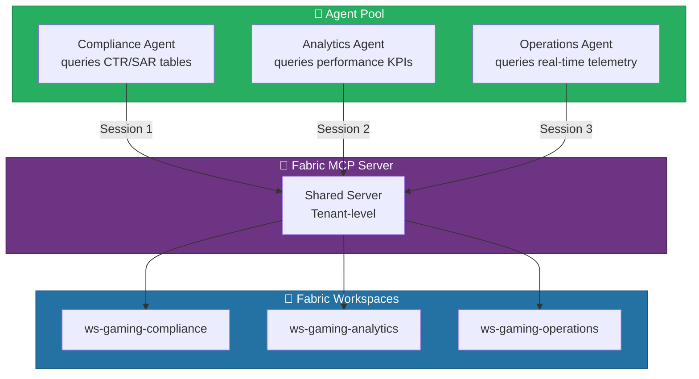
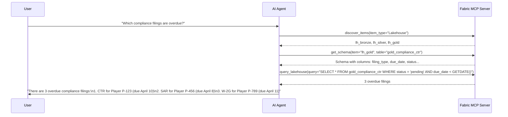
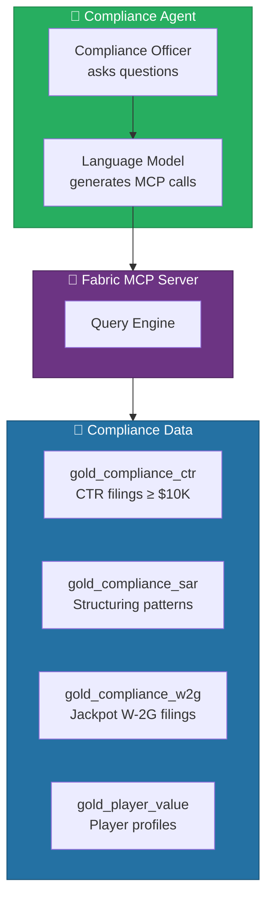
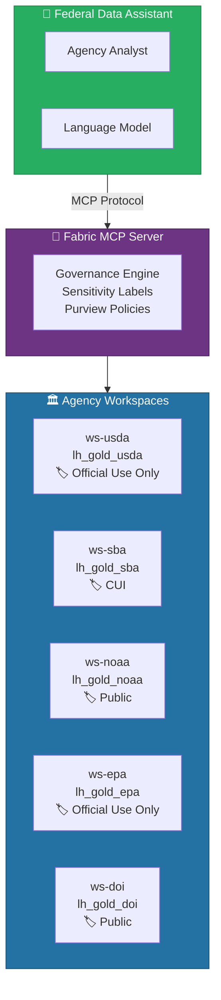

# 🤖 Fabric MCP Server - AI Agent Data Access

<div align="center" markdown>

**Connect AI Agents to Microsoft Fabric via the Model Context Protocol**


</div>

---

**Last Updated:** `2026-04-13` | **Version:** 1.0.0

---

!!! note "Third-party references — publicly sourced, good-faith comparison"
    This page references non-Microsoft products and services. That information is drawn from each vendor's **publicly available documentation** and is offered for honest, good-faith comparison only. This is a personal project written from a Microsoft Fabric and Azure perspective; it does **not** claim expertise in, or authority over, any third-party product, and nothing here is an official statement by, or endorsed by, those vendors. Capabilities, pricing, and features change often — always verify against the vendor's current official documentation. Where a third-party offering is the stronger choice, we say so plainly.

## 🎯 Overview

The Fabric MCP Server is Microsoft Fabric's platform-level implementation of the **Model Context Protocol (MCP)** -- an open standard that lets AI agents discover, query, and govern Fabric items through a structured tool interface. Instead of requiring agents to call REST APIs directly or generate ad-hoc queries, the MCP Server exposes a curated set of tools that encapsulate Fabric operations with built-in authentication, authorization, and governance controls.

MCP transforms Microsoft Fabric from a data analytics platform into an **AI-accessible data platform**. Any MCP-compatible client -- Claude Desktop, Copilot Studio agents, custom Python applications, or Azure AI Foundry agents -- can connect to the Fabric MCP Server and interact with Lakehouses, Warehouses, Semantic Models, and Eventhouses using natural language or structured tool calls.

### Key Capabilities

| Capability | Description |
|-----------|-------------|
| **Item Discovery** | Browse workspaces, list items by type, search across the Fabric tenant |
| **Schema Inspection** | Retrieve table schemas, column types, relationships, and descriptions |
| **Data Querying** | Execute read-only SQL against Lakehouses and Warehouses |
| **DAX Evaluation** | Run DAX queries against Power BI Semantic Models |
| **KQL Execution** | Query Eventhouse KQL databases for real-time analytics |
| **Governance Enforcement** | All operations respect RLS, CLS, sensitivity labels, and Purview policies |
| **Audit Logging** | Every MCP tool invocation is logged in the Fabric unified audit log |

### How Fabric MCP Fits in the AI Stack



### MCP vs. Direct API Access

| Aspect | Direct REST API | Fabric MCP Server |
|--------|----------------|-------------------|
| **Discovery** | Developer must know endpoint URLs and API versions | Agent discovers available tools and schemas dynamically |
| **Authentication** | Manual token management, bearer headers | Delegated OAuth via MCP session -- transparent to agent |
| **Query Generation** | Agent must generate syntactically correct SQL/DAX/KQL | Tools accept parameters; server handles query construction |
| **Governance** | Developer must implement RLS/CLS checks manually | Server enforces policies automatically before returning results |
| **Audit** | Custom logging required | Built-in audit trail in Fabric unified audit log |
| **Error Handling** | Raw HTTP errors, agent must parse | Structured MCP error responses with actionable messages |

---

## 🏗️ Architecture

The Fabric MCP Server runs as a managed service within the Fabric tenant. It exposes a standard MCP endpoint that any compatible client can connect to using Streamable HTTP transport.

### Component Architecture



### Request Flow



### Connection Topology

The MCP Server supports multiple simultaneous client connections, each authenticated independently. This enables multi-agent architectures where specialized agents query different Fabric items through the same server.



---

## ⚙️ Available Tools

The Fabric MCP Server exposes six built-in tools. Each tool has defined parameters, response schemas, and governance enforcement.

### Tool Catalog

| Tool | Purpose | Target Items | Query Language |
|------|---------|-------------|----------------|
| `query_lakehouse` | Execute read-only SQL queries against Lakehouse tables | Lakehouse | T-SQL |
| `query_warehouse` | Execute read-only SQL queries against Warehouse tables | Warehouse | T-SQL |
| `evaluate_dax` | Evaluate DAX expressions against Semantic Models | Semantic Model | DAX |
| `discover_items` | List and search Fabric items by type and workspace | All item types | N/A |
| `get_schema` | Retrieve table/view schema with column types and descriptions | Lakehouse, Warehouse, Semantic Model | N/A |
| `read_table` | Read rows from a table with optional filtering and pagination | Lakehouse, Warehouse | T-SQL (generated) |

### Tool Details

#### `query_lakehouse`

Execute a read-only T-SQL query against a Lakehouse SQL analytics endpoint.

**Parameters:**

| Parameter | Type | Required | Description |
|-----------|------|----------|-------------|
| `workspace_id` | string | Yes | GUID of the Fabric workspace |
| `lakehouse_name` | string | Yes | Name of the Lakehouse item |
| `query` | string | Yes | T-SQL SELECT statement (read-only) |
| `max_rows` | integer | No | Maximum rows to return (default: 1000, max: 10000) |
| `timeout_seconds` | integer | No | Query timeout (default: 120, max: 300) |

**Example Request:**

```json
{
    "tool": "query_lakehouse",
    "parameters": {
        "workspace_id": "a1b2c3d4-e5f6-7890-abcd-ef1234567890",
        "lakehouse_name": "lh_gold",
        "query": "SELECT machine_id, denomination, SUM(coin_in) AS total_coin_in, AVG(hold_pct) AS avg_hold FROM gold_slot_performance WHERE gaming_date >= DATEADD(DAY, -7, GETDATE()) GROUP BY machine_id, denomination ORDER BY total_coin_in DESC",
        "max_rows": 50
    }
}
```

**Example Response:**

```json
{
    "status": "success",
    "row_count": 50,
    "columns": [
        {"name": "machine_id", "type": "varchar", "description": "Unique slot machine identifier"},
        {"name": "denomination", "type": "decimal", "description": "Bet denomination in dollars"},
        {"name": "total_coin_in", "type": "decimal", "description": "Total amount wagered"},
        {"name": "avg_hold", "type": "decimal", "description": "Average hold percentage"}
    ],
    "rows": [
        {"machine_id": "SL-4421", "denomination": 1.00, "total_coin_in": 245830.00, "avg_hold": 7.82},
        {"machine_id": "SL-7833", "denomination": 5.00, "total_coin_in": 198200.00, "avg_hold": 6.15}
    ],
    "truncated": false,
    "execution_time_ms": 342,
    "governance": {
        "rls_applied": true,
        "cls_columns_masked": [],
        "sensitivity_label": "Confidential"
    }
}
```

#### `query_warehouse`

Execute a read-only T-SQL query against a Fabric Warehouse.

**Parameters:**

| Parameter | Type | Required | Description |
|-----------|------|----------|-------------|
| `workspace_id` | string | Yes | GUID of the Fabric workspace |
| `warehouse_name` | string | Yes | Name of the Warehouse item |
| `query` | string | Yes | T-SQL SELECT statement (read-only) |
| `max_rows` | integer | No | Maximum rows to return (default: 1000, max: 10000) |

> 📝 **Note**: The `query_warehouse` and `query_lakehouse` tools share the same parameter structure. The MCP Server routes the query to the appropriate SQL endpoint based on the item type.

#### `evaluate_dax`

Run a DAX expression against a Power BI Semantic Model and return tabular results.

**Parameters:**

| Parameter | Type | Required | Description |
|-----------|------|----------|-------------|
| `workspace_id` | string | Yes | GUID of the Fabric workspace |
| `semantic_model_name` | string | Yes | Name of the Semantic Model |
| `dax_expression` | string | Yes | DAX EVALUATE expression |
| `max_rows` | integer | No | Maximum rows to return (default: 1000) |

**Example Request:**

```json
{
    "tool": "evaluate_dax",
    "parameters": {
        "workspace_id": "a1b2c3d4-e5f6-7890-abcd-ef1234567890",
        "semantic_model_name": "sm-casino-gaming",
        "dax_expression": "EVALUATE TOPN(10, SUMMARIZECOLUMNS('Player'[LoyaltyTier], \"TotalValue\", [Total Lifetime Value], \"PlayerCount\", COUNTROWS('Player')), [TotalValue], DESC)"
    }
}
```

#### `discover_items`

Browse and search Fabric items across workspaces. Supports filtering by item type, workspace, and keyword search.

**Parameters:**

| Parameter | Type | Required | Description |
|-----------|------|----------|-------------|
| `workspace_id` | string | No | Filter to a specific workspace (omit for tenant-wide search) |
| `item_type` | string | No | Filter by type: `Lakehouse`, `Warehouse`, `SemanticModel`, `Eventhouse`, `Notebook`, `Pipeline`, `Report` |
| `search_query` | string | No | Keyword search across item names and descriptions |
| `include_schema` | boolean | No | Include table list for data items (default: false) |

**Example Request:**

```json
{
    "tool": "discover_items",
    "parameters": {
        "workspace_id": "a1b2c3d4-e5f6-7890-abcd-ef1234567890",
        "item_type": "Lakehouse",
        "include_schema": true
    }
}
```

**Example Response:**

```json
{
    "status": "success",
    "items": [
        {
            "name": "lh_bronze",
            "type": "Lakehouse",
            "workspace": "ws-gaming-domain",
            "description": "Bronze layer - raw ingestion tables",
            "tables": ["bronze_slot_telemetry", "bronze_player_transactions", "bronze_compliance_events"],
            "sensitivity_label": "Confidential",
            "last_modified": "2026-04-12T18:30:00Z"
        },
        {
            "name": "lh_silver",
            "type": "Lakehouse",
            "workspace": "ws-gaming-domain",
            "description": "Silver layer - cleansed and validated tables",
            "tables": ["silver_slot_cleansed", "silver_player_validated", "silver_compliance_ctr"],
            "sensitivity_label": "Highly Confidential",
            "last_modified": "2026-04-12T19:15:00Z"
        }
    ],
    "total_count": 2
}
```

#### `get_schema`

Retrieve detailed schema information for a specific table or view, including column names, data types, descriptions, and constraints.

**Parameters:**

| Parameter | Type | Required | Description |
|-----------|------|----------|-------------|
| `workspace_id` | string | Yes | GUID of the Fabric workspace |
| `item_name` | string | Yes | Name of the Lakehouse, Warehouse, or Semantic Model |
| `table_name` | string | Yes | Name of the table or view |
| `include_statistics` | boolean | No | Include row count and column cardinality (default: false) |

**Example Response:**

```json
{
    "status": "success",
    "table": "gold_slot_performance",
    "item": "lh_gold",
    "columns": [
        {"name": "machine_id", "type": "string", "nullable": false, "description": "Unique slot machine identifier (SL-XXXX)"},
        {"name": "gaming_date", "type": "date", "nullable": false, "description": "Business day for the performance record"},
        {"name": "coin_in", "type": "decimal(18,2)", "nullable": false, "description": "Total dollars wagered on the machine"},
        {"name": "coin_out", "type": "decimal(18,2)", "nullable": false, "description": "Total dollars paid out by the machine"},
        {"name": "hold_pct", "type": "decimal(5,2)", "nullable": false, "description": "Casino hold percentage: (coin_in - coin_out) / coin_in * 100"},
        {"name": "denomination", "type": "decimal(5,2)", "nullable": false, "description": "Bet denomination in dollars"}
    ],
    "row_count": 1847293,
    "partition_columns": ["gaming_date"],
    "sensitivity_label": "Confidential"
}
```

#### `read_table`

Read rows from a table with optional column selection, filtering, ordering, and pagination. The MCP Server generates the underlying SQL query.

**Parameters:**

| Parameter | Type | Required | Description |
|-----------|------|----------|-------------|
| `workspace_id` | string | Yes | GUID of the Fabric workspace |
| `item_name` | string | Yes | Name of the Lakehouse or Warehouse |
| `table_name` | string | Yes | Name of the table |
| `columns` | array[string] | No | Columns to return (default: all) |
| `filter` | string | No | SQL WHERE clause expression |
| `order_by` | string | No | SQL ORDER BY expression |
| `limit` | integer | No | Maximum rows (default: 100, max: 10000) |
| `offset` | integer | No | Row offset for pagination (default: 0) |

---

## 🔌 Integration Patterns

### Pattern 1: Claude Desktop Configuration

Connect Claude Desktop to Fabric MCP Server using the `claude_desktop_config.json` configuration file.

```json
{
    "mcpServers": {
        "fabric": {
            "url": "https://<tenant-id>.fabric.microsoft.com/mcp/v1",
            "headers": {
                "Authorization": "Bearer <entra-id-token>"
            },
            "transport": "streamable-http"
        }
    }
}
```

Once configured, Claude Desktop can invoke Fabric MCP tools directly in conversation:

```
User: "What were the top 10 slot machines by revenue last week?"

Claude: Let me query the Lakehouse for that data.
[Invokes query_lakehouse with SQL against gold_slot_performance]

Here are the top 10 slot machines by revenue for the last 7 days:

| Machine ID | Denomination | Total Coin-In   | Hold % |
|-----------|-------------|-----------------|--------|
| SL-4421   | $5.00       | $312,450.00     | 8.2%   |
| SL-7833   | $1.00       | $245,830.00     | 7.8%   |
| ...       | ...         | ...             | ...    |
```

### Pattern 2: Copilot Studio Agent

Build a Copilot Studio agent that connects to the Fabric MCP Server as an action. This enables no-code agent creation with Fabric data access.

```
Copilot Studio → Create Agent
  ├── Name: Casino Floor Assistant
  ├── Description: Answers questions about slot performance and compliance
  ├── Actions → + Add Action → MCP Server
  │     URL: https://<tenant-id>.fabric.microsoft.com/mcp/v1
  │     Authentication: Entra ID (delegated)
  │     Allowed Tools: query_lakehouse, get_schema, discover_items
  └── Instructions:
        "You are a casino floor operations assistant. Use the Fabric MCP tools
         to query slot machine performance, player analytics, and compliance
         data. Always check sensitivity labels before sharing results.
         Never share raw PII (SSN, credit card numbers)."
```

### Pattern 3: Custom Python MCP Client

Build a custom Python application that connects to the Fabric MCP Server programmatically.

```python
from mcp import ClientSession
from mcp.client.streamable_http import streamablehttp_client
from azure.identity import DefaultAzureCredential

# Authenticate via Entra ID
credential = DefaultAzureCredential()
token = credential.get_token("https://analysis.windows.net/powerbi/api/.default")

# Connect to Fabric MCP Server
async with streamablehttp_client(
    url="https://<tenant-id>.fabric.microsoft.com/mcp/v1",
    headers={"Authorization": f"Bearer {token.token}"}
) as (read, write, _):
    async with ClientSession(read, write) as session:
        await session.initialize()

        # Discover available items
        items = await session.call_tool("discover_items", {
            "workspace_id": "a1b2c3d4-e5f6-7890-abcd-ef1234567890",
            "item_type": "Lakehouse"
        })
        print(f"Found {items['total_count']} Lakehouses")

        # Query for compliance data
        result = await session.call_tool("query_lakehouse", {
            "workspace_id": "a1b2c3d4-e5f6-7890-abcd-ef1234567890",
            "lakehouse_name": "lh_gold",
            "query": """
                SELECT player_id, COUNT(*) as transaction_count,
                       SUM(amount) as total_amount
                FROM gold_compliance_ctr
                WHERE filing_date >= DATEADD(DAY, -30, GETDATE())
                GROUP BY player_id
                ORDER BY total_amount DESC
            """,
            "max_rows": 100
        })

        for row in result["rows"]:
            print(f"Player {row['player_id']}: "
                  f"${row['total_amount']:,.2f} "
                  f"({row['transaction_count']} transactions)")
```

### Pattern 4: Azure AI Foundry Agent

Create an Azure AI Foundry agent that uses the Fabric MCP Server as a grounding tool alongside Azure OpenAI models.

```python
from azure.ai.projects import AIProjectClient
from azure.ai.projects.models import FabricTool

client = AIProjectClient(
    credential=DefaultAzureCredential(),
    project="casino-ai-agent"
)

# Create agent with Fabric MCP tool
agent = client.agents.create_agent(
    model="gpt-4o",
    name="Casino Analytics Agent",
    instructions="""
        You are a casino analytics agent with access to Microsoft Fabric data
        through MCP tools. Use query_lakehouse for SQL queries against Delta
        tables, evaluate_dax for semantic model measures, and get_schema to
        understand table structures before querying.
    """,
    tools=[
        FabricTool(
            fabric_connection_id="<fabric-connection-resource-id>"
        )
    ]
)
```

### Pattern 5: Multi-Tool Agent Workflow

Agents can chain multiple MCP tool calls to answer complex questions. The Fabric MCP Server maintains session context so agents can reference schemas discovered in earlier calls.



---

## 🔐 Authentication & Governance

### Authentication Flow

The Fabric MCP Server uses **Entra ID OAuth 2.0 delegated authentication**. The agent operates under the identity of the signed-in user, meaning all data access is scoped to what that user is authorized to see.

```mermaid
flowchart LR
    subgraph Client["🤖 MCP Client"]
        AG["AI Agent"]
    end

    subgraph Auth["🔐 Entra ID"]
        TOK["Token Validation"]
        SCOPE["Scope Verification<br/>Fabric.Read, Dataset.Read"]
    end

    subgraph Server["🔌 Fabric MCP Server"]
        DEL["Delegated Identity<br/>(user context)"]
    end

    subgraph Governance["🛡️ Governance"]
        RLS["Row-Level Security"]
        CLS["Column-Level Security"]
        SL["Sensitivity Labels"]
        PUR["Purview Policies"]
    end

    subgraph Data["💾 Data"]
        D["Filtered Results"]
    end

    AG -->|"Bearer token"| Auth --> DEL --> Governance --> D

    style Auth fill:#C0392B,stroke:#922B21,color:#fff
    style Governance fill:#E67E22,stroke:#CA6F1E,color:#fff
    style Server fill:#6C3483,stroke:#4A235A,color:#fff
```



### Required Permissions

| Permission Scope | Purpose | Required For |
|-----------------|---------|-------------|
| `Fabric.Read.All` | Read Fabric items and metadata | `discover_items`, `get_schema` |
| `Dataset.Read.All` | Read data from Lakehouses and Warehouses | `query_lakehouse`, `query_warehouse`, `read_table` |
| `Dataset.ReadWrite.All` | Evaluate DAX against Semantic Models | `evaluate_dax` |

### Governance Enforcement

Every MCP tool invocation passes through the governance engine before data is returned:

| Governance Layer | Enforcement | Example |
|-----------------|-------------|---------|
| **Row-Level Security (RLS)** | Rows filtered per user's RLS role | Floor Manager sees only their floor's machines |
| **Column-Level Security (CLS)** | Sensitive columns masked or excluded | SSN column returns `****` |
| **Sensitivity Labels** | Label metadata included in response; agent can choose to restrict display | `Highly Confidential` label on compliance tables |
| **Purview Data Policies** | Access denied if user lacks Purview read permission on the data asset | Federal agency data governed by Purview policy |
| **Workspace Permissions** | Agent can only access workspaces where the user has Viewer+ role | Cross-workspace queries respect workspace membership |

### Sensitivity Label Handling

The MCP Server includes sensitivity label metadata in every response. Agents should use this information to determine how to present data:

```json
{
    "governance": {
        "sensitivity_label": "Highly Confidential",
        "label_tooltip": "Contains PII and financial data subject to NIGC MICS compliance",
        "rls_applied": true,
        "cls_columns_masked": ["ssn", "credit_card_number"],
        "purview_policy": "casino-compliance-read"
    }
}
```

> ⚠️ **Warning**: The MCP Server enforces data access but does not control how the agent displays results to the user. Agent developers must implement appropriate handling of sensitivity labels and masked columns in their agent logic. Never configure agents to reveal masked PII.

### Audit Trail

All MCP tool invocations are logged in the Fabric unified audit log:

```kql
// Query MCP audit events for the last 24 hours
FabricAuditLogs
| where Activity startswith "MCP."
| where Timestamp > ago(24h)
| project
    Timestamp,
    Activity,
    UserId,
    WorkspaceName,
    ItemName,
    ToolName = extractjson("$.ToolName", AdditionalData),
    QueryText = extractjson("$.Query", AdditionalData),
    RowsReturned = toint(extractjson("$.RowsReturned", AdditionalData)),
    ExecutionTimeMs = toint(extractjson("$.ExecutionTimeMs", AdditionalData)),
    SensitivityLabel = extractjson("$.SensitivityLabel", AdditionalData)
| order by Timestamp desc
```

### Compliance Alignment

| Framework | MCP Consideration |
|-----------|------------------|
| **NIGC MICS** | MCP queries against compliance tables filtered per gaming floor authorization; all agent access is audited |
| **FedRAMP** | Federal tenants must configure MCP Server with US-region data boundary; cross-region queries blocked |
| **HIPAA** | CLS masks PHI columns in MCP responses; Tribal Healthcare workspace requires explicit consent |
| **PCI DSS** | Credit card columns always masked by CLS; MCP cannot return raw card data |
| **SOX** | Audit log retention for MCP events aligned with financial reporting requirements |

---

## 🎰 Casino Implementation

Casino operators can deploy AI agents that use the Fabric MCP Server to answer natural language questions about gaming floor performance, player analytics, and compliance status.

### Compliance Officer Agent

A compliance officer agent monitors CTR filings, SAR patterns, and W-2G events using natural language queries routed through the MCP Server.



**Example Conversations:**

| User Question | MCP Tool | Generated Query | Response |
|--------------|----------|----------------|----------|
| "How many CTR filings were submitted this month?" | `query_lakehouse` | `SELECT COUNT(*) FROM gold_compliance_ctr WHERE filing_date >= '2026-04-01'` | "There have been 47 CTR filings submitted in April 2026." |
| "Show me players with potential structuring patterns" | `query_lakehouse` | `SELECT player_id, transaction_count, total_amount FROM gold_compliance_sar WHERE detection_date >= DATEADD(DAY, -7, GETDATE())` | Table of 5 players with 3+ transactions between $8K-$9.9K |
| "What was the largest W-2G payout this week?" | `query_lakehouse` | `SELECT TOP 1 * FROM gold_compliance_w2g WHERE payout_date >= DATEADD(DAY, -7, GETDATE()) ORDER BY payout_amount DESC` | "$42,350 jackpot on machine SL-7833 (Lightning Link)" |
| "What's the risk score for Player P-12345?" | `evaluate_dax` | DAX calculating composite risk score from semantic model measures | "Player P-12345 has a risk score of 78/100 (High) based on transaction velocity, amount patterns, and visit frequency." |

### Floor Manager Agent

A floor manager agent provides real-time operational intelligence about slot machine performance, utilization, and maintenance needs.

```python
# Floor Manager Agent - Composite Query Pattern
# Agent chains multiple MCP calls to build a comprehensive floor report

# Step 1: Get current floor utilization
utilization = await session.call_tool("query_lakehouse", {
    "lakehouse_name": "lh_gold",
    "query": """
        SELECT floor_location, COUNT(*) as total_machines,
               SUM(CASE WHEN status = 'active' THEN 1 ELSE 0 END) as active,
               SUM(CASE WHEN status = 'error' THEN 1 ELSE 0 END) as errors
        FROM gold_slot_status_current
        GROUP BY floor_location
    """
})

# Step 2: Get revenue performance vs. targets
revenue = await session.call_tool("evaluate_dax", {
    "semantic_model_name": "sm-casino-gaming",
    "dax_expression": """
        EVALUATE
        ADDCOLUMNS(
            VALUES('Location'[FloorLocation]),
            "ActualRevenue", [Total Revenue],
            "TargetRevenue", [Revenue Target],
            "VariancePct", [Revenue Variance %]
        )
    """
})

# Step 3: Get machines needing maintenance
maintenance = await session.call_tool("query_lakehouse", {
    "lakehouse_name": "lh_gold",
    "query": """
        SELECT machine_id, error_code, last_error_time,
               DATEDIFF(MINUTE, last_error_time, GETDATE()) as minutes_since_error
        FROM gold_slot_performance
        WHERE status = 'error'
        ORDER BY last_error_time DESC
    """
})
```

### Slot Performance Analysis

| Scenario | MCP Flow | Expected Output |
|----------|----------|-----------------|
| Hourly revenue trend | `get_schema` → `query_lakehouse` (time-series SQL) | Time-series chart data for last 24 hours |
| Underperforming machines | `query_lakehouse` (hold_pct < 5% filter) | Table of machines below threshold with location |
| Denomination mix analysis | `evaluate_dax` (SUMMARIZE by denomination) | Breakdown of revenue by coin denomination |
| Player session deep-dive | `query_lakehouse` (join player + session tables) | Player activity timeline with wager totals |

---

## 🏛️ Federal Agency Implementation

Federal agencies can deploy a cross-agency data assistant that uses the Fabric MCP Server to query multiple agency Lakehouses while respecting sensitivity labels and Purview data policies.

### Cross-Agency Data Assistant



### Agency-Specific Query Examples

#### USDA -- Crop Production Analysis

```
User: "Compare corn yield per acre across the top 5 producing states for 2025"

Agent → MCP:
  Tool: discover_items(workspace_id="ws-usda", item_type="Lakehouse")
  Tool: get_schema(item="lh_gold_usda", table="gold_usda_crop_rankings")
  Tool: query_lakehouse(query="
      SELECT state, commodity, yield_per_acre, total_production
      FROM gold_usda_crop_rankings
      WHERE commodity = 'CORN' AND year = 2025
      ORDER BY total_production DESC
      OFFSET 0 ROWS FETCH NEXT 5 ROWS ONLY
  ")
```

#### SBA -- Loan Program Analysis

```
User: "What was the total PPP loan disbursement by state in Q1 2026?"

Agent → MCP:
  Tool: query_lakehouse(
      lakehouse="lh_gold_sba",
      query="
          SELECT state, COUNT(*) as loan_count,
                 SUM(loan_amount) as total_disbursed,
                 AVG(loan_amount) as avg_loan
          FROM gold_sba_ppp_loans
          WHERE disbursement_date BETWEEN '2026-01-01' AND '2026-03-31'
          GROUP BY state
          ORDER BY total_disbursed DESC
      "
  )
```

#### NOAA -- Storm Event Analysis

```
User: "How many severe weather events occurred in Texas in the last 30 days?"

Agent → MCP:
  Tool: query_lakehouse(
      lakehouse="lh_gold_noaa",
      query="
          SELECT event_type, COUNT(*) as event_count,
                 MAX(damage_property) as max_property_damage
          FROM gold_noaa_storm_events
          WHERE state = 'TEXAS'
            AND event_date >= DATEADD(DAY, -30, GETDATE())
            AND severity IN ('Severe', 'Extreme')
          GROUP BY event_type
          ORDER BY event_count DESC
      "
  )
```

#### EPA -- Toxic Release Investigation

```
User: "Which facilities in Ohio had the highest toxic air releases in 2025?"

Agent → MCP:
  Tool: query_lakehouse(
      lakehouse="lh_gold_epa",
      query="
          SELECT facility_name, city, chemical_name,
                 SUM(release_amount_lbs) as total_lbs
          FROM gold_epa_tri_releases
          WHERE state = 'OH' AND year = 2025
            AND release_medium = 'Air'
          GROUP BY facility_name, city, chemical_name
          ORDER BY total_lbs DESC
      "
  )
```

#### DOI -- Earthquake Monitoring

```
User: "Show me all earthquakes above magnitude 4.0 in the Pacific Northwest this month"

Agent → MCP:
  Tool: query_lakehouse(
      lakehouse="lh_gold_doi",
      query="
          SELECT event_id, magnitude, depth_km, latitude, longitude,
                 region, event_date
          FROM gold_doi_earthquake_events
          WHERE magnitude >= 4.0
            AND latitude BETWEEN 42.0 AND 49.0
            AND longitude BETWEEN -125.0 AND -116.0
            AND event_date >= '2026-04-01'
          ORDER BY magnitude DESC
      "
  )
```

### Sensitivity Label Enforcement

The cross-agency assistant respects per-workspace sensitivity labels. When an analyst without CUI clearance queries the SBA workspace (labeled `CUI`), the MCP Server returns an access denied response:

```json
{
    "status": "error",
    "error_code": "GOVERNANCE_DENIED",
    "message": "Access denied. The item 'lh_gold_sba' has sensitivity label 'CUI' and the current user does not have the required Purview policy permission.",
    "sensitivity_label": "CUI",
    "required_permission": "purview:sba-cui-reader"
}
```

### FISMA Audit Trail

Federal agency MCP usage is logged for FISMA compliance:

```kql
// FISMA-aligned MCP audit report for federal workspaces
FabricAuditLogs
| where Activity startswith "MCP."
| where WorkspaceName startswith "ws-"
| where WorkspaceName in ("ws-usda", "ws-sba", "ws-noaa", "ws-epa", "ws-doi")
| project
    Timestamp,
    UserId,
    AgencyWorkspace = WorkspaceName,
    Tool = extractjson("$.ToolName", AdditionalData),
    ItemAccessed = ItemName,
    SensitivityLabel = extractjson("$.SensitivityLabel", AdditionalData),
    AccessResult = case(
        Activity endswith "Denied", "DENIED",
        "GRANTED"),
    RowsReturned = toint(extractjson("$.RowsReturned", AdditionalData))
| order by Timestamp desc
```

---

## 📊 Advanced Scenarios

### Real-Time Intelligence via MCP

Agents can query Eventhouse KQL databases through the MCP Server for real-time operational insights. This extends the six core tools with KQL execution capability when an Eventhouse is available.

```python
# Agent querying real-time slot telemetry via Eventhouse MCP
result = await session.call_tool("query_lakehouse", {
    "lakehouse_name": "evh-casino-operations",
    "query": """
        SlotTelemetryRaw
        | where Timestamp > ago(15m)
        | where EventType == 'error'
        | summarize ErrorCount = count() by MachineId, FloorLocation
        | where ErrorCount >= 3
        | order by ErrorCount desc
    """
})
```

### Semantic Model Measure Evaluation

Agents can evaluate complex DAX measures to provide KPI-level insights without requiring the user to understand measure definitions:

```python
# Agent evaluating year-over-year revenue comparison
result = await session.call_tool("evaluate_dax", {
    "semantic_model_name": "sm-casino-gaming",
    "dax_expression": """
        EVALUATE
        ADDCOLUMNS(
            SUMMARIZE('Calendar', 'Calendar'[MonthName]),
            "CurrentYear", CALCULATE([Total Revenue],
                TREATAS(VALUES('Calendar'[Month]), 'Calendar'[Month])),
            "PriorYear", CALCULATE([Total Revenue],
                SAMEPERIODLASTYEAR('Calendar'[Date]))
        )
    """
})
```

### Multi-Workspace Discovery

Agents can discover and query across multiple workspaces to build cross-functional reports:

```python
# Discover all Gold-layer Lakehouses across the tenant
all_items = await session.call_tool("discover_items", {
    "search_query": "gold",
    "item_type": "Lakehouse",
    "include_schema": True
})

# Build a unified view of available gold tables
for item in all_items["items"]:
    print(f"Workspace: {item['workspace']}")
    print(f"  Lakehouse: {item['name']}")
    print(f"  Tables: {', '.join(item['tables'])}")
    print(f"  Label: {item['sensitivity_label']}")
```

---

## ⚠️ Limitations

### Current Limitations (Preview)

| Limitation | Details | Workaround |
|-----------|---------|-----------|
| **Read-Only Operations** | MCP Server supports only SELECT queries; no INSERT, UPDATE, DELETE, or DDL | Use notebooks or pipelines for write operations |
| **Preview Status** | Feature is in Public Preview; not covered by production SLAs | Avoid production-critical automation during preview |
| **Rate Limits** | 60 tool calls per minute per user session | Batch queries; use aggregated views for dashboards |
| **Max Result Size** | 10,000 rows per query response; 10 MB payload limit | Use pagination (OFFSET/FETCH) for large result sets |
| **Supported Item Types** | Lakehouse, Warehouse, Semantic Model, Eventhouse only | Notebooks, Pipelines, Reports are not queryable |
| **No Streaming** | MCP responses are request-response; no real-time subscriptions | Use Data Activator for continuous monitoring |
| **KQL Support** | KQL execution via MCP requires Eventhouse item in the workspace | N/A if Eventhouse is not provisioned |
| **Token Lifetime** | Delegated OAuth tokens expire per Entra ID policy (default 1 hour) | Implement token refresh in client applications |
| **Regional Availability** | Available in commercial Azure regions; US Gov Cloud support pending | Use direct API access for Gov Cloud workloads |

### Unsupported Operations

The following operations are explicitly blocked by the MCP Server governance engine:

| Operation | Reason | Alternative |
|-----------|--------|-------------|
| `CREATE TABLE` | Write operations not permitted | Use notebooks or Fabric UI |
| `INSERT INTO` | Write operations not permitted | Use pipelines or Eventstreams |
| `DROP TABLE` | Destructive operations blocked | Admin action only via Fabric UI |
| `GRANT / REVOKE` | Security changes not permitted via MCP | Workspace admin settings |
| `ALTER TABLE` | Schema changes blocked | Use Fabric UI or REST API |
| Cross-tenant queries | Security boundary enforcement | Each tenant has its own MCP Server |

### Expected GA Enhancements

| Enhancement | Expected Timeline | Description |
|------------|------------------|-------------|
| Write Operations (opt-in) | H2 2026 | Controlled INSERT/UPDATE with approval workflow |
| Gov Cloud Support | H2 2026 | Azure Government region deployment |
| Custom Tool Registration | 2027 | Register custom tools alongside built-in tools |
| Streaming Subscriptions | 2027 | Real-time event subscriptions via MCP |
| Multi-tenant Federation | 2027 | Cross-tenant queries with B2B trust |

> 📝 **Note**: Preview features may change or be retired before general availability. Design agent architectures to gracefully degrade if MCP tools become temporarily unavailable.

---

## 📚 References

| Resource | URL |
|----------|-----|
| Fabric MCP Server Overview | https://learn.microsoft.com/fabric/governance/mcp-server-overview |
| Model Context Protocol Specification | https://modelcontextprotocol.io/specification |
| Entra ID OAuth for Fabric | https://learn.microsoft.com/fabric/security/fabric-api-permissions |
| Fabric REST API Reference | https://learn.microsoft.com/rest/api/fabric/core |
| Purview Data Governance | https://learn.microsoft.com/purview/governance-overview |
| Fabric Unified Audit Log | https://learn.microsoft.com/fabric/admin/track-user-activities |
| MCP Python SDK | https://github.com/modelcontextprotocol/python-sdk |
| Azure AI Foundry Agents | https://learn.microsoft.com/azure/ai-services/agents/overview |

---

## 🔗 Related Documents

- [Data Agents](data-agents.md) -- AI agents that leverage Fabric MCP for data access
- [Fabric IQ](fabric-iq.md) -- Natural language querying powered by the same semantic layer
- [Real-Time Intelligence](real-time-intelligence.md) -- RTI data accessible via MCP Eventhouse tools
- [OneLake Security](onelake-security.md) -- Fine-grained security enforced by MCP governance engine
- [Data Governance Deep Dive](../best-practices/data-governance-deep-dive.md) -- Purview policies and sensitivity labels
- [Architecture](../ARCHITECTURE.md) -- System architecture overview

---

> 📝 **Document Metadata**
> - **Author**: Documentation Team
> - **Reviewers**: Data Engineering, AI Platform, Security, Compliance
> - **Classification**: Internal
> - **Next Review**: 2026-07-13
