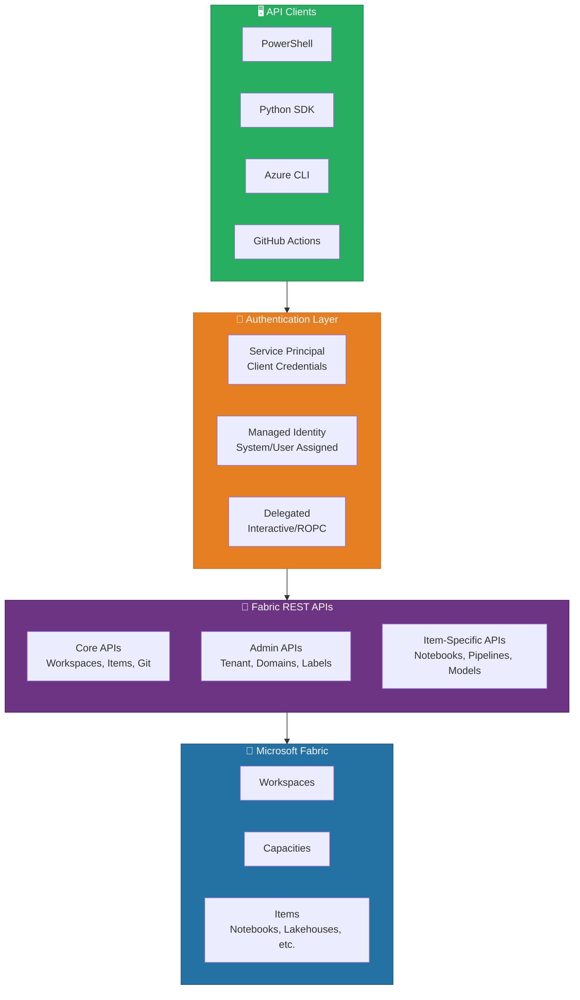
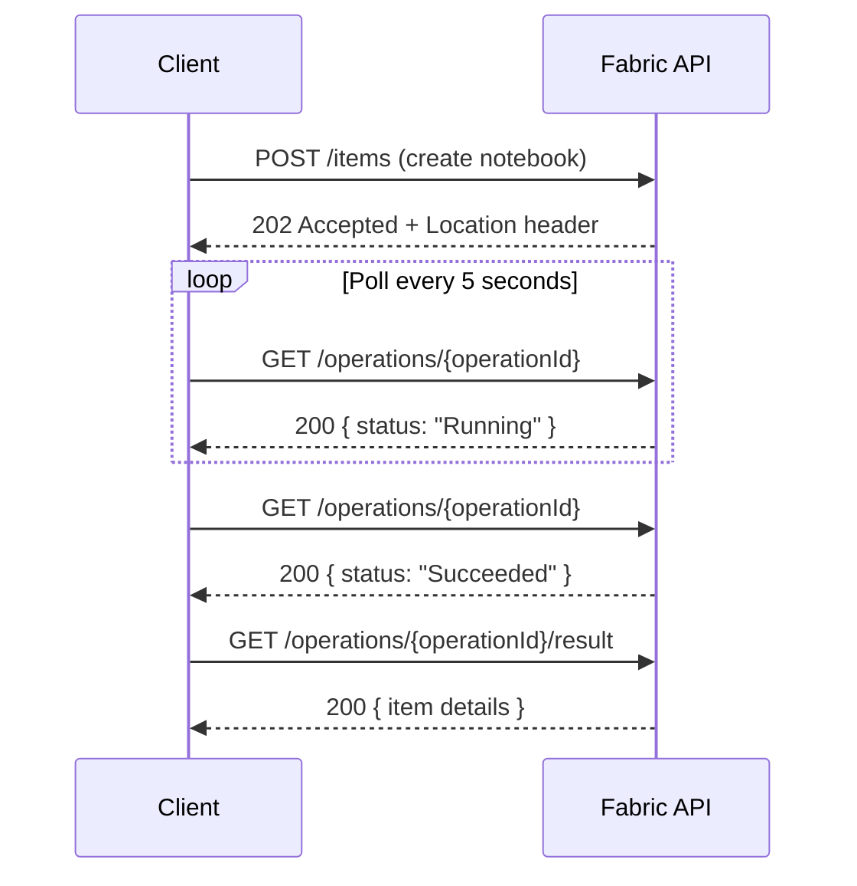

[Home](../index.md) > [Docs](../) > [Features](./) > Fabric REST APIs

# 🔌 Fabric REST APIs - Programmatic Platform Management

<div align="center" markdown>

**Automate Workspace Provisioning, Item Deployment, and Capacity Management via REST**


</div>

---

**Last Updated:** `2026-04-21` | **Version:** 1.0.0

---

## 📑 Table of Contents

- [🎯 Overview](#-overview)
- [🏗️ API Surface Architecture](#️-api-surface-architecture)
- [🔐 Authentication](#-authentication)
- [⚙️ Workspace Management](#️-workspace-management)
- [📦 Item CRUD Operations](#-item-crud-operations)
- [⏳ Long-Running Operations](#-long-running-operations)
- [📊 Capacity Management](#-capacity-management)
- [📄 Pagination](#-pagination)
- [🚨 Error Handling](#-error-handling)
- [🎰 Casino Implementation](#-casino-implementation)
- [🏛️ Federal Agency Implementation](#️-federal-agency-implementation)
- [⚠️ Limitations](#️-limitations)
- [📚 References](#-references)
- [🔗 Related Documents](#-related-documents)

---

## 🎯 Overview

The Microsoft Fabric REST APIs provide programmatic control over every aspect of the Fabric platform — from provisioning workspaces and deploying items to managing capacity and monitoring usage. These APIs enable infrastructure-as-code patterns, CI/CD automation, and self-service provisioning workflows that would be impractical to manage through the portal UI.

The API surface spans three categories: Core APIs for workspace and item management, Admin APIs for tenant-level governance, and Item-specific APIs for operations unique to particular item types (notebooks, pipelines, semantic models).

### Key Capabilities

| Capability | Description |
|-----------|-------------|
| **Workspace Provisioning** | Create, configure, and assign workspaces to capacities programmatically |
| **Item CRUD** | Create, read, update, and delete any Fabric item type via API |
| **Capacity Management** | Scale, pause, resume capacities; monitor CU consumption |
| **Long-Running Operations** | Async polling pattern for operations that take minutes to complete |
| **Admin Governance** | Tenant-wide scanning, access reviews, compliance reporting |
| **Deployment Pipelines** | Promote items between dev/test/prod environments |

---

## 🏗️ API Surface Architecture



### API Categories

| Category | Base URL | Scope | Use Cases |
|----------|----------|-------|-----------|
| **Core APIs** | `https://api.fabric.microsoft.com/v1` | Workspace-level | Item CRUD, workspace management, Git integration |
| **Admin APIs** | `https://api.fabric.microsoft.com/v1/admin` | Tenant-level | Scanning, access reviews, domain management |
| **Power BI APIs** | `https://api.powerbi.com/v1.0/myorg` | Legacy + BI | Semantic models, reports, dashboards |
| **Capacity APIs** | `https://management.azure.com` | ARM-level | Capacity provisioning, scaling, metrics |

---

## 🔐 Authentication

### Authentication Methods Comparison

| Method | Use Case | Token Lifetime | Requires User | CI/CD Ready |
|--------|----------|---------------|--------------|-------------|
| **Service Principal** | Automation, CI/CD pipelines | 1 hour (renewable) | No | Yes |
| **Managed Identity** | Azure-hosted services | 1 hour (auto-renewed) | No | Yes |
| **Delegated (Interactive)** | Developer tooling, ad-hoc scripts | 1 hour | Yes | No |

### Service Principal Authentication

```python
import requests
from azure.identity import ClientSecretCredential

# Authenticate with service principal
credential = ClientSecretCredential(
    tenant_id="your-tenant-id",
    client_id="your-client-id",
    client_secret="your-client-secret"
)

token = credential.get_token("https://api.fabric.microsoft.com/.default")

headers = {
    "Authorization": f"Bearer {token.token}",
    "Content-Type": "application/json"
}

# List workspaces
response = requests.get(
    "https://api.fabric.microsoft.com/v1/workspaces",
    headers=headers
)
workspaces = response.json()["value"]
```

### Managed Identity Authentication

```python
from azure.identity import ManagedIdentityCredential

# System-assigned managed identity (from Azure VM, App Service, ADF)
credential = ManagedIdentityCredential()
token = credential.get_token("https://api.fabric.microsoft.com/.default")

# User-assigned managed identity
credential = ManagedIdentityCredential(
    client_id="user-assigned-mi-client-id"
)
```

> ⚠️ **Important**: Service principals must be added as workspace members (Admin or Member role) before they can manage items. Tenant admins must enable "Service principals can use Fabric APIs" in the admin portal.

---

## ⚙️ Workspace Management

### Create a Workspace

```python
def create_workspace(headers, display_name, capacity_id, description=""):
    """Create a new Fabric workspace and assign it to a capacity."""
    payload = {
        "displayName": display_name,
        "description": description,
        "capacityId": capacity_id
    }

    response = requests.post(
        "https://api.fabric.microsoft.com/v1/workspaces",
        headers=headers,
        json=payload
    )
    response.raise_for_status()
    return response.json()
```

### Assign Workspace Roles

```python
def add_workspace_member(headers, workspace_id, principal_id, role="Member"):
    """Add a user or service principal to a workspace with a specific role."""
    payload = {
        "principal": {
            "id": principal_id,
            "type": "User"  # or "ServicePrincipal", "Group"
        },
        "role": role  # Admin, Member, Contributor, Viewer
    }

    response = requests.post(
        f"https://api.fabric.microsoft.com/v1/workspaces/{workspace_id}/roleAssignments",
        headers=headers,
        json=payload
    )
    response.raise_for_status()
```

---

## 📦 Item CRUD Operations

### Create a Lakehouse

```python
def create_lakehouse(headers, workspace_id, lakehouse_name):
    """Create a new Lakehouse item in a workspace."""
    payload = {
        "displayName": lakehouse_name,
        "type": "Lakehouse"
    }

    response = requests.post(
        f"https://api.fabric.microsoft.com/v1/workspaces/{workspace_id}/items",
        headers=headers,
        json=payload
    )
    response.raise_for_status()
    return response.json()
```

### List All Items in a Workspace

```python
def list_workspace_items(headers, workspace_id, item_type=None):
    """List all items in a workspace, optionally filtered by type."""
    url = f"https://api.fabric.microsoft.com/v1/workspaces/{workspace_id}/items"
    if item_type:
        url += f"?type={item_type}"

    items = []
    while url:
        response = requests.get(url, headers=headers)
        response.raise_for_status()
        data = response.json()
        items.extend(data["value"])
        url = data.get("continuationUri")

    return items
```

### Deploy a Notebook with Definition

```python
import base64

def deploy_notebook(headers, workspace_id, name, notebook_content):
    """Deploy a notebook with its full definition (content)."""
    encoded = base64.b64encode(notebook_content.encode()).decode()
    payload = {
        "displayName": name,
        "type": "Notebook",
        "definition": {
            "format": "ipynb",
            "parts": [
                {
                    "path": "notebook-content.py",
                    "payload": encoded,
                    "payloadType": "InlineBase64"
                }
            ]
        }
    }

    response = requests.post(
        f"https://api.fabric.microsoft.com/v1/workspaces/{workspace_id}/items",
        headers=headers,
        json=payload
    )
    # 202 = long-running; poll for completion
    if response.status_code == 202:
        return poll_operation(headers, response)
    response.raise_for_status()
    return response.json()
```

---

## ⏳ Long-Running Operations

Many Fabric API calls return HTTP 202 (Accepted) with a polling URL. The client must poll until the operation completes.



### Polling Implementation

```python
import time

def poll_operation(headers, initial_response, timeout=300, interval=5):
    """Poll a long-running operation until completion."""
    operation_url = initial_response.headers.get("Location")
    if not operation_url:
        # Retry-After header may also be present
        operation_id = initial_response.headers.get("x-ms-operation-id")
        operation_url = f"https://api.fabric.microsoft.com/v1/operations/{operation_id}"

    elapsed = 0
    while elapsed < timeout:
        resp = requests.get(operation_url, headers=headers)
        resp.raise_for_status()
        status = resp.json().get("status")

        if status == "Succeeded":
            result_url = resp.json().get("resourceLocation")
            if result_url:
                return requests.get(result_url, headers=headers).json()
            return resp.json()
        elif status in ("Failed", "Cancelled"):
            raise Exception(f"Operation {status}: {resp.json()}")

        retry_after = int(resp.headers.get("Retry-After", interval))
        time.sleep(retry_after)
        elapsed += retry_after

    raise TimeoutError(f"Operation did not complete within {timeout}s")
```

---

## 📊 Capacity Management

Fabric capacities are ARM resources managed through the Azure Resource Manager API.

```python
def scale_capacity(subscription_id, resource_group, capacity_name, sku):
    """Scale a Fabric capacity to a different SKU."""
    from azure.identity import DefaultAzureCredential
    credential = DefaultAzureCredential()
    token = credential.get_token("https://management.azure.com/.default")

    url = (
        f"https://management.azure.com/subscriptions/{subscription_id}"
        f"/resourceGroups/{resource_group}"
        f"/providers/Microsoft.Fabric/capacities/{capacity_name}"
        f"?api-version=2023-11-01"
    )

    payload = {
        "sku": {"name": sku, "tier": "Fabric"},  # F2, F4, F8, ..., F2048
        "properties": {"administration": {"members": ["admin@contoso.com"]}}
    }

    response = requests.patch(
        url,
        headers={"Authorization": f"Bearer {token.token}", "Content-Type": "application/json"},
        json=payload
    )
    response.raise_for_status()
    return response.json()
```

### Pause and Resume

```python
def pause_capacity(subscription_id, rg, name):
    """Pause (suspend) a Fabric capacity to stop billing."""
    url = (f"https://management.azure.com/subscriptions/{subscription_id}"
           f"/resourceGroups/{rg}/providers/Microsoft.Fabric/capacities/{name}"
           f"/suspend?api-version=2023-11-01")
    # POST with empty body
    response = requests.post(url, headers=arm_headers)
    return poll_arm_operation(response)

def resume_capacity(subscription_id, rg, name):
    """Resume a paused Fabric capacity."""
    url = (f"https://management.azure.com/subscriptions/{subscription_id}"
           f"/resourceGroups/{rg}/providers/Microsoft.Fabric/capacities/{name}"
           f"/resume?api-version=2023-11-01")
    response = requests.post(url, headers=arm_headers)
    return poll_arm_operation(response)
```

---

## 📄 Pagination

Fabric APIs use continuation tokens for paginated results. Never assume a single response contains all items.

```python
def get_all_pages(headers, url):
    """Fetch all pages of a paginated Fabric API response."""
    all_items = []
    while url:
        response = requests.get(url, headers=headers)
        response.raise_for_status()
        data = response.json()
        all_items.extend(data.get("value", []))
        url = data.get("continuationUri")  # None when no more pages
    return all_items
```

| Parameter | Description | Default |
|-----------|-------------|---------|
| `continuationToken` | Opaque token for next page | None (first page) |
| `maxResults` | Items per page (some endpoints) | 100 |
| `continuationUri` | Full URL for next page in response body | None when exhausted |

---

## 🚨 Error Handling

### Common HTTP Status Codes

| Code | Meaning | Action |
|------|---------|--------|
| 200 | Success | Process response body |
| 201 | Created | Item created synchronously |
| 202 | Accepted | Long-running operation; poll `Location` header |
| 400 | Bad Request | Fix request payload; check field names |
| 401 | Unauthorized | Refresh token; verify scopes |
| 403 | Forbidden | Check workspace role; verify admin API permissions |
| 404 | Not Found | Verify workspace/item IDs |
| 429 | Too Many Requests | Respect `Retry-After` header; implement backoff |
| 500 | Internal Error | Retry with exponential backoff |

### Retry with Exponential Backoff

```python
def api_call_with_retry(method, url, headers, json=None, max_retries=5):
    """Make an API call with exponential backoff for transient errors."""
    for attempt in range(max_retries):
        response = requests.request(method, url, headers=headers, json=json)
        if response.status_code == 429:
            retry_after = int(response.headers.get("Retry-After", 2 ** attempt))
            time.sleep(retry_after)
            continue
        if response.status_code >= 500:
            time.sleep(2 ** attempt)
            continue
        return response
    raise Exception(f"API call failed after {max_retries} retries")
```

---

## 🎰 Casino Implementation

### Automated Workspace Provisioning

Casino operators managing multiple properties can automate workspace creation per property:

```python
CASINO_PROPERTIES = [
    {"name": "Bellagio", "region": "westus2", "code": "BEL"},
    {"name": "MGM Grand", "region": "westus2", "code": "MGM"},
    {"name": "Borgata", "region": "eastus2", "code": "BOR"},
]

def provision_casino_workspaces(headers, capacity_id):
    """Provision standardized workspaces for each casino property."""
    for prop in CASINO_PROPERTIES:
        for env in ["dev", "staging", "prod"]:
            ws_name = f"casino-{prop['code'].lower()}-{env}"
            ws = create_workspace(headers, ws_name, capacity_id,
                                  description=f"{prop['name']} - {env.upper()}")
            # Create standard lakehouses
            for layer in ["lh_bronze", "lh_silver", "lh_gold"]:
                create_lakehouse(headers, ws["id"], f"{layer}_{prop['code'].lower()}")
            print(f"Provisioned {ws_name} with medallion lakehouses")
```

### Bulk Notebook Deployment

```python
import glob

def deploy_all_notebooks(headers, workspace_id, notebook_dir):
    """Deploy all notebooks from a local directory to a Fabric workspace."""
    notebooks = glob.glob(f"{notebook_dir}/**/*.py", recursive=True)
    results = {"success": [], "failed": []}

    for nb_path in sorted(notebooks):
        name = nb_path.split("/")[-1].replace(".py", "")
        with open(nb_path, "r") as f:
            content = f.read()
        try:
            deploy_notebook(headers, workspace_id, name, content)
            results["success"].append(name)
        except Exception as e:
            results["failed"].append({"name": name, "error": str(e)})

    return results

# Deploy bronze, silver, gold notebooks
deploy_all_notebooks(headers, prod_ws_id, "notebooks/bronze")
deploy_all_notebooks(headers, prod_ws_id, "notebooks/silver")
deploy_all_notebooks(headers, prod_ws_id, "notebooks/gold")
```

---

## 🏛️ Federal Agency Implementation

### Programmatic Compliance Reporting

Federal agencies can use Admin APIs to generate compliance reports across all workspaces — identifying sensitive items, access anomalies, and governance gaps.

```python
def generate_compliance_report(headers):
    """Scan all workspaces and generate a compliance posture report."""
    # Get all workspaces in the tenant
    workspaces = get_all_pages(
        headers,
        "https://api.fabric.microsoft.com/v1/admin/workspaces?$top=100"
    )

    report = []
    for ws in workspaces:
        ws_detail = requests.get(
            f"https://api.fabric.microsoft.com/v1/admin/workspaces/{ws['id']}",
            headers=headers
        ).json()

        items = get_all_pages(
            headers,
            f"https://api.fabric.microsoft.com/v1/admin/workspaces/{ws['id']}/items"
        )

        report.append({
            "workspace": ws["displayName"],
            "capacity": ws.get("capacityId"),
            "state": ws.get("state"),
            "item_count": len(items),
            "item_types": list(set(i["type"] for i in items)),
            "has_sensitivity_label": ws.get("sensitivityLabel") is not None,
            "role_assignments": len(ws_detail.get("roleAssignments", []))
        })

    return report
```

### USDA: Automated Grant Workspace Setup

```python
def provision_usda_grant_workspaces(headers, capacity_id, fiscal_year):
    """Create workspaces per USDA grant program with compliance controls."""
    grant_programs = ["SNAP", "WIC", "CRP", "EQIP", "FSA_Loans"]

    for program in grant_programs:
        ws_name = f"usda-{program.lower()}-fy{fiscal_year}"
        ws = create_workspace(headers, ws_name, capacity_id,
                              description=f"USDA {program} - FY{fiscal_year}")

        # Apply sensitivity label via Admin API
        requests.post(
            f"https://api.fabric.microsoft.com/v1/admin/workspaces/{ws['id']}/assignLabel",
            headers=headers,
            json={"labelId": "federal-cui-label-id"}
        )

        # Create standard lakehouses
        for lh in ["lh_bronze", "lh_silver", "lh_gold"]:
            create_lakehouse(headers, ws["id"], f"{lh}_{program.lower()}")
```

---

## ⚠️ Limitations

| Limitation | Description | Workaround |
|-----------|-------------|------------|
| **Rate Limits** | 200 requests/min per service principal | Implement backoff; distribute across SPs |
| **Item Definition Size** | Notebook definitions limited to ~50 MB base64 | Split large notebooks; use Git integration |
| **No Streaming API** | No WebSocket or event-driven change notifications | Poll for changes; use Event Grid for ARM events |
| **Service Principal Scope** | SPs cannot access "My Workspace" or personal workspaces | Use shared workspaces only |
| **API Versioning** | Breaking changes possible in preview APIs | Pin to stable API versions in production |
| **Admin API Access** | Requires Fabric Admin or Power BI Service Admin role | Use least-privilege SP with admin consent |
| **Definition Format** | Not all item types support definition export/import | Use Git integration for unsupported types |
| **Cross-Tenant** | APIs operate within a single tenant only | Use Azure Lighthouse for multi-tenant management |

---

## 📚 References

| Resource | URL |
|----------|-----|
| Fabric REST API Overview | https://learn.microsoft.com/rest/api/fabric/core |
| Workspace API | https://learn.microsoft.com/rest/api/fabric/core/workspaces |
| Items API | https://learn.microsoft.com/rest/api/fabric/core/items |
| Long-Running Operations | https://learn.microsoft.com/rest/api/fabric/core/long-running-operations |
| Admin API | https://learn.microsoft.com/rest/api/fabric/admin |
| Capacity Management | https://learn.microsoft.com/rest/api/microsoftfabric/fabric-capacities |
| Authentication Guide | https://learn.microsoft.com/rest/api/fabric/articles/get-started/fabric-api-quickstart |
| Service Principal Setup | https://learn.microsoft.com/fabric/admin/service-admin-portal-developer |
| Power BI REST APIs | https://learn.microsoft.com/rest/api/power-bi |
| Error Codes | https://learn.microsoft.com/rest/api/fabric/articles/item-management/item-management-errors |

---

## 🔗 Related Documents

- [Workspace Monitoring](workspace-monitoring.md) — Monitor API usage and capacity metrics
- [fabric-cicd Deployment](../best-practices/fabric-cicd-deployment.md) — CI/CD pipeline using fabric-cicd SDK
- [Identity & RBAC Patterns](../best-practices/identity-rbac-patterns.md) — Service principal and role management
- [Capacity Planning](../best-practices/capacity-planning-cost-optimization.md) — Capacity scaling strategies
- [OneLake Security](onelake-security.md) — Workspace Identity for API authentication
- [Network Security](../best-practices/network-security.md) — Private endpoints for API calls
- [Data Agents](data-agents.md) — Agents that use REST APIs internally
- [Architecture](../ARCHITECTURE.md) — System architecture overview

---

> 📝 **Document Metadata**
> - **Author**: Documentation Team
> - **Reviewers**: Platform Engineering, DevOps, Security, Compliance
> - **Classification**: Internal
> - **Next Review**: 2026-07-21
