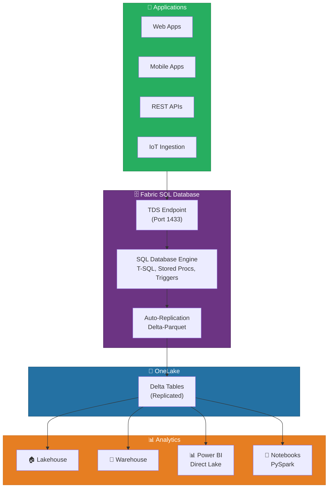
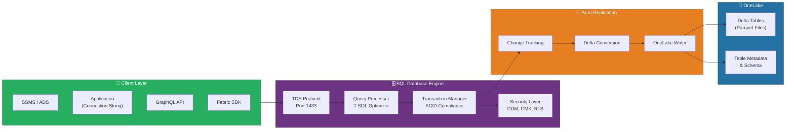
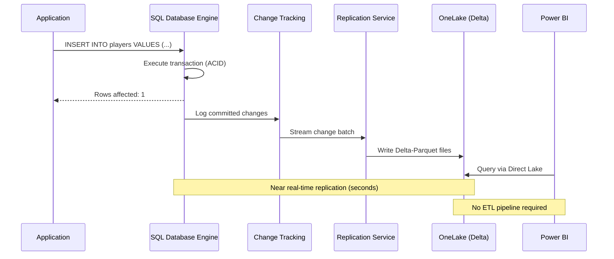
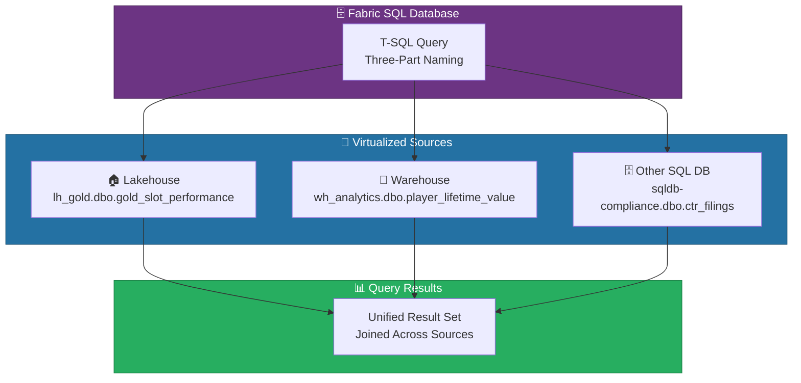
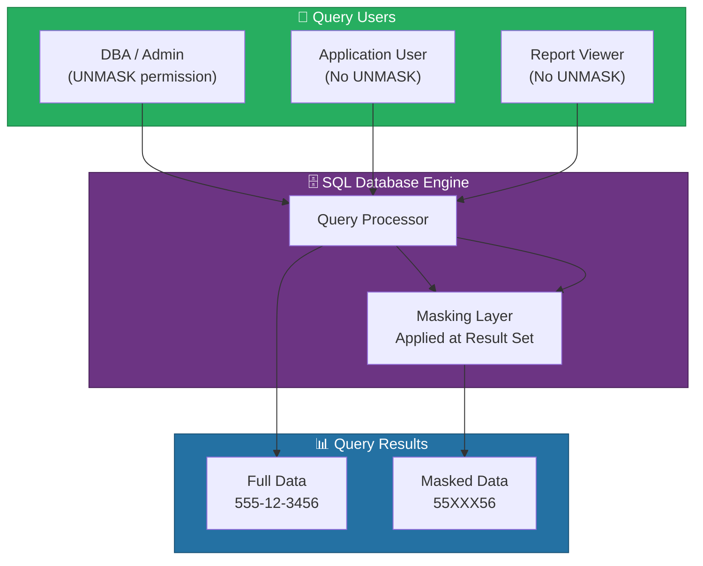
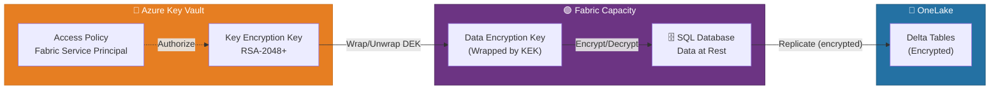
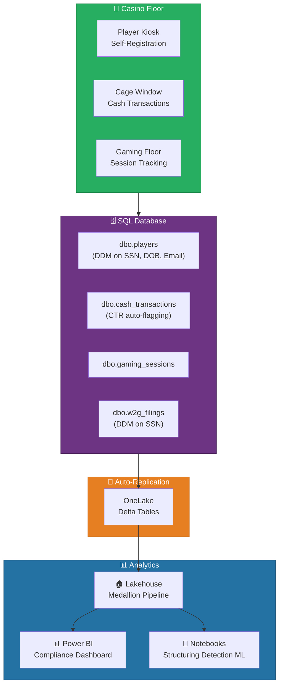
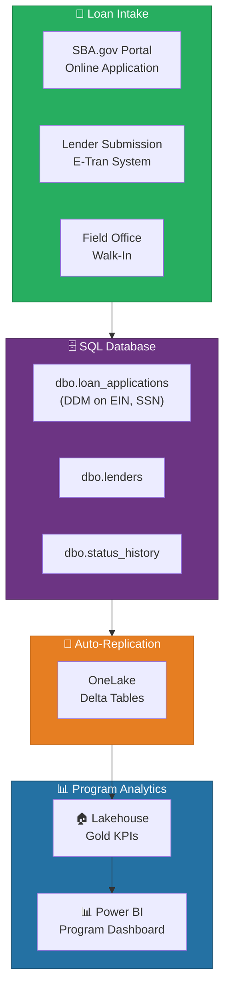

# 🗄️ Fabric SQL Database - Operational OLTP in Microsoft Fabric

<div align="center" markdown>

**Fabric-Native Transactional Database with Automatic OneLake Replication**


</div>

---

**Last Updated:** `2026-04-13` | **Version:** 1.0.0

---

## 🎯 Overview

Fabric SQL Database is a Fabric-native OLTP (Online Transaction Processing) database built on the same SQL Database Engine that powers Azure SQL Database. It provides a fully managed, developer-friendly relational database for operational workloads directly within a Microsoft Fabric workspace — eliminating the need for a separate Azure SQL Database resource for transactional data.

The defining characteristic of Fabric SQL Database is **automatic replication to OneLake in Delta-Parquet format**. Every committed transaction is continuously mirrored into OneLake, making operational data instantly available for analytics, reporting, and AI workloads across the entire Fabric ecosystem — without requiring ETL pipelines, Change Data Capture (CDC) configurations, or manual data movement.

### Key Capabilities

| Capability | Description |
|-----------|-------------|
| **Full T-SQL Surface** | Supports stored procedures, triggers, views, functions, and the full T-SQL language |
| **Automatic OneLake Replication** | Committed transactions replicate to OneLake Delta tables automatically |
| **TDS Endpoint** | Standard Tabular Data Stream protocol for SSMS, ADS, and application connectivity |
| **Dynamic Data Masking (GA)** | Column-level masking functions to protect sensitive data from unauthorized users |
| **Customer-Managed Keys (GA)** | Encrypt SQL Database at rest using keys stored in Azure Key Vault |
| **Data Virtualization** | Cross-database queries to Lakehouse and Warehouse items via three-part naming |
| **Migration Assistant** | Built-in tooling to migrate schemas and data from Azure SQL or on-premises SQL Server |
| **Automatic Index Compaction** | Background process that optimizes index fragmentation without manual maintenance |
| **GraphQL API Support** | Expose SQL Database tables and views through the Fabric API for GraphQL |
| **Git Integration** | Source control for database objects via Fabric Git integration |

### Fabric SQL Database vs. Azure SQL Database

| Aspect | Azure SQL Database | Fabric SQL Database |
|--------|-------------------|-------------------|
| **Deployment** | Standalone Azure resource | Fabric workspace item |
| **Provisioning** | Azure Portal, ARM/Bicep, CLI | Fabric workspace UI, REST API |
| **Billing** | DTU/vCore-based, per-database | Fabric CU consumption, shared capacity |
| **OneLake Integration** | Requires Mirroring (separate config) | Automatic replication (built-in) |
| **Analytics Access** | Requires data movement or linked services | Direct access via Lakehouse, Warehouse, Power BI |
| **Networking** | VNet integration, Private Link, firewall rules | Fabric workspace security, Entra ID |
| **Scale** | Up to Hyperscale (100 TB) | GA limits apply (see Limitations) |
| **Engine** | SQL Database Engine | Same SQL Database Engine |
| **Best For** | Production OLTP with full Azure networking | Operational data that feeds Fabric analytics |

### Where Fabric SQL Database Fits



> 📝 **Note**: Fabric SQL Database is not a replacement for Azure SQL Database in scenarios requiring advanced networking (VNet integration, Private Link), Hyperscale storage (100+ TB), or geo-replication. It is purpose-built for operational workloads where transactional data needs to flow seamlessly into Fabric analytics.

---

## 🏗️ Architecture

Fabric SQL Database runs the same SQL Database Engine as Azure SQL Database, provisioned as a workspace item within Fabric. The engine handles transactional processing (ACID compliance, query optimization, security), while a background replication service continuously mirrors committed changes to OneLake in Delta-Parquet format.

### Component Architecture



### Automatic OneLake Replication

The replication pipeline operates continuously without user intervention:

1. **Transaction Commit** — Application writes data via TDS using standard INSERT/UPDATE/DELETE/MERGE operations.
2. **Change Tracking** — The engine captures committed changes using internal change tracking mechanisms.
3. **Delta Conversion** — Changes are serialized into Delta-Parquet format with proper schema mapping.
4. **OneLake Write** — Converted data is written to the OneLake storage layer as Delta tables.
5. **Analytics Ready** — Replicated Delta tables are immediately queryable from Lakehouse, Warehouse, Power BI (Direct Lake), and Notebooks.



### Replication Characteristics

| Characteristic | Details |
|---------------|---------|
| **Latency** | Near real-time (typically seconds after commit) |
| **Format** | Delta-Parquet (open format, cross-engine compatible) |
| **Schema Sync** | DDL changes (CREATE/ALTER TABLE) are replicated automatically |
| **Data Types** | All standard SQL types mapped to Delta equivalents |
| **Transactions** | Only committed transactions are replicated (no dirty reads) |
| **Ordering** | Changes replicated in commit order |
| **Impact on OLTP** | Minimal — replication is asynchronous and does not block transactions |

> ⚠️ **Warning**: Auto-replication to OneLake is one-directional (SQL Database → OneLake). Changes made directly to OneLake Delta tables are **not** reflected back to the SQL Database. Always treat the SQL Database as the system of record for OLTP data.

---

## ⚙️ Key Features

### Dynamic Data Masking (GA)

Dynamic Data Masking (DDM) limits sensitive data exposure by masking column values in query results for users without the UNMASK permission. The data in the underlying storage remains unchanged — masking is applied at query execution time.

| Masking Function | Syntax | Example Input | Masked Output |
|-----------------|--------|---------------|---------------|
| **Default** | `default()` | `john@example.com` | `xxxx` |
| **Email** | `email()` | `john@example.com` | `jXXX@XXXX.com` |
| **Random** | `random(1, 100)` | `42` | `73` (random in range) |
| **Custom String** | `partial(2, 'XXX', 2)` | `555-12-3456` | `55XXX56` |

### Customer-Managed Keys (GA)

Fabric SQL Database supports encryption at rest using customer-managed keys (CMK) stored in Azure Key Vault. This provides organizations with full control over the encryption key lifecycle.

| CMK Aspect | Details |
|-----------|---------|
| **Key Store** | Azure Key Vault (Premium or Standard) |
| **Key Types** | RSA 2048, RSA 3072, RSA 4096 |
| **Rotation** | Manual or automatic key rotation supported |
| **Scope** | Per-capacity (applies to all SQL Databases in the Fabric capacity) |
| **Recovery** | Soft-delete and purge protection required on Key Vault |

### Data Virtualization

Query across Fabric items without data movement using three-part naming:

```sql
-- Query a Lakehouse table from SQL Database
SELECT *
FROM [lh_gold].[dbo].[gold_slot_performance]
WHERE gaming_date = '2026-04-13';

-- Join SQL Database table with Warehouse table
SELECT p.player_id, p.first_name, w.total_wagered
FROM dbo.players p
INNER JOIN [wh_analytics].[dbo].[player_lifetime_value] w
    ON p.player_id = w.player_id;
```

### Migration Assistant

The built-in migration assistant simplifies moving workloads from Azure SQL Database or on-premises SQL Server:

| Migration Step | Details |
|---------------|---------|
| **Assessment** | Analyzes source database for compatibility issues |
| **Schema Migration** | Transfers tables, views, stored procedures, functions |
| **Data Migration** | Copies data with minimal downtime |
| **Validation** | Row count and checksum verification |
| **Cutover** | Application connection string update |

### Automatic Index Compaction

Unlike traditional SQL Server where DBAs must schedule index maintenance, Fabric SQL Database includes automatic index compaction that runs in the background:

- Monitors index fragmentation levels continuously
- Reorganizes indexes when fragmentation exceeds threshold
- Operates during low-utilization periods to minimize OLTP impact
- No maintenance windows or scheduled jobs required

---

## 🔧 Setup and Configuration

### Prerequisites

| Requirement | Details |
|------------|---------|
| **Fabric Capacity** | F2 or higher (F64 recommended for production) |
| **Workspace Role** | Admin or Member role for creating SQL Database items |
| **Entra ID** | Microsoft Entra ID authentication (SQL authentication not supported) |
| **Networking** | Outbound access to Fabric service endpoints |
| **Client Tools** | SSMS 20+, Azure Data Studio 1.48+, or any TDS-compatible client |

### Step 1: Create a SQL Database Item

```
Workspace → + New → SQL Database
  Name: sqldb-casino-operations
  Description: Operational OLTP database for player registration,
               transactions, and casino floor management
```

> 📝 **Note**: The SQL Database item appears under the Database section in the workspace. Upon creation, Fabric provisions the SQL Database Engine, allocates storage, and configures the automatic OneLake replication pipeline.

### Step 2: Obtain the TDS Connection String

After creation, retrieve the connection string for application and tool connectivity:

```
SQL Database → Settings → Connection Strings
  Server: <workspace-guid>.database.fabric.microsoft.com
  Database: sqldb-casino-operations
  Authentication: Microsoft Entra ID (Active Directory)
  Encrypt: True
  Trust Server Certificate: False
```

**Example connection string (ADO.NET):**

```
Server=tcp:<workspace-guid>.database.fabric.microsoft.com,1433;
Initial Catalog=sqldb-casino-operations;
Authentication=Active Directory Default;
Encrypt=True;
TrustServerCertificate=False;
```

### Step 3: Connect with SSMS or Azure Data Studio

```
SSMS → Connect → Database Engine
  Server name: <workspace-guid>.database.fabric.microsoft.com
  Authentication: Microsoft Entra MFA
  Database: sqldb-casino-operations
```

```
Azure Data Studio → New Connection
  Server: <workspace-guid>.database.fabric.microsoft.com
  Authentication type: Microsoft Entra ID - Universal with MFA
  Database: sqldb-casino-operations
```

### Step 4: Create Tables and Schema

```sql
-- Create the player registration table
CREATE TABLE dbo.players (
    player_id          INT IDENTITY(1,1) PRIMARY KEY,
    loyalty_card_no    VARCHAR(20) NOT NULL UNIQUE,
    first_name         NVARCHAR(100) NOT NULL,
    last_name          NVARCHAR(100) NOT NULL,
    date_of_birth      DATE NOT NULL,
    ssn                CHAR(11) NOT NULL,
    email              NVARCHAR(255),
    phone              VARCHAR(20),
    loyalty_tier       VARCHAR(20) DEFAULT 'Bronze',
    enrollment_date    DATETIME2 DEFAULT SYSUTCDATETIME(),
    is_active          BIT DEFAULT 1,
    created_at         DATETIME2 DEFAULT SYSUTCDATETIME(),
    updated_at         DATETIME2 DEFAULT SYSUTCDATETIME()
);

-- Create index for common queries
CREATE NONCLUSTERED INDEX IX_players_loyalty_tier
    ON dbo.players (loyalty_tier)
    INCLUDE (player_id, first_name, last_name);

-- Create index for date-based lookups
CREATE NONCLUSTERED INDEX IX_players_enrollment
    ON dbo.players (enrollment_date DESC);
```

### Step 5: Verify OneLake Replication

After inserting data, verify that the Delta tables appear in the SQL Database's OneLake endpoint:

```
SQL Database → OneLake Endpoint → Tables
  ├── dbo.players (Delta)
  ├── dbo.transactions (Delta)
  └── dbo.compliance_filings (Delta)
```

Verify data replication with a Lakehouse query:

```sql
-- From a Lakehouse SQL endpoint
SELECT COUNT(*) AS replicated_rows
FROM [sqldb-casino-operations].[dbo].[players];
```

---

## 🔄 Data Virtualization

Data virtualization in Fabric SQL Database enables cross-database queries to Lakehouse and Warehouse items in the same workspace using standard three-part naming syntax. This eliminates the need for data duplication or ETL pipelines when operational queries need to join transactional data with analytical data.

### Virtualization Architecture



### Cross-Database Query Examples

```sql
-- Join local players table with Lakehouse gold analytics
SELECT 
    p.player_id,
    p.first_name,
    p.last_name,
    p.loyalty_tier,
    g.total_coin_in,
    g.total_coin_out,
    g.avg_hold_pct
FROM dbo.players p
INNER JOIN [lh_gold].[dbo].[gold_player_summary] g
    ON p.player_id = g.player_id
WHERE p.loyalty_tier = 'Platinum'
ORDER BY g.total_coin_in DESC;

-- Cross-join with Warehouse for compliance enrichment
SELECT
    p.player_id,
    p.loyalty_card_no,
    c.filing_type,
    c.filing_date,
    c.transaction_amount
FROM dbo.players p
INNER JOIN [wh_compliance].[dbo].[ctr_filings] c
    ON p.player_id = c.player_id
WHERE c.filing_date >= DATEADD(DAY, -30, GETDATE())
ORDER BY c.filing_date DESC;
```

### Virtualization Considerations

| Consideration | Details |
|--------------|---------|
| **Performance** | Cross-database queries may be slower than local queries due to network hops |
| **Permissions** | User must have read access to both the SQL Database and the target Lakehouse/Warehouse |
| **Scope** | Limited to items in the same Fabric workspace |
| **Write Support** | Virtualized queries are read-only; writes go only to the local SQL Database |
| **Functions** | Not all T-SQL functions are supported across virtualized sources |

> 💡 **Tip**: For frequently joined datasets, consider creating a view in the SQL Database that encapsulates the cross-database join. This simplifies application code and centralizes the join logic.

```sql
-- Create a view encapsulating the cross-database join
CREATE VIEW dbo.vw_player_analytics AS
SELECT 
    p.player_id,
    p.first_name,
    p.last_name,
    p.loyalty_tier,
    g.total_coin_in,
    g.total_coin_out,
    g.avg_hold_pct,
    g.last_gaming_date
FROM dbo.players p
INNER JOIN [lh_gold].[dbo].[gold_player_summary] g
    ON p.player_id = g.player_id;
```

---

## 🛡️ Dynamic Data Masking

Dynamic Data Masking (DDM) in Fabric SQL Database protects sensitive data by obfuscating column values in query results. Masking is applied at query time for users without the UNMASK permission — the underlying data remains unmasked in storage and for authorized users.

### How DDM Works



### Configuring DDM on Casino Player Data

```sql
-- Add masking to the players table
ALTER TABLE dbo.players
ALTER COLUMN ssn ADD MASKED WITH (FUNCTION = 'partial(0, "XXX-XX-", 4)');
-- Input: 555-12-3456 → Output: XXX-XX-3456

ALTER TABLE dbo.players
ALTER COLUMN email ADD MASKED WITH (FUNCTION = 'email()');
-- Input: john.doe@casino.com → Output: jXXX@XXXX.com

ALTER TABLE dbo.players
ALTER COLUMN date_of_birth ADD MASKED WITH (FUNCTION = 'default()');
-- Input: 1985-03-15 → Output: 1900-01-01

ALTER TABLE dbo.players
ALTER COLUMN phone ADD MASKED WITH (FUNCTION = 'partial(0, "XXX-XXX-", 4)');
-- Input: 555-867-5309 → Output: XXX-XXX-5309
```

### Granting UNMASK Permission

```sql
-- Grant UNMASK to the compliance officer role
CREATE ROLE ComplianceOfficer;
GRANT UNMASK TO ComplianceOfficer;
GRANT SELECT ON dbo.players TO ComplianceOfficer;

-- Grant UNMASK on specific columns only (granular)
GRANT UNMASK ON dbo.players(ssn) TO ComplianceOfficer;

-- Add users to the role
ALTER ROLE ComplianceOfficer ADD MEMBER [compliance.officer@casino.com];
```

### Verifying Masking Behavior

```sql
-- As admin (with UNMASK): see full data
SELECT player_id, first_name, ssn, email, date_of_birth
FROM dbo.players WHERE player_id = 1;
-- Result: 1, John, 555-12-3456, john.doe@casino.com, 1985-03-15

-- As application user (without UNMASK): see masked data
EXECUTE AS USER = 'app.service@casino.com';
SELECT player_id, first_name, ssn, email, date_of_birth
FROM dbo.players WHERE player_id = 1;
-- Result: 1, John, XXX-XX-3456, jXXX@XXXX.com, 1900-01-01
REVERT;
```

### DDM Considerations

| Consideration | Details |
|--------------|---------|
| **Not Encryption** | DDM is obfuscation, not encryption; users with db_owner can see data |
| **Replicated Data** | Masking applies only to SQL Database queries; OneLake replicas store unmasked data |
| **Inference Attacks** | Determined users may infer masked values through repeated queries |
| **Application Layer** | DDM protects ad-hoc queries; applications with UNMASK see full data |
| **Combine with RLS** | Use Row-Level Security alongside DDM for defense in depth |

> ⚠️ **Warning**: Dynamic Data Masking is not applied to the OneLake-replicated Delta tables. If sensitive columns are replicated, apply additional security controls (column-level security, Purview sensitivity labels) on the Lakehouse or Warehouse endpoints that consume the replicated data.

---

## 🔑 Customer-Managed Keys

Customer-Managed Keys (CMK) for Fabric SQL Database provide organizations with control over the encryption keys used to protect data at rest. Instead of relying on Microsoft-managed keys, you store and manage the encryption key in your own Azure Key Vault.

### CMK Architecture



### Configuring CMK

CMK is configured at the Fabric capacity level and applies to all SQL Database items within that capacity:

```
Fabric Admin Portal → Capacity Settings → [Capacity Name]
  → Security → Customer-Managed Keys
    Key Vault: kv-fabric-encryption
    Key Name: fabric-dek-key
    Key Version: (latest)
    Enable: ✅
```

### Key Vault Requirements

| Requirement | Details |
|------------|---------|
| **Soft Delete** | Must be enabled on the Key Vault |
| **Purge Protection** | Must be enabled (prevents accidental key deletion) |
| **Key Type** | RSA 2048, 3072, or 4096 |
| **Access Policy** | Fabric service principal requires Get, Wrap Key, Unwrap Key |
| **Region** | Key Vault should be in the same region as the Fabric capacity |
| **Networking** | Key Vault must allow access from Fabric service endpoints |

### Key Rotation

```
Key Vault → Keys → fabric-dek-key → New Version
  → Fabric automatically detects the new version
  → Re-wraps the DEK with the new key version
  → Zero downtime during rotation
```

> 📝 **Note**: Key rotation is transparent to applications and users. The SQL Database remains accessible during the entire rotation process. Old key versions should be retained for the soft-delete period to support backup restoration.

---

## 🎰 Casino Implementation

### Player Registration OLTP System

The casino uses Fabric SQL Database as the operational system of record for player registration, loyalty program management, and real-time transaction processing. Dynamic Data Masking protects PII while automatic OneLake replication feeds the analytics pipeline.

### Database Schema

```sql
-- Player registration with DDM
CREATE TABLE dbo.players (
    player_id          INT IDENTITY(1,1) PRIMARY KEY,
    loyalty_card_no    VARCHAR(20) NOT NULL UNIQUE,
    first_name         NVARCHAR(100) NOT NULL,
    last_name          NVARCHAR(100) NOT NULL,
    date_of_birth      DATE NOT NULL
        MASKED WITH (FUNCTION = 'default()'),
    ssn                CHAR(11) NOT NULL
        MASKED WITH (FUNCTION = 'partial(0, "XXX-XX-", 4)'),
    email              NVARCHAR(255)
        MASKED WITH (FUNCTION = 'email()'),
    phone              VARCHAR(20)
        MASKED WITH (FUNCTION = 'partial(0, "XXX-XXX-", 4)'),
    address_line1      NVARCHAR(255)
        MASKED WITH (FUNCTION = 'default()'),
    city               NVARCHAR(100),
    state_code         CHAR(2),
    zip_code           VARCHAR(10)
        MASKED WITH (FUNCTION = 'partial(0, "XXXXX", 0)'),
    loyalty_tier       VARCHAR(20) DEFAULT 'Bronze',
    enrollment_date    DATETIME2 DEFAULT SYSUTCDATETIME(),
    is_active          BIT DEFAULT 1,
    created_at         DATETIME2 DEFAULT SYSUTCDATETIME(),
    updated_at         DATETIME2 DEFAULT SYSUTCDATETIME()
);

-- Cash transactions for CTR monitoring
CREATE TABLE dbo.cash_transactions (
    transaction_id     BIGINT IDENTITY(1,1) PRIMARY KEY,
    player_id          INT NOT NULL REFERENCES dbo.players(player_id),
    transaction_type   VARCHAR(20) NOT NULL, -- 'cash_in', 'cash_out', 'chip_purchase'
    amount             DECIMAL(15,2) NOT NULL,
    cage_window        VARCHAR(20),
    cashier_id         INT NOT NULL,
    transaction_time   DATETIME2 DEFAULT SYSUTCDATETIME(),
    ctr_required       AS (CASE WHEN amount >= 10000 THEN 1 ELSE 0 END) PERSISTED,
    INDEX IX_cash_trans_player (player_id),
    INDEX IX_cash_trans_time (transaction_time DESC),
    INDEX IX_cash_trans_ctr (ctr_required) WHERE ctr_required = 1
);

-- Gaming session tracking
CREATE TABLE dbo.gaming_sessions (
    session_id         BIGINT IDENTITY(1,1) PRIMARY KEY,
    player_id          INT NOT NULL REFERENCES dbo.players(player_id),
    machine_id         VARCHAR(20),
    table_id           VARCHAR(20),
    session_start      DATETIME2 NOT NULL DEFAULT SYSUTCDATETIME(),
    session_end        DATETIME2,
    coin_in            DECIMAL(15,2) DEFAULT 0,
    coin_out           DECIMAL(15,2) DEFAULT 0,
    theoretical_win    DECIMAL(15,2) DEFAULT 0,
    INDEX IX_sessions_player (player_id),
    INDEX IX_sessions_time (session_start DESC)
);

-- W-2G tax reporting
CREATE TABLE dbo.w2g_filings (
    filing_id          INT IDENTITY(1,1) PRIMARY KEY,
    player_id          INT NOT NULL REFERENCES dbo.players(player_id),
    ssn                CHAR(11) NOT NULL
        MASKED WITH (FUNCTION = 'partial(0, "XXX-XX-", 4)'),
    winning_amount     DECIMAL(15,2) NOT NULL,
    game_type          VARCHAR(50) NOT NULL,
    machine_id         VARCHAR(20),
    filing_date        DATETIME2 DEFAULT SYSUTCDATETIME(),
    tax_withheld       DECIMAL(15,2) DEFAULT 0,
    w2g_threshold      AS (CASE
        WHEN game_type = 'slots' AND winning_amount >= 1200 THEN 1
        WHEN game_type IN ('keno', 'bingo') AND winning_amount >= 1500 THEN 1
        WHEN game_type = 'poker' AND winning_amount >= 5000 THEN 1
        WHEN game_type = 'table' AND winning_amount >= 600 THEN 1
        ELSE 0
    END) PERSISTED,
    INDEX IX_w2g_player (player_id),
    INDEX IX_w2g_date (filing_date DESC)
);
```

### Stored Procedures for Compliance

```sql
-- Check for structuring patterns (SAR indicator)
CREATE PROCEDURE dbo.usp_check_structuring_patterns
    @hours_lookback INT = 24,
    @min_transactions INT = 3,
    @amount_floor DECIMAL(15,2) = 8000,
    @amount_ceiling DECIMAL(15,2) = 9999.99
AS
BEGIN
    SET NOCOUNT ON;

    SELECT
        p.player_id,
        p.loyalty_card_no,
        p.first_name,
        p.last_name,
        COUNT(*) AS transaction_count,
        SUM(ct.amount) AS total_amount,
        MIN(ct.transaction_time) AS first_transaction,
        MAX(ct.transaction_time) AS last_transaction,
        DATEDIFF(HOUR, MIN(ct.transaction_time), MAX(ct.transaction_time)) AS window_hours
    FROM dbo.cash_transactions ct
    INNER JOIN dbo.players p ON ct.player_id = p.player_id
    WHERE ct.transaction_time >= DATEADD(HOUR, -@hours_lookback, SYSUTCDATETIME())
      AND ct.amount BETWEEN @amount_floor AND @amount_ceiling
    GROUP BY p.player_id, p.loyalty_card_no, p.first_name, p.last_name
    HAVING COUNT(*) >= @min_transactions
    ORDER BY COUNT(*) DESC;
END;
```

### Application Data Flow



### Role-Based Access for Casino Staff

```sql
-- Floor Manager: can see player names but not PII
CREATE ROLE FloorManager;
GRANT SELECT ON dbo.players TO FloorManager;
GRANT SELECT ON dbo.gaming_sessions TO FloorManager;
-- No UNMASK → sees masked SSN, DOB, email, phone

-- Compliance Officer: full PII access for CTR/SAR
CREATE ROLE ComplianceOfficer;
GRANT UNMASK TO ComplianceOfficer;
GRANT SELECT ON dbo.players TO ComplianceOfficer;
GRANT SELECT ON dbo.cash_transactions TO ComplianceOfficer;
GRANT SELECT ON dbo.w2g_filings TO ComplianceOfficer;
GRANT EXECUTE ON dbo.usp_check_structuring_patterns TO ComplianceOfficer;

-- Cage Cashier: insert transactions, view masked player info
CREATE ROLE CageCashier;
GRANT SELECT ON dbo.players TO CageCashier;
GRANT INSERT ON dbo.cash_transactions TO CageCashier;
-- No UNMASK → cannot see full SSN or DOB
```

---

## 🏛️ Federal Agency Implementation

### 💼 SBA: Loan Intake System

The Small Business Administration uses Fabric SQL Database as the operational system for loan application intake, processing status tracking, and approval workflows. Automatic replication feeds the analytics pipeline for program effectiveness reporting.

```sql
-- SBA Loan application intake
CREATE TABLE dbo.loan_applications (
    application_id     BIGINT IDENTITY(1,1) PRIMARY KEY,
    program_type       VARCHAR(20) NOT NULL, -- '7a', '504', 'disaster', 'microloan'
    business_name      NVARCHAR(255) NOT NULL,
    ein                CHAR(10) NOT NULL
        MASKED WITH (FUNCTION = 'partial(0, "XX-XXX", 4)'),
    owner_name         NVARCHAR(200) NOT NULL,
    owner_ssn          CHAR(11) NOT NULL
        MASKED WITH (FUNCTION = 'partial(0, "XXX-XX-", 4)'),
    naics_code         VARCHAR(6) NOT NULL,
    loan_amount        DECIMAL(15,2) NOT NULL,
    state_code         CHAR(2) NOT NULL,
    zip_code           VARCHAR(10),
    application_date   DATETIME2 DEFAULT SYSUTCDATETIME(),
    status             VARCHAR(20) DEFAULT 'submitted',
    assigned_analyst   NVARCHAR(100),
    decision_date      DATETIME2,
    approval_amount    DECIMAL(15,2),
    INDEX IX_loan_app_program (program_type),
    INDEX IX_loan_app_state (state_code),
    INDEX IX_loan_app_status (status)
);

-- SBA lender registration
CREATE TABLE dbo.lenders (
    lender_id          INT IDENTITY(1,1) PRIMARY KEY,
    lender_name        NVARCHAR(255) NOT NULL,
    lender_type        VARCHAR(50) NOT NULL, -- 'PLP', 'SBA Express', 'Standard'
    city               NVARCHAR(100),
    state_code         CHAR(2),
    is_active          BIT DEFAULT 1,
    sba_approval_date  DATE
);
```

### SBA Data Virtualization

```sql
-- Join OLTP loan data with Lakehouse analytics
SELECT 
    la.program_type,
    la.state_code,
    COUNT(*) AS applications,
    SUM(la.loan_amount) AS total_requested,
    SUM(la.approval_amount) AS total_approved,
    AVG(DATEDIFF(DAY, la.application_date, la.decision_date)) AS avg_days_to_decision,
    ga.approval_rate
FROM dbo.loan_applications la
LEFT JOIN [lh_gold].[dbo].[gold_sba_program_metrics] ga
    ON la.program_type = ga.program_type
    AND la.state_code = ga.state_code
WHERE la.application_date >= DATEADD(MONTH, -3, GETDATE())
GROUP BY la.program_type, la.state_code, ga.approval_rate
ORDER BY total_requested DESC;
```

### SBA Application Flow



### 🌊 EPA: Environmental Compliance Filing System

The Environmental Protection Agency uses Fabric SQL Database for compliance filing intake, permit tracking, and enforcement action management. Customer-Managed Keys ensure data-at-rest encryption meets FedRAMP requirements.

```sql
-- EPA facility compliance filings
CREATE TABLE dbo.compliance_filings (
    filing_id          BIGINT IDENTITY(1,1) PRIMARY KEY,
    facility_id        VARCHAR(20) NOT NULL,
    facility_name      NVARCHAR(255) NOT NULL,
    permit_number      VARCHAR(30) NOT NULL,
    filing_type        VARCHAR(50) NOT NULL, -- 'TRI', 'DMR', 'CAA', 'RCRA'
    reporting_year     INT NOT NULL,
    pollutant_name     NVARCHAR(200),
    release_medium     VARCHAR(20), -- 'air', 'water', 'land', 'injection'
    quantity_lbs       DECIMAL(15,4),
    measurement_unit   VARCHAR(20) DEFAULT 'lbs',
    compliance_status  VARCHAR(20) DEFAULT 'submitted',
    reviewer_id        INT,
    review_date        DATETIME2,
    filed_at           DATETIME2 DEFAULT SYSUTCDATETIME(),
    INDEX IX_filing_facility (facility_id),
    INDEX IX_filing_type (filing_type),
    INDEX IX_filing_status (compliance_status)
);

-- EPA permit management
CREATE TABLE dbo.permits (
    permit_id          INT IDENTITY(1,1) PRIMARY KEY,
    permit_number      VARCHAR(30) NOT NULL UNIQUE,
    facility_id        VARCHAR(20) NOT NULL,
    permit_type        VARCHAR(50) NOT NULL, -- 'NPDES', 'CAA_Title_V', 'RCRA_Part_B'
    issue_date         DATE NOT NULL,
    expiration_date    DATE NOT NULL,
    status             VARCHAR(20) DEFAULT 'active',
    conditions_count   INT DEFAULT 0,
    last_inspection    DATE,
    INDEX IX_permit_facility (facility_id),
    INDEX IX_permit_expiration (expiration_date)
);

-- EPA enforcement actions
CREATE TABLE dbo.enforcement_actions (
    action_id          INT IDENTITY(1,1) PRIMARY KEY,
    facility_id        VARCHAR(20) NOT NULL,
    permit_number      VARCHAR(30),
    violation_type     VARCHAR(100) NOT NULL,
    severity           VARCHAR(20) NOT NULL, -- 'minor', 'significant', 'high_priority'
    penalty_amount     DECIMAL(15,2),
    action_date        DATE NOT NULL,
    resolution_date    DATE,
    status             VARCHAR(20) DEFAULT 'open',
    INDEX IX_enforcement_facility (facility_id),
    INDEX IX_enforcement_status (status)
);
```

### EPA Compliance Queries

```sql
-- Facilities with expiring permits in the next 90 days
SELECT
    p.permit_number,
    p.facility_id,
    f.facility_name,
    p.permit_type,
    p.expiration_date,
    DATEDIFF(DAY, GETDATE(), p.expiration_date) AS days_remaining,
    p.last_inspection
FROM dbo.permits p
INNER JOIN dbo.compliance_filings f
    ON p.facility_id = f.facility_id
WHERE p.status = 'active'
  AND p.expiration_date <= DATEADD(DAY, 90, GETDATE())
ORDER BY p.expiration_date ASC;

-- High-priority enforcement actions with outstanding penalties
SELECT
    ea.facility_id,
    ea.violation_type,
    ea.severity,
    ea.penalty_amount,
    ea.action_date,
    ea.status,
    DATEDIFF(DAY, ea.action_date, GETDATE()) AS days_open
FROM dbo.enforcement_actions ea
WHERE ea.severity = 'high_priority'
  AND ea.status = 'open'
ORDER BY ea.penalty_amount DESC;
```

### EPA CMK Configuration

For federal workloads, Customer-Managed Keys are required to meet FedRAMP encryption requirements:

```
Fabric Admin Portal → Capacity Settings → fabric-capacity-federal
  → Security → Customer-Managed Keys
    Key Vault: kv-epa-fabric-cmk (FedRAMP High region)
    Key Name: epa-fabric-dek
    Key Type: RSA-4096
    Soft Delete: ✅ Enabled
    Purge Protection: ✅ Enabled
    Enable CMK: ✅
```

> 📝 **Note**: For EPA and other federal agency workloads, ensure the Key Vault is provisioned in a FedRAMP-authorized Azure region (e.g., USGov Virginia, USGov Arizona) when operating in Azure Government cloud. For commercial Fabric deployments, use US-based regions aligned with agency data residency requirements.

---

## ⚠️ Limitations

### Current Limitations

| Limitation | Details | Workaround |
|-----------|---------|-----------|
| **Max Database Size** | Database size limits apply per Fabric SKU (smaller than Azure SQL Hyperscale) | Archive historical data to Lakehouse; use SQL Database for active OLTP only |
| **No VNet Integration** | Cannot attach to Azure Virtual Networks or use Private Link | Use Entra ID conditional access policies and Fabric workspace security |
| **No SQL Auth** | SQL Server authentication (username/password) not supported | Use Microsoft Entra ID for all connections |
| **No Elastic Pools** | Cannot pool multiple databases into shared compute | Size each database independently; use virtualization for cross-DB queries |
| **OneLake Replication Lag** | Near real-time but not synchronous; seconds of delay possible | For real-time requirements, query the SQL Database directly |
| **DDM on Replicas** | Dynamic Data Masking is not applied to OneLake-replicated Delta tables | Apply CLS and Purview sensitivity labels on Lakehouse/Warehouse endpoints |
| **Limited DB Count** | Maximum number of SQL Databases per workspace applies | Distribute across workspaces; consolidate related tables into fewer databases |
| **No Cross-Workspace Virtualization** | Three-part naming works only within the same workspace | Use shortcuts or data pipelines for cross-workspace access |
| **No Geo-Replication** | Active geo-replication not available (unlike Azure SQL) | Use Fabric capacity in the target region with data pipeline replication |
| **No Always Encrypted** | Client-side encryption (Always Encrypted) not supported | Use DDM for obfuscation; use application-level encryption for highly sensitive fields |

### Feature Parity with Azure SQL Database

| Feature | Azure SQL Database | Fabric SQL Database |
|---------|-------------------|-------------------|
| T-SQL Surface | Full | Full |
| Stored Procedures | ✅ | ✅ |
| Triggers | ✅ | ✅ |
| Views | ✅ | ✅ |
| Dynamic Data Masking | ✅ (GA) | ✅ (GA) |
| Row-Level Security | ✅ | ✅ |
| Customer-Managed Keys | ✅ | ✅ (GA, capacity-level) |
| Always Encrypted | ✅ | ❌ |
| Elastic Pools | ✅ | ❌ |
| VNet Integration | ✅ | ❌ |
| Geo-Replication | ✅ | ❌ |
| Hyperscale (100 TB) | ✅ | ❌ |
| SQL Authentication | ✅ | ❌ (Entra ID only) |
| Automatic OneLake Replication | ❌ (requires Mirroring) | ✅ (built-in) |
| Data Virtualization | ❌ | ✅ (cross-item queries) |
| GraphQL API | ❌ | ✅ (via Fabric API for GraphQL) |

### When to Use Azure SQL Database Instead

| Scenario | Recommendation |
|----------|---------------|
| Production OLTP requiring VNet isolation | Azure SQL Database with Private Link |
| Database > 100 GB with high IOPS | Azure SQL Hyperscale |
| Multi-region active geo-replication | Azure SQL Database with geo-replication |
| SQL Server authentication required | Azure SQL Database |
| Always Encrypted (client-side encryption) | Azure SQL Database |
| Elastic pooling of many small databases | Azure SQL Elastic Pools |

> 💡 **Tip**: You can use both Azure SQL Database and Fabric SQL Database together. Use Azure SQL Database Mirroring to replicate an external Azure SQL DB into Fabric OneLake, while using Fabric SQL Database for operational data that originates within the Fabric ecosystem.

---

## 📚 References

| Resource | URL |
|----------|-----|
| Fabric SQL Database Overview | https://learn.microsoft.com/fabric/database/sql/overview |
| Create a SQL Database | https://learn.microsoft.com/fabric/database/sql/create |
| Connect to SQL Database | https://learn.microsoft.com/fabric/database/sql/connect |
| Dynamic Data Masking | https://learn.microsoft.com/fabric/database/sql/dynamic-data-masking |
| Customer-Managed Keys | https://learn.microsoft.com/fabric/security/customer-managed-keys |
| Data Virtualization | https://learn.microsoft.com/fabric/database/sql/data-virtualization |
| Migration Assistant | https://learn.microsoft.com/fabric/database/sql/migration-assistant |
| Auto-Replication to OneLake | https://learn.microsoft.com/fabric/database/sql/replicate-data-onelake |
| GraphQL API for SQL Database | https://learn.microsoft.com/fabric/database/sql/graphql-api |
| Fabric Capacity Planning | https://learn.microsoft.com/fabric/enterprise/licenses |

---

## 🔗 Related Documents

- [API for GraphQL](api-for-graphql.md) -- Expose SQL Database tables via GraphQL endpoints
- [Customer-Managed Keys](../best-practices/customer-managed-keys.md) -- CMK best practices for Fabric
- [OneLake Security](onelake-security.md) -- Securing replicated data in OneLake
- [Real-Time Intelligence](real-time-intelligence.md) -- Complementary real-time analytics
- [Data Agents](data-agents.md) -- Natural language querying over SQL Database data
- [Architecture](../ARCHITECTURE.md) -- System architecture overview

---

> 📝 **Document Metadata**
> - **Author**: Documentation Team
> - **Reviewers**: Data Engineering, Database Team, Security, Compliance
> - **Classification**: Internal
> - **Next Review**: 2026-07-13
